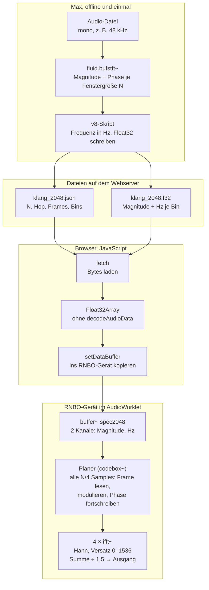

# Offline-Spektralanalyse in Max, Resynthese mit RNBO im Web

Stand: 5. Oktober 2026

## Kurzfassung

Der Plan funktioniert, wenn du drei Dinge änderst. Dann bekommst du in RNBO genau das, was live am schwersten ist: eine frei bewegliche Leseposition (Zeitstreckung, Freeze, Scrubbing) mit sauberer Phase.

1. **Nicht die rohen FFT-Werte speichern, sondern Magnitude und Frequenz pro Bin.** Die Originalphase passt nur, solange du im Originaltempo abspielst. Sobald sich die Leseposition anders bewegt oder zwei Klänge gemorpht werden, muss RNBO die Phase neu fortschreiben – und dafür braucht es die Frequenz jedes Bins. Offline in Max ist sie leicht und exakt zu berechnen.
2. **Nicht als Listen übertragen, sondern als Float32-Binärdateien.** Spektraldaten sind groß (rund 7,7 MB pro 10 Sekunden und Fenstergröße). Der Browser lädt sie per `fetch` und schreibt sie mit `setDataBuffer` direkt ins RNBO-Gerät.
3. **In RNBO keine Vorwärts-FFT mehr, sondern ein Frame-Planer.** Ein codebox~ holt alle N/4 Samples einen Frame an der aktuellen Leseposition, moduliert ihn, schreibt die Phase fort und füttert damit vier `ifft~`-Ketten. Die Rechenlast bleibt klein, weil die teuren Schritte (Analyse, Sortieren, Statistik) schon offline passiert sind.

Ob es eine bessere Lösung gibt, hängt vom Material ab. Stehen die Klänge fest, ist dieser Weg der richtige. Sollen Nutzer eigene Klänge hochladen, läuft dieselbe Analyse besser in einem Web Worker im Browser; die RNBO-Engine bleibt gleich. Für einen Live-Eingang lohnt Vorberechnen kaum – dann bleibt die FFT live in RNBO, und nur Hilfsdaten kommen offline dazu (Abschnitt Alternativen).

## Bewertung: was Vorberechnen bringt

Der Gewinn liegt nicht in der gesparten Vorwärts-FFT – die ist in RNBO billig. Er liegt darin, dass Max offline die ganze Datei auf einmal sieht und alles in Ruhe ausrechnen kann, was RNBO live nur mühsam schafft.

| Vorab in Max | Was es in RNBO ermöglicht |
| --- | --- |
| Spektren aller Frames | freie Leseposition: Zeitstreckung, Freeze, Rückwärts, Scrubbing |
| Frequenz pro Bin aus dem Phasenunterschied | kohärente Phase ohne `framedelta~` |
| Sortier-Indizes, Statistik, Schwellen pro Frame | Frame-Operationen ohne Rechenzeitspitzen |
| Zerlegung (z. B. HPSS), Zeitausrichtung zweier Klänge | getrennte Morphs von Anschlag und Klang, Morph mit passenden Zeitpunkten |

Was Vorberechnen **nicht** bringt: Die Rücktransformation bleibt live, ein Live-Eingang ist nicht möglich, und die Datenmenge steigt stark.

Warum die Frequenz statt der Phase: Max berechnet sie aus dem Phasenunterschied zweier aufeinanderfolgender Analyse-Frames (Abstand Hₐ), korrigiert um den erwarteten Vorschub des Bins. Gespeichert wird sie in Hz, damit die Daten unabhängig von der Samplerate im Browser bleiben.

$$
f_k(m) = \frac{k f_s}{N} + \frac{f_s}{2\pi H_a}\,\operatorname{princarg}\!\Big(\varphi_k(m) - \varphi_k(m-1) - \frac{2\pi k H_a}{N}\Big)
$$

RNBO schreibt daraus bei jedem Ausgabe-Frame die Phase fort, mit dem eigenen Ausgabe-Abstand H und der Samplerate fₛ des Browsers:

$$
\phi_k \leftarrow \phi_k + 2\pi\, f_k\, \frac{H}{f_s}
$$

## Architektur



Max läuft nur einmal pro Klang. Im Browser kopiert `setDataBuffer` die Spektren ins Gerät; der Planer ist die einzige Stelle, an der moduliert wird.

## Schritt 1: Analyse in Max

Am schnellsten geht es mit FluCoMa für die STFT und v8 für Umrechnung und Export. Eine eigene FFT in v8 ist möglich, aber langsamer und mehr Code.

1. **STFT mit `fluid.bufstft~`** pro Fenstergröße, zum Beispiel `windowsize 2048`, `fftsize 2048`, `hopsize 512`. Das Objekt schreibt zwei buffer~: Magnitude und Phase. Laut FluCoMa-Doku sind die Frames dieser Buffer die Analysefenster und die Kanäle die Bins (1 + N/2). Es analysiert nur einen Kanal; Stereo wird also zu zwei Dateien.
2. **Umrechnen und Schreiben im `v8`-Objekt.** Das Skript liest pro Bin die ganze Zeitreihe mit `Buffer.peek`, berechnet die Frequenz nach der Formel oben und schreibt Frame für Frame mit `File.writefloat32` (Byte-Reihenfolge little-endian).
3. **Metadaten als kleine JSON-Datei** daneben: N, Hₐ, Samplerate, Anzahl Frames und Bins, Layout. Der Browser braucht sie, um die Binärdatei zu deuten.

Skizze für das v8-Skript (ungetestet; die Stellen mit „prüfen“ zuerst in Max kontrollieren):

```javascript
// stft_export.js – im [v8]-Objekt (Max 9)
// Voraussetzung: fluid.bufstft~ hat buffer~ <mag> und <phase> gefüllt
// (Frames = Analysefenster, Kanäle = Bins).
function export_stft(magName, phaseName, N, hop, sr, path) {
  const mag = new Buffer(magName);
  const pha = new Buffer(phaseName);
  const frames = mag.framecount();
  const bins = mag.channelcount();            // 1 + N/2
  const TWO_PI = 2 * Math.PI;

  // Pro Bin die ganze Zeitreihe lesen (Kanäle zählen ab 1)
  const M = [], P = [];
  for (let k = 0; k < bins; k++) {
    M.push(mag.peek(k + 1, 0, frames));
    P.push(pha.peek(k + 1, 0, frames));
  }

  const file = new File(path, "write");      // prüfen: Modus, Datei anlegen
  file.byteorder = "little";
  for (let f = 0; f < frames; f++) {
    const row = new Array(bins * 2);
    for (let k = 0; k < bins; k++) {
      let hz = k * sr / N;                      // Bin-Mitte
      if (f > 0) {
        let d = P[k][f] - P[k][f - 1] - TWO_PI * k * hop / N;
        d -= TWO_PI * Math.round(d / TWO_PI);   // princarg
        hz += d * sr / (TWO_PI * hop);          // Abweichung in Hz
      }
      row[2 * k] = M[k][f];                     // Kanal 1: Magnitude
      row[2 * k + 1] = hz;                      // Kanal 2: Frequenz
    }
    file.writefloat32(row);                     // ein Frame pro Aufruf
  }
  file.close();
  post("fertig:", frames, "Frames x", bins, "Bins\n");
}
```

Im Patch: `fluid.bufstft~` mit Quelle, Ziel-Buffern und Fensterwerten auslösen; sobald es fertig meldet, die Nachricht `export_stft mag2048 ph2048 2048 512 48000 klang_2048.f32` an das v8-Objekt schicken. Für jede Fenstergröße wiederholen.

Alternativen für diesen Schritt: eine eigene Radix-2-FFT direkt in v8 (kein Paket nötig, langsamer) oder Node for Max mit `fs` und einer FFT-Bibliothek aus npm, wenn sehr viel Material zu analysieren ist.

## Schritt 2: Datenformat und Größe

Jede Fenstergröße kostet bei 4-fachem Overlap etwa gleich viel Speicher: rund 7,7 MB pro 10 Sekunden Mono-Material, unabhängig von N. Größere Fenster haben mehr Bins, aber entsprechend weniger Frames.

**Layout:** eine Datei pro Klang und Fenstergröße, Float32 little-endian, Frame für Frame. Jeder Frame enthält alle Bins, jeder Bin zwei Werte (Magnitude, Frequenz in Hz). In RNBO wird daraus ein buffer~ mit 2 Kanälen und Frames × Bins Samples; Bin k von Frame f liegt bei Index f · Bins + k.

| N | Hₐ | Frames (10 s, 48 kHz) | Bins | Größe Float32 |
| --- | --- | --- | --- | --- |
| 512 | 128 | 3750 | 257 | 7,7 MB |
| 1024 | 256 | 1875 | 513 | 7,7 MB |
| 2048 | 512 | 938 | 1025 | 7,7 MB |
| 4096 | 1024 | 469 | 2049 | 7,7 MB |

Eine Minute Material sind damit rund 46 MB pro Fenstergröße. Wege, das zu verkleinern: nur die Fenstergrößen exportieren, die du wirklich nutzt; Magnitude in dB auf 16 Bit quantisieren und im Browser zurückrechnen (halbiert die Datei); obere Bins weglassen, wenn das Material dort nichts enthält. N größer als 4096 bringt nichts, weil `ifft~` in RNBO höchstens 4096 Punkte hat.

Beispiel für die Metadaten-Datei:

```json
{
  "N": 2048, "hop": 512, "sr": 48000,
  "frames": 938, "bins": 1025,
  "layout": "frame-major, interleaved [magnitude, hz], float32 LE"
}
```

## Schritt 3: Transfer ins Web

Der Browser lädt Metadaten und Binärdatei, macht daraus ein `Float32Array` und übergibt es mit `setDataBuffer` an das RNBO-Gerät. Laut RNBO-JS-Referenz nimmt diese Methode ein `Float32Array` in verschachteltem Format plus Kanalzahl und Samplerate und kopiert den Inhalt ins Gerät.

```javascript
async function ladeSpektrum(device, name, id) {
  const meta = await (await fetch(`${name}.json`)).json();
  const raw  = await (await fetch(`${name}.f32`)).arrayBuffer();
  const data = new Float32Array(raw);              // little-endian wie geschrieben
  await device.setDataBuffer(id, data, 2, meta.sr); // 2 Kanäle: Magnitude, Hz
  device.parametersById.get("frames").value = meta.frames;
  device.parametersById.get("bins").value = meta.bins;
  return meta;
}

// Beispiel: await ladeSpektrum(device, "klang_2048", "spec2048");
```

Die `id` ist der Name des buffer~ im RNBO-Patch. Frames und Bins kommen als Parameter (oder als Nachricht über ein inport) ins Gerät, damit der Planer weiß, wo ein Frame endet.

Stolpersteine:

- **Nicht `decodeAudioData` benutzen.** Es rechnet Audiodateien auf die Samplerate des AudioContext um und würde die Spektraldaten zerstören. Deshalb Rohdaten statt WAV.
- **Brave:** Das Befüllen mit einem AudioBuffer kann dort hängen; laut Forum hilft genau der Weg über ein `Float32Array`.
- **Ladezeit:** Bei 46 MB pro Minute und Fenstergröße lohnt es, Klänge erst bei Bedarf zu laden und den Server komprimieren und cachen zu lassen.
- **Seite über einen Webserver ausliefern**, nicht als lokale Datei – sonst blockiert der Browser `fetch`.

## Schritt 4: Resynthese und Modulation in RNBO

Die Engine besteht aus einem Frame-Planer in codebox~ und vier `ifft~`-Ketten. Der Planer rechnet alle H = N/4 Samples einen kompletten Ausgabe-Frame; die Ketten machen daraus gleichmäßig Audio. Eine Vorwärts-FFT gibt es nicht mehr.

**Die vier Ketten.** Jede Kette ist ein `ifft~ 2048 2048 <Versatz>` mit Versatz 0, 512, 1024, 1536 und Hann-Fenster. Der dritte Ausgang von `ifft~` ist laut Referenz ein Sync-Signal, das von 0 bis N−1 läuft. Er sagt dir, welchen Bin die Kette gerade erwartet. Jede Kette liest damit aus ihrem eigenen Frame-Speicher (ein `data` mit Real- und Imaginärteil). Die Ausgänge der vier Ketten werden summiert und durch 1,5 geteilt – das gleicht Hann-Analyse mal Hann-Synthese bei 4-fachem Overlap aus.

**Die obere Spektrumhälfte.** Die Daten enthalten nur die Bins 0 bis N/2. Fragt eine Kette nach einem Index k über N/2, liest sie Bin N−k und dreht das Vorzeichen des Imaginärteils um (konjugiert gespiegelt). So bleibt das Ergebnis reell. Ob RNBOs `ifft~` die obere Hälfte überhaupt auswertet, habe ich nicht geprüft; das Spiegeln ist in jedem Fall korrekt.

**Der Planer.** Er läuft immer dann, wenn eine Kette den letzten Bin ihres Frames gelesen hat (Sync = N−1), und füllt ihren Speicher für den nächsten Frame. Entscheidend ist ein **einziger, gemeinsamer Phasenspeicher** für alle Ketten: Er wird bei jedem Aufruf um H weitergeschrieben, egal welche Kette dran ist. Nur so passen die Phasen der vier Ketten beim Aufsummieren zusammen.

Pseudocode (Logik, keine exakte codebox-Syntax):

```javascript
// läuft alle H Samples für die Kette c, deren Frame gerade fertig gelesen ist
pos += speed * H / Ha;                 // Leseposition in Analyse-Frames
const f0 = floor(pos), a = pos - f0;   // Nachbar-Frames und Anteil
for (let k = 0; k < bins; k++) {
  let mag = lerp(magAt(f0, k), magAt(f0 + 1, k), a);
  let hz  = lerp(hzAt(f0, k),  hzAt(f0 + 1, k),  a);
  // → hier modulieren: Morph, Blur, Gate, Tilt, Sortier-Remap …
  phase[k] = wrap(phase[k] + TWO_PI * hz * H / samplerate);
  frameRe[c][k] = mag * cos(phase[k]);
  frameIm[c][k] = mag * sin(phase[k]);
}
```

Die Last ist moderat: eine Schleife über 1025 Bins mit Sinus und Kosinus alle 512 Samples, keine FFT. Im Web bedeutet das bei 128er-Blöcken eine solche Schleife in jedem vierten Block.

Wo die Modulationen ansetzen:

| Modulation | Wie im Planer |
| --- | --- |
| Zeitstreckung, Freeze, Rückwärts, Scrubbing | nur `speed` bzw. `pos` ändern; Freeze = speed 0 |
| Morph zwischen zwei Klängen | zweiter Buffer; Magnitude in dB und Frequenz interpolieren |
| Unterschiedlich lange Klänge | Position proportional abbilden oder einen offline berechneten Ausrichtungspfad lesen |
| Spectral Sorting | Sortier-Index pro Frame offline berechnen und als dritten Kanal speichern; Planer liest Bin `idx[k]` statt `k` |
| Blur | Magnitude pro Bin über die Aufrufe glätten (eigener Speicher) |
| Gate, Tilt, Maske, Spectral Mutation | pro Bin in der Schleife |
| Auflösen in Rauschen | Zufallswert zur Phase addieren |

Alternative ohne `ifft~`: eine komplette eigene Engine mit `fftbuffer` in codebox~. Die RNBO-Doku beschreibt `fftbuffer` als In-place-FFT auf verschachtelten Real- und Imaginärwerten, nennt aber keine inverse Variante. Die Rücktransformation ginge über den Konjugations-Trick, dafür fiele die ganze FFT in ein einziges Sample. Für den Anfang ist der Weg mit `ifft~`-Ketten einfacher und gleichmäßiger in der Last.

## Mehrere Fenstergrößen sinnvoll nutzen

Zwei Fenstergrößen reichen fast immer, etwa 512 und 2048 (oder 4096). Jede weitere kostet eine komplette zweite Engine und eine weitere Datei pro Klang.

Die Größe von `ifft~` ist in RNBO ein festes Attribut und lässt sich zur Laufzeit nicht ändern. Jede Fenstergröße braucht also ihren eigenen Planer, ihre vier Ketten und ihren Buffer; CPU und Ladezeit addieren sich. Bins verschiedener Fenstergrößen liegen außerdem auf verschiedenen Frequenzrastern und lassen sich nicht direkt mischen. Übergänge zwischen Auflösungen sind deshalb ein Crossfade der fertigen Audiosignale.

Drei Einsatzarten lohnen sich:

- **Pro Klang wählen:** Perkussives mit 512, Tonales mit 2048 oder 4096. Im Gerät läuft dann pro Klang nur eine Engine.
- **Mehrfachauflösung:** Offline mit `fluid.bufhpss~` in Anschlag und tonalen Anteil trennen; den Anschlag mit 512 analysieren, den tonalen Teil mit 4096. Beide Engines laufen parallel und werden summiert – scharfe Attacken und saubere Töne zugleich, und beide Anteile lassen sich getrennt modulieren.
- **Auflösung als Morph-Achse:** Ein Crossfade von der 512er- zur 4096er-Engine lässt einen Klang von knackig zu verschmiert fließen. Das ist ein eigener Verwandlungseffekt, kein technischer Kompromiss.

## Alternativen im Vergleich

Die Wahl hängt vor allem an einer Frage: Steht das Klangmaterial vorher fest, oder kommt es erst im Browser dazu? B und C nutzen dieselbe RNBO-Engine und unterscheiden sich nur darin, wo analysiert wird.

| Variante | Passt, wenn | Vorteil | Nachteil | Aufwand |
| --- | --- | --- | --- | --- |
| A: Dein Plan wörtlich (rohe FFT-Werte als Listen) | nur Wiedergabe im Originaltempo | schnell gebaut | große Textdateien; Phase bricht bei Zeit- und Morph-Modulation | gering |
| **B: Magnitude + Frequenz binär, Planer + `ifft~` (empfohlen)** | feste Klänge, Zeit- und Morph-Spiel | freie Leseposition, saubere Phase, Frame-Operationen offline | ca. 7,7 MB pro 10 s und Fenstergröße; kein Live-Eingang | mittel |
| C: Analyse im Browser (Web Worker) | Nutzer laden eigene Klänge | keine vorbereiteten Dateien, beliebiges Material | FFT und Frequenzberechnung in JavaScript selbst schreiben; Wartezeit beim Laden | mittel |
| D: Live-FFT in RNBO, nur Hilfsdaten vorab | Live-Eingang (Mikrofon) | wenig Daten, echte Live-Verwandlung | Zeitstreckung bleibt schwer | mittel |
| E: Ohne RNBO, eigener AudioWorklet in JS/WASM | nur das Web als Ziel | volle Kontrolle, echter Hop, eigene FFT-Größen | kein Patchen in Max, kein Export zu Plugin oder Pi | hoch |

Für die meisten Metamorphose-Projekte mit festem Material ist B der beste Start. C lässt sich später ergänzen, ohne die Engine anzufassen: Der Web Worker liefert dieselben Float32-Daten, die sonst aus Max kämen.

## Offene Punkte und erste Tests

Der erste Test ist ein Nulltest: Tempo 1, keine Modulation, und das Ergebnis muss wie das Original klingen. Er deckt Skalierungs-, Fenster- und Spiegelungsfehler auf, bevor du Effekte baust.

- [ ] **Nulltest:** Ausgabe gegen Original vergleichen (Pegel, Klangfarbe, Phasigkeit). Kalibriert den Faktor zwischen FluCoMa-Magnituden und RNBOs `ifft~` sowie die Normalisierung durch 1,5.
- [ ] **`ifft~` prüfen:** Erwartet es N Bins pro Frame? Läuft der Sync-Ausgang exakt im Takt der Eingabe? Wertet es die obere Spektrumhälfte aus?
- [ ] **v8-Export prüfen:** Legt `new File(path, "write")` die Datei an? Kommen große Dateien vollständig an (Größe = Frames × Bins × 2 × 4 Byte)?
- [ ] **FluCoMa prüfen:** Skalierung der Magnituden und Bezugspunkt der Phase von `fluid.bufstft~`.
- [ ] **Zeitstreckung testen:** speed 0,25 und 0 (Freeze) – klingt es sauber, oder flattert es? Wenn es flattert, liegt es fast immer am Phasenspeicher (muss gemeinsam für alle Ketten sein).
- [ ] **CPU im Browser messen:** Desktop und Handy, N = 2048 mit einem und mit zwei Klängen.
- [ ] **Laden testen:** eine Minute Material (rund 46 MB pro Fenstergröße), in Chrome, Firefox, Safari und Brave.

Nicht geprüft habe ich die exakte codebox-Syntax für den Planer; der Pseudocode zeigt die Logik. Die FluCoMa-Attributnamen in Max können leicht abweichen.

## Quellen

- [RNBO: ifftstream~ (Argumente, Sync-Ausgang, feste Größe)](https://rnbo.cycling74.com/objects/ref/ifftstream~)
- [RNBO: codebox ifftstream](https://rnbo.cycling74.com/codebox/ref/ifftstream)
- [RNBO: Using the FFT (fftbuffer, codebox)](https://rnbo.cycling74.com/learn/using-the-fft)
- [RNBO JS: BaseDevice (setDataBuffer)](https://rnbo.cycling74.com/js/ref/js/BaseDevice)
- [RNBO JS: WorkletDevice](https://rnbo.cycling74.com/js/ref/js/WorkletDevice)
- [RNBO: Buffers and File Dependencies](https://rnbo.cycling74.com/learn/buffers-and-file-dependencies)
- [Forum: Web Capabilities (Brave, Float32Array)](https://cycling74.com/forums/web-capabilities)
- [FluCoMa: BufSTFT](https://learn.flucoma.org/reference/bufstft/)
- [FluCoMa-Doku: Buffer-Layout von BufSTFT](https://github.com/flucoma/flucoma-docs/pull/112/files)
- [Max JS API: Buffer (Max 9, v8)](https://docs.cycling74.com/apiref/js/buffer/)
- [Max JS API: File (writefloat32, byteorder)](https://docs.cycling74.com/api/latest/max8/vignettes/jsfileobject)
