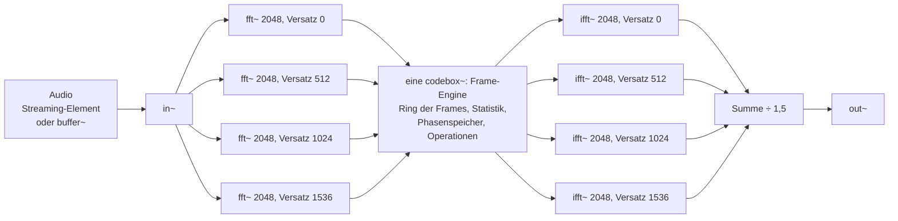

# Live-Spektralengine in RNBO fürs Handy

**Ziel:** pfft~-artige Möglichkeiten (Nachbar-Bins, frameweite Operationen, Vorframes) im RNBO-Web-Export, ohne Vorberechnung, für bis zu 7 Minuten vordefiniertes Material, hauptsächlich auf dem Handy.

Stand: 5. Oktober 2026

## Entscheidung: live statt Vorberechnung im Browser

Für 7 Minuten Material auf dem Handy ist die Live-Berechnung klar die bessere Lösung. Weg C (Analyse im Browser) scheitert hier nicht an der Ladezeit, sondern am Speicher und an der Rechenzeit:

| | Weg C (Analyse im Browser) | Live in RNBO |
| --- | --- | --- |
| Arbeitsspeicher für 7 min Mono | ca. 323 MB pro Fenstergröße (Spektren als Float32) | nur das Audio: beim Streamen wenige MB, als Buffer ca. 81 MB |
| Analyse vor dem Start | geschätzt 17–34 s pro Fenstergröße auf dem Handy | keine |
| Nachbar-Bins, frameweite Operationen | ja | ja, mit 1–2 Frames Verzögerung |
| Freeze | ja | ja |
| Zeitstreckung, Scrubbing, Rückwärts | ja | später nachrüstbar (8 statt 4 FFT-Ketten) |

Der Preis der Live-Lösung ist Verzögerung: Wer den ganzen Frame sehen will, muss warten, bis er vollständig ist. Bei vordefiniertem Material, das abgespielt wird, ist diese Verzögerung unerheblich – es gibt keinen Live-Eingang, der „zu spät“ klingen könnte. Nur Regler reagieren etwas träger.

Weg C wäre die bessere Wahl bei kurzem Material (unter einer Minute), am Desktop, oder wenn Zeitkontrolle von Anfang an zentral ist.

## Was pfft~ kann und wie es live nachgebaut wird

Der Kern der Lösung: **Jede Kette liest einen Frame ein und gibt gleichzeitig den vorigen Frame aus.** Während ein Frame Bin für Bin hereinkommt, ist der vorige schon vollständig im Speicher – mit freiem Zugriff auf alle seine Bins, seine Statistik und die Frames davor.

| pfft~-Fähigkeit | Live-Nachbau in RNBO | Zusätzliche Verzögerung |
| --- | --- | --- |
| Overlap in einer Kette | vier versetzte `fft~`/`ifft~`-Ketten, **eine** gemeinsame codebox~ | – |
| Vorframe (`framedelta~`) | Ring der letzten Frames aller Ketten, Abstand H = N/4 | – |
| Phase fortschreiben (`frameaccum~`) | gemeinsamer Phasenspeicher, Bin für Bin nachgeführt | – |
| Nachbar-Bins | Frame vollständig puffern, beim Ausgeben frei lesen | 1 Frame |
| Frameweite Statistik (Maximum, Summe, Schwerpunkt) | beim Einlesen aufsummieren, beim Ausgeben anwenden | 1 Frame |
| Sortieren nach Magnitude | Histogramm-Rang, dann Verteilen | 2 Frames |

Ein Frame dauert bei N = 2048 und 48 kHz etwa 43 ms. Die Gesamtverzögerung der Kette (FFT, Puffer, IFFT) liegt damit grob bei 100–200 ms; das sollte im Test gemessen werden.

## Architektur



Wichtig sind zwei Entscheidungen:

- **Eine einzige codebox~ für alle vier Ketten.** Sie bekommt von jeder Kette Real, Imaginär und Bin-Index (12 Eingänge) und liefert jeder Kette Real und Imaginär zurück (8 Ausgänge). So teilen sich alle Ketten denselben Frame-Ring und denselben Phasenspeicher, ohne Umwege.
- **`fft~` und `ifft~` derselben Kette haben dieselbe Größe und denselben Versatz.** Seit RNBO 1.4.0 laufen alle FFT-Objekte am globalen Sample-Zähler ausgerichtet. Dann erwartet das `ifft~` in jedem Sample genau den Bin-Index, den das `fft~` gerade liefert. Das lässt sich mit den Sync- bzw. Index-Ausgängen beider Objekte prüfen.

Hann-Fenster auf allen `fft~` und `ifft~`; die Summe der vier Ketten wird durch 1,5 geteilt (Hann × Hann bei 4-fachem Overlap).

## Das Zwei-Pass-Prinzip

Jede Kette macht in jedem Sample zwei Dinge:

```
Sample t, Kette c, Bin-Index j (kommt von fft~):

  EINLESEN   Bin j von Frame g  → in den Ring schreiben (Magnitude, Phase)
                                → Statistik von Frame g fortschreiben
  AUSGEBEN   Bin j von Frame g−1 → aus dem Ring lesen, beliebig bearbeiten
                                → an ifft~ geben

Am Frame-Ende (j = N−1): Statistik von Frame g abschließen (wenige Operationen)
```

Weil jede Kette pro Sample nur einen Bin einliest und einen ausgibt, bleibt die Rechenlast gleichmäßig. Es gibt keine Schleife über den ganzen Frame in einem einzigen Sample – das ist auf dem Handy mit 128er-Audioblöcken entscheidend. Die einzigen Lastspitzen sind die FFTs selbst, die RNBO intern blockweise rechnet; durch den Versatz der vier Ketten fallen sie auf verschiedene Zeitpunkte.

Die Ketten ergänzen sich: Kette c+1 analysiert dasselbe Signal H Samples später als Kette c. Im gemeinsamen Ring liegen die Frames deshalb im Abstand H hintereinander – genau wie in einem pfft~ mit Overlap 4. Ein globaler Zähler g zählt die Frames über alle Ketten.

## Speicher in der codebox~

| Speicher | Inhalt | Größe bei N = 2048 |
| --- | --- | --- |
| Frame-Ring | Magnitude und Phase der letzten R Frames (z. B. R = 16) | 16 × 1025 × 2 Werte |
| Statistik pro Frame | Maximum, Summe, Schwerpunkt, Histogramm (z. B. 128 Klassen) | klein |
| Phasenspeicher | letzte Ausgabephase pro Bin | 1025 Werte |
| Ausgabe pro Kette | berechneter Frame (für die gespiegelte obere Hälfte) | 4 × 1025 × 2 Werte |
| Sortier-Puffer | zwei verteilte Frames pro Kette (doppelt gepuffert) | 4 × 2 × 1025 Werte |

Zusammen sind das einige hunderttausend Werte, also wenige MB – unkritisch auch auf dem Handy.

## Operationen nach Klasse

| Klasse | Beispiele | Verzögerung | Last pro Sample |
| --- | --- | --- | --- |
| A: pro Bin | Gate, Tilt, Maske, Cross-Synthese, Spectral Mutation, Sieb-Crossfade, Spatialisierung | – (oder 1 Frame im Puffer-Pfad) | konstant |
| B: Nachbar-Bins | symmetrische Glättung (Hüllkurve), Peak-Erkennung, Bin-Shift, Warping, Spektralableitung | 1 Frame | proportional zur Fensterbreite |
| C: frameweite Statistik | Normalisieren, Gate relativ zum Frame-Maximum, Top-N per Histogramm-Schwelle, Schwerpunkt als Steuersignal | 1 Frame | konstant |
| D: Rang und Sortieren | Spectral Sorting, Rang-Remapping | 2 Frames | konstant |
| E: über mehrere Frames | Blur, Peak-Hold, Median über die Zeit (HPSS-Ersatz), Spectral Delay | – (Ring) | proportional zur Länge |
| F: phasenkohärent | Frequenz pro Bin, Freeze, Bin-Shift mit Phasenkorrektur | – (Ring) | konstant |

Hinweise zu den Klassen:

- **B, Nachbar-Bins:** Bei der Ausgabe von Bin j sind alle Bins von Frame g−1 schon im Ring, auch j+1, j+2 usw. Eine Glättung über ±w Bins kostet 2w+1 Lesezugriffe pro Sample; für w bis etwa 8 ist das harmlos.
- **C, Statistik:** Maximum, Summe und Schwerpunkt entstehen beim Einlesen nebenbei. Für Top-N zählt das Histogramm die Bins pro dB-Klasse; am Frame-Ende ergibt eine kurze Schleife über 128 Klassen die Schwelle, über der genau N Bins liegen.
- **E, über mehrere Frames:** Der Ring liefert die Vorgänger im Abstand H. Ein Median über die letzten 7 Frames pro Bin (für die Trennung tonal/perkussiv) braucht pro Sample ein kleines Sortiernetz mit 16 Vergleichen.
- **F, Frequenz pro Bin:** Die Phasendifferenz zwischen zwei aufeinanderfolgenden Ring-Frames (Abstand H) ergibt die Frequenz – ohne zusätzliche FFT. Das ist die Grundlage für Freeze und für phasenkorrektes Verschieben.

```latex
f_k(g) = \frac{k f_s}{N} + \frac{f_s}{2\pi H}\,\operatorname{princarg}\!\Big(\varphi_k(g) - \varphi_k(g-1) - \frac{2\pi k H}{N}\Big)
```

## Pseudocode der Frame-Engine

Logik, keine exakte codebox-Syntax. Läuft in jedem Sample einmal pro Kette c.

```javascript
// Eingang von Kette c: re, im, j (Bin-Index 0 … N−1)
// g[c] = globale Nummer des Frames, den Kette c gerade einliest

// ---------- EINLESEN: Frame g[c] ----------
if (j <= N / 2) {
  const mag = Math.hypot(re, im), ph = Math.atan2(im, re);
  ring.mag[slot(g[c])][j] = mag;
  ring.ph[slot(g[c])][j]  = ph;
  stats[c].sum += mag;  stats[c].max = Math.max(stats[c].max, mag);
  stats[c].hist[dbClass(mag)]++;
}

// ---------- AUSGEBEN: Frame g[c] − 1 (vollständig im Ring) ----------
const G = g[c] - 1;
let outRe, outIm;
if (j <= N / 2) {
  let m = ring.mag[slot(G)][j];

  // Klasse B: Nachbarn, z. B. Glättung über ±w Bins
  // m = mittel(ring.mag[slot(G)][j - w … j + w]);

  // Klasse C: Statistik des fertigen Frames G
  // if (m < frameStats(G).topNThreshold) m = 0;

  // Klasse F: Frequenz aus zwei Ring-Frames im Abstand H
  const f = binFreq(ring.ph[slot(G)][j], ring.ph[slot(G - 1)][j], j);

  // Ausgabephase: gemeinsamer Speicher, von Frame G−1 auf G fortschreiben
  phase[j] = freeze ? wrap(phase[j] + TWO_PI * f * H / samplerate)
                    : ring.ph[slot(G)][j];          // Originalphase

  outRe = m * Math.cos(phase[j]);
  outIm = m * Math.sin(phase[j]);
  outFrame[c][j] = [outRe, outIm];                  // für die Spiegelung merken
} else {
  // obere Hälfte: konjugiert gespiegelt, damit das Ergebnis reell bleibt
  const [r, i] = outFrame[c][N - j];
  outRe = r;  outIm = -i;
}
// → outRe, outIm an ifft~ von Kette c

// ---------- FRAME-ENDE ----------
if (j === N - 1) {
  finalizeStats(c);          // z. B. Top-N-Schwelle aus 128 Histogrammklassen
  g[c] += 4;                 // nächster Frame dieser Kette (4 Ketten, Abstand H)
}
```

Der gemeinsame Phasenspeicher funktioniert ohne Lastspitze, weil die Kette mit Frame G−1 genau H Samples Vorsprung hat: Wenn Kette c Bin j von Frame G schreibt, hat die vorige Kette Bin j von Frame G−1 schon geschrieben. Jeder Bin wird also in der richtigen Reihenfolge fortgeschrieben.

## Sortieren ohne Lastspitze

Echtes Sortieren von 1025 Werten in einem Sample wäre auf dem Handy riskant. Stattdessen ein Rang per Histogramm, verteilt auf drei Durchläufe:

1. **Frame g einlesen:** jeden Bin einer von 128 dB-Klassen zuordnen, Klassen zählen.
2. **Frame-Ende:** Startposition jeder Klasse aus den Zählern berechnen (eine Schleife über 128 Werte).
3. **Während des nächsten Frames:** pro Sample einen Bin von Frame g an seine Rangposition in den Sortier-Puffer schreiben.
4. **Einen Frame später:** den sortierten Puffer Bin für Bin ausgeben.

Innerhalb einer Klasse bleibt die ursprüngliche Reihenfolge erhalten. Bei 128 Klassen über etwa 100 dB sind das weniger als 1 dB pro Klasse – für Sorting-Effekte ist das hörbar gleichwertig zu einer echten Sortierung. Kosten: 2 Frames Verzögerung, konstante Last.

## Audio-Zuspielung am Handy

Für 7 Minuten Material empfehle ich **Streaming über ein Audio-Element** statt eines dekodierten Buffers:

| | Streaming (Audio-Element → RNBO-Eingang) | buffer~ im Gerät |
| --- | --- | --- |
| Start | nach wenigen Sekunden, lädt beim Abspielen nach | erst nach Download und Dekodieren |
| Speicher | gering | ca. 81 MB pro 7 min Mono, Stereo doppelt |
| Zeitkontrolle | nur Freeze | später auch Zeitstreckung und Scrubbing |
| Zwei Klänge morphen | zwei Elemente, nicht samplegenau synchron | samplegenau |

```javascript
const ctx = new AudioContext();
const device = await RNBO.createDevice({ context: ctx, patcher });
device.node.connect(ctx.destination);

const el = new Audio("szene1.m4a");
el.crossOrigin = "anonymous";              // sonst bei fremder Domain nur Stille
const src = ctx.createMediaElementSource(el);
src.connect(device.node);                  // in~ des RNBO-Geräts

startButton.onclick = async () => {        // Audio erst nach Nutzergeste
  await ctx.resume();
  el.play();
};
```

Hinweise:

- **Format:** AAC mit 256 kbit/s sind für 7 Minuten etwa 13 MB. FLAC ist verlustfrei, aber etwa doppelt so groß. Verlustbehaftete Codecs entfernen verdeckte Spektralanteile; bei starkem Anheben leiser Bins können Codec-Spuren hörbar werden. Im Test entscheiden.
- **CORS:** Liegt das Audio auf einer anderen Domain, muss der Server CORS-Header senden und das Element `crossOrigin` gesetzt haben, sonst liefert die Quelle nur Stille.
- **iOS:** Den AudioContext erst nach einer Berührung starten. Ob der Stummschalter des iPhones die Wiedergabe unterdrückt, auf echten Geräten prüfen.
- **Stereo** verdoppelt die Ketten und die Last. Für die Verwandlung reicht oft Mono oder der Mittenanteil.
- Für Szenen, die später Zeitkontrolle brauchen, nur diese Szene als buffer~ laden (eine Minute Mono sind etwa 11,5 MB).

## Parameter fürs Handy

- **Start mit N = 2048, 4-fach Overlap.** Das sind pro 512 Samples eine Vorwärts- und eine Rückwärts-FFT plus die konstante Arbeit der Frame-Engine. Falls es knackt: N = 1024 als Rückfallebene.
- **Mono verarbeiten**, Stereo nur, wenn es klanglich nötig ist.
- **Operationen schaltbar machen**, damit sich im Test messen lässt, welche Klasse wie viel kostet.
- **Latenz-Hinweis im AudioContext:** `latencyHint: "playback"` gibt dem Browser mehr Puffer und federt einzelne Ausreißer ab. Bei vordefiniertem Material kostet das nichts.

## Später: Zeitkontrolle nachrüsten

Die Architektur ist so gebaut, dass Zeitkontrolle ohne Umbau dazukommen kann:

1. **Freeze geht sofort**, auch beim Streaming: Magnituden eines Frames halten, Phase mit der Frequenz aus dem Ring fortschreiben (Klasse F).
2. **Zeitstreckung, Scrubbing, Rückwärts** brauchen die Szene als buffer~ und eine Leseposition: Jede Kette liest ihr Analysefenster an der gewünschten Stelle aus dem Buffer. Weil aufeinanderfolgende Frames dann nicht mehr H Samples auseinanderliegen, braucht jede Kette eine zweite Analyse H Samples später, um die Frequenz zu bestimmen – also 8 `fft~` statt 4. Der gemeinsame Phasenspeicher bleibt gleich.
3. **Morph zwischen Klängen mit unterschiedlichem Timing** baut auf Schritt 2 auf: zwei Lesepositionen, eine pro Klang.

Ob 8 FFT-Ketten auf dem Handy laufen, ist der erste Test, wenn es so weit ist.

## Erste Tests

- [ ] **Nulltest:** keine Operation, Ausgabe gegen Original. Prüft Fenster, Normalisierung (÷ 1,5) und Spiegelung der oberen Hälfte.
- [ ] **Index-Gleichlauf:** Liefern `fft~` und `ifft~` jeder Kette im selben Sample denselben Bin-Index?
- [ ] **Ring-Reihenfolge:** Liegen aufeinanderfolgende Ring-Frames wirklich H Samples auseinander? Test: Freeze eines Sinustons muss stehen, nicht schweben.
- [ ] **CPU am Handy:** zuerst nur die Ketten, dann Klasse für Klasse zuschalten; Ziel ist deutlicher Abstand zum Knacken.
- [ ] **Latenz messen:** Klick im Material gegen Klick am Ausgang.
- [ ] **Streaming:** 7 Minuten am Stück, auch mit Display aus und Tab im Hintergrund; iOS Safari und Android Chrome.
- [ ] **codebox-Syntax:** Der Pseudocode zeigt die Logik; Datenstrukturen (Arrays im Ring) in RNBO-codebox umsetzen und die Grenzen für Eingänge, Ausgänge und Speicher prüfen.

Gemessen habe ich nur die JavaScript-Analysezeit, die in die Schätzung für Weg C eingeht (etwa 0,2 s pro 10 s und Fenstergröße auf einem Server-Prozessor). Alle Handy-Werte und die Machbarkeit der Engine in RNBO sind Einschätzungen, keine Tests.

## Quellen

- [RNBO: Using the FFT (Overlap über versetzte Ketten, fftbuffer, Ausrichtung der FFTs)](https://rnbo.cycling74.com/learn/using-the-fft)
- [RNBO: fftstream~ (Argumente, Bin-Index-Ausgang, Abstand ≥ Größe)](https://rnbo.cycling74.com/objects/ref/fftstream~)
- [RNBO: ifftstream~ (Sync-Ausgang, feste Größe)](https://rnbo.cycling74.com/objects/ref/ifftstream~)
- [RNBO 1.4.0 Release Notes (FFT-Objekte am globalen Sample-Zähler ausgerichtet)](https://cycling74.com/releases/rnbo/1.4.0)
- [RNBO JS: WorkletDevice](https://rnbo.cycling74.com/js/ref/js/WorkletDevice)
- [RNBO: Working with Web Audio Contexts](https://rnbo.cycling74.com/learn/working-with-web-audio-contexts)
- [RNBO: Loading a RNBO Device in the Browser](https://rnbo.cycling74.com/learn/loading-a-rnbo-device-in-the-browser-js)
- [Forum: Phase vocoder in RNBO – Hop kleiner als FFT-Größe?](https://cycling74.com/forums/phase-vocoder-in-rnbo-is-a-hop-size-smaller-than-the-fft-size-possible)
