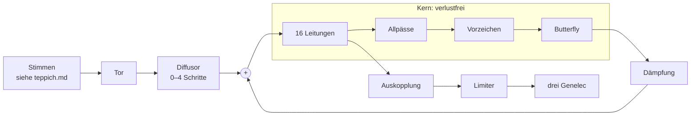

# FDN — das Netz auf dem Installationsrechner

Stand 2026-09-29. **Nichts davon ist gebaut.**

**Was hier steht:** was für wwww entschieden, vorgeschlagen und offen ist.

**Was hier nicht steht:** wie ein FDN funktioniert. Das erklären sieben Learning-Dateien. Verweise wie „Teil 3 §5“ zeigen auf ihre Abschnitte.

| Teil | Datei | Worum es geht |
|---|---|---|
| 1 | `learning\max-msp\fdn-1-schleife-und-matrix.md` | Leitungen, Matrix, warum orthogonal, Nachhallzeit |
| 2 | `learning\max-msp\fdn-2-allpass-und-diffusion.md` | Allpässe, Diffusor nach Signalsmith, frühe Reflexionen |
| 3 | `learning\max-msp\fdn-3-drehen-statt-ueberblenden.md` | der Hadamard-Weg, der Regler `d`, frequenzabhängige Drehung |
| 4 | `learning\max-msp\fdn-4-freeze-und-rueckwaerts.md` | Freeze, Rückwärtslauf, Senke, Integer-Netz |
| 5 | `learning\max-msp\fdn-5-netze-bauen.md` | Topologien, Stellschrauben, Varianten |
| 6 | `learning\max-msp\fdn-6-rauschen-aus-der-schleife.md` | Rauschen, Verschlucken, einmal klar |
| 7 | `learning\max-msp\fdn-7-bau-in-gen.md` | der Bau in `gen~`, Messen |

**Verwandt:** `teppich.md` (wozu das Netz dient), `kommunikation.md` (Handys, Mikrofon, Genelec), `modelle.md` (welches Modell wo rechnet), `data\noise-invertierbarkeit.md` (die Quelle für Rauschen und Umkehrbarkeit).

---

## Festgelegt

| Was | Wie | Erklärt in |
|---|---|---|
| ein FDN auf dem Installationsrechner | in Max, in einem `gen~` | Teil 7 §1 |
| ein Bau, viele Varianten | jede Variante ist eine Einstellung desselben Patches | Teil 5 §4 |
| **der Hadamard-Weg** | die Matrix ist ein Butterfly aus Drehungen; alle Winkel sind `d` · 45° | Teil 3 §4–5 |
| **16 Leitungen** | im Betrieb 4, 8 oder 16 | Teil 3 §4 |
| Zweck | ein Rauschteppich, siehe `teppich.md` | — |

---

## Vorgeschlagen, nicht bestätigt

### Die Grundregel

Der Kern bleibt verlustfrei, damit der Freeze hält. Alles, was die Energie ändert, sitzt daneben und lässt sich abschalten. Im Rückwärtslauf darf alles bleiben, was bijektiv ist. Welcher Baustein wofür taugt, zeigt Teil 4 §16.

### Der Aufbau

| Stufe | Was sie tut | Erklärt in |
|---|---|---|
| Tor | lässt eine Stimme ins Netz und zeichnet auf, was hineingeht | Teil 4 §15 |
| Diffusor | macht aus jedem Echo viele, ohne Fahne | Teil 2 §6 |
| Leitungen | 16 Delays als `Data` mit eigenem Zeiger | Teil 7 §2 |
| Allpässe, Vorzeichen, Körner-Tausch | lassen den Klang pro Umlauf zerfließen | Teil 2 §3, Teil 4 §10 |
| Butterfly | mischt die Leitungen, Menge nach `d` | Teil 3 §4–5 |
| Dämpfung | Nachhallzeit, abschaltbar für den Freeze | Teil 1 §7, Teil 4 §4 |
| Auskopplung | welche Leitung auf welches Genelec | Teil 4 §12 |
| Limiter | hinter der Auskopplung, nie im Kreis | — |

### Der Regler `d`

`d` steuert drei Dinge nacheinander, wie in Teil 3 §5:

| `d` | was sich bewegt |
|---|---|
| 0,0 bis 0,5 | Winkel der Drehungen, 0° → 45° |
| 0,3 bis 0,8 | Allpass-Koeffizient, 0 → 0,85 |
| 0,7 bis 1,0 | Vorzeichen-Wechsel, aus → alle 500 Samples → jedes Sample |

Die Bereiche werden mit dem Crest-Faktor kalibriert.

### Kollaps

Die Geste hat vier Zustände: **Fangen** (Tor kurz offen) → **Auflösen** (`d` steigt) → **Halten** (Freeze) → **Zurückholen** (Richtung zurück). Was man hört und was dafür gelten muss, steht in Teil 4 §12–15.

### Steuerung

Alle Einträge sind Beispiele.

| Regler | Quelle | Beispiel |
|---|---|---|
| `d` | Kamera | viel Bewegung im Bild, mehr Auflösung |
| Nachhallzeit | Raummikrofon, `fluid.loudness~` | lauter Raum, kürzere Fahne |
| Verteilung auf die Leitungen | Handys | die Zahl der Handys an jedem der 12 Punkte gewichtet je eine Leitung |
| Fangen, Zurückholen | offen | eine Geste oder ein Zeitplan |

### Reihenfolge des Baus

1. Leitungen und Butterfly, `d` und Freeze. Test: Energie des Zustands über 10 Minuten.
2. Allpässe, Vorzeichen, Dämpfung. Damit gehen Echo, Resonator, Hall und Wolke aus Teil 5 §4.
3. Diffusor und frühe Reflexionen. Der Signalsmith-Hall ist der Vergleichsklang.
4. Kollaps zuerst als Probe mit `buffer~`: Wolke aufnehmen, rückwärts abspielen, hören, ob die Geste trägt.
5. Erst dann der Rückwärtsschritt im `gen~`.
6. Färbung, Kopplung, Streuung, Senken.
7. Zuletzt das komplexe Netz und das Integer-Netz.

Die Tests stehen in Teil 7 §9.

---

## Was für den Bau gilt

- **Dämpfung und Färbung außerhalb des Kerns sind Schalter.** Für den Freeze werden sie umgangen, nicht auf fast null gestellt.
- **Zwischen Matrizen wird nie überblendet**, nur Winkel (Teil 3 §2).
- **Das Raummikrofon geht nicht als Audio ins Netz.** `kommunikation.md`: Das Mikrofon wird gemessen, nicht verstärkt.
- **Der Limiter steht hinter der Auskopplung.**

## Bewusst nicht drin

| Draußen | Warum |
|---|---|
| die Matrix überblenden | in der Mitte des Reglers verschwindet die Hälfte der Energie (Teil 3 §2) |
| `N` = 12 mit Drehungen in Runden | am 2026-09-28 für den Hadamard-Weg verworfen; die 12 Punkte wirken über die Verteilung auf die Leitungen |
| Bau in MSP mit `tapin~`, `tapout~` und `matrix~` | Teil 7 §1 |
| `mc.gen~` mit einer Instanz pro Leitung | Teil 7 §1 |

## Was offen ist

- **Wer Fangen und Zurückholen auslöst:** eine Geste, ein Zeitplan oder beides. „Zeit drehen“ ist in `specs\wwww-threejs\steuerung.md` schon abgelehnt, das Drehen gehört dort Parameter 3.
- **Welche Varianten die Installation zeigt und wann sie wechseln.**
- **Ob `Data` in `gen~` 64 Bit speichert.** Davon hängt ab, wie genau der Rückwärtslauf ist.
- **Ob `gen~` bitweise Operatoren hat.** Das Integer-Netz braucht sie.
- **Ob `gen~` im Runtime-Modus läuft**, offen in `specs\mac-mini\konzept.md`.

## Quellen

| Quelle | Wofür | Stand |
|---|---|---|
| Signalsmith, „Let's Write A Reverb“ (Geraint Luff, 2021) | Diffusionsschritt, Householder in der Schleife, frühe Reflexionen, Modulation, Shelf | gelesen, PDF in `data\scans\mathe\` |
| `data\noise-invertierbarkeit.md` mit dem Chat vom 20.09.2026 in `specs\wwww-rnbo\raw\20260808 infos allgemein.md` | Umkehrbarkeit, Freeze, Rauschen | gelesen |
| `gen~.gigaverb.maxpat` in `C:\Program Files\Cycling '74\Max 9\examples\gen\` | ein fertiges FDN in `gen~` (Teil 1 §9) | geöffnet, Verbindungen verfolgt |
| arXiv 2210.14015, Bharath u. a., „Design of Discrete-time Matrix All-Pass Filters Using Subspace Nevanlinna Pick Interpolation“ | frequenzabhängige orthogonale Matrizen nach Maß | Abstract gelesen |
| `ccrma.stanford.edu/~jos/pasp/Feedback_Delay_Networks_FDN.html` | FDN, unitäre Matrix | aus Überlegung 1, nicht gelesen |
| `ccrma.stanford.edu/~jos/smith-nam/Householder_Feedback_Matrix.html` | Householder mit Permutation | aus Überlegung 1, nicht gelesen |
| `minhdo.ece.illinois.edu/publications/special_cayley.pdf` | paraunitäre Matrizen, Cayley | aus Überlegung 1, nicht gelesen; die Formel aus dem Gedächtnis |
| UA Opal, ADPTR Utopia | Vorbilder für Morphing | nicht angesehen |
| Schroeder 1962; Stautner und Puckette 1982; Jot 1991; Gerzon 1976; Gardner; Dattorro 1997; Schlecht und Habets; Das und Abel | die Topologien in Teil 5 | aus dem Gedächtnis genannt, nicht nachgelesen |
