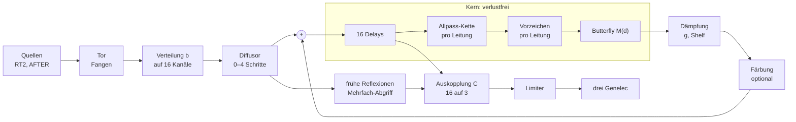

# FDN — ein Netz aus Schleifen auf dem Installationsrechner

Ausgearbeitet im Gespräch am 2026-09-28. **Nichts davon ist gebaut.**

**Die Regel, aus der alles folgt:** Der Kern ist verlustfrei. Alles, was die Energie ändert, sitzt außerhalb des Kerns und lässt sich ganz abschalten. Eine Färbung, die die Energie erhält, darf in den Kern: bewegte Winkel, Körner-Tausch, Frequenzshift als laufende Drehung.

Verlustfrei heißt: Die Rückführmatrix ist **unitär**, bei reellen Zahlen **orthogonal** (Jot). Nur dann steht ein Freeze für immer.

**Zwei Bedingungen, zwei Listen.** Der Freeze braucht einen verlustfreien Kern. Der Kollaps braucht weniger: Jeder Schritt muss sich eindeutig zurückrechnen lassen, er muss **bijektiv** sein. Alles Verlustfreie ist bijektiv, nicht umgekehrt. Dämpfung und die meisten Färbungen sind bijektiv, also im Kollaps erlaubt. Welche genau, steht bei den Bausteinen.

**Aufbau dieser Datei:** „Grundlagen“ gilt für jedes FDN und gibt den Stand der Quellen wieder. „Vorgeschlagen“ ist das Netz für wwww.

**Zwei Wörter:** Ein **Kanal** ist eines der N parallelen Signale. In der Schleife heißt ein Kanal **Leitung**, weil er dort ein Delay mit Rückführung ist.

**Verwandt:** `teppich.md` (wozu das Netz dient: der Rauschteppich und die Stimmen der Modelle), `kommunikation.md` (Klang-Schleife, Mikrofon), `modelle.md` (RT2 und AFTER als Quellen), `data\noise-invertierbarkeit.md` (Klassen umkehrbarer Verfahren, Teil X zum Makro-Regler, Teil XI zum Messen), `specs\wwww-rnbo\raw\20260808 infos allgemein.md` (Chat vom 20.09.2026 zu FDN und Freeze), `data\scans\mathe\Let_s Write A Reverb _ Blog _ Signalsmith Audio.pdf`, `learning\max-msp\eigene-dsp-objekte.md` (wann gen~, wann External).

---

## Festgelegt

Alles am 2026-09-28.

| Was | Wie |
|---|---|
| Ein FDN auf dem Installationsrechner | in Max |
| Ein Bau, viele Varianten | Die Varianten sind Einstellungen desselben Patches |
| **Der Hadamard-Weg** | Die Matrix in der Schleife ist ein Butterfly aus Givens-Rotationen. Alle Winkel stehen auf 45° und werden mit `d` skaliert. |
| **N = 16 angelegt** | im Betrieb 4, 8 oder 16, immer eine Zweierpotenz. Folgt aus dem Hadamard-Weg. |
| Grundlage | Überlegung 1 (Matrizen, Diffusor, Frequenzshifter), Überlegung 2 (`noise-invertierbarkeit.md`, Umkehrbarkeit und Freeze), Signalsmith „Let's Write A Reverb“ |

---

## Grundlagen

### Die Prinzipien

| # | Prinzip | Was daraus folgt | Quelle |
|---|---|---|---|
| 1 | **Eine Schleife macht Echos.** Ein Delay der Länge L läuft mit dem Gain `g` zurück in seinen Eingang. | Ein Impuls kehrt alle L Samples wieder, jedes Mal um `g` leiser. Bei kurzem L klingt ein Ton mit `fs/L`. Varianten: den Ausgang vor oder hinter dem Gain abgreifen. | Signalsmith |
| 2 | **Mehrere Leitungen machen verschiedene Muster.** N Delays mit verschiedenen Längen. | Die Summe ist komplexer als eine Leitung. Teilerfremde Längen, damit sich die Muster nicht decken. | Schroeder, Signalsmith |
| 3 | **Eine Matrix in der Schleife mischt die Muster.** | Jedes Echo wechselt bei jedem Umlauf die Leitung. Die Echodichte wächst mit jedem Umlauf. | Stautner und Puckette, Jot |
| 4 | **Orthogonal heißt verlustfrei.** Die Matrix gibt so viel Energie aus, wie hineingeht. | Die Abklingzeit hängt nur an `g`, nicht an der Matrix. Bei `g = 1` steht der Klang. | Jot |
| 5 | **Die Dämpfung ist vom Mischen getrennt.** Jede Leitung bekommt `g_i = 10^(−3·L_i / (fs·T60))`. | Alle Leitungen klingen in derselben Zeit um 60 dB ab, egal wie lang sie sind. | Jot |
| 6 | **Ein Shelf in der Schleife macht die Abklingzeit frequenzabhängig.** | Ein Shelf von −1,5 dB zu einem Gain von −1,5 dB lässt die Höhen doppelt so schnell abklingen. Ein Filter außerhalb der Schleife ist dagegen nur ein Hoch- oder Tiefschnitt. | Signalsmith, Jot |
| 7 | **Dichte und Länge sind zwei Aufgaben.** Der Diffusor macht dicht, die Schleife macht lang. | Die Schleife muss keine Dichte bauen und kommt mit wenig Mischung aus. Ab 2000–4000 Echos pro Sekunde verschmelzen die Echos zu einem Klang. | Signalsmith |
| 8 | **Ein mehrkanaliger Allpass erhält die Gesamtenergie.** Sie darf in einem anderen Kanal oder später erscheinen. | Delays, orthogonale Matrizen, Vertauschen und Vorzeichen sind alle Allpässe in diesem Sinn. Eine Kette aus ihnen ist wieder einer. | Signalsmith |
| 9 | **Zu viel Mischung in der Schleife färbt lange Fahnen.** | Die Eigentöne rücken zusammen, dazwischen bleiben Lücken. Signalsmith nimmt deshalb Householder in die Schleife und Hadamard in den Diffusor. | Signalsmith |
| 10 | **Heruntermischen beendet den Allpass.** Von N auf wenige Kanäle ist das Ganze kein Allpass mehr. | Das stört nicht, solange die Phase unregelmäßig ist. Der Diffusor gibt gleichzeitige Echos in allen Kanälen aus, die Schleife nicht; beide brauchen eine eigene Mischung. | Signalsmith |
| 11 | **Modulation löst stehende Resonanzen.** Delaylängen bewegen sich leicht. | Es reicht, einige Leitungen zu modulieren; die Matrix verteilt die Verstimmung. Braucht gebrochene Delays mit Interpolation. | Signalsmith, Dattorro |
| 12 | **Verlustfrei erlaubt den Freeze, bijektiv den Kollaps.** Das sind zwei Bedingungen. | Jeder verlustfreie Schritt ist bijektiv, nicht umgekehrt. Dämpfung ist bijektiv, aber nie verlustfrei. | Chat, Korrektur |
| 13 | **Eine nicht verlustfreie Matrix lässt den Freeze zusammenfallen.** | Die Moden klingen verschieden schnell ab. Aus der Fläche wird über 10–20 s ein Ton oder wenige Töne. | Chat, Korrektur |
| 14 | **Umlagern statt verlieren.** Was die Schleife abgibt, dreht in eine Senke. | Die Schleife klingt ab; Schleife und Senke zusammen bleiben verlustfrei und bijektiv. | `noise-invertierbarkeit.md` VII.2 |
| 15 | **Eine Drehung darf frequenzabhängig sein.** Drehungen und Delays abwechselnd hintereinander bleiben verlustfrei. | Dämpfung, Kopplung und Frequenzweiche werden frequenzabhängig und bleiben verlustfrei. Das ist die orthogonale Filterbank. | Überlegung 1 (paraunitär), arXiv 2210.14015 |

### Die Bausteine

**Verlustfrei.** Diese Bausteine dürfen in den Kern.

| Baustein | umkehrbar | Wirkung | Regler |
|---|---|---|---|
| **Mehrkanal-Delay**, pro Kanal eine eigene Länge | ja | löst gleichzeitige Echos zeitlich auseinander | Längen |
| **Hadamard** | ja, selbstinvers | maximale Mischung: jedes Echo in jedem Kanal. N·log₂N Additionen. | — |
| **Householder**, `x − (2/N)·Σx` | ja, selbstinvers | wenig Mischung. Etwa 2N Additionen und eine Multiplikation. | — |
| **Givens-Butterfly** | ja, mit `Mᵀ` | von keiner bis zu Hadamard-Mischung | Winkel, `d` |
| **Vertauschen** | ja | Kanäle wechseln den Platz | Seed |
| **Vorzeichen** ±1 pro Kanal | ja, selbstinvers | bricht Symmetrien; bei Wechsel in jedem Sample weißes Rauschen mit der Hüllkurve | Wechselrate, Seed |
| **Schroeder-Allpass** pro Kanal | ja | Echos im Abstand weniger Millisekunden, leicht metallisch | Länge, Gain |
| **Verschachtelter Allpass**: das innere Delay ist wieder ein Allpass | ja | unregelmäßigere Phase, weniger metallisch | Längen, Gains |
| **Allpass 2. Ordnung** | ja | dreht die Phase um eine Frequenz herum | f, Q |
| **Allpass 1. Ordnung**, als Kette | ja, ohne Division | Dispersion, der Transient verschmiert | `a`, Stufenzahl |
| **Gerzon-Allpass**: ein Schroeder-Allpass über alle Kanäle, mit orthogonaler Matrix in der Rückführung | ja | Dichte über alle Kanäle zugleich | Länge, Matrix |
| **Allpass auf einer Gruppe von Kanälen**, etwa Hadamard auf je 4 von 16 | ja | mischt nur innerhalb der Gruppe | Gruppengröße |
| **Random-Phase-FIR** pro Kanal (Teil IV.3) | ja | eine Wolke von der Länge der Impulsantwort; blockweise, mit Latenz | Länge, Seed |
| **Körner-Tausch im Puffer**: Die Leitung besucht ihre Speicherstellen in jedem Umlauf in anderer Reihenfolge. Gelesen und geschrieben wird immer dieselbe Stelle. | ja, dieselben Stellen rückwärts besuchen | Körner von 20–200 Samples wechseln ihre Zeitstelle (Teil V.2). Radius 0 ist ein normales Delay. | Radius, Korngröße, Seed |
| **Frequenzabhängige Drehung**: Hadamard, dann ein Allpass 1. Ordnung auf einer der zwei Leitungen, dann wieder Hadamard | ja | Tiefen bleiben in ihrer Leitung, Höhen wechseln die Leitung. Die Trennfrequenz wandert mit dem Allpass-Koeffizienten von Nyquist (bei 1) bis 0 Hz (bei −1). | Koeffizient |
| **Laufende Drehung** zwischen Real- und Imaginärteil einer Leitung | ja, mit `−φ` | ein Frequenzshift ohne Verlust (Teil IV.5). Braucht das komplexe Netz, siehe Topologie 18. | Hz |
| **Drehung in eine Senke** | ja | Die Leitung behält `cos θ = g`, der Rest dreht in eine Senken-Leitung. Schleife und Senke zusammen bleiben verlustfrei. | `g` |

**Nicht verlustfrei.** Diese Bausteine sitzen außerhalb des Kerns.

| Baustein | umkehrbar | Wirkung | Regler |
|---|---|---|---|
| **Dämpfung** `g` pro Leitung | ja, mit `1/g` | Länge der Fahne; bei `g = 1` verlustfrei | T60 |
| **Shelf oder Tiefpass** in der Schleife | ja. Der Rückschritt braucht den vorigen Filterausgang, und der steht an der Stelle davor im Puffer. Der Fehler wächst um so viele dB, wie die Höhen stärker gedämpft wurden; in Float64 ohne Folgen. | Höhen klingen schneller ab | T60 tief und hoch |
| **Filter außerhalb der Schleife** | — | Hoch- und Tiefschnitt | f |
| **Frequenzshifter mit `hilbert~`** im reellen Kreis | nur, solange nichts über 0 Hz oder Nyquist rutscht | bricht das metallische Klingeln; im Freeze eine Spirale, die an 0 Hz oder Nyquist verschwindet. Ohne Verlust geht es als laufende Drehung im komplexen Netz. | Hz |
| **Delay-Modulation** | nein, wegen Interpolation | Chorus, bewegte Fahne. Ersatz im Kern: Körner-Tausch oder bewegte Winkel. | Tiefe, Rate |
| **Sättigung** `tanh` | bis `g ≈ 5` | Wärme | Drive |
| **Lifting-Stufe** (Teil VII.1) | ja, mit beliebigem `f` | beliebig brutal; braucht Dämpfung, sonst wächst der Pegel | Drive, `f` |
| **Clipping mit Residuum** (Teil VII.2) | ja, wenn das Abgeschnittene Sample für Sample in einen eigenen Puffer geschrieben wird | echtes Clipping | Schwelle |

**Ein- und Ausgang.**

| Baustein | Wirkung |
|---|---|
| **Aufteilen** 1 → N | dasselbe Signal in alle Kanäle, mit eigenem Vorzeichen pro Kanal |
| **Verteilen** `b` | mehrere Quellen in verschiedene Kanäle, gewichtet |
| **Heruntermischen** N → wenige | beendet den Allpass. Verschiedene Zeilen einer Hadamard-Matrix geben dekorrelierte Ausgänge. |
| **Mehrfach-Abgriff** | ein Delay mit mehreren Leseköpfen, für frühe Reflexionen |

### Der Diffusionsschritt

**Die Grundform nach Signalsmith.** Ein Schritt hat drei Teile:

1. Delay, pro Kanal eine andere Länge. Es löst gleichzeitige Echos zeitlich auseinander.
2. Vertauschen und einige Vorzeichen umdrehen, in jedem Schritt anders.
3. Hadamard. Jedes der nun getrennten Echos landet in jedem Kanal.

Jeder Schritt vervielfacht die Zahl der Echos mit N. Bei N = 16 werden aus einem Klick nach drei Schritten 4096 Echos. Mit vier Kanälen braucht dieselbe Dichte sechs Schritte.

**Varianten innerhalb des Schritts:**

| Stelle | Möglichkeiten | Wirkung |
|---|---|---|
| **Delay-Längen** | ganz zufällig im Bereich · Bereich in N gleiche Abschnitte, in jedem ein Zufallswert · Primzahlen · feste Verhältnisse | Die Abschnitte verteilen die Längen gleichmäßig und lassen sie trotzdem zufällig, wie bei Velvet Noise. |
| **Bereich pro Schritt** | alle gleich, etwa 5 × 300 ms · verdoppelnd, etwa 48, 96, 192, 384, 768 ms · halbierend · kurze und lange gemischt | Gleiche Bereiche geben einen rauen Anfang und ein raues Ende mit einer Spitze in der Mitte. Verdoppelnde geben einen weicheren Verlauf. |
| **Kanäle und Schritte** | 4 Kanäle × 3 Schritte mit 0–60 ms · 8 × 4 · 16 × 2–3 | Mehr Kanäle brauchen weniger Schritte. |
| **Matrix** | Hadamard · Householder · Butterfly mit Winkel · nur ein Teil der Butterfly-Lagen | Hadamard mischt am meisten. Der Winkel macht die Diffusion zum Regler. Teil-Lagen mischen nur in Gruppen. |
| **Vertauschen und Vorzeichen** | pro Schritt aus einem Seed · weglassen | Ohne sie gleichen sich die Schritte, und Muster werden hörbar. |
| **Anstelle des Delays** | Schroeder-Allpass pro Kanal · Kette von Allpässen 1. Ordnung · Random-Phase-FIR | Echos auch innerhalb des Schritts · Dispersion statt Echos · eine Wolke fester Länge |

**Andere Diffusoren:**

| Diffusor | Aufbau | Klang |
|---|---|---|
| **Schroeder-Kette** | 10 Allpässe in Serie, 1–15 ms, Gain 0,4 | dicht mit metallischer Kante, der klassische „Digital Plate“ |
| **Dattorro-Eingang** | vier Allpässe in Serie vor der Schleife | kurz und dicht |
| **Verschachtelte Allpässe** | das innere Delay eines Allpasses ist wieder ein Allpass (Gardner) | unregelmäßigere Phase |
| **Allpässe 2. Ordnung** in Serie | je ein Paar Pole und Nullstellen | unregelmäßigere Phase |
| **Gerzon-Netz** | Schroeder-Allpass über alle Kanäle | Dichte über alle Kanäle zugleich |
| **Kette von Allpässen 1. Ordnung** | 50–200 Stufen | Dispersion, „Sproing“ (Teil IV.4) |
| **Random-Phase-Faltung** | FIR mit Betrag 1 und Zufallsphase (Teil IV.3) | eine Wolke, mit Latenz von der Länge der Impulsantwort |

**Wo der Diffusor sitzt:**

| Ort | Wirkung | Vorbild |
|---|---|---|
| vor der Schleife | Dichte von Anfang an; die Schleife macht nur die Länge | Signalsmith |
| in der Schleife | die Dichte wächst mit jedem Umlauf | Dattorro, Streu-FDN |
| hinter der Schleife | glättet oder färbt die Fahne | Überlegung 1 |
| im Pfad der frühen Reflexionen | die Reflexionen werden dichter, je später sie kommen | — |
| allein, ohne Schleife | Dichte ohne Fahne | Überlegung 1: „diffuser … has no decay/tail“ |

### Die frühen Reflexionen

Die Delays der Schleife lassen eine Lücke zwischen dem Direktklang und den ersten Echos der Fahne. Vier Wege, sie zu füllen:

| Weg | Aufbau | Wirkung |
|---|---|---|
| **Eigener Delay-Pfad** | eine gewichtete Summe verschiedener Kanäle des Diffusors, verzögert (Signalsmith) | überbrückt die Lücke bis zur Fahne |
| **Abgriff im Diffusor** | der Ausgang eines frühen, kurzen Diffusionsschritts | scharfer Beginn |
| **Mehrfach-Abgriff** | ein Delay mit mehreren Leseköpfen, Zeiten nach der Abschnitt-Methode, eigene Köpfe pro Genelec | einzelne hörbare Reflexionen, räumlich verteilt |
| **Wachsende Diffusion** | die ersten Diffusionsschritte mit kleinem Butterfly-Winkel, die späteren mit großem | erst einzelne Reflexionen, dann der Übergang in die dichte Fahne |

Signalsmith nimmt vom Diffusor nur die ersten ein oder zwei Kanäle, weil dessen Echos in allen Kanälen gleichzeitig liegen. Die Schleife wird anders gemischt.

### Die Hallfahne

| Ansatz | Delays der Schleife | Matrix | Wofür |
|---|---|---|---|
| **Diffusor davor** (Signalsmith) | 100–200 ms, mindestens 8 Leitungen | wenig Mischung: Householder oder Butterfly mit kleinem `d` | lange, farbneutrale Fahne |
| **Schleife allein** | 700–3000 Samples, teilerfremd | viel Mischung: Butterfly mit `d = 1` | die Schleife baut die Dichte selbst |
| **Resonator** | gestimmt auf die Töne eines Akkords | kleines `d` | ein gehaltener Akkord |

Signalsmiths Beispiel: 8 Kanäle, 4 Diffusionsschritte mit 20, 40, 80 und 160 ms, Schleife mit 100–200 ms, Gain 0,85 pro Umlauf. Das sind etwa 6 s Fahne. Gerechnet: −1,4 dB pro Umlauf, 42 Umläufe zu je 150 ms.

### Die Matrix: drehen, nicht überblenden

**Überblenden bricht den Kern.** `(1−d)·I + d·H` ist für `0 < d < 1` nie orthogonal, egal wie orthogonal `H` ist. Ein konkreter Fall: Die normierte Hadamard-Matrix hat die Eigenwerte +1 und −1. Die Überblendung hat dann die Eigenwerte 1 und `1 − 2d`. Bei `d = 0,5` ist der zweite null. Die Hälfte der Moden verschwindet bei jedem Umlauf, genau in der Mitte des Reglers.

**Drehen hält ihn.** Die Matrix ist eine Liste von Givens-Rotationen: je ein Paar Leitungen `(i, j)` und ein Winkel `θ`. Der Regler skaliert alle Winkel mit `d`.

- Bei `d = 0` ist jeder Winkel null, also `cos = 1` und `sin = 0` exakt. Die Matrix ist bitgenau die Identität, und es laufen N getrennte Kammfilter.
- Bei jedem `d` ist das Produkt der Drehungen orthogonal.
- Die Liste liegt in einem `buffer~`. Eine andere Liste ist eine andere Matrix, ohne neuen Patch.

| Winkelsatz | Liste | bei `d = 1` | Kosten pro Sample, N = 16 |
|---|---|---|---|
| **Hadamard** | Butterfly wie bei der FFT: log₂N Lagen, je N/2 Paare, alle 45° | Hadamard bis auf eine feste Vorzeichen-Diagonale | 32 Drehungen, 128 Multiplikationen |
| **Zufall** | Butterfly, Winkel aus einem Seed | eine Zufallsmatrix, pro Seed reproduzierbar | dasselbe |
| **Ring** | N−1 Drehungen um 90° über benachbarte Paare | eine Vertauschung im Ring, bis auf Vorzeichen | N−1 Drehungen |
| **Streuung** | Drehungen mit kurzen Delays pro Leitung dazwischen (paraunitär, Schlecht und Habets) | die Echodichte wächst schneller | mehr Speicher |

**Die Warnung aus Prinzip 9 gilt für `d = 1`.** Der Hadamard-Weg macht die Menge der Mischung zum Regler. Für eine lange, farbneutrale Fahne bleibt `d` klein, für die Wolke geht es auf 1.

**Householder** ist die billigste dichte Matrix. Sie ist aber eine Spiegelung mit Determinante −1. Der Regler `d` erreicht sie von der Identität aus nicht stufenlos, sie ist nur umschaltbar. Die Variante aus Überlegung 1, `P·x − (2/N)·Σx` mit einer Vertauschung `P`, kostet dasselbe und mischt anders.

**Zwischen zwei Winkelsätzen** werden die Winkel interpoliert, nie die Matrizen.

**Cayley statt Givens.** `Q = (I − S)·(I + S)⁻¹` ist für jede schiefsymmetrische Matrix `S` orthogonal. `S = 0` ergibt die Identität, und `d·S` führt stufenlos zu jeder orthogonalen Matrix ohne Eigenwert −1. Das ist der Weg zu Zielen, die kein Butterfly erreicht. Die Inversion kostet etwa N³ Rechenschritte; sie läuft deshalb im Steuertakt, nicht pro Sample. Hadamard selbst hat den Eigenwert −1 und ist auf diesem Weg nicht erreichbar.

**Die Winkel dürfen sich bewegen.** Eine Matrix, die sich dreht, ist in jedem Sample orthogonal. Das ist Modulation ohne Verlust. Die Modulation der Delaylängen bricht dagegen den Kern.

Eine Korrektur an der Quelle: Die Kaskade mit skalierten Winkeln ist keine Geodäte, wie der Chat sagt. Sie ist bei jedem `d` orthogonal, und nur das braucht der Freeze.

### Topologien: wie aus den Bausteinen ein Netz wird

**Vier Regeln halten jede Verschaltung verlustfrei:**

1. **Serie.** Zwei verlustfreie Blöcke hintereinander sind verlustfrei.
2. **Parallel.** Kanäle in Gruppen teilen und getrennt verarbeiten ist verlustfrei. Mischt eine orthogonale Matrix sie wieder, bleibt es verlustfrei.
3. **Verschachtelung.** Ersetzt man ein Delay in einer verlustfreien Schleife durch einen verlustfreien Block, bleibt die Schleife verlustfrei. Die Schleife braucht weiter mindestens ein Sample Delay.
4. **Rückkopplung.** Ein verlustfreier Block mit orthogonaler Rückführung und mindestens einem Sample Delay ist eine verlustfreie Schleife.

Jede Zeile der folgenden Tabelle folgt aus diesen Regeln.

| # | Topologie | Aufbau | Klang | Vorbild |
|---|---|---|---|---|
| 1 | **Kammfilter** | eine Leitung | Echo; bei kurzem Delay ein Ton | — |
| 2 | **Parallele Kammfilter mit Allpässen** | N Leitungen ohne Matrix, also `d = 0`, Allpässe dahinter | frühe Hallgeräte, metallisch | Schroeder 1962 |
| 3 | **FDN** | N Leitungen mit Matrix | dichte Fahne | Stautner und Puckette, Jot |
| 4 | **Diffusor → FDN** | Diffusionsschritte vor der Schleife | glatt, farbneutral | Signalsmith |
| 5 | **FDN → Diffusor** | Allpässe hinter der Schleife | glättet oder färbt die Fahne | Überlegung 1 |
| 6 | **Allpässe in der Schleife** | ein Allpass pro Leitung im Kreis | die Dichte wächst im Kreis; Dispersion | Dattorro, Überlegung 2 |
| 7 | **Ring und Acht** | Vertauschen als Matrix; zwei Hälften über Kreuz gekoppelt | lange Wege, Echos wandern | Dattorro („figure-of-8“) |
| 8 | **Streu-FDN** | Diffusionsschritte in der Schleife | die Echodichte wächst sehr schnell | Schlecht und Habets |
| 9 | **Verschachtelte Netze** | eine Leitung ist selbst ein Allpass oder ein kleines FDN | Hall im Hall, unregelmäßige Phase | Gardner |
| 10 | **FDNs in Serie** | ein kurzes FDN speist ein langes | zweistufige Fahne | — |
| 11 | **FDNs parallel** | verschiedene T60, am Ausgang gemischt | doppelte Abklingkurve | — |
| 12 | **Gekoppelte FDNs** | Gruppen von Leitungen, über eine Drehung gekoppelt | gekoppelte Räume, doppelte Abklingkurve; die Kopplung ist ein Winkel | Das und Abel („Grouped FDN“) |
| 13 | **Mehrband-FDN** | Frequenzweiche aus frequenzabhängigen Drehungen, pro Band eigene Längen und eigenes T60 | Tiefen und Höhen getrennt stimmbar | — |
| 14 | **Zeitvariantes FDN** | Winkel oder Delaylängen bewegen sich | lebendige Fahne; bewegte Winkel bleiben verlustfrei, bewegte Längen nicht | Dattorro (Längen) |
| 15 | **Freeze** | jede Topologie oben mit `g = 1` und geschlossenem Eingang | stehende Fläche | Chat |
| 16 | **Rückwärts** | jede Topologie oben, nur aus bijektiven Bausteinen | Kollaps | Chat |
| 17 | **Netz mit Senke** | Leitungen geben über Drehungen an Senken-Leitungen ab | Die Schleife klingt ab, das Ganze bleibt verlustfrei. Grundlage von `teppich.md`. | `noise-invertierbarkeit.md` VII.2 |
| 18 | **Komplexes FDN** | 8 komplexe Leitungen in 16 reellen | Frequenzshift ohne Verlust | `noise-invertierbarkeit.md` IV.5 |
| 19 | **Integer-Netz** | alles in ganzen Zahlen, Drehungen als Lifting-Schritte | bitgenau umkehrbar, auch mit XOR und Überlauf; klingt digital hart | `noise-invertierbarkeit.md` II.4, VI, VII.1 |

**Die Lagen des Butterfly getrennt regeln.** Bei N = 16 hat der Butterfly vier Lagen. Die Lagen 1 und 2 mischen innerhalb von Vierergruppen, die Lagen 3 und 4 zwischen den Gruppen. Mit einem Regler pro Lagenpaar wird aus einem FDN ein Satz gekoppelter FDNs: Der erste Regler bestimmt die Dichte in jeder Gruppe, der zweite die Kopplung zwischen den Gruppen. Bei Kopplung 0 laufen vier getrennte Netze. So entsteht Topologie 12 ohne eigenen Bau.

**Das komplexe FDN (Topologie 18).** Leitung i ist der Realteil, Leitung i+8 der Imaginärteil. Der Butterfly läuft über 3 Lagen, auf Real- und Imaginärteil gleich. Der Eingang wird vorher mit `hilbert~` zum analytischen Signal gemacht; die Ungenauigkeit von `hilbert~` bleibt außerhalb des Kreises. Ausgegeben wird der Realteil. Eine laufende Drehung zwischen i und i+8 um `φ(n) = 2π·f·n/fs` verschiebt alle Frequenzen um f. Im Freeze geht dabei keine Energie verloren: Der Klang pendelt zwischen 0 Hz und Nyquist, statt dort zu verschwinden.

**Das Integer-Netz (Topologie 19).** Alle Stufen rechnen in ganzen Zahlen mit Überlauf (Teil II.4). Jede Drehung wird als drei Lifting-Schritte mit Rundung gebaut: `x += round(p·y)`, `y += round(s·x)`, `x += round(p·y)`, mit `p = −tan(θ/2)` und `s = sin θ`. Jeder Schritt ist trotz Rundung exakt umkehrbar. Dann dürfen auch XOR (Teil VI), Überlauf und die Multiplikation mit einer ungeraden Zahl (Teil II.4) in den Kern. Weil der Zustand aus endlich vielen ganzen Zahlen besteht, kann ein bijektives Netz weder explodieren noch ganz verstummen. Zwei Preise: Es klingt digital hart. Und jede Dämpfung erzeugt Grenzzyklen, ein leises Dauerbrummen, oder eine Totzone, in der die Fahne abbricht (Chat).

---

## Vorgeschlagen, nicht bestätigt

Hier steht das Netz selbst. Wie wwww die 16 Leitungen aufteilt, in 4 Stimmen und 12 Teppich-Leitungen, steht in `teppich.md`.

### Der Signalfluss



Die Fahne wird an den Delays abgegriffen, nicht hinter der Matrix. Der Limiter sitzt hinter der Auskopplung, nie im Kreis.

### Der Regler `d`

`d` steuert mehrere Achsen, mit versetzten Rampen wie in `noise-invertierbarkeit.md` Teil X.6:

```
d ∈ [0,00 … 0,50]   Winkel der Drehungen      0 → 45°
d ∈ [0,30 … 0,80]   Allpass-Koeffizient a     0 → 0,85
d ∈ [0,70 … 1,00]   Vorzeichen-Wechselrate    aus → 500 → 1 Sample
```

Erst verschmelzen die Echos zu Hall, dann zerläuft der Transient, zuletzt bleibt nur die Hüllkurve.

Die Rampen werden kalibriert wie in Teil X.5: Crest-Faktor an 20 Stützstellen über `d` messen, die Kurve umkehren, als Tabelle zwischen Regler und Parameter legen.

### Die Achsen

| Achse | Werte | Neutral |
|---|---|---|
| **N** | 4, 8, 16 | — |
| **Diffusor** | 0–4 Schritte · Längen-Folge gleich, verdoppelnd oder gemischt · Winkel des Diffusor-Butterfly | 0 Schritte |
| **Frühe Reflexionen** | einer der vier Wege · Pegel | aus |
| **Längen-Satz der Schleife** | Primzahlen 700–3000 Samples · 100–200 ms · gestimmt auf einen Akkord · lang, 0,2–2 s | — |
| **Winkelsatz** | Hadamard · Zufall mit Seed · Ring · Streuung | — |
| **d** | 0 bis 1, drei versetzte Rampen | 0 ist die Identität |
| **Kopplung** | Winkel der Lagen 3 und 4, getrennt von `d` | gleich `d` |
| **Allpass** | 0–8 Stufen, 1. Ordnung oder Schroeder | 0 Stufen |
| **Körner-Tausch** | Radius 0 bis ganze Leitungslänge, Korngröße 20–200 Samples | Radius 0 |
| **Rechenart** | reell · komplex · ganzzahlig | reell |
| **T60** | 0,1 s bis unendlich, pro Gruppe einstellbar | unendlich ist der Freeze |
| **Färbung** | aus · Shifter · Modulation · Sättigung · Lifting | aus |
| **Richtung** | vor · zurück | vor |
| **Auskopplung** | welche Mischung der Leitungen auf welches Genelec | — |

### Die Varianten

| Variante | Einstellung | Was man hört |
|---|---|---|
| **Echo** | N = 4, lange Längen, `d = 0`, kein Diffusor, T60 3 s | getrennte Echos, jede Leitung ihr eigenes Muster |
| **Wanderecho** | N = 4, Winkelsatz Ring, `d = 1`, die Leitungen reihum auf die drei Genelec | das Echo wandert von Lautsprecher zu Lautsprecher |
| **Plate** | Schroeder-Kette als Diffusor, Schleife mit T60 2 s | dicht mit metallischer Kante |
| **Signalsmith-Hall** | N = 16, Diffusor mit 4 Schritten (20, 40, 80, 160 ms), Schleife 100–200 ms, kleines `d`, Gain 0,85 | glatte, farbneutrale Fahne von etwa 6 s |
| **Hall aus der Schleife** | N = 16, Primzahlen 700–3000, `d = 1`, 2–4 Allpässe, T60 2–6 s | dichter Hall ohne Diffusor |
| **Diffus ohne Fahne** | nur der Diffusor, keine Schleife | ein Schlag wird zu einem kurzen, dichten Rauschen |
| **Resonator** | N = 8, Längen gestimmt auf einen Akkord, `d` 0,1–0,3, T60 5–20 s | der Klang wird zu einem gehaltenen Akkord |
| **Wolke** | N = 16, `d = 1`, 8 Allpässe, Vorzeichen in jedem Sample, T60 10 s | nach etwa 20 Umläufen Rauschen mit der Hüllkurve des Originals |
| **Gekoppelte Räume** | Lagen 1–2 voll, Lagen 3–4 klein, die Gruppen mit verschiedenen T60 | doppelte Abklingkurve: erst schnell, dann lang |
| **Bewegte Fahne** | Hall, die Winkel mit einem langsamen LFO | lebendige Fahne, der Kern bleibt verlustfrei |
| **Freeze** | T60 unendlich, Eingang zu | eine stehende Fläche, über Minuten unverändert |
| **Gefrorene Drehung** | Freeze, dann `d` langsam bewegen | die Fläche verwandelt sich zwischen Echomuster und Rauschen, ohne Energie zu verlieren |
| **Fläche wird Ton** | Freeze, dann die Matrix leicht zur Identität überblenden: `(1−ε)·M + ε·I`, ε 0,01–0,1 | die Fläche fällt über 10–20 s auf einen oder wenige Töne zusammen; die Energie kann dabei nur fallen, nie steigen |
| **Körnerwolke** | Hall mit Körner-Tausch im Puffer, der Radius steigt mit `d` | die Fahne zerfällt in vertauschte Körner, ohne Energie zu verlieren |
| **Spirale** | Hall mit Frequenzshifter ±1–5 Hz | der Klang steigt oder fällt mit jedem Umlauf. Im reellen Netz verschwindet er im Freeze an 0 Hz oder Nyquist; im komplexen Netz pendelt er ohne Verlust zwischen beiden. |
| **Kollaps** | Wolke, dann Richtung zurück | die Wolke verdichtet sich zurück in den Transienten |

Die **Gefrorene Drehung** und die **Bewegte Fahne** gibt es nur, weil die Matrix gedreht wird. Mit Überblendung bräche die Fläche bei `d = 0,5` zusammen.

### Freeze

Vier Bedingungen, alle exakt:

1. `g = 1`, nicht 0,9999.
2. Die Shelf- und Tiefpassfilter umgangen, nicht auf eine Grenzfrequenz nahe Nyquist gestellt.
3. Nur verlustfreie Färbung im Kreis: bewegte Winkel, Körner-Tausch, Frequenzshift als laufende Drehung.
4. Der Eingang ist zu. Ein offener Eingang füllt einen verlustfreien Kern ohne Grenze.

In Float64 hält die Fläche über Stunden. Gerechnet: Die Rundung weicht pro Drehung um etwa 10⁻¹⁶ von der Orthogonalität ab. Nach einer Stunde bei 48 kHz und Längen um 1000 Samples sind das rund 170.000 Umläufe. Selbst wenn sich jeder Fehler addiert, bleibt die Abweichung unter 10⁻⁹. Speichern die Delays nur 32 Bit, sind es etwa 10⁻⁵, auch das unhörbar. Nicht gemessen.

### Kollaps: die Schleife läuft zurück

Jede Stufe im Kern hat einen exakten Schritt zurück.

| Stufe | Vorwärts | Zurück |
|---|---|---|
| Delay, Ringpuffer der Länge L | ältesten Wert lesen, neuen an dieselbe Stelle schreiben, Zeiger vor | Zeiger zurück, neuesten Wert lesen, den zurückgerechneten ältesten an dieselbe Stelle schreiben |
| Matrix | `M` | `Mᵀ`: dieselben Drehungen in umgekehrter Reihenfolge, mit `−θ` |
| Allpass 1. Ordnung | `v = x − a·z_alt`, `y = a·v + z_alt`, `z_neu = v` | `v = z_neu`, `z_alt = y − a·v`, `x = v + a·z_alt` |
| Vorzeichen | `c(n)` aus einem Hash des Sample-Zählers | derselbe Hash, der Zähler läuft rückwärts |
| Dämpfung | `g` | `1/g` |
| Shelf, Tiefpass | `y = (1−p)·x + p·y_alt` | `y_alt` von der Stelle davor im Puffer, dann `x = (y − p·y_alt)/(1−p)` |
| Drehung in eine Senke, frequenzabhängige Drehung | Drehungen und Allpass | dieselben Schritte in umgekehrter Reihenfolge |
| Körner-Tausch | Stellen in der Reihenfolge aus dem Seed besuchen | dieselben Stellen in umgekehrter Reihenfolge |
| Lifting | `y₂ = x₂ + f(x₁)` | `x₂ = y₂ − f(x₁)` |

Eine Korrektur an der Quelle: Der Chat rechnet den Allpass mit `v = (y − z)/a` zurück. Das teilt durch `a` und versagt bei `d = 0`, wo `a = 0` ist. Die Zeile oben kommt ohne Division aus.

Der Diffusor und die frühen Reflexionen liegen vor dem Kreis. Im Kollaps ist der Eingang zu, sie spielen dann keine Rolle.

**Was man hört:** die Ausgabe des Vorwärtslaufs, rückwärts abgespielt. Der Rückwärtslauf durchläuft dieselben Zustände in umgekehrter Reihenfolge, also auch dieselbe Ausgabe. Klanglich ist das ein Reverse-Hall. Eine Aufnahme in `buffer~`, rückwärts abgespielt, klänge gleich.

Der Gewinn liegt woanders:

- Keine Aufnahme läuft mit. Bei N = 16 und Längen um 3000 Samples trägt der Zustand aus etwa 48.000 Samples die ganze Geschichte seit dem Fangen, im Freeze beliebig lang.
- Die Richtung lässt sich jederzeit wechseln, auch mehrfach, auch mitten im Freeze.
- Die Auskopplung `C` berührt den Zustand nicht. Sie darf sich im Kollaps bewegen, und der Transient kommt an einem anderen Genelec an, als er losging.

**Bedingungen für den Kollaps:**

1. Der Eingang ist zu, solange die Schleife zurückläuft. Sonst muss der Eingang aufgezeichnet und abgezogen werden.
2. Die Parameter im Kern stehen fest, vom Fangen bis zum Ende des Kollapses. Sonst läuft die Schleife zurück, aber nicht zum Transienten.
3. Nur bijektive Stufen im Kreis. Draußen bleiben Delay-Modulation mit Interpolation, `tanh` ohne Lifting und freilaufender Zufall.
4. Shelf und Tiefpass sind erlaubt. Ihr Rückschritt hebt die Höhen wieder an und mit ihnen den Rundungsfehler, um so viele dB, wie die Höhen vorwärts stärker gedämpft wurden. In Float64 bleibt das unhörbar.

**Wie weit zurück:** Float64 rechnet auf etwa 313 dB genau. Mit Dämpfung reicht der Rückweg, bis das Älteste um diesen Betrag unter den Rest gefallen ist, also gut fünf Nachhallzeiten. Ohne Dämpfung reicht er beliebig weit. Gerechnet, nicht gemessen.

**Die Geste**, vier Zustände: **Fangen** (Tor kurz offen) → **Auflösen** (`d` steigt) → **Halten** (Freeze) → **Zurückholen** (Richtung zurück).

### Quellen und Ausgänge

- **Eingang:** die Stimmen der Modelle, jede über ihr eigenes Tor, siehe `teppich.md`. Die Handys senden kein Audio, siehe `kommunikation.md`.
- **Verteilung `b`:** welche Quelle in welche Kanäle geht.
- **Auskopplung `C`:** Im Teppich bekommt jedes Genelec eine Gruppe von 4 Leitungen, siehe `teppich.md`. Ohne diese Aufteilung bekommt jedes Genelec eine andere Zeile einer 16er-Hadamard-Matrix, also eine eigene Mischung aller Leitungen. Die drei Ausgänge sind dann dekorreliert.

### Steuerung, Beispiele

| Regler | Quelle | Beispiel |
|---|---|---|
| `d` | Kamera | viel Bewegung im Bild, mehr Auflösung |
| T60 | Raummikrofon, `fluid.loudness~` | lauter Raum, kürzere Fahne |
| Verteilung `b` | Handys | die Zahl der Handys an jedem der 12 Punkte gewichtet je eine der 16 Leitungen |
| Fangen, Zurückholen | offen | eine Geste oder ein Zeitplan der Installation |

Alle Einträge sind Beispiele.

### Bau in Max

- **Diffusor und Kern in einem `gen~`.** MSP schließt eine Rückführung erst nach einem Signalvektor. Allpässe, Vorzeichen und der Schritt zurück brauchen jedes Sample einzeln.
- **Delays als `Data` mit eigenem Zeiger pro Leitung**, nicht der `delay`-Operator. Nur einen eigenen Zeiger kann man zurücksetzen.
- **16 Kanäle fest angelegt, N als Parameter.** Codebox mit `for`-Schleifen über die Kanäle. Zwischenvektoren in kleinen `Data`, weil GenExpr keine lokalen Arrays kennt.
- **Der Diffusor:** 16 Kanäle × bis zu 4 Schritte sind 64 Delays in einem `Data`. Hadamard als schnelle Walsh-Hadamard-Transformation, 64 Additionen pro Schritt.
- **Frühe Reflexionen als Mehrfach-Abgriff** aus dem `Data` des Diffusors.
- **Winkelsätze, Längen-Sätze, Vertauschungen und Vorzeichen in `buffer~`**, in gen~ über `Buffer` gelesen. Ein Preset füllt die Puffer.
- **Vorzeichen aus einem Hash des Sample-Zählers**, nicht aus dem `noise`-Operator. `noise` läuft frei und lässt sich nicht zurückspielen.
- **Senken-Leitungen** sind gewöhnliche Leitungen im selben `Data`.
- **Körner-Tausch:** pro Leitung eine Besuchsreihenfolge der Speicherstellen, aus Seed und Umlauf berechnet. Gelesen und geschrieben wird dieselbe Stelle.
- **Parameter glätten**, 5–50 ms, außer während eines Kollapses.
- **Längen und N ändern sich nur bei leerer Schleife.** Sonst zwei Netze und am Ausgang überblenden. Am Ausgang ist Überblenden harmlos, im Kreis nicht.
- **Rechenlast:** Kern mit 8 Allpässen und 32 Drehungen plus Diffusor mit 4 Schritten sind einige hundert Rechenschritte pro Sample, verschwindend neben RT2.
- **Ausgangspunkt:** `gen~.gigaverb` aus den Max-Beispielen zeigt Delays und Rückführung in gen~. Für den Schritt zurück ist es nicht gebaut.

### Reihenfolge des Baus

1. Kern mit Delays und Butterfly, `d` und Freeze. Test: Energie des Zustands über 10 Minuten.
2. Allpässe, Vorzeichen, Dämpfung. Damit gehen Echo, Resonator, Hall aus der Schleife und Wolke.
3. Diffusor und frühe Reflexionen. Der Signalsmith-Hall ist der Vergleichsklang, weil er als gut klingend belegt ist.
4. Kollaps zuerst als Probe mit `buffer~`: Wolke aufnehmen, rückwärts abspielen, hören, ob die Geste trägt.
5. Erst dann der Schritt zurück im gen~.
6. Färbung, Kopplung, Streuung, Senken.
7. Zuletzt das komplexe Netz und das Integer-Netz.

### Messen

Aus `noise-invertierbarkeit.md` Teil XI, dazu die Echodichte aus Signalsmith:

| Test | Wie | Ziel |
|---|---|---|
| Identität | `d = 0`, T60 unendlich, ein Impuls | N getrennte Echos, bitgenau das Original |
| Freeze | Energie des Zustands über 10 Minuten | bleibt auf 0,01 dB gleich |
| Echodichte | Klick durch Diffusor und Schleife, Echos pro Sekunde zählen | 2000–4000 pro Sekunde |
| Round-Trip | Impuls, 30 Umläufe vor, 30 zurück, mit dem Impuls vergleichen | unter −120 dB, laut Tabelle in Teil XI praktisch perfekt |
| Regler | Crest-Faktor über `d` | nach der Kalibrierung linear |

---

## Was für den Bau gilt

- **Dämpfung und Färbung außerhalb des Kerns sind Schalter.** Für den Freeze werden sie umgangen, nicht auf fast null gestellt. Im Kollaps dürfen die bijektiven unter ihnen bleiben.
- **Zwischen Matrizen wird nie überblendet**, nur Winkel werden interpoliert.
- **Das Raummikrofon geht nicht als Audio ins FDN.** `kommunikation.md`: Das Mikrofon wird gemessen, nicht verstärkt.
- **Der Limiter steht hinter der Auskopplung.** Im Kreis bräche er den Kern.

## Bewusst nicht drin

| Draußen | Warum |
|---|---|
| Überblenden der Matrix | nicht orthogonal, bei `d = 0,5` verschwindet die Hälfte der Moden |
| N = 12 mit einem Winkelsatz in Runden | am 2026-09-28 für den Hadamard-Weg verworfen; die 12 Punkte wirken über die Verteilung `b` |
| Bau in MSP mit `tapin~`, `tapout~` und `matrix~` | eine Signalvektor-Latenz im Kreis, kein Schritt zurück |
| `mc.gen~` mit einer Instanz pro Leitung | die Instanzen können sich nicht innerhalb eines Samples speisen |
| Raummikrofon als Eingang | siehe „Was für den Bau gilt“ |

## Was offen ist

- **Wer Fangen und Zurückholen auslöst:** eine Geste, ein Zeitplan der Installation oder beides. „Zeit drehen“ ist in `specs\wwww-threejs\steuerung.md` schon abgelehnt, das Drehen gehört dort Parameter 3.
- **Ob `Data` in gen~ mit 64 Bit speichert.** `buffer~` speichert 32 Bit. Davon hängt der Round-Trip-Fehler ab.
- **Ob gen~ im Runtime-Modus läuft**, offen in `specs\mac-mini\konzept.md`.
- **Ob gen~ bitweise Operatoren hat.** Das Integer-Netz und XOR brauchen sie.
- **Welche Varianten die Installation zeigt und wann sie wechseln.**

## Quellen

| Quelle | Wofür | Stand |
|---|---|---|
| Signalsmith, „Let's Write A Reverb“ (Geraint Luff, 2021), `signalsmith-audio.co.uk/writing/2021/lets-write-a-reverb/` | Diffusionsschritt, Diffusor vor der Schleife, Householder in der Schleife, frühe Reflexionen, Modulation, Shelf | gelesen, als PDF in `data\scans\mathe\` |
| `ccrma.stanford.edu/~jos/pasp/Feedback_Delay_Networks_FDN.html` | FDN, unitäre Matrix als verallgemeinerter Allpass | aus Überlegung 1 |
| `ccrma.stanford.edu/~jos/smith-nam/Householder_Feedback_Matrix.html` | Householder, Identität durch Permutation ersetzbar | aus Überlegung 1 |
| `minhdo.ece.illinois.edu/publications/special_cayley.pdf` | paraunitäre Matrizen, Cayley-Transformation; hier genutzt für „Cayley statt Givens“ | aus Überlegung 1, nicht gelesen; die Formel aus dem Gedächtnis |
| arXiv 2210.14015, Bharath u. a., „Design of Discrete-time Matrix All-Pass Filters Using Subspace Nevanlinna Pick Interpolation“ | mehrkanalige Allpässe mit vorgegebener Phase bei gewählten Frequenzen; verglichen mit Givens-Parametrierung und geodätischer Interpolation. Das Werkzeug für frequenzabhängige Drehungen nach Maß, für den ersten Bau nicht nötig. | Abstract gelesen |
| `gen~.gigaverb.maxpat` in `C:\Program Files\Cycling '74\Max 9\examples\gen\` | 4 Leitungen, Hadamard 4×4 mal 0,5, Tiefpass pro Leitung aus `history` und `mix`, Gain pro Leitung aus der Nachhallzeit (Jot), 4 frühe Abgriffe aus einem Delay, Diffusions-Allpässe (0,75 und 0,625) hinter der Schleife, also Topologie 5. Mit dem `delay`-Operator, deshalb ohne Rückwärtslauf. | geöffnet, Verbindungen verfolgt |
| UA Opal, ADPTR Utopia | Vorbilder für Morphing | nicht geprüft |
| Schroeder 1962; Stautner und Puckette 1982; Jot 1991; Gerzon 1976; Gardner (verschachtelte Allpässe); Dattorro 1997; Schlecht und Habets (Streuung); Das und Abel (Grouped FDN) | die Topologien | aus dem Gedächtnis genannt, nicht nachgelesen |
