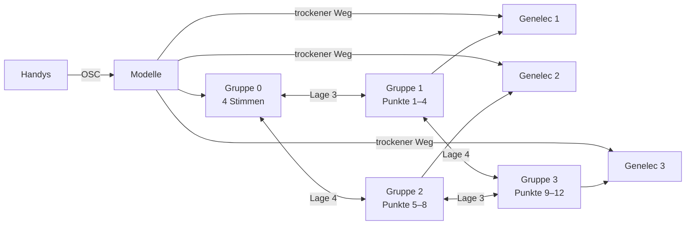

# Teppich — das Rauschen, das die Installation umhüllt

Stand 2026-09-29. **Nichts davon ist gebaut.**

**Die Regel, aus der alles folgt:** Der Teppich entsteht aus dem, was er verschluckt. Er hat keinen eigenen Rauschgenerator.

**Was hier steht:** was für den Teppich von wwww entschieden, vorgeschlagen und offen ist.

**Was hier nicht steht:** wie Rauschen aus einer Schleife entsteht und wie ein Klang darin versinkt. Das erklärt `learning\max-msp\fdn-6-rauschen-aus-der-schleife.md`, aufbauend auf den Teilen 1 bis 4 derselben Reihe. Verweise wie „Teil 6 §5“ zeigen dorthin. Die Liste aller sieben Teile steht in `fdn.md`.

**Verwandt:** `fdn.md` (das Netz), `modelle.md` (welches Modell wo rechnet), `kommunikation.md` (Handys, Mikrofon, Genelec), `specs\wwww-threejs\steuerung.md` (Gesten, die 12 Punkte).

---

## Festgelegt

| Was | Wie | Seit |
|---|---|---|
| Zweck des Installationsrechners | ein Rauschteppich, der die Installation umhüllt und die Atmosphäre gibt | 2026-09-28 |
| Stimmen | Audiomodelle wie SA3, Magenta RT2, AFTER und ACE-Step antworten auf die Handys | 2026-09-28 |
| Verschlucken | der Teppich verschluckt und umhüllt die Antworten immer wieder | 2026-09-28 |
| **Einmal klar** | Eine Antwort erklingt sofort und klar aus den Genelecs. Dazwischen liegt nur die Rechenzeit des Modells. Sie erklingt nur einmal. | 2026-09-29 |
| **Wiederkehr** | Danach erklingt sie nur noch im Teppich. Klar taucht sie erst wieder auf, wenn sich die Wolke zurückrechnet. | 2026-09-29 |
| **Trockener Weg** | für kurze Antworten: RT2, AFTER, SA3. Nicht für ACE-Step. Ein Regler pro Stimme; die Voreinstellung darf sich nach dem Hören ändern. | 2026-09-29 |
| Maschine | das FDN aus `fdn.md`: Hadamard-Weg, 16 Leitungen | 2026-09-28 |

---

## Vorgeschlagen, nicht bestätigt

### Welches Rauschen

Der Teppich ist vor allem **Phasenrauschen**. Er klingt dann nach dem, was er verschluckt hat: nach RT2, AFTER, ACE-Step und SA3. **Spektralrauschen**, bei dem das Vorzeichen in jedem Sample wechselt, kommt nur an Spitzen dazu. Den Unterschied erklärt Teil 6 §1–2.

### Die 16 Leitungen

| Gruppe | Leitungen | Rolle | Ausgang |
|---|---|---|---|
| 0 | 0–3, eine pro Modell | **Stimmen** | vorwärts stumm, außer bei ACE-Step; im Kollaps hörbar |
| 1 | 4–7 | **Teppich**, Punkte 1–4 | Genelec 1 |
| 2 | 8–11 | Teppich, Punkte 5–8 | Genelec 2 |
| 3 | 12–15 | Teppich, Punkte 9–12 | Genelec 3 |

Die Teppich-Leitungen sind die Rausch-Leitungen aus Teil 6 §5.

- Die Lagen 1 und 2 des Butterfly mischen innerhalb jeder Gruppe. In der Stimmen-Gruppe stehen ihre Winkel auf 0, damit jedes Modell in seiner Leitung bleibt.
- Die Lagen 3 und 4 verbinden die Gruppen (Teil 3 §7). Zwischen den Teppich-Gruppen stehen ihre Winkel fest. Zwischen einer Stimme und dem Teppich sind sie das Verschlucken.
- Leitung 0 trifft zuerst die Teppich-Leitungen 4 und 8, Leitung 1 die Leitungen 5 und 9. Eine Vertauschung vor dem Butterfly legt das anders.

Das ist „3 in 1 in 3“: drei Teppich-Räume, einer pro Genelec, in der Mitte die Stimmen.

### Wie eine Antwort versinkt

Nach Teil 6 §5–6, für eine kurze Antwort:

1. **Erklingen.** Der trockene Weg spielt die Antwort einmal, sofort, auf dem Genelec ihres Punkts.
2. **Stumm im Netz.** Gleichzeitig läuft sie in ihre Stimmen-Leitung. Diese wird vorwärts nicht abgehört.
3. **Zerfließen.** Das `d` der Stimmen-Leitung steht von Anfang an hoch. So taucht die Antwort im Teppich nicht als klares Echo auf.
4. **Versinken.** Die Kopplung zum Teppich ist frequenzabhängig. Erst wandern die Höhen hinüber, dann die Tiefen.
5. **Wiederkehr.** Im Kollaps wird die Stimmen-Leitung abgehört. Erreicht die Wolke den Moment, in dem die Antwort hineinging, taucht sie dort wieder klar auf, rückwärts.

**ACE-Step** hat keinen trockenen Weg. Seine Stimmen-Leitung wird auch vorwärts abgehört. Sein erster Umlauf ist klar, die folgenden sind schon zerflossen. Der Grund steht in Teil 6 §6.

### Umhüllen

Die Energie der Antwort wandert selbst in den Teppich, und Teppich fließt an ihre Stelle. Man hört eine Schicht, die sich verwandelt. Reicht das nicht, kommt am Ausgang eine spektrale Kopplung dazu (Teil 6 §7).

### Die Verfahren in wwww

Welches Verfahren wo sitzen kann, zeigt Teil 6 §4. Für wwww vorgeschlagen:

| Ort | Verfahren |
|---|---|
| Stimmen-Leitungen | Allpässe, Körner-Tausch, Vorzeichen, frequenzabhängige Kopplung zum Teppich |
| Teppich-Leitungen | Butterfly nahe `d` = 1, Allpässe, bewegte Winkel; der Frequenzshift nur im komplexen Netz |
| vor dem Netz, pro Antwort | nichts fest; Bit-XOR, Modulo-Folding oder Zeitverzerrung als Färbung möglich |
| Ausgang | Lautheitskompensation, Limiter |

### Die Modelle als Stimmen

Alle Einträge sind Beispiele. Welches Modell auf welchem Rechner läuft, regelt `modelle.md`.

| Modell | Rechner | antwortet auf | Antwort | trockener Weg | Versinken |
|---|---|---|---|---|---|
| **RT2** (`mrt2~`) | Installationsrechner, live | Zahl der Handys an jedem Punkt | 2-s-Stücke | ja | Sekunden |
| **AFTER** (`nn~`) | Installationsrechner, live, noch geplant | Handy-Daten über `fluid.kdtree~` | Phrasen | ja | Sekunden bis eine Minute |
| **SA3** | Vorproduktion | Eintritt in einen der 12 Punkte | der vorab gerechnete Fächer, denoise 0,1 → 0,9 | ja | Der Fächer ist die erste Hälfte, aufgelöst im Rauschen des Modells. Das Netz macht die zweite. |
| **ACE-Step** | live, wenn ein Repaint schnell genug ist, sonst vorab | eine Beschreibung aus den Handy-Daten | 30–90 s, alle paar Minuten | nein | Minuten |

Die vier Modelle leben auf vier Zeitskalen: RT2 in Sekunden, AFTER in Phrasen, SA3 bei Ereignissen, ACE-Step in Minuten. Der Teppich hört nie auf.

### Pegel

Je länger die Nachhallzeit des Teppichs, desto lauter wird er bei gleichem Zufluss (Teil 6 §8). Die Lautheitskompensation am Ausgang hält ihn hörbar gleich. Das Raummikrofon darf die Nachhallzeit steuern, wie in `fdn.md` unter „Steuerung“.

### Kollaps im Teppich

Im Teppich ist der Eingang nie ganz zu. Deshalb geht der Kollaps mit oder ohne Abzug (Teil 4 §15):

- **Mit Abzug** läuft der Teppich exakt zurück. Die Antworten treten rückwärts aus der Wolke.
- **Ohne Abzug** verdichtet sich jede Antwort zu ihrem Einsatz und zerfließt dahinter wieder.

Mit einer Nachhallzeit von 60 s reicht der Rückweg etwa fünf Minuten weit (Teil 4 §14).

---

## Was für den Bau gilt

- **Kein Rauschgenerator im Teppich.** Rauschen entsteht nur im Netz.
- **Spektralrauschen nur an Spitzen.**
- **Jede Antwort geht über ihr Tor ins Netz.** Das Tor zeichnet auf, was hineingeht, für den Kollaps mit Abzug.
- **Die Kopplung zwischen Stimme und Teppich geht nie ganz zurück.** Sonst kreist in der Stimmen-Leitung eine Schleife aus Teppich (Teil 6 §5).
- **Das Raummikrofon geht nicht als Audio ins Netz** (`kommunikation.md`).

## Bewusst nicht drin

| Draußen | Warum |
|---|---|
| ein Rauschgenerator als Quelle | Der Teppich soll nach dem Verschluckten klingen. |
| Überblenden zwischen Antwort und Teppich | klingt nach zwei Schichten (Teil 6 §6) |
| ein trockener Weg für ACE-Step | Bei 30–90 s müsste er ausgeblendet werden, und das ist ein Überblenden. |
| Audio von den Handys | Die Handys senden kein Audio (`kommunikation.md`). |

## Was offen ist

- **Ob eine Antwort im Kollaps rückwärts klar auftaucht oder am Ende noch einmal vorwärts** (Teil 6 §6).
- **Was der Teppich tut, wenn lange keine Antwort kommt:** verklingen oder in den Freeze gehen.
- **Wer den Kollaps auslöst**, offen in `fdn.md`.
- **Wie lange jedes Modell zum Versinken braucht**, und was das Versinken einer Antwort startet.
- **Die Nachhallzeit des Teppichs**, und ob der Raumpegel sie steuert.
- **Ob ACE-Step live läuft**, offen in `modelle.md`.
- **Ob der Zustand des Teppichs über Nacht gespeichert wird.** Er besteht nur aus den Delay-Puffern, wenige MB.
