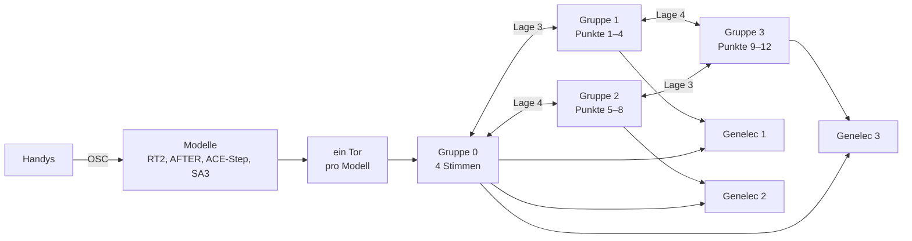

# Teppich — das Rauschen, das die Installation umhüllt

Ausgearbeitet im Gespräch am 2026-09-28. **Nichts davon ist gebaut.**

**Die Regel, aus der alles folgt:** Der Teppich entsteht aus dem, was er verschluckt. Er hat keinen eigenen Rauschgenerator.

Das folgt aus dem Chat vom 20.09.2026: „Die Rauscherzeugung ist die Schleife selbst.“ Eine Stimme, die lange genug im Netz kreist, wird zu Rauschen.

**Verwandt:** `fdn.md` (die Maschine: Bausteine, Kern, Freeze, Kollaps), `modelle.md` (welches Modell auf welchem Rechner), `kommunikation.md` (Handy-Daten, Genelec, Mikrofon), `data\noise-invertierbarkeit.md` (Teil I.3 zu den Arten von Rauschen, Teil X zum Übergang), `specs\wwww-threejs\steuerung.md` (Gesten, die 12 Punkte).

---

## Festgelegt

Alles am 2026-09-28.

| Was | Wie |
|---|---|
| Zweck des Installationsrechners | ein Rauschteppich, der die Installation umhüllt und die Atmosphäre gibt |
| Stimmen | Audiomodelle wie SA3, Magenta RT2, AFTER und ACE-Step antworten auf die Handys |
| Verhalten der Stimmen | Der Teppich verschluckt sie immer wieder und umhüllt sie |
| Maschine | das FDN aus `fdn.md`, Hadamard-Weg, 16 Leitungen |

---

## Vorgeschlagen, nicht bestätigt

### Welches Rauschen

`noise-invertierbarkeit.md` Teil I.3 unterscheidet drei Bedeutungen von Rauschen. Für den Teppich zählen zwei.

| Art | Was zerstört wird | Was bleibt | Womit im Netz |
|---|---|---|---|
| **Phasenrauschen** (b) | die zeitliche Gestalt: Transienten, Rhythmus | das Spektrum, also die Klangfarbe | Matrix, Allpässe, Körner-Tausch |
| **Spektralrauschen** (a) | auch die Klangfarbe | nur die Hüllkurve | Vorzeichen in jedem Sample |

**Der Teppich ist vor allem Phasenrauschen.** Dann klingt er nach dem, was er verschluckt hat: nach RT2, AFTER, ACE-Step und SA3. Spektralrauschen kommt nur an Spitzen dazu. Überwiegt es, klingt der Teppich nach Rauschen aus einem Generator.

Die dritte Bedeutung, echter Informationsverlust (c), erreicht ein bijektives Netz nie. Was der Teppich verschluckt hat, steckt noch in ihm, bis es unter die Rechengenauigkeit abgeklungen ist.

### Die 16 Leitungen

| Gruppe | Leitungen | Rolle | Ausgang |
|---|---|---|---|
| 0 | 0–3, eine pro Modell | **Stimmen** | das Genelec, zu dem der Punkt gehört, von dem die Antwort ausging |
| 1 | 4–7 | **Teppich**, Punkte 1–4 | Genelec 1 |
| 2 | 8–11 | Teppich, Punkte 5–8 | Genelec 2 |
| 3 | 12–15 | Teppich, Punkte 9–12 | Genelec 3 |

- **Die Lagen 1 und 2** des Butterfly mischen innerhalb jeder Gruppe. In der Stimmen-Gruppe stehen ihre Winkel auf 0, damit jedes Modell in seiner Leitung bleibt.
- **Die Lagen 3 und 4** verbinden die Gruppen. Lage 3 verbindet Gruppe 0 mit 1 und Gruppe 2 mit 3. Lage 4 verbindet Gruppe 0 mit 2 und Gruppe 1 mit 3. Gruppe 3 erreicht eine Stimme über Gruppe 1 oder 2 im selben Umlauf.
- **Zwischen den Teppich-Gruppen** stehen die Winkel fest. **Zwischen einer Stimme und dem Teppich** sind sie das Verschlucken.

Welche Teppich-Leitungen eine Stimme zuerst erreicht, folgt aus ihrer Leitungsnummer: Leitung 0 trifft 4 und 8, Leitung 1 trifft 5 und 9. Eine Vertauschung vor dem Butterfly legt das anders.

Das ist „3 in 1 in 3“: drei Teppich-Räume, einer pro Genelec, in der Mitte die Stimmen.

### Das Verschlucken

Jede Stimme hat ihre eigene Hüllkurve, und alle drei Stufen laufen im Kern.

| Stufe | Stimmen-`d` | Kopplung zum Teppich | Was man hört |
|---|---|---|---|
| **1 Erklingen** | 0 | aus | die Stimme, danach ihre Echos in der eigenen Leitung |
| **2 Zerfließen** | steigt: erst Dispersion, dann Körner-Tausch, dann Vorzeichen (Teil X.6) | aus | die Echos verlieren ihre Gestalt |
| **3 Versinken** | 1 | steigt, frequenzabhängig | die Stimme wandert in den Teppich, erst die Höhen, dann die Tiefen |

**Die Kopplung ist frequenzabhängig.** Zwischen Stimme und Teppich sitzt keine einfache Drehung, sondern Hadamard, ein Allpass 1. Ordnung auf einer der zwei Leitungen, dann wieder Hadamard (`fdn.md`, „Frequenzabhängige Drehung“). Beim Allpass-Koeffizienten 1 bleibt alles in der Stimme. Bei −1 wechselt alles. Dazwischen wechseln erst die Höhen. So löst sich die Stimme von oben nach unten auf wie in Teil X.2, jetzt ohne Verlust.

**Die Stimme kommt nicht zurück**, obwohl die Drehung in beide Richtungen wirkt. Der Teppich verteilt, was er bekommt, im selben Umlauf auf seine anderen Leitungen. Zurück in die Stimmen-Leitung fließt Teppich.

**Die Kopplung geht zwischen zwei Stimmen nicht ganz zurück.** Sonst kreist in der Stimmen-Leitung eine Schleife aus Teppich und klingt als Kammfilter.

### Das Umhüllen

Die Energie der Stimme wandert selbst in den Teppich, und Teppich fließt an ihre Stelle. Man hört eine Schicht, die sich verwandelt, nicht zwei Schichten nebeneinander. Teil X.4 warnt genau vor diesen zwei Schichten, wenn man überblendet.

Der Teppich um eine neue Stimme besteht aus früheren Stimmen. Weil er Phasenrauschen ist, hat er deren Klangfarbe.

**Falls das nicht reicht:** am Ausgang eine spektrale Kopplung (Teil X.4). Dann nimmt der Teppich die spektrale Hüllkurve der gerade klingenden Stimme an. Das ist nicht umkehrbar und sitzt deshalb nur am Ausgang.

### Die Noise-Mechanismen nach Ort

Wo jeder Mechanismus aus `noise-invertierbarkeit.md` im Teppich sitzt:

| Ort | Mechanismen | Kollaps | Freeze | Rauschart |
|---|---|---|---|---|
| **Stimmen-Leitungen**, im Kern | Allpass-Dispersion (IV.4), Körner-Tausch mit Radius (V.2), Vorzeichen mit Wechselrate (III.2), frequenzabhängige Kopplung (X.2) | ja | ja | Phase (b) |
| **Teppich-Leitungen**, im Kern | Butterfly nahe `d = 1`, Allpässe, bewegte Winkel, Frequenzshift als laufende Drehung im komplexen Netz (IV.5) | ja | ja | Phase (b); Vorzeichen in jedem Sample macht es spektral (a) |
| **im Kreis, außerhalb des Kerns** | Nachhallzeit des Teppichs, Lifting-Sättigung (VII.1), Clipping mit Residuum (VII.2) | ja | nein | — |
| **vor dem Netz**, pro Stimme | Bit-XOR-Tiefe (VI), Modulo-Folding (VII.4), Potenzkennlinie (II.1), Zeitverzerrung (V.1) | nicht nötig; für den Kollaps zählt, was ins Netz geht | — | färbt den Eingang |
| **Steuerung** | rückwärtsadaptiv (VII.3): der Pegel des Teppichs steuert sein eigenes `d` | ja, wenn nur aus Samples berechnet, die der Schritt nicht verändert | — | — |
| **Ausgang** | Lautheitskompensation (X.5), spektrale Kopplung (X.4), Limiter | — | — | — |

Vor dem Netz muss nichts umkehrbar sein. Teil IX sagt, warum: Ein Übergang braucht nur einen Regler, der bei 0 nichts tut.

### Die Modelle als Stimmen

Alle Einträge sind Beispiele. Welches Modell auf welchem Rechner läuft, regelt `modelle.md`.

| Modell | Rechner | antwortet auf | Stimme | Dauer des Versinkens |
|---|---|---|---|---|
| **RT2** (`mrt2~`) | Installationsrechner, live | Zahl der Handys an jedem Punkt | 2-s-Stücke durch das Tor | Sekunden |
| **AFTER** (`nn~`) | Installationsrechner, live, noch geplant | Handy-Daten über `fluid.kdtree~` | Phrasen | Sekunden bis eine Minute |
| **ACE-Step** | live, wenn ein Repaint schnell genug ist, sonst vorab | eine Beschreibung aus den Handy-Daten | 30–90 s, alle paar Minuten | Minuten |
| **SA3** | Vorproduktion | Eintritt in einen der 12 Punkte | der vorab gerechnete Fächer, denoise 0,1 → 0,9 | Der Fächer ist die erste Hälfte, aufgelöst im Rauschen des Modells. Das Netz macht die zweite. |

Die vier Modelle leben auf vier Zeitskalen: RT2 in Sekunden, AFTER in Phrasen, SA3 bei Ereignissen, ACE-Step in Minuten. Der Teppich hört nie auf.

### Pegel

Der Teppich verliert pro Umlauf so viel, wie seine Nachhallzeit vorgibt. Kommen laufend Stimmen hinzu, stellt sich ein Pegel ein. Je länger die Nachhallzeit, desto lauter wird er bei gleichem Zufluss.

Die Lautheitskompensation am Ausgang (Teil X.5) hält den Pegel hörbar gleich. Das Raummikrofon darf die Nachhallzeit steuern, wie in `fdn.md` unter „Steuerung“.

### Kollaps im Teppich

Im Teppich ist der Eingang nie ganz zu. Deshalb gibt es zwei Arten, ihn zurücklaufen zu lassen.

| Art | Wie | Was man hört |
|---|---|---|
| **Mit Abzug** | Das Tor zeichnet auf, was ins Netz geht. Rückwärts wird es wieder abgezogen. | Der Teppich läuft exakt zurück. Die Stimmen treten rückwärts aus dem Rauschen und verschwinden an ihrem Einsatz. |
| **Ohne Abzug** | Rückwärts wird kein Eingang angenommen. | Jede verschluckte Stimme verdichtet sich zu ihrem Einsatz und zerfließt dahinter wieder. |

**Wie weit zurück:** Float64 rechnet auf etwa 313 dB genau. Der Rückweg reicht, bis das Älteste um diesen Betrag unter den Rest gefallen ist. Das sind gut fünf Nachhallzeiten, bei 60 s also rund fünf Minuten. Gerechnet, nicht gemessen.

---

## Was für den Bau gilt

- **Kein Rauschgenerator im Teppich.** Rauschen entsteht nur im Netz.
- **Spektralrauschen nur an Spitzen.** Sonst verliert der Teppich die Klangfarbe der Stimmen.
- **Stimmen gehen nur über ihr Tor ins Netz.** Das Tor zeichnet auf, was hineingeht, für den Kollaps mit Abzug.
- **Die Kopplung zwischen Stimme und Teppich geht nie ganz auf „aus“ zurück.**
- **Das Raummikrofon geht nicht als Audio ins Netz.** `kommunikation.md`: Das Mikrofon wird gemessen, nicht verstärkt.

## Bewusst nicht drin

| Draußen | Warum |
|---|---|
| ein Rauschgenerator als Quelle des Teppichs | Der Teppich soll nach dem Verschluckten klingen. |
| Überblenden zwischen Stimme und Teppich | klingt nach zwei Schichten (Teil X.4); die Stimme wandert stattdessen selbst in den Teppich |
| Audio von den Handys als Stimme | Die Handys senden kein Audio, siehe `kommunikation.md`. |

## Was offen ist

- **Ob eine Stimme auch direkt auf ein Genelec geht**, bevor sie in ihre Leitung läuft.
- **Wie lange jedes Modell zum Versinken braucht**, und was die Hüllkurve einer Stimme startet.
- **Die Nachhallzeit des Teppichs**, und ob der Raumpegel sie steuert.
- **Was der Teppich tut, wenn lange keine Stimme kommt:** verklingen oder in den Freeze gehen.
- **Wer den Kollaps auslöst**, offen in `fdn.md`.
- **Ob ACE-Step live läuft**, offen in `modelle.md`.
- **Ob der Zustand des Teppichs über Nacht gespeichert wird.** Er besteht nur aus den Delay-Puffern, wenige MB.
