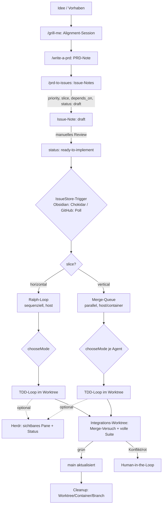
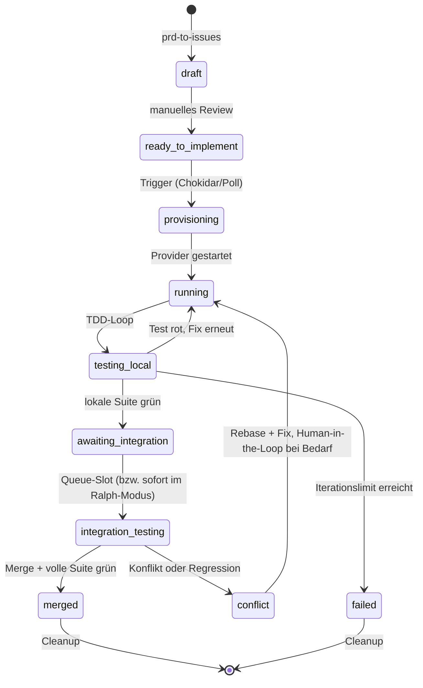
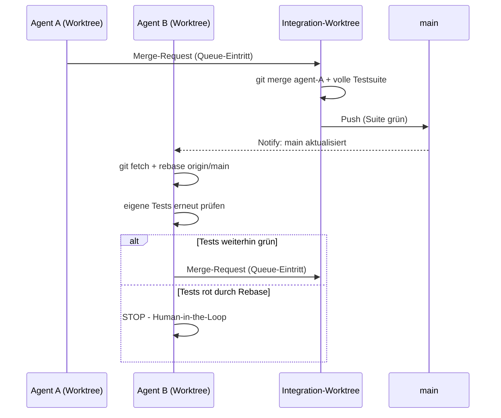

# Agentic Issue Pipeline: Von der Idee zum Merge
### Obsidian-first, mit Docker/Worktree-Hybrid, optionalem GitHub-Fallback und Herdr-Sichtbarkeit

---

## 0. Was neu ist gegenüber der Vorversion

- **Vorstufe ergänzt**: grill-me → write-a-prd → prd-to-issues, bevor überhaupt ein Agent läuft.
- **Registry entfernt.** Was vorher eine JSON/SQLite-Datei war, ist jetzt eine Abstraktion (`IssueStore`) mit zwei Implementierungen: **Obsidian-Frontmatter + Chokidar (Default)** und **GitHub Issues + Labels (Fallback, nur bei Teamarbeit)**.
- **Neue Routing-Entscheidung**: zusätzlich zu „Host oder Docker" (Abschnitt 8) jetzt auch „sequenziell (Ralph-Loop) oder parallel (Merge-Queue)" (Abschnitt 9), gesteuert über eine `slice`-Property pro Issue.
- **Herdr ergänzt** (Abschnitt 15) als optionale Terminal-Sichtbarkeits- und Statusschicht — rein additiv, kein neuer Kontrollfluss, gegen die echte herdr.dev-Doku geprüft.
- **Build-Phasen als vertikale Slices umstrukturiert** (Abschnitt 18): Jede Phase liefert jetzt einen vollständigen, lauffähigen Ende-zu-Ende-Pfad von Issue zu Merge statt einer isolierten Schicht (vorher: erst Store, dann Ausführung, dann Routing — nichts lief end-to-end vor Phase 3).
- **Sandcastle-Link ergänzt** (Abschnitt 2): Verweis auf [github.com/mattpocock/sandcastle](https://github.com/mattpocock/sandcastle), damit der SPEC-Stand gegen den sich wöchentlich ändernden Code prüfbar bleibt.
- **Agent-Provider von Sandbox-Provider getrennt** (neuer Abschnitt 8.1): `getProvider()` war bisher reine Sandbox-Wahl (Host/Docker) und bildete Sandcastles tatsächliche `run({ agent, sandbox })`-API nicht ab. Jetzt `getSandbox()` + `getAgent()`, Default-Agent `claudeCode(...)`, mit Skizze eines Custom-`AgentProvider` für Antigravity CLI (offene Verifikationsfrage: JSON-Event-Schema-Kompatibilität).
- **Herdr-Autodetection-Lücke dokumentiert** (Abschnitt 15.1): Antigravity CLI ist nicht in Herdrs erkannten CLIs enthalten, Fallback `herdrReportState()` (15.4) greift stattdessen.

---

## 1. Zielsetzung

Eine durchgehende Kette von der ersten Idee bis zum gemergten Code, bei der jeder Schritt so minimal wie möglich implementiert ist:

1. Eine Idee wird über ein kurzes Alignment-Gespräch (grill-me) zu einer PRD-Note.
2. Die PRD-Note wird in einzelne Issue-Notes zerlegt (prd-to-issues), jede mit Priorität, Abhängigkeiten und einer Kennzeichnung horizontal/vertikal.
3. Eine Statusänderung im Frontmatter einer Issue-Note (lokal, kein Netzwerk) triggert einen Agenten.
4. Der Agent bekommt automatisch die passende Isolationsstufe (Host oder Docker) und das passende Ausführungsmodell (sequenziell oder parallel).
5. Integration läuft über einen neutralen Worktree, Merge nur nach vollem Testlauf, Eskalation an den Menschen bei echten Konflikten.

Solo-Betrieb ist der Normalfall; Team-Betrieb ist ein austauschbares Backend, kein Sonderfall, der die Architektur verbiegt.

---

## 2. Architekturprinzip

Drei Schichten, strikt getrennt:

| Schicht | Verantwortung | Komponente |
|---|---|---|
| **Zustand & Trigger** | Wo lebt der Status eines Issues, was löst eine Statusänderung aus | **IssueStore** (Obsidian-Default oder GitHub-Fallback) |
| **Verwaltung der physischen Umgebung** | Worktree anlegen/löschen, optional Container mounten/stoppen | **[Sandcastle](https://github.com/mattpocock/sandcastle)** |
| **Intelligenz & Orchestrierung** | Moduswahl, TDD-Loop, Ralph-Loop, Merge-Queue | **Antigravity / Orchestrator (TS/Fastify)** |

Der Orchestrator ist ein **persistenter lokaler Prozess** — er braucht ohnehin Dateisystem- und Docker-Zugriff für Sandcastle. Das ist der Grund, warum hier kein Webhook-Server + externer State-Store (wie bei Oz mit Vercel + KV) nötig ist.

### Gesamtüberblick



---

## 3. Vorstufe: Von der Idee zum Issue

### 3.1 `/grill-me`

Kein Artefakt-Zwang. Eine interaktive Ausrichtungs-Session zwischen dir und dem LLM zu einem Design-Konzept, bevor irgendetwas geschrieben wird. Ergebnis fließt als Chat-Kontext oder kurze Notiz in 3.2 ein.

### 3.2 `/write-a-prd`

Erzeugt aus der grill-me-Session eine einzelne Obsidian-Note mit `type: prd` im Frontmatter. Die PRD muss immer aktuell sein: bei einer grundlegenden Planänderung wird die Note **neu geschrieben**, nicht inkrementell gepatcht.

```yaml
---
type: prd
id: prd-2026-001
title: "Geistige Klang-Räume: Gesten-Interaktion Phase 2"
status: approved
created: 2026-07-07
---
```

### 3.3 `/prd-to-issues`

Zerlegt die PRD-Note in mehrere Issue-Notes. Kein echtes Kanban-Board-Widget nötig — eine flache Menge von Notes mit Frontmatter-Properties reicht, sichtbar per Dataview-Query. Für jedes Issue wird gesetzt:

| Property | Werte | Bedeutung |
|---|---|---|
| `priority` | `bugfix` \| `infra` \| `tracer-bullet` \| `polish` \| `refactor` | Reihenfolge der Bearbeitung, absteigend in dieser Liste |
| `slice` | `horizontal` \| `vertical` | Routing-Entscheidung, siehe Abschnitt 9 |
| `depends_on` | Liste von Issue-IDs | Ein Issue wird erst kandidiert, wenn alle Abhängigkeiten `merged` sind |
| `status` | siehe Abschnitt 10 | Der eigentliche State-Machine-Wert |

**Horizontal** heißt: Schicht für Schicht (erst DB, dann API, dann Frontend) — inhärent sequenziell, gehört in den Ralph-Loop. **Vertikal** heißt: eine Tracer-Bullet-Slice quer durch alle Schichten für ein Feature — lose genug gekoppelt für parallele Worktrees.

Neu entstandene Issues starten mit `status: draft` — ein bewusster manueller Gate-Schritt, bevor du sie auf `ready-to-implement` setzt.

**Sichtbarkeit als virtuelles Kanban-Board** (Dataview):

```
TABLE priority, slice, status, depends_on
FROM "vault/issues"
WHERE type = "issue"
SORT priority ASC
```

---

## 4. Der Issue-Store: gemeinsame Abstraktion

Eine separate Registry ist bei der Obsidian-Variante nicht nötig, weil die Note selbst der Datensatz ist. Die Abstraktion existiert nur, damit Orchestrator-Code backend-unabhängig bleibt:

```typescript
// issue-store.ts
export type IssueStatus =
  | "draft"
  | "ready-to-implement"
  | "provisioning"
  | "running"
  | "testing_local"
  | "awaiting_integration"
  | "integration_testing"
  | "conflict"
  | "merged"
  | "failed";

export type Priority = "bugfix" | "infra" | "tracer-bullet" | "polish" | "refactor";
export type Slice = "horizontal" | "vertical";

export interface IssueRecord {
  id: string;
  title: string;
  status: IssueStatus;
  priority: Priority;
  slice: Slice;
  mode?: "host" | "container";
  branch?: string;
  worktreePath?: string;
  dependsOn: string[];
  createdAt: string;
  updatedAt: string;
  body: string;
}

export interface IssueStore {
  list(filter?: Partial<Pick<IssueRecord, "status" | "priority" | "slice">>): Promise<IssueRecord[]>;
  get(id: string): Promise<IssueRecord | null>;
  updateStatus(id: string, status: IssueStatus, patch?: Partial<IssueRecord>): Promise<void>;
  appendLog(id: string, heading: string, content: string): Promise<void>;
  onChange(cb: (id: string, prev: IssueRecord | null, next: IssueRecord) => void): void;
}
```

---

## 5. Default-Backend: Obsidian Frontmatter + Chokidar

Kein Webhook, kein API-Client, kein Auth-Token, kein Rate-Limit — reines lokales File-I/O.

```typescript
// obsidian-issue-store.ts
import chokidar from "chokidar";
import matter from "gray-matter";
import { readFile, writeFile, rename } from "fs/promises";
import { glob } from "glob";
import path from "path";

const VAULT_ISSUES_DIR = "./vault/issues";

export class ObsidianIssueStore implements IssueStore {
  private cache = new Map<string, IssueRecord>();
  private listeners: Array<(id: string, prev: IssueRecord | null, next: IssueRecord) => void> = [];

  constructor() {
    this.rescan();
    chokidar.watch(`${VAULT_ISSUES_DIR}/*.md`).on("change", (fp) => this.handleChange(fp));
  }

  private async rescan() {
    for (const f of await glob(`${VAULT_ISSUES_DIR}/*.md`)) await this.loadFile(f);
  }

  private async loadFile(filePath: string): Promise<IssueRecord> {
    const { data, content } = matter(await readFile(filePath, "utf-8"));
    const record: IssueRecord = {
      id: data.id ?? path.basename(filePath, ".md"),
      title: data.title ?? "",
      status: data.status,
      priority: data.priority,
      slice: data.slice,
      mode: data.mode,
      branch: data.branch,
      worktreePath: data.worktree,
      dependsOn: data.depends_on ?? [],
      createdAt: data.created,
      updatedAt: data.updated,
      body: content,
    };
    this.cache.set(record.id, record);
    return record;
  }

  private async handleChange(filePath: string) {
    const id = path.basename(filePath, ".md");
    const prev = this.cache.get(id) ?? null;
    const next = await this.loadFile(filePath);
    if (!prev || prev.status !== next.status) {
      this.listeners.forEach((cb) => cb(id, prev, next));
    }
  }

  async list(filter: Partial<Pick<IssueRecord, "status" | "priority" | "slice">> = {}) {
    return [...this.cache.values()].filter((r) =>
      Object.entries(filter).every(([k, v]) => (r as any)[k] === v)
    );
  }

  async get(id: string) {
    return this.cache.get(id) ?? null;
  }

  async updateStatus(id: string, status: IssueStatus, patch: Partial<IssueRecord> = {}) {
    const record = this.cache.get(id);
    if (!record) throw new Error(`Issue ${id} nicht gefunden`);
    const merged = { ...record, ...patch, status, updatedAt: new Date().toISOString() };
    const frontmatter = {
      id: merged.id, title: merged.title, status: merged.status, priority: merged.priority,
      slice: merged.slice, mode: merged.mode, branch: merged.branch, worktree: merged.worktreePath,
      depends_on: merged.dependsOn, created: merged.createdAt, updated: merged.updatedAt,
    };
    const filePath = path.join(VAULT_ISSUES_DIR, `${id}.md`);
    const tmp = `${filePath}.tmp`;
    await writeFile(tmp, matter.stringify(merged.body, frontmatter), "utf-8");
    await rename(tmp, filePath);
    this.cache.set(id, merged);
  }

  async appendLog(id: string, heading: string, content: string) {
    const record = this.cache.get(id);
    if (!record) throw new Error(`Issue ${id} nicht gefunden`);
    const entry = `\n\n### [${new Date().toISOString()}] ${heading}\n${content}\n`;
    await this.updateStatus(id, record.status, { body: record.body + entry });
  }

  onChange(cb: (id: string, prev: IssueRecord | null, next: IssueRecord) => void) {
    this.listeners.push(cb);
  }
}
```

**Wichtige Praxis-Regeln:**

- Rohes `stdout`/`stderr` gehört nicht in die Note (Vault-Bloat). Logs landen in `./logs/<issueId>/<timestamp>.log`; `appendLog` schreibt nur eine Zusammenfassung plus Pfad-Referenz.
- Agenten schreiben append-only an den Body — minimiert Kollisionsfläche mit manuellen Edits.
- Bei geräteübergreifendem Sync (Obsidian Sync/Dropbox/iCloud): Orchestrator nur gegen die lokale, primäre Kopie laufen lassen.
- Der `cache` ist reine Performance-Optimierung, kein zweiter Wahrheitsträger — er darf aus der Sync geraten, weil `rescan()` ihn repariert.

---

## 6. Fallback-Backend: GitHub Issues + Labels (Team-Fall)

Nur relevant, sobald ein zweiter Mensch mitarbeitet, externe Sichtbarkeit ohne Vault-Zugriff gewünscht ist, oder GitHub Actions als CI-Gate eingebunden werden soll. Kein Webhook-Server nötig — ein Poll-Loop im selben persistenten Orchestrator-Prozess reicht.

```typescript
// github-issue-store.ts
import { execSync } from "child_process";

const POLL_INTERVAL_MS = 30_000;

export class GitHubIssueStore implements IssueStore {
  private cache = new Map<string, IssueRecord>();
  private listeners: Array<(id: string, prev: IssueRecord | null, next: IssueRecord) => void> = [];

  constructor(private repo: string) {
    this.poll();
    setInterval(() => this.poll(), POLL_INTERVAL_MS);
  }

  private async poll() {
    const raw = execSync(
      `gh issue list --repo ${this.repo} --state open --json number,title,labels,body,updatedAt`
    ).toString();
    for (const issue of JSON.parse(raw)) {
      const id = String(issue.number);
      const labels: string[] = issue.labels.map((l: any) => l.name);
      const byPrefix = (prefix: string, fallback: string) =>
        labels.find((l) => l.startsWith(`${prefix}:`))?.split(":")[1] ?? fallback;
      const next: IssueRecord = {
        id,
        title: issue.title,
        status: byPrefix("status", "draft") as IssueStatus,
        priority: byPrefix("priority", "polish") as Priority,
        slice: byPrefix("slice", "vertical") as Slice,
        dependsOn: [],
        createdAt: issue.updatedAt,
        updatedAt: issue.updatedAt,
        body: issue.body,
      };
      const prev = this.cache.get(id) ?? null;
      this.cache.set(id, next);
      if (!prev || prev.status !== next.status) this.listeners.forEach((cb) => cb(id, prev, next));
    }
  }

  async list(filter: Partial<Pick<IssueRecord, "status" | "priority" | "slice">> = {}) {
    return [...this.cache.values()].filter((r) =>
      Object.entries(filter).every(([k, v]) => (r as any)[k] === v)
    );
  }

  async get(id: string) {
    return this.cache.get(id) ?? null;
  }

  async updateStatus(id: string, status: IssueStatus, patch: Partial<IssueRecord> = {}) {
    const record = this.cache.get(id);
    const removeFlag = record ? `--remove-label "status:${record.status}"` : "";
    execSync(`gh issue edit ${id} --repo ${this.repo} ${removeFlag} --add-label "status:${status}"`);
    if (record) this.cache.set(id, { ...record, ...patch, status, updatedAt: new Date().toISOString() });
  }

  async appendLog(id: string, heading: string, content: string) {
    const body = `### [${new Date().toISOString()}] ${heading}\n${content}`;
    execSync(`gh issue comment ${id} --repo ${this.repo} --body ${JSON.stringify(body)}`);
  }

  onChange(cb: (id: string, prev: IssueRecord | null, next: IssueRecord) => void) {
    this.listeners.push(cb);
  }
}
```

Bewusst **weggelassen** verglichen mit dem echten Oz-Orchestrator: kein Webhook-Empfänger, kein Vercel-Deployment, kein KV-Store, keine Trust/Provenance-Prüfung nach `author_association` — das löst ein Problem (viele fremde, nicht vertrauenswürdige Contributor), das im Team-internen Fall nicht existiert.

---

## 7. Wann wechseln?

| Kriterium | Obsidian (Default) | GitHub (Fallback) |
|---|---|---|
| Nur du arbeitest am Projekt | ✅ | – |
| Zweiter Mensch braucht Sichtbarkeit ohne Vault-Zugriff | – | ✅ |
| GitHub Actions als CI-Gate vor Merge gewünscht | – | ✅ |
| Kein Netzwerk/API-Abhängigkeit gewünscht | ✅ | – |
| Issue-Note soll gleichzeitig Wissensgraph-Knoten sein | ✅ | – |

Der Wechsel ist rein additiv: `new GitHubIssueStore(repo)` statt `new ObsidianIssueStore()` an der einzigen Stelle, an der der Store instanziiert wird.

---

## 8. Routing A: Host vs. Docker (`chooseMode`)

Worktree-Erstellung ist immer Pflicht, Docker wird nur bei konkretem Grund zugeschaltet.

| Kriterium | Host | Docker |
|---|---|---|
| Reines Sprach-Tooling bereits auf Host vorhanden | ✅ | – |
| Zusätzlicher Service nötig (DB, Redis, …) | – | ✅ |
| Anderes OS / Linux-spezifische Bibliotheken | – | ✅ |
| Übergeordnete Ordner sollen unsichtbar bleiben | – | ✅ |
| CI-Parität gewünscht | – | ✅ |
| Task als destruktiv markiert | – | ✅ |
| Schnelligkeit hat Priorität | ✅ | – |

```typescript
// mode-decision.ts
export type AgentMode = "host" | "container";

export interface TaskSpec {
  issueId: string;
  branchName: string;
  forceMode?: AgentMode;
  signals?: {
    needsService?: boolean;
    crossPlatformRisk?: boolean;
    destructive?: boolean;
    parallelAgentCount?: number;
  };
  dockerImage?: string;
  agentKind?: "claude-code" | "antigravity";
}

const HOST_PARALLEL_LIMIT = 4;

export function chooseMode(spec: TaskSpec): AgentMode {
  if (spec.forceMode) return spec.forceMode;
  const s = spec.signals ?? {};
  if (s.needsService || s.crossPlatformRisk || s.destructive) return "container";
  if ((s.parallelAgentCount ?? 0) >= HOST_PARALLEL_LIMIT) return "container";
  return "host";
}

export function taskSpecFromIssue(issue: IssueRecord, overrides: Partial<TaskSpec> = {}): TaskSpec {
  return {
    issueId: issue.id,
    branchName: issue.branch ?? `agent/${issue.id}`,
    signals: {
      needsService: /docker-compose/.test(issue.body),
      crossPlatformRisk: /native binding|windows-only|posix/i.test(issue.body),
      destructive: /migration|drop table|rm -rf/i.test(issue.body),
    },
    ...overrides,
  };
}

function getSandbox(mode: AgentMode, path: string, dockerImage?: string) {
  const { noSandbox, dockerProvider } = require("@ai-hero/sandcastle");
  return mode === "container"
    ? dockerProvider({ image: dockerImage ?? "my-custom-env" })
    : noSandbox({ cwd: path });
}
```

### 8.1 Agent-Provider

`sandbox` (oben) entscheidet nur *wo* ausgeführt wird. Sandcastles `wt.run()` nimmt zusätzlich einen davon unabhängigen `agent`-Parameter — *welches* Modell/welche CLI die Arbeit tatsächlich macht. Sandcastle bringt dafür ein kuratiertes Set eingebauter Provider mit: `claudeCode`, `pi`, `codex`, `cursor`, `opencode`, `copilot`. Ein Antigravity/Gemini-Provider ist **nicht** eingebaut, und das ist bewusste Policy des Maintainers, nicht eine Lücke — zusätzliche CLIs sollen über das öffentliche `AgentProvider`-Interface eingebunden werden, ohne dass Sandcastle selbst geändert wird.

Default für diese Spec ist `claudeCode(...)`. Für Antigravity CLI ist ein Custom-`AgentProvider` nötig:

```typescript
function getAgent(kind: TaskSpec["agentKind"] = "claude-code") {
  const { claudeCode } = require("@ai-hero/sandcastle");
  return kind === "claude-code" ? claudeCode() : antigravityProvider();
}

// Custom AgentProvider für Antigravity CLI, analog zum offiziellen minimax()-Muster:
// CLI im nicht-interaktiven Modus aufrufen (agy -p "<prompt>" --output-format json)
// und die JSON-Stream-Events auf Sandcastles AgentProvider-Event-Schema abbilden.
function antigravityProvider(): AgentProvider {
  // OFFEN: ob agy's --output-format-json-Events 1:1 zu dem Schema passen, das
  // Sandcastle als AgentProvider erwartet, ist nicht verifiziert — das ist der
  // erste Punkt, der vor produktivem Einsatz zu klären ist, keine Selbstverständlichkeit.
  throw new Error("TODO: Event-Schema gegen echte agy --output-format json Ausgabe verifizieren");
}
```

`TaskSpec` (oben) bekommt dafür ein optionales Feld `agentKind?: "claude-code" | "antigravity"` (Default `"claude-code"`), das `runAgent()` (Abschnitt 14) an `getAgent()` durchreicht.

---

## 9. Routing B: Sequenziell (Ralph-Loop) vs. Parallel (Merge-Queue)

```typescript
function routeExecution(issue: IssueRecord): "ralph" | "merge-queue" {
  return issue.slice === "horizontal" ? "ralph" : "merge-queue";
}

function dependenciesSatisfied(issue: IssueRecord, all: IssueRecord[]): boolean {
  return issue.dependsOn.every((depId) => all.find((i) => i.id === depId)?.status === "merged");
}

const PRIORITY_ORDER: Priority[] = ["bugfix", "infra", "tracer-bullet", "polish", "refactor"];

function pickNextIssue(candidates: IssueRecord[], all: IssueRecord[]): IssueRecord | null {
  const ready = candidates
    .filter((i) => i.status === "ready-to-implement" && dependenciesSatisfied(i, all))
    .sort((a, b) => PRIORITY_ORDER.indexOf(a.priority) - PRIORITY_ORDER.indexOf(b.priority));
  return ready[0] ?? null;
}
```

Beide Pfade laufen am Ende durch denselben Integrations-Worktree-Test (Abschnitt 13) — im Ralph-Modus entfällt nur das Warten auf einen Queue-Slot, weil es keine Konkurrenz gibt.

---

## 10. Zustandsmodell



---

## 11. Ablaufplan – Single Agent

1. Trigger: `status` einer Issue-Note wechselt auf `ready-to-implement` (Obsidian) bzw. Label `status:ready-to-implement` wird gesetzt (GitHub).
2. `routeExecution(issue)` → Ralph oder Merge-Queue (Abschnitt 9).
3. `chooseMode(taskSpecFromIssue(issue))` → Host oder Docker (Abschnitt 8).
4. Provisioning: `wt.create({ branch })`, bei Docker zusätzlich Volume-Mount.
5. TDD-Loop (Reproduktion → Fix → Verifikation → Bericht), Exit-Codes sind einzige Wahrheitsquelle.
6. Lokaler Abschluss: `git commit` mit strukturierter Message, Status → `awaiting_integration`.
7. Integrations-Test (Abschnitt 13), dann Merge oder Konflikt-Eskalation.
8. Cleanup: Worktree entfernen, Container stoppen, Log-Zusammenfassung anhängen.

---

## 12. Ablaufplan – Ralph-Loop (horizontal, AFK, sequenziell)

```typescript
// ralph-loop.ts
export async function ralphLoop(store: IssueStore) {
  while (true) {
    const all = await store.list();
    const candidates = all.filter((i) => i.slice === "horizontal");
    const next = pickNextIssue(candidates, all);
    if (!next) {
      console.log("Ralph: keine offenen horizontalen Issues mehr, Loop beendet.");
      return;
    }
    await runAgent(store, taskSpecFromIssue(next, { forceMode: "host" }));
  }
}
```

Kein Sentinel-Text-Parsing nötig — die Abbruchbedingung ist strukturierter Zustand (leere Kandidatenliste), passend zum Determinismus-Prinzip aus Abschnitt 17.

---

## 13. Ablaufplan – Merge-Queue (vertikal, parallel)

1. Jeder Agent committet ausschließlich auf seinem eigenen Branch. Kein direkter Merge auf `main` durch den Agenten selbst.
2. Ein einziger neutraler Integrations-Worktree (`./worktrees/_integration`) ist der Flaschenhals.
3. Agent meldet „bereit" → FIFO-Queue-Eintritt.
4. An der Spitze der Queue: `git fetch && git checkout main && git pull`, dann `git merge agent/<issueId>`.
   - Erfolg → volle Testsuite im Integrations-Worktree.
     - Grün → Push nach `main`, Status `merged`.
     - Rot trotz konfliktfreiem Merge → Status `conflict`.
   - Git-Konflikt → `git merge --abort`, Agent erhält `git fetch origin && git rebase origin/main`, erneuter Queue-Eintritt.
5. **Human-in-the-Loop**: Wenn ein Agent nach Rebase erkennt, dass seine vorher grünen Tests jetzt rot sind, stoppt er automatisch und meldet: „Konflikt durch Agent X erkannt, benötige Entscheidung." Kein automatisches Weiterprobieren über ein konfigurierbares Limit hinaus.



---

## 14. Referenzimplementierung: `run-agent.ts`

```typescript
import { wt } from "@ai-hero/sandcastle";
import { chooseMode, taskSpecFromIssue, TaskSpec } from "./mode-decision";
import { IssueStore } from "./issue-store";

export async function runAgent(store: IssueStore, spec: TaskSpec) {
  const mode = chooseMode(spec);
  const worktree = await wt.create({ branch: spec.branchName });

  await store.updateStatus(spec.issueId, "provisioning", {
    mode, worktreePath: worktree.path, branch: spec.branchName,
  });

  try {
    const sandbox = getSandbox(mode, worktree.path, spec.dockerImage);
    const agent = getAgent(spec.agentKind); // Default: claudeCode() — siehe 8.1
    await store.updateStatus(spec.issueId, "running");

    await wt.run({
      agent,
      sandbox,
      prompt: `Fix issue ${spec.issueId}`,
      skills: ["./skills/tdd-loop.md"],
    });

    await store.appendLog(spec.issueId, `Implementer (${mode})`, "Lokale Testsuite grün, Commit erstellt.");
    await store.updateStatus(spec.issueId, "awaiting_integration");
  } catch (e) {
    await store.appendLog(spec.issueId, "Implementer", `Fehlgeschlagen: ${String(e)}`);
    await store.updateStatus(spec.issueId, "failed");
    await wt.delete(worktree);
  }
}
```

Dispatcher (`IssueStore.onChange` → `runAgent`):

```typescript
// dispatcher.ts
store.onChange(async (id, prev, next) => {
  if (next.status !== "ready-to-implement" || prev?.status === "ready-to-implement") return;
  if (next.slice === "horizontal") return; // läuft über ralphLoop(), nicht event-getrieben
  await runAgent(store, taskSpecFromIssue(next));
});
```

---

## 15. Terminal-Sichtbarkeit: Herdr als Beobachtungsschicht

Optional, additiv, steuert nichts — genau wie bei der Registry-Entscheidung (Abschnitt 4) gilt: Herdr wird niemals zur zweiten Wahrheitsquelle. Der Kontrollfluss bleibt exakt wie in Abschnitt 14 (Sandcastle-Promise entscheidet über `awaiting_integration`/`failed`); Herdr bekommt Zustände nur gemeldet bzw. zeigt sie an.

### 15.1 Warum Herdr hier passt

Sandcastle isoliert Agenten in Worktrees + Docker; Herdr macht mehrere gleichzeitig laufende Terminal-Sessions als eigene Panes sichtbar und erkennt bei unterstützten Coding-CLIs (`claude`, `codex`, `copilot`, `devin`, `droid`, `kimi`, `opencode`, `kilo`, `hermes`, `qodercli`, `cursor`) den Status (`working`/`blocked`/`idle`) **automatisch** aus dem Bildschirminhalt, sobald einmalig `herdr integration install claude` (oder das jeweils genutzte Tool) installiert ist — kein eigener Reporting-Code nötig, wenn dein Implementer tatsächlich diese CLI aufruft.

**Antigravity CLI (`agy`, siehe 8.1) steht (noch) nicht in dieser Liste** — Herdr erkennt ihren Status nicht automatisch aus dem Bildschirminhalt. Für Issues mit `agentKind: "antigravity"` greift deshalb der Fallback `herdrReportState()` aus 15.4, nicht die automatische Erkennung.

### 15.2 Zwei Integrationsmuster

Welches Muster passt, hängt davon ab, wie `wt.run()` in deiner konkreten Sandcastle-Einbindung tatsächlich ausführt — das ist aus der bisherigen Beschreibung selbst nicht eindeutig, deshalb beide Pfade offengehalten:

**Muster A — Sandcastle führt selbst aus, Herdr schaut nur zu.** Wenn du keinen direkten Handle auf den Shell-Befehl hast: Workspace am Worktree-Pfad öffnen, danebengesetztes Pane tailt nur die Logs.

**Muster B — du startest den Implementer-Prozess selbst.** `herdr agent start` übernimmt Start und Statuserkennung in einem Schritt — empfohlen, wenn möglich, weil es Muster A's manuelles Tailing erübrigt.

### 15.3 Korrekturen gegenüber der ursprünglichen Notiz

Gegen die offizielle Doku (herdr.dev/docs) geprüft — drei Punkte sind anders als zunächst skizziert:

- **Status setzen ist nicht `herdr agent rename`** — das vergibt nur den *Namen* (Identität) eines Agents. Der Status läuft über `herdr pane report-agent <pane_id> --state idle|working|blocked|unknown`. `done` ist dort **kein** manuell setzbarer Wert, sondern wird aus Herdrs eigener Bildschirm-Erkennung abgeleitet. Deshalb bleibt Abschluss-Erkennung Sache der Sandcastle-Promise, nicht von Herdr.
- **Worktree-Anbindung läuft über `herdr worktree open --path <sandcastle-worktree>`**, nicht über manuelles `pane split --cwd`. Herdr reiht den Checkout korrekt beim übergeordneten Repo-Workspace ein. Sandcastle bleibt trotzdem alleiniger Besitzer der Git-Lebenszyklus-Operationen.
- **Aufräumen: `workspace close`, nicht `worktree remove`.** `worktree remove` würde selbst `git worktree remove` ausführen — das hat Sandcastle über `wt.delete()` schon erledigt. `workspace close` schließt nur den Herdr-internen Zustand.

### 15.4 Adapter

```typescript
// herdr-adapter.ts — reine Beobachtungsschicht, kein Kontrollfluss
import { execSync } from "child_process";

interface HerdrWorktreeHandle {
  workspaceId: string;
  rootPaneId: string; // Feldnamen vor Produktivnutzung gegen tatsächliche --json-Antwort prüfen
}

export function herdrOpenWorktree(worktreePath: string, parentRepoCwd: string, label: string): HerdrWorktreeHandle {
  const out = JSON.parse(execSync(
    `herdr worktree open --cwd "${parentRepoCwd}" --path "${worktreePath}" --label "${label}" --no-focus --json`
  ).toString());
  return { workspaceId: out.workspace.workspace_id, rootPaneId: out.root_pane.pane_id };
}

// Muster B: Implementer direkt als benannten Herdr-Agenten starten.
// Erkennt Status automatisch, sofern command[0] eine unterstützte CLI ist (15.1).
export function herdrStartAgent(name: string, workspaceId: string, command: string[]): void {
  const cmd = command.map((c) => `"${c}"`).join(" ");
  execSync(`herdr agent start "${name}" --workspace ${workspaceId} --split right -- ${cmd}`);
}

// Muster A: nur Logs mitschneiden, kein eigener Prozessstart über Herdr.
export function herdrTailLogs(rootPaneId: string, logPath: string): void {
  execSync(`herdr pane split ${rootPaneId} --direction right`);
  execSync(`herdr pane run ${rootPaneId} "tail -f ${logPath}"`);
}

// Fallback-Status nur nötig, wenn command[0] KEINE von Herdr erkannte CLI ist.
export function herdrReportState(agentName: string, state: "working" | "blocked" | "idle" | "unknown", message?: string) {
  // pane report-agent erwartet eine pane_id; agent get löst den Namen dorthin auf.
  // Exakte Flags/Rückgabeform vor Nutzung gegen `herdr agent get --help` prüfen.
  const paneId = JSON.parse(execSync(`herdr agent get "${agentName}" --json`).toString()).pane_id;
  const msgFlag = message ? `--message "${message}"` : "";
  execSync(`herdr pane report-agent ${paneId} --source sandcastle --agent "${agentName}" --state ${state} ${msgFlag}`);
}

export function herdrNotifyHuman(title: string, body: string) {
  execSync(`herdr notification show "${title}" --body "${body}" --sound request`);
}

export function herdrReadRecent(agentName: string, lines = 60): string {
  return execSync(`herdr agent read "${agentName}" --source recent-unwrapped --lines ${lines}`).toString();
}

export function herdrCloseWorkspace(workspaceId: string) {
  execSync(`herdr workspace close ${workspaceId}`); // NICHT worktree remove, siehe 15.3
}
```

Eingebunden in `run-agent.ts` (additiv, Kontrollfluss unverändert gegenüber Abschnitt 14; hier Muster B):

```typescript
export async function runAgent(store: IssueStore, spec: TaskSpec) {
  const mode = chooseMode(spec);
  const worktree = await wt.create({ branch: spec.branchName });
  await store.updateStatus(spec.issueId, "provisioning", { mode, worktreePath: worktree.path, branch: spec.branchName });

  const herdrWs = herdrOpenWorktree(worktree.path, process.cwd(), `issue-${spec.issueId}`);

  try {
    const sandbox = getSandbox(mode, worktree.path, spec.dockerImage);
    const agent = getAgent(spec.agentKind); // Default: claudeCode() — siehe 8.1
    await store.updateStatus(spec.issueId, "running");

    // Kontrollfluss bleibt unverändert: die Sandcastle-Promise entscheidet,
    // nicht Herdrs Statusanzeige (siehe 15.3).
    await wt.run({ agent, sandbox, prompt: `Fix issue ${spec.issueId}`, skills: ["./skills/tdd-loop.md"] });

    const recent = herdrReadRecent(`issue-${spec.issueId}`, 40);
    await store.appendLog(spec.issueId, `Implementer (${mode})`, `Lokale Testsuite grün.\n\nLetzte Ausgabe:\n${recent}`);
    await store.updateStatus(spec.issueId, "awaiting_integration");
  } catch (e) {
    herdrNotifyHuman(`Issue ${spec.issueId} blockiert`, String(e));
    await store.appendLog(spec.issueId, "Implementer", `Fehlgeschlagen: ${String(e)}`);
    await store.updateStatus(spec.issueId, "failed");
    await wt.delete(worktree);
  } finally {
    herdrCloseWorkspace(herdrWs.workspaceId);
  }
}
```

### 15.5 Merge-Queue-Konflikt sichtbar machen

Der Eskalationsschritt aus Abschnitt 13 (Punkt 5) bekommt einen zusätzlichen, unmittelbaren Kanal — ergänzt, nicht ersetzt die bestehenden (Note-Update, GitHub-Kommentar):

```typescript
herdrNotifyHuman(
  `Konflikt bei ${issue.id}`,
  `Agent ${issue.id} erkennt Regression nach Rebase — Entscheidung nötig.`
);
```

---

## 16. Cleanup- und Ressourcenstrategie

| Ressource | Strategie |
|---|---|
| Worktree-Ordner | Entfernen sofort nach `merged`/`failed`. Bei `conflict` bleibt er bis zur menschlichen Entscheidung erhalten. |
| Docker-Container | Stop + Remove direkt nach Testlauf; bei mehreren Iterationen ggf. kurzfristig „warm" halten. |
| Herdr-Workspace | `workspace close` nach Abschluss (siehe 15.3) — Sandcastle bleibt alleiniger Besitzer der Git-Lebenszyklus-Operationen. |
| Branches | Nach Merge löschen (lokal + remote); nicht-gemergte für Post-Mortem mind. 7 Tage behalten. |
| Logs | `./logs/<issueId>/` getrennt vom Vault — Notes bekommen nur Zusammenfassung + Pfad. |
| Parallelitätsgrenze | `HOST_PARALLEL_LIMIT` für Host-Agenten; eigenes Limit für Container-Pool. |
| Verwaiste Issues | Periodischer Scan: Notes mit `status: running`/`provisioning` ohne Aktualisierung > X Minuten → als „verwaist" markieren, nicht automatisch zurücksetzen. |

---

## 17. Monitoring & Fehlerfälle

- Jede Statuswechsel-Entscheidung basiert auf Exit-Codes oder Git-Ergebnissen, nie auf der Freitext-Interpretation des Modell-Outputs.
- Iterationslimit im TDD-Loop (z. B. 5 Fix-Versuche) → danach `failed` statt Endlosschleife.
- `conflict`/`failed` erzeugen immer eine sichtbare Benachrichtigung — Note-Update, GitHub-Kommentar, und zusätzlich eine Desktop-Notification über Herdr (`herdr notification show`), die auch ankommt, wenn du gerade nicht im Vault oder Terminal schaust.
- `depends_on`-Zyklen sollten bei `prd-to-issues` per topologischem Check ausgeschlossen werden, bevor Issues auf `ready-to-implement` gesetzt werden.

---

## 18. Build-Phasen (vertikale Slices)

**Prinzip:** Jede Phase liefert einen vollständigen, lauffähigen Pfad von Issue zu Merge — nicht eine isolierte Schicht. Slice 1 ist bewusst dünn, deckt aber die *ganze* Kette ab (Trigger → Ausführung → Test → Merge → Cleanup). Jede spätere Phase erweitert genau diesen Pfad um eine Fähigkeit (Docker, Parallelität, Team-Backend, …), statt eine Schicht darunter oder darüber zu bauen, die für sich allein noch nichts end-to-end zeigt. Der alte, schicht-basierte Aufbau hätte erst nach drei Phasen (Store → Vorstufe → Ausführung) einen einzigen Issue tatsächlich bis zum Merge gebracht; hier ist das bereits nach Slice 1 der Fall.

### Slice 1 — Minimaler Ende-zu-Ende-Pfad (Fundament)

**Ziel:** Ein von Hand angelegtes Issue läuft vollautomatisch bis zum gemergten Fix durch.

- Sandcastle-Setup, `vault/issues/`-Ordner, Frontmatter-Schema
- `ObsidianIssueStore` (Chokidar + gray-matter), `onChange`-Dispatch
- `run-agent.ts` nur mit `noSandbox()`, ein Agent, kein Mode-Routing
- Direkter Merge nach grüner lokaler Testsuite (vereinfachte Vorstufe von Abschnitt 13 — noch ohne Integrations-Worktree/Queue, da nur ein Agent gleichzeitig läuft)
- Cleanup: Worktree entfernen nach `merged`/`failed`

**Bewusst noch nicht enthalten:** `grill-me`/`write-a-prd`/`prd-to-issues` (Issues werden von Hand geschrieben), Docker, Parallelität, Herdr, GitHub-Backend.

**Ergebnis:** Eine Note mit `status: ready-to-implement` läuft ohne weiteres Zutun bis `merged` — der Beweis, dass die komplette Kette funktioniert, bevor irgendetwas verfeinert wird.

### Slice 2 — Vorstufe: Von der Idee zum Issue

**Ziel:** Derselbe Pfad wie Slice 1, aber Issue-Notes müssen nicht mehr von Hand geschrieben werden.

- `/grill-me`, `/write-a-prd`, `/prd-to-issues` als Prompts

**Ergebnis:** Durchgehende Kette von der ersten Idee bis zum gemergten Code, ohne manuelles Schreiben von Notes.

### Slice 3 — Isolationsstufe: Host vs. Docker

**Ziel:** Derselbe Pfad, aber pro Issue automatisch in der passenden Umgebung.

- `dockerProvider()`, `chooseMode()`, Signal-Erkennung (`needsService`, `crossPlatformRisk`, `destructive`)

**Ergebnis:** Ein Issue mit z. B. `docker-compose`-Signal läuft automatisch containerisiert — der restliche Pfad (Trigger, Store, Merge, Cleanup) bleibt unverändert.

### Slice 4 — Ausführungsmodell: Ralph-Loop vs. Merge-Queue

**Ziel:** Mehrere Issues gleichzeitig bearbeitbar, ohne den Pfad aus Slice 1–3 zu verändern.

- `slice`-Auswertung, Ralph-Loop, Prioritäts-Sortierung
- Neutraler Integrations-Worktree, FIFO-Queue, Human-in-the-Loop bei Konflikt — ersetzt den vereinfachten Direkt-Merge aus Slice 1 durch die vollständige Variante aus Abschnitt 13

**Ergebnis:** Horizontale Issues laufen sequenziell (AFK-fähig), vertikale Issues parallel über eine sichere Merge-Queue.

### Slice 5 — Ressourcen-Hygiene

**Ziel:** Derselbe Pfad läuft auch über viele Iterationen sauber, ohne manuelles Nachräumen.

- Periodischer Scan für verwaiste Worktrees/Branches/Container (Abschnitt 16)

**Ergebnis:** Kein manuelles Aufräumen mehr nötig, Ressourcenverbrauch bleibt begrenzt.

### Slice 6 (optional) — Team-Backend

**Ziel:** Derselbe Pfad, aber mit austauschbarer State-Quelle für Teamarbeit.

- `GitHubIssueStore`, Label-Taxonomie (Abschnitt 6)

**Ergebnis:** Nur bei echtem Team-Bedarf aktiviert (Abschnitt 7) — Solo-Betrieb bleibt unverändert Obsidian-basiert.

### Slice 7 (optional) — Terminal-Sichtbarkeit

**Ziel:** Derselbe Pfad, zusätzlich sichtbar und beobachtbar im Terminal.

- `herdr integration install claude`, Adapter aus 15.4, Notification-Hook

**Ergebnis:** Terminal-Übersicht über alle laufenden Agenten, Status ohne eigenen Reporting-Code.

### Slice 8 (optional, später) — Zusätzliches Review-Gate

**Ziel:** Derselbe Pfad, mit einer zusätzlichen Qualitätsschranke vor dem Merge.

- Zusätzliches LLM-Review vor Merge (stärkeres Modell)

**Ergebnis:** Fängt Probleme jenseits grüner Tests ab.

### Übersicht

| Slice | Erweitert | Ergebnis |
|---|---|---|
| 1 | — (Fundament) | Ein von Hand angelegtes Issue läuft vollautomatisch bis `merged` |
| 2 | Slice 1 | Von der Idee bis zum Merge, ohne manuelles Schreiben von Notes |
| 3 | Slice 1–2 | Automatische Isolationsstufe (Host/Docker) pro Issue |
| 4 | Slice 1–3 | Parallele Bearbeitung über Ralph-Loop / Merge-Queue |
| 5 | Slice 1–4 | Kein manuelles Aufräumen mehr nötig |
| 6 (optional) | Slice 1–5 | Austauschbares Team-Backend (GitHub) |
| 7 (optional) | Slice 1–5 | Terminal-Sichtbarkeit über Herdr |
| 8 (optional, später) | Slice 1–5 | Zusätzliches Review-Gate vor Merge |

---

## 19. Offene Punkte / Risiken

- **Logische Konflikte ohne Git-Konflikt**: ein Merge kann textuell sauber sein, die Suite trotzdem brechen. Deshalb ist der volle Testlauf im Integrations-Worktree Pflicht, auch wenn Git „SUCCESS" meldet.
- **Container-Start-Latenz**: bei sehr kurzen Fix-Iterationen frisst der Docker-Start-Overhead den Isolationsvorteil zeitlich auf.
- **Vault-Sync-Races**: siehe Abschnitt 5 — Orchestrator nur gegen die lokale, primäre Vault-Kopie laufen lassen.
- **Sandcastle-Ausführungsmodell unklar**: Muster A vs. B (Abschnitt 15.2) hängt davon ab, wie `wt.run()` intern tatsächlich ausführt — das ist aus der bisherigen Sandcastle-Beschreibung selbst nicht eindeutig, deshalb sind beide Pfade offengehalten.
- **„done" ist kein manuell setzbarer Herdr-Status** — Kontrollfluss bleibt bei der Sandcastle-Promise, Herdr bleibt Anzeige (siehe 15.3).
- **Monorepo-Skalierung**: diese Spec geht von Vollzugriff jedes Worktrees auf das gesamte Repo aus; `sparse-checkout` wäre ein separates, hier bewusst ausgeklammertes Vorhaben.
- **GitHub-Anbindung bleibt Fallback, kein Ziel**: der Wechsel lohnt sich erst mit echtem Team-Bedarf (Abschnitt 7).
