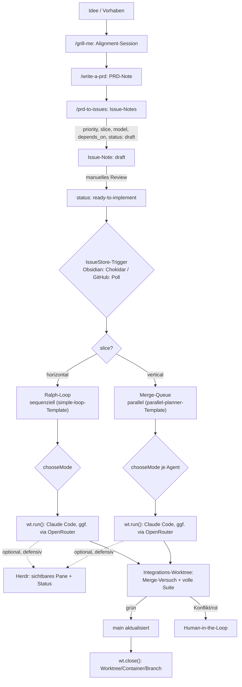
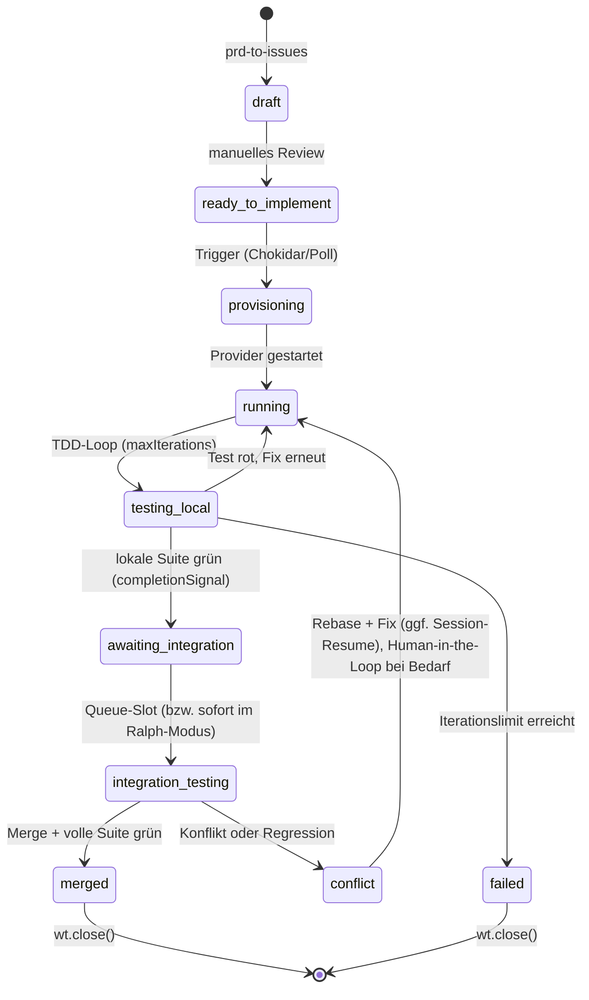
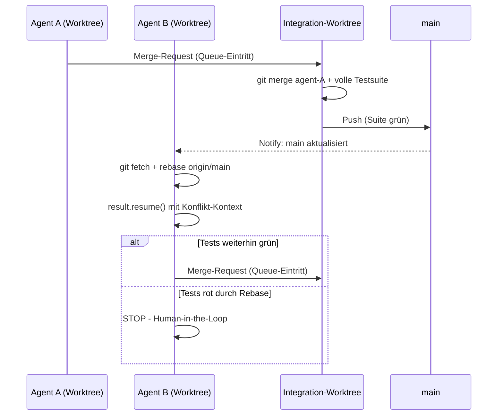

# Agentic Issue Pipeline: Von der Idee zum Merge
### Obsidian-first, mit Docker/Worktree-Hybrid, Claude Code + OpenRouter-Modellwahl, optionalem GitHub-Fallback und Herdr-Sichtbarkeit

---

## 0. Was neu ist gegenüber der Vorversion

Dieser Durchgang folgt bewusst drei Schritten: erst Widersprüche, dann ungenau Beschriebenes, dann allgemeine Verbesserungen. Alle drei sind in diesem Dokument bereits zusammengeführt; diese Liste zeigt, was in welchem Schritt passiert ist.

**Schritt 1 — Widersprüche behoben:**
- **Antigravity komplett entfernt.** Claude Code ist die einzige Agent-CLI. Der `antigravityProvider()`-Stub, `agentKind`, und die Herdr-Detection-Lücke dafür sind weg.
- **Neu dafür: Modellwahl über OpenRouter** (Abschnitt 8.1) — orthogonal zur CLI-Frage, über Claude Codes eigenen `ANTHROPIC_BASE_URL`-Mechanismus.
- **Herdr Muster-A/B-Verwirrung aufgelöst.** Da kein Custom-AgentProvider mehr nötig ist, gibt es nur noch ein Muster: Sandcastle führt aus, Herdr beobachtet (Abschnitt 15).
- **Herdr-Aufrufe sind jetzt defensiv** (`safeHerdr()`-Wrapper) — ein Herdr-Ausfall kann den Pipeline-Lauf nicht mehr blockieren, wie es die eigene Prämisse in Abschnitt 15 immer schon verlangte.
- **Ralph-Loop überschreibt `chooseMode()` nicht mehr blind.** Vorher erzwang `forceMode: "host"` Host-Modus auch für destruktive Migrations-Issues — jetzt respektiert der Ralph-Loop dieselben Sicherheits-Signale wie die Merge-Queue.
- **„Drei strikt getrennte Schichten" präzisiert** (Abschnitt 2): Sandcastles `agent`-Parameter berührt auch die Intelligenz-Schicht — das wird jetzt benannt statt verschwiegen.
- **Sandcastle-API-Namen korrigiert.** Die reale README zeigt `createWorktree()` + `wt.run()` + `wt.close()` (mit Dirty-Preserve-Semantik), nicht die vorher verwendeten fiktiven `wt.create()`/`wt.delete()`. Sandbox-Provider sind `docker()`/`noSandbox()` aus eigenen Subpath-Imports, nicht `dockerProvider()`.

**Schritt 2 — Ungenau Beschriebenes präzisiert:**
- **Merge-Queue steht jetzt auf echtem Fundament statt auf Prosa.** Sandcastle liefert die Templates `parallel-planner` und `parallel-planner-with-review` mit — genau unser Szenario. Abschnitt 13 beschreibt jetzt, wie unsere Obsidian-Issue-Store-Schicht darauf aufsetzt, statt eine FIFO-Queue neu zu erfinden.
- **Ralph-Loop-Fundament geklärt**: Sandcastles `simple-loop`-Template ("Picks issues one by one and closes them") ist exakt das — Abschnitt 12 baut darauf auf.
- **`model`-Property vollständig durchgezogen**: `IssueRecord`, beide Store-Implementierungen (Obsidian/GitHub) und `taskSpecFromIssue()` tragen das Feld jetzt konsistent, nicht nur `TaskSpec` wie vorher bei `agentKind`.
- **`DOCKER_PARALLEL_LIMIT` definiert** (Abschnitt 8), vorher nur in Prosa erwähnt.
- **Der Agent sieht jetzt tatsächlich den Issue-Inhalt.** Vorher war der Prompt ein nackter String (`"Fix issue X"`); jetzt nutzt Abschnitt 14 Sandcastles `promptFile` + dynamische `` !`command` ``-Expansion, um die Issue-Note tatsächlich einzuspeisen.
- **Neuer, präziser offener Punkt statt eines vagen**: Ob `noSandbox()` für `wt.run()` (AFK-Agenten) überhaupt zulässig ist, formuliert Sandcastles eigene README an zwei Stellen leicht widersprüchlich — siehe Abschnitt 19.

**Schritt 3 — Allgemeine Verbesserungen:**
- `sandcastle init --issue-tracker custom` als konkreter Einstiegspfad für die Obsidian-Anbindung (Abschnitt 18).
- Session-Resume (`result.resume()`) für Konflikt-Retries in der Merge-Queue statt blindem Neustart (Abschnitt 13).
- `Output.object()` für einen strukturierten TDD-Bericht statt Freitext-Log (Abschnitt 14).
- Hinweis auf `permissionMode` für AFK-Sicherheit statt stillschweigendem `--dangerously-skip-permissions`-Default (Abschnitt 12).
- `crossPlatformRisk`-Heuristik korrigiert: „posix" als Trigger-Keyword war irreführend (POSIX-Konformität ist eher das *portablere* Verhalten) — ersetzt durch treffendere Begriffe.
- Priorität explizit als pro-Track-scoped dokumentiert (Ralph und Merge-Queue sortieren unabhängig voneinander).

---

## 1. Zielsetzung

Eine durchgehende Kette von der ersten Idee bis zum gemergten Code, bei der jeder Schritt so minimal wie möglich implementiert ist:

1. Eine Idee wird über ein kurzes Alignment-Gespräch (grill-me) zu einer PRD-Note.
2. Die PRD-Note wird in einzelne Issue-Notes zerlegt (prd-to-issues), jede mit Priorität, Abhängigkeiten und einer Kennzeichnung horizontal/vertikal.
3. Eine Statusänderung im Frontmatter einer Issue-Note (lokal, kein Netzwerk) triggert einen Agenten.
4. Der Agent bekommt automatisch die passende Isolationsstufe (Host oder Docker), das passende Ausführungsmodell (sequenziell oder parallel) und optional ein anderes Modell als den Anthropic-Standard.
5. Integration läuft über einen neutralen Worktree, Merge nur nach vollem Testlauf, Eskalation an den Menschen bei echten Konflikten.

Solo-Betrieb ist der Normalfall; Team-Betrieb ist ein austauschbares Backend, kein Sonderfall, der die Architektur verbiegt.

---

## 2. Architekturprinzip

Drei Schichten — mit einer ehrlichen Einschränkung, die vorher unterschlagen wurde: Sandcastles `agent`-Parameter (Abschnitt 8.1) entscheidet auch *welches Modell* denkt, nicht nur *wo* ausgeführt wird. Das ist ein Stück Intelligenz-Schicht, das faktisch in der Sandcastle-Schicht mitläuft. Die Trennung bleibt trotzdem sinnvoll — nur eben nicht hermetisch:

| Schicht | Verantwortung | Komponente |
|---|---|---|
| **Zustand & Trigger** | Wo lebt der Status eines Issues, was löst eine Statusänderung aus | **IssueStore** (Obsidian-Default oder GitHub-Fallback) |
| **Verwaltung der physischen Umgebung (+ Modellwahl)** | Worktree anlegen/schließen, Sandbox wählen, Agent-Provider inkl. Modell konfigurieren | **[Sandcastle](https://github.com/mattpocock/sandcastle)** |
| **Intelligenz & Orchestrierung** | Welches Issue als Nächstes, Ralph-Loop, Merge-Queue-Dispatch | **Antigravity-Name-frei — Orchestrator (TS/Fastify)** |

Der Orchestrator ist ein **persistenter lokaler Prozess** — er braucht ohnehin Dateisystem- und Docker-Zugriff für Sandcastle. Das ist der Grund, warum hier kein Webhook-Server + externer State-Store nötig ist.

### Gesamtüberblick



---

## 3. Vorstufe: Von der Idee zum Issue

### 3.1 `/grill-me`

Kein Artefakt-Zwang. Eine interaktive Ausrichtungs-Session zwischen dir und dem LLM zu einem Design-Konzept, bevor irgendetwas geschrieben wird. Ergebnis fließt als Chat-Kontext oder kurze Notiz in 3.2 ein.

### 3.2 `/write-a-prd`

Erzeugt aus der grill-me-Session eine einzelne Obsidian-Note mit `type: prd` im Frontmatter. Die PRD muss immer aktuell sein: bei einer grundlegenden Planänderung wird die Note **neu geschrieben**, nicht inkrementell gepatcht.

```yaml
---
type: prd
id: prd-2026-001
title: "Geistige Klang-Räume: Gesten-Interaktion Phase 2"
status: approved
created: 2026-07-08
---
```

### 3.3 `/prd-to-issues`

Zerlegt die PRD-Note in mehrere Issue-Notes. Kein echtes Kanban-Board-Widget nötig — eine flache Menge von Notes mit Frontmatter-Properties reicht, sichtbar per Dataview-Query. Für jedes Issue wird gesetzt:

| Property | Werte | Bedeutung |
|---|---|---|
| `priority` | `bugfix` \| `infra` \| `tracer-bullet` \| `polish` \| `refactor` | Reihenfolge der Bearbeitung, absteigend in dieser Liste — gilt separat pro Track (Ralph vs. Merge-Queue), nicht global über beide hinweg |
| `slice` | `horizontal` \| `vertical` | Routing-Entscheidung, siehe Abschnitt 9 |
| `model` | optional, z. B. `openai/gpt-5.2` | Siehe Abschnitt 8.1. Unset = direkter Anthropic-Standardpfad, kein Gateway involviert |
| `depends_on` | Liste von Issue-IDs | Ein Issue wird erst kandidiert, wenn alle Abhängigkeiten `merged` sind |
| `status` | siehe Abschnitt 10 | Der eigentliche State-Machine-Wert |

**Horizontal** heißt: Schicht für Schicht (erst DB, dann API, dann Frontend) — inhärent sequenziell, gehört in den Ralph-Loop. **Vertikal** heißt: eine Tracer-Bullet-Slice quer durch alle Schichten für ein Feature — lose genug gekoppelt für parallele Worktrees.

Neu entstandene Issues starten mit `status: draft` — ein bewusster manueller Gate-Schritt, bevor du sie auf `ready-to-implement` setzt.

**Sichtbarkeit als virtuelles Kanban-Board** (Dataview):

```
TABLE priority, slice, model, status, depends_on
FROM "vault/issues"
WHERE type = "issue"
SORT priority ASC
```

---

## 4. Der Issue-Store: gemeinsame Abstraktion

Eine separate Registry ist bei der Obsidian-Variante nicht nötig, weil die Note selbst der Datensatz ist.

```typescript
// issue-store.ts
export type IssueStatus =
  | "draft"
  | "ready-to-implement"
  | "provisioning"
  | "running"
  | "testing_local"
  | "awaiting_integration"
  | "integration_testing"
  | "conflict"
  | "merged"
  | "failed";

export type Priority = "bugfix" | "infra" | "tracer-bullet" | "polish" | "refactor";
export type Slice = "horizontal" | "vertical";

export interface IssueRecord {
  id: string;
  title: string;
  status: IssueStatus;
  priority: Priority;
  slice: Slice;
  model?: string; // OpenRouter-Slug, z.B. "openai/gpt-5.2" — unset = Anthropic-Standard, siehe 8.1
  mode?: "host" | "container";
  branch?: string;
  worktreePath?: string;
  dependsOn: string[];
  createdAt: string;
  updatedAt: string;
  body: string;
}

export interface IssueStore {
  list(filter?: Partial<Pick<IssueRecord, "status" | "priority" | "slice">>): Promise<IssueRecord[]>;
  get(id: string): Promise<IssueRecord | null>;
  updateStatus(id: string, status: IssueStatus, patch?: Partial<IssueRecord>): Promise<void>;
  appendLog(id: string, heading: string, content: string): Promise<void>;
  onChange(cb: (id: string, prev: IssueRecord | null, next: IssueRecord) => void): void;
}
```

---

## 5. Default-Backend: Obsidian Frontmatter + Chokidar

Kein Webhook, kein API-Client, kein Auth-Token, kein Rate-Limit — reines lokales File-I/O.

```typescript
// obsidian-issue-store.ts
import chokidar from "chokidar";
import matter from "gray-matter";
import { readFile, writeFile, rename } from "fs/promises";
import { glob } from "glob";
import path from "path";

const VAULT_ISSUES_DIR = "./vault/issues";

export class ObsidianIssueStore implements IssueStore {
  private cache = new Map<string, IssueRecord>();
  private listeners: Array<(id: string, prev: IssueRecord | null, next: IssueRecord) => void> = [];

  constructor() {
    this.rescan();
    chokidar.watch(`${VAULT_ISSUES_DIR}/*.md`).on("change", (fp) => this.handleChange(fp));
  }

  private async rescan() {
    for (const f of await glob(`${VAULT_ISSUES_DIR}/*.md`)) await this.loadFile(f);
  }

  private async loadFile(filePath: string): Promise<IssueRecord> {
    const { data, content } = matter(await readFile(filePath, "utf-8"));
    const record: IssueRecord = {
      id: data.id ?? path.basename(filePath, ".md"),
      title: data.title ?? "",
      status: data.status,
      priority: data.priority,
      slice: data.slice,
      model: data.model,
      mode: data.mode,
      branch: data.branch,
      worktreePath: data.worktree,
      dependsOn: data.depends_on ?? [],
      createdAt: data.created,
      updatedAt: data.updated,
      body: content,
    };
    this.cache.set(record.id, record);
    return record;
  }

  private async handleChange(filePath: string) {
    const id = path.basename(filePath, ".md");
    const prev = this.cache.get(id) ?? null;
    const next = await this.loadFile(filePath);
    if (!prev || prev.status !== next.status) {
      this.listeners.forEach((cb) => cb(id, prev, next));
    }
  }

  async list(filter: Partial<Pick<IssueRecord, "status" | "priority" | "slice">> = {}) {
    return [...this.cache.values()].filter((r) =>
      Object.entries(filter).every(([k, v]) => (r as any)[k] === v)
    );
  }

  async get(id: string) {
    return this.cache.get(id) ?? null;
  }

  async updateStatus(id: string, status: IssueStatus, patch: Partial<IssueRecord> = {}) {
    const record = this.cache.get(id);
    if (!record) throw new Error(`Issue ${id} nicht gefunden`);
    const merged = { ...record, ...patch, status, updatedAt: new Date().toISOString() };
    const frontmatter = {
      id: merged.id, title: merged.title, status: merged.status, priority: merged.priority,
      slice: merged.slice, model: merged.model, mode: merged.mode, branch: merged.branch,
      worktree: merged.worktreePath, depends_on: merged.dependsOn,
      created: merged.createdAt, updated: merged.updatedAt,
    };
    const filePath = path.join(VAULT_ISSUES_DIR, `${id}.md`);
    const tmp = `${filePath}.tmp`;
    await writeFile(tmp, matter.stringify(merged.body, frontmatter), "utf-8");
    await rename(tmp, filePath);
    this.cache.set(id, merged);
  }

  async appendLog(id: string, heading: string, content: string) {
    const record = this.cache.get(id);
    if (!record) throw new Error(`Issue ${id} nicht gefunden`);
    const entry = `\n\n### [${new Date().toISOString()}] ${heading}\n${content}\n`;
    await this.updateStatus(id, record.status, { body: record.body + entry });
  }

  onChange(cb: (id: string, prev: IssueRecord | null, next: IssueRecord) => void) {
    this.listeners.push(cb);
  }
}
```

**Wichtige Praxis-Regeln:**

- Rohes `stdout`/`stderr` gehört nicht in die Note (Vault-Bloat). Logs landen in `./logs/<issueId>/<timestamp>.log`; `appendLog` schreibt nur eine Zusammenfassung plus Pfad-Referenz.
- Agenten schreiben append-only an den Body — minimiert Kollisionsfläche mit manuellen Edits.
- Bei geräteübergreifendem Sync (Obsidian Sync/Dropbox/iCloud): Orchestrator nur gegen die lokale, primäre Kopie laufen lassen.
- Der `cache` ist reine Performance-Optimierung, kein zweiter Wahrheitsträger — er darf aus der Sync geraten, weil `rescan()` ihn repariert.

---

## 6. Fallback-Backend: GitHub Issues + Labels (Team-Fall)

Nur relevant, sobald ein zweiter Mensch mitarbeitet, externe Sichtbarkeit ohne Vault-Zugriff gewünscht ist, oder GitHub Actions als CI-Gate eingebunden werden soll. Kein Webhook-Server nötig — ein Poll-Loop im selben persistenten Orchestrator-Prozess reicht.

```typescript
// github-issue-store.ts
import { execSync } from "child_process";

const POLL_INTERVAL_MS = 30_000;

export class GitHubIssueStore implements IssueStore {
  private cache = new Map<string, IssueRecord>();
  private listeners: Array<(id: string, prev: IssueRecord | null, next: IssueRecord) => void> = [];

  constructor(private repo: string) {
    this.poll();
    setInterval(() => this.poll(), POLL_INTERVAL_MS);
  }

  private async poll() {
    const raw = execSync(
      `gh issue list --repo ${this.repo} --state open --json number,title,labels,body,updatedAt`
    ).toString();
    for (const issue of JSON.parse(raw)) {
      const id = String(issue.number);
      const labels: string[] = issue.labels.map((l: any) => l.name);
      const byPrefix = (prefix: string, fallback?: string) =>
        labels.find((l) => l.startsWith(`${prefix}:`))?.split(":").slice(1).join(":") ?? fallback;
      const next: IssueRecord = {
        id,
        title: issue.title,
        status: byPrefix("status", "draft") as IssueStatus,
        priority: byPrefix("priority", "polish") as Priority,
        slice: byPrefix("slice", "vertical") as Slice,
        // model-Slugs enthalten "/" (z.B. "openai/gpt-5.2") — das Label-Präfix-Schema
        // splittet nur am ERSTEN ":", der Rest bleibt intakt. Trotzdem: GitHub-Labels
        // sind für Freitext-Slugs unbequemer als Obsidian-Frontmatter — im Team-Fall ggf.
        // model bewusst nur über Obsidian-Notes setzen, auch wenn Status via GitHub läuft.
        model: byPrefix("model"),
        dependsOn: [],
        createdAt: issue.updatedAt,
        updatedAt: issue.updatedAt,
        body: issue.body,
      };
      const prev = this.cache.get(id) ?? null;
      this.cache.set(id, next);
      if (!prev || prev.status !== next.status) this.listeners.forEach((cb) => cb(id, prev, next));
    }
  }

  async list(filter: Partial<Pick<IssueRecord, "status" | "priority" | "slice">> = {}) {
    return [...this.cache.values()].filter((r) =>
      Object.entries(filter).every(([k, v]) => (r as any)[k] === v)
    );
  }

  async get(id: string) {
    return this.cache.get(id) ?? null;
  }

  async updateStatus(id: string, status: IssueStatus, patch: Partial<IssueRecord> = {}) {
    const record = this.cache.get(id);
    const removeFlag = record ? `--remove-label "status:${record.status}"` : "";
    execSync(`gh issue edit ${id} --repo ${this.repo} ${removeFlag} --add-label "status:${status}"`);
    if (record) this.cache.set(id, { ...record, ...patch, status, updatedAt: new Date().toISOString() });
  }

  async appendLog(id: string, heading: string, content: string) {
    const body = `### [${new Date().toISOString()}] ${heading}\n${content}`;
    execSync(`gh issue comment ${id} --repo ${this.repo} --body ${JSON.stringify(body)}`);
  }

  onChange(cb: (id: string, prev: IssueRecord | null, next: IssueRecord) => void) {
    this.listeners.push(cb);
  }
}
```

Bewusst **weggelassen** verglichen mit dem echten Oz-Orchestrator: kein Webhook-Empfänger, kein Vercel-Deployment, kein KV-Store, keine Trust/Provenance-Prüfung nach `author_association` — das löst ein Problem (viele fremde, nicht vertrauenswürdige Contributor), das im Team-internen Fall nicht existiert.

---

## 7. Wann wechseln?

| Kriterium | Obsidian (Default) | GitHub (Fallback) |
|---|---|---|
| Nur du arbeitest am Projekt | ✅ | – |
| Zweiter Mensch braucht Sichtbarkeit ohne Vault-Zugriff | – | ✅ |
| GitHub Actions als CI-Gate vor Merge gewünscht | – | ✅ |
| Kein Netzwerk/API-Abhängigkeit gewünscht | ✅ | – |
| Issue-Note soll gleichzeitig Wissensgraph-Knoten sein | ✅ | – |

Der Wechsel ist rein additiv: `new GitHubIssueStore(repo)` statt `new ObsidianIssueStore()` an der einzigen Stelle, an der der Store instanziiert wird.

---

## 8. Routing A: Host vs. Docker (`chooseMode`)

Worktree-Erstellung ist immer Pflicht, Docker wird nur bei konkretem Grund zugeschaltet.

| Kriterium | Host | Docker |
|---|---|---|
| Reines Sprach-Tooling bereits auf Host vorhanden | ✅ | – |
| Zusätzlicher Service nötig (DB, Redis, …) | – | ✅ |
| Anderes OS / plattformspezifische Bibliotheken | – | ✅ |
| Übergeordnete Ordner sollen unsichtbar bleiben | – | ✅ |
| CI-Parität gewünscht | – | ✅ |
| Task als destruktiv markiert | – | ✅ |
| Schnelligkeit hat Priorität | ✅ | – |

```typescript
// mode-decision.ts
export type AgentMode = "host" | "container";

export interface TaskSpec {
  issueId: string;
  branchName: string;
  model?: string; // siehe 8.1 — unabhängig von AgentMode
  forceMode?: AgentMode;
  signals?: {
    needsService?: boolean;
    crossPlatformRisk?: boolean;
    destructive?: boolean;
    parallelAgentCount?: number;
  };
  dockerImage?: string;
}

const HOST_PARALLEL_LIMIT = 4;
// Container brauchen mehr RAM/CPU pro Instanz als Host-Prozesse — Limit bewusst niedriger.
const DOCKER_PARALLEL_LIMIT = 2;

export function chooseMode(spec: TaskSpec): AgentMode {
  if (spec.forceMode) return spec.forceMode;
  const s = spec.signals ?? {};
  if (s.needsService || s.crossPlatformRisk || s.destructive) return "container";
  if ((s.parallelAgentCount ?? 0) >= HOST_PARALLEL_LIMIT) return "container";
  return "host";
}

export function taskSpecFromIssue(issue: IssueRecord, overrides: Partial<TaskSpec> = {}): TaskSpec {
  return {
    issueId: issue.id,
    branchName: issue.branch ?? `agent/${issue.id}`,
    model: issue.model,
    signals: {
      needsService: /docker-compose/.test(issue.body),
      crossPlatformRisk: /native binding|windows-only|platform-specific/i.test(issue.body),
      destructive: /migration|drop table|rm -rf/i.test(issue.body),
    },
    ...overrides,
  };
}
```

`DOCKER_PARALLEL_LIMIT` wird vom Merge-Queue-Dispatcher (Abschnitt 13) als Obergrenze für gleichzeitig laufende Container-Agenten durchgesetzt — Details hängen davon ab, ob die Queue-Logik handgeschrieben oder aus Sandcastles `parallel-planner`-Template abgeleitet wird.

### 8.1 Modellwahl: Claude Code bleibt die einzige CLI, das Modell dahinter ist trotzdem austauschbar

Claude Code ist jetzt der alleinige Agent — kein `agentKind` mehr, kein Custom-`AgentProvider`. Trotzdem lässt sich *welches Modell* antwortet unabhängig davon konfigurieren, weil Claude Code selbst genau dafür einen Mechanismus mitbringt: `ANTHROPIC_BASE_URL` (wohin Anfragen gehen) plus `ANTHROPIC_MODEL`/Modell-Alias-Variablen (welches Modell dort angefragt wird). Sandcastles `claudeCode()`-Provider reicht das direkt durch — der zweite Options-Parameter akzeptiert `env: Record<string, string>`, das pro Lauf gemerged wird (überschreibt `.sandcastle/.env` für überlappende Keys, muss sich nicht mit dem Sandbox-Env überschneiden, sonst wirft `run()`).

**Die Einschränkung, die das für OpenRouter bedeutet:** Claude Code spricht das Anthropic-Messages-API-Format. OpenRouters natives API ist OpenAI-chat-completions-förmig — die beiden passen nicht direkt zusammen. Es braucht einen kleinen Übersetzer dazwischen. Zwei verifiziert funktionierende Optionen: **LiteLLM Gateway** (von Anthropics eigener Doku als Standardweg für „LLM gateways" referenziert) oder **agentgateway**, das explizit eine Claude-Code-Integration für beliebige OpenAI-kompatible Provider dokumentiert. Beide laufen **einmalig lokal**, kein Pro-Task-Lifecycle nötig:

```yaml
# gateway-config.yaml (agentgateway, einmalig lokal gestartet, z.B. via `agentgateway -f gateway-config.yaml`)
llm:
  models:
    - name: "*"
      provider: openAI
      params:
        baseURL: "https://openrouter.ai/api/v1"
        apiKey: "$OPENROUTER_API_KEY"
```

```typescript
// model-provider.ts
import { claudeCode } from "@ai-hero/sandcastle";

// Adresse des lokalen Gateway-Prozesses — Port prüfen, sobald der Gateway läuft.
const GATEWAY_URL = process.env.CLAUDE_MODEL_GATEWAY_URL ?? "http://localhost:4141";

export function getAgent(modelSlug?: string) {
  if (!modelSlug) {
    // Kein Override: direkter Anthropic-Standardpfad, kein Gateway involviert.
    return claudeCode("claude-opus-4-8");
  }
  // modelSlug in OpenRouter-Notation, z.B. "openai/gpt-5.2" oder "google/gemini-3-pro".
  return claudeCode(modelSlug, {
    env: {
      ANTHROPIC_BASE_URL: GATEWAY_URL,
      ANTHROPIC_AUTH_TOKEN: process.env.OPENROUTER_GATEWAY_TOKEN ?? "",
    },
  });
}
```

Da jeder `runAgent()`-Aufruf (Abschnitt 14) einen eigenen `claudeCode(...)`-Aufruf mit eigenem `env`-Objekt macht, gibt es kein globales `process.env`-Mutieren — jeder parallele Agent (Merge-Queue, Abschnitt 13) bekommt sein eigenes Modell, ohne dass sich Läufe gegenseitig stören können.

**Caveat, nicht zu unterschätzen:** Nicht jedes über OpenRouter erreichbare Modell eignet sich für Claude Code — es braucht laut Anthropics eigener Provider-Integrationsdoku „starke Tool-Calling-Fähigkeiten". Vor produktivem Einsatz eines bestimmten Modells den konkreten TDD-Loop-Workflow testen, nicht nur einen einfachen Chat.

---

## 9. Routing B: Sequenziell (Ralph-Loop) vs. Parallel (Merge-Queue)

```typescript
function routeExecution(issue: IssueRecord): "ralph" | "merge-queue" {
  return issue.slice === "horizontal" ? "ralph" : "merge-queue";
}

function dependenciesSatisfied(issue: IssueRecord, all: IssueRecord[]): boolean {
  return issue.dependsOn.every((depId) => all.find((i) => i.id === depId)?.status === "merged");
}

const PRIORITY_ORDER: Priority[] = ["bugfix", "infra", "tracer-bullet", "polish", "refactor"];

// Läuft getrennt pro Track — Ralph und Merge-Queue sortieren unabhängig,
// nie gemeinsam über eine globale Prioritätsliste.
function pickNextIssue(candidates: IssueRecord[], all: IssueRecord[]): IssueRecord | null {
  const ready = candidates
    .filter((i) => i.status === "ready-to-implement" && dependenciesSatisfied(i, all))
    .sort((a, b) => PRIORITY_ORDER.indexOf(a.priority) - PRIORITY_ORDER.indexOf(b.priority));
  return ready[0] ?? null;
}
```

Beide Pfade laufen am Ende durch denselben Integrations-Worktree-Test (Abschnitt 13) — im Ralph-Modus entfällt nur das Warten auf einen Queue-Slot, weil es keine Konkurrenz gibt.

---

## 10. Zustandsmodell



---

## 11. Ablaufplan – Single Agent

1. Trigger: `status` einer Issue-Note wechselt auf `ready-to-implement` (Obsidian) bzw. Label `status:ready-to-implement` wird gesetzt (GitHub).
2. `routeExecution(issue)` → Ralph oder Merge-Queue (Abschnitt 9).
3. `chooseMode(taskSpecFromIssue(issue))` → Host oder Docker (Abschnitt 8); `getAgent(issue.model)` → Claude Code, ggf. via OpenRouter-Gateway (Abschnitt 8.1).
4. Provisioning: `createWorktree({ branchStrategy: { type: "branch", branch } })`.
5. TDD-Loop über `wt.run({ agent, sandbox, promptFile, maxIterations })` — Sandcastle iteriert selbst bis `completionSignal` (Default `<promise>COMPLETE</promise>`) oder `maxIterations` erreicht ist.
6. Lokaler Abschluss: Commits liegen laut `result.commits` vor, Status → `awaiting_integration`.
7. Integrations-Test (Abschnitt 13), dann Merge oder Konflikt-Eskalation.
8. Cleanup: `wt.close()` — bei sauberem Zustand entfernt, bei unfertigem/dirty Zustand automatisch auf der Platte erhalten (kein Datenverlust bei überraschendem Abbruch).

---

## 12. Ablaufplan – Ralph-Loop (horizontal, AFK, sequenziell)

Fundament ist Sandcastles eigenes `simple-loop`-Template ("Picks issues one by one and closes them") — unser Beitrag ist die Obsidian-Anbindung und die Prioritäts-/Abhängigkeits-Auswahl davor:

```typescript
// ralph-loop.ts
export async function ralphLoop(store: IssueStore) {
  while (true) {
    const all = await store.list();
    const candidates = all.filter((i) => i.slice === "horizontal");
    const next = pickNextIssue(candidates, all);
    if (!next) {
      console.log("Ralph: keine offenen horizontalen Issues mehr, Loop beendet.");
      return;
    }
    // KEIN forceMode mehr — chooseMode() respektiert weiterhin destructive/needsService-
    // Signale. Ralph ist sequenziell (parallelAgentCount bleibt 0), landet aber nur dann
    // automatisch auf Host, wenn kein anderes Signal dagegenspricht.
    await runAgent(store, taskSpecFromIssue(next));
  }
}
```

Kein Sentinel-Text-Parsing auf Orchestrator-Ebene nötig — Sandcastles eingebauter `completionSignal`-Mechanismus übernimmt das; unsere Abbruchbedingung für den Loop selbst ist strukturierter Zustand (leere Kandidatenliste).

**Sicherheitshinweis für AFK-Läufe:** Sandcastle nutzt für unbeaufsichtigte Läufe standardmäßig `--dangerously-skip-permissions`, sofern `permissionMode` nicht gesetzt ist. Für einen nächtlichen Ralph-Loop bewusst entscheiden, ob das gewollt ist, oder `claudeCode(model, { permissionMode: "acceptEdits" })` setzen.

Auslösung des Loops selbst (Cron, `launchd`, oder manueller Aufruf vor Feierabend) ist Sache der Umgebung, nicht Teil dieser Spec — `ralphLoop()` ist eine Funktion, kein Daemon.

---

## 13. Ablaufplan – Merge-Queue (vertikal, parallel)

Fundament ist Sandcastles `parallel-planner`- bzw. `parallel-planner-with-review`-Template ("Plans parallelizable issues, executes on separate branches, then merges") — das deckt exakt das Szenario ab, das hier vorher als Prosa ohne Code stand. Unser Beitrag: der Planner liest Kandidaten aus dem `IssueStore` (Obsidian oder GitHub) statt aus nativen GitHub Issues — dafür scaffoldet `sandcastle init` mit `--issue-tracker custom` einen bewusst unvollständigen Zustand plus eine `SETUP_ISSUE_TRACKER.md`-Anleitung, die genau diese Anbindung führt.

Der Ablauf, unverändert im Prinzip:

1. Jeder Agent committet ausschließlich auf seinem eigenen Branch (`branchStrategy: { type: "branch", branch: "agent/<issueId>" }`). Kein direkter Merge auf `main` durch den Agenten selbst.
2. Ein neutraler Integrations-Worktree ist der Flaschenhals für den eigentlichen Merge-Versuch.
3. Agent meldet „bereit" (`awaiting_integration`) → Planner-Queue-Eintritt.
4. An der Spitze der Queue: Merge-Versuch, dann volle Testsuite im Integrations-Worktree.
   - Grün → Push nach `main`, Status `merged`.
   - Rot trotz konfliktfreiem Merge → Status `conflict`.
   - Git-Konflikt → Agent erhält Rebase-Auftrag, erneuter Queue-Eintritt.
5. **Konflikt-Retry mit Kontext statt Neustart:** Da Claude-Code-Sessions über `captureSessions` (Default an) automatisch gesichert werden, muss ein Rebase-Konflikt nicht bei null anfangen — `result.resume("Der Merge hat einen Konflikt in Datei X erzeugt: …")` setzt dieselbe Session fort, der Agent kennt seinen vorherigen Kontext.
6. **Human-in-the-Loop**: Erkennt ein Agent nach Rebase, dass vorher grüne Tests jetzt rot sind, stoppt er automatisch und meldet: „Konflikt durch Agent X erkannt, benötige Entscheidung." Kein automatisches Weiterprobieren über ein konfigurierbares Limit hinaus.



---

## 14. Referenzimplementierung: `run-agent.ts`

Nutzt die reale Sandcastle-API (`createWorktree`/`wt.run`/`wt.close`, echte Sandbox-Imports) und speist den Issue-Inhalt tatsächlich in den Prompt ein. Herdr-Aufrufe sind über `safeHerdr()` defensiv gekapselt — ein Herdr-Ausfall kann diesen Lauf nicht mehr blockieren:

```typescript
// run-agent.ts
import { createWorktree } from "@ai-hero/sandcastle";
import { docker } from "@ai-hero/sandcastle/sandboxes/docker";
import { noSandbox } from "@ai-hero/sandcastle/sandboxes/no-sandbox";
import { chooseMode, taskSpecFromIssue, TaskSpec, AgentMode } from "./mode-decision";
import { getAgent } from "./model-provider";
import { IssueStore } from "./issue-store";
import { herdrOpenWorktree, herdrNotifyHuman, herdrCloseWorkspace } from "./herdr-adapter";

function getSandbox(mode: AgentMode, dockerImage?: string) {
  return mode === "container"
    ? docker({ imageName: dockerImage ?? "sandcastle:local" })
    : noSandbox();
}

// Herdr ist reine Beobachtungsschicht — ein Fehler hier darf den Agent-Lauf nie blockieren.
function safeHerdr<T>(fn: () => T): T | undefined {
  try {
    return fn();
  } catch (e) {
    console.warn("Herdr-Aufruf fehlgeschlagen (ignoriert):", e);
    return undefined;
  }
}

export async function runAgent(store: IssueStore, spec: TaskSpec) {
  const mode = chooseMode(spec);

  await using wt = await createWorktree({
    branchStrategy: { type: "branch", branch: spec.branchName },
  });

  await store.updateStatus(spec.issueId, "provisioning", {
    mode, worktreePath: wt.worktreePath, branch: spec.branchName,
  });

  const herdrWs = safeHerdr(() => herdrOpenWorktree(wt.worktreePath, process.cwd(), `issue-${spec.issueId}`));

  try {
    await store.updateStatus(spec.issueId, "running");

    const result = await wt.run({
      agent: getAgent(spec.model),
      sandbox: getSandbox(mode, spec.dockerImage),
      // promptFile statt nacktem String — die Issue-Note wird per dynamischer
      // `!`command`"-Expansion tatsächlich eingespeist, siehe skills/tdd-loop.md.
      promptFile: "./skills/tdd-loop.md",
      promptArgs: { ISSUE_ID: spec.issueId },
      maxIterations: 5, // TDD-Loop-Iterationslimit, siehe Abschnitt 17
    });

    await store.appendLog(
      spec.issueId,
      `Implementer (${mode}${spec.model ? `, ${spec.model}` : ""})`,
      `Lokale Testsuite grün, ${result.commits.length} Commit(s) erstellt.`
    );
    await store.updateStatus(spec.issueId, "awaiting_integration");
  } catch (e) {
    safeHerdr(() => herdrNotifyHuman(`Issue ${spec.issueId} blockiert`, String(e)));
    await store.appendLog(spec.issueId, "Implementer", `Fehlgeschlagen: ${String(e)}`);
    await store.updateStatus(spec.issueId, "failed");
    // wt.close() läuft automatisch über `await using` — bei dirty Zustand bleibt der
    // Worktree auf der Platte erhalten statt gelöscht zu werden (siehe Abschnitt 16).
  } finally {
    if (herdrWs) safeHerdr(() => herdrCloseWorkspace(herdrWs.workspaceId));
  }
}
```

`skills/tdd-loop.md` (Ausschnitt, zeigt die dynamische Kontext-Einspeisung):

```
# Issue

!`cat vault/issues/{{ISSUE_ID}}.md`

# TDD Loop Protokoll
1. REPRODUKTION: Schreibe einen Test, der das gemeldete Problem exakt abbildet...
2. FIX: Ändere den minimal nötigen Code...
3. VERIFIKATION: Führe die gesamte Test-Suite aus...
4. BERICHT: Committe. Wenn alle Tests grün sind, gib <promise>COMPLETE</promise> aus.
```

Dispatcher (`IssueStore.onChange` → `runAgent`):

```typescript
// dispatcher.ts
store.onChange(async (id, prev, next) => {
  if (next.status !== "ready-to-implement" || prev?.status === "ready-to-implement") return;
  if (next.slice === "horizontal") return; // läuft über ralphLoop(), nicht event-getrieben
  await runAgent(store, taskSpecFromIssue(next));
});
```

---

## 15. Terminal-Sichtbarkeit: Herdr als Beobachtungsschicht

Optional, additiv, steuert nichts — Herdr wird niemals zur zweiten Wahrheitsquelle. Der Kontrollfluss bleibt exakt wie in Abschnitt 14 (Sandcastles `wt.run()`-Ergebnis entscheidet über `awaiting_integration`/`failed`); Herdr bekommt Zustände nur gemeldet bzw. zeigt sie an, jetzt strukturell erzwungen durch `safeHerdr()` statt nur behauptet.

### 15.1 Warum Herdr hier passt

Sandcastle isoliert Agenten in Worktrees + Docker; Herdr macht mehrere gleichzeitig laufende Terminal-Sessions als eigene Panes sichtbar und erkennt bei unterstützten Coding-CLIs (`claude`, `codex`, `copilot`, `devin`, `droid`, `kimi`, `opencode`, `kilo`, `hermes`, `qodercli`, `cursor`) den Status (`working`/`blocked`/`idle`) **automatisch** aus dem Bildschirminhalt, sobald einmalig `herdr integration install claude` installiert ist. Da Claude Code jetzt die einzige CLI in dieser Spec ist, gilt das durchgehend — anders als vorher (Antigravity war nicht in dieser Liste) ist der „kein eigener Reporting-Code nötig"-Vorteil jetzt keine Ausnahme mehr, sondern der Normalfall. Das gilt auch beim Umweg über OpenRouter (Abschnitt 8.1): Herdr erkennt die `claude`-CLI am Bildschirminhalt, unabhängig davon, welches Modell dahinter über `ANTHROPIC_BASE_URL` antwortet.

### 15.2 Genau ein Integrationsmuster

Da Sandcastle immer der Ausführer ist (`wt.run()`) und kein Custom-AgentProvider mehr nötig ist (Antigravity ist raus), gibt es nur noch ein Muster: Sandcastle führt aus, Herdr öffnet einen Workspace am Worktree-Pfad und beobachtet passiv. Kein manuelles `herdr agent start` nötig, kein zweites Muster mehr offenzuhalten.

### 15.3 Korrekturen gegenüber der ursprünglichen Notiz

Gegen die offizielle Doku (herdr.dev/docs) geprüft:

- **Status setzen ist nicht `herdr agent rename`** — das vergibt nur den *Namen*. Der Status läuft über `herdr pane report-agent <pane_id> --state idle|working|blocked|unknown`. `done` ist dort **kein** manuell setzbarer Wert, sondern wird aus Herdrs eigener Bildschirm-Erkennung abgeleitet. Deshalb bleibt Abschluss-Erkennung Sache von Sandcastles `wt.run()`-Ergebnis, nicht von Herdr.
- **Worktree-Anbindung läuft über `herdr worktree open --path <sandcastle-worktree>`**, nicht über manuelles `pane split --cwd`. Sandcastle bleibt alleiniger Besitzer der Git-Lebenszyklus-Operationen.
- **Aufräumen: `workspace close`, nicht `worktree remove`.** `worktree remove` würde selbst `git worktree remove` ausführen — das hat Sandcastle über `wt.close()` schon erledigt (oder bewusst unterlassen, wenn dirty). `workspace close` schließt nur den Herdr-internen Zustand.

### 15.4 Adapter

```typescript
// herdr-adapter.ts — reine Beobachtungsschicht, kein Kontrollfluss
import { execSync } from "child_process";

interface HerdrWorktreeHandle {
  workspaceId: string;
  rootPaneId: string; // Feldnamen vor Produktivnutzung gegen tatsächliche --json-Antwort prüfen
}

export function herdrOpenWorktree(worktreePath: string, parentRepoCwd: string, label: string): HerdrWorktreeHandle {
  const out = JSON.parse(execSync(
    `herdr worktree open --cwd "${parentRepoCwd}" --path "${worktreePath}" --label "${label}" --no-focus --json`
  ).toString());
  return { workspaceId: out.workspace.workspace_id, rootPaneId: out.root_pane.pane_id };
}

export function herdrReadRecent(agentName: string, lines = 60): string {
  return execSync(`herdr agent read "${agentName}" --source recent-unwrapped --lines ${lines}`).toString();
}

export function herdrNotifyHuman(title: string, body: string) {
  execSync(`herdr notification show "${title}" --body "${body}" --sound request`);
}

export function herdrCloseWorkspace(workspaceId: string) {
  execSync(`herdr workspace close ${workspaceId}`); // NICHT worktree remove, siehe 15.3
}
```

Alle Aufrufer kapseln diese Funktionen über `safeHerdr()` (Abschnitt 14) — das ist keine Empfehlung mehr, sondern strukturell erzwungen.

---

## 16. Cleanup- und Ressourcenstrategie

| Ressource | Strategie |
|---|---|
| Worktree-Ordner | `wt.close()` via `await using` — bei sauberem Zustand entfernt, bei unfertigem/dirty Zustand automatisch auf der Platte erhalten (Sandcastles eigene Semantik, kein manuelles `wt.delete()` nötig oder vorhanden). |
| Docker-Container | Teil des Sandbox-Lifecycles, endet mit dem `wt.run()`-Aufruf. |
| Herdr-Workspace | `workspace close` nach Abschluss (siehe 15.3), defensiv über `safeHerdr()`. |
| Branches | Nach Merge löschen (lokal + remote); nicht-gemergte für Post-Mortem mind. 7 Tage behalten. |
| Logs | `./logs/<issueId>/` getrennt vom Vault — Notes bekommen nur Zusammenfassung + Pfad. |
| Parallelitätsgrenze | `HOST_PARALLEL_LIMIT` (4) und `DOCKER_PARALLEL_LIMIT` (2) — beide in Abschnitt 8 definiert. |
| Verwaiste Issues | Periodischer Scan: Notes mit `status: running`/`provisioning` ohne Aktualisierung > X Minuten → als „verwaist" markieren, nicht automatisch zurücksetzen. |

---

## 17. Monitoring & Fehlerfälle

- Jede Statuswechsel-Entscheidung basiert auf Sandcastles `result`-Objekt (Commits, `completionSignal`) oder Git-Ergebnissen, nie auf der Freitext-Interpretation des Modell-Outputs.
- Iterationslimit im TDD-Loop (`maxIterations: 5`) → danach `failed` statt Endlosschleife.
- `conflict`/`failed` erzeugen immer eine sichtbare Benachrichtigung — Note-Update, GitHub-Kommentar, und zusätzlich eine Desktop-Notification über Herdr, die auch ankommt, wenn du gerade nicht im Vault oder Terminal schaust.
- `depends_on`-Zyklen sollten bei `prd-to-issues` per topologischem Check ausgeschlossen werden, bevor Issues auf `ready-to-implement` gesetzt werden.
- Bei Fehlschlägen mit gesetztem `model` (Abschnitt 8.1) das verwendete Modell mitloggen — hilft, Tool-Calling-Schwächen einzelner OpenRouter-Modelle von echten Bugs zu unterscheiden.

---

## 18. Build-Phasen (vertikale Slices)

**Prinzip:** Jede Phase liefert einen vollständigen, lauffähigen Pfad von Issue zu Merge — nicht eine isolierte Schicht.

### Slice 1 — Minimaler Ende-zu-Ende-Pfad (Fundament)

- `sandcastle init --issue-tracker custom` als Startpunkt (scaffoldet `.sandcastle/` inkl. Dockerfile mit vorinstallierter Claude Code CLI, plus `SETUP_ISSUE_TRACKER.md`-Anleitung für die Obsidian-Anbindung)
- `vault/issues/`-Ordner, Frontmatter-Schema
- `ObsidianIssueStore` (Chokidar + gray-matter), `onChange`-Dispatch
- `run-agent.ts` nur mit `noSandbox()`, ein Agent, `claudeCode("claude-opus-4-8")` ohne Modell-Override
- Direkter Merge nach grüner lokaler Testsuite (vereinfachte Vorstufe von Abschnitt 13 — noch ohne Integrations-Worktree/Queue, da nur ein Agent gleichzeitig läuft)

**Bewusst noch nicht enthalten:** `grill-me`/`write-a-prd`/`prd-to-issues` (Issues von Hand geschrieben), Docker, Parallelität, Herdr, GitHub-Backend, OpenRouter.

**Ergebnis:** Eine Note mit `status: ready-to-implement` läuft ohne weiteres Zutun bis `merged`.

### Slice 2 — Vorstufe: Von der Idee zum Issue

- `/grill-me`, `/write-a-prd`, `/prd-to-issues` als Prompts

### Slice 3 — Isolationsstufe: Host vs. Docker

- `docker()`, `chooseMode()`, Signal-Erkennung

### Slice 4 — Ausführungsmodell: Ralph-Loop vs. Merge-Queue

- Sandcastles `simple-loop`-Template als Ralph-Fundament, `parallel-planner`-Template als Merge-Queue-Fundament, jeweils mit Obsidian-Store-Glue statt nativer GitHub-Issue-Anbindung

### Slice 5 — Modellwahl über OpenRouter

- Lokalen Gateway aufsetzen (agentgateway oder LiteLLM Gateway), `model-provider.ts`, `model`-Property im Frontmatter-Schema

### Slice 6 — Ressourcen-Hygiene

- Periodischer Scan für verwaiste Worktrees/Branches (Abschnitt 16)

### Slice 7 (optional) — Team-Backend

- `GitHubIssueStore`, Label-Taxonomie (Abschnitt 6)

### Slice 8 (optional) — Terminal-Sichtbarkeit

- `herdr integration install claude`, Adapter aus 15.4, Notification-Hook

### Slice 9 (optional, später) — Zusätzliches Review-Gate

- Sandcastles `parallel-planner-with-review`- bzw. `sequential-reviewer`-Template statt Eigenbau

### Übersicht

| Slice | Erweitert | Ergebnis |
|---|---|---|
| 1 | — (Fundament) | Ein von Hand angelegtes Issue läuft vollautomatisch bis `merged` |
| 2 | Slice 1 | Von der Idee bis zum Merge, ohne manuelles Schreiben von Notes |
| 3 | Slice 1–2 | Automatische Isolationsstufe (Host/Docker) pro Issue |
| 4 | Slice 1–3 | Parallele Bearbeitung über Ralph-Loop / Merge-Queue |
| 5 | Slice 1–4 | Modellwahl pro Issue über OpenRouter |
| 6 | Slice 1–5 | Kein manuelles Aufräumen mehr nötig |
| 7 (optional) | Slice 1–6 | Austauschbares Team-Backend (GitHub) |
| 8 (optional) | Slice 1–6 | Terminal-Sichtbarkeit über Herdr |
| 9 (optional, später) | Slice 1–6 | Zusätzliches Review-Gate vor Merge |

---

## 19. Offene Punkte / Risiken

- **`noSandbox()` für `wt.run()` — Zulässigkeit nicht eindeutig.** Sandcastles README sagt an einer Stelle, Worktree-Methoden „accept the same providers as their top-level counterparts" (also inklusive `noSandbox()`), formuliert an anderer Stelle aber für `WorktreeRunOptions.sandbox`: „Required. Sandbox provider (**AFK agents must be sandboxed**)". Vor produktivem Host-Modus-Einsatz im Ralph-Loop (Abschnitt 12) das empirisch verifizieren, statt sich auf eine der beiden Formulierungen zu verlassen.
- **Nicht jedes OpenRouter-Modell eignet sich für Claude Codes Tool-Calling-Anforderungen** (Abschnitt 8.1) — je Modell mit dem echten TDD-Loop testen, nicht nur mit einem einfachen Chat.
- **Logische Konflikte ohne Git-Konflikt**: ein Merge kann textuell sauber sein, die Suite trotzdem brechen. Deshalb ist der volle Testlauf im Integrations-Worktree Pflicht, auch wenn Git „SUCCESS" meldet.
- **Container-Start-Latenz**: bei sehr kurzen Fix-Iterationen frisst der Docker-Start-Overhead den Isolationsvorteil zeitlich auf.
- **Vault-Sync-Races**: siehe Abschnitt 5 — Orchestrator nur gegen die lokale, primäre Vault-Kopie laufen lassen.
- **Monorepo-Skalierung**: diese Spec geht von Vollzugriff jedes Worktrees auf das gesamte Repo aus; `sparse-checkout` wäre ein separates, hier bewusst ausgeklammertes Vorhaben.
- **GitHub-Anbindung bleibt Fallback, kein Ziel**: der Wechsel lohnt sich erst mit echtem Team-Bedarf (Abschnitt 7).
