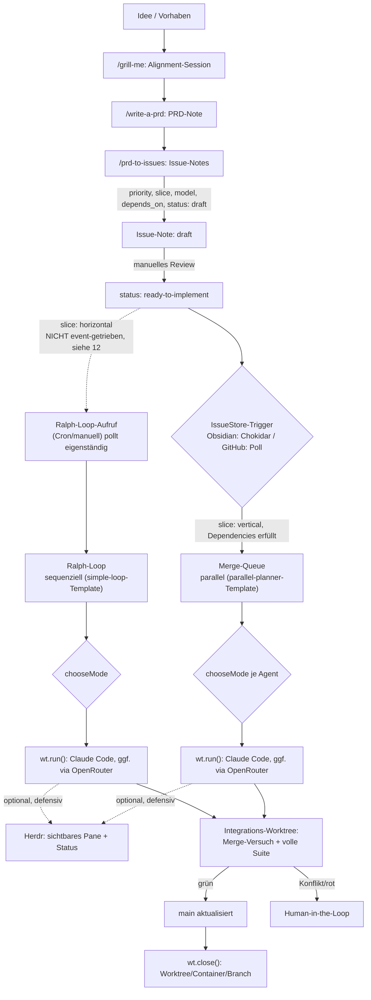
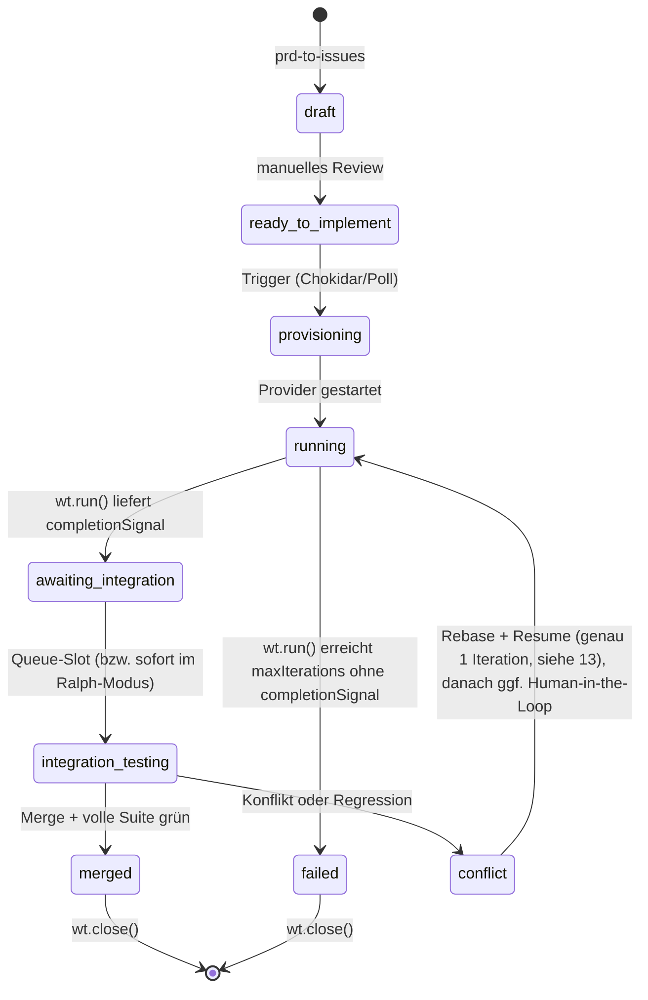
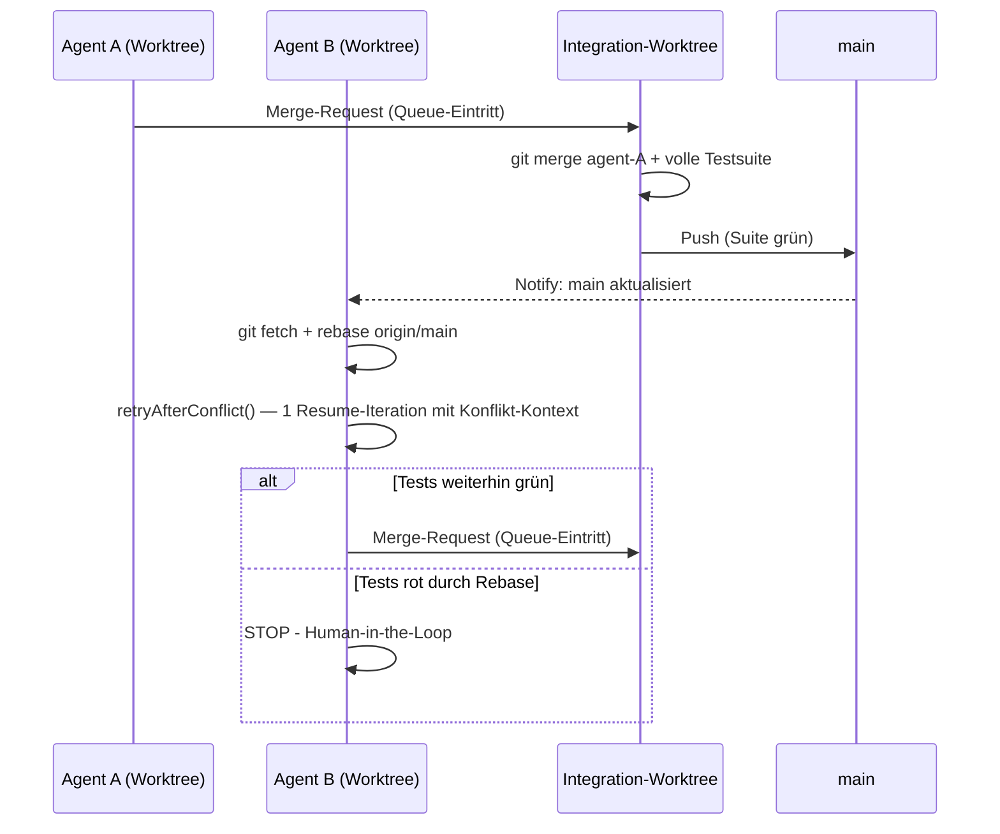

# Agentic Issue Pipeline: Von der Idee zum Merge
### Obsidian-first, mit Docker/Worktree-Hybrid, Claude Code + OpenRouter-Modellwahl, optionalem GitHub-Fallback und Herdr-Sichtbarkeit

---

## 0. Was neu ist gegenüber der Vorversion

Dieser Durchgang folgt bewusst drei Schritten: erst Widersprüche, dann ungenau Beschriebenes, dann allgemeine Verbesserungen. Alle drei sind in diesem Dokument bereits zusammengeführt; diese Liste zeigt, was in welchem Schritt passiert ist.

**Schritt 1 — Widersprüche behoben:**
- **Antigravity komplett entfernt.** Claude Code ist die einzige Agent-CLI. Der `antigravityProvider()`-Stub, `agentKind`, und die Herdr-Detection-Lücke dafür sind weg.
- **Neu dafür: Modellwahl über OpenRouter** (Abschnitt 8.1) — orthogonal zur CLI-Frage, über Claude Codes eigenen `ANTHROPIC_BASE_URL`-Mechanismus.
- **Herdr Muster-A/B-Verwirrung aufgelöst.** Da kein Custom-AgentProvider mehr nötig ist, gibt es nur noch ein Muster: Sandcastle führt aus, Herdr beobachtet (Abschnitt 15).
- **Herdr-Aufrufe sind jetzt defensiv** (`safeHerdr()`-Wrapper) — ein Herdr-Ausfall kann den Pipeline-Lauf nicht mehr blockieren, wie es die eigene Prämisse in Abschnitt 15 immer schon verlangte.
- **Ralph-Loop überschreibt `chooseMode()` nicht mehr blind.** Vorher erzwang `forceMode: "host"` Host-Modus auch für destruktive Migrations-Issues — jetzt respektiert der Ralph-Loop dieselben Sicherheits-Signale wie die Merge-Queue.
- **„Drei strikt getrennte Schichten" präzisiert** (Abschnitt 2): Sandcastles `agent`-Parameter berührt auch die Intelligenz-Schicht — das wird jetzt benannt statt verschwiegen.
- **Sandcastle-API-Namen korrigiert.** Die reale README zeigt `createWorktree()` + `wt.run()` + `wt.close()` (mit Dirty-Preserve-Semantik), nicht die vorher verwendeten fiktiven `wt.create()`/`wt.delete()`. Sandbox-Provider sind `docker()`/`noSandbox()` aus eigenen Subpath-Imports, nicht `dockerProvider()`.

**Schritt 2 — Ungenau Beschriebenes präzisiert:**
- **Merge-Queue steht jetzt auf echtem Fundament statt auf Prosa.** Sandcastle liefert die Templates `parallel-planner` und `parallel-planner-with-review` mit — genau unser Szenario. Abschnitt 13 beschreibt jetzt, wie unsere Obsidian-Issue-Store-Schicht darauf aufsetzt, statt eine FIFO-Queue neu zu erfinden.
- **Ralph-Loop-Fundament geklärt**: Sandcastles `simple-loop`-Template ("Picks issues one by one and closes them") ist exakt das — Abschnitt 12 baut darauf auf.
- **`model`-Property vollständig durchgezogen**: `IssueRecord`, beide Store-Implementierungen (Obsidian/GitHub) und `taskSpecFromIssue()` tragen das Feld jetzt konsistent, nicht nur `TaskSpec` wie vorher bei `agentKind`.
- **`DOCKER_PARALLEL_LIMIT` definiert** (Abschnitt 8), vorher nur in Prosa erwähnt.
- **Der Agent sieht jetzt tatsächlich den Issue-Inhalt.** Vorher war der Prompt ein nackter String (`"Fix issue X"`); jetzt nutzt Abschnitt 14 Sandcastles `promptFile` + dynamische `` !`command` ``-Expansion, um die Issue-Note tatsächlich einzuspeisen.
- **Neuer, präziser offener Punkt statt eines vagen**: Ob `noSandbox()` für `wt.run()` (AFK-Agenten) überhaupt zulässig ist, formuliert Sandcastles eigene README an zwei Stellen scheinbar widersprüchlich — in Runde 3 anhand der README geklärt, siehe unten.

**Schritt 3 — Allgemeine Verbesserungen:**
- `sandcastle init --issue-tracker custom` als konkreter Einstiegspfad für die Obsidian-Anbindung (Abschnitt 18).
- Session-Resume für Konflikt-Retries in der Merge-Queue statt blindem Neustart (Abschnitt 13) — Anschluss an echten Code in Runde 3 nachgezogen, siehe unten.
- Hinweis auf `permissionMode` für AFK-Sicherheit statt stillschweigendem `--dangerously-skip-permissions`-Default (Abschnitt 12).
- `crossPlatformRisk`-Heuristik korrigiert: „posix" als Trigger-Keyword war irreführend (POSIX-Konformität ist eher das *portablere* Verhalten) — ersetzt durch treffendere Begriffe.
- Priorität explizit als pro-Track-scoped dokumentiert (Ralph und Merge-Queue sortieren unabhängig voneinander) — in Runde 3 auch tatsächlich im Code beider Tracks durchgesetzt, siehe unten.

**Runde 3 — gegen echte Sandcastle-/Claude-Code-/Herdr-Quellen geprüft, plus zweite unabhängige Review:**
- **`noSandbox()` für `wt.run()` ist nicht zulässig — das war in Runde 2 noch als offene Frage markiert, ist jetzt anhand der Sandcastle-README geklärt** (Abschnitt 8/14/19): AFK-Agenten müssen gesandboxt sein. „Host" bedeutet jetzt ein minimales `docker()`-Image statt `noSandbox()`; betrifft Abschnitt 8, 14, Slice 1 (Abschnitt 18) und die Routing-Tabelle.
- **`Output.object()`-Behauptung aus Runde 2 zurückgenommen** — war im Changelog als Verbesserung gelistet, tauchte aber nirgends im tatsächlichen Code auf, und verlangt laut Sandcastle `maxIterations === 1`, was mit dem TDD-Loop-Limit von 5 kollidiert. Ehrlicher belassen als Freitext-Log statt eine nicht eingelöste Behauptung stehen zu lassen.
- **Merge-Queue-Dispatcher prüft jetzt tatsächlich Abhängigkeiten und Priorität** (Abschnitt 9/14) — `dependenciesSatisfied()`/`pickNextIssue()`/`routeExecution()` liefen vorher nur im Ralph-Pfad, obwohl Abschnitt 3.3 das als Regel für alle Issues formuliert. Zusätzlich: Re-Scan wartender vertikaler Issues bei jedem `merged`-Event, weil ein fremder Merge sonst niemanden erneut auslöst.
- **`dependsOn: []` im GitHub-Backend behoben** (Abschnitt 6) — Abhängigkeits-Gating funktionierte auf dem GitHub-Backend bisher gar nicht. Jetzt Parsing aus einem HTML-Kommentar im Issue-Body.
- **`parallelAgentCount` wird jetzt tatsächlich gesetzt** (Abschnitt 14, `activeRunCount`) statt eines Signals, das kein Aufrufer je befüllt hat.
- **`timeoutSeconds` gegen hängende/interaktive Läufe ergänzt** (Abschnitt 12/14/17) — `maxIterations` allein hilft nicht, wenn eine Iteration nie abschließt.
- **Modellwahl-Risiken in 8.1 präzisiert**: Protokoll-Übersetzung (Anthropic-Tool-Format ↔ OpenAI-Format) und Claude Codes eigene String-Matching-Capability-Erkennung sind zwei separate, konkretere Risiken als die vorherige pauschale „Tool-Calling"-Warnung.
- **`testing_local` aus dem Zustandsdiagramm entfernt** (Abschnitt 10) — der Zustand wurde von keinem Code je gesetzt, weil `wt.run()` intern iteriert (Blackbox).
- **Flowchart korrigiert** (Abschnitt 2) — horizontale Issues liefen im Diagramm über den Event-Trigger, tatsächlich pollt Ralph unabhängig.
- **`herdrReadRecent()` wieder verwendet** (Abschnitt 14) — vorher definiert, aber nirgends aufgerufen.
- **Startup-Reconciliation ergänzt** (Abschnitt 16) für Issues, die nach einem Orchestrator-Crash auf `running`/`provisioning` hängen geblieben sind.
- Kleinere Korrekturen: `pi`/`omp` in Herdrs CLI-Liste ergänzt (15.1), Frontmatter-Fallbacks im Obsidian-Store nachgezogen (5), „Antigravity-Name-frei"-Formulierungsrest in der Architektur-Tabelle entfernt (2), Modell im Herdr-Label sichtbar (14).

**Runde 4 — Abgrenzung zu „Oz für OSS" ergänzt (Abschnitt 6.1):** Der bisherige Ein-Satz-Verweis auf den „echten Oz-Orchestrator" (Abschnitt 2) wird ausgebaut zu einer vollständigen Erklärung, warum Warps `oz-for-oss`-Workflow-Paket (Webhook-Control-Plane, Vercel KV, `author_association`-basierte Trust-Einstufung) hier bewusst nicht zum Einsatz kommt: anderes Problem (fremde, nicht vertrauenswürdige Contributor) als das dieser Pipeline (Solo/Team-intern). Gegen die reale `oz-for-oss`-Doku geprüft. Mit Verweis darauf, dass das kein Sackgassen-Argument ist — bei echtem externem Contributor-Bedarf wäre Oz für OSS eine sinnvolle *zusätzliche* Vertrauens-Schicht oberhalb des bestehenden `GitHubIssueStore`, kein Ersatz für Sandcastle.

---

## 1. Zielsetzung

Eine durchgehende Kette von der ersten Idee bis zum gemergten Code, bei der jeder Schritt so minimal wie möglich implementiert ist:

1. Eine Idee wird über ein kurzes Alignment-Gespräch (grill-me) zu einer PRD-Note.
2. Die PRD-Note wird in einzelne Issue-Notes zerlegt (prd-to-issues), jede mit Priorität, Abhängigkeiten und einer Kennzeichnung horizontal/vertikal.
3. Eine Statusänderung im Frontmatter einer Issue-Note (lokal, kein Netzwerk) triggert einen Agenten.
4. Der Agent bekommt automatisch die passende Isolationsstufe (Host oder Docker), das passende Ausführungsmodell (sequenziell oder parallel) und optional ein anderes Modell als den Anthropic-Standard.
5. Integration läuft über einen neutralen Worktree, Merge nur nach vollem Testlauf, Eskalation an den Menschen bei echten Konflikten.

Solo-Betrieb ist der Normalfall; Team-Betrieb ist ein austauschbares Backend, kein Sonderfall, der die Architektur verbiegt.

---

## 2. Architekturprinzip

Drei Schichten — mit einer ehrlichen Einschränkung, die vorher unterschlagen wurde: Sandcastles `agent`-Parameter (Abschnitt 8.1) entscheidet auch *welches Modell* denkt, nicht nur *wo* ausgeführt wird. Das ist ein Stück Intelligenz-Schicht, das faktisch in der Sandcastle-Schicht mitläuft. Die Trennung bleibt trotzdem sinnvoll — nur eben nicht hermetisch:

| Schicht | Verantwortung | Komponente |
|---|---|---|
| **Zustand & Trigger** | Wo lebt der Status eines Issues, was löst eine Statusänderung aus | **IssueStore** (Obsidian-Default oder GitHub-Fallback) |
| **Verwaltung der physischen Umgebung (+ Modellwahl)** | Worktree anlegen/schließen, Sandbox wählen, Agent-Provider inkl. Modell konfigurieren | **[Sandcastle](https://github.com/mattpocock/sandcastle)** |
| **Intelligenz & Orchestrierung** | Welches Issue als Nächstes, Ralph-Loop, Merge-Queue-Dispatch | **Orchestrator (TS/Fastify)** |

Der Orchestrator ist ein **persistenter lokaler Prozess** — er braucht ohnehin Dateisystem- und Docker-Zugriff für Sandcastle. Das ist der Grund, warum hier kein Webhook-Server + externer State-Store nötig ist, wie ihn z. B. Warps „Oz für OSS" für offene Contributor-Szenarien braucht (Abschnitt 6.1).

### Gesamtüberblick



---

## 3. Vorstufe: Von der Idee zum Issue

### 3.1 `/grill-me`

Kein Artefakt-Zwang. Eine interaktive Ausrichtungs-Session zwischen dir und dem LLM zu einem Design-Konzept, bevor irgendetwas geschrieben wird. Ergebnis fließt als Chat-Kontext oder kurze Notiz in 3.2 ein.

### 3.2 `/write-a-prd`

Erzeugt aus der grill-me-Session eine einzelne Obsidian-Note mit `type: prd` im Frontmatter. Die PRD muss immer aktuell sein: bei einer grundlegenden Planänderung wird die Note **neu geschrieben**, nicht inkrementell gepatcht.

```yaml
---
type: prd
id: prd-2026-001
title: "Geistige Klang-Räume: Gesten-Interaktion Phase 2"
status: approved
created: 2026-07-08
---
```

### 3.3 `/prd-to-issues`

Zerlegt die PRD-Note in mehrere Issue-Notes. Kein echtes Kanban-Board-Widget nötig — eine flache Menge von Notes mit Frontmatter-Properties reicht, sichtbar per Dataview-Query. Für jedes Issue wird gesetzt:

| Property | Werte | Bedeutung |
|---|---|---|
| `priority` | `bugfix` \| `infra` \| `tracer-bullet` \| `polish` \| `refactor` | Reihenfolge der Bearbeitung, absteigend in dieser Liste — gilt separat pro Track (Ralph vs. Merge-Queue), nicht global über beide hinweg |
| `slice` | `horizontal` \| `vertical` | Routing-Entscheidung, siehe Abschnitt 9 |
| `model` | optional, z. B. `openai/gpt-5.2` | Siehe Abschnitt 8.1. Unset = direkter Anthropic-Standardpfad, kein Gateway involviert |
| `depends_on` | Liste von Issue-IDs | Ein Issue wird erst kandidiert, wenn alle Abhängigkeiten `merged` sind |
| `status` | siehe Abschnitt 10 | Der eigentliche State-Machine-Wert |

**Horizontal** heißt: Schicht für Schicht (erst DB, dann API, dann Frontend) — inhärent sequenziell, gehört in den Ralph-Loop. **Vertikal** heißt: eine Tracer-Bullet-Slice quer durch alle Schichten für ein Feature — lose genug gekoppelt für parallele Worktrees.

Neu entstandene Issues starten mit `status: draft` — ein bewusster manueller Gate-Schritt, bevor du sie auf `ready-to-implement` setzt.

**Sichtbarkeit als virtuelles Kanban-Board** (Dataview):

```
TABLE priority, slice, model, status, depends_on
FROM "vault/issues"
WHERE type = "issue"
SORT priority ASC
```

---

## 4. Der Issue-Store: gemeinsame Abstraktion

Eine separate Registry ist bei der Obsidian-Variante nicht nötig, weil die Note selbst der Datensatz ist.

```typescript
// issue-store.ts
export type IssueStatus =
  | "draft"
  | "ready-to-implement"
  | "provisioning"
  | "running"
  | "testing_local"
  | "awaiting_integration"
  | "integration_testing"
  | "conflict"
  | "merged"
  | "failed";

export type Priority = "bugfix" | "infra" | "tracer-bullet" | "polish" | "refactor";
export type Slice = "horizontal" | "vertical";

export interface IssueRecord {
  id: string;
  title: string;
  status: IssueStatus;
  priority: Priority;
  slice: Slice;
  model?: string; // OpenRouter-Slug, z.B. "openai/gpt-5.2" — unset = Anthropic-Standard, siehe 8.1
  mode?: "host" | "container";
  branch?: string;
  worktreePath?: string;
  sessionFilePath?: string; // Für Konflikt-Resume (Abschnitt 13), aus result.sessionFilePath
  dependsOn: string[];
  createdAt: string;
  updatedAt: string;
  body: string;
}

export interface IssueStore {
  list(filter?: Partial<Pick<IssueRecord, "status" | "priority" | "slice">>): Promise<IssueRecord[]>;
  get(id: string): Promise<IssueRecord | null>;
  updateStatus(id: string, status: IssueStatus, patch?: Partial<IssueRecord>): Promise<void>;
  appendLog(id: string, heading: string, content: string): Promise<void>;
  onChange(cb: (id: string, prev: IssueRecord | null, next: IssueRecord) => void): void;
}
```

---

## 5. Default-Backend: Obsidian Frontmatter + Chokidar

Kein Webhook, kein API-Client, kein Auth-Token, kein Rate-Limit — reines lokales File-I/O.

```typescript
// obsidian-issue-store.ts
import chokidar from "chokidar";
import matter from "gray-matter";
import { readFile, writeFile, rename } from "fs/promises";
import { glob } from "glob";
import path from "path";

const VAULT_ISSUES_DIR = "./vault/issues";

export class ObsidianIssueStore implements IssueStore {
  private cache = new Map<string, IssueRecord>();
  private listeners: Array<(id: string, prev: IssueRecord | null, next: IssueRecord) => void> = [];

  constructor() {
    this.rescan();
    chokidar.watch(`${VAULT_ISSUES_DIR}/*.md`).on("change", (fp) => this.handleChange(fp));
  }

  private async rescan() {
    for (const f of await glob(`${VAULT_ISSUES_DIR}/*.md`)) await this.loadFile(f);
  }

  private async loadFile(filePath: string): Promise<IssueRecord> {
    const { data, content } = matter(await readFile(filePath, "utf-8"));
    // Fallbacks analog zum GitHub-Store (Abschnitt 6) — vorher fehlten diese hier, obwohl
    // beide Backends laut Abschnitt 7 austauschbar sein sollen. Ohne Fallback würde ein
    // fehlendes priority-Feld zu PRIORITY_ORDER.indexOf(undefined) === -1 führen und
    // fälschlich vor "bugfix" einsortiert werden (Abschnitt 9).
    const record: IssueRecord = {
      id: data.id ?? path.basename(filePath, ".md"),
      title: data.title ?? "",
      status: data.status ?? "draft",
      priority: data.priority ?? "polish",
      slice: data.slice ?? "vertical",
      model: data.model,
      mode: data.mode,
      branch: data.branch,
      worktreePath: data.worktree,
      sessionFilePath: data.session_file,
      dependsOn: data.depends_on ?? [],
      createdAt: data.created ?? new Date().toISOString(),
      updatedAt: data.updated ?? new Date().toISOString(),
      body: content,
    };
    this.cache.set(record.id, record);
    return record;
  }

  private async handleChange(filePath: string) {
    const id = path.basename(filePath, ".md");
    const prev = this.cache.get(id) ?? null;
    const next = await this.loadFile(filePath);
    if (!prev || prev.status !== next.status) {
      this.listeners.forEach((cb) => cb(id, prev, next));
    }
  }

  async list(filter: Partial<Pick<IssueRecord, "status" | "priority" | "slice">> = {}) {
    return [...this.cache.values()].filter((r) =>
      Object.entries(filter).every(([k, v]) => (r as any)[k] === v)
    );
  }

  async get(id: string) {
    return this.cache.get(id) ?? null;
  }

  async updateStatus(id: string, status: IssueStatus, patch: Partial<IssueRecord> = {}) {
    const record = this.cache.get(id);
    if (!record) throw new Error(`Issue ${id} nicht gefunden`);
    const merged = { ...record, ...patch, status, updatedAt: new Date().toISOString() };
    const frontmatter = {
      id: merged.id, title: merged.title, status: merged.status, priority: merged.priority,
      slice: merged.slice, model: merged.model, mode: merged.mode, branch: merged.branch,
      worktree: merged.worktreePath, session_file: merged.sessionFilePath, depends_on: merged.dependsOn,
      created: merged.createdAt, updated: merged.updatedAt,
    };
    const filePath = path.join(VAULT_ISSUES_DIR, `${id}.md`);
    const tmp = `${filePath}.tmp`;
    await writeFile(tmp, matter.stringify(merged.body, frontmatter), "utf-8");
    await rename(tmp, filePath);
    this.cache.set(id, merged);
  }

  async appendLog(id: string, heading: string, content: string) {
    const record = this.cache.get(id);
    if (!record) throw new Error(`Issue ${id} nicht gefunden`);
    const entry = `\n\n### [${new Date().toISOString()}] ${heading}\n${content}\n`;
    await this.updateStatus(id, record.status, { body: record.body + entry });
  }

  onChange(cb: (id: string, prev: IssueRecord | null, next: IssueRecord) => void) {
    this.listeners.push(cb);
  }
}
```

**Wichtige Praxis-Regeln:**

- Rohes `stdout`/`stderr` gehört nicht in die Note (Vault-Bloat). Logs landen in `./logs/<issueId>/<timestamp>.log`; `appendLog` schreibt nur eine Zusammenfassung plus Pfad-Referenz.
- Agenten schreiben append-only an den Body — minimiert Kollisionsfläche mit manuellen Edits.
- Bei geräteübergreifendem Sync (Obsidian Sync/Dropbox/iCloud): Orchestrator nur gegen die lokale, primäre Kopie laufen lassen.
- Der `cache` ist reine Performance-Optimierung, kein zweiter Wahrheitsträger — er darf aus der Sync geraten, weil `rescan()` ihn repariert.

---

## 6. Fallback-Backend: GitHub Issues + Labels (Team-Fall)

Nur relevant, sobald ein zweiter Mensch mitarbeitet, externe Sichtbarkeit ohne Vault-Zugriff gewünscht ist, oder GitHub Actions als CI-Gate eingebunden werden soll. Kein Webhook-Server nötig — ein Poll-Loop im selben persistenten Orchestrator-Prozess reicht.

**Korrektur gegenüber der Vorversion:** `dependsOn` war hier fest auf `[]` verdrahtet — Abhängigkeits-Gating (Abschnitt 3.3/9) funktionierte auf dem GitHub-Backend dadurch überhaupt nicht, obwohl Abschnitt 7 den Wechsel als „rein additiv" bewirbt. Fix: `depends_on` wird aus einem HTML-Kommentar im Issue-Body geparst (unsichtbar im gerenderten Issue, von `prd-to-issues` beim Anlegen mitgeschrieben) statt über ein Label — Labels sind für eine variable Liste von IDs unhandlich, ein HTML-Kommentar mit fester Struktur ist robuster:

```typescript
// Erwartetes Format im Issue-Body, von prd-to-issues generiert:
// <!-- depends_on: 12, 14 -->
function parseDependsOn(body: string): string[] {
  const match = body.match(/<!--\s*depends_on:\s*([\d,\s]+)-->/);
  if (!match) return [];
  return match[1].split(",").map((s) => s.trim()).filter(Boolean);
}
```

```typescript
// github-issue-store.ts
import { execSync } from "child_process";

const POLL_INTERVAL_MS = 30_000;

export class GitHubIssueStore implements IssueStore {
  private cache = new Map<string, IssueRecord>();
  private listeners: Array<(id: string, prev: IssueRecord | null, next: IssueRecord) => void> = [];

  constructor(private repo: string) {
    this.poll();
    setInterval(() => this.poll(), POLL_INTERVAL_MS);
  }

  private async poll() {
    const raw = execSync(
      `gh issue list --repo ${this.repo} --state open --json number,title,labels,body,updatedAt`
    ).toString();
    for (const issue of JSON.parse(raw)) {
      const id = String(issue.number);
      const labels: string[] = issue.labels.map((l: any) => l.name);
      const byPrefix = (prefix: string, fallback?: string) =>
        labels.find((l) => l.startsWith(`${prefix}:`))?.split(":").slice(1).join(":") ?? fallback;
      const next: IssueRecord = {
        id,
        title: issue.title,
        status: byPrefix("status", "draft") as IssueStatus,
        priority: byPrefix("priority", "polish") as Priority,
        slice: byPrefix("slice", "vertical") as Slice,
        // model-Slugs enthalten "/" (z.B. "openai/gpt-5.2") — das Label-Präfix-Schema
        // splittet nur am ERSTEN ":", der Rest bleibt intakt. Trotzdem: GitHub-Labels
        // sind für Freitext-Slugs unbequemer als Obsidian-Frontmatter — im Team-Fall ggf.
        // model bewusst nur über Obsidian-Notes setzen, auch wenn Status via GitHub läuft.
        model: byPrefix("model"),
        dependsOn: parseDependsOn(issue.body),
        createdAt: issue.updatedAt,
        updatedAt: issue.updatedAt,
        body: issue.body,
      };
      const prev = this.cache.get(id) ?? null;
      this.cache.set(id, next);
      if (!prev || prev.status !== next.status) this.listeners.forEach((cb) => cb(id, prev, next));
    }
  }

  async list(filter: Partial<Pick<IssueRecord, "status" | "priority" | "slice">> = {}) {
    return [...this.cache.values()].filter((r) =>
      Object.entries(filter).every(([k, v]) => (r as any)[k] === v)
    );
  }

  async get(id: string) {
    return this.cache.get(id) ?? null;
  }

  async updateStatus(id: string, status: IssueStatus, patch: Partial<IssueRecord> = {}) {
    const record = this.cache.get(id);
    const removeFlag = record ? `--remove-label "status:${record.status}"` : "";
    execSync(`gh issue edit ${id} --repo ${this.repo} ${removeFlag} --add-label "status:${status}"`);
    if (record) this.cache.set(id, { ...record, ...patch, status, updatedAt: new Date().toISOString() });
  }

  async appendLog(id: string, heading: string, content: string) {
    const body = `### [${new Date().toISOString()}] ${heading}\n${content}`;
    execSync(`gh issue comment ${id} --repo ${this.repo} --body ${JSON.stringify(body)}`);
  }

  onChange(cb: (id: string, prev: IssueRecord | null, next: IssueRecord) => void) {
    this.listeners.push(cb);
  }
}
```

### 6.1 Abgrenzung zu „Oz für OSS"

Der kurze Verweis oben verdient mehr Raum, weil er eine naheliegende Frage aufwirft: Warp betreibt mit **Oz** eine reale Cloud-Agent-Orchestrierungsplattform, und **Oz für OSS** (`warpdotdev/oz-for-oss`) ist ein darauf aufbauendes, öffentlich verfügbares Workflow-Paket genau für Open-Source-Zusammenarbeit. Warum nicht einfach das nehmen, statt einen eigenen `GitHubIssueStore` zu bauen?

**Weil beide ein anderes Problem lösen, kein Ersatz füreinander sind:**

- **Oz für OSS löst Vertrauen bei fremden Contributoren.** Issue-Bodies, Kommentare und PR-Inhalte können von jedem editiert werden, der zum Repo beitragen darf — das Workflow-Paket liest diese Inhalte deshalb nie direkt, sondern ausschließlich über ein Skript, das jeden Abschnitt mit Herkunfts-Metadaten versieht (Autor, `author_association`). Nur Abschnitte von `OWNER`, `MEMBER` oder `COLLABORATOR` werden explizit als `trust=TRUSTED` markiert; alles andere bleibt unklassifiziert, nicht automatisch „untrusted" — aber eben auch nicht blind vertraut. Dafür braucht es die schwere Infrastruktur: Vercel-gehosteter Webhook-Control-Plane, `RunState` in Vercel KV, GitHub-App-Installation.
- **Diese Pipeline löst das nicht, weil das Problem hier nicht existiert.** Solo-Betrieb ist der Normalfall (Abschnitt 1), das GitHub-Backend in diesem Abschnitt ist ein optionaler Fallback für „ein zweiter Mensch aus dem eigenen Team schreibt mit" — nicht für offene, fremde Contributor. Jede Zeile Trust-Infrastruktur, die Oz für OSS mitbringt, wäre hier ungenutzter Overhead.
- **Sandcastle und Oz für OSS sind ohnehin unterschiedliche Schichten**, kein Duplikat: Sandcastle verwaltet die physische Ausführungsumgebung (Worktree, Sandbox, Agent-Provider), Oz für OSS entscheidet, *ob und wessen* Input überhaupt vertrauenswürdig genug ist, um automatisiert verarbeitet zu werden. Diese Pipeline braucht nur die erste Schicht.

**Kein Sackgassen-Argument, sondern eine Grenze, die verschiebbar ist:** Bekommt dieses Projekt später echte externe Beiträge von Unbekannten, wäre Oz für OSS (oder ein selbstgebautes Äquivalent der `author_association`-Prüfung) der naheliegende *zusätzliche* Baustein davor — nicht ein Ersatz für Sandcastle, sondern eine Vertrauens-Schicht oberhalb des in Abschnitt 6 beschriebenen `GitHubIssueStore`, die entscheidet, welche Issues/PRs überhaupt automatisiert angefasst werden dürfen, bevor der Rest der hier beschriebenen Pipeline greift. Siehe auch Abschnitt 7 und den offenen Punkt in Abschnitt 19 („GitHub-Anbindung bleibt Fallback, kein Ziel").

---

## 7. Wann wechseln?

| Kriterium | Obsidian (Default) | GitHub (Fallback) |
|---|---|---|
| Nur du arbeitest am Projekt | ✅ | – |
| Zweiter Mensch braucht Sichtbarkeit ohne Vault-Zugriff | – | ✅ |
| GitHub Actions als CI-Gate vor Merge gewünscht | – | ✅ |
| Kein Netzwerk/API-Abhängigkeit gewünscht | ✅ | – |
| Issue-Note soll gleichzeitig Wissensgraph-Knoten sein | ✅ | – |

Der Wechsel ist rein additiv: `new GitHubIssueStore(repo)` statt `new ObsidianIssueStore()` an der einzigen Stelle, an der der Store instanziiert wird.

---

## 8. Routing A: Host vs. Docker (`chooseMode`)

Worktree-Erstellung ist immer Pflicht, Docker wird nur bei konkretem Grund zugeschaltet.

**Wichtige Korrektur gegenüber der Vorversion:** „Host" bedeutet hier *nicht* `noSandbox()`. Sandcastles reale API verlangt für `wt.run()` zwingend einen echten Sandbox-Provider — No-Sandbox ist laut Sandcastle-README ausdrücklich nur für `interactive()`/`wt.interactive()` zugelassen, nicht für unbeaufsichtigte Läufe („AFK agents must be sandboxed"). „Host" heißt daher: `docker()` mit einem minimalen, praktisch transparenten Bind-Mount-Image (kaum Overhead ggü. echtem Host, aber technisch weiterhin gesandboxt) — „Docker" mit isolationsbedürftigem Image bleibt die zweite Ausprägung derselben Sandbox-Art. Details in Abschnitt 14 (`getSandbox()`) und Abschnitt 19.

| Kriterium | Host | Docker |
|---|---|---|
| Reines Sprach-Tooling bereits auf Host vorhanden | ✅ | – |
| Zusätzlicher Service nötig (DB, Redis, …) | – | ✅ |
| Anderes OS / plattformspezifische Bibliotheken | – | ✅ |
| Übergeordnete Ordner sollen unsichtbar bleiben | – | ✅ |
| CI-Parität gewünscht | – | ✅ |
| Task als destruktiv markiert | – | ✅ |
| Schnelligkeit hat Priorität | ✅ | – |

```typescript
// mode-decision.ts
export type AgentMode = "host" | "container";

export interface TaskSpec {
  issueId: string;
  branchName: string;
  model?: string; // siehe 8.1 — unabhängig von AgentMode
  forceMode?: AgentMode;
  timeoutSeconds?: number; // Hard-Timeout gegen hängende/interaktive Prompts, siehe 17
  signals?: {
    needsService?: boolean;
    crossPlatformRisk?: boolean;
    destructive?: boolean;
    parallelAgentCount?: number;
  };
  dockerImage?: string;
}

const HOST_PARALLEL_LIMIT = 4;
// Container brauchen mehr RAM/CPU pro Instanz als Host-Prozesse — Limit bewusst niedriger.
const DOCKER_PARALLEL_LIMIT = 2;

export function chooseMode(spec: TaskSpec): AgentMode {
  if (spec.forceMode) return spec.forceMode;
  const s = spec.signals ?? {};
  if (s.needsService || s.crossPlatformRisk || s.destructive) return "container";
  if ((s.parallelAgentCount ?? 0) >= HOST_PARALLEL_LIMIT) return "container";
  return "host";
}

export function taskSpecFromIssue(issue: IssueRecord, overrides: Partial<TaskSpec> = {}): TaskSpec {
  return {
    issueId: issue.id,
    branchName: issue.branch ?? `agent/${issue.id}`,
    model: issue.model,
    signals: {
      needsService: /docker-compose/.test(issue.body),
      crossPlatformRisk: /native binding|windows-only|platform-specific/i.test(issue.body),
      destructive: /migration|drop table|rm -rf/i.test(issue.body),
    },
    ...overrides,
  };
}
```

`DOCKER_PARALLEL_LIMIT` und `parallelAgentCount` waren in der Vorversion nur als Signale definiert, aber von keinem Aufrufer tatsächlich gesetzt — der Zweig in `chooseMode()` konnte nie greifen. Fix: ein einfacher In-Memory-Zähler im Orchestrator-Prozess (`activeRunCount` in `run-agent.ts`, Abschnitt 14), inkrementiert vor und dekrementiert nach jedem `wt.run()`-Aufruf, unabhängig vom Track. Dispatcher und Ralph-Loop reichen den aktuellen Wert beim Aufruf von `taskSpecFromIssue()` als Override durch (`{ signals: { parallelAgentCount: activeRunCount } }`), bevor `chooseMode()` läuft. Das reicht für eine Single-Process-Instanz; bei mehreren Orchestrator-Prozessen (nicht Teil dieser Spec) müsste der Zähler extern geteilt werden.

### 8.1 Modellwahl: Claude Code bleibt die einzige CLI, das Modell dahinter ist trotzdem austauschbar

Claude Code ist jetzt der alleinige Agent — kein `agentKind` mehr, kein Custom-`AgentProvider`. Trotzdem lässt sich *welches Modell* antwortet unabhängig davon konfigurieren, weil Claude Code selbst genau dafür einen Mechanismus mitbringt: `ANTHROPIC_BASE_URL` (wohin Anfragen gehen) plus `ANTHROPIC_MODEL`/Modell-Alias-Variablen (welches Modell dort angefragt wird). Sandcastles `claudeCode()`-Provider reicht das direkt durch — der zweite Options-Parameter akzeptiert `env: Record<string, string>`, das pro Lauf gemerged wird (überschreibt `.sandcastle/.env` für überlappende Keys, muss sich nicht mit dem Sandbox-Env überschneiden, sonst wirft `run()`).

**Die Einschränkung, die das für OpenRouter bedeutet:** Claude Code spricht das Anthropic-Messages-API-Format. OpenRouters natives API ist OpenAI-chat-completions-förmig — die beiden passen nicht direkt zusammen. Es braucht einen kleinen Übersetzer dazwischen. Zwei verifiziert funktionierende Optionen: **LiteLLM Gateway** (von Anthropics eigener Doku als Standardweg für „LLM gateways" referenziert) oder **agentgateway**, das explizit eine Claude-Code-Integration für beliebige OpenAI-kompatible Provider dokumentiert. Beide laufen **einmalig lokal**, kein Pro-Task-Lifecycle nötig:

```yaml
# gateway-config.yaml (agentgateway, einmalig lokal gestartet, z.B. via `agentgateway -f gateway-config.yaml`)
llm:
  models:
    - name: "*"
      provider: openAI
      params:
        baseURL: "https://openrouter.ai/api/v1"
        apiKey: "$OPENROUTER_API_KEY"
```

```typescript
// model-provider.ts
import { claudeCode } from "@ai-hero/sandcastle";

// Adresse des lokalen Gateway-Prozesses — Port prüfen, sobald der Gateway läuft.
const GATEWAY_URL = process.env.CLAUDE_MODEL_GATEWAY_URL ?? "http://localhost:4141";

export function getAgent(modelSlug?: string) {
  if (!modelSlug) {
    // Kein Override: direkter Anthropic-Standardpfad, kein Gateway involviert.
    return claudeCode("claude-opus-4-8");
  }
  // modelSlug in OpenRouter-Notation, z.B. "openai/gpt-5.2" oder "google/gemini-3-pro".
  return claudeCode(modelSlug, {
    env: {
      ANTHROPIC_BASE_URL: GATEWAY_URL,
      ANTHROPIC_AUTH_TOKEN: process.env.OPENROUTER_GATEWAY_TOKEN ?? "",
    },
  });
}
```

Da jeder `runAgent()`-Aufruf (Abschnitt 14) einen eigenen `claudeCode(...)`-Aufruf mit eigenem `env`-Objekt macht, gibt es kein globales `process.env`-Mutieren — jeder parallele Agent (Merge-Queue, Abschnitt 13) bekommt sein eigenes Modell, ohne dass sich Läufe gegenseitig stören können.

**Zwei Caveats, beide konkreter als „manche Modelle können schlecht Tools aufrufen":**

1. **Protokoll-Übersetzung ist der eigentliche Bruchpunkt, nicht nur Modellqualität.** Claude Code feuert Tool-Aufrufe (File-Edits, Terminal-Befehle) im Anthropic-Content-Block-Format ab. Das gezeigte Gateway-Setup mappt auf einen `openAI`-Provider (OpenRouters natives Format ist OpenAI-chat-completions-förmig) — der Gateway muss also bei *jedem* Tool-Call verlustfrei zwischen beiden Formaten übersetzen. Bricht das, scheitert der Lauf nicht mit einer sauberen Fehlermeldung, sondern mit kaputten/ignorierten Tool-Aufrufen mitten im TDD-Loop. Vor produktivem Einsatz eines Modells den echten `skills/tdd-loop.md`-Workflow smoke-testen, nicht nur einen Chat-Prompt.
2. **Claude Code selbst erkennt Fähigkeiten über String-Matching auf den Modellnamen, nicht über eine echte Capability-Abfrage.** Die CLI prüft intern, ob im aufgelösten Modellstring bekannte Claude-Muster vorkommen (z. B. „opus-4" o. Ä.), und leitet daraus Kontextfenstergröße, Extended-Thinking-Verfügbarkeit etc. ab. `modelSlug` wie `"openai/gpt-5.2"` als Modellname enthält keines dieser Muster — das Ergebnis sind still angewandte Fallback-Werte (kleineres Kontextfenster, kein erkanntes Cutoff-Datum), nicht ein Fehler. Das ist unabhängig davon, wie gut das Modell selbst ist.

**Unklar und vor Produktivbetrieb zu verifizieren:** Ob `claudeCode(modelSlug, {...})`s erstes Argument beim tatsächlichen CLI-Aufruf als `--model`-Flag oder als `ANTHROPIC_MODEL`-Env-Var landet, ist aus der Sandcastle-Doku nicht eindeutig ablesbar. Das ist keine Nebensächlichkeit: Laut Claude Codes eigener Auflösungsreihenfolge schlägt ein `--model`-Flag eine `ANTHROPIC_MODEL`-Env-Var. Falls Sandcastle den Modellnamen als `--model` durchreicht, würde ein zusätzliches `ANTHROPIC_MODEL` im `env`-Objekt (Alternative unten) wirkungslos overridet. Beide Varianten vor Produktivbetrieb gegen einen echten Lauf verifizieren:

```typescript
// Variante A (oben, wie bisher): modelSlug als Sandcastle-Modellname direkt.
// Funktioniert sicher fürs Routing, riskiert aber die Capability-Fallbacks aus Caveat 2.

// Variante B (Alternative, noch nicht gegen Sandcastles Interna verifiziert):
// Claude Codes eigenen Modellnamen auf einem echten Claude-Alias belassen (für die
// Capability-Erkennung) und das eigentliche Ziel-Modell separat per ANTHROPIC_MODEL/
// ANTHROPIC_SMALL_FAST_MODEL an den Gateway durchreichen — das ist der von mehreren
// Gateway-Anbietern dokumentierte Standardweg für Nicht-Claude-Modelle.
export function getAgentVariantB(modelSlug?: string) {
  if (!modelSlug) return claudeCode("claude-opus-4-8");
  return claudeCode("claude-opus-4-8", {
    env: {
      ANTHROPIC_BASE_URL: GATEWAY_URL,
      ANTHROPIC_AUTH_TOKEN: process.env.OPENROUTER_GATEWAY_TOKEN ?? "",
      ANTHROPIC_MODEL: modelSlug,
      ANTHROPIC_SMALL_FAST_MODEL: modelSlug,
    },
  });
}
```

---

## 9. Routing B: Sequenziell (Ralph-Loop) vs. Parallel (Merge-Queue)

```typescript
// mode-decision.ts (Fortsetzung von Abschnitt 8 — chooseMode/taskSpecFromIssue liegen in derselben Datei)
export function routeExecution(issue: IssueRecord): "ralph" | "merge-queue" {
  return issue.slice === "horizontal" ? "ralph" : "merge-queue";
}

export function dependenciesSatisfied(issue: IssueRecord, all: IssueRecord[]): boolean {
  return issue.dependsOn.every((depId) => all.find((i) => i.id === depId)?.status === "merged");
}

const PRIORITY_ORDER: Priority[] = ["bugfix", "infra", "tracer-bullet", "polish", "refactor"];

// Läuft getrennt pro Track — Ralph und Merge-Queue sortieren unabhängig,
// nie gemeinsam über eine globale Prioritätsliste.
export function pickNextIssue(candidates: IssueRecord[], all: IssueRecord[]): IssueRecord | null {
  const ready = candidates
    .filter((i) => i.status === "ready-to-implement" && dependenciesSatisfied(i, all))
    .sort((a, b) => PRIORITY_ORDER.indexOf(a.priority) - PRIORITY_ORDER.indexOf(b.priority));
  return ready[0] ?? null;
}
```

Beide Pfade laufen am Ende durch denselben Integrations-Worktree-Test (Abschnitt 13) — im Ralph-Modus entfällt nur das Warten auf einen Queue-Slot, weil es keine Konkurrenz gibt.

**Korrektur gegenüber der Vorversion:** `routeExecution()`, `dependenciesSatisfied()` und `pickNextIssue()` wurden bisher nur von `ralphLoop()` aufgerufen — der event-getriebene Merge-Queue-Dispatcher (Abschnitt 14) prüfte weder Abhängigkeiten noch Priorität und widersprach damit der eigenen Regel aus Abschnitt 3.3 („Ein Issue wird erst kandidiert, wenn alle Abhängigkeiten `merged` sind"). Beide Pfade rufen diese Funktionen jetzt auf; Details in Abschnitt 14.

---

## 10. Zustandsmodell



**Korrektur gegenüber der Vorversion:** Der vorherige Zwischenzustand `testing_local` (mit Hin und Her zu `running`) suggerierte, der Orchestrator könne einzelne TDD-Iterationen beobachten. Tatsächlich iteriert `wt.run()` (Abschnitt 11) intern selbst bis `completionSignal`/`maxIterations` — eine Blackbox aus Orchestrator-Sicht, ohne Zwischen-Callbacks pro Iteration. `running` ist daher der einzige Zustand während des gesamten `wt.run()`-Aufrufs; kein Code setzt je einen Zwischenstatus.

---

## 11. Ablaufplan – Single Agent

1. Trigger: `status` einer Issue-Note wechselt auf `ready-to-implement` (Obsidian) bzw. Label `status:ready-to-implement` wird gesetzt (GitHub).
2. `routeExecution(issue)` → Ralph oder Merge-Queue (Abschnitt 9).
3. `chooseMode(taskSpecFromIssue(issue))` → Host oder Docker (Abschnitt 8); `getAgent(issue.model)` → Claude Code, ggf. via OpenRouter-Gateway (Abschnitt 8.1).
4. Provisioning: `createWorktree({ branchStrategy: { type: "branch", branch } })`.
5. TDD-Loop über `wt.run({ agent, sandbox, promptFile, maxIterations })` — Sandcastle iteriert selbst bis `completionSignal` (Default `<promise>COMPLETE</promise>`) oder `maxIterations` erreicht ist.
6. Lokaler Abschluss: Commits liegen laut `result.commits` vor, Status → `awaiting_integration`.
7. Integrations-Test (Abschnitt 13), dann Merge oder Konflikt-Eskalation.
8. Cleanup: `wt.close()` — bei sauberem Zustand entfernt, bei unfertigem/dirty Zustand automatisch auf der Platte erhalten (kein Datenverlust bei überraschendem Abbruch).

---

## 12. Ablaufplan – Ralph-Loop (horizontal, AFK, sequenziell)

Fundament ist Sandcastles eigenes `simple-loop`-Template ("Picks issues one by one and closes them") — unser Beitrag ist die Obsidian-Anbindung und die Prioritäts-/Abhängigkeits-Auswahl davor:

```typescript
// ralph-loop.ts
import { runAgent, getActiveRunCount } from "./run-agent";
import { routeExecution, pickNextIssue, taskSpecFromIssue } from "./mode-decision";
import { IssueStore } from "./issue-store";

export async function ralphLoop(store: IssueStore) {
  while (true) {
    const all = await store.list();
    const candidates = all.filter((i) => routeExecution(i) === "ralph");
    const next = pickNextIssue(candidates, all);
    if (!next) {
      console.log("Ralph: keine offenen horizontalen Issues mehr, Loop beendet.");
      return;
    }
    // KEIN forceMode mehr — chooseMode() respektiert weiterhin destructive/needsService-
    // Signale. parallelAgentCount zählt global über beide Tracks (Abschnitt 14) — auch
    // während Ralph sequenziell läuft, können parallel Merge-Queue-Agenten aktiv sein.
    await runAgent(store, taskSpecFromIssue(next, { signals: { parallelAgentCount: getActiveRunCount() } }));
  }
}
```

Kein Sentinel-Text-Parsing auf Orchestrator-Ebene nötig — Sandcastles eingebauter `completionSignal`-Mechanismus übernimmt das; unsere Abbruchbedingung für den Loop selbst ist strukturierter Zustand (leere Kandidatenliste).

**Sicherheitshinweis für AFK-Läufe:** Sandcastle nutzt für unbeaufsichtigte Läufe standardmäßig `--dangerously-skip-permissions`, sofern `permissionMode` nicht gesetzt ist. Für einen nächtlichen Ralph-Loop bewusst entscheiden, ob das gewollt ist, oder `claudeCode(model, { permissionMode: "acceptEdits" })` setzen.

**Offene Frage aus der Review geklärt — Entscheidung:** Auch mit `acceptEdits` kann Claude Code theoretisch auf einen Zustand laufen, der eine Eingabe erwartet (externe Prompts, Netzwerk-Hänger, o. Ä.), und damit den gesamten nächtlichen Loop blockieren. Entscheidung für diese Spec: **hartes Timeout statt Warten auf einen Menschen** — `wt.run({ ..., timeoutSeconds: 900 })` (Abschnitt 14) killt einen hängenden Lauf nach 15 Minuten und markiert das Issue als `failed` statt die Pipeline stillstehen zu lassen. Das passt zum AFK-Charakter dieses Pfads: ein Mensch schaut ohnehin erst am nächsten Morgen wieder rein, ein wartender Prozess bringt in der Zwischenzeit nichts. Wer stattdessen einen echten Haltepunkt will, an dem der Prozess auf lokale Eingabe wartet, müsste `permissionMode` interaktiver setzen und auf das Timeout verzichten — das widerspricht dann aber dem AFK-Anspruch dieses Loops und ist hier bewusst nicht der Default. Diese Entscheidung lässt sich jederzeit über den `timeoutSeconds`-Wert bzw. `permissionMode` revidieren.

Auslösung des Loops selbst (Cron, `launchd`, oder manueller Aufruf vor Feierabend) ist Sache der Umgebung, nicht Teil dieser Spec — `ralphLoop()` ist eine Funktion, kein Daemon.

---

## 13. Ablaufplan – Merge-Queue (vertikal, parallel)

Fundament ist Sandcastles `parallel-planner`- bzw. `parallel-planner-with-review`-Template ("Plans parallelizable issues, executes on separate branches, then merges") — das deckt exakt das Szenario ab, das hier vorher als Prosa ohne Code stand. Unser Beitrag: der Planner liest Kandidaten aus dem `IssueStore` (Obsidian oder GitHub) statt aus nativen GitHub Issues — dafür scaffoldet `sandcastle init` mit `--issue-tracker custom` einen bewusst unvollständigen Zustand plus eine `SETUP_ISSUE_TRACKER.md`-Anleitung, die genau diese Anbindung führt.

Der Ablauf, unverändert im Prinzip:

1. Jeder Agent committet ausschließlich auf seinem eigenen Branch (`branchStrategy: { type: "branch", branch: "agent/<issueId>" }`). Kein direkter Merge auf `main` durch den Agenten selbst.
2. Ein neutraler Integrations-Worktree ist der Flaschenhals für den eigentlichen Merge-Versuch.
3. Agent meldet „bereit" (`awaiting_integration`) → Planner-Queue-Eintritt.
4. An der Spitze der Queue: Merge-Versuch, dann volle Testsuite im Integrations-Worktree.
   - Grün → Push nach `main`, Status `merged`.
   - Rot trotz konfliktfreiem Merge → Status `conflict`.
   - Git-Konflikt → Agent erhält Rebase-Auftrag, erneuter Queue-Eintritt.
5. **Konflikt-Retry mit Kontext statt Neustart — mit einer realen Einschränkung.** Claude-Code-Sessions werden über `captureSessions` (Default an) automatisch auf dem Host gesichert, ein Rebase-Konflikt muss also nicht bei null anfangen. Aber: Sandcastles `resumeSession`-Mechanismus ist auf **genau eine Iteration** begrenzt und mit `maxIterations > 1` inkompatibel — er eignet sich für „hier ist der Konflikt, behebe ihn", nicht für einen vollständigen neuen Mehrschritt-TDD-Loop. Da `result` aus dem ursprünglichen `runAgent()`-Aufruf (Abschnitt 14) längst außer Scope ist, braucht es dafür eine eigene Funktion, die die zuvor persistierte Session-Referenz erneut aufgreift (siehe `retryAfterConflict()` in Abschnitt 14) statt eines bloßen `result.resume(...)`-Aufrufs auf einem Objekt, das gar nicht mehr existiert.
6. **Human-in-the-Loop**: Erkennt der Agent nach dem Resume-Versuch, dass vorher grüne Tests weiterhin rot sind, stoppt er (Ein-Iteration-Grenze ist ohnehin erreicht) und meldet: „Konflikt durch Agent X erkannt, benötige Entscheidung." Kein automatisches Weiterprobieren über den einen Resume-Versuch hinaus.



---

## 14. Referenzimplementierung: `run-agent.ts`

Nutzt die reale Sandcastle-API (`createWorktree`/`wt.run`/`wt.close`, echte Sandbox-Imports) und speist den Issue-Inhalt tatsächlich in den Prompt ein. Herdr-Aufrufe sind über `safeHerdr()` defensiv gekapselt — ein Herdr-Ausfall kann diesen Lauf nicht mehr blockieren.

**Korrekturen gegenüber der Vorversion:** `getSandbox()` liefert für „host" jetzt ein minimales `docker()`-Image statt `noSandbox()` (Abschnitt 8 — `noSandbox()` ist für `wt.run()` laut Sandcastle-README nicht zulässig, AFK-Agenten müssen gesandboxt sein). `activeRunCount` versorgt `parallelAgentCount` (Abschnitt 8) endlich mit echten Werten, statt eines nie gesetzten Signals. `timeoutSeconds` bewacht gegen hängende/interaktive Läufe (Abschnitt 12/17). `herdrReadRecent()` wird wieder tatsächlich aufgerufen, um den Herdr-Screen-Ausschnitt ins Log zu übernehmen — vorher definiert, aber nirgends benutzt. Das Herdr-Label enthält jetzt das verwendete Modell. Neu: `retryAfterConflict()` als echter Code-Anschluss für das Konflikt-Resume aus Abschnitt 13.

```typescript
// run-agent.ts
import { createWorktree } from "@ai-hero/sandcastle";
import { docker } from "@ai-hero/sandcastle/sandboxes/docker";
import { chooseMode, taskSpecFromIssue, TaskSpec, AgentMode } from "./mode-decision";
import { getAgent } from "./model-provider";
import { IssueStore } from "./issue-store";
import { herdrOpenWorktree, herdrReadRecent, herdrNotifyHuman, herdrCloseWorkspace } from "./herdr-adapter";

// "Host" heißt hier: minimales, praktisch transparentes Bind-Mount-Image, nicht noSandbox()
// — siehe Abschnitt 8 (wt.run() verlangt zwingend einen echten Sandbox-Provider).
const HOST_IMAGE = "sandcastle:host-passthrough";

function getSandbox(mode: AgentMode, dockerImage?: string) {
  return mode === "container"
    ? docker({ imageName: dockerImage ?? "sandcastle:local" })
    : docker({ imageName: HOST_IMAGE });
}

// Grober In-Memory-Zähler für parallelAgentCount (Abschnitt 8) — zählt global über beide
// Tracks (Ralph + Merge-Queue), nicht getrennt nach Host/Container. Reicht für eine
// Single-Process-Orchestrator-Instanz; eine mode-genaue Zählung wäre präziser, aber für
// den Zweck von chooseMode() (grobe Host-Auslastung) nicht nötig.
let activeRunCount = 0;
export function getActiveRunCount() {
  return activeRunCount;
}

// Herdr ist reine Beobachtungsschicht — ein Fehler hier darf den Agent-Lauf nie blockieren.
function safeHerdr<T>(fn: () => T): T | undefined {
  try {
    return fn();
  } catch (e) {
    console.warn("Herdr-Aufruf fehlgeschlagen (ignoriert):", e);
    return undefined;
  }
}

export async function runAgent(store: IssueStore, spec: TaskSpec) {
  activeRunCount++;
  try {
    const mode = chooseMode(spec);

    await using wt = await createWorktree({
      branchStrategy: { type: "branch", branch: spec.branchName },
    });

    await store.updateStatus(spec.issueId, "provisioning", {
      mode, worktreePath: wt.worktreePath, branch: spec.branchName,
    });

    const herdrLabel = `issue-${spec.issueId}${spec.model ? ` [${spec.model}]` : ""}`;
    const herdrWs = safeHerdr(() => herdrOpenWorktree(wt.worktreePath, process.cwd(), herdrLabel));

    try {
      await store.updateStatus(spec.issueId, "running");

      const result = await wt.run({
        agent: getAgent(spec.model),
        sandbox: getSandbox(mode, spec.dockerImage),
        // promptFile statt nacktem String — die Issue-Note wird per dynamischer
        // `!`command`"-Expansion tatsächlich eingespeist, siehe skills/tdd-loop.md.
        promptFile: "./skills/tdd-loop.md",
        promptArgs: { ISSUE_ID: spec.issueId },
        maxIterations: 5, // TDD-Loop-Iterationslimit, siehe Abschnitt 17
        timeoutSeconds: spec.timeoutSeconds ?? 900, // Hard-Timeout gg. hängende/interaktive Prompts, siehe 12/17
      });

      const recent = herdrWs ? safeHerdr(() => herdrReadRecent(herdrLabel, 40)) : undefined;
      await store.appendLog(
        spec.issueId,
        `Implementer (${mode}${spec.model ? `, ${spec.model}` : ""})`,
        `Lokale Testsuite grün, ${result.commits.length} Commit(s) erstellt.` +
          (recent ? `\n\nLetzte Ausgabe:\n${recent}` : "")
      );
      await store.updateStatus(spec.issueId, "awaiting_integration", { sessionFilePath: result.sessionFilePath });
    } catch (e) {
      safeHerdr(() => herdrNotifyHuman(`Issue ${spec.issueId} blockiert`, String(e)));
      await store.appendLog(spec.issueId, "Implementer", `Fehlgeschlagen: ${String(e)}`);
      await store.updateStatus(spec.issueId, "failed");
      // wt.close() läuft automatisch über `await using` — bei dirty Zustand bleibt der
      // Worktree auf der Platte erhalten statt gelöscht zu werden (siehe Abschnitt 16).
    } finally {
      if (herdrWs) safeHerdr(() => herdrCloseWorkspace(herdrWs.workspaceId));
    }
  } finally {
    activeRunCount--;
  }
}

// Konflikt-Retry (Abschnitt 13, Schritt 5) — eigene Funktion, weil `result` aus dem
// ursprünglichen runAgent()-Aufruf längst außer Scope ist, sobald ein Merge-Konflikt
// auftritt. resumeSession ist auf GENAU eine Iteration begrenzt (inkompatibel mit
// maxIterations > 1) — reicht für "hier ist der Konflikt, behebe ihn", nicht für einen
// vollen neuen TDD-Loop. Bleiben Tests danach rot, eskaliert Abschnitt 13/Schritt 6.
export async function retryAfterConflict(store: IssueStore, spec: TaskSpec, conflictContext: string) {
  const issue = await store.get(spec.issueId);
  if (!issue?.sessionFilePath) {
    // Keine erfasste Session (z. B. captureSessions war deaktiviert) — Fallback: neuer voller Lauf.
    return runAgent(store, spec);
  }
  const mode = chooseMode(spec);
  await using wt = await createWorktree({ branchStrategy: { type: "branch", branch: spec.branchName } });

  const result = await wt.run({
    agent: getAgent(spec.model),
    sandbox: getSandbox(mode, spec.dockerImage),
    prompt: conflictContext,
    resumeSession: issue.sessionFilePath,
    timeoutSeconds: spec.timeoutSeconds ?? 900,
  });

  await store.updateStatus(spec.issueId, "awaiting_integration", { sessionFilePath: result.sessionFilePath });
  return result;
}
```

`skills/tdd-loop.md` (Ausschnitt, zeigt die dynamische Kontext-Einspeisung):

```
# Issue

!`cat vault/issues/{{ISSUE_ID}}.md`

# TDD Loop Protokoll
1. REPRODUKTION: Schreibe einen Test, der das gemeldete Problem exakt abbildet...
2. FIX: Ändere den minimal nötigen Code...
3. VERIFIKATION: Führe die gesamte Test-Suite aus...
4. BERICHT: Committe. Wenn alle Tests grün sind, gib <promise>COMPLETE</promise> aus.
```

Dispatcher (`IssueStore.onChange` → `runAgent`):

**Korrektur gegenüber der Vorversion:** Der Dispatcher rief bei vertikalen Issues `runAgent()` direkt auf, ohne `dependenciesSatisfied()` zu prüfen — im Widerspruch zu Abschnitt 3.3. Reiner Nachtrag der Prüfung reicht aber nicht: Wird ein Issue durch einen späteren fremden Merge entsperrt, ändert sich sein *eigenes* Frontmatter nicht, `onChange` feuert für dieses Issue also nie wieder. Fix: bei jedem `merged`-Übergang zusätzlich alle wartenden vertikalen Kandidaten neu prüfen.

```typescript
// dispatcher.ts
import { routeExecution, dependenciesSatisfied, taskSpecFromIssue } from "./mode-decision";
import { runAgent, getActiveRunCount } from "./run-agent";
import { IssueStore, IssueRecord } from "./issue-store";

function specWithLoad(issue: IssueRecord) {
  return taskSpecFromIssue(issue, { signals: { parallelAgentCount: getActiveRunCount() } });
}

store.onChange(async (id, prev, next) => {
  if (next.status === "merged" && prev?.status !== "merged") {
    // Ein Merge kann andere wartende vertikale Issues entsperren — deren eigenes
    // onChange feuert dadurch nicht erneut, also hier aktiv nachschauen.
    const all = await store.list();
    const unblocked = all.filter(
      (i) => routeExecution(i) === "merge-queue" && i.status === "ready-to-implement" && dependenciesSatisfied(i, all)
    );
    await Promise.all(unblocked.map((i) => runAgent(store, specWithLoad(i))));
  }

  if (next.status !== "ready-to-implement" || prev?.status === "ready-to-implement") return;
  if (routeExecution(next) === "ralph") return; // läuft über ralphLoop(), nicht event-getrieben

  const all = await store.list();
  if (!dependenciesSatisfied(next, all)) return; // wird beim nächsten merged-Event oben erneut geprüft
  await runAgent(store, specWithLoad(next));
});
```

---

## 15. Terminal-Sichtbarkeit: Herdr als Beobachtungsschicht

Optional, additiv, steuert nichts — Herdr wird niemals zur zweiten Wahrheitsquelle. Der Kontrollfluss bleibt exakt wie in Abschnitt 14 (Sandcastles `wt.run()`-Ergebnis entscheidet über `awaiting_integration`/`failed`); Herdr bekommt Zustände nur gemeldet bzw. zeigt sie an, jetzt strukturell erzwungen durch `safeHerdr()` statt nur behauptet.

### 15.1 Warum Herdr hier passt

Sandcastle isoliert Agenten in Worktrees + Docker; Herdr macht mehrere gleichzeitig laufende Terminal-Sessions als eigene Panes sichtbar und erkennt bei unterstützten Coding-CLIs (`pi`, `omp`, `claude`, `codex`, `copilot`, `devin`, `droid`, `kimi`, `opencode`, `kilo`, `hermes`, `qodercli`, `cursor` — die vorherige Liste hier hatte `pi`/`omp` gegenüber Herdrs offizieller Liste vergessen) den Status (`working`/`blocked`/`idle`) **automatisch** aus dem Bildschirminhalt, sobald einmalig `herdr integration install claude` installiert ist. Da Claude Code jetzt die einzige CLI in dieser Spec ist, gilt das durchgehend — anders als vorher (Antigravity war nicht in dieser Liste) ist der „kein eigener Reporting-Code nötig"-Vorteil jetzt keine Ausnahme mehr, sondern der Normalfall. Das gilt auch beim Umweg über OpenRouter (Abschnitt 8.1): Herdr erkennt die `claude`-CLI am Bildschirminhalt, unabhängig davon, welches Modell dahinter über `ANTHROPIC_BASE_URL` antwortet.

### 15.2 Genau ein Integrationsmuster

Da Sandcastle immer der Ausführer ist (`wt.run()`) und kein Custom-AgentProvider mehr nötig ist (Antigravity ist raus), gibt es nur noch ein Muster: Sandcastle führt aus, Herdr öffnet einen Workspace am Worktree-Pfad und beobachtet passiv. Kein manuelles `herdr agent start` nötig, kein zweites Muster mehr offenzuhalten.

### 15.3 Korrekturen gegenüber der ursprünglichen Notiz

Gegen die offizielle Doku (herdr.dev/docs) geprüft:

- **Status setzen ist nicht `herdr agent rename`** — das vergibt nur den *Namen*. Der Status läuft über `herdr pane report-agent <pane_id> --state idle|working|blocked|unknown`. `done` ist dort **kein** manuell setzbarer Wert, sondern wird aus Herdrs eigener Bildschirm-Erkennung abgeleitet. Deshalb bleibt Abschluss-Erkennung Sache von Sandcastles `wt.run()`-Ergebnis, nicht von Herdr. **Vor Produktivnutzung nochmal gegen die aktuelle CLI-Referenz prüfen:** Herdr entwickelt sich schnell weiter, ein neuerer Release führt parallel einen `pane report-metadata`-Befehl für reine Anzeige-Metadaten ein — nicht zu verwechseln mit `report-agent`, das den semantischen Zustand setzt, aber ein Signal dafür, dass sich dieser Teil der CLI gerade bewegt.
- **Worktree-Anbindung läuft über `herdr worktree open --path <sandcastle-worktree>`**, nicht über manuelles `pane split --cwd`. Sandcastle bleibt alleiniger Besitzer der Git-Lebenszyklus-Operationen.
- **Aufräumen: `workspace close`, nicht `worktree remove`.** `worktree remove` würde selbst `git worktree remove` ausführen — das hat Sandcastle über `wt.close()` schon erledigt (oder bewusst unterlassen, wenn dirty). `workspace close` schließt nur den Herdr-internen Zustand.

### 15.4 Adapter

```typescript
// herdr-adapter.ts — reine Beobachtungsschicht, kein Kontrollfluss
import { execSync } from "child_process";

interface HerdrWorktreeHandle {
  workspaceId: string;
  rootPaneId: string; // Feldnamen vor Produktivnutzung gegen tatsächliche --json-Antwort prüfen
}

export function herdrOpenWorktree(worktreePath: string, parentRepoCwd: string, label: string): HerdrWorktreeHandle {
  const out = JSON.parse(execSync(
    `herdr worktree open --cwd "${parentRepoCwd}" --path "${worktreePath}" --label "${label}" --no-focus --json`
  ).toString());
  return { workspaceId: out.workspace.workspace_id, rootPaneId: out.root_pane.pane_id };
}

export function herdrReadRecent(agentName: string, lines = 60): string {
  return execSync(`herdr agent read "${agentName}" --source recent-unwrapped --lines ${lines}`).toString();
}

export function herdrNotifyHuman(title: string, body: string) {
  execSync(`herdr notification show "${title}" --body "${body}" --sound request`);
}

export function herdrCloseWorkspace(workspaceId: string) {
  execSync(`herdr workspace close ${workspaceId}`); // NICHT worktree remove, siehe 15.3
}
```

Alle Aufrufer kapseln diese Funktionen über `safeHerdr()` (Abschnitt 14) — das ist keine Empfehlung mehr, sondern strukturell erzwungen.

---

## 16. Cleanup- und Ressourcenstrategie

| Ressource | Strategie |
|---|---|
| Worktree-Ordner | `wt.close()` via `await using` — bei sauberem Zustand entfernt, bei unfertigem/dirty Zustand automatisch auf der Platte erhalten (Sandcastles eigene Semantik, kein manuelles `wt.delete()` nötig oder vorhanden). |
| Docker-Container | Teil des Sandbox-Lifecycles, endet mit dem `wt.run()`-Aufruf. |
| Herdr-Workspace | `workspace close` nach Abschluss (siehe 15.3), defensiv über `safeHerdr()`. |
| Branches | Nach Merge löschen (lokal + remote); nicht-gemergte für Post-Mortem mind. 7 Tage behalten. |
| Logs | `./logs/<issueId>/` getrennt vom Vault — Notes bekommen nur Zusammenfassung + Pfad. |
| Parallelitätsgrenze | `HOST_PARALLEL_LIMIT` (4) und `DOCKER_PARALLEL_LIMIT` (2) — beide in Abschnitt 8 definiert. |
| Verwaiste Issues | Periodischer Scan: Notes mit `status: running`/`provisioning` ohne Aktualisierung > X Minuten → als „verwaist" markieren, nicht automatisch zurücksetzen. **Zusätzlich beim Orchestrator-Start:** Reconciliation-Pass über alle Issues mit `status: running`/`provisioning` — prüfen, ob der zugehörige Worktree/Container tatsächlich noch existiert (der Zustand stammt evtl. von vor einem Crash/Neustart des Fastify-Prozesses, `activeRunCount` aus Abschnitt 14 ist nach einem Neustart ohnehin wieder bei 0). Existiert nichts mehr, auf `failed` setzen statt auf `running` hängen zu bleiben. |
| Token-/Kosten-Budget | Kein Cap in dieser Spec vorgesehen — bei teuren OpenRouter-Modellen (Abschnitt 8.1) kann ein TDD-Loop mit mehreren Iterationen ins Geld gehen, auch innerhalb von `maxIterations: 5`. Optionales `TaskSpec.maxCostLimit` wäre ein sinnvoller, hier bewusst nicht spezifizierter Ausbauschritt — abhängig davon, ob Sandcastles `result`-Objekt Kosten pro Lauf beziffert. |

---

## 17. Monitoring & Fehlerfälle

- Jede Statuswechsel-Entscheidung basiert auf Sandcastles `result`-Objekt (Commits, `completionSignal`) oder Git-Ergebnissen, nie auf der Freitext-Interpretation des Modell-Outputs.
- Iterationslimit im TDD-Loop (`maxIterations: 5`) → danach `failed` statt Endlosschleife. **Zweite, unabhängige Absicherung:** `timeoutSeconds` (Abschnitt 12/14) fängt den Fall ab, dass ein einzelner Lauf hängt (z. B. wartet auf eine interaktive Eingabe trotz `permissionMode`) statt sauber zu iterieren — `maxIterations` allein hilft dort nicht, weil keine Iteration je abgeschlossen wird.
- `conflict`/`failed` erzeugen immer eine sichtbare Benachrichtigung — Note-Update, GitHub-Kommentar, und zusätzlich eine Desktop-Notification über Herdr, die auch ankommt, wenn du gerade nicht im Vault oder Terminal schaust.
- `depends_on`-Zyklen sollten bei `prd-to-issues` per topologischem Check ausgeschlossen werden, bevor Issues auf `ready-to-implement` gesetzt werden.
- Bei Fehlschlägen mit gesetztem `model` (Abschnitt 8.1) das verwendete Modell mitloggen — hilft, Tool-Calling-Schwächen einzelner OpenRouter-Modelle von echten Bugs zu unterscheiden.

---

## 18. Build-Phasen (vertikale Slices)

**Prinzip:** Jede Phase liefert einen vollständigen, lauffähigen Pfad von Issue zu Merge — nicht eine isolierte Schicht.

### Slice 1 — Minimaler Ende-zu-Ende-Pfad (Fundament)

- `sandcastle init --issue-tracker custom` als Startpunkt (scaffoldet `.sandcastle/` inkl. Dockerfile mit vorinstallierter Claude Code CLI, plus `SETUP_ISSUE_TRACKER.md`-Anleitung für die Obsidian-Anbindung)
- `vault/issues/`-Ordner, Frontmatter-Schema
- `ObsidianIssueStore` (Chokidar + gray-matter), `onChange`-Dispatch
- `run-agent.ts` mit `getSandbox("host", …)` (minimales `docker()`-Image, **nicht** `noSandbox()` — siehe Abschnitt 8, `wt.run()` erfordert zwingend eine echte Sandbox), ein Agent, `claudeCode("claude-opus-4-8")` ohne Modell-Override
- Direkter Merge nach grüner lokaler Testsuite (vereinfachte Vorstufe von Abschnitt 13 — noch ohne Integrations-Worktree/Queue, da nur ein Agent gleichzeitig läuft)

**Bewusst noch nicht enthalten:** `grill-me`/`write-a-prd`/`prd-to-issues` (Issues von Hand geschrieben), Docker, Parallelität, Herdr, GitHub-Backend, OpenRouter.

**Ergebnis:** Eine Note mit `status: ready-to-implement` läuft ohne weiteres Zutun bis `merged`.

### Slice 2 — Vorstufe: Von der Idee zum Issue

- `/grill-me`, `/write-a-prd`, `/prd-to-issues` als Prompts

### Slice 3 — Isolationsstufe: schlankes vs. isoliertes Docker-Image

- `chooseMode()`, Signal-Erkennung, zweites (isolationsbedürftiges) `docker()`-Image neben dem Passthrough-Image aus Slice 1

### Slice 4 — Ausführungsmodell: Ralph-Loop vs. Merge-Queue

- Sandcastles `simple-loop`-Template als Ralph-Fundament, `parallel-planner`-Template als Merge-Queue-Fundament, jeweils mit Obsidian-Store-Glue statt nativer GitHub-Issue-Anbindung

### Slice 5 — Modellwahl über OpenRouter

- Lokalen Gateway aufsetzen (agentgateway oder LiteLLM Gateway), `model-provider.ts`, `model`-Property im Frontmatter-Schema

### Slice 6 — Ressourcen-Hygiene

- Periodischer Scan für verwaiste Worktrees/Branches (Abschnitt 16)

### Slice 7 (optional) — Team-Backend

- `GitHubIssueStore`, Label-Taxonomie (Abschnitt 6)

### Slice 8 (optional) — Terminal-Sichtbarkeit

- `herdr integration install claude`, Adapter aus 15.4, Notification-Hook

### Slice 9 (optional, später) — Zusätzliches Review-Gate

- Sandcastles `parallel-planner-with-review`- bzw. `sequential-reviewer`-Template statt Eigenbau

### Übersicht

| Slice | Erweitert | Ergebnis |
|---|---|---|
| 1 | — (Fundament) | Ein von Hand angelegtes Issue läuft vollautomatisch bis `merged` |
| 2 | Slice 1 | Von der Idee bis zum Merge, ohne manuelles Schreiben von Notes |
| 3 | Slice 1–2 | Automatische Isolationsstufe (Host/Docker) pro Issue |
| 4 | Slice 1–3 | Parallele Bearbeitung über Ralph-Loop / Merge-Queue |
| 5 | Slice 1–4 | Modellwahl pro Issue über OpenRouter |
| 6 | Slice 1–5 | Kein manuelles Aufräumen mehr nötig |
| 7 (optional) | Slice 1–6 | Austauschbares Team-Backend (GitHub) |
| 8 (optional) | Slice 1–6 | Terminal-Sichtbarkeit über Herdr |
| 9 (optional, später) | Slice 1–6 | Zusätzliches Review-Gate vor Merge |

---

## 19. Offene Punkte / Risiken

- ~~`noSandbox()` für `wt.run()` — Zulässigkeit nicht eindeutig~~ **Geklärt (siehe Abschnitt 8/14):** `noSandbox()` ist für `wt.run()` nicht zulässig. Die vermeintlich widersprüchliche README-Formulierung „Worktree-Methoden akzeptieren dieselben Provider wie ihre Top-Level-Pendants" bezieht sich für `wt.run()` auf `run()` (das ebenfalls keinen No-Sandbox akzeptiert) und für `wt.interactive()` separat auf `interactive()` (das ihn akzeptiert) — zwei getrennte Paare, kein gemeinsamer Provider-Pool. „Host" ist deshalb jetzt als minimales `docker()`-Image modelliert, nicht als echtes No-Sandbox.
- **Modellwahl über OpenRouter hat zwei unabhängige Risiken** (Abschnitt 8.1), nicht nur „manche Modelle können schlecht Tools aufrufen": (a) Protokoll-Übersetzung zwischen Claude Codes Anthropic-Tool-Format und dem OpenAI-förmigen Gateway-Backend kann Tool-Calls mitten im Lauf brechen statt sauber zu fehlern; (b) Claude Code erkennt Kontextfenster/Thinking-Fähigkeiten über String-Matching auf den Modellnamen — ein Nicht-Claude-Slug als Modellname riskiert stille Fallback-Werte. Zusätzlich unklar: ob `claudeCode()`s erstes Argument als `--model`-Flag oder `ANTHROPIC_MODEL`-Env-Var beim CLI-Aufruf landet (relevant für Variante A vs. B in 8.1, da `--model` laut Claude Codes Auflösungsreihenfolge gegenüber `ANTHROPIC_MODEL` gewinnt).
- **`priority`-Taxonomie vermischt zwei Achsen.** `bugfix | infra | tracer-bullet | polish | refactor` (Abschnitt 3.3) kombiniert „Art der Arbeit" mit „Dringlichkeit" in einem Feld; `tracer-bullet` überschneidet sich zudem begrifflich mit `slice: vertical` (beide über denselben Tracer-Bullet-Begriff definiert). Hier bewusst nicht verändert, weil das eine Geschmacks-/Modellierungsfrage ist, keine Ausführbarkeits-Frage — aber vor dem Ausbau auf mehr als eine Handvoll gleichzeitiger Issues lohnt sich eine bewusste Entscheidung, ob Priorität und Issue-Typ getrennte Felder werden sollten.
- **`activeRunCount` (Abschnitt 14) ist ein grober, global über beide Tracks gezählter In-Memory-Wert**, keine mode-genaue Zählung und nicht prozessübergreifend — für eine Single-Process-Instanz ausreichend, für mehrere Orchestrator-Prozesse (nicht Teil dieser Spec) bräuchte es einen extern geteilten Zähler.
- **Interaktivitäts-Entscheidung im Ralph-Loop (Abschnitt 12) ist ein bewusster Default, kein zwingendes Ergebnis:** hartes `timeoutSeconds`-Limit statt Warten auf menschliche Eingabe. Wer stattdessen einen echten Haltepunkt will, muss `permissionMode` und Timeout-Verhalten bewusst anders konfigurieren.
- **HTML-Kommentar-Parsing für `depends_on` im GitHub-Backend (Abschnitt 6)** setzt voraus, dass `prd-to-issues` (oder wer auch immer GitHub-Issues anlegt) den `<!-- depends_on: … -->`-Marker tatsächlich mitschreibt — dafür gibt es aktuell keinen spezifizierten GitHub-seitigen Issue-Erstellungspfad, nur den Obsidian-seitigen.
- **Nicht jedes OpenRouter-Modell eignet sich für Claude Codes Tool-Calling-Anforderungen** (Abschnitt 8.1) — je Modell mit dem echten TDD-Loop testen, nicht nur mit einem einfachen Chat.
- **Logische Konflikte ohne Git-Konflikt**: ein Merge kann textuell sauber sein, die Suite trotzdem brechen. Deshalb ist der volle Testlauf im Integrations-Worktree Pflicht, auch wenn Git „SUCCESS" meldet.
- **Container-Start-Latenz**: bei sehr kurzen Fix-Iterationen frisst der Docker-Start-Overhead den Isolationsvorteil zeitlich auf — gilt jetzt auch für „Host"-Issues, da diese seit der `noSandbox()`-Korrektur ebenfalls über `docker()` laufen.
- **Vault-Sync-Races**: siehe Abschnitt 5 — Orchestrator nur gegen die lokale, primäre Vault-Kopie laufen lassen.
- **Monorepo-Skalierung**: diese Spec geht von Vollzugriff jedes Worktrees auf das gesamte Repo aus; `sparse-checkout` wäre ein separates, hier bewusst ausgeklammertes Vorhaben.
- **GitHub-Anbindung bleibt Fallback, kein Ziel**: der Wechsel lohnt sich erst mit echtem Team-Bedarf (Abschnitt 7).
- **Kein Token-/Kosten-Budget-Cap spezifiziert** (Abschnitt 17) — bei teuren OpenRouter-Modellen kann das ins Geld gehen, auch innerhalb von `maxIterations`.
