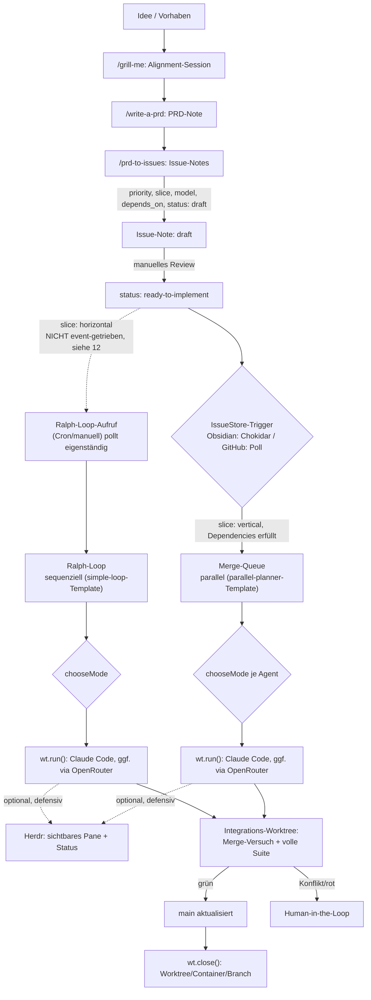
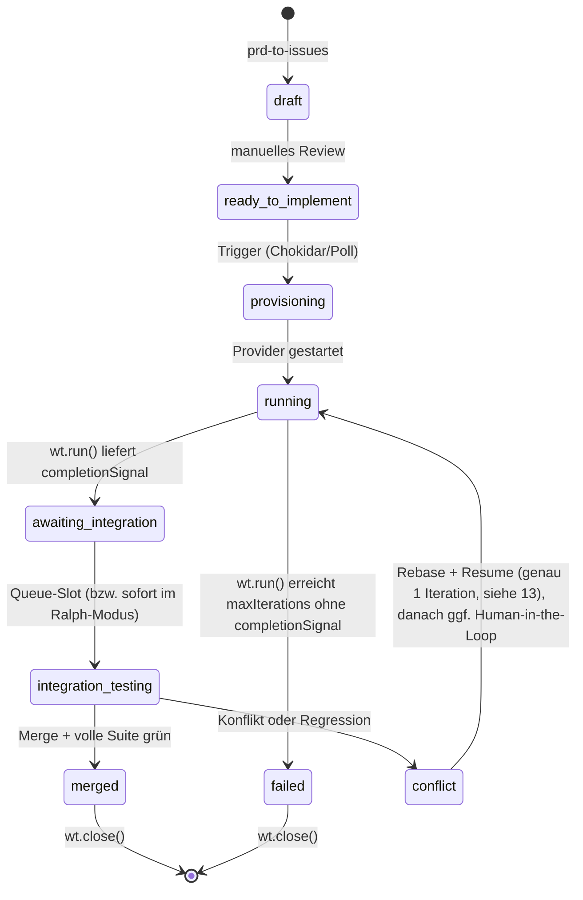
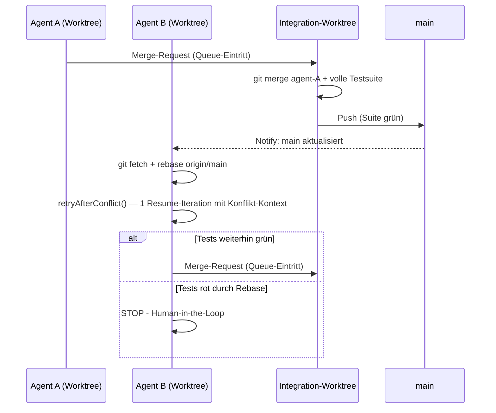

# Agentic Issue Pipeline: Von der Idee zum Merge
### Obsidian-first, mit Docker/Worktree-Hybrid, Claude Code + OpenRouter-Modellwahl, optionalem GitHub-Fallback und Herdr-Sichtbarkeit

---

## 0. Was neu ist gegenüber der Vorversion

Dieser Durchgang folgt bewusst drei Schritten: erst Widersprüche, dann ungenau Beschriebenes, dann allgemeine Verbesserungen. Alle sind in diesem Dokument bereits zusammengeführt; diese Liste zeigt, was in welchem Durchgang passiert ist.

**Technischer Stand:** Gegen Sandcastles README (Release v0.10.0) und Claude Codes offizielle model-config-Doku verifiziert, zuletzt 2026-07-08. Sandcastle committet mehrfach wöchentlich — bei Zweifel an einer Detailbehauptung dieser Spec lohnt ein erneuter Blick in die aktuelle README, nicht nur in dieses Dokument. Das ist keine Förmlichkeit: Runde 5 unten korrigiert eine eigene „Klärung" aus Runde 3, die genau an diesem Punkt zu voreilig war.

**Schritt 1 — Widersprüche behoben:**
- **Antigravity komplett entfernt.** Claude Code ist die einzige Agent-CLI.
- **Neu dafür: Modellwahl über OpenRouter** (Abschnitt 8.1) — orthogonal zur CLI-Frage.
- **Herdr Muster-A/B-Verwirrung aufgelöst** — nur noch: Sandcastle führt aus, Herdr beobachtet.
- **Herdr-Aufrufe defensiv** (`safeHerdr()`) — ein Herdr-Ausfall blockiert den Lauf nicht mehr.
- **Ralph-Loop überschreibt `chooseMode()` nicht mehr blind.**
- **„Drei strikt getrennte Schichten" präzisiert** (Abschnitt 2).
- **Sandcastle-API-Namen korrigiert**: `createWorktree()`/`wt.run()`/`wt.close()` statt fiktiver Namen.

**Schritt 2 — Ungenau Beschriebenes präzisiert:**
- **Merge-Queue auf Sandcastles `parallel-planner`-Template gestützt** statt Eigenbau-Queue.
- **Ralph-Loop auf Sandcastles `simple-loop`-Template gestützt.**
- **`model`-Property vollständig durch Store und `TaskSpec` durchgezogen.**
- **`DOCKER_PARALLEL_LIMIT` definiert.**
- **Agent sieht den Issue-Inhalt tatsächlich** (später in Runde 5 nochmal korrigiert, siehe unten).

**Schritt 3 — Allgemeine Verbesserungen:**
- `sandcastle init --issue-tracker custom` als Einstiegspfad.
- Session-Resume für Konflikt-Retries (später in Runde 5 korrigiert).
- `permissionMode`-Hinweis für AFK-Sicherheit.
- `crossPlatformRisk`-Heuristik korrigiert (`posix` raus).
- Priorität explizit als pro-Track-scoped dokumentiert.

**Runde 3 — gegen echte Quellen geprüft, zwei unabhängige Reviews eingearbeitet:**
- Merge-Queue-Dispatcher prüft jetzt Abhängigkeiten/Priorität auf beiden Tracks.
- `dependsOn: []` im GitHub-Backend behoben (HTML-Kommentar-Parsing).
- `parallelAgentCount` wird jetzt tatsächlich gesetzt (`activeRunCount`).
- `testing_local` aus dem Zustandsdiagramm entfernt (kein Code setzt es je).
- Flowchart korrigiert (Ralph pollt unabhängig, nicht event-getrieben).
- Startup-Reconciliation als Konzept ergänzt (Code folgt erst in Runde 5, siehe unten).
- Kleinere Korrekturen: `pi`/`omp` in Herdrs CLI-Liste, Obsidian-Frontmatter-Fallbacks.
- **`noSandbox()` für `wt.run()` als „geklärt" (gegen `noSandbox()`) markiert** — diese spezifische Korrektur war selbst voreilig, siehe Runde 5.

**Runde 4 — Abgrenzung zu „Oz für OSS"** (Abschnitt 6.1): eigener Abschnitt, warum Warps Trust-Infrastruktur hier bewusst nicht zum Einsatz kommt (anderes Problem: fremde Contributor vs. Solo/Team-intern), mit Hinweis, dass das keine Sackgasse ist, sondern eine verschiebbare Grenze.

**Runde 5 — eigene „Klärungen" aus Runde 3 gegen die aktuelle README zurückgeprüft, weil Selbst-Review sie angezweifelt hat:**
- **`noSandbox()`/`wt.run()` — Reversal.** Die Live-README sagt an der eindeutigsten Stelle ausdrücklich das Gegenteil von dem, was Runde 3 als „geklärt" hinstellte: *„The sandbox option on `run()`, `interactive()`, and `createSandbox()` accepts any provider, including `noSandbox()`"*, plus *„Worktree methods (...) accept the same providers as their top-level counterparts."* Die einzige Gegenevidenz ist eine mehrdeutige Klammer-Bemerkung. „Host" nutzt deshalb wieder `noSandbox()` (Abschnitt 8/14) — mit einem klar markierten empirischen Testpunkt in Slice 1 (Abschnitt 18) statt einer dritten Interpretation.
- **`retryAfterConflict()` griff ein nicht existierendes Feld ab** (`result.sessionFilePath` auf oberster Ebene gibt es laut README nicht — nur pro Iteration, `result.iterations[...].sessionId`) **und übergab den falschen Wertetyp an `resumeSession`** (Dateipfad statt Session-ID). Behoben in Abschnitt 4/5/14 (`sessionId` statt `sessionFilePath` durchgängig).
- **`timeoutSeconds` war eine erfundene Sandcastle-Option.** Die echten Felder heißen `idleTimeoutSeconds` (Default 600s) und `completionTimeoutSeconds` (Default 60s) — und `idleTimeoutSeconds` deckt den in Abschnitt 12 beschriebenen Hänger-Fall bereits standardmäßig ab. Weniger Code nötig als vorher, nicht mehr (Abschnitt 12/14/17).
- **Dynamische Kontext-Einspeisung lief im Sandbox, wo der Vault nicht gemountet ist.** `` !`cat vault/issues/{{ISSUE_ID}}.md` `` (Runde 3) führt den Befehl *im Container* aus — der Obsidian-Vault liegt aber außerhalb des Worktrees. Fix: Issue-Inhalt wird host-seitig aus dem ohnehin vorhandenen `IssueStore` gelesen und direkt als `promptArgs`-Wert übergeben, kein Shell-Befehl im Sandbox nötig (Abschnitt 14).
- **Merge-Queue-Re-Scan (Runde 3) konnte Issues doppelt dispatchen**, wenn zwei Merge-Events knapp hintereinander feuerten. Fix: einfacher synchroner In-Flight-Claim (`claim()`/`release()`) im Dispatcher (Abschnitt 14).
- **Startup-Reconciliation jetzt als echter Code** statt Prosa (Abschnitt 16).
- **`_SUPPORTED_CAPABILITIES` als konkreter Fix für Modellwahl-Caveat 2 ergänzt** (Abschnitt 8.1) — mit einer neuen, ehrlich offenen Frage: Die Doku sagt, diese Variable wirke „on third-party providers such as Amazon Bedrock, Google Cloud's Agent Platform, and Microsoft Foundry", während ausdrücklich nur `_NAME`/`_DESCRIPTION` „auch" beim `ANTHROPIC_BASE_URL`-Gateway-Fall (unser OpenRouter-Szenario) greifen. Ob `_SUPPORTED_CAPABILITIES` das auch tut, bleibt unklar (Abschnitt 19).

---

## 1. Zielsetzung

Eine durchgehende Kette von der ersten Idee bis zum gemergten Code, bei der jeder Schritt so minimal wie möglich implementiert ist:

1. Eine Idee wird über ein kurzes Alignment-Gespräch (grill-me) zu einer PRD-Note.
2. Die PRD-Note wird in einzelne Issue-Notes zerlegt (prd-to-issues), jede mit Priorität, Abhängigkeiten und einer Kennzeichnung horizontal/vertikal.
3. Eine Statusänderung im Frontmatter einer Issue-Note (lokal, kein Netzwerk) triggert einen Agenten.
4. Der Agent bekommt automatisch die passende Isolationsstufe (Host oder Docker), das passende Ausführungsmodell (sequenziell oder parallel) und optional ein anderes Modell als den Anthropic-Standard.
5. Integration läuft über einen neutralen Worktree, Merge nur nach vollem Testlauf, Eskalation an den Menschen bei echten Konflikten.

Solo-Betrieb ist der Normalfall; Team-Betrieb ist ein austauschbares Backend, kein Sonderfall, der die Architektur verbiegt.

---

## 2. Architekturprinzip

Drei Schichten — mit einer ehrlichen Einschränkung: Sandcastles `agent`-Parameter (Abschnitt 8.1) entscheidet auch *welches Modell* denkt, nicht nur *wo* ausgeführt wird. Das ist ein Stück Intelligenz-Schicht, das faktisch in der Sandcastle-Schicht mitläuft. Die Trennung bleibt trotzdem sinnvoll — nur eben nicht hermetisch:

| Schicht | Verantwortung | Komponente |
|---|---|---|
| **Zustand & Trigger** | Wo lebt der Status eines Issues, was löst eine Statusänderung aus | **IssueStore** (Obsidian-Default oder GitHub-Fallback) |
| **Verwaltung der physischen Umgebung (+ Modellwahl)** | Worktree anlegen/schließen, Sandbox wählen, Agent-Provider inkl. Modell konfigurieren | **[Sandcastle](https://github.com/mattpocock/sandcastle)** |
| **Intelligenz & Orchestrierung** | Welches Issue als Nächstes, Ralph-Loop, Merge-Queue-Dispatch | **Orchestrator (TS/Fastify)** |

Der Orchestrator ist ein **persistenter lokaler Prozess** — er braucht ohnehin Dateisystem- und Docker-Zugriff für Sandcastle. Das ist der Grund, warum hier kein Webhook-Server + externer State-Store nötig ist, wie ihn z. B. Warps „Oz für OSS" für offene Contributor-Szenarien braucht (Abschnitt 6.1).

### Gesamtüberblick



---

## 3. Vorstufe: Von der Idee zum Issue

### 3.1 `/grill-me`

Kein Artefakt-Zwang. Eine interaktive Ausrichtungs-Session zwischen dir und dem LLM zu einem Design-Konzept, bevor irgendetwas geschrieben wird. Ergebnis fließt als Chat-Kontext oder kurze Notiz in 3.2 ein.

### 3.2 `/write-a-prd`

Erzeugt aus der grill-me-Session eine einzelne Obsidian-Note mit `type: prd` im Frontmatter. Die PRD muss immer aktuell sein: bei einer grundlegenden Planänderung wird die Note **neu geschrieben**, nicht inkrementell gepatcht.

```yaml
---
type: prd
id: prd-2026-001
title: "Geistige Klang-Räume: Gesten-Interaktion Phase 2"
status: approved
created: 2026-07-08
---
```

### 3.3 `/prd-to-issues`

Zerlegt die PRD-Note in mehrere Issue-Notes. Kein echtes Kanban-Board-Widget nötig — eine flache Menge von Notes mit Frontmatter-Properties reicht, sichtbar per Dataview-Query. Für jedes Issue wird gesetzt:

| Property | Werte | Bedeutung |
|---|---|---|
| `priority` | `bugfix` \| `infra` \| `tracer-bullet` \| `polish` \| `refactor` | Reihenfolge der Bearbeitung, absteigend in dieser Liste — gilt separat pro Track (Ralph vs. Merge-Queue), nicht global über beide hinweg |
| `slice` | `horizontal` \| `vertical` | Routing-Entscheidung, siehe Abschnitt 9 |
| `model` | optional, z. B. `openai/gpt-5.2` | Siehe Abschnitt 8.1. Unset = direkter Anthropic-Standardpfad, kein Gateway involviert |
| `depends_on` | Liste von Issue-IDs | Ein Issue wird erst kandidiert, wenn alle Abhängigkeiten `merged` sind |
| `status` | siehe Abschnitt 10 | Der eigentliche State-Machine-Wert |

**Horizontal** heißt: Schicht für Schicht (erst DB, dann API, dann Frontend) — inhärent sequenziell, gehört in den Ralph-Loop. **Vertikal** heißt: eine Tracer-Bullet-Slice quer durch alle Schichten für ein Feature — lose genug gekoppelt für parallele Worktrees.

Neu entstandene Issues starten mit `status: draft` — ein bewusster manueller Gate-Schritt, bevor du sie auf `ready-to-implement` setzt.

**Sichtbarkeit als virtuelles Kanban-Board** (Dataview):

```
TABLE priority, slice, model, status, depends_on
FROM "vault/issues"
WHERE type = "issue"
SORT priority ASC
```

---

## 4. Der Issue-Store: gemeinsame Abstraktion

Eine separate Registry ist bei der Obsidian-Variante nicht nötig, weil die Note selbst der Datensatz ist.

**Korrektur (Runde 5):** `sessionFilePath` hieß in der Vorversion so, weil es fälschlich `result.sessionFilePath` zugewiesen wurde — dieses Feld existiert auf oberster Ebene des Sandcastle-Ergebnisses nicht. Persistiert wird stattdessen `sessionId` (aus `result.iterations[...].sessionId`), das ist auch das, was `resumeSession` tatsächlich als Wert erwartet.

```typescript
// issue-store.ts
export type IssueStatus =
  | "draft"
  | "ready-to-implement"
  | "provisioning"
  | "running"
  | "awaiting_integration"
  | "integration_testing"
  | "conflict"
  | "merged"
  | "failed";

export type Priority = "bugfix" | "infra" | "tracer-bullet" | "polish" | "refactor";
export type Slice = "horizontal" | "vertical";

export interface IssueRecord {
  id: string;
  title: string;
  status: IssueStatus;
  priority: Priority;
  slice: Slice;
  model?: string; // OpenRouter-Slug, z.B. "openai/gpt-5.2" — unset = Anthropic-Standard, siehe 8.1
  mode?: "host" | "container";
  branch?: string;
  worktreePath?: string;
  sessionId?: string; // Für Konflikt-Resume (Abschnitt 13), aus result.iterations[...].sessionId
  dependsOn: string[];
  createdAt: string;
  updatedAt: string;
  body: string;
}

export interface IssueStore {
  list(filter?: Partial<Pick<IssueRecord, "status" | "priority" | "slice">>): Promise<IssueRecord[]>;
  get(id: string): Promise<IssueRecord | null>;
  updateStatus(id: string, status: IssueStatus, patch?: Partial<IssueRecord>): Promise<void>;
  appendLog(id: string, heading: string, content: string): Promise<void>;
  onChange(cb: (id: string, prev: IssueRecord | null, next: IssueRecord) => void): void;
}
```

---

## 5. Default-Backend: Obsidian Frontmatter + Chokidar

Kein Webhook, kein API-Client, kein Auth-Token, kein Rate-Limit — reines lokales File-I/O.

```typescript
// obsidian-issue-store.ts
import chokidar from "chokidar";
import matter from "gray-matter";
import { readFile, writeFile, rename } from "fs/promises";
import { glob } from "glob";
import path from "path";

const VAULT_ISSUES_DIR = "./vault/issues";

export class ObsidianIssueStore implements IssueStore {
  private cache = new Map<string, IssueRecord>();
  private listeners: Array<(id: string, prev: IssueRecord | null, next: IssueRecord) => void> = [];

  constructor() {
    this.rescan();
    chokidar.watch(`${VAULT_ISSUES_DIR}/*.md`).on("change", (fp) => this.handleChange(fp));
  }

  private async rescan() {
    for (const f of await glob(`${VAULT_ISSUES_DIR}/*.md`)) await this.loadFile(f);
  }

  private async loadFile(filePath: string): Promise<IssueRecord> {
    const { data, content } = matter(await readFile(filePath, "utf-8"));
    // Fallbacks: ohne sie würde ein fehlendes priority-Feld zu
    // PRIORITY_ORDER.indexOf(undefined) === -1 führen und fälschlich vor "bugfix"
    // einsortiert werden (Abschnitt 9).
    const record: IssueRecord = {
      id: data.id ?? path.basename(filePath, ".md"),
      title: data.title ?? "",
      status: data.status ?? "draft",
      priority: data.priority ?? "polish",
      slice: data.slice ?? "vertical",
      model: data.model,
      mode: data.mode,
      branch: data.branch,
      worktreePath: data.worktree,
      sessionId: data.session_id,
      dependsOn: data.depends_on ?? [],
      createdAt: data.created ?? new Date().toISOString(),
      updatedAt: data.updated ?? new Date().toISOString(),
      body: content,
    };
    this.cache.set(record.id, record);
    return record;
  }

  private async handleChange(filePath: string) {
    const id = path.basename(filePath, ".md");
    const prev = this.cache.get(id) ?? null;
    const next = await this.loadFile(filePath);
    if (!prev || prev.status !== next.status) {
      this.listeners.forEach((cb) => cb(id, prev, next));
    }
  }

  async list(filter: Partial<Pick<IssueRecord, "status" | "priority" | "slice">> = {}) {
    return [...this.cache.values()].filter((r) =>
      Object.entries(filter).every(([k, v]) => (r as any)[k] === v)
    );
  }

  async get(id: string) {
    return this.cache.get(id) ?? null;
  }

  async updateStatus(id: string, status: IssueStatus, patch: Partial<IssueRecord> = {}) {
    const record = this.cache.get(id);
    if (!record) throw new Error(`Issue ${id} nicht gefunden`);
    const merged = { ...record, ...patch, status, updatedAt: new Date().toISOString() };
    const frontmatter = {
      id: merged.id, title: merged.title, status: merged.status, priority: merged.priority,
      slice: merged.slice, model: merged.model, mode: merged.mode, branch: merged.branch,
      worktree: merged.worktreePath, session_id: merged.sessionId, depends_on: merged.dependsOn,
      created: merged.createdAt, updated: merged.updatedAt,
    };
    const filePath = path.join(VAULT_ISSUES_DIR, `${id}.md`);
    const tmp = `${filePath}.tmp`;
    await writeFile(tmp, matter.stringify(merged.body, frontmatter), "utf-8");
    await rename(tmp, filePath);
    this.cache.set(id, merged);
  }

  async appendLog(id: string, heading: string, content: string) {
    const record = this.cache.get(id);
    if (!record) throw new Error(`Issue ${id} nicht gefunden`);
    const entry = `\n\n### [${new Date().toISOString()}] ${heading}\n${content}\n`;
    await this.updateStatus(id, record.status, { body: record.body + entry });
  }

  onChange(cb: (id: string, prev: IssueRecord | null, next: IssueRecord) => void) {
    this.listeners.push(cb);
  }
}
```

**Wichtige Praxis-Regeln:**

- Rohes `stdout`/`stderr` gehört nicht in die Note (Vault-Bloat). Logs landen in `./logs/<issueId>/<timestamp>.log`; `appendLog` schreibt nur eine Zusammenfassung plus Pfad-Referenz.
- Agenten schreiben append-only an den Body — minimiert Kollisionsfläche mit manuellen Edits.
- Bei geräteübergreifendem Sync (Obsidian Sync/Dropbox/iCloud): Orchestrator nur gegen die lokale, primäre Kopie laufen lassen.
- Der `cache` ist reine Performance-Optimierung, kein zweiter Wahrheitsträger — er darf aus der Sync geraten, weil `rescan()` ihn repariert.

---

## 6. Fallback-Backend: GitHub Issues + Labels (Team-Fall)

Nur relevant, sobald ein zweiter Mensch mitarbeitet, externe Sichtbarkeit ohne Vault-Zugriff gewünscht ist, oder GitHub Actions als CI-Gate eingebunden werden soll. Kein Webhook-Server nötig — ein Poll-Loop im selben persistenten Orchestrator-Prozess reicht.

`depends_on` wird aus einem HTML-Kommentar im Issue-Body geparst (unsichtbar im gerenderten Issue, von `prd-to-issues` beim Anlegen mitgeschrieben) statt über ein Label — Labels sind für eine variable Liste von IDs unhandlich:

```typescript
// Erwartetes Format im Issue-Body, von prd-to-issues generiert:
// <!-- depends_on: 12, 14 -->
function parseDependsOn(body: string): string[] {
  const match = body.match(/<!--\s*depends_on:\s*([\d,\s]+)-->/);
  if (!match) return [];
  return match[1].split(",").map((s) => s.trim()).filter(Boolean);
}
```

```typescript
// github-issue-store.ts
import { execSync } from "child_process";

const POLL_INTERVAL_MS = 30_000;

export class GitHubIssueStore implements IssueStore {
  private cache = new Map<string, IssueRecord>();
  private listeners: Array<(id: string, prev: IssueRecord | null, next: IssueRecord) => void> = [];

  constructor(private repo: string) {
    this.poll();
    setInterval(() => this.poll(), POLL_INTERVAL_MS);
  }

  private async poll() {
    const raw = execSync(
      `gh issue list --repo ${this.repo} --state open --json number,title,labels,body,updatedAt`
    ).toString();
    for (const issue of JSON.parse(raw)) {
      const id = String(issue.number);
      const labels: string[] = issue.labels.map((l: any) => l.name);
      const byPrefix = (prefix: string, fallback?: string) =>
        labels.find((l) => l.startsWith(`${prefix}:`))?.split(":").slice(1).join(":") ?? fallback;
      const next: IssueRecord = {
        id,
        title: issue.title,
        status: byPrefix("status", "draft") as IssueStatus,
        priority: byPrefix("priority", "polish") as Priority,
        slice: byPrefix("slice", "vertical") as Slice,
        // model-Slugs enthalten "/" (z.B. "openai/gpt-5.2") — das Label-Präfix-Schema
        // splittet nur am ERSTEN ":", der Rest bleibt intakt. Trotzdem: GitHub-Labels
        // sind für Freitext-Slugs unbequemer als Obsidian-Frontmatter — im Team-Fall ggf.
        // model bewusst nur über Obsidian-Notes setzen, auch wenn Status via GitHub läuft.
        model: byPrefix("model"),
        dependsOn: parseDependsOn(issue.body),
        // Kein sessionId-Äquivalent auf diesem Backend — Konflikt-Resume (Abschnitt 13)
        // funktioniert damit aktuell nur zuverlässig über das Obsidian-Backend.
        createdAt: issue.updatedAt,
        updatedAt: issue.updatedAt,
        body: issue.body,
      };
      const prev = this.cache.get(id) ?? null;
      this.cache.set(id, next);
      if (!prev || prev.status !== next.status) this.listeners.forEach((cb) => cb(id, prev, next));
    }
  }

  async list(filter: Partial<Pick<IssueRecord, "status" | "priority" | "slice">> = {}) {
    return [...this.cache.values()].filter((r) =>
      Object.entries(filter).every(([k, v]) => (r as any)[k] === v)
    );
  }

  async get(id: string) {
    return this.cache.get(id) ?? null;
  }

  async updateStatus(id: string, status: IssueStatus, patch: Partial<IssueRecord> = {}) {
    const record = this.cache.get(id);
    const removeFlag = record ? `--remove-label "status:${record.status}"` : "";
    execSync(`gh issue edit ${id} --repo ${this.repo} ${removeFlag} --add-label "status:${status}"`);
    if (record) this.cache.set(id, { ...record, ...patch, status, updatedAt: new Date().toISOString() });
  }

  async appendLog(id: string, heading: string, content: string) {
    const body = `### [${new Date().toISOString()}] ${heading}\n${content}`;
    execSync(`gh issue comment ${id} --repo ${this.repo} --body ${JSON.stringify(body)}`);
  }

  onChange(cb: (id: string, prev: IssueRecord | null, next: IssueRecord) => void) {
    this.listeners.push(cb);
  }
}
```

### 6.1 Abgrenzung zu „Oz für OSS"

Warp betreibt mit **Oz** eine reale Cloud-Agent-Orchestrierungsplattform, und **Oz für OSS** (`warpdotdev/oz-for-oss`) ist ein darauf aufbauendes, öffentlich verfügbares Workflow-Paket genau für Open-Source-Zusammenarbeit. Warum nicht einfach das nehmen, statt einen eigenen `GitHubIssueStore` zu bauen?

**Weil beide ein anderes Problem lösen, kein Ersatz füreinander sind:**

- **Oz für OSS löst Vertrauen bei fremden Contributoren.** Issue-Bodies, Kommentare und PR-Inhalte können von jedem editiert werden, der zum Repo beitragen darf — das Workflow-Paket liest diese Inhalte deshalb nie direkt, sondern ausschließlich über ein Skript, das jeden Abschnitt mit Herkunfts-Metadaten versieht (Autor, `author_association`). Nur Abschnitte von `OWNER`, `MEMBER` oder `COLLABORATOR` werden explizit als `trust=TRUSTED` markiert; alles andere bleibt unklassifiziert. Dafür braucht es die schwere Infrastruktur: Vercel-gehosteter Webhook-Control-Plane, `RunState` in Vercel KV, GitHub-App-Installation.
- **Diese Pipeline löst das nicht, weil das Problem hier nicht existiert.** Solo-Betrieb ist der Normalfall, das GitHub-Backend ist ein optionaler Fallback für „ein zweiter Mensch aus dem eigenen Team schreibt mit" — nicht für offene, fremde Contributor.
- **Sandcastle und Oz für OSS sind unterschiedliche Schichten**, kein Duplikat: Sandcastle verwaltet die physische Ausführungsumgebung, Oz für OSS entscheidet, *ob und wessen* Input überhaupt vertrauenswürdig genug ist.

**Kein Sackgassen-Argument, sondern eine Grenze, die verschiebbar ist:** Bekommt dieses Projekt später echte externe Beiträge von Unbekannten, wäre Oz für OSS der naheliegende *zusätzliche* Baustein davor — nicht ein Ersatz für Sandcastle, sondern eine Vertrauens-Schicht oberhalb des `GitHubIssueStore`.

---

## 7. Wann wechseln?

| Kriterium | Obsidian (Default) | GitHub (Fallback) |
|---|---|---|
| Nur du arbeitest am Projekt | ✅ | – |
| Zweiter Mensch braucht Sichtbarkeit ohne Vault-Zugriff | – | ✅ |
| GitHub Actions als CI-Gate vor Merge gewünscht | – | ✅ |
| Kein Netzwerk/API-Abhängigkeit gewünscht | ✅ | – |
| Issue-Note soll gleichzeitig Wissensgraph-Knoten sein | ✅ | – |

Der Wechsel ist rein additiv: `new GitHubIssueStore(repo)` statt `new ObsidianIssueStore()` an der einzigen Stelle, an der der Store instanziiert wird.

---

## 8. Routing A: Host vs. Docker (`chooseMode`)

Worktree-Erstellung ist immer Pflicht, Docker wird nur bei konkretem Grund zugeschaltet.

**Korrektur einer vorherigen Korrektur (Runde 5):** Eine vorherige Fassung dieser Spec erklärte, `noSandbox()` sei für `wt.run()` nicht zulässig, gestützt auf eine Review-Behauptung. Erneute Prüfung gegen die aktuelle, lebende Sandcastle-README zeigt: Die eindeutigste Textstelle sagt das Gegenteil — *„The `sandbox` option on `run()`, `interactive()`, and `createSandbox()` accepts any provider, including `noSandbox()`"*, und *„Worktree methods (...) accept the same providers as their top-level counterparts."* Die einzige Gegenevidenz ist eine mehrdeutige Klammer-Bemerkung („AFK agents must be sandboxed") in der Optionstabelle, die genauso als Empfehlung wie als Typ-Restriktion lesbar ist. Statt die Frage ein drittes Mal nur durch Lesen zu entscheiden: „Host" nutzt wieder `noSandbox()`, mit einem klar markierten Verifikationsschritt beim ersten echten Lauf (Slice 1, Abschnitt 18) statt einer weiteren Interpretation.

| Kriterium | Host | Docker |
|---|---|---|
| Reines Sprach-Tooling bereits auf Host vorhanden | ✅ | – |
| Zusätzlicher Service nötig (DB, Redis, …) | – | ✅ |
| Anderes OS / plattformspezifische Bibliotheken | – | ✅ |
| Übergeordnete Ordner sollen unsichtbar bleiben | – | ✅ |
| CI-Parität gewünscht | – | ✅ |
| Task als destruktiv markiert | – | ✅ |
| Schnelligkeit hat Priorität | ✅ | – |

```typescript
// mode-decision.ts
export type AgentMode = "host" | "container";

export interface TaskSpec {
  issueId: string;
  branchName: string;
  model?: string; // siehe 8.1 — unabhängig von AgentMode
  forceMode?: AgentMode;
  idleTimeoutSeconds?: number; // Override für Sandcastles Default (600s), siehe 12/17
  signals?: {
    needsService?: boolean;
    crossPlatformRisk?: boolean;
    destructive?: boolean;
    parallelAgentCount?: number;
  };
  dockerImage?: string;
}

const HOST_PARALLEL_LIMIT = 4;
// Container brauchen mehr RAM/CPU pro Instanz als Host-Prozesse — Limit bewusst niedriger.
const DOCKER_PARALLEL_LIMIT = 2;

export function chooseMode(spec: TaskSpec): AgentMode {
  if (spec.forceMode) return spec.forceMode;
  const s = spec.signals ?? {};
  if (s.needsService || s.crossPlatformRisk || s.destructive) return "container";
  if ((s.parallelAgentCount ?? 0) >= HOST_PARALLEL_LIMIT) return "container";
  return "host";
}

export function taskSpecFromIssue(issue: IssueRecord, overrides: Partial<TaskSpec> = {}): TaskSpec {
  return {
    issueId: issue.id,
    branchName: issue.branch ?? `agent/${issue.id}`,
    model: issue.model,
    signals: {
      needsService: /docker-compose/.test(issue.body),
      crossPlatformRisk: /native binding|windows-only|platform-specific/i.test(issue.body),
      destructive: /migration|drop table|rm -rf/i.test(issue.body),
    },
    ...overrides,
  };
}
```

`parallelAgentCount` wird von keinem statischen Wert befüllt, sondern von `activeRunCount` in `run-agent.ts` (Abschnitt 14) — ein einfacher In-Memory-Zähler, inkrementiert vor und dekrementiert nach jedem `wt.run()`-Aufruf, unabhängig vom Track. Reicht für eine Single-Process-Instanz; bei mehreren Orchestrator-Prozessen (nicht Teil dieser Spec) müsste der Zähler extern geteilt werden. `DOCKER_PARALLEL_LIMIT` wird vom Merge-Queue-Dispatcher (Abschnitt 14) als Obergrenze durchgesetzt.

### 8.1 Modellwahl: Claude Code bleibt die einzige CLI, das Modell dahinter ist trotzdem austauschbar

Claude Code ist der alleinige Agent — kein `agentKind`, kein Custom-`AgentProvider`. Trotzdem lässt sich *welches Modell* antwortet unabhängig davon konfigurieren, weil Claude Code selbst genau dafür einen Mechanismus mitbringt: `ANTHROPIC_BASE_URL` (wohin Anfragen gehen) plus die `ANTHROPIC_DEFAULT_*_MODEL`-Variablen (welches Modell dort angefragt wird). Sandcastles `claudeCode()`-Provider reicht das direkt durch — der zweite Options-Parameter akzeptiert `env: Record<string, string>`, das pro Lauf gemerged wird.

**Die Einschränkung, die das für OpenRouter bedeutet:** Claude Code spricht das Anthropic-Messages-API-Format. OpenRouters natives API ist OpenAI-chat-completions-förmig — es braucht einen Übersetzer dazwischen. Zwei verifiziert funktionierende Optionen: **LiteLLM Gateway** oder **agentgateway**. Beide laufen **einmalig lokal**, kein Pro-Task-Lifecycle nötig:

```yaml
# gateway-config.yaml (agentgateway, einmalig lokal gestartet, z.B. via `agentgateway -f gateway-config.yaml`)
llm:
  models:
    - name: "*"
      provider: openAI
      params:
        baseURL: "https://openrouter.ai/api/v1"
        apiKey: "$OPENROUTER_API_KEY"
```

```typescript
// model-provider.ts
import { claudeCode } from "@ai-hero/sandcastle";

const GATEWAY_URL = process.env.CLAUDE_MODEL_GATEWAY_URL ?? "http://localhost:4141";

export function getAgent(modelSlug?: string) {
  if (!modelSlug) {
    // Kein Override: direkter Anthropic-Standardpfad, kein Gateway involviert.
    return claudeCode("claude-opus-4-8");
  }
  // modelSlug in OpenRouter-Notation, z.B. "openai/gpt-5.2" oder "google/gemini-3-pro".
  return claudeCode(modelSlug, {
    env: {
      ANTHROPIC_BASE_URL: GATEWAY_URL,
      ANTHROPIC_AUTH_TOKEN: process.env.OPENROUTER_GATEWAY_TOKEN ?? "",
    },
  });
}
```

**Zwei Caveats, konkreter als „manche Modelle können schlecht Tools aufrufen":**

1. **Protokoll-Übersetzung ist der eigentliche Bruchpunkt, nicht nur Modellqualität.** Claude Code feuert Tool-Aufrufe im Anthropic-Content-Block-Format ab; der Gateway muss bei *jedem* Tool-Call verlustfrei ins OpenAI-Format übersetzen und zurück. Bricht das, scheitert der Lauf nicht sauber, sondern mit kaputten/ignorierten Tool-Aufrufen mitten im TDD-Loop. Vor produktivem Einsatz eines Modells den echten `skills/tdd-loop.md`-Workflow smoke-testen, nicht nur einen Chat-Prompt.
2. **Claude Code erkennt Fähigkeiten über String-Matching auf den Modellnamen, nicht über eine echte Capability-Abfrage.** Ein Modellstring ohne bekanntes Claude-Muster (wie `"openai/gpt-5.2"`) führt zu still angewandten Fallback-Werten (kleineres Kontextfenster, kein erkanntes Cutoff-Datum) — nicht zu einem Fehler.

**Konkreter Fix für Caveat 2, jetzt verifiziert:** Claude Code selbst dokumentiert genau für dieses Szenario Companion-Variablen: `ANTHROPIC_DEFAULT_OPUS_MODEL_SUPPORTED_CAPABILITIES` (comma-separated, z. B. `effort,thinking`) — „Required when the pinned model supports features the auto-detection cannot confirm". Dieselben `_NAME`/`_DESCRIPTION`/`_SUPPORTED_CAPABILITIES`-Suffixe gibt es auch für `ANTHROPIC_DEFAULT_SONNET_MODEL`, `_HAIKU_MODEL`, `_FABLE_MODEL` und `ANTHROPIC_CUSTOM_MODEL_OPTION`. Variante B nutzt das:

```typescript
// Variante A (oben): modelSlug als Sandcastle-Modellname direkt.
// Funktioniert sicher fürs Routing, riskiert aber Caveat 2.

// Variante B: Claude Codes eigenen Modellnamen auf einem echten Claude-Alias belassen
// (für die Capability-Erkennung), das Ziel-Modell separat via ANTHROPIC_DEFAULT_OPUS_MODEL
// durchreichen, Fähigkeiten explizit deklarieren statt sie erraten zu lassen.
export function getAgentVariantB(modelSlug?: string) {
  if (!modelSlug) return claudeCode("claude-opus-4-8");
  return claudeCode("claude-opus-4-8", {
    env: {
      ANTHROPIC_BASE_URL: GATEWAY_URL,
      ANTHROPIC_AUTH_TOKEN: process.env.OPENROUTER_GATEWAY_TOKEN ?? "",
      ANTHROPIC_DEFAULT_OPUS_MODEL: modelSlug,
      ANTHROPIC_DEFAULT_OPUS_MODEL_SUPPORTED_CAPABILITIES: "effort,thinking",
    },
  });
}
```

**Unklar und vor Produktivbetrieb zu verifizieren — zwei separate offene Fragen, nicht eine:**
- Ob `claudeCode(modelSlug, {...})`s erstes Argument beim tatsächlichen CLI-Aufruf als `--model`-Flag oder als `ANTHROPIC_MODEL`-Env-Var landet, ist aus Sandcastles Doku nicht ablesbar — relevant für Variante A vs. B, da `--model` gegenüber `ANTHROPIC_MODEL` gewinnt.
- **Neu:** Claude Codes eigene Doku sagt, die `_SUPPORTED_CAPABILITIES`-Variablen wirken „on third-party providers such as Amazon Bedrock, Google Cloud's Agent Platform, and Microsoft Foundry" — und nennt ausdrücklich nur `_NAME`/`_DESCRIPTION` als Varianten, die „auch" beim `ANTHROPIC_BASE_URL`-Gateway-Fall (unser OpenRouter-Szenario) greifen. Ob `_SUPPORTED_CAPABILITIES` dort ebenfalls wirkt oder nur für Bedrock/Vertex/Foundry gilt, sagt die Doku nicht eindeutig. Beide Punkte vor Produktivbetrieb gegen einen echten Lauf verifizieren.

---

## 9. Routing B: Sequenziell (Ralph-Loop) vs. Parallel (Merge-Queue)

```typescript
// mode-decision.ts (Fortsetzung von Abschnitt 8)
export function routeExecution(issue: IssueRecord): "ralph" | "merge-queue" {
  return issue.slice === "horizontal" ? "ralph" : "merge-queue";
}

export function dependenciesSatisfied(issue: IssueRecord, all: IssueRecord[]): boolean {
  return issue.dependsOn.every((depId) => all.find((i) => i.id === depId)?.status === "merged");
}

const PRIORITY_ORDER: Priority[] = ["bugfix", "infra", "tracer-bullet", "polish", "refactor"];

// Läuft getrennt pro Track — Ralph und Merge-Queue sortieren unabhängig,
// nie gemeinsam über eine globale Prioritätsliste.
export function pickNextIssue(candidates: IssueRecord[], all: IssueRecord[]): IssueRecord | null {
  const ready = candidates
    .filter((i) => i.status === "ready-to-implement" && dependenciesSatisfied(i, all))
    .sort((a, b) => PRIORITY_ORDER.indexOf(a.priority) - PRIORITY_ORDER.indexOf(b.priority));
  return ready[0] ?? null;
}
```

Beide Pfade laufen am Ende durch denselben Integrations-Worktree-Test (Abschnitt 13) — im Ralph-Modus entfällt nur das Warten auf einen Queue-Slot, weil es keine Konkurrenz gibt. Beide Pfade rufen `dependenciesSatisfied()`/`pickNextIssue()`/`routeExecution()` konsistent auf (Abschnitt 14) — vorher tat das nur der Ralph-Pfad.

---

## 10. Zustandsmodell



`wt.run()` iteriert intern selbst bis `completionSignal`/`maxIterations` — eine Blackbox aus Orchestrator-Sicht, ohne Zwischen-Callbacks pro Iteration. `running` ist daher der einzige Zustand während des gesamten `wt.run()`-Aufrufs.

---

## 11. Ablaufplan – Single Agent

1. Trigger: `status` einer Issue-Note wechselt auf `ready-to-implement` (Obsidian) bzw. Label `status:ready-to-implement` wird gesetzt (GitHub).
2. `routeExecution(issue)` → Ralph oder Merge-Queue (Abschnitt 9).
3. `chooseMode(taskSpecFromIssue(issue))` → Host oder Docker (Abschnitt 8); `getAgent(issue.model)` → Claude Code, ggf. via OpenRouter-Gateway (Abschnitt 8.1).
4. Provisioning: `createWorktree({ branchStrategy: { type: "branch", branch } })`.
5. TDD-Loop über `wt.run({ agent, sandbox, promptFile, promptArgs, maxIterations, idleTimeoutSeconds })` — Sandcastle iteriert selbst bis `completionSignal` (Default `<promise>COMPLETE</promise>`) oder `maxIterations` erreicht ist.
6. Lokaler Abschluss: Commits liegen laut `result.commits` vor, Status → `awaiting_integration`.
7. Integrations-Test (Abschnitt 13), dann Merge oder Konflikt-Eskalation.
8. Cleanup: `wt.close()` — bei sauberem Zustand entfernt, bei unfertigem/dirty Zustand automatisch auf der Platte erhalten (kein Datenverlust bei überraschendem Abbruch).

---

## 12. Ablaufplan – Ralph-Loop (horizontal, AFK, sequenziell)

Fundament ist Sandcastles eigenes `simple-loop`-Template — unser Beitrag ist die Obsidian-Anbindung und die Prioritäts-/Abhängigkeits-Auswahl davor:

```typescript
// ralph-loop.ts
import { runAgent, getActiveRunCount } from "./run-agent";
import { routeExecution, pickNextIssue, taskSpecFromIssue } from "./mode-decision";
import { IssueStore } from "./issue-store";

export async function ralphLoop(store: IssueStore) {
  while (true) {
    const all = await store.list();
    const candidates = all.filter((i) => routeExecution(i) === "ralph");
    const next = pickNextIssue(candidates, all);
    if (!next) {
      console.log("Ralph: keine offenen horizontalen Issues mehr, Loop beendet.");
      return;
    }
    // KEIN forceMode — chooseMode() respektiert weiterhin destructive/needsService-Signale.
    await runAgent(store, taskSpecFromIssue(next, { signals: { parallelAgentCount: getActiveRunCount() } }));
  }
}
```

Kein Sentinel-Text-Parsing auf Orchestrator-Ebene nötig — Sandcastles eingebauter `completionSignal`-Mechanismus übernimmt das; unsere Abbruchbedingung für den Loop selbst ist strukturierter Zustand (leere Kandidatenliste).

**Sicherheitshinweis für AFK-Läufe:** Sandcastle nutzt für unbeaufsichtigte Läufe standardmäßig `--dangerously-skip-permissions`, sofern `permissionMode` nicht gesetzt ist. Für einen nächtlichen Ralph-Loop bewusst entscheiden, ob das gewollt ist, oder `claudeCode(model, { permissionMode: "acceptEdits" })` setzen.

**Gegen hängende/interaktive Läufe: `idleTimeoutSeconds`, nicht selbst erfunden.** Eine vorherige Fassung führte dafür ein eigenes `timeoutSeconds`-Feld ein — das existiert in Sandcastle nicht. Der reale Mechanismus heißt `idleTimeoutSeconds` (Default **600 Sekunden**, „resets whenever the agent produces output"), ist also bereits standardmäßig aktiv und deckt genau das AFK-Hänger-Szenario ab, ohne dass eigener Code nötig wäre. Für einen nächtlichen Loop kann der Wert bei Bedarf niedriger gesetzt werden (`idleTimeoutSeconds: 300`); ein bewusst härteres Timeout statt eines Wartens auf menschliche Eingabe passt zum AFK-Charakter dieses Pfads — ein Mensch schaut ohnehin erst am nächsten Morgen wieder rein.

Auslösung des Loops selbst (Cron, `launchd`, oder manueller Aufruf vor Feierabend) ist Sache der Umgebung, nicht Teil dieser Spec — `ralphLoop()` ist eine Funktion, kein Daemon.

---

## 13. Ablaufplan – Merge-Queue (vertikal, parallel)

Fundament ist Sandcastles `parallel-planner`- bzw. `parallel-planner-with-review`-Template. Unser Beitrag: der Planner liest Kandidaten aus dem `IssueStore` statt aus nativen GitHub Issues — dafür scaffoldet `sandcastle init --issue-tracker custom` einen bewusst unvollständigen Zustand plus eine `SETUP_ISSUE_TRACKER.md`-Anleitung.

1. Jeder Agent committet ausschließlich auf seinem eigenen Branch. Kein direkter Merge auf `main` durch den Agenten selbst.
2. Ein neutraler Integrations-Worktree ist der Flaschenhals für den eigentlichen Merge-Versuch.
3. Agent meldet „bereit" (`awaiting_integration`) → Planner-Queue-Eintritt.
4. An der Spitze der Queue: Merge-Versuch, dann volle Testsuite im Integrations-Worktree.
   - Grün → Push nach `main`, Status `merged`.
   - Rot trotz konfliktfreiem Merge → Status `conflict`.
   - Git-Konflikt → Agent erhält Rebase-Auftrag, erneuter Queue-Eintritt.
5. **Konflikt-Retry mit Kontext, mit einer realen Einschränkung.** Claude-Code-Sessions werden über `captureSessions` (Default an) automatisch gesichert. Aber: `resumeSession` ist auf **genau eine Iteration** begrenzt und mit `maxIterations > 1` inkompatibel — geeignet für „hier ist der Konflikt, behebe ihn", nicht für einen vollständigen neuen Mehrschritt-TDD-Loop. Persistiert wird dafür die `sessionId` der letzten Iteration (nicht ein Dateipfad — Sandcastle löst den zugehörigen Dateipfad selbst intern auf), siehe `retryAfterConflict()` in Abschnitt 14.
6. **Human-in-the-Loop**: Bleiben Tests nach dem einen Resume-Versuch rot, stoppt der Agent (die Ein-Iteration-Grenze ist ohnehin erreicht) und meldet: „Konflikt durch Agent X erkannt, benötige Entscheidung." Kein automatisches Weiterprobieren darüber hinaus.



---

## 14. Referenzimplementierung: `run-agent.ts`

Nutzt die reale Sandcastle-API. Herdr-Aufrufe sind über `safeHerdr()` defensiv gekapselt.

**Korrekturen (Runde 5):**
- `getSandbox()` liefert für „host" wieder `noSandbox()` (Abschnitt 8) statt eines Docker-Passthrough-Images — mit klar markiertem Verifikationsschritt statt stillschweigend übernommener Annahme.
- Der Issue-Inhalt wird jetzt **host-seitig** aus dem `IssueStore` gelesen und als `promptArgs`-Wert übergeben, statt per Shell-Befehl **im Sandbox** auf den Vault zuzugreifen — letzteres würde fehlschlagen, weil der Vault dort nicht gemountet ist.
- `idleTimeoutSeconds` ersetzt das fiktive `timeoutSeconds`.
- `retryAfterConflict()` nutzt `sessionId` statt eines nicht existierenden `result.sessionFilePath`.
- Der Merge-Queue-Dispatcher nutzt jetzt `claim()`/`release()`, um zu verhindern, dass zwei nahezu gleichzeitige `merged`-Events dasselbe entsperrte Issue doppelt dispatchen.

```typescript
// run-agent.ts
import { createWorktree } from "@ai-hero/sandcastle";
import { docker } from "@ai-hero/sandcastle/sandboxes/docker";
import { noSandbox } from "@ai-hero/sandcastle/sandboxes/no-sandbox";
import { chooseMode, taskSpecFromIssue, TaskSpec, AgentMode } from "./mode-decision";
import { getAgent } from "./model-provider";
import { IssueStore } from "./issue-store";
import { herdrOpenWorktree, herdrReadRecent, herdrNotifyHuman, herdrCloseWorkspace } from "./herdr-adapter";

// "Host" = noSandbox() — siehe Abschnitt 8 für die Herleitung. Vor dem ersten
// produktiven Lauf (Slice 1, Abschnitt 18) einmal empirisch bestätigen; schlägt es
// fehl, ist der Fallback eine Zeile: docker({ imageName: HOST_PASSTHROUGH_IMAGE }).
function getSandbox(mode: AgentMode, dockerImage?: string) {
  return mode === "container"
    ? docker({ imageName: dockerImage ?? "sandcastle:local" })
    : noSandbox();
}

// Grober In-Memory-Zähler für parallelAgentCount (Abschnitt 8) — zählt global über
// beide Tracks. Reicht für eine Single-Process-Orchestrator-Instanz.
let activeRunCount = 0;
export function getActiveRunCount() {
  return activeRunCount;
}

// Herdr ist reine Beobachtungsschicht — ein Fehler hier darf den Agent-Lauf nie blockieren.
function safeHerdr<T>(fn: () => T): T | undefined {
  try {
    return fn();
  } catch (e) {
    console.warn("Herdr-Aufruf fehlgeschlagen (ignoriert):", e);
    return undefined;
  }
}

export async function runAgent(store: IssueStore, spec: TaskSpec) {
  activeRunCount++;
  try {
    const mode = chooseMode(spec);
    const issue = await store.get(spec.issueId);

    await using wt = await createWorktree({
      branchStrategy: { type: "branch", branch: spec.branchName },
    });

    await store.updateStatus(spec.issueId, "provisioning", {
      mode, worktreePath: wt.worktreePath, branch: spec.branchName,
    });

    const herdrLabel = `issue-${spec.issueId}${spec.model ? ` [${spec.model}]` : ""}`;
    const herdrWs = safeHerdr(() => herdrOpenWorktree(wt.worktreePath, process.cwd(), herdrLabel));

    try {
      await store.updateStatus(spec.issueId, "running");

      const result = await wt.run({
        agent: getAgent(spec.model),
        sandbox: getSandbox(mode, spec.dockerImage),
        // Issue-Inhalt wird host-seitig übergeben (aus dem IssueStore, den wir schon
        // im Speicher haben) statt per Shell-Befehl im Sandbox gelesen zu werden —
        // der Vault ist dort nicht gemountet, siehe skills/tdd-loop.md.
        promptFile: "./skills/tdd-loop.md",
        promptArgs: { ISSUE_ID: spec.issueId, ISSUE_BODY: issue?.body ?? "" },
        maxIterations: 5, // TDD-Loop-Iterationslimit, siehe Abschnitt 17
        idleTimeoutSeconds: spec.idleTimeoutSeconds ?? 600, // Sandcastle-Default, siehe 12/17
      });

      const recent = herdrWs ? safeHerdr(() => herdrReadRecent(herdrLabel, 40)) : undefined;
      const lastSessionId = result.iterations.at(-1)?.sessionId;
      await store.appendLog(
        spec.issueId,
        `Implementer (${mode}${spec.model ? `, ${spec.model}` : ""})`,
        `Lokale Testsuite grün, ${result.commits.length} Commit(s) erstellt.` +
          (recent ? `\n\nLetzte Ausgabe:\n${recent}` : "")
      );
      await store.updateStatus(spec.issueId, "awaiting_integration", { sessionId: lastSessionId });
    } catch (e) {
      safeHerdr(() => herdrNotifyHuman(`Issue ${spec.issueId} blockiert`, String(e)));
      await store.appendLog(spec.issueId, "Implementer", `Fehlgeschlagen: ${String(e)}`);
      await store.updateStatus(spec.issueId, "failed");
      // wt.close() läuft automatisch über `await using` — bei dirty Zustand bleibt der
      // Worktree auf der Platte erhalten statt gelöscht zu werden (siehe Abschnitt 16).
    } finally {
      if (herdrWs) safeHerdr(() => herdrCloseWorkspace(herdrWs.workspaceId));
    }
  } finally {
    activeRunCount--;
  }
}

// Konflikt-Retry (Abschnitt 13, Schritt 5). resumeSession erwartet die Session-ID
// (nicht den Dateipfad — Sandcastle löst den Pfad intern selbst auf) und ist auf
// GENAU eine Iteration begrenzt (inkompatibel mit maxIterations > 1). Bleiben Tests
// danach rot, eskaliert Abschnitt 13/Schritt 6.
export async function retryAfterConflict(store: IssueStore, spec: TaskSpec, conflictContext: string) {
  const issue = await store.get(spec.issueId);
  if (!issue?.sessionId) {
    // Keine erfasste Session (z. B. captureSessions war deaktiviert) — Fallback: neuer voller Lauf.
    return runAgent(store, spec);
  }
  const mode = chooseMode(spec);
  await using wt = await createWorktree({ branchStrategy: { type: "branch", branch: spec.branchName } });

  const result = await wt.run({
    agent: getAgent(spec.model),
    sandbox: getSandbox(mode, spec.dockerImage),
    prompt: conflictContext,
    resumeSession: issue.sessionId,
    idleTimeoutSeconds: spec.idleTimeoutSeconds ?? 600,
  });

  const lastSessionId = result.iterations.at(-1)?.sessionId ?? issue.sessionId;
  await store.updateStatus(spec.issueId, "awaiting_integration", { sessionId: lastSessionId });
  return result;
}
```

`skills/tdd-loop.md` (Ausschnitt — `{{ISSUE_BODY}}` wird host-seitig substituiert, kein Shell-Zugriff auf den Vault nötig):

```
# Issue

{{ISSUE_BODY}}

# TDD Loop Protokoll
1. REPRODUKTION: Schreibe einen Test, der das gemeldete Problem exakt abbildet...
2. FIX: Ändere den minimal nötigen Code...
3. VERIFIKATION: Führe die gesamte Test-Suite aus...
4. BERICHT: Committe. Wenn alle Tests grün sind, gib <promise>COMPLETE</promise> aus.
```

Dispatcher (`IssueStore.onChange` → `runAgent`), mit In-Flight-Claim gegen doppeltes Dispatching:

```typescript
// dispatcher.ts
import { routeExecution, dependenciesSatisfied, taskSpecFromIssue } from "./mode-decision";
import { runAgent, getActiveRunCount } from "./run-agent";
import { IssueStore, IssueRecord } from "./issue-store";

// Schließt das Race: zwei fast gleichzeitige "merged"-Events könnten sonst dasselbe
// entsperrte Issue beide in ihrem store.list()-Snapshot als "ready" sehen, bevor der
// jeweils andere runAgent()-Aufruf dessen Status auf "provisioning" gesetzt hat.
// claim()/release() sind synchron — kein await dazwischen, also keine Lücke.
const claimed = new Set<string>();
function claim(issueId: string): boolean {
  if (claimed.has(issueId)) return false;
  claimed.add(issueId);
  return true;
}

function specWithLoad(issue: IssueRecord) {
  return taskSpecFromIssue(issue, { signals: { parallelAgentCount: getActiveRunCount() } });
}

async function dispatch(store: IssueStore, issue: IssueRecord) {
  if (!claim(issue.id)) return;
  try {
    await runAgent(store, specWithLoad(issue));
  } finally {
    claimed.delete(issue.id);
  }
}

store.onChange(async (id, prev, next) => {
  if (next.status === "merged" && prev?.status !== "merged") {
    // Ein Merge kann andere wartende vertikale Issues entsperren — deren eigenes
    // onChange feuert dadurch nicht erneut, also hier aktiv nachschauen.
    const all = await store.list();
    const unblocked = all.filter(
      (i) => routeExecution(i) === "merge-queue" && i.status === "ready-to-implement" && dependenciesSatisfied(i, all)
    );
    await Promise.all(unblocked.map((i) => dispatch(store, i)));
  }

  if (next.status !== "ready-to-implement" || prev?.status === "ready-to-implement") return;
  if (routeExecution(next) === "ralph") return; // läuft über ralphLoop(), nicht event-getrieben

  const all = await store.list();
  if (!dependenciesSatisfied(next, all)) return; // wird beim nächsten merged-Event oben erneut geprüft
  await dispatch(store, next);
});
```

---

## 15. Terminal-Sichtbarkeit: Herdr als Beobachtungsschicht

Optional, additiv, steuert nichts — Herdr wird niemals zur zweiten Wahrheitsquelle. Der Kontrollfluss bleibt exakt wie in Abschnitt 14; Herdr bekommt Zustände nur gemeldet, strukturell erzwungen durch `safeHerdr()`.

### 15.1 Warum Herdr hier passt

Sandcastle isoliert Agenten in Worktrees + Docker; Herdr macht mehrere gleichzeitig laufende Terminal-Sessions als eigene Panes sichtbar und erkennt bei unterstützten Coding-CLIs (`pi`, `omp`, `claude`, `codex`, `copilot`, `devin`, `droid`, `kimi`, `opencode`, `kilo`, `hermes`, `qodercli`, `cursor`) den Status (`working`/`blocked`/`idle`) **automatisch** aus dem Bildschirminhalt, sobald einmalig `herdr integration install claude` installiert ist. Da Claude Code die einzige CLI in dieser Spec ist, gilt das durchgehend. Das gilt auch beim Umweg über OpenRouter (Abschnitt 8.1): Herdr erkennt die `claude`-CLI am Bildschirminhalt, unabhängig davon, welches Modell dahinter über `ANTHROPIC_BASE_URL` antwortet.

### 15.2 Genau ein Integrationsmuster

Da Sandcastle immer der Ausführer ist (`wt.run()`) und kein Custom-AgentProvider mehr nötig ist, gibt es nur noch ein Muster: Sandcastle führt aus, Herdr öffnet einen Workspace am Worktree-Pfad und beobachtet passiv.

### 15.3 Korrekturen gegenüber der ursprünglichen Notiz

Gegen die offizielle Doku (herdr.dev/docs) geprüft:

- **Status setzen ist nicht `herdr agent rename`** — das vergibt nur den *Namen*. Der Status läuft über `herdr pane report-agent <pane_id> --state idle|working|blocked|unknown`. `done` ist dort **kein** manuell setzbarer Wert. **Vor Produktivnutzung nochmal gegen die aktuelle CLI-Referenz prüfen:** Herdr entwickelt sich schnell weiter, ein neuerer Release führt parallel einen `pane report-metadata`-Befehl für reine Anzeige-Metadaten ein — nicht zu verwechseln mit `report-agent`.
- **Worktree-Anbindung läuft über `herdr worktree open --path <sandcastle-worktree>`**, nicht über manuelles `pane split --cwd`. Sandcastle bleibt alleiniger Besitzer der Git-Lebenszyklus-Operationen.
- **Aufräumen: `workspace close`, nicht `worktree remove`.** Letzteres würde selbst `git worktree remove` ausführen — das hat Sandcastle über `wt.close()` schon erledigt (oder bewusst unterlassen, wenn dirty).

### 15.4 Adapter

```typescript
// herdr-adapter.ts — reine Beobachtungsschicht, kein Kontrollfluss
import { execSync } from "child_process";

interface HerdrWorktreeHandle {
  workspaceId: string;
  rootPaneId: string; // Feldnamen vor Produktivnutzung gegen tatsächliche --json-Antwort prüfen
}

export function herdrOpenWorktree(worktreePath: string, parentRepoCwd: string, label: string): HerdrWorktreeHandle {
  const out = JSON.parse(execSync(
    `herdr worktree open --cwd "${parentRepoCwd}" --path "${worktreePath}" --label "${label}" --no-focus --json`
  ).toString());
  return { workspaceId: out.workspace.workspace_id, rootPaneId: out.root_pane.pane_id };
}

export function herdrReadRecent(agentName: string, lines = 60): string {
  return execSync(`herdr agent read "${agentName}" --source recent-unwrapped --lines ${lines}`).toString();
}

export function herdrNotifyHuman(title: string, body: string) {
  execSync(`herdr notification show "${title}" --body "${body}" --sound request`);
}

export function herdrCloseWorkspace(workspaceId: string) {
  execSync(`herdr workspace close ${workspaceId}`); // NICHT worktree remove, siehe 15.3
}
```

Alle Aufrufer kapseln diese Funktionen über `safeHerdr()` (Abschnitt 14).

---

## 16. Cleanup- und Ressourcenstrategie

| Ressource | Strategie |
|---|---|
| Worktree-Ordner | `wt.close()` via `await using` — bei sauberem Zustand entfernt, bei unfertigem/dirty Zustand automatisch auf der Platte erhalten. |
| Docker-Container | Teil des Sandbox-Lifecycles, endet mit dem `wt.run()`-Aufruf. |
| Herdr-Workspace | `workspace close` nach Abschluss, defensiv über `safeHerdr()`. |
| Branches | Nach Merge löschen (lokal + remote); nicht-gemergte für Post-Mortem mind. 7 Tage behalten. |
| Logs | `./logs/<issueId>/` getrennt vom Vault. |
| Parallelitätsgrenze | `HOST_PARALLEL_LIMIT` (4) und `DOCKER_PARALLEL_LIMIT` (2), Abschnitt 8. |
| Token-/Kosten-Budget | Kein Cap in dieser Spec vorgesehen — bei teuren OpenRouter-Modellen kann ein TDD-Loop mit mehreren Iterationen ins Geld gehen, auch innerhalb von `maxIterations: 5`. Optionales `TaskSpec.maxCostLimit` wäre ein sinnvoller, hier bewusst nicht spezifizierter Ausbauschritt. |

**Verwaiste Issues und Startup-Reconciliation — jetzt als Code statt Prosa:**

```typescript
// reconciliation.ts — beim Orchestrator-Start einmal ausführen
import { IssueStore } from "./issue-store";

const STALE_AFTER_MS = 30 * 60 * 1000; // 30 Minuten ohne Aktualisierung gilt als verwaist

export async function reconcileOnStartup(store: IssueStore) {
  const all = await store.list();
  const stuck = all.filter((i) => i.status === "running" || i.status === "provisioning");

  for (const issue of stuck) {
    // activeRunCount (Abschnitt 14) ist nach einem Neustart ohnehin wieder bei 0 —
    // jeder hier gefundene Datensatz stammt zwingend von vor einem Crash/Neustart
    // des Orchestrator-Prozesses, nicht von einem noch laufenden Lauf dieses Prozesses.
    await store.appendLog(
      issue.id,
      "Reconciliation",
      `Status war "${issue.status}" beim Orchestrator-Start — kein Prozess dieser Instanz ` +
        `kann das gesetzt haben. Auf "failed" zurückgesetzt statt hängen zu bleiben.`
    );
    await store.updateStatus(issue.id, "failed");
  }

  return stuck.length;
}
```

Periodischer Scan während des Betriebs (nicht nur beim Start) bleibt zusätzlich sinnvoll für Fälle, in denen der Orchestrator selbst läuft, ein einzelner Sandcastle-Lauf aber verwaist ist (z. B. Docker-Container extern gekillt) — hier reicht ein einfacher `setInterval`, der dieselbe `STALE_AFTER_MS`-Schwelle gegen `updatedAt` prüft.

---

## 17. Monitoring & Fehlerfälle

- Jede Statuswechsel-Entscheidung basiert auf Sandcastles `result`-Objekt (Commits, `completionSignal`) oder Git-Ergebnissen, nie auf der Freitext-Interpretation des Modell-Outputs.
- Iterationslimit im TDD-Loop (`maxIterations: 5`) → danach `failed` statt Endlosschleife. **Zweite, unabhängige Absicherung:** `idleTimeoutSeconds` (Default 600s, Abschnitt 12/14) fängt den Fall ab, dass ein einzelner Lauf hängt (z. B. wartet auf eine interaktive Eingabe) — `maxIterations` allein hilft dort nicht, weil keine Iteration je abgeschlossen wird.
- `conflict`/`failed` erzeugen immer eine sichtbare Benachrichtigung — Note-Update, GitHub-Kommentar, und zusätzlich eine Desktop-Notification über Herdr.
- `depends_on`-Zyklen sollten bei `prd-to-issues` per topologischem Check ausgeschlossen werden, bevor Issues auf `ready-to-implement` gesetzt werden.
- Bei Fehlschlägen mit gesetztem `model` (Abschnitt 8.1) das verwendete Modell mitloggen — hilft, Tool-Calling-Schwächen einzelner OpenRouter-Modelle von echten Bugs zu unterscheiden.
- Reconciliation-Log-Einträge (Abschnitt 16) sind ein guter Indikator für Orchestrator-Instabilität, wenn sie häufiger auftreten als erwartet.

---

## 18. Build-Phasen (vertikale Slices)

**Prinzip:** Jede Phase liefert einen vollständigen, lauffähigen Pfad von Issue zu Merge — nicht eine isolierte Schicht.

### Slice 1 — Minimaler Ende-zu-Ende-Pfad (Fundament)

- `sandcastle init --issue-tracker custom` als Startpunkt
- `vault/issues/`-Ordner, Frontmatter-Schema
- `ObsidianIssueStore` (Chokidar + gray-matter), `onChange`-Dispatch
- `run-agent.ts` mit `getSandbox("host", …)` → `noSandbox()` (Abschnitt 8) — **dieser allererste Lauf ist zugleich der empirische Test für die noSandbox()/wt.run()-Frage.** Schlägt er mit einem Sandbox-bezogenen Fehler fehl, `getSandbox()` auf `docker({ imageName: HOST_PASSTHROUGH_IMAGE })` umstellen — eine Zeile Änderung, kein Strukturbruch.
- Ein Agent, `claudeCode("claude-opus-4-8")` ohne Modell-Override
- Direkter Merge nach grüner lokaler Testsuite (vereinfachte Vorstufe von Abschnitt 13, da nur ein Agent gleichzeitig läuft)

**Bewusst noch nicht enthalten:** `grill-me`/`write-a-prd`/`prd-to-issues`, Docker, Parallelität, Herdr, GitHub-Backend, OpenRouter.

**Ergebnis:** Eine Note mit `status: ready-to-implement` läuft ohne weiteres Zutun bis `merged`.

### Slice 2 — Vorstufe: Von der Idee zum Issue

- `/grill-me`, `/write-a-prd`, `/prd-to-issues` als Prompts

### Slice 3 — Isolationsstufe: Host vs. Docker

- `chooseMode()`, Signal-Erkennung, `docker()`-Image für den Container-Fall

### Slice 4 — Ausführungsmodell: Ralph-Loop vs. Merge-Queue

- Sandcastles `simple-loop`- und `parallel-planner`-Templates als Fundament, jeweils mit Obsidian-Store-Glue

### Slice 5 — Modellwahl über OpenRouter

- Lokalen Gateway aufsetzen, `model-provider.ts`, `model`-Property im Frontmatter-Schema

### Slice 6 — Ressourcen-Hygiene

- Startup-Reconciliation (Abschnitt 16), periodischer Scan für verwaiste Worktrees/Branches

### Slice 7 (optional) — Team-Backend

- `GitHubIssueStore`, Label-Taxonomie (Abschnitt 6)

### Slice 8 (optional) — Terminal-Sichtbarkeit

- `herdr integration install claude`, Adapter aus 15.4, Notification-Hook

### Slice 9 (optional, später) — Zusätzliches Review-Gate

- Sandcastles `parallel-planner-with-review`- bzw. `sequential-reviewer`-Template statt Eigenbau

### Übersicht

| Slice | Erweitert | Ergebnis |
|---|---|---|
| 1 | — (Fundament) | Ein von Hand angelegtes Issue läuft vollautomatisch bis `merged` |
| 2 | Slice 1 | Von der Idee bis zum Merge, ohne manuelles Schreiben von Notes |
| 3 | Slice 1–2 | Automatische Isolationsstufe (Host/Docker) pro Issue |
| 4 | Slice 1–3 | Parallele Bearbeitung über Ralph-Loop / Merge-Queue |
| 5 | Slice 1–4 | Modellwahl pro Issue über OpenRouter |
| 6 | Slice 1–5 | Kein manuelles Aufräumen mehr nötig, Crash-Resistenz |
| 7 (optional) | Slice 1–6 | Austauschbares Team-Backend (GitHub) |
| 8 (optional) | Slice 1–6 | Terminal-Sichtbarkeit über Herdr |
| 9 (optional, später) | Slice 1–6 | Zusätzliches Review-Gate vor Merge |

---

## 19. Offene Punkte / Risiken

- **`noSandbox()` für `wt.run()` — bewusst wieder geöffnet, nicht confidently entschieden.** Eine vorherige Fassung erklärte das für „geklärt" (gegen `noSandbox()`), gestützt auf eine Review-Behauptung, die bei erneuter Prüfung gegen die aktuelle README nicht trägt — die eindeutigste Textstelle sagt ausdrücklich das Gegenteil. Diese Spec entscheidet die Frage bewusst nicht ein drittes Mal durch Lesen, sondern verlegt sie auf einen echten Testpunkt: den ersten Slice-1-Lauf (Abschnitt 18). `getSandbox()` nutzt bis dahin `noSandbox()` als Default.
- **`_SUPPORTED_CAPABILITIES` und der `ANTHROPIC_BASE_URL`-Gateway-Fall.** Claude Codes Doku nennt als Wirkungsbereich ausdrücklich „third-party providers such as Amazon Bedrock, Google Cloud's Agent Platform, and Microsoft Foundry" und sagt nur für `_NAME`/`_DESCRIPTION` explizit, dass sie „auch" beim `ANTHROPIC_BASE_URL`-Gateway-Fall greifen. Ob `_SUPPORTED_CAPABILITIES` das ebenfalls tut, bleibt unklar — vor Produktivbetrieb mit einem echten Lauf verifizieren.
- Ob `claudeCode()`s erstes Argument als `--model`-Flag oder `ANTHROPIC_MODEL`-Env-Var beim CLI-Aufruf landet, ist separat davon unklar (Abschnitt 8.1) — relevant für Variante A vs. B.
- **`priority`-Taxonomie vermischt zwei Achsen.** `bugfix | infra | tracer-bullet | polish | refactor` kombiniert „Art der Arbeit" mit „Dringlichkeit"; `tracer-bullet` überschneidet sich begrifflich mit `slice: vertical`. Bewusst nicht verändert, weil das eine Geschmacks-/Modellierungsfrage ist, keine Ausführbarkeits-Frage.
- **`activeRunCount` ist ein grober, global über beide Tracks gezählter In-Memory-Wert**, keine mode-genaue Zählung und nicht prozessübergreifend.
- **HTML-Kommentar-Parsing für `depends_on` im GitHub-Backend** setzt voraus, dass irgendjemand den `<!-- depends_on: … -->`-Marker beim Anlegen tatsächlich mitschreibt — dafür gibt es aktuell keinen spezifizierten GitHub-seitigen Issue-Erstellungspfad, nur den Obsidian-seitigen.
- **Nicht jedes OpenRouter-Modell eignet sich für Claude Codes Tool-Calling-Anforderungen** — je Modell mit dem echten TDD-Loop testen, nicht nur mit einem einfachen Chat.
- **Logische Konflikte ohne Git-Konflikt**: ein Merge kann textuell sauber sein, die Suite trotzdem brechen. Deshalb ist der volle Testlauf im Integrations-Worktree Pflicht, auch wenn Git „SUCCESS" meldet.
- **Container-Start-Latenz**: bei sehr kurzen Fix-Iterationen frisst der Docker-Start-Overhead den Isolationsvorteil zeitlich auf — betrifft nur den Docker-Zweig, da „Host" wieder `noSandbox()` ist.
- **Vault-Sync-Races**: Orchestrator nur gegen die lokale, primäre Vault-Kopie laufen lassen.
- **Monorepo-Skalierung**: diese Spec geht von Vollzugriff jedes Worktrees auf das gesamte Repo aus; `sparse-checkout` wäre ein separates, hier bewusst ausgeklammertes Vorhaben.
- **GitHub-Anbindung bleibt Fallback, kein Ziel**: der Wechsel lohnt sich erst mit echtem Team-Bedarf (Abschnitt 7).
- **Kein Token-/Kosten-Budget-Cap spezifiziert** — bei teuren OpenRouter-Modellen kann das ins Geld gehen, auch innerhalb von `maxIterations`.
