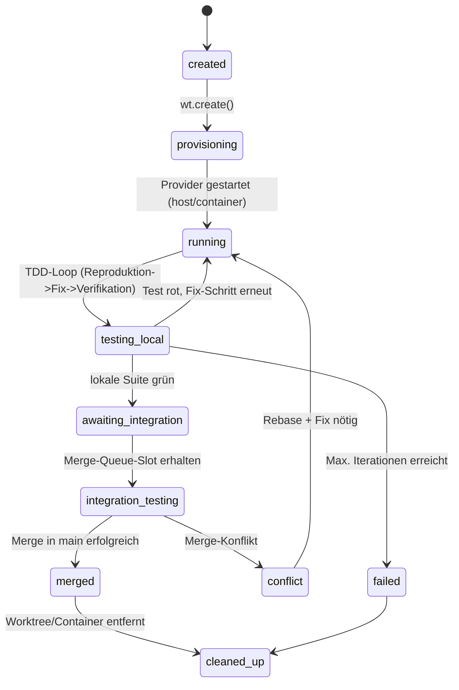
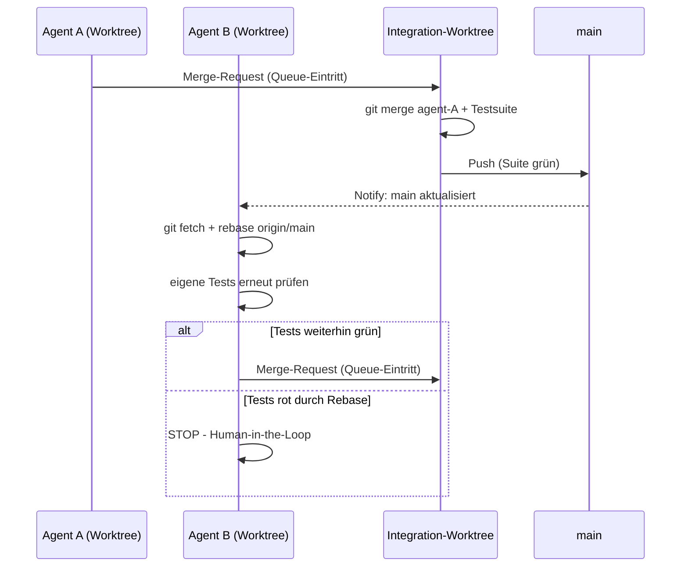

# Hybrid-Spec: Worktree-Only (III) + Worktree-in-Docker (IV)
### Build-Plan für eine schaltbare Agenten-Isolationsschicht auf Sandcastle-Basis

---

## 1. Zielsetzung

Variante III (reine lokale Git-Worktrees) und Variante IV (Worktree + Docker-Mount) sollen **nicht als zwei getrennte Systeme**, sondern als **zwei Modi eines einzigen Providers** existieren. Der Agent (bzw. der Orchestrator, z. B. Antigravity) entscheidet *pro Task*, welcher Modus genutzt wird – nicht der Mensch manuell pro Projekt.

**Leitsatz:** Worktree-Erstellung ist immer Pflicht (physische Isolation). Docker ist optional und wird nur zugeschaltet, wenn ein konkreter Grund vorliegt (OS-Abhängigkeit, DB-Service, Zugriffsbeschränkung, CI-Parität). Damit bleibt der Default-Pfad schnell (kein Container-Overhead), während die Eskalationsstufe jederzeit verfügbar ist.

---

## 2. Architekturprinzip

Strikte Trennung in zwei Schichten, wie im Ausgangsdokument beschrieben:

| Schicht | Verantwortung | Komponente |
|---|---|---|
| **Verwaltung der physischen Umgebung** | Worktree anlegen/löschen, optional Container starten/mounten/stoppen, Git-Snapshot-Mechanik | **Sandcastle** |
| **Intelligenz & Orchestrierung** | Entscheidung *was* getan wird, *welcher Modus* nötig ist, TDD-Loop-Steuerung, Merge-Queue-Logik | **Antigravity / Orchestrator (TS/Fastify)** |

Die Schichten kommunizieren ausschließlich über ein Tool-Interface (`run-agent.ts` als Entrypoint), niemals direkt über Shell-Befehle aus der Orchestrator-Schicht heraus. Das hält die Architektur austauschbar (Sandcastle könnte später durch ein anderes Backend ersetzt werden, ohne dass der Orchestrator-Code sich ändert).

---

## 3. Entscheidungslogik: Host-Worktree vs. Docker-Worktree

Kern der Hybridisierung ist eine deterministische Funktion `chooseMode()`, die **vor** `wt.create()` läuft.

### 3.1 Entscheidungsmatrix

| Kriterium | Host (III) | Docker (IV) |
|---|---|---|
| Reines Sprach-Tooling (npm/pytest/cargo etc. bereits auf Host vorhanden) | ✅ | – |
| Zusätzlicher Service nötig (Postgres, Redis, …) | – | ✅ |
| Linux-spezifische Bibliotheken / anderes OS als Host | – | ✅ |
| Übergeordnete Ordner sollen unsichtbar bleiben (Mandant-Trennung, Secrets) | – | ✅ |
| Spätere Ausführung auf CI-Server (Parität gewünscht) | – | ✅ |
| Sehr viele parallele Agenten (Host-Prozessraum wird eng) | – | ✅ (Container-Pool begrenzbar) |
| Schnelligkeit hat Priorität (Bugfix-Loop, viele Iterationen) | ✅ | – |
| Task explizit als „destruktiv" markiert (z. B. `rm -rf`, Migrationen) | – | ✅ |

### 3.2 Implementierung der Entscheidung

```typescript
// mode-decision.ts
export type AgentMode = "host" | "container";

export interface TaskSpec {
  issueId: string;
  branchName: string;
  /** Harte Vorgabe, überschreibt jede Heuristik */
  forceMode?: AgentMode;
  /** Heuristik-Signale, vom Orchestrator oder aus Repo-Metadaten ermittelt */
  signals?: {
    needsService?: boolean;       // z.B. docker-compose.yml referenziert
    crossPlatformRisk?: boolean;  // z.B. native bindings, OS-spezifische Pfade
    destructive?: boolean;        // Task-Beschreibung enthält rm/migrate/drop
    parallelAgentCount?: number;  // aktuelle Anzahl laufender Host-Agenten
  };
  dockerImage?: string; // nur relevant wenn Mode = container
}

const HOST_PARALLEL_LIMIT = 4; // konfigurierbar, siehe Abschnitt 9

export function chooseMode(spec: TaskSpec): AgentMode {
  if (spec.forceMode) return spec.forceMode;

  const s = spec.signals ?? {};
  if (s.needsService) return "container";
  if (s.crossPlatformRisk) return "container";
  if (s.destructive) return "container";
  if ((s.parallelAgentCount ?? 0) >= HOST_PARALLEL_LIMIT) return "container";

  return "host"; // Default: schnell, kein Overhead
}
```

Die Heuristik-Signale werden im Orchestrator vor dem Aufruf gesetzt (z. B. durch einen kurzen Scan: existiert `docker-compose.yml`? enthält die Task-Beschreibung Schlüsselwörter wie „Migration", „Datenbank", „native"?). Das ist bewusst simpel gehalten – Fehlentscheidungen sind unkritisch, da Docker jederzeit nachträglich erzwungen werden kann (`forceMode`).

---

## 4. Kernkomponenten

### 4.1 Provider-Abstraktion (unverändert zur Vorlage, aber zentralisiert)

```typescript
// provider.ts
import { noSandbox, dockerProvider } from "@ai-hero/sandcastle";
import { AgentMode } from "./mode-decision";

export function getProvider(mode: AgentMode, path: string, dockerImage?: string) {
  return mode === "container"
    ? dockerProvider({ image: dockerImage ?? "my-custom-env" })
    : noSandbox({ cwd: path });
}
```

### 4.2 Branch- und Worktree-Konvention

- Branch-Name: `agent/<issueId>-<kurzslug>` (z. B. `agent/1234-fix-null-pointer`)
- Worktree-Pfad: `./worktrees/<issueId>` (lokal) – unabhängig vom späteren Modus, **immer** ein eigener physischer Ordner pro Agent.
- Ein Worktree wird **nie** wiederverwendet zwischen zwei Tasks, auch nicht im Host-Modus. Das verhindert „Geister-Zustände" aus vorherigen Läufen.

### 4.3 Agent-Registry (Zustandsspeicher)

Da mehrere Agenten parallel laufen, braucht es einen einfachen persistenten Status – kein vollwertiges DB-System nötig, eine JSON-Datei oder SQLite reicht für den MVP, später ggf. Anbindung an Fastify-State:

```typescript
// registry.ts
export type AgentStatus =
  | "created"
  | "provisioning"
  | "running"
  | "testing_local"
  | "awaiting_integration"
  | "integration_testing"
  | "merged"
  | "conflict"
  | "failed"
  | "cleaned_up";

export interface AgentRecord {
  issueId: string;
  branch: string;
  mode: AgentMode;
  worktreePath: string;
  status: AgentStatus;
  createdAt: string;
  lastUpdatedAt: string;
  error?: string;
}
```

---

## 5. Zustandsmodell pro Agent



---

## 6. Ablaufplan – Single Agent (unabhängig vom Modus)

1. **Trigger**: Issue/Task kommt rein (manuell oder via Webhook).
2. **Moduswahl**: `chooseMode(spec)` → `host` oder `container`.
3. **Provisioning**:
   - `wt.create({ branch })` → physischer Worktree-Ordner.
   - Bei `container`: Sandcastle mountet den Worktree-Ordner als Volume in den Docker-Container (Read-Write); der Container sieht *nur* diesen Ordner, nicht den Rest des Host-Dateisystems.
   - Bei `host`: Agent arbeitet direkt im Worktree-Pfad (`noSandbox({ cwd })`).
4. **Skill-Injektion**: TDD-Loop-Skill (`./skills/tdd-loop.md`) wird dem Agenten mitgegeben – die Logik liegt im System-Prompt/Skill, nicht im Backend.
5. **TDD-Loop** (siehe Originaldokument, unverändert):
   - Reproduktion → Fix → Verifikation → Bericht.
   - Exit-Codes der Shell sind die einzige Wahrheitsquelle, nicht die Freitext-Antwort des Modells.
6. **Lokaler Abschluss**: Bei grüner Suite → `git commit` im Worktree, Status → `awaiting_integration`.
7. **Merge-Queue-Eintritt** (Details Abschnitt 7).
8. **Cleanup**: Nach Merge oder endgültigem Fehlschlag → Worktree entfernen, Container stoppen, Registry-Eintrag archivieren.

---

## 7. Ablaufplan – Mehrere Agenten / Merge Queue

Übernommen aus dem „besser Merge Queue"-Konzept der Vorlage, hier als konkreter Prozess:

1. Jeder Agent arbeitet isoliert in seinem eigenen Worktree (Host oder Container) und committet ausschließlich auf seinem eigenen Branch. **Niemals direkter Merge auf `main` durch den Agenten selbst.**
2. Ein **einziger neutraler Integrations-Worktree** (`./worktrees/_integration`) dient als Flaschenhals – immer nur ein Merge-Versuch gleichzeitig, um Race Conditions zu vermeiden.
3. Wenn ein Agent „bereit für Merge" meldet, reiht der Orchestrator ihn in eine FIFO-Queue ein.
4. Für den Agenten an der Spitze der Queue:
   - Integrations-Worktree: `git fetch && git checkout main && git pull`
   - `git merge agent/<issueId>` versuchen.
   - **Erfolg**: vollständige Testsuite im Integrations-Worktree laufen lassen (nicht nur der lokale Test des Agenten – Regressionen anderer Bereiche zählen).
     - Suite grün → Merge nach `main` pushen, Status `merged`, nächster Agent in Queue erhält Signal „main aktualisiert".
     - Suite rot trotz konfliktfreiem Merge → Status `conflict` (logischer Konflikt), Agent muss nachbessern.
   - **Fehlschlag (Git-Konflikt)**: Status `conflict`, Integrations-Worktree wird zurückgesetzt (`git merge --abort`), Agent erhält Auftrag: `git fetch origin && git rebase origin/main` im eigenen Worktree, danach erneuter Eintritt in die Queue.
5. **Human-in-the-Loop-Schutz**: Wenn ein Agent nach Rebase erkennt, dass seine *eigenen, vorher grünen* Tests jetzt rot sind (verursacht durch zwischenzeitlich gemergte Änderungen eines anderen Agenten), stoppt er automatisch und meldet an den Menschen: „Konflikt durch Agent X erkannt, benötige Entscheidung." Es wird **nicht** automatisch weiterprobiert über ein konfigurierbares Iterationslimit hinaus.



---

## 8. Hybrid `run-agent.ts` (Referenzimplementierung)

```typescript
import { wt } from "@ai-hero/sandcastle";
import { chooseMode, TaskSpec } from "./mode-decision";
import { getProvider } from "./provider";
import { AgentRecord, updateStatus } from "./registry";

export async function runAgent(spec: TaskSpec) {
  const mode = chooseMode(spec);
  const worktree = await wt.create({ branch: spec.branchName });

  const record: AgentRecord = {
    issueId: spec.issueId,
    branch: spec.branchName,
    mode,
    worktreePath: worktree.path,
    status: "provisioning",
    createdAt: new Date().toISOString(),
    lastUpdatedAt: new Date().toISOString(),
  };
  await updateStatus(record, "provisioning");

  try {
    const provider = getProvider(mode, worktree.path, spec.dockerImage);

    await updateStatus(record, "running");
    await wt.run({
      provider,
      prompt: `Fix issue ${spec.issueId}`,
      skills: ["./skills/tdd-loop.md"],
    });

    await updateStatus(record, "awaiting_integration");
    console.log(`Agent ${spec.issueId} (${mode}): lokale Tests grün, Queue-Eintritt.`);
  } catch (e) {
    await updateStatus(record, "failed", String(e));
    console.error(`Agent ${spec.issueId} fehlgeschlagen (${mode}):`, e);
  } finally {
    // Cleanup erfolgt erst NACH Merge-Queue-Entscheidung, siehe Abschnitt 9 –
    // hier nur Cleanup bei hartem Fehlschlag vor Integrationsphase:
    if (record.status === "failed") {
      await wt.delete(worktree);
      await updateStatus(record, "cleaned_up");
    }
  }
}
```

### Tool-Registrierung in Antigravity (`tools.ts`)

```typescript
import { execSync } from "child_process";

export const tools = [
  {
    name: "run-agent",
    description: "Startet den Sandcastle-Agenten für ein Issue (Modus wird automatisch gewählt)",
    run: async (args: { issueId: string; forceMode?: "host" | "container" }) => {
      const flag = args.forceMode ? `--mode=${args.forceMode}` : "";
      return execSync(`npx ts-node run-agent.ts ${args.issueId} ${flag}`).toString();
    },
  },
  {
    name: "create-snapshot",
    description: "Erstellt einen Git-Commit/Snapshot im aktuellen Agenten-Worktree",
    run: async (args: { issueId: string; message: string }) => {
      return execSync(`npx ts-node snapshot.ts ${args.issueId} "${args.message}"`).toString();
    },
  },
];
```

---

## 9. Cleanup- und Ressourcenstrategie

| Ressource | Strategie |
|---|---|
| Worktree-Ordner | Entfernen sofort nach `merged` oder `failed` (Status `cleaned_up`). Bei `conflict` bleibt der Worktree erhalten, bis Mensch entscheidet. |
| Docker-Container | Stop + Remove direkt nach Testlauf im Container-Modus (kein Dauerbetrieb); bei wiederholten Iterationen im selben Task kann der Container kurzfristig „warm" gehalten werden, um Image-Pull/Start-Overhead zu sparen. |
| Branches | Gemergte Branches nach erfolgreichem Merge löschen (lokal + remote), nicht-gemergte (failed/conflict) für Post-Mortem-Analyse mind. 7 Tage behalten, dann Cron-Cleanup. |
| Disk-Verbrauch | Worktrees teilen sich das `.git`-Objektverzeichnis (kein vollständiger Klon) – Verbrauch bleibt gering auch bei vielen parallelen Worktrees. Docker-Images werden zentral gecacht, nicht pro Agent neu gebaut. |
| Parallelitätsgrenze | `HOST_PARALLEL_LIMIT` (Abschnitt 3) verhindert, dass zu viele Host-Prozesse gleichzeitig laufen; Container-Pool über eigenes Limit (z. B. `DOCKER_PARALLEL_LIMIT`), getrennt konfigurierbar, da Container mehr Host-Ressourcen (RAM/CPU) binden. |
| Stale-Worktree-Erkennung | Periodischer Job (z. B. stündlich): Worktrees ohne Statusänderung > X Minuten und ohne aktiven Prozess → als „verwaist" markieren, Mensch benachrichtigen statt automatisch löschen. |

---

## 10. Monitoring & Fehlerfälle

- **Determinismus zuerst**: Jede Statusänderung basiert auf Exit-Codes oder Git-Ergebnissen, niemals auf der Freitext-Interpretation des Modell-Outputs (gilt für TDD-Loop wie für Merge-Versuche).
- **Logging pro Agent**: `stdout`/`stderr` des jeweiligen Provider-Laufs wird mit `issueId` + `mode` getaggt persistiert (Datei oder Log-Aggregator), damit Host- und Container-Läufe im selben Format auswertbar sind.
- **Iterationslimit im TDD-Loop**: harte Obergrenze (z. B. 5 Fix-Versuche), danach automatischer Wechsel in `failed` statt endloser Schleife.
- **Eskalationspfad**: `conflict`- und `failed`-Status erzeugen eine Benachrichtigung an den Menschen (z. B. über das Orchestrator-Interface), niemals stilles Verwerfen.

---

## 11. Build-Phasen (Roadmap)

| Phase | Inhalt | Ergebnis |
|---|---|---|
| **0 – Setup** | Sandcastle-Paket einbinden, Basis-Repo mit `worktrees/`-Konvention, Registry-Datei | Lauffähiges Grundgerüst |
| **1 – Host-MVP (III)** | `run-agent.ts` nur mit `noSandbox()`, ein Agent, ein Worktree, manueller Trigger | Einzelner Bugfix-Loop funktioniert lokal |
| **2 – TDD-Loop-Skill** | `skills/tdd-loop.md` ausgliedern, Exit-Code-basierte Verifikation | Deterministischer Test-Fix-Zyklus |
| **3 – Docker-Provider (IV)** | `dockerProvider()` ergänzen, `--mode`-Flag, Volume-Mount-Konfiguration | Modus pro Task wählbar (manuell) |
| **4 – Moduswahl-Heuristik** | `chooseMode()` mit Signalen aus Repo-Scan/Task-Text | Automatische statt manuelle Eskalation |
| **5 – Parallel-Agenten** | Mehrere `wt.create()`-Aufrufe gleichzeitig, Registry erweitert | Mehrere Agenten gleichzeitig isoliert |
| **6 – Merge Queue** | Neutraler Integrations-Worktree, FIFO-Queue, Human-in-the-Loop-Trigger | Sichere Integration ohne direkten Main-Zugriff der Agenten |
| **7 – Cleanup-Automatisierung** | Cron-Jobs für Worktree-/Branch-/Container-Hygiene | Kein manuelles Aufräumen nötig |
| **8 – Observability** | Strukturiertes Logging, Statusdashboard, Benachrichtigungen | Nachvollziehbarkeit über alle Agenten |

---

## 12. Offene Punkte / Risiken

- **Logische Konflikte ohne Git-Konflikt**: Ein Merge kann textuell konfliktfrei sein, aber die Testsuite trotzdem brechen (z. B. zwei Agenten ändern dieselbe Funktion semantisch widersprüchlich). Die Spec deckt das über den Pflicht-Testlauf im Integrations-Worktree ab – wichtig ist, dass dieser Schritt **nicht** übersprungen wird, auch wenn der Merge selbst „SUCCESS" meldet.
- **Container-Start-Latenz**: Bei sehr kurzen Fix-Iterationen kann der Docker-Start-Overhead den Vorteil der Isolation zeitlich auffressen. Ggf. Container-Wiederverwendung innerhalb eines Tasks (Abschnitt 9) statt Neustart pro Iteration.
- **Skalierung auf Monorepo**: Diese Spec geht von Vollzugriff jedes Worktrees auf das gesamte Repo aus. Für sehr große Monorepos ist `sparse-checkout` pro Worktree ein sinnvoller nächster Schritt, ist hier aber bewusst nicht Teil des Scopes (separates Vorhaben).
- **GitHub-Anbindung**: Die Merge-Queue ist hier rein lokal/git-basiert beschrieben. Eine spätere Anbindung an GitHub Actions/Merge Queue oder eine GitHub App für PR-Erstellung statt direktem `main`-Push ist eine naheliegende Erweiterung, sprengt aber den Rahmen dieser Hybrid-Spec.
