# K-Accumulator — Notizen

Zusammenfassung einer Session über den Fancyyyyy K-Accumulator (Entwicklung: fancyyyyy × grrrwaaa / Graham Wakefield). Grundlage: das Perfect-Circuit-Interview mit Tristan Clutterbuck und Graham Wakefield sowie der offizielle Quick-Start-Guide.

> Die Diagramme sind als Mermaid eingebettet. Sie rendern in GitHub, Obsidian, GitLab und den meisten Markdown-Editoren mit Mermaid-Unterstützung. Die Spektren nutzen `xychart-beta` und brauchen Mermaid ab Version 10.3.

---

## 1. Die Ausgangsfrage: Sind die acht Nodes Presets?

Im Interview heißt es sinngemäß, die acht Positionen am Ring seien keine Presets und keine getrennten Algorithmen, sondern Extrempunkte auf einem durchgehenden Parameterraum — und der Raum dazwischen sei genauso wichtig wie die Punkte selbst.

**Preset-Morphing wäre:** acht gespeicherte Parametersätze, zwischen denen linear interpoliert wird. Der Zwischenraum entsteht erst als Nebenprodukt der Interpolation.

**Was hier gemeint ist:** eine von vornherein durchgehende Struktur, auf der die acht Nodes lediglich markierte Haltepunkte sind. Analogie: Farbton als Winkel auf einem Farbkreis (0°–360°) — "Rot" und "Blau" sind Positionen auf einer ohnehin stetigen Skala, keine Endpunkte einer Berechnung.

**Berechtigter Einwand:** Technisch laufen beide Beschreibungen oft aufs Gleiche hinaus. Der Text betont aber, dass sich nicht nur Parameterwerte ändern, sondern auch das *Routing* — welche Aspekte des Algorithmus mit welcher Gewichtung und Filterung angesteuert werden. Ob das klanglich einen Unterschied zu gutem Preset-Crossfading macht, lässt sich von außen nicht abschließend beurteilen; es ist zu einem Teil auch Herstellersprache.

---

## 2. Der gemeinsame Kern

Das Manual formuliert es direkt: jeder Modus ist aus **denselben vier Kern-Sinuswellen** gebaut. Das sind zwei Oszillatoren (Haupt-OSC und Mod) mit jeweils einem Sinus-/Cosinus-Paar.

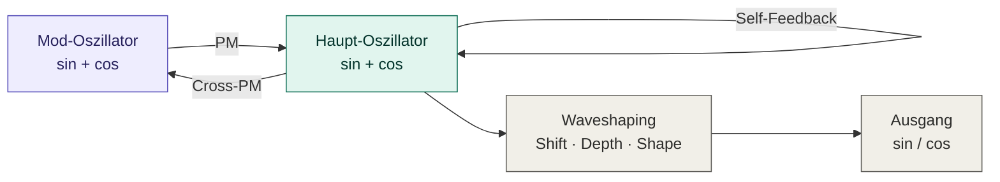
```mermaid
flowchart LR
    MOD["Mod-Oszillator<br/>sin + cos"]
    OSC["Haupt-Oszillator<br/>sin + cos"]
    WS["Waveshaping<br/>Shift · Depth · Shape"]
    OUT["Ausgang<br/>sin / cos"]

    MOD -- "PM" --> OSC
    OSC -- "Cross-PM" --> MOD
    OSC -- "Self-Feedback" --> OSC
    OSC --> WS --> OUT

    classDef mod fill:#EEEDFE,stroke:#534AB7,color:#26215C
    classDef osc fill:#E1F5EE,stroke:#0F6E56,color:#04342C
    classDef neutral fill:#F1EFE8,stroke:#5F5E5A,color:#2C2C2A
    class MOD mod
    class OSC osc
    class WS,OUT neutral
```

Zwischen den beiden Oszillatoren existieren drei Modulationspfade:

| Farbe (LED) | Pfad | Bedeutung |
|---|---|---|
| Grün | OSC → OSC | Self-Feedback-Phasenmodulation, kein Mod beteiligt |
| Gelb | Mod → OSC | Phasenmodulation vom Mod-Oszillator |
| Rot | OSC ↔ Mod | Cross-Phasenmodulation, gegenseitige Rückkopplung |

Der Morph-Encoder verändert also nicht den Bauplan, sondern die Gewichtung dieser drei Pfade — plus die Frage, welcher Regler welchen Teilaspekt bedient.

---

## 3. Der Morph-Ring

Acht Positionen, zwei Pole, zwei Wege dazwischen. Die Farben entsprechen den LEDs am Panel.

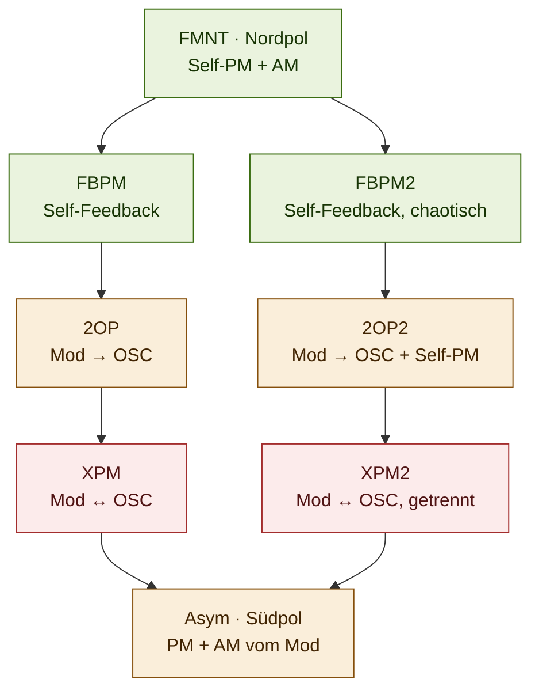
```mermaid
flowchart TB
    FMNT["FMNT · Nordpol<br/>Self-PM + AM"]
    FBPM["FBPM<br/>Self-Feedback"]
    OPL["2OP<br/>Mod → OSC"]
    XPM["XPM<br/>Mod ↔ OSC"]
    ASYM["Asym · Südpol<br/>PM + AM vom Mod"]
    XPM2["XPM2<br/>Mod ↔ OSC, getrennt"]
    OPR["2OP2<br/>Mod → OSC + Self-PM"]
    FBPM2["FBPM2<br/>Self-Feedback, chaotisch"]

    FMNT --> FBPM --> OPL --> XPM --> ASYM
    FMNT --> FBPM2 --> OPR --> XPM2 --> ASYM

    classDef g fill:#EAF3DE,stroke:#3B6D11,color:#173404
    classDef y fill:#FAEEDA,stroke:#854F0B,color:#412402
    classDef r fill:#FCEBEB,stroke:#A32D2D,color:#501313
    class FMNT,FBPM,FBPM2 g
    class OPL,OPR,ASYM y
    class XPM,XPM2 r
```

Linker Ast: **FBPM → 2OP → XPM.** Die Reglerrollen bleiben über den ganzen Weg konstant: Shift blendet Harmonische, Shape faltet, Depth kombiniert PM-Index und Damping. Der Morph wird als reine Zunahme an Komplexität erlebt.

Rechter Ast: **FBPM2 → 2OP2 → XPM2.** Dieselben Kopplungsstufen, aber die Bestandteile werden auf getrennte Regler verteilt. Priorität liegt auf nichtlinearer Dynamik statt auf Vorhersehbarkeit.

Die Pole teilen einen gemeinsamen Charakter: beide kombinieren Amplitudenmodulation mit Raised-Cosine-Wellenformen und Phasenmodulation, was saubere, formantartige Spektren ergibt.

### Die acht Modi im Detail

| Modus | LED | Aktive Pfade | Reglerbelegung |
|---|---|---|---|
| **FMNT** (Pol) | grün | Self-PM + AM | Depth = Bandbreite via Self-Raised-Cosine-AM · Shift = Harmonische blenden · Shape = Self-Feedback-Damping |
| **FBPM** | grün | Self-PM | Depth = Feedback-Menge · Shift = Harmonische blenden · Shape = Wavefolding |
| **2OP** | gelb | Mod → OSC | Depth = PM-Index + Damping · Shift = Harmonische blenden · Shape = Wavefolding |
| **XPM** | rot | Mod ↔ OSC | Depth = PM + Damping + Cross-Feedback · Shift = Harmonische blenden · Shape = Wavefolding |
| **Asym** (Pol) | gelb | Mod → OSC (PM + AM) | Depth = PM- und AM-Tiefe · Shift = niedrige Harmonische blenden · Shape = Wavefolding niedriger Ordnung |
| **FBPM2** | grün | Self-PM | Depth = Feedback · Shift = Damping-Filter · Shape = Wavefolding |
| **2OP2** | gelb | Mod → OSC **+** Self-PM | Depth = PM vom Mod · Shift = Self-PM mit Damping · Shape = Wavefolding |
| **XPM2** | rot | Mod ↔ OSC | Depth = PM-Index · Shift = PM-Damping-Filter · Shape = XPM-Index + Damping-Filter |

Die Paare FBPM/FBPM2 und XPM/XPM2 sind topologisch gleich — der Unterschied liegt allein in der Reglerverteilung. Die einzige echte Abweichung ist **2OP2**, wo Mod-PM und Self-PM gleichzeitig aktiv sind.

### Schaltung pro Modus

Durchgezogene Kanten sind aktiv, gestrichelte vorhanden aber unbelegt.

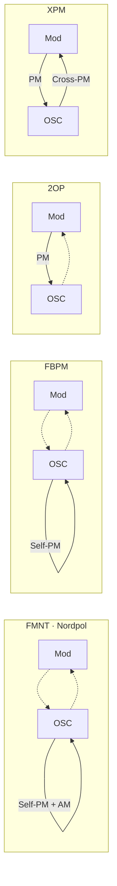
```mermaid
flowchart LR
    subgraph FMNT_G["FMNT · Nordpol"]
        M1["Mod"] -.-> O1["OSC"]
        O1 -.-> M1
        O1 -- "Self-PM + AM" --> O1
    end
    subgraph FBPM_G["FBPM"]
        M2["Mod"] -.-> O2["OSC"]
        O2 -.-> M2
        O2 -- "Self-PM" --> O2
    end
    subgraph OPL_G["2OP"]
        M3["Mod"] -- "PM" --> O3["OSC"]
        O3 -.-> M3
    end
    subgraph XPM_G["XPM"]
        M4["Mod"] -- "PM" --> O4["OSC"]
        O4 -- "Cross-PM" --> M4
    end
```

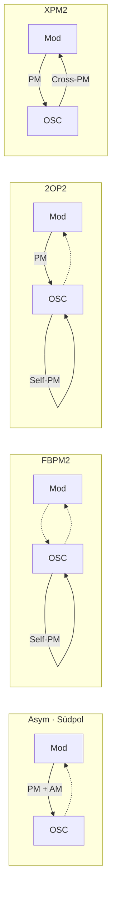
```mermaid
flowchart LR
    subgraph ASYM_G["Asym · Südpol"]
        M5["Mod"] -- "PM + AM" --> O5["OSC"]
        O5 -.-> M5
    end
    subgraph FBPM2_G["FBPM2"]
        M6["Mod"] -.-> O6["OSC"]
        O6 -.-> M6
        O6 -- "Self-PM" --> O6
    end
    subgraph OPR_G["2OP2"]
        M7["Mod"] -- "PM" --> O7["OSC"]
        O7 -.-> M7
        O7 -- "Self-PM" --> O7
    end
    subgraph XPM2_G["XPM2"]
        M8["Mod"] -- "PM" --> O8["OSC"]
        O8 -- "Cross-PM" --> M8
    end
```

---

## 4. Die Synthesetechniken als Spektren

Alle Techniken beschreiben letztlich, was mit der harmonischen Energieverteilung passiert. Die folgenden Diagramme zeigen jeweils drei Zustände desselben Reglers.

**Zur Lesart:** Die x-Achse ist die Harmonischenzahl in Halbschritten (1 = Grundton, 2 = Oktave, …), damit auch Partialtöne zwischen dem ganzzahligen Raster sichtbar werden. Die Werte sind auf das jeweilige Maximum normalisiert. Es handelt sich um schematische Modelle des Prinzips, nicht um gemessene Spektren des Geräts.

### Harmonic wavefolding

Die Energie verteilt sich monoton nach oben: kein Peak, keine Lücken, nur ein länger werdender Schwanz.

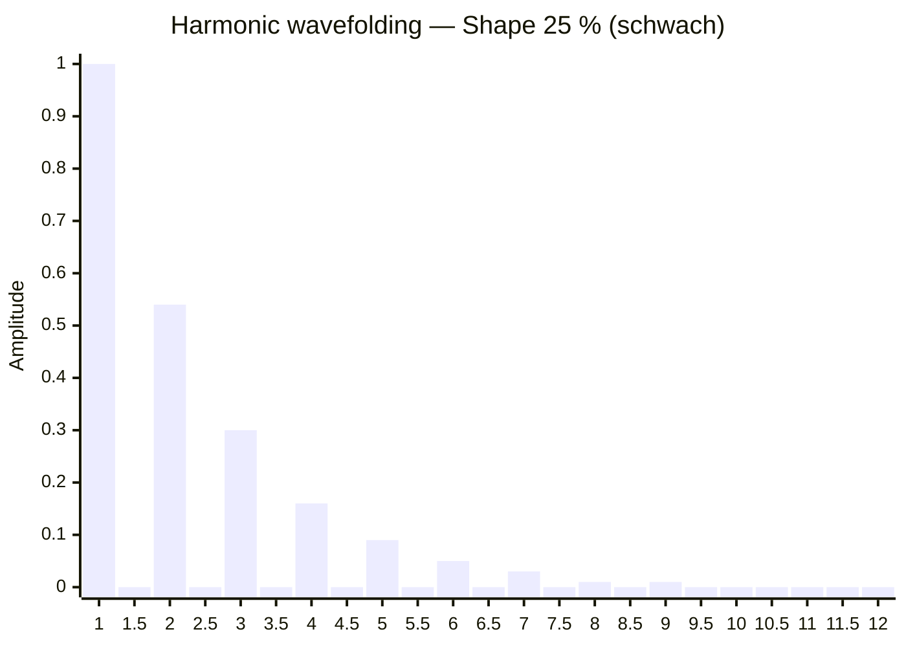
```mermaid
xychart-beta
    title "Harmonic wavefolding — Shape 25 % (schwach)"
    x-axis ["1", "1.5", "2", "2.5", "3", "3.5", "4", "4.5", "5", "5.5", "6", "6.5", "7", "7.5", "8", "8.5", "9", "9.5", "10", "10.5", "11", "11.5", "12"]
    y-axis "Amplitude" 0 --> 1
    bar [1.0, 0.0, 0.54, 0.0, 0.3, 0.0, 0.16, 0.0, 0.09, 0.0, 0.05, 0.0, 0.03, 0.0, 0.01, 0.0, 0.01, 0.0, 0.0, 0.0, 0.0, 0.0, 0.0]
```

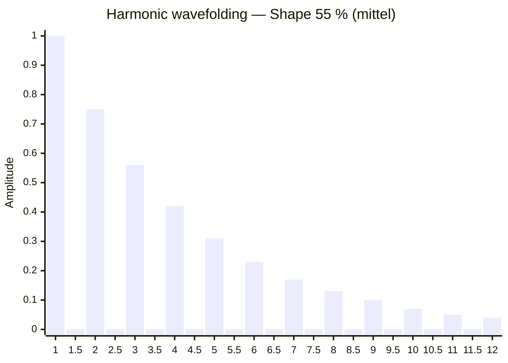
```mermaid
xychart-beta
    title "Harmonic wavefolding — Shape 55 % (mittel)"
    x-axis ["1", "1.5", "2", "2.5", "3", "3.5", "4", "4.5", "5", "5.5", "6", "6.5", "7", "7.5", "8", "8.5", "9", "9.5", "10", "10.5", "11", "11.5", "12"]
    y-axis "Amplitude" 0 --> 1
    bar [1.0, 0.0, 0.75, 0.0, 0.56, 0.0, 0.42, 0.0, 0.31, 0.0, 0.23, 0.0, 0.17, 0.0, 0.13, 0.0, 0.1, 0.0, 0.07, 0.0, 0.05, 0.0, 0.04]
```

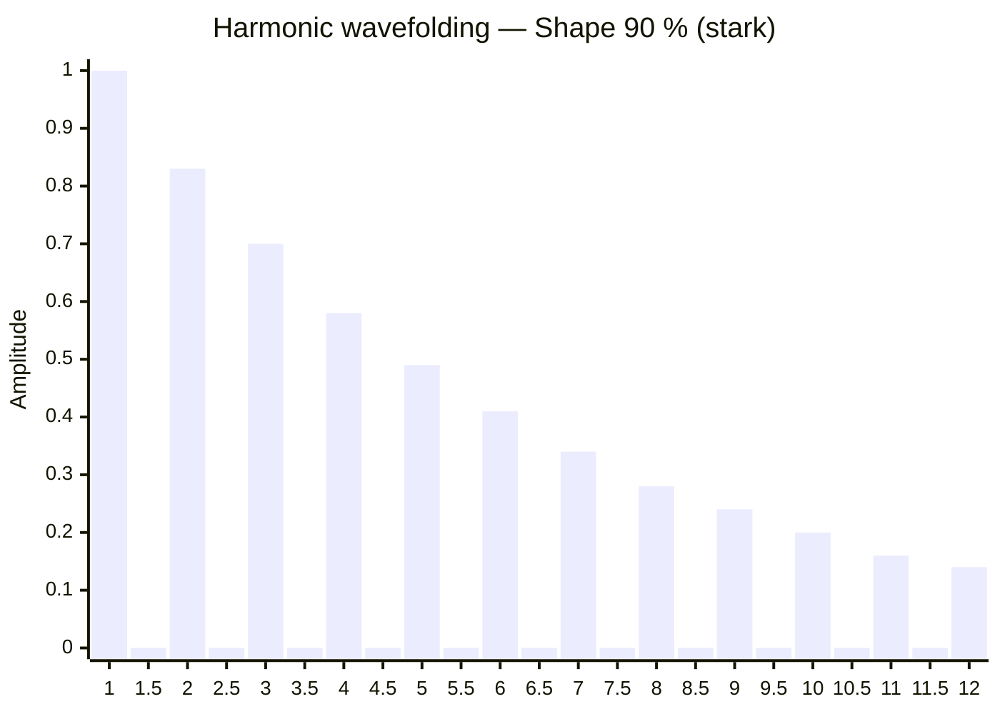
```mermaid
xychart-beta
    title "Harmonic wavefolding — Shape 90 % (stark)"
    x-axis ["1", "1.5", "2", "2.5", "3", "3.5", "4", "4.5", "5", "5.5", "6", "6.5", "7", "7.5", "8", "8.5", "9", "9.5", "10", "10.5", "11", "11.5", "12"]
    y-axis "Amplitude" 0 --> 1
    bar [1.0, 0.0, 0.83, 0.0, 0.7, 0.0, 0.58, 0.0, 0.49, 0.0, 0.41, 0.0, 0.34, 0.0, 0.28, 0.0, 0.24, 0.0, 0.2, 0.0, 0.16, 0.0, 0.14]
```

### Blended harmonic frequency shifting

Der Grundton wandert von h1 nach h2 — bei mittlerer Stellung existieren beide Lagen gleichzeitig.

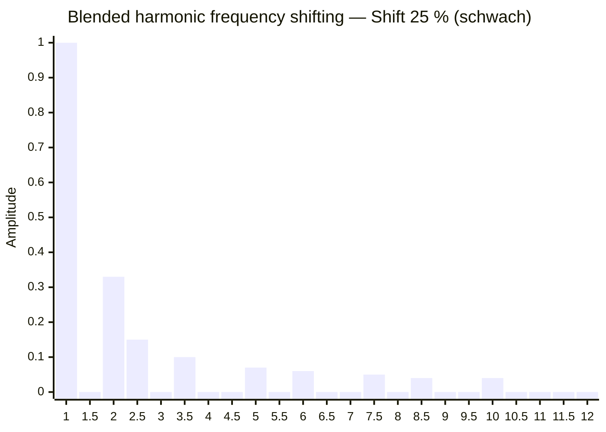
```mermaid
xychart-beta
    title "Blended harmonic frequency shifting — Shift 25 % (schwach)"
    x-axis ["1", "1.5", "2", "2.5", "3", "3.5", "4", "4.5", "5", "5.5", "6", "6.5", "7", "7.5", "8", "8.5", "9", "9.5", "10", "10.5", "11", "11.5", "12"]
    y-axis "Amplitude" 0 --> 1
    bar [1.0, 0.0, 0.33, 0.15, 0.0, 0.1, 0.0, 0.0, 0.07, 0.0, 0.06, 0.0, 0.0, 0.05, 0.0, 0.04, 0.0, 0.0, 0.04, 0.0, 0.0, 0.0, 0.0]
```

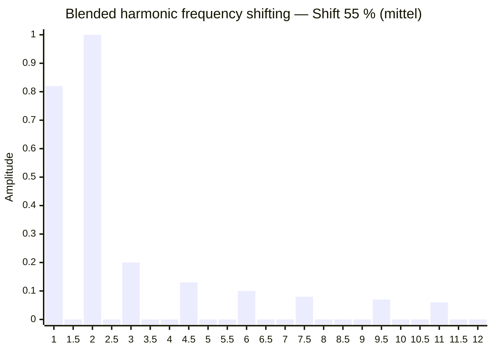
```mermaid
xychart-beta
    title "Blended harmonic frequency shifting — Shift 55 % (mittel)"
    x-axis ["1", "1.5", "2", "2.5", "3", "3.5", "4", "4.5", "5", "5.5", "6", "6.5", "7", "7.5", "8", "8.5", "9", "9.5", "10", "10.5", "11", "11.5", "12"]
    y-axis "Amplitude" 0 --> 1
    bar [0.82, 0.0, 1.0, 0.0, 0.2, 0.0, 0.0, 0.13, 0.0, 0.0, 0.1, 0.0, 0.0, 0.08, 0.0, 0.0, 0.0, 0.07, 0.0, 0.0, 0.06, 0.0, 0.0]
```

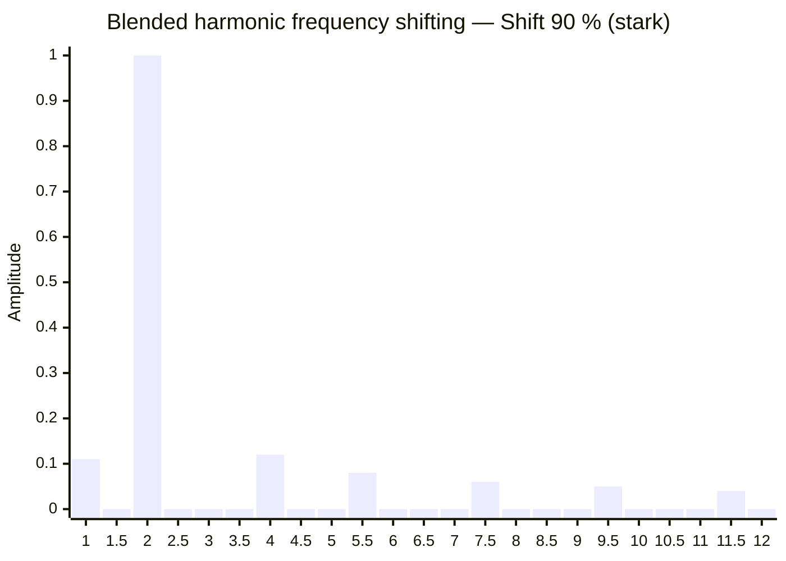
```mermaid
xychart-beta
    title "Blended harmonic frequency shifting — Shift 90 % (stark)"
    x-axis ["1", "1.5", "2", "2.5", "3", "3.5", "4", "4.5", "5", "5.5", "6", "6.5", "7", "7.5", "8", "8.5", "9", "9.5", "10", "10.5", "11", "11.5", "12"]
    y-axis "Amplitude" 0 --> 1
    bar [0.11, 0.0, 1.0, 0.0, 0.0, 0.0, 0.12, 0.0, 0.0, 0.08, 0.0, 0.0, 0.0, 0.06, 0.0, 0.0, 0.0, 0.05, 0.0, 0.0, 0.0, 0.04, 0.0]
```

### Harmonic stretching

Der Grundton bei 1 bleibt stehen, die Obertöne driften nach rechts vom ganzzahligen Raster weg.

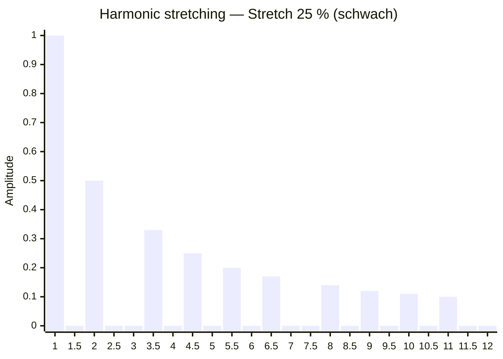
```mermaid
xychart-beta
    title "Harmonic stretching — Stretch 25 % (schwach)"
    x-axis ["1", "1.5", "2", "2.5", "3", "3.5", "4", "4.5", "5", "5.5", "6", "6.5", "7", "7.5", "8", "8.5", "9", "9.5", "10", "10.5", "11", "11.5", "12"]
    y-axis "Amplitude" 0 --> 1
    bar [1.0, 0.0, 0.5, 0.0, 0.0, 0.33, 0.0, 0.25, 0.0, 0.2, 0.0, 0.17, 0.0, 0.0, 0.14, 0.0, 0.12, 0.0, 0.11, 0.0, 0.1, 0.0, 0.0]
```

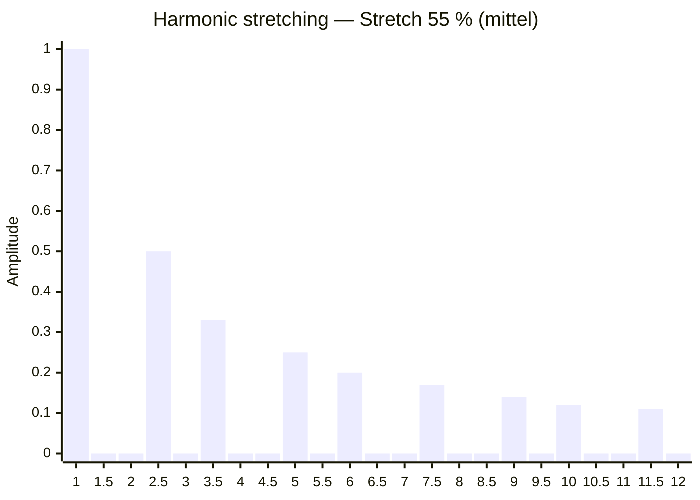
```mermaid
xychart-beta
    title "Harmonic stretching — Stretch 55 % (mittel)"
    x-axis ["1", "1.5", "2", "2.5", "3", "3.5", "4", "4.5", "5", "5.5", "6", "6.5", "7", "7.5", "8", "8.5", "9", "9.5", "10", "10.5", "11", "11.5", "12"]
    y-axis "Amplitude" 0 --> 1
    bar [1.0, 0.0, 0.0, 0.5, 0.0, 0.33, 0.0, 0.0, 0.25, 0.0, 0.2, 0.0, 0.0, 0.17, 0.0, 0.0, 0.14, 0.0, 0.12, 0.0, 0.0, 0.11, 0.0]
```

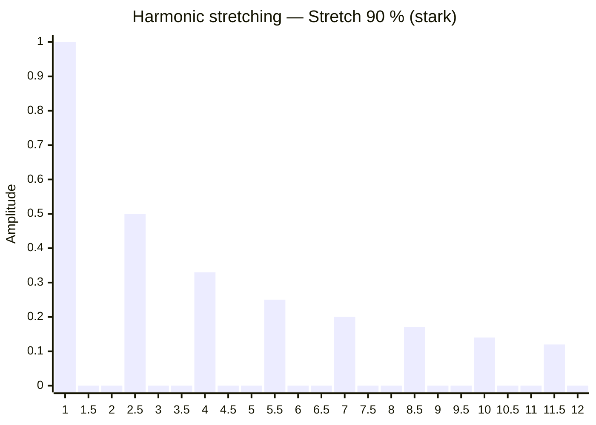
```mermaid
xychart-beta
    title "Harmonic stretching — Stretch 90 % (stark)"
    x-axis ["1", "1.5", "2", "2.5", "3", "3.5", "4", "4.5", "5", "5.5", "6", "6.5", "7", "7.5", "8", "8.5", "9", "9.5", "10", "10.5", "11", "11.5", "12"]
    y-axis "Amplitude" 0 --> 1
    bar [1.0, 0.0, 0.0, 0.5, 0.0, 0.0, 0.33, 0.0, 0.0, 0.25, 0.0, 0.0, 0.2, 0.0, 0.0, 0.17, 0.0, 0.0, 0.14, 0.0, 0.0, 0.12, 0.0]
```

### Damped self feedback

Aus dem reinen Sinus wird schrittweise ein Sägezahnspektrum — allharmonisch, ohne Lücken.

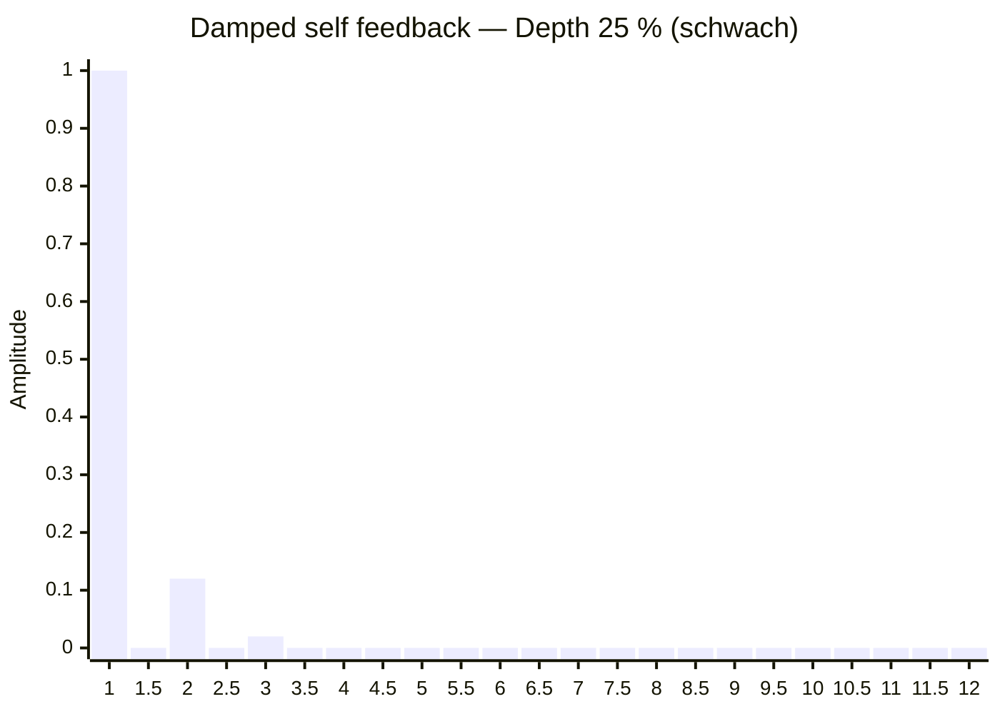
```mermaid
xychart-beta
    title "Damped self feedback — Depth 25 % (schwach)"
    x-axis ["1", "1.5", "2", "2.5", "3", "3.5", "4", "4.5", "5", "5.5", "6", "6.5", "7", "7.5", "8", "8.5", "9", "9.5", "10", "10.5", "11", "11.5", "12"]
    y-axis "Amplitude" 0 --> 1
    bar [1.0, 0.0, 0.12, 0.0, 0.02, 0.0, 0.0, 0.0, 0.0, 0.0, 0.0, 0.0, 0.0, 0.0, 0.0, 0.0, 0.0, 0.0, 0.0, 0.0, 0.0, 0.0, 0.0]
```

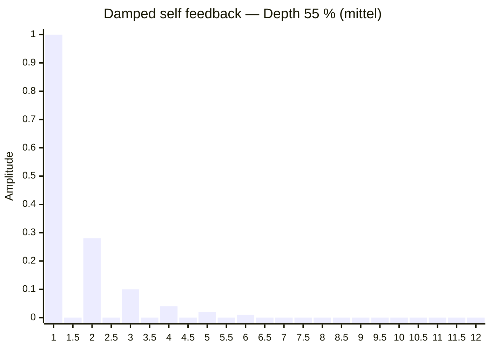
```mermaid
xychart-beta
    title "Damped self feedback — Depth 55 % (mittel)"
    x-axis ["1", "1.5", "2", "2.5", "3", "3.5", "4", "4.5", "5", "5.5", "6", "6.5", "7", "7.5", "8", "8.5", "9", "9.5", "10", "10.5", "11", "11.5", "12"]
    y-axis "Amplitude" 0 --> 1
    bar [1.0, 0.0, 0.28, 0.0, 0.1, 0.0, 0.04, 0.0, 0.02, 0.0, 0.01, 0.0, 0.0, 0.0, 0.0, 0.0, 0.0, 0.0, 0.0, 0.0, 0.0, 0.0, 0.0]
```

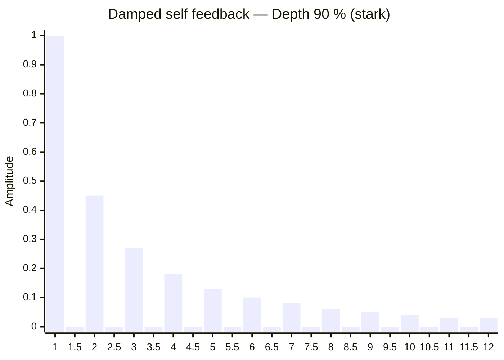
```mermaid
xychart-beta
    title "Damped self feedback — Depth 90 % (stark)"
    x-axis ["1", "1.5", "2", "2.5", "3", "3.5", "4", "4.5", "5", "5.5", "6", "6.5", "7", "7.5", "8", "8.5", "9", "9.5", "10", "10.5", "11", "11.5", "12"]
    y-axis "Amplitude" 0 --> 1
    bar [1.0, 0.0, 0.45, 0.0, 0.27, 0.0, 0.18, 0.0, 0.13, 0.0, 0.1, 0.0, 0.08, 0.0, 0.06, 0.0, 0.05, 0.0, 0.04, 0.0, 0.03, 0.0, 0.03]
```

### Asymmetric phase modulation

Nur die oberen Seitenbänder bleiben; die unteren sind entfernt. Der Träger liegt bei h6.

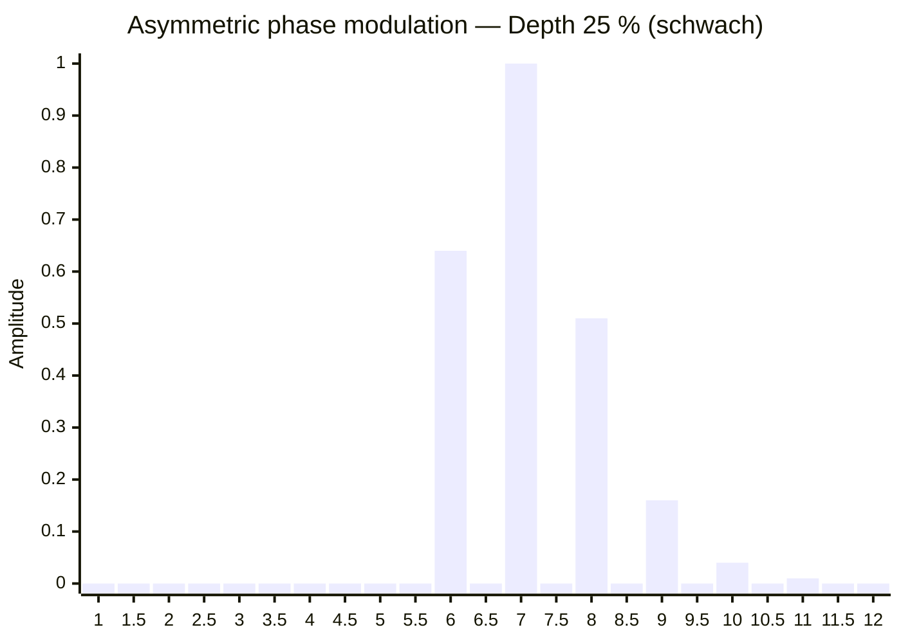
```mermaid
xychart-beta
    title "Asymmetric phase modulation — Depth 25 % (schwach)"
    x-axis ["1", "1.5", "2", "2.5", "3", "3.5", "4", "4.5", "5", "5.5", "6", "6.5", "7", "7.5", "8", "8.5", "9", "9.5", "10", "10.5", "11", "11.5", "12"]
    y-axis "Amplitude" 0 --> 1
    bar [0.0, 0.0, 0.0, 0.0, 0.0, 0.0, 0.0, 0.0, 0.0, 0.0, 0.64, 0.0, 1.0, 0.0, 0.51, 0.0, 0.16, 0.0, 0.04, 0.0, 0.01, 0.0, 0.0]
```

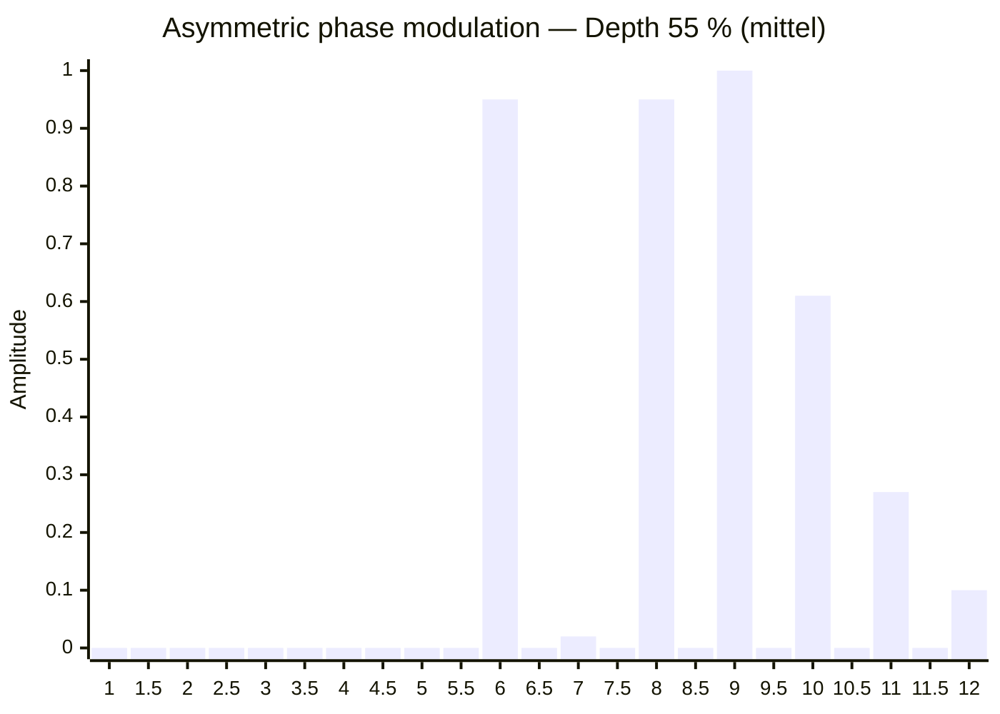
```mermaid
xychart-beta
    title "Asymmetric phase modulation — Depth 55 % (mittel)"
    x-axis ["1", "1.5", "2", "2.5", "3", "3.5", "4", "4.5", "5", "5.5", "6", "6.5", "7", "7.5", "8", "8.5", "9", "9.5", "10", "10.5", "11", "11.5", "12"]
    y-axis "Amplitude" 0 --> 1
    bar [0.0, 0.0, 0.0, 0.0, 0.0, 0.0, 0.0, 0.0, 0.0, 0.0, 0.95, 0.0, 0.02, 0.0, 0.95, 0.0, 1.0, 0.0, 0.61, 0.0, 0.27, 0.0, 0.1]
```

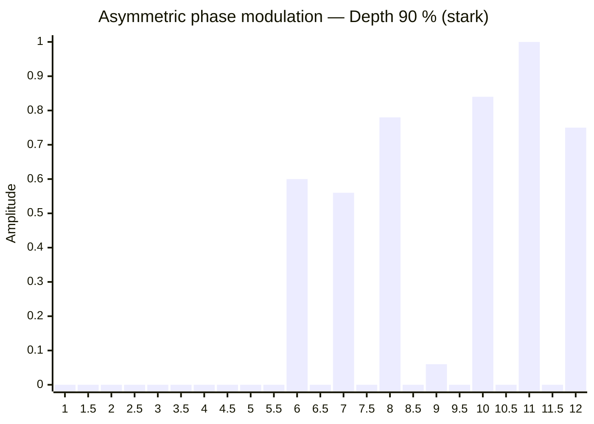
```mermaid
xychart-beta
    title "Asymmetric phase modulation — Depth 90 % (stark)"
    x-axis ["1", "1.5", "2", "2.5", "3", "3.5", "4", "4.5", "5", "5.5", "6", "6.5", "7", "7.5", "8", "8.5", "9", "9.5", "10", "10.5", "11", "11.5", "12"]
    y-axis "Amplitude" 0 --> 1
    bar [0.0, 0.0, 0.0, 0.0, 0.0, 0.0, 0.0, 0.0, 0.0, 0.0, 0.6, 0.0, 0.56, 0.0, 0.78, 0.0, 0.06, 0.0, 0.84, 0.0, 1.0, 0.0, 0.75]
```

### Damped cross phase modulation

Die Partialtöne verlassen das harmonische Raster, ihre Lage wird zunehmend unvorhersehbar.

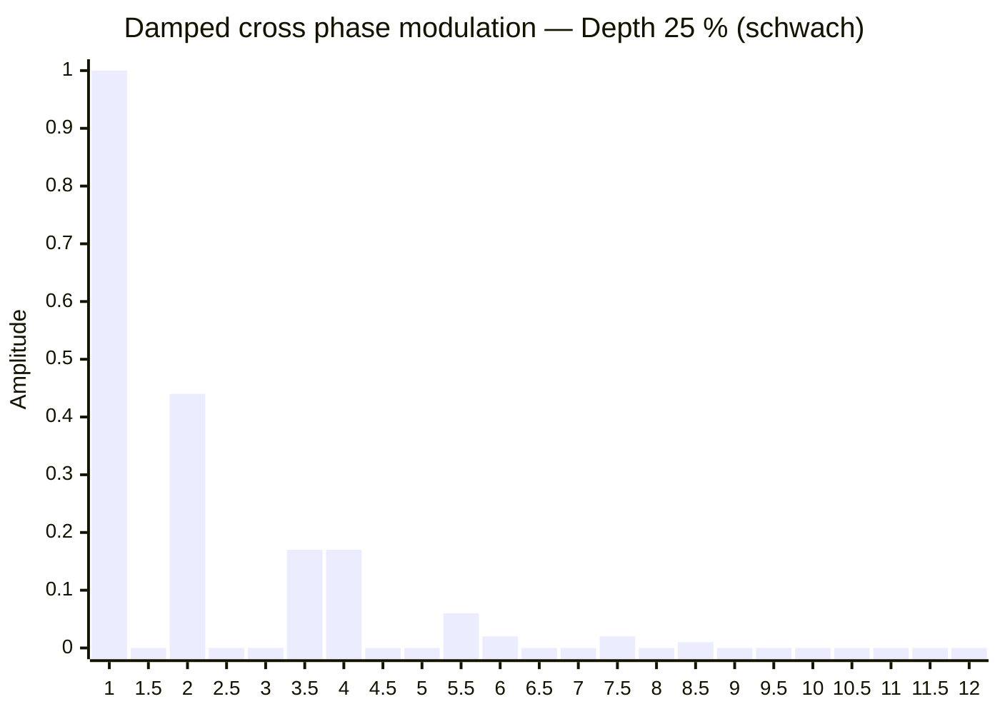
```mermaid
xychart-beta
    title "Damped cross phase modulation — Depth 25 % (schwach)"
    x-axis ["1", "1.5", "2", "2.5", "3", "3.5", "4", "4.5", "5", "5.5", "6", "6.5", "7", "7.5", "8", "8.5", "9", "9.5", "10", "10.5", "11", "11.5", "12"]
    y-axis "Amplitude" 0 --> 1
    bar [1.0, 0.0, 0.44, 0.0, 0.0, 0.17, 0.17, 0.0, 0.0, 0.06, 0.02, 0.0, 0.0, 0.02, 0.0, 0.01, 0.0, 0.0, 0.0, 0.0, 0.0, 0.0, 0.0]
```

```mermaid
xychart-beta
    title "Damped cross phase modulation — Depth 55 % (mittel)"
    x-axis ["1", "1.5", "2", "2.5", "3", "3.5", "4", "4.5", "5", "5.5", "6", "6.5", "7", "7.5", "8", "8.5", "9", "9.5", "10", "10.5", "11", "11.5", "12"]
    y-axis "Amplitude" 0 --> 1
    bar [0.97, 0.0, 1.0, 0.0, 0.0, 0.59, 0.4, 0.0, 0.0, 0.18, 0.28, 0.12, 0.0, 0.0, 0.0, 0.09, 0.04, 0.0, 0.0, 0.08, 0.0, 0.0, 0.0]
```

```mermaid
xychart-beta
    title "Damped cross phase modulation — Depth 90 % (stark)"
    x-axis ["1", "1.5", "2", "2.5", "3", "3.5", "4", "4.5", "5", "5.5", "6", "6.5", "7", "7.5", "8", "8.5", "9", "9.5", "10", "10.5", "11", "11.5", "12"]
    y-axis "Amplitude" 0 --> 1
    bar [0.81, 0.78, 0.0, 1.0, 0.0, 0.81, 0.49, 0.0, 0.48, 0.22, 0.21, 0.28, 0.0, 0.16, 0.0, 0.0, 0.35, 0.0, 0.0, 0.0, 0.18, 0.0, 0.0]
```

### Formant synthesis

Der Peak bei h5 bleibt liegen, das Spektrum wächst um ihn herum, je enger das Fenster wird.

```mermaid
xychart-beta
    title "Formant synthesis — Depth 25 % (schwach)"
    x-axis ["1", "1.5", "2", "2.5", "3", "3.5", "4", "4.5", "5", "5.5", "6", "6.5", "7", "7.5", "8", "8.5", "9", "9.5", "10", "10.5", "11", "11.5", "12"]
    y-axis "Amplitude" 0 --> 1
    bar [0.06, 0.0, 0.2, 0.0, 0.49, 0.0, 0.84, 0.0, 1.0, 0.0, 0.84, 0.0, 0.49, 0.0, 0.2, 0.0, 0.06, 0.0, 0.01, 0.0, 0.0, 0.0, 0.0]
```

```mermaid
xychart-beta
    title "Formant synthesis — Depth 55 % (mittel)"
    x-axis ["1", "1.5", "2", "2.5", "3", "3.5", "4", "4.5", "5", "5.5", "6", "6.5", "7", "7.5", "8", "8.5", "9", "9.5", "10", "10.5", "11", "11.5", "12"]
    y-axis "Amplitude" 0 --> 1
    bar [0.45, 0.0, 0.64, 0.0, 0.82, 0.0, 0.95, 0.0, 1.0, 0.0, 0.95, 0.0, 0.82, 0.0, 0.64, 0.0, 0.45, 0.0, 0.29, 0.0, 0.17, 0.0, 0.09]
```

```mermaid
xychart-beta
    title "Formant synthesis — Depth 90 % (stark)"
    x-axis ["1", "1.5", "2", "2.5", "3", "3.5", "4", "4.5", "5", "5.5", "6", "6.5", "7", "7.5", "8", "8.5", "9", "9.5", "10", "10.5", "11", "11.5", "12"]
    y-axis "Amplitude" 0 --> 1
    bar [0.72, 0.0, 0.83, 0.0, 0.92, 0.0, 0.98, 0.0, 1.0, 0.0, 0.98, 0.0, 0.92, 0.0, 0.83, 0.0, 0.72, 0.0, 0.6, 0.0, 0.48, 0.0, 0.36]
```

### Sync damping

Der freie Partialton bei 3.5 verschwindet, während das ganzzahlige Raster einrastet.

```mermaid
xychart-beta
    title "Sync damping — Damped 25 % (schwach)"
    x-axis ["1", "1.5", "2", "2.5", "3", "3.5", "4", "4.5", "5", "5.5", "6", "6.5", "7", "7.5", "8", "8.5", "9", "9.5", "10", "10.5", "11", "11.5", "12"]
    y-axis "Amplitude" 0 --> 1
    bar [0.03, 0.0, 0.14, 0.0, 0.3, 1.0, 0.3, 0.0, 0.14, 0.0, 0.03, 0.0, 0.0, 0.0, 0.0, 0.0, 0.0, 0.0, 0.0, 0.0, 0.0, 0.0, 0.0]
```

```mermaid
xychart-beta
    title "Sync damping — Damped 55 % (mittel)"
    x-axis ["1", "1.5", "2", "2.5", "3", "3.5", "4", "4.5", "5", "5.5", "6", "6.5", "7", "7.5", "8", "8.5", "9", "9.5", "10", "10.5", "11", "11.5", "12"]
    y-axis "Amplitude" 0 --> 1
    bar [0.42, 0.0, 0.75, 0.0, 1.0, 0.85, 1.0, 0.0, 0.75, 0.0, 0.42, 0.0, 0.18, 0.0, 0.06, 0.0, 0.01, 0.0, 0.0, 0.0, 0.0, 0.0, 0.0]
```

```mermaid
xychart-beta
    title "Sync damping — Damped 90 % (stark)"
    x-axis ["1", "1.5", "2", "2.5", "3", "3.5", "4", "4.5", "5", "5.5", "6", "6.5", "7", "7.5", "8", "8.5", "9", "9.5", "10", "10.5", "11", "11.5", "12"]
    y-axis "Amplitude" 0 --> 1
    bar [0.66, 0.0, 0.87, 0.0, 1.0, 0.11, 1.0, 0.0, 0.87, 0.0, 0.66, 0.0, 0.44, 0.0, 0.26, 0.0, 0.13, 0.0, 0.06, 0.0, 0.02, 0.0, 0.01]
```

### Pulsar synthesis

Die Rate des Funktionsgenerators verschiebt den Formantpeak über das Spektrum.

```mermaid
xychart-beta
    title "Pulsar synthesis — UFG-Rate 25 % (schwach)"
    x-axis ["1", "1.5", "2", "2.5", "3", "3.5", "4", "4.5", "5", "5.5", "6", "6.5", "7", "7.5", "8", "8.5", "9", "9.5", "10", "10.5", "11", "11.5", "12"]
    y-axis "Amplitude" 0 --> 1
    bar [0.22, 0.0, 0.04, 0.0, 0.58, 0.0, 1.0, 0.0, 0.95, 0.0, 0.47, 0.0, 0.04, 0.0, 0.23, 0.0, 0.09, 0.0, 0.1, 0.0, 0.11, 0.0, 0.01]
```

```mermaid
xychart-beta
    title "Pulsar synthesis — UFG-Rate 55 % (mittel)"
    x-axis ["1", "1.5", "2", "2.5", "3", "3.5", "4", "4.5", "5", "5.5", "6", "6.5", "7", "7.5", "8", "8.5", "9", "9.5", "10", "10.5", "11", "11.5", "12"]
    y-axis "Amplitude" 0 --> 1
    bar [0.07, 0.0, 0.13, 0.0, 0.0, 0.0, 0.19, 0.0, 0.16, 0.0, 0.23, 0.0, 0.76, 0.0, 1.0, 0.0, 0.76, 0.0, 0.23, 0.0, 0.16, 0.0, 0.19]
```

```mermaid
xychart-beta
    title "Pulsar synthesis — UFG-Rate 90 % (stark)"
    x-axis ["1", "1.5", "2", "2.5", "3", "3.5", "4", "4.5", "5", "5.5", "6", "6.5", "7", "7.5", "8", "8.5", "9", "9.5", "10", "10.5", "11", "11.5", "12"]
    y-axis "Amplitude" 0 --> 1
    bar [0.07, 0.0, 0.02, 0.0, 0.07, 0.0, 0.08, 0.0, 0.04, 0.0, 0.13, 0.0, 0.04, 0.0, 0.16, 0.0, 0.19, 0.0, 0.13, 0.0, 0.67, 0.0, 1.0]
```

### Der aufschlussreichste Gegensatz

Blending und Stretch verschieben beide Frequenzen, aber gegenläufig:

| | Grundton | Obertöne |
|---|---|---|
| **Blending** | wandert zur nächsten Harmonischen | wandern mit |
| **Stretch** | bleibt unverändert stehen | driften vom Raster weg |

Deshalb klingt Blending wie ein Tonhöhenwechsel und Stretch wie eine Verstimmung innerhalb eines Klangs. Stretch wirkt außerdem nur bei aktivem Waveshaping; Sidebands aus PM und AM bleiben unberührt.

---

## 5. Zeitskalen

Ein wiederkehrendes Prinzip: dieselbe Schaltung wechselt ihre Funktion, wenn sie die Hörschwelle überquert.

```mermaid
flowchart LR
    subgraph UFG["UFG — Universal Function Generator"]
        U1["sub-audio<br/>LFO, Hüllkurve"] --> U2["Übergang<br/>Pulsar-Fenster"] --> U3["Audio-Rate<br/>Operator, TZFM"]
    end
    subgraph DS["Δ–Σ — Pattern-Generator"]
        D1["sub-audio<br/>Sequenz mit Glide"] --> D2["Audio-Rate<br/>Filter, PM-Quelle"]
    end

    classDef lo fill:#E1F5EE,stroke:#0F6E56,color:#04342C
    classDef mid fill:#FAEEDA,stroke:#854F0B,color:#412402
    classDef hi fill:#EEEDFE,stroke:#534AB7,color:#26215C
    class U1,D1 lo
    class U2 mid
    class U3,D2 hi
```

Der Übergang ist stufenlos; es gibt keinen Modusumschalter dazwischen. Das erklärt, warum Damped/Pulsar so zentral ist: langsamer UFG ergibt perkussive Einzelereignisse, schneller UFG macht aus denselben Ereignissen Korn-Wiederholungen, die als Tonhöhe und Formant wahrgenommen werden.

---

## 6. Weitere Architektur-Elemente

**Root-System** — eine Tonhöhenreferenz für alle drei Oszillatoren, quantisierbar auf 12-TET oder Just Intonation (je 21 Skalen). Der Root-Send-Button hat vier Zustände: nur OSC, beide, nur UFG, keiner. Der Mod-Oszillator kann unabhängig davon OSC, UFG oder Root tracken.

```mermaid
flowchart TB
    ROOT["Root-Frequenz<br/>12-TET oder Just Intonation"]
    ROOT --> OSCN["OSC"]
    ROOT --> UFGN["UFG"]
    ROOT -. "nur wenn Mod nichts anderes trackt" .-> MODN["Mod"]
    OSCN -. "trackbar" .-> MODN
    UFGN -. "trackbar" .-> MODN

    classDef root fill:#FBEAF0,stroke:#993556,color:#4B1528
    classDef osc fill:#E1F5EE,stroke:#0F6E56,color:#04342C
    class ROOT root
    class OSCN,UFGN,MODN osc
```

**Centre** — der definierte Nullpunkt: alle Attenuverter zentriert, Damped/Pulsar auf Minimum, Stretch auf Minimum, alle drei Waveshaping-Regler auf Minimum. Ergibt immer ein reines Sinus-/Cosinus-Paar, unabhängig von allen anderen Reglerstellungen. Der Guide empfiehlt ausdrücklich, den Weg zurück nach Centre einzuüben.

**Ausgänge** — Sinus und Cosinus als Stereopaar. Der Stereoraum entsteht aus den Phasendifferenzen, die die Waveshaping-Engine zwischen beiden erzeugt.

**Externe Eingänge** — 23 Patchpunkte. Der Ext.-Eingang kann als Sync-Quelle oder als Pitch-Tracking dienen (Nulldurchgangserkennung, nur Tonhöhe, keine Amplitude). In Verbindung mit Quantisierung lässt sich damit zu externen Quellen harmonisieren.

---

---

## 7. Prinzipien für Systementwurf

Extrahiert aus der Architektur des K-Accumulator und dem Umfeld, in dem sie steht.

**1 — Skaleninvarianz.** Ein Mechanismus, der über mehrere Zeitskalen läuft und dabei seinen wahrgenommenen Charakter wechselt, ist ökonomischer und musikalischer als drei spezialisierte. Derselbe Modulator ist bei 0,2 Hz Wow, bei 8 Hz Flutter, bei 80 Hz Verzerrung, bei 800 Hz Formant.

**2 — Wenige Primitive, dichte Kopplung.** Vier Sinuswellen plus Routing schlagen dreißig Algorithmen. Reichtum entsteht aus Verschaltung, nicht aus Menge.

**3 — Kontinuum statt Kategorie.** Parameterräume, in denen jeder Zwischenzustand gültig ist, sind spielbar; diskrete Modi sind es nicht.

**4 — Viele-zu-eins-Mapping.** Ein Regler, der gewichtet in viele Ziele greift. Wessel/Wright und Hunt/Wanderley haben gezeigt, dass solche Mappings besser spielbar sind als Eins-zu-eins-Zuordnungen, weil sie dem motorischen Lernen entgegenkommen.

**5 — Rückkopplung als Material.** Nicht als zu vermeidender Fehler, sondern als Quelle von Verhalten, das der Entwerfer nicht vollständig vorhersieht.

**6 — Betrieb nahe der Instabilität.** Der interessante Bereich liegt kurz vor dem Kippen. Dämpfung ist das Werkzeug, das diesen Bereich von einem Millimeter Reglerweg auf einen spielbaren Bereich dehnt.

**7 — Sinnvolle Vorverkabelung.** Normalisierungen, die ohne Patchkabel schon etwas tun, aber überschreibbar sind. Der Nullzustand eines Systems sollte nicht Stille sein.

**8 — Ein definierter Nullpunkt.** Ohne bekannten Rückweg wird ein hochgekoppeltes System unbenutzbar. Die Centre-Position ist deshalb im Quick-Start-Guide so betont.

**9 — Keine Modi, keine Menüs.** Jede versteckte Zustandsebene kostet Unmittelbarkeit, die bei zeitkritischem Spiel nicht zurückzugewinnen ist.

---

## 8. Übertragung auf Sample-Bearbeitung

### Der entscheidende Übersetzungsschritt

Das Modul arbeitet in **Quadratur** — Sinus und Cosinus, also ein Signal und seine um 90 Grad gedrehte Version. Darauf beruhen Frequency Shifting, asymmetrische Spektren und der Stereoraum. Bei einem Sample bekommt man das über die **Hilbert-Transformation** (analytisches Signal aus Real- und Imaginärteil), analog näherungsweise über eine Allpass-Kette.

### Phase entspricht Leseposition

Die meisten Sample-Effekte greifen an der Amplitude an. Die Logik des K-Accumulator greift an der Phase an — und bei einem Sample ist das Äquivalent zur Phase die **Leseposition** beziehungsweise die **Verzögerungszeit**.

| Technik am Modul | Äquivalent bei Samples |
|---|---|
| Phasenmodulation | Audiorate-Modulation der Delayzeit / Leseposition |
| Self-Feedback-PM | Ausgang moduliert die eigene Verzögerungszeit |
| Cross-PM | Zwei Delaylinien modulieren gegenseitig ihre Zeiten |
| Damped Sync | Progressives Zurücksetzen der Leseposition auf einen Takt |
| Wavefolding | Nicht das Audio falten, sondern die Positionsrampe |
| Blended freq. shifting | Single-Sideband-Shifting über Hilbert-Paar |
| Asymmetric PM | Halbwellengleichrichtung des Modulators |
| Formantsynthese | Fenstergröße bei granularer Wiedergabe |
| Pulsar | Fenster mal Ausschnitt bei Audiorate |
| Sin-/Cos-Ausgänge | Real-/Imaginärteil auf links und rechts |

---

## 9. Eurorack-Umsetzung

Konkrete Patches für das vorhandene System. Alle Modulfunktionen wurden gegen Herstellerangaben geprüft.

### Rollenverteilung

| Funktion im K-Accumulator | Modul im System |
|---|---|
| Haupt-Oszillator (hier: das Sample) | externe Quelle über Veils als Eingangsstufe |
| Phasenakkumulator für Samples | Joranalogue Delay 1, Doepfer A-188-1 (BBD) |
| PM-Prozessor für beliebige Signale | Happy Nerding FM AID |
| Mod-Oszillator | Joranalogue Generate 3 |
| UFG (Funktionsgenerator) | Joranalogue Contour 1, Doepfer A-171-2 |
| Delta-Sigma-Pattern | Herzlich R2R 8-bit DAC + Klavis Two Bits + Octa Holdster + Fractio Solum |
| Damping | Doepfer A-171-2 (Slew), Chem LPG, Passive LPG, 2hp MMF |
| Wavefolding | Joranalogue Fold 6 |
| Ringmod, AM, Fensterung | IO Pasiphae, NLC Ming Rod, Persephone, Amplitude, Veils |
| Asymmetrie | CFM BWHR Rectifier, Persephone Asymmetry-Schalter |
| Quadratur, Phasenlage | Filter 8 (Allpass/Bandpass), Doepfer A-101-3 (Vactrol-Phaser) |
| Morph-Gewichtung | Veils (4 VCAs), Mixwitch, Route 4, Add 2 |
| Pfadwahl, Umschaltung | Select 2, SW3 Splice, Route 4, Mixwitch |
| Q.Trig (Trigger aus CV) | u-he Wiretap (Slope-Detektor) |
| Sync-Quellen | Fractio Solum, Wiretap, Two Bits |
| Raum, Diffusion | NLC The Big Room, A-101-3 |
| Filter, Formant | Filter 8, 2x SEMSVF, Polaris, Ivo, 2x 2hp MMF |
| Summe, Abhöre | uMinx, ALM HPO |

**Was fehlt:** ein Sample-Player (Zuspielung muss extern erfolgen), ein Quantisierer (das Root-System lässt sich nur teilweise nachbauen) und ein echter Frequency Shifter mit Hilbert-Paar (nur näherungsweise über A-101-3 plus Pasiphae).

**Unsicher:** Bei NLC Ming Rod widersprechen sich die Quellen. Die NLC-Produktseite beschreibt einen Ringmodulator nach einem Oberheim-Paper von 1970; ein Händler beschreibt einen Thru-Zero-VCO mit SSI2130 als FM-Operator. Prüfe deine Version, bevor du sie in einen Patch einplanst.

### Grundschaltung (Centre-Äquivalent)

```mermaid
flowchart LR
    SMP["Sample-Quelle<br/>extern"] --> VE["Veils Ch1<br/>Eingangspegel"]
    VE --> DLY["Delay 1<br/>Positions-Engine"]
    DLY --> FLD["Fold 6<br/>Wavefolding"]
    FLD --> F8["Filter 8<br/>LP und BP"]
    F8 --> OUT["uMinx / HPO"]
    GEN["Generate 3<br/>Mod-Oszillator"] -. "PM" .-> DLY
    DLY -. "Self-PM" .-> SLW["A-171-2<br/>Damping"]
    SLW -. .-> DLY

    classDef src fill:#EEEDFE,stroke:#534AB7,color:#26215C
    classDef core fill:#E1F5EE,stroke:#0F6E56,color:#04342C
    classDef util fill:#F1EFE8,stroke:#5F5E5A,color:#2C2C2A
    class SMP,GEN src
    class DLY,FLD,F8 core
    class VE,SLW,OUT util
```

**Centre erreichen:** Delayzeit-CV-Abschwächer auf Null, Fold 6 auf Minimum, Filter 8 auf höchste Grenzfrequenz, alle Rückkopplungs-VCAs geschlossen. Dann geht das Sample unverändert durch. Der Rückweg hierhin muss so schnell gehen wie am Modul, sonst wird das System unbedienbar.

**Der Stereo-Trick:** Filter 8 im Selbstoszillationsbereich liefert an Tiefpass- und Bandpass-Ausgang zwei um 90 Grad phasenverschobene Signale. Auf links und rechts gelegt ergibt das dasselbe Prinzip wie die Sinus-/Cosinus-Ausgänge des K-Accumulator. Einschränkung: die Quadratur gilt nur um die Grenzfrequenz herum, nicht breitbandig. Für breitbandige Phasendrehung ist A-101-3 (Allpass-Kaskade) der bessere Weg — dry auf links, Phaser auf rechts.

### Der Morph-Regler

Der Kern der Sache: eine Steuerspannung, die drei Modulationspfade gegenläufig gewichtet.

```mermaid
flowchart LR
    CV["Morph-CV<br/>Contour 1 oder manuell"] --> V1["Veils Ch2<br/>Gewicht Self-PM"]
    CV --> V2["Veils Ch3<br/>Gewicht Mod-PM"]
    CV --> V3["Veils Ch4<br/>Gewicht Cross-PM"]
    V1 --> ADD["Add 2<br/>Summe"]
    V2 --> ADD
    V3 --> ADD
    ADD --> TGT["Delay 1<br/>Zeit-CV"]

    classDef ctl fill:#FBEAF0,stroke:#993556,color:#4B1528
    classDef vca fill:#E1F5EE,stroke:#0F6E56,color:#04342C
    class CV ctl
    class V1,V2,V3 vca
```

Die Attenuverter der drei Veils-Kanäle werden unterschiedlich gesetzt: einer positiv, einer negativ, einer mit Offset. So entstehen aus einer einzigen Spannung drei verschiedene Gewichtungskurven — das ist die Manifold-Idee in Hardware. Mixwitch oder Route 4 können zusätzlich harte Pfadwechsel machen, aber das wäre dann wieder Preset-Umschaltung statt Morphing.

### FMNT — Formant und Self-PM

```mermaid
flowchart LR
    SMP["Sample"] --> PER["Persephone<br/>JFET-VCA"]
    CON["Contour 1<br/>Audiorate-Fenster"] --> PER
    PER --> FMA["FM AID<br/>Carrier, Mod normalled"]
    FMA --> F8["Filter 8<br/>Bandpass"]
    F8 --> OUT["Ausgang"]
```

Contour 1 im Audiobereich fenstert das Sample über Persephone — das ist die Raised-Cosine-AM. FM AID mit unbelegtem Modulator-Eingang arbeitet als Selbstmodulation, weil der Carrier intern normalled ist. Filter 8 im Bandpass setzt die Formantlage.

Depth entspricht dem FM-Regler von FM AID, Shift der Grenzfrequenz von Filter 8, Shape der Resonanz.

### FBPM — reines Self-Feedback

```mermaid
flowchart LR
    SMP["Sample"] --> DLY["Delay 1"]
    DLY --> FLD["Fold 6"]
    FLD --> OUT["Ausgang"]
    DLY --> VC["Veils Ch2<br/>Feedback-Tiefe"]
    VC --> SLW["A-171-2<br/>Damping"]
    SLW --> DLY
```

Der Ausgang der Delaylinie moduliert über einen VCA und einen Slew-Limiter die eigene Verzögerungszeit. A-171-2 ist hier das entscheidende Bauteil: ohne die Dämpfung kippt der Patch schlagartig, mit ihr wird der Übergang spielbar.

Depth ist der Veils-Pegel, Shape der Fold-6-Regler, Shift die Grundverzögerung.

### 2OP — Modulator auf Sample

```mermaid
flowchart LR
    SMP["Sample"] --> FMA["FM AID<br/>Carrier"]
    GEN["Generate 3<br/>Sinus"] --> AMP["Amplitude<br/>Index"]
    AMP --> SLW["A-171-2<br/>Damping"]
    SLW --> FMA
    FMA --> FLD["Fold 6"]
    FLD --> OUT["Ausgang"]
```

Generate 3 liefert den Modulator, Amplitude setzt den Modulationsindex, A-171-2 dämpft ihn. Alternativ statt FM AID die Delayzeit von Delay 1 modulieren — das klingt weicher und behält mehr vom Ausgangsmaterial.

Depth ist Amplitude, Shift die Frequenz von Generate 3, Shape der Fold-6-Regler.

### XPM — gegenseitige Rückkopplung

```mermaid
flowchart LR
    SMP["Sample"] --> DLY["Delay 1"]
    GEN["Generate 3"] --> BBD["A-188-1<br/>BBD"]
    DLY --> V1["Veils Ch3"]
    V1 --> BBD
    BBD --> V2["Veils Ch4"]
    V2 --> SLW["A-171-2"]
    SLW --> DLY
    DLY --> OUT["Ausgang"]
```

Zwei Verzögerungsleitungen modulieren gegenseitig ihre Zeiten. Das ist die direkteste Übersetzung von Cross-Phase-Modulation auf Samples. Beide Wege laufen über VCAs, mindestens einer über den Slew-Limiter — sonst ist der stabile Bereich unauffindbar.

Beide Veils-Kanäle liegen hier auf demselben Regler, entsprechend dem kombinierten Depth des linken Pfades.

### Asym — asymmetrische Modulation

```mermaid
flowchart LR
    GEN["Generate 3"] --> REC["BWHR Rectifier<br/>Halbwelle"]
    REC --> PAS["Pasiphae<br/>DC-Offset gedreht"]
    SMP["Sample"] --> PAS
    PAS --> PER["Persephone<br/>Asymmetry an"]
    PER --> OUT["Ausgang"]
```

Der Gleichrichter bricht die Symmetrie des Modulators — das ist der Grund, warum die halben Seitenbänder verschwinden. Der DC-Offset an Pasiphae verschiebt den Ringmodulator Richtung Amplitudenmodulation, sodass der Träger stehen bleibt. Der Asymmetry-Schalter von Persephone verstärkt den Effekt.

Depth ist der Pasiphae-Pegel, Shift der DC-Offset, Shape die Vorstufenverstärkung von Persephone.

### FBPM2 — chaotisch, subharmonisch rastend

```mermaid
flowchart LR
    SMP["Sample"] --> DLY["Delay 1"]
    DLY --> OUT["Ausgang"]
    DLY --> WT["Wiretap<br/>Slope-Detektor"]
    WT --> CON["Contour 1<br/>getriggert"]
    CON --> V1["Veils Ch2"]
    V1 --> MMF["2hp MMF<br/>Damping-Filter"]
    MMF --> DLY
```

Der Unterschied zu FBPM: Die Rückkopplung läuft nicht direkt, sondern über einen Slope-Detektor, der bei jeder signifikanten Änderung einen Trigger erzeugt und damit Contour 1 startet. Dadurch entsteht das subharmonische Einrasten. Wiretap ist hier das Äquivalent zur Q.Trig-Funktion des K-Accumulator. Statt des Slew-Limiters übernimmt hier ein Filter die Dämpfung — das entspricht der Trennung, die der rechte Pfad im Original macht.

### 2OP2 — Mod-PM und Self-PM getrennt

```mermaid
flowchart LR
    SMP["Sample"] --> DLY["Delay 1"]
    GEN["Generate 3"] --> V1["Veils Ch3<br/>Depth"]
    V1 --> ADD["Add 2"]
    DLY --> V2["Veils Ch2<br/>Shift"]
    V2 --> MMF["2hp MMF"]
    MMF --> ADD
    ADD --> DLY
    DLY --> FLD["Fold 6"]
    FLD --> OUT["Ausgang"]
```

Beide Modulationspfade sind gleichzeitig aktiv und liegen auf getrennten Reglern — das ist die Besonderheit von 2OP2 gegenüber 2OP. Add 2 summiert sie präzise auf den einen Zeit-CV-Eingang.

### XPM2 — voll getrennte Regler

```mermaid
flowchart LR
    SMP["Sample"] --> DLY["Delay 1"]
    GEN["Generate 3"] --> V1["Veils Ch3<br/>PM-Index"]
    V1 --> DLY
    DLY --> V2["Veils Ch4<br/>XPM-Index"]
    V2 --> MM1["2hp MMF Nr.1<br/>PM-Damping"]
    MM1 --> BBD["A-188-1"]
    BBD --> MM2["2hp MMF Nr.2<br/>XPM-Damping"]
    MM2 --> DLY
    DLY --> OUT["Ausgang"]
```

Hier bekommt jeder Bestandteil einen eigenen Regler: Index und Dämpfung in beide Richtungen getrennt. Die beiden 2hp MMF sind genau dafür da. Aufwendig zu bedienen, aber der Bereich unmittelbar vor dem Kippen wird dadurch überhaupt erst auffindbar.

### Pulsarsynthese aus Samples

```mermaid
flowchart LR
    SMP["Sample"] --> LPG["Chem LPG<br/>Korn-Fenster"]
    CON["Contour 1<br/>Audiorate"] --> LPG
    FRC["Fractio Solum<br/>Rate"] --> CON
    LPG --> BIG["The Big Room<br/>Diffusion"]
    BIG --> OUT["Ausgang"]
```

Contour 1 im Audiobereich öffnet den Low Pass Gate periodisch — Kornrate bestimmt die wahrgenommene Tonhöhe, Kornlänge den Formanten. Fractio Solum liefert die Rate und erlaubt Teilung und Vervielfachung. Der Vactrol im LPG macht die Fensterflanken von selbst weich, was Klickartefakte vermeidet. The Big Room mit seiner spannungsgesteuerten Rückkopplung ist die Diffusionsstufe.

### Pattern-Generator als Delta-Sigma-Ersatz

```mermaid
flowchart LR
    FRC["Fractio Solum<br/>Takt"] --> TB["Two Bits<br/>Logik"]
    TB --> R2R["R2R 8-bit DAC<br/>Stufenspannung"]
    OH["Octa Holdster<br/>8x Sample and Hold"] --> R2R
    R2R --> SLW["A-171-2<br/>Glide"]
    SLW --> DST["Modulationsziel"]
```

Der R2R-Wandler macht aus acht Gate-Signalen eine gestufte Spannung. Über Two Bits verknüpfte Taktteilungen ergeben wiederholbare, aber nicht triviale Muster. A-171-2 übernimmt die Smooth-Funktion: bei langsamem Takt ein Glide, bei Audiorate ein Filter — dieselbe Doppelrolle wie beim Original.

---

## 10. Spektromorphologie als Beschreibungssprache

Denis Smalleys Ansatz (1997) entstand aus einem konkreten Mangel: Für elektroakustische Musik versagt die Notenschrift-Terminologie. Er verbindet **Spektrum** (was klingt) mit **Morphologie** (wie es sich formt).

**Spektrale Typologie** als Kontinuum: Note zu Knoten zu Rauschen. Note hat klare Tonhöhe, Knoten ein Band mit Schwerpunkt, Rauschen keine Struktur. Genau diese Achse durchfährt der Morph-Ring.

**Gesture und Texture** ist das zentrale Begriffspaar. Geste ist verursacht, zielgerichtet, drängt vorwärts und impliziert eine handelnde Instanz. Textur hat innere Aktivität ohne Vorwärtsdruck. Der Umschlagpunkt zwischen beiden ist ein kompositorisches Ereignis — und deckt sich mit dem Übergang von sub-audio zu Audiorate.

**Source bonding und Surrogatstufen:** Wir hören unwillkürlich eine Ursache mit. Smalley staffelt die Entfernung von einer erkennbaren Geste bis zur remote surrogacy, wo keine Ursache mehr rekonstruierbar ist.

**Morphologische Archetypen** stammen aus der Physik des Anschlagens: Attack-Impuls, Attack-Decay, graduierter Kontinuant. Dazu **Strukturfunktionen** (Onset, Continuant, Termination), **Bewegungstypen** (unidirektional, reziprok, zentrisch, zyklisch), **spektraler Raum** (Canopy, Root, Dichte) und **Verhalten** zwischen Klängen (Dominanz, Konflikt, Koexistenz).

Praktischer Wert: eine Sprache für das, was ein Patch tut, wenn Tonhöhe und Rhythmus als Kategorien versagen.

---

## 11. Instabilität finden

**Bifurkationsdiagramm.** Einen Parameter sehr langsam über den ganzen Bereich fahren und dabei einen Zustandswert aufzeichnen — Spitzenwerte, Nulldurchgangsabstände, Grundfrequenz. Gegen den Parameter aufgetragen zeigen sich stabiler Ast, Gabelungen, verschmierter Bereich. In Hardware: langsame Rampe auf den CV-Eingang, alles aufnehmen, hinterher analysieren.

**Das hörbare Signalement: Subharmonische.** Periodenverdopplung klingt als Oktavsprung nach unten. Eine Kaskade solcher Halbierungen in immer kürzeren Abständen ist der klassische Weg ins Chaos. Das Manual nennt genau das bei FBPM2.

**Das Kriterium: Schleifenverstärkung gleich eins.** Jede Rückkopplung wird instabil, wo das Produkt aller Verstärkungen im Kreis eins erreicht und die Phase passt. Instabilität sitzt immer dort, wo eine Nichtlinearität ihre Verstärkung über eins schiebt.

**Zwei Zustände vergleichen.** Zweimal mit minimal unterschiedlicher Anfangsbedingung starten und messen, wie schnell die Ergebnisse divergieren. Exponentielle Divergenz bedeutet Chaos, nicht Rauschen.

**Hysterese kartieren.** Die Grenze liegt beim Hochdrehen selten dort, wo sie beim Runterdrehen liegt. Die Breite der Hysterese sagt, wie klebrig ein Zustand ist.

**Dämpfung als Lupe.** Ein Tiefpass in der Schleife verschiebt den Kipppunkt und dehnt die interessante Zone von einem Millimeter Reglerweg auf einen spielbaren Bereich. Deshalb heißt beim K-Accumulator fast alles damped.

Di Scipios Ansatz geht weiter: das System so bauen, dass es sich anhand seiner eigenen Ausgabe selbst um die Grenze herum reguliert.

---

## 12. Gegenwärtige Entwicklungen

**Differentiable DSP** ist die direkteste Fortsetzung. Engel und Kollegen implementierten 2020 einen differenzierbaren Spektralmodellierungs-Synthesizer nach Serra und Smith und ersetzten die Parameterschätzung durch ein neuronales Netz. Kein Black-Box-Modell, sondern klassische DSP-Bausteine mit lernbaren Parametern. Die Verlustfunktion arbeitet über mehrere FFT-Größen gleichzeitig — eine direkte Antwort auf Gabors Unschärfeproblem.

**Neurale Granularsynthese** (Bitton, Esling, Harada) strukturiert Körner in einem latenten Raum und rekonstruiert über Overlap-Add. Ein durchgehender Parameterraum aus Körnern, also dieselbe Manifold-Idee wie beim Morph-Ring.

**RAVE** (Caillon, Esling, IRCAM) hat die Echtzeitfähigkeit gelöst und ist über das nn~-Objekt in Max/MSP und Pure Data patchbar. Latentdimensionen lassen sich modulieren wie CV.

**Analyseseite:**
- Reassignment und Synchrosqueezing für schärfere Zeit-Frequenz-Darstellung
- Phasengekoppelte Vokoder (Puckette, Laroche) gegen Phasing beim Zeitdehnen
- Neurale Quellentrennung (Demucs, Open-Unmix) macht Spektralchirurgie an Samples praktikabel
- FluCoMa (Huddersfield) bringt Analyse-Deskriptoren und Machine Learning als Patch-Objekte nach Max, SuperCollider und Pure Data
- CataRT (Schwarz, IRCAM) als Vorläufer: konkatenative Synthese durch Navigation im Deskriptorraum

**Neurale Audio-Codecs** (SoundStream, EnCodec, DAC) zerlegen Audio über Residual Vector Quantisation in diskrete Token — eine neue Art von Korn, definiert durch Rekonstruierbarkeit statt durch Zeitdauer.

Zwei offene Probleme liegen nah an der Ausgangsfrage dieser Notizen: hochdimensionale Steuerung verbessert die Rekonstruktionstreue, niedrigdimensionale glatte Parametrisierung die Spielbarkeit — derselbe Konflikt wie zwischen vielen Parametern und einem Morph-Regler. Und die Entflechtung von Tonhöhe, Klangfarbe und Dynamik ohne gegenseitige Beeinflussung gilt weiterhin als ungelöst.

---

## Quellen

- Perfect Circuit Signal: "Accumulating Complexity with K-Accumulator — An Interview with Tristan Clutterbuck and Graham Wakefield"
- K-ACCUMULATOR Quick-Start Guide (fancysynthesis.net)
- fancysynthesis.net — Produktseite

*Hinweis: Ein vollständiges technisches Manual zur Architektur war zum Zeitpunkt dieser Notizen laut Hersteller noch in Arbeit. Die Beschreibungen der internen Signalwege sind aus Panel-Dokumentation und Interview rekonstruiert, nicht aus dem DSP-Quellcode. Die Spektren sind Modelle des jeweiligen Prinzips.*
