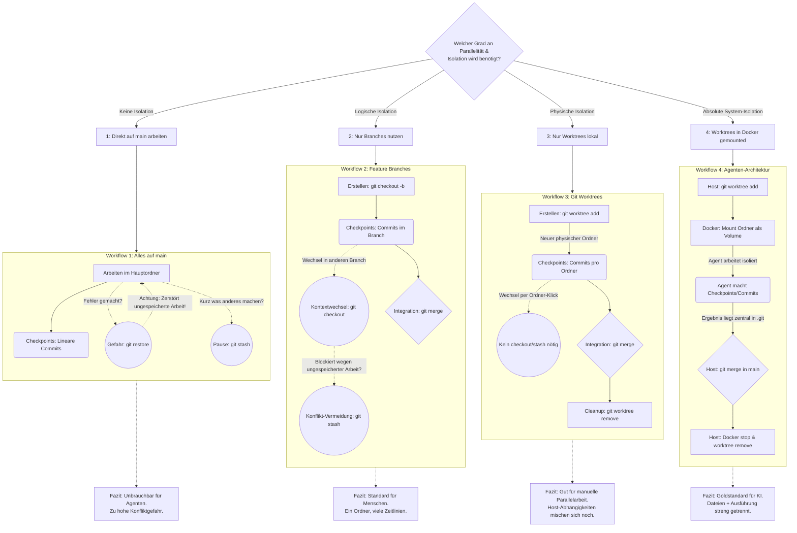

# misc
[Luna Display | Turn your Mac or iPad into a second display](https://astropad.com/product/lunadisplay/)
^545451
## logic 20260520
- [A Logic Cookbook for Synthesis](https://doudoroff.com/logic/index.html)
- [Your recommended logic module - MOD WIGGLER](https://www.modwiggler.com/forum/viewtopic.php?t=289814)
# discord
# ==01.01.2026 - 15.03.2026==
## 20260501
- timestretching [[DAFx26_tmpl.pdf]]
	- there are other shapes that could be used in reconstruction, some that might be interesting and still pretty antialiased. The use of OLA for time stretching surprised me, I imagine you could take a (subsample accurate) concatenative approach here with decent results too. I think it could be interesting to expand this technique with transient detection.
	- keyframes individually adapts to complexity of waveform, therefore variable length (WSOLA with fixed length) 
	- analysis turns a sample-based signal stream into a series of splines, and the resynthesis turns splines back into samples
		- something like data compression, because there are less keyframes than sample series
	- [[timestretch with extrema sampling.maxpat]]
	- K is the number of keyframes to crossfade over, but keyframes are variably-sized according to the content -- transients are going to have very short segments, sustained tones will have long segments, and so the cross-fade is adaptive to the content.
> [!NOTE]- additional tweaks!!! https://discord.com/channels/289378508247924738/1486514488256761926
>
> 1. A couple of things I spotted: `t_temp += temprate * pitchrate;` Shouldn't this just be `t_temp += temprate;` ? I figure that both playheads should be advancing at the same rate; the 2nd playhead shouldn't be speeding up? I do see that they have the equivalent of `t_temp += temprate * pitchrate;` in the paper, but I can't understand why; maybe it is a typo? It's hard to hear a difference, but I think it sounds slightly clearer without this temprate multiplier. I simplified the logic slightly to reduce duplication, looks like this:
>     
>     `// not crossfading, just output the normal playhead: y, play_m = interpolate(keyframes, play, M, m = play_m); // advance it: play += pitchrate; ref += timerate; // if we are crossfadeing: if (splicing) {     // get & advance temporary playhead:     y_temp, temp_m = interpolate(keyframes, temp, M, m = temp_m);     temp += pitchrate;     //t_temp += temprate * pitchrate;     t_temp += temprate;          // crossfade over to it:     y = mix(y, y_temp, t_temp);          // is the crossfade done?     if (t_temp >= 1) {         play = temp;         play_m = temp_m;         splicing = 0;     } }  out1 = y;` 
>     
>     In `analyze()` you are getting the slope by comparing the next and previous samples (a 2 sample period); but I think it would be fine to compare current and previous (as they do in the paper). I.e. `deltas.poke((x.peek(i) - x.peek(i-1)), i);` rather than `deltas.poke((x.peek(i+1) - x.peek(i-1))/2, i);` -- again, I can't hear any difference, but this should make it easier to translate the analysis into a real-time process with no dependency on the future  I think that in place of `v_m = B(x, n_m);` you could also use `v_m = x.peek(n_m, interp="cubic");`, meaning you don't need function `B` anymore.
>     
> 2. Also wasn't sure that it was necessary to dcblock the output.
>     
> 3. ### Graham Wakefield _—_ 05.04.2026 21:44
>     
>     And now I play with this more, and more and more convinced that the real value here is not the resynthesis, but rather the analysis-driven adaptive crossfade duration.  
>     The two things are really quite separate. There's a resynthesis method here, using cubic splines between keyframes, which has a kind of "tape saturation" effect. And there's a time-stretching method, which is essentially a crossfade over N samples, where N is the length of K keyframes, i.e. the next K peaks & troughs. Both of them use the same analysis method (peak/trough detection) but you don't have to use the resynthesis method for the crossfade stretching. Actually you can just trigger a crossfade between the raw input buffer content over N samples, and it does the same adaptive timestretching, without the saturation compression. Maybe the resynthesis can help avoid aliasing a little when pitching up, but other resampling AA methods here would be better, and with fewer artefacts. On the other hand, the artefacts may be desirable, but they are not tied to applications of time stretching in particular -- they could be used for many different purposes.
>     
> 4. ### exitdevice _—_ 05.04.2026 23:39
>     
>     Regarding `t_temp += temprate * pitchrate;` vs `t_temp += temprate;`: I believe this _is_ making them advance at the same rate. The playhead will traverse L samples in `L / pitchrate` ticks - we are speeding/slowing the temp head so it does the same. At least I think that's correct..the paper talks about it right after equation (12) in section 2.7. Though my head is spinning a bit, I must admit 
>     
> 1. In `analyze()` - I'm following the paper on that actually! It is storing the delta as B'(x, n), which should simplify to the 2 sample period difference. But maybe switching it so it's real-time friendly is a good idea..
>     
> 2. I like the refactoring you did! Much cleaner. Also, good call on that switch to `interp=cubic` to get rid of the `B` function. Cut the fat!
>     
> 3. If I'm learning anything from this discussion, it's that the finer points don't matter lol
>     
> 4. ### exitdevice _—_ 05.04.2026 23:50
>     
>     Oh and I did this because I had a constant non-zero value going to my live.gain~ when I had it in one-shot mode. But of course now I can't replicate that behavior...maybe that was fixed by your cleanup
>     
> 5. ### Graham Wakefield _—_ 06.04.2026 00:00
>     
>     Hmm, yes I suppose it is correct to scale temprate by pitchrate, so that crossfades go faster when the pitch is higher. Not sure what I was thinking there!
>     
> 6. ### exitdevice _—_ 06.04.2026 01:25
>     
>     You're totally right. Making a change to the interpolation like:
>     
>     `//y, play_m = interpolate(keyframes, play, M, m = play_m); y = peek(buf, play, interp="spline6");`
>     
>     cleans it up quite a bit (as long as you aren't pitching up, of course) (and changing the corresponding lines for the temp read)
>     
> 1. Or even with linear interpolation
- fft visual jitter manipulation [jackhwalters/The-Fast-Fourier-Transform-and-Spectral-Manipulation-in-Max-MSP-and-Jitter-beta: This project explores the mathematics of the Fast Fourier Transform (FFT) and their application in the programming environment Max, and the subsequent spectral effects that are possible in Max’s openGL extension Jitter.](https://github.com/jackhwalters/The-Fast-Fourier-Transform-and-Spectral-Manipulation-in-Max-MSP-and-Jitter-beta/tree/master)
- buffer based [spectrogram~ - Interactive Spectral Analyzer for Max](https://www.zacharyseldess.com/spectrogram/) 
- rnbo -> vst with codex https://www.youtube.com/watch?v=JF0r8S50i9U
- sound visualizations demonstrations [McDermott Lab](https://mcdermottlab.mit.edu/sounds.html)
- The way delay currently works, it will only ever be able to write one sample frame per sample of passing time (i.e. it does not allow random write access).  The workaround here is to use the Data directly to implement the delay.  In order to do this, you'll also need to implement the delay's write & read position indices.
	- ![[Pasted image 20260501150117.png]]
- [Max Tutorial: Phase Locked Loops (Part 2) - YouTube](https://www.youtube.com/watch?v=Dn05aJCz0Zg)
## 20260524
- [Real-time & ultra-transparent pitch shifting for all platforms.](https://products.zplane.de/products/elastiquepitch)
- penguini [kmax / kmax · GitLab](https://gitlab.com/kmax2/kmax)
---
# [Claude Code und Codex für Software Entwickler - Sauberer Code | deutsch - YouTube](https://www.youtube.com/watch?v=6tS_mfSrh1M)
- Superset: [https://superset.sh/](https://www.youtube.com/redirect?event=comments&redir_token=QUFFLUhqbTZqRlRPYXZJZmlhR1ZCazlEcGdTdGhhWUVBQXxBQ3Jtc0trblVRV09jV1hMZ0NCUXRqWF93Ymk4VGtnMHY4QXRtQm1TbExPOENQb0ROb1RwWncybW56ZUFzcWlhaV9ValpSb09sWC1CcVlXV0NwUUMzV3lMVWs4djhCR3ZIdzZjajd0VHVtOUc2WDlMb2NNLXNnWQ&q=https%3A%2F%2Fsuperset.sh%2F) 
	- mehrere Worktrees (Kopieren des Codes) zum parallelen Arbeiten mehrerer Agents 
	- Alternative 1: manuelle Vervielfältigung des Codes und Arbeiten mit Continue Extension in VS Code möglich; 
	- Alternative 2: Du kannst in VS Code die Sidebar splitten oder die "Auxiliary Bar" (rechts) nutzen. So kannst du in der linken Sidebar den Continue-Chat offen haben und in der rechten ein Terminal mit **Claude Code** (via MCP) laufen lassen.
		- Vorteile Continue
			- Inline-Edits: Mal eben Cmd+I drücken, um einen Absatz in deiner Notiz umzuformulieren.
			- Kontext-Referenz: Du kannst mit @ direkt Dateien, offene Tabs oder Dokumentationen referenzieren, während du tippst.
			- Autocomplete: Das schnelle Vorschlagen von Sätzen oder Code-Snippets während des Schreibens.
			- Chat: Kurze Fragen zwischendurch, ohne das Fenster zu wechseln.
	- Unterscheidung Claude CLI / Continue
		- Continue (vorsichtiger): Arbeitet primär mit dem, was du ihm fütterst. Du markierst Text, drückst Cmd+L oder @file. Es ist ein "Top-Down"-Ansatz: Du führst die KI an die Hand.
		- Claude Code (mutiger): Hat eine eigene "Shell". Wenn du sagst: "Finde alle Notizen, die das Tag #unfertig haben, aber Informationen über 'Quantenphysik' enthalten, und fasse sie zusammen", scannt Claude selbstständig das Verzeichnis, liest die Dateien und entscheidet, welche relevant sind. Er braucht deine manuelle Auswahl nicht mehr. 
			- neue Dateien erstellen, bearbeiten und Ordnerstrukturen anlegen
			- Selbstkorrektur über Unit-Test, Linter, Validierungsskript (selbst schreiben lassen)
- Conductor: [https://conductor.build/](https://www.youtube.com/redirect?event=comments&redir_token=QUFFLUhqbEpiQnR2TElhazd3MGh1N2ZkUGZUWkVLOUUyZ3xBQ3Jtc0ttLThCUXZxa2FIYV9Za1ZtLWdMSXRVUmxNdm9NYkVmNzU5Z3RRMkoxc2VsMVRhWlVuMTNSNDhDRGp1WXM5SE5Fd2lGX2FjQmNEa3hQYU1MbDc2MVRqS0RCNlQyb19YLU9zQXhVNEoyZDFHNUR2SDA0UQ&q=https%3A%2F%2Fconductor.build%2F) 
- Paper: [https://paper.design/](https://www.youtube.com/redirect?event=comments&redir_token=QUFFLUhqbmoxUENJMkJ6NEVwMUd0ZTM5N1ZHbTRhOTJXUXxBQ3Jtc0tsemFlclEzclNEOXdKN2RQbnRGMzJ1aU9lVVJGNnhwRVU1V1VLS3RrY2Z2blRRUi1GeTMzX2ZqbF9MNVVkR1IyNC1aVDgyRHdkTXJ5dmtZcnVYNTk5ZmdMNTZEYm5FUmxVRGhEOWdsZnVwTWlvdUVwNA&q=https%3A%2F%2Fpaper.design%2F) 
- Ruler: [https://github.com/intellectronica/ruler](https://www.youtube.com/redirect?event=comments&redir_token=QUFFLUhqbm9XYkZMbDRXUHFfNGhfbGZtT09jYUFXVDB0QXxBQ3Jtc0trdGlkZElRbV9kYTA4TjZqQ194dlNRRXFqY3NwZkxKT0ZUZXdpdVR1X2t5RFpSYmtrX2J3TExBUE15QlBUejNYclIwWlBreEFQZXJldC1uMVd3dTZaODF6Vnk4SEFORGduYm5SbU1IZm5jUl9oTWhrZw&q=https%3A%2F%2Fgithub.com%2Fintellectronica%2Fruler)
	- agents.md global für alle Agents synchronisieren
	- Vergleich Skills
		- Kontextabhängige Informationsbündel
		- zusätzliches Wissen für bestimmtes, weiterführendes Knowledge
		- wird getriggert
		- Capability
		- Rules bei Cursor
		- Skill Creator Skill
		- gut für schmale Kontexte 
		- [The Agent Skills Directory](https://skills.sh/)
- Deepwiki: [DeepWiki MCP - Devin Docs](https://docs.devin.ai/work-with-devin/deepwiki-mcp); [DeepWiki | AI documentation you can talk to, for every repo](https://deepwiki.com/) 
	- aktualisierte Versionen von sämtlichen Libraries, wenn sie öffentlich auf github liegen
	- Verstehen und Befragen der Libraries
	- wenn es nicht bei github liegt: [Exa MCP - The Web Search MCP - Exa](https://exa.ai/docs/reference/exa-mcp); [Use exa-code: Fast, efficient web context for coding agents | Exa Blog](https://exa.ai/blog/exa-code)
	- "Always prefer deepwiki to research up-to-date information about a library. This only weeks for public codebases that are hosted on Github. Fall back to exa if the repo is not available on deepwiki."
- Auto-Compacting: LLM schreibt sich ab bestimmter Kontextgröße automatisch eine Zusammenfassung der Historie
	- lieber clear mit manual refactored context
- e.g. "Always take inspiration from existing code in this codebase to follow the established patterns." 
	- wie Templates e.g. "For new components: @components/button.tsx"
	- noch striktere Conventions mit typescript anstelle javascript 
		- strict flag in tsconfig aktivieren https://www.typescriptlang.org/tsconfig/#strict
- Linter mit strikten Regeln um Conventions einzuhalten
	- https://www.ultracite.ai/
## Ghosty Terminal for multiple Agents (mac)
---
# code-server für VS Code auf VPS (mobiles Coding)
- code-server installieren
```bash
wget -O install.sh https://code-server.dev/install.sh
sh install.sh
systemctl enable --now code-server@roott
```
- nano ~/.config/code-server/config.yaml
```bash
nano ~/.config/code-server/config.yaml
```
```bash
bind-addr: 0.0.0.1:8080
auth: password
password: DEIN_PASSWORT_HIER
cert: false
```
- code-server neu starten
```bash
systemctl restart code-server@root
```
- Node.js + Claude Code installieren
```bash
curl -fsSL https://deb.nodesource.com/setup_20.x | bash -
apt install nodejs -y
npm install -g @anthropic-ai/claude-code
```
- Obsidian Vault auf den Server bringen
```bash
git config --global user.email "du@email.com"
git config --global user.name "Dein Name"
```
```bash
apt install git -y
git clone https://DEIN_TOKEN@github.com/DEIN_USERNAME/DEIN_VAULT.git /root/vault
```
- http://DEINE_IP:8080
	- port in cloud server freischalten
---
# christoph magnussen 20260415
[Das ULTIMATIVE Claude Code Tutorial 2026 | Alles was DU wissen musst in 35 Minuten! - YouTube](https://www.youtube.com/watch?v=vLwfguLz_qQ)
- Planungsmodus stellt Fragen zum weiteren Update des Plans
  - Auto-Compact wenn Initialprompt zu lang ist
  - "Yes, manually accept edits" auswählen, um die Schritte einzeln anzuzeigen
  - Screenshot von Schritten in Claude Code einfügen um zu lernen
---
# jamal bosch 20260417
- [OpenCode | Der Open-Source AI-Coding-Agent](https://opencode.ai/de)
---
# peter steinberger
## [Peter Steinberger — You Can Just Do Things - YouTube](https://www.youtube.com/watch?v=68BS5GCRcBo)
- https://context7.com/ ähnlich deepwiki und exa? - wird von ihm nicht benutzt
- [Fast and reliable end-to-end testing for modern web apps | Playwright](https://playwright.dev/)- manchmal genutzt, es füllt den Kontext, weshalb ein guter Test manchmal schwer wird
- [GLM Coding Plan — AI Coding Powered by GLM-5.1 & GLM-5-Turbo for Agents & IDEs](https://z.ai/subscribe) -recommended chinese
- [AI and backend workflows, orchestrated at any scale](https://www.inngest.com/) - lets you define “functions” (or “step functions”) in your code that respond to events (like `user/created` or `payment/succeeded`). Instead of wiring up your own message queues or workers, Inngest receives those events, schedules the right functions, and then executes them with automatic retries, delays, and observability. combines event streams, job queues, and state management into a single “reliability layer” for modern apps. That means you can stop running separate queue workers, cron‑job schedulers, or complex state‑machines, and instead write your workflows as plain functions in Node.js/TypeScript (or other supported runtimes) that Inngest orchestrates for you.
- bs log
	- custom logging tool
	- Instead of Peter manually checking a dashboard for errors and pasting them into the chat, he provides the agent with instructions on how to use `bs log`. (CLAUDE.md)
- [Firecrawl - Search, Scrape, and Interact with the Web for AI](https://www.firecrawl.dev/)
	-  "scrape" the documentation for the specific services his background server uses (like the Twitter API or database drivers).
	- Firecrawl's Role: It converts complex HTML/JS documentation into clean Markdown in real-time.
- CLAUDE.md
	- Claude extrahiert beim Sitzungsstart den `name` und die `description` aus jeder `SKILL.md`-Datei und lädt sie in den System-Prompt als `available_skills`-Liste. Bei jeder Nutzeranfrage wendet das Modell Sprachverständnis an (kein Keyword-Matching oder Regex), um passende Skills auszuwählen und automatisch aufzurufen.
	- füge `disable-model-invocation: true` hinzu, wenn nur manuelle `/skill`-Aufrufe gewünscht sind.
	- skills.md für ein indexing anlegen?
- starting a fresh stack/session to build the feature based on a previously generated plan is actually a **bad idea** for the following reasons:
	- **Loss of Contextual Priming:** As the model works through the planning phase, it naturally "loads" the context with all the necessary code bits and architectural understanding it needs to build. 
    - **Time Inefficiency:** If you move to a new session, the agent has to crawl and read all the files all over again, which can "almost double the time" it takes to build the feature. 
    - **Coherence:** Keeping the planning and building in the same session ensures that the code remains coherent with the original idea discussed in the context.
- plan the feature and its testing, that it fits within one token context
- Wenn ein bug auftritt, ein kleines example anfertigen, llm sagen dass es wie dieses arbeiten soll
- "Write the intent of what we wanted to do in code commands + documentation"
- environments: **Dev** is for the "chaos" of multiple AI agents writing code at once, while **Prod** is the stable, manual-tested destination where features are finally shipped to users.
- llms.txt 55:00 for indexinf of external resources
### CLAUDE.md
[[Peter Steinberger Claude.rtf]]
[[Peter Steinberger CLAUDE.pdf]]
[[Peter_Steinberger_CLAUDE]]
### inngest
- functions that respond to events, with automatic retries, delays and observability
- combines event streams, job queues, and state management
## eigener LLM-Vergleich
### Claude
- Design-first-workflows, Refactoring, pair-programming
- Claude Opus 4.6
- Claude Sonnet 4.6
### OpenAI
- GPT-5.3-Codex
	- token-effizient, straight forward, lesser prompts, shot-gun-implementation
	- Erklärungen und Dokumentation sind kürzer
### Gemini 2.5 Pro
---
# niklas steenfatt 20260420
- [Cloud-Speichermanager – Mehrere Cloud-Dienste verwalten | CloudMounter für Mac & Win](https://cloudmounter.net/de/)
---
# Emulation analoger Frequency Shifter 20260425
Gute Frage – es gibt mehrere Ansätze, die sich auch kombinieren lassen:
Phasenfehler emulieren
Der charakteristische Klang analoger Dome-Filter kommt partly vom leichten Phasenfehler über den Frequenzbereich. Du kannst das nachbilden durch:
 • Allpass-Filter-Ketten vor oder nach dem Shifter – mehrere Allpässe mit leicht “falsch” dimensionierten Frequenzen erzeugen ähnliche subtile Phasenverzerrungen
 • Manche Plugins erlauben es, den Hilbert-Filter durch eine Allpass-Approximation zu ersetzen statt der “perfekten” Berechnung
Thermisches Rauschen & Drift
 • Sehr leises Rosa Rauschen auf den Shift-Betrag modulieren (LFO mit sehr tiefer, irregulärer Frequenz ~0,01–0,1 Hz, minimale Tiefe)
 • Das simuliert die Temperaturdrift des analogen VCOs
 • In Eurorack: ein Slew-Limiter mit leichtem Rauschen auf dem FCV-Eingang
Sättigungscharakter
 • Leichte Röhren- oder Transistorsättigung vor und nach dem Shifter – analoge Schaltungen färben das Signal minimal durch nichtlineare Verzerrung
 • Ideal: ein Waveshaper mit sehr subtiler Soft-Clipping-Kurve (kaum hörbar, aber es verändert die Obertonstruktur)
Bandbreite begrenzen
Analoge Schaltungen rollen natürlich bei hohen Frequenzen ab. Ein leichtes High-Shelf-EQ-Roll-off ab ~14–16 kHz und ein subtiler High-Pass um 30–50 Hz imitiert das analoge Frequenzverhalten des A-126-2.
Latenz & Wandlercharakter
 • Minimale Pre-Delay von 0,3–1 ms kann den Eindruck “analoger Trägheit” erzeugen
 • Ein analoges Summierstadium oder eine Hardware-DI-Box im Signal kann den Rest erledigen
- Pragmatischer Tipp: Der größte Unterschied kommt oft gar nicht vom Shifter selbst, sondern vom Kontext. Ein analoges Eingangsstadium (Preamp, Transformer) vor einem digitalen Shifter bringt oft mehr Charakter als jede Software-Emulation der Schaltung selbst.​​​​​​​​​​​​​​​​
---
# [Claude Code + n8n: Komplette Apps & Workflows in Minuten bauen lassen - YouTube](https://www.youtube.com/watch?v=omWxyhPK7o4) 20260425
- Claude Ergänzung
  - Workflow bauen lassen
  - Fehler beheben
  - Frontend / Webapp bauen
  - Anwendung auf Server deployen
- n8n MCP [GitHub - czlonkowski/n8n-mcp: A MCP for Claude Desktop / Claude Code / Windsurf / Cursor to build n8n workflows for you · GitHub](https://github.com/czlonkowski/n8n-mcp)
  - n8n skills zum effizienten Nutzen des MCP Handbuchs [GitHub - czlonkowski/n8n-skills: n8n skillset for Claude Code to build flawless n8n workflows · GitHub](https://github.com/czlonkowski/n8n-skills)
  - per Prompt mit Claude integrieren 
- n8n mir URL und API per prompt in Claude integrieren
- /init zum Erstellen einer CLAUDE.md Datei
- ![[Pasted image 20260425162824.png]]
---
# git extension obsidian 20260429
## setup
### erster pc
obsidian: vault erstellen
github: repository erstellen
terminal:
- cd C:\Users\nolte\Desktop\G
- git init
- git remote add G https://github.com/junihey/G
- git push --set-upstream G master
### anderer pc
terminal: 
- cd C:\Users\junih\Desktop\zählen
- git clone https://github.com/junihey/G
## vergessen von commit -> zurucksetzen auf letzten remote stand (überschreibt alles auf lokal)
- git fetch --all
- git reset --hard G/master
## letzten commit verwerfen
- git reset --hard HEAD~1
## gitignore
```
# to exclude Obsidian's settings (including plugin and hotkey configurations)
.obsidian/
```
---
# gemini cli 20260429
## setup
- [Node.js — Run JavaScript Everywhere](https://nodejs.org/en
	- Lade die `nvm-setup.exe` von [nvm-windows](https://github.com/coreybutler/nvm-windows/releases) herunter.
	- Bei der Installation setzt NVM die Pfade automatisch für dein Benutzerprofil.
    - Danach tippst du im Terminal einfach: 
    `nvm install lts` 
    `nvm use lts`
	- Set-ExecutionPolicy -ExecutionPolicy RemoteSigned -Scope CurrentUser
- npm install -g @google/gemini-cli
- terminal: gemini
## [CLI commands | Gemini CLI](https://geminicli.com/docs/reference/commands/)
## mcps 20260501
- Figma [Gemini CLI and Figma: Set up the MCP server – Figma Learn - Help Center](https://help.figma.com/hc/en-us/articles/39889246888855-Gemini-CLI-and-Figma-Set-up-the-MCP-server)
- **Step 1: Locate or create your settings file** You can configure MCP servers globally for your user profile or locally for a specific project:
	- **Global:** `~/.gemini/settings.json` (in your home directory)
	- **Local:** `.gemini/settings.json` (at the root of your project)
- **Step 2: Add the MCP Server configuration** Open the `settings.json` file and add an `"mcpServers"` block. You will need to provide the command to start the specific MCP server you want to use.
	- Here is an example of adding a generic Node-based MCP server (like Firebase or Snyk):
```json
{
  "mcpServers": {
    "my-mcp-tool": {
      "command": "npx",
      "args": [
        "-y",
        "some-mcp-server-package@latest",
        "mcp"
      ],
      "env": {
        "OPTIONAL_API_KEY": "your_key_here"
      }
    }
  }
}
```
_(Note: Replace `some-mcp-server-package@latest` with the actual MCP tool you want to run, such as `firebase-tools@latest` or a custom Python/Go executable)._
- **Step 3: Verify the installation** Open your terminal and launch the Gemini CLI interactive mode:
```bash
gemini
```
Once inside the chat, type the following slash command to see your connected MCP servers and their available tools:
```
/mcp list
```
If configured correctly, you'll see a green indicator showing the server is connected and a list of the tools the Gemini CLI can now autonomously use.
_(Shortcut: Some official Google extensions can do this automatically. For example, running `gemini extensions install [https://github.com/firebase/agent-skills/](https://github.com/firebase/agent-skills/)` automatically writes the Firebase MCP config to your file)._
# seafile 20260429
```bash
mkdir -p /opt/seafile && cd /opt/seafile
```
- `nano docker-compose.yml`
```yaml
services:
  db:
    image: mariadb:10.11
    container_name: seafile-mysql
    environment:
      - MYSQL_ROOT_PASSWORD=Gynnys987654321!
      - MYSQL_LOG_CONSOLE=true
    volumes:
      - ./mysql:/var/lib/mysql
    restart: always

  memcached:
    image: memcached:1.6
    container_name: seafile-memcached
    restart: always

  seafile:
    image: seafileltd/seafile-mc:latest
    container_name: seafile
    ports:
      - "8081:80"
    volumes:
      - ./seafile-data:/shared
    environment:
      - DB_HOST=db
      - DB_ROOT_PASSWD=Gynnys987654321!
      - TIME_ZONE=Europe/Berlin
      - SEAFILE_ADMIN_EMAIL=contact@julianniklasheynert.xyz
      - SEAFILE_ADMIN_PASSWORD=Gynnys987654321!
      - SEAFILE_SERVER_LETSENCRYPT=false
      - SEAFILE_SERVER_HOSTNAME=seafile.deinedomain.de
    depends_on:
      - db
      - memcached
    restart: always
```
- `docker compose up -d
- http://217.154.113.12:8081
	- Systemadministration - Einstellungen
		- https://seafile.julianniklasheynert.xyz
		- https://seafile.julianniklasheynert.xyz/seafhttp
- Logs anschauen, falls was hängt `docker compose logs -f seafile`
	- Beenden mit STRG + C
- wenn Logs Errors zeigen
```
# 1. Container stoppen
docker compose down

# 2. Bestehende (fehlerhafte) Daten löschen
# VORSICHT: Das löscht die bisherige DB-Struktur in diesem Ordner
rm -rf mysql/ seafile-data/

# 3. Docker-Compose Datei final prüfen
nano docker-compose.yml
# Stelle sicher, dass die Passwörter bei 'db' und 'seafile' gleich sind!

# 4. Alles neu starten
docker compose up -d
```
## nginx http://217.154.113.12:81
- Tab "Details":
    Domain Names: seafile.julianniklasheynert.xyz
    Scheme: http
    Forward Hostname / IP: 217.154.113.12
    Forward Port: 8081
    Websockets Support: AN (Wichtig für Seafile!).
    Block Common Exploits: AN.
- Tab "SSL":
    SSL Certificate: Wähle "Request a new SSL Certificate".
    Force SSL: AN.
- bei Problemen in Ordner gehen wo nginx liegt `cd /root/nginx-proxy` und `docker compose restart`
- DNS: A; seafile; 217.154.113.12
- Fehler: Verboten (403) CSRF-Verifizierung fehlgeschlagen. Anfrage abgebrochen.
	- `cd /opt/seafile/seafile-data/seafile/conf`
	- `nano seahub_settings.py`
	- `CSRF_TRUSTED_ORIGINS = ["https://seafile.julianniklasheynert.xyz"]` unten hinzufügen
	- Seafile neustarten `cd /opt/seafile` `docker compose restart seafile`
	- Cookies löschen Strg + F5
	- 
# figma 20260501
## [Claude Code + Figma Design System - YouTube](https://www.youtube.com/watch?v=mqGvJ_g2GME)
- build design system in figma
- create skills for claude
1.  styles - the output table is within the figma file
```
"copied figma share-link"
Write a specification for using figma tokens (typography, color and spacing) and paste it in a table to this page
table should have 4 columns:
1. variable name
2. value
3. description when to use it in design
4. description when to avoid (optional)
```
- next prompt
```
"copied figma share-link"
Review all design tokens and Figma variables provided in this document. 
Use Design Token Specification to know more about how to use the tokens
Build a Claude Code skill that will inform Claude how to use each tokens when biuilding UI design
```
- add the skill to claude
2. components
- add all components to categories in figma (controls, buttons...)
- add description to the categories
```
"copied figma share-link"
Review all components in this design system (navigation, content sections, controls) and understand when and how to use them. If you son't know when and how individual component should be used, ask me.
After that create a skill that helps you understand when and how to use the component.
```
- Claude Code prompt
```
Use design-tokes and design-system-components skill to build HTML page with a sign up form for SaaS service called Roxy. The form should have 3 fields: user name as text input, size of organization as a dropdown, and personal preferences as text input. And it will be used a second step in the sign up process when user already provided email and phone number on the previous step.
```
## [The new way to use Figma? - YouTube](https://www.youtube.com/watch?v=XftHdIqqgNM)
- bidirectional way with mcp from claude into figma, not just from figma - claude - html
	- search inside "Connectors" menu
- additional skills
	- [nafiurrahmanniloy/figma-skill: Universal Figma-to-code skill for Claude Code. Browse, extract tokens, and generate code for 7 frameworks.](https://github.com/nafiurrahmanniloy/figma-skill)
	- [claude-code/plugins/frontend-design/skills/frontend-design/SKILL.md at main · anthropics/claude-code](https://github.com/anthropics/claude-code/blob/main/plugins/frontend-design/skills/frontend-design/SKILL.md)
- Gemini CLI MCP [Gemini CLI and Figma: Set up the MCP server – Figma Learn - Help Center](https://help.figma.com/hc/en-us/articles/39889246888855-Gemini-CLI-and-Figma-Set-up-the-MCP-server)
- prompt `Let's improve this. Reference /frontend-design and the design I attached as a picture as inspiration.`
- creating a design system - prompt `Based on the three app screens in this file, generate a design system page. Include: a color palette with all styles used (background, surface, text, accent), a typography scale with the font sizes and wights applied in the UI, and a component library with reusable versions of the card, button and list item component. Organize everything clearly on a new page called Design System. Once you've created all of the color and text styles, make sure everything in the UI has those applied (not hard-coded hex values and pixel values)"
- gut für
	- scaffolding screens fast
	- extracting a design system
	- repetetive component generation
	- applying design tokens consistently
	- renaming and organising layers
- struggle with
	- complex auto layout logic
	- micro ineraction and animation
## [How to Build a Design System with Claude + Figma MCP | Vibe to Vector Tutorial - YouTube](https://www.youtube.com/watch?v=WbUhThNIyUQ)
- "Variables" on the right panel as integrated Design system with variable groups and tokens (like css framework)                    
- MCP connection, CLAUDE.md, Figma File (link), Skills
	- CLAUDE.md and Skills should be in the project folder on computer
	- you can add figma links of categories into claude, not just the whole figma project
- good at 
	- creating variants of components
## [Claude Code for Designers (Full Overview) - YouTube](https://www.youtube.com/watch?v=mwq70TpWQkA&t=31s)
- 
## [How to Build a Design System with Claude + Figma MCP | Vibe to Vector Tutorial - YouTube](https://www.youtube.com/watch?v=WbUhThNIyUQ)
- 

# K-Accumulator 20260507
- zwei Oszillatoren, Waveshaper, Funktionsgenerator (UFG) als Modulation für Oszillator, Clock für Delta-Sigma und Fenster für Pulsar-Algo, Delta-Sigma-Mustergenerator, alles um Root-Frequenz gebaut, Stretch für konstanten Grundton und Strecken der Obertöne, Morphmatrix um verschiedene Algos
- Frequency Shifting
	- Shift - Blend zwischen beiden nächstgelegenen ganzzahligen Obertönen des Grundton
	- Stretch - konstanten Grundton und Strecken der Obertöne
	- Bode Frequency Schifter verschiebt um linearen Wert das gesamte Spektrum
	- Wavefolding mit TZPM
		- Stretch
			- Generate als Carrier (Full od. Core) ->
			- zweiter OSC (TZPM fähig für XPM) als Mod -> Generate (Phase In) für symmetrische Seitenbänder um den Grundton
			- Frequenz des Mod verschiebt Seitenbänder, während Grundton stabil bleibt
		- Shift
			- Blend von Generate (Odd) und Generate (Even)
- Pulsar & Damped Sync
	- Funktionsgenerator für AM -> VCA  <- OSC 
	- Funktionsgenerator -> (Attenuator für Soft-Sync->) OSC (Hard-Sync)
	- Ändern von Rise und Fall erzeugt Formanten
- XPM
	- Cross Phase Modulation 
	- Phase In Loop zwischen zwei OSC
	- Depth - Modulationstiefe (VCA in Feedback Path)
	- Shift - Damping Filter Cutoff zusätzlich in Feedback Path
- FMNT (Formant-Modus)
	- Funktionsgenerator für AM -> VCA  <- OSC 
	- Generate (Out) -> Lowpass -> Generate (Phase In)
- FBPM (Feedback Phase Modulation)
	- Generate (Full) -> VCA -> Generate (Phase In)
- 2OP (2-Operator PM)
	- OSC 1 für PM index-> VCA -> Lowpass -> OSC 2 (Phase In) 
- 2OP2 (Getrennte Self-Modulation)
	- Mix of OSC 1 & OSC 2 -> VCA -> Lowpass ->OSC 2 (Phase In)
	

# Claude 20260507
## [Was Profis bei Claude Code anders machen (20 Tricks) - YouTube](https://www.youtube.com/watch?v=AwKjofI03Ms)
- Befehl /init scannt Projekt Struktur, sucht Konventionen, erstellt CLAUDE.md
	- wenn CLAUDE.md Datei zu lang, dann auslagern und in CLAUDE.md Datei referenzieren
- sich selbst Korrigieren lassen
- Befehl /context zeigt offen, wie Kontext belegt ist
# OpenClaw 20260509
- Why-or Agent Loop (WOOP)
- Ziel verstehen: Aus deinem Satz („Erstelle einen Businessplan…“) rekonstruiert der Agent, was das eigentliche Ziel ist.
	- Planen: Er legt sich Zwischenschritte zurecht (recherchieren, strukturieren, schreiben, formatieren).
	- Handeln: Er führt Aktionen aus, z.B. Websuche, Dateien anlegen, Code schreiben, Tools über CLI aufrufen.
	- Bewerten: Er schaut auf den aktuellen Stand („Reicht das schon?“) und entscheidet, ob er weitermachen muss. (Selbst überprüfen lassen, Test schreiben im aktuellen Kontext)
	- Wiederholen: Solange das Ziel aus seiner Sicht nicht erreicht ist, läuft der Loop weiter.
# Vercel Optimierungen 20260509
- Alternativen für Frontend Frameworks: React, Vue, Angular
- **Bilder optimieren**, am besten in WebP/AVIF und mit Lazy Loading. Das reduziert Ladezeit und Datenverbrauch.
- **Statische Inhalte cachen**, damit CSS, JS und Bilder nicht bei jedem Besuch neu geladen werden.
- **Ein CDN dazuschalten**, falls dein Paket oder dein Setup das erlaubt, damit Dateien näher am Nutzer ausgeliefert werden.
- **Build-Artefakte vorab erzeugen**, also möglichst statisch deployen statt serverseitig alles bei jedem Request zu berechnen.
	- Bei statischem Deployen wird diese Seite beim Build komplett als HTML-Datei erzeugt. Wenn jemand sie öffnet, schickt der Server nur diese Datei plus Assets raus.
	- Bei serverseitiger Erzeugung würde der Server den Inhalt bei jedem Aufruf neu zusammensetzen, etwa aus Datenbank, Template und Logik. Das ist dann sinnvoll, wenn sich Inhalte ständig ändern oder personalisiert werden müssen.
- **JS und CSS minimieren**, damit der Browser weniger laden und parsen muss
---
# Loris 20260509
## **Python-API**: SWIG-generierte Bindings für Skripte – analysiere Samples, exportiere Partials als .sd-Dateien oder resynthetisiere in Echtzeit.
## CLI 
- https://www.cerlsoundgroup.org/Loris/docs/utils.html
- Lade Loris von SourceForge (sourceforge.net/projects/loris) oder baue aus [github.com/tractal/loris]. Stelle sicher, dass `loris-analyze`, `loris-resynth` etc. im PATH sind (macOS/Linux: `./configure && make`).
- generierte SDIF Datei mit CNMAT Externals in Max abspielen
## SDIF erzeugen
- Analysiere ein WAV-Sample: `loris analyze input.wav output.sdif -f partials` (für RBEP-Format mit Partials).
- Passe Parameter an: `--freq-env 1 --bw-env 1` für Envelope-Tracking; teste mit `loris resynth output.sdif test.wav` zur Validierung.
	- `--freq 400`: Frequenzrange (Hz)
    - `--fade 10`: Fade-in/out (ms)
    - `--crop start end`: Zeitbereich (ms).
- `loris-morph file1.sdif file2.sdif morph.sdif` – mische zwei Analysen.
## CNMAT
- **sdif.read**: Lade SDIF, triggere mit "read" oder Metro.
- **sdif.tuples**: Parse RBEP-Frames zu Partial-Listen (Freq/Amp/BW/Phasor).
- **threefates**: Schmeiß schwache Partials raus (~100–200 behalten).
- **sinusoids~**: Resynthese (~64–128 Sinus-Oszillatoren).
## full max workflow
- `[message sample.wav output.sdif]->[js loris-exec.js]->[sdif.read $2]`
-  v8
```js
// loris-exec.js (in [js loris-exec.js])
var cp = require('child_process');
var fs = require('fs');

function analyze(bang, samplefile, sdiffile) {
    if (samplefile && sdiffile) {
        var cmd = 'loris-analyze "' + samplefile + '" "' + sdiffile + '"';
        cp.exec(cmd, function(err, stdout, stderr) {
            if (err) post("Error: " + err);
            else post("Loris done: " + sdiffile);
            outlet(0, "read", sdiffile); // triggert sdif.read
        });
    }
}
```
---
# max sqlite 20260509
- v8 built in sqlite https://docs.cycling74.com/apiref/js/sqlite/; https://docs.cycling74.com/apiref/js/sqlresult/
- Connect an inlet for messages like `open <full_path>` and `query <sql>`
```js
// obsidian_db.js
autowatch = 1;

var sqlite = new SQLite();
var result = new SQLResult();

function open(path) {
    try {
        sqlite.open(path); // path = absolute path to .sqlite file
        post("Opened DB:", path, "\n");
    } catch (e) {
        post("Error opening DB:", e, "\n");
    }
}

function query(q) {
    try {
        sqlite.exec(q, result);
        // send column names first
        outlet(0, "columns", result.fieldnames());
        // then each row
        for (var i = 0; i < result.numrecords(); i++) {
            var row = [];
            for (var j = 0; j < result.numfields(); j++) {
                row.push(result.value(i, j));
            }
            outlet(0, row);
        }
        result.reset();
    } catch (e) {
        post("Query error:", e, "\n");
    }
}

function close() {
    sqlite.close();
    post("DB closed\n");
}
```
---
# threejs
## breakpoint
- Rendering wird automatisch an Canvas Größe angepasst
- Reaktion auf `window.resize`-Events, um die Kamera und Szene dynamisch anzupassen
```js
window.addEventListener('resize', () => {
  camera.aspect = window.innerWidth / window.innerHeight;
  camera.updateProjectionMatrix();
  renderer.setSize(window.innerWidth, window.innerHeight);
});
```
- mobile
```js
function updateLayout() {
  const width = window.innerWidth;
  if (width < 768) {
    // Mobile: Kamera zoom näher, UI vereinfachen
    camera.position.z = 5;
  } else {
    // Desktop: Vollansicht
    camera.position.z = 10;
  }
}
window.addEventListener('resize', updateLayout);
```
## html overlay
```html
<div id="menu-overlay" style="position: absolute; top: 20px; right: 20px; z-index: 100;">
  <button onclick="handleMenu()">Menü</button>
  <ul id="menu-list" style="display: none;">
    <li>Option 1</li>
    <li>Option 2</li>
  </ul>
</div>
```
```css
@media (max-width: 768px) {
  #menu-overlay {
    top: 10px; left: 10px; right: auto;
  }
  #menu-list { font-size: 14px; }
}
```
## Kugel-Splats / Pixel-Cubes
- Vektor in Strahlen Richtung
```js
const center = new THREE.Vector3(0, 0, 0); // Kugelmittelpunkt
const spherical = new THREE.Spherical(1, Math.PI / 2, 0); // radius=1 (Richtung), phi=90°, theta=0°
const direction = new THREE.Vector3();
direction.setFromSpherical(spherical);
```
- für jeden Vektor einen Raycaster 
```js
const raycaster = new THREE.Raycaster(center, direction.normalize());
const intersects = raycaster.intersectObjects(targetObjects);
if (intersects.length > 0) {
  // Trigger auslösen, z.B. intersects[0].object.userData.trigger();
  const hitFace = intersects[0].face; // Zugriff auf getroffenem Face
  console.log('Face-Index:', hitFace?.a, hitFace?.b, hitFace?.c); // Trigger pro Face
}
```
- Herausfinden welche Objekte / Face auf Strahlen liegen
	- Beim `raycaster.intersectObjects()` erhalten Sie Treffer; prüfen Sie `intersects.length > 0` und greifen auf `intersects[0].object` zu.  
	- Via `userData` speichern Sie Trigger-Daten: `object.userData = { trigger: () => console.log('Hit!') };` und rufen `intersects[0].object.userData.trigger()` auf.  
Für Signale (z.B. mit drei-signals) hängen Sie Events an: `object.userData.signal.dispatch('hit')`.
- Positionieren von Objekten entlang Vektor (Addieren des skalierten Vector auf Zentrum) `object.position.copy(center).addScaledVector(direction, distance)`. Bei Intersect lösen Sie Events via `userData` oder Signalen aus. Für Performance: Begrenzen Sie `targetObjects` und updaten Sie Rays nur bei Bedarf.
- mehrere Strahlen im Array
### Splats von Iphone einfügen
- library
	- NPM: `@mkkellogg/gaussian-splats-3d`https://github.com/mkkellogg/GaussianSplats3D
	    - Lädt direkt `.ply`, `.splat` oder `.ksplat` und rendert sie in einem Three‑Viewer, inklusive Integration in eine bestehende Three.js‑Scene.
	- **Spark (sparkjs.dev)**
		- bessere Multi-Scene Unterstützung mit Events
```js
import * as THREE from 'three';
import * as GaussianSplats3D from '@mkkellogg/gaussian-splats-3d';

// Optional: eigene Three.js-Szene
const threeScene = new THREE.Scene();

const viewer = new GaussianSplats3D.Viewer({
  threeScene, // oder weglassen, wenn du nur die Splats zeigen willst
  cameraUp: [0, 1, 0],
  initialCameraPosition: [0, 0, 3],
  initialCameraLookAt: [0, 0, 0],
});

viewer
  .addSplatScene('/models/iphone_scan.splat', {
    splatAlphaRemovalThreshold: 5,
    position: [0, 0, 0],
    rotation: [0, 0, 0, 1], // Quaternion
    scale: [1, 1, 1],
  })
  .then(() => {
    viewer.start();
  });
```
- Desktop (High-End): 10M+ stabil. Laptop/Mobile: 500k–2M, sonst Dropped Frames.
```js
const viewer = new GaussianSplats3D.Viewer({
  gpuAcceleratedSort: false,  // Für große Szenen (langsamer, aber stabil)
  sortPrecision: 64,          // Höher = präziser, aber langsamer [0.25–128]
  progressiveLoad: true,      // Lade schrittweise für bessere UX
});
```
- volumetrisch (keine Meshes) und daher kein Raycasting (User Interaction) möglich
	- Splat-Gruppen aus verschiedenen .splat Dateien
	- Overlay unsichtbare Meshes 
- Vertex Mapping auf Kugel
```js
import * as THREE from 'three';
import * as GaussianSplats3D from '@mkkellogg/gaussian-splats-3d';

// Nach Laden der Splats (viewer aus vorherigem Beispiel)
const viewer = new GaussianSplats3D.Viewer({...});
const splatScene = await viewer.addSplatScene('dein_iphone_scan.splat');

// 1. Splat-Positionen extrahieren (sample ~10k für Performance)
const splatPositions = splatScene.splatBuffer.positions; // Float32Array [x,y,z,...]
const numVertices = Math.min(10000, splatPositions.length / 3);
const vertices = new Float32Array(numVertices * 3);

for (let i = 0; i < numVertices; i++) {
  const idx = i * 3;
  vertices[idx] = splatPositions[idx];
  vertices[idx + 1] = splatPositions[idx + 1];
  vertices[idx + 2] = splatPositions[idx + 2];
}

// 2. BufferGeometry mit Splat-Positionen
const geometry = new THREE.BufferGeometry();
geometry.setAttribute('position', new THREE.BufferAttribute(vertices, 3));

// Optional: Farben von Splats übernehmen
const colors = new Float32Array(numVertices * 3);
for (let i = 0; i < numVertices; i++) {
  const splatColorIdx = i * 4; // RGBA
  colors[i * 3] = splatScene.splatBuffer.colors[splatColorIdx] / 255;
  colors[i * 3 + 1] = splatScene.splatBuffer.colors[splatColorIdx + 1] / 255;
  colors[i * 3 + 2] = splatScene.splatBuffer.colors[splatColorIdx + 2] / 255;
}
geometry.setAttribute('color', new THREE.BufferAttribute(colors, 3));

// 3. Kugelkoordinaten-Mapping Shader (Vertex Shader)
const material = new THREE.ShaderMaterial({
  uniforms: {
    sphereCenter: { value: new THREE.Vector3(0, 0, 0) }, // Dein Kugelmittelpunkt
    sphereRadius: { value: 2.5 }, // Radius der Kugel
    time: { value: 0 }
  },
  vertexShader: `
    uniform vec3 sphereCenter;
    uniform float sphereRadius;
    uniform float time;
    
    void main() {
      vec3 pos = position;
      
      // Zu Kugelkoordinaten mappen: radial vom Zentrum
      vec3 toCenter = pos - sphereCenter;
      float dist = length(toCenter);
      
      // Auf Kugeloberfläche projecten
      vec3 direction = normalize(toCenter);
      pos = sphereCenter + direction * sphereRadius;
      
      // Optional: Pulsing/Animation
      float pulse = sin(time * 2.0 + dist * 0.1) * 0.1;
      pos += direction * pulse;
      
      gl_Position = projectionMatrix * modelViewMatrix * vec3(pos);
      vColor = color;
    }
  `,
  fragmentShader: `
    varying vec3 vColor;
    void main() {
      gl_FragColor = vec4(vColor, 0.8);
    }
  `,
  vertexColors: true
});

// Mesh zur Szene
const mesh = new THREE.Points(geometry, material); // oder Mesh mit Custom Shader
viewer.threeScene.add(mesh);

// Animate
function animate() {
  material.uniforms.time.value += 0.016;
  requestAnimationFrame(animate);
}
```
## gyroscope button
- openssl für live server (https)
- zum Start Overlay umgestalten
```css
#gyroButton {
    position: fixed;
    top: 0;
    left: 0;
    width: 100%;
    height: 100%;
    background: rgba(0,0,0,0.7); /* Halbdurchsichtig */
    color: white;
    display: flex;
    align-items: center;
    justify-content: center;
    font-size: 24px;
    border: none;
    z-index: 1000;
    cursor: pointer;
}
```

```html
<button id="gyroButton">Tippen zum Starten</button>
```
# n8n
## MAX
- **Live-Performance-Website**: Max sendet OSC-Daten an n8n-Webhook; n8n pusht sie per WebSocket an eine Web-App für Echtzeit-Visuals (z. B. Audioreaktive Grafiken).
	- unidirektional (Webhook)
	- bidirektional (WebSocket)
- hatte es hier schon mehr?
---
# peter steinberger 20260514
## [106 | Vibe Coding vs Agentic Engineering mit OpenClaw Creator Peter Steinberger - YouTube](https://www.youtube.com/watch?v=JGxyrPkAKiY)
- Mit zweiten chat 7 leeren context outputs überprüfen lassen, Meinung zurückfüttern, in den chat, aus dem der zu überprüfende output stammte
- komplexe Tasks in zweiten Branch, wenn mehrere Agents gleichzeitig bauen, sonst einfach in Foldern begrenzen
- Spec nur am Anfang, und ab dann wird der Code genutzt, um neue Features zu schreiben
	- spec als overview, in der alle features stehen, aber nur im groben detail
	- spec als trigger, dann empfehlungen geben lassen und mit constraints verfeinern
	- think hard / deep think https://gemini.google.com/app/53492093a29e68e8
- Claude.md steht alles drin, um Porjekt zu bauen
	- Projekt ausführen, Logs, Projektflow
---
# Luanti 20260514
[[dateistruktur]]
## RNBO Runner / Web Interface
- RNBO Patches auf Host Gerät (Raspberry Pi, Linux Stick)
	- localhost im Browser für Fern-Steuerung, Abhängigkeit von einem Netzwerk
	- dynamisches Austauschen von Patches
	- Parameter Presets
	- Sample Library
	- CPU Auslastungsanzeige
	- MIDI
	- React/Vite Frontend mit WebSocket Verbindung und OSCQuery Protokoll zu Rust Backend mit JACK Routing Engine
- Linux-Live-Stick
	- Runner als Hintergrunddiesnt / Daemon
	- Persistence Modus
	- Notwendigkeit von Entwickler Abhängigkeiten (Python, Node.js, C++ Compiler auf Gast PC)
	- im BIOS als Boot einstellen (F8, F11 oder F12), dann komplett eigener Admin ohne bisherige Systemrechts-Einschränkungen
		- Virtuellen Maschine (z. B. VirtualBox) bootet in einem Fenster, aber mit Latenzen
		- SHIFT + Klick auf Neustarten, bis blauer Bildschirm erscheint und dann den USB Stick auswählen
	- Gast-PC stellt nur die Hardware zur Verfügung, wobei der Stick das eigenständige Betriebssystem ist, wodurch Abhängigkeiten auf Stick liegen
	- PC als Hardware Möglichkeiten besser als beim Raspberry Pi 
- Max Presentation Mode mehr Gestaltungsfreiheit, aber keine Entkopplung von Audio Engine und Interface, wodurch immer beides crasht
## Standalone App
- kein Browser Dashboard und immer ein neuer Export, weniger Verwaltungsmanagement-Möglichkeiten
- keine zusätzlichen Entwickler-Abhängigkeiten notwendig, bereits compiliert
- Cross-Compiling Problematik bei verschiedenen Betriebssystemen
## Web Export
- alles Browser-Based, grenzenlose Portabilität und Design Freiheit
- WebAssembly ähnliche Performance als C++, Web Audio API aber höhere Latenz, schlechtere Interaktion, OSC muss über Websocket gesendet werden, was beim Runner bereits implementiert ist, Notwendigkeit Node.js Skript
	- Web Eport: Luanti $\rightarrow$ UDP (OSC) $\rightarrow$ Node.js Bridge (2–5 ms) $\rightarrow$ **Websocket** $\rightarrow$ Webbrowser (Javascript/Web Audio API) (20–50 ms als Block-Buffer gegen Knackser) $\rightarrow$ Windows Audio-Treiber $\rightarrow$ Soundkarte.
		- 40–70 ms
		- keine anderen Tabs im Browser und Hardware Beschleunigung aktivieren
	- Runner: Luanti $\rightarrow$ UDP (OSC) $\rightarrow$ **C++ Programm (Runner/EXE)** $\rightarrow$ ASIO/JACK Treiber $\rightarrow$ Soundkarte.
		- insgesamt unter 1 ms
- Webserver berechnet Sound nicht selbst, sondern schickt es als WebAssembly an Browser des Clients und nutzt eigene CPU und Soundcard
## Überlegung RNBO Patches
- Ausgelegt Vode zu generieren (WebAssembly, C++)
- kein Jitter, keine Third-Party-Externals, schlechte Datenverwaltung, kein node.script
- `@polyphony` besser als `poly~`
	- keine seperate Datei, automatisches Voice Management und Targeting/Stealing (bei zu vielen Stimmen)
- RNBO ist high-level und gen~ low-level 
- Max als UI, Hardware Connections, Presets
	- pattr in rnbo nur von außerhalb des Objekts über `param`
## Hindernisse Schulnetzwerk
- Client Isolation (PC kommuniziert mit Internet nach außen, aber nicht mit anderen Geräten im selben Netzwerk nach innen, kein IP ping möglich)
	- eigenes Netzwerk als Lösung
- gesperrte Ports in der Firewall
	- am einfachsten vom Schulnetzwerk-Admin freizugeben
- Netzwerk nur über LAN, eigener PC ist dadurch getrennt
	- eigener Hotspot, Schwierigkeit mit Desktop PCs, die kein WLAN haben, Router wird notwendig, dann aber keine Rechte-Einschränkungen mehr beim Netzwerk
	- gesperrte Netzwerkeinstellungen auf Schul-PC verhindern andere Netzwerke komplett
- eigener/Schul-PC als Host
	- eigener PC mit Möglichkeit auf Runner mit Linux-Stick
		- MAC-Adressen-Filterung als Gästeliste der PCs, die im Netzwerk erlaubt sind
	- Schul-PC mit Web Export
- Luanti auf VPS
	- Linux!
	- schwankendes Internet, Latenzen bis 90 Millisekunden (vom Client zu VPS, von VPS zurück zum browser und Browser internes Berechnen) 
		- 100 ms Wahrnehmungsgrenze
		- bei localer Linux-Stick Variante nur Puffergröße von Browser, OS und Soundkarte, also insgesamt 20 ms (PipeWire Audioserver nutzen um Puffergrößen einzustellen)
		- `latencyHint: 'interactive' im Browser setzen
		- Soundkarte Pflicht (Motu Ultralite mk3 64 Samples, Zoom F3 128)
	- Node.js und RNBO Web Export ebenfalls auf VPS
	- alle Sicherheitseinschränkungungen werden umgangen. Clients verbinden sich mit IP des VPS und Port. Host öffnet RNBO Webseite
	- für 20 Spieler 2vCPU Cores, 4 GB RAM, 20 - 40 GB SSD NVMe, Anbindung von **1 Gbit/s**
		- VPS muss inbound erreichbar sein, auf VPS folgende Ports freigeben
			- 30000 (UDP) – Das ist der Standard-Port für den Luanti-Server, damit die Schüler joinen können.
			- 8080 (TCP) – (Oder ein anderer Port deiner Wahl) Für dein Node.js-Skript, damit der Host-PC die RNBO-Webseite aufrufen und die WebSockets verbinden kann.
				- gegebenenfalls auf **Port `80` (HTTP)** oder noch besser **Port `443` (HTTPS)** ändern bei Zugriffsproblemen
			- 22 (TCP) – Für SSH, damit du dich von zu Hause aus auf den Server aufschalten und alles einrichten kannst.
			- im Schulnetzwerk nur outbound freigeben von 30000 und 8080
		- **Sichtweite begrenzen:** Setze `max_block_send_distance = 6` oder `8`, **Active Block Range:** Setze `active_block_range = 2`. Das bestimmt, in welchem Umkreis um die Spieler herum die Welt aktiv simuliert wird
		- `docker stop <containername>`, Vorsicht bei n8n webhook Trigger, wenn Sender nur einmalig funkt, geht es ins Leere
## [20260517 Luanti_RNBO](file:///C:%5CUsers%5Cjunih%5CDesktop%5Czählen%5CG%5Cdata%5C20260517%20Luanti_RNBO)
- [[dateistruktur]]
- [[init.lua|\Luanti_RNBO\Luanti\mods\osc_sender\init.lua]]
	- LuaSocket fehlt bei Windows Version, integriert in Linux
	- kompilierte ddl Datei im internet suchen (core.ddl, socket.lua, mime.lua), hier für 32 bit https://studio.zerobrane.com/
```
bin/
 ├── luanti.exe
 ├── socket.dll        <-- (Die umbenannte core.dll aus ZeroBrane)
 └── lua/
      ├── socket.lua   <-- (Von GitHub)
      └── socket/      <-- (Der Ordner von GitHub mit den restlichen .lua Dateien)
```
		- 32 Bit auf 4 GB RAM limitiert
	- minetest.conf: `secure.trusted_mods = osc_sender` oder ingame settings: "Modsicherheit aktivieren" deaktivieren
- \Luanti_RNBO\Bridge node.exe entpacken
	- cmd: `npm install osc ws`
	- [[bridge.js|\Luanti_RNBO\Bridge\bridge.js]]
	- [[start_bridge.bat|\Luanti_RNBO\Bridge\start_bridge.bat]]
	- Browser können standardmäßig kein reines UDP/OSC empfangen. Sie benötigen WebSockets (WS/WSS) oder WebRTC
- \Luanti_RNBO\RNBO_Web mit https://github.com/Cycling74/rnbo.example.webpage
	- in export Ordner aus Max Web export exportieren
	- [[app.js\Luanti_RNBO\RNBO_Web\js\app.js]] konfigurieren auf Empfang des websockets im device, weil sie den Sound-Patch/device aufruft
	- node.exe in \Luanti_RNBO\RNBO_Web kopieren
	- [[server.js|\Luanti_RNBO\RNBO_Web\server.js]] anlegen
	- [[start_web.bat|\Luanti_RNBO\RNBO_Web\start_web.bat]] RNBO starten auf http://127.0.0.1:8000
		- [[index.html|\Luanti_RNBO\RNBO_Web\index.html]] konfigurieren mit websocket aus ws://127.0.0.1:8080 zum Testen der Verbindung bis zum Browser (nach Test wieder in Ausgangszustand, weil es sonst zu Fehlern durch Parallelität führt, so führt index.html nur app.js als script aus)
## Linux 2026051724 BITTE IN ZUKUNFT WIE LUANTI_WINDOWS REFACTORING DARÜBER
- Rufus + Xubuntu Minimal: Schalter für Persistente Partitionsgröße auf Maximal stellen
- F12 Boot (NICHT INSTALLIEREN!) - Verbinden mit WLAN
- Installationen
``` bash
sudo apt update && sudo apt install -y minetest lua-socket nodejs npm python3
sudo apt update && sudo apt install unzip 
sudo apt update && sudo apt install geany
sudo apt update && sudo apt install firefox
```
- cd in den Pfad und dann `unzip dateiname.zip`
- OSC Mod
	- `mkdir -p ~/.minetest/mods/osc_sender`
		- STRG + H für Hidden Ordner
	- `nano ~/.minetest/mods/osc_sender/init.lua`
		- Achtung: im mods Ordner dürfen sich nur Ordner zu den Mods finden und keine Dateien ("Not a mod!" Fehlermeldung beim Aktivieren der Mod)
		- `nano ~/.minetest/minetest.conf` aktiv schalten mit `secure.trusted_mods = osc_sender`
```lua
local socket = require("socket")
local udp = socket.udp()

-- Sendet Daten lokal an die Node.js-Bridge auf Port 1234
udp:setpeername("127.0.0.1", 1234)

-- Event: Block abgebaut
minetest.register_on_dignode(function(pos, oldnode, digger)
    if digger and digger:is_player() then
        local message = "/luanti/dig " .. oldnode.name
        udp:send(message)
    end
end)
```
- Node.js-Bridge
	- `mkdir ~/Bridge && cd ~/Bridge`
	- `npm install osc ws`
	- `nano bridge.js`
```js
const dgram = require("dgram");
const WebSocket = require("ws");

// Erstellt einen simplen UDP-Empfänger (statt der strengen OSC-Bibliothek)
const udpServer = dgram.createSocket("udp4");
const wss = new WebSocket.Server({ port: 8080 });

wss.on("connection", (ws) => {
    console.log("✅ RNBO Web Interface (Browser) hat sich verbunden!");
});

udpServer.on("message", (msg) => {
    // 1. Macht aus dem UDP-Paket einen normalen Text
    const text = msg.toString(); 
    console.log("📥 Signal von Luanti empfangen:", text);
    
    // 2. Trennt den String, z.B. "/luanti/dig" und "default:dirt"
    const parts = text.split(" ");
    const oscAddress = parts[0];
    const oscValue = parts[1] || "";

    // 3. Baut das Objekt, das RNBO auf der Webseite erwartet
    const oscMsg = {
        address: oscAddress,
        args: [ oscValue ]
    };

    // 4. Sendet es per Websocket an den Browser
    wss.clients.forEach(client => {
        if (client.readyState === WebSocket.OPEN) {
            client.send(JSON.stringify(oscMsg));
        }
    });
});

udpServer.bind(1234, "127.0.0.1", () => {
    console.log("🚀 Bridge laeuft! Warte auf Luanti (Port 1234)...");
});
```
- RNBO
	- `mkdir ~/RNBO_Web`
	- Ordner aus Windows Version oben kopieren
		- <script></script> aus dieser Version löschen, wird nun direkt in app.js unter `const device = await createDevice({ context, patcher });` geschrieben
```

```
- Python als Webserver
- IP Adresse über `hostname -I`
- Pipeline starten
	- Terminal 1: `cd ~/Bridge && node bridge.js`
	- Terminal 2: `cd ~/RNBO_Web && python3 -m http.server 8000`
	- http://127.0.0.1:8000 (Prüfen in F12 Konsole, ob Events kommen)
		- teilweise Neuladen mit SHIFT gedrückt hilft
	- Terminal 3: `minetest`
	- osc_sender in Mods aktivieren, und unter Einstellungen Sicherheit deaktivieren
```javascript
    // --- AB HIER STARTET DEIN LUANTI-WEBSOCKET ---
    const ws = new WebSocket('ws://127.0.0.1:8080');

    ws.onmessage = (event) => {
        const msg = JSON.parse(event.data);
        console.log("🔥 Event von Luanti empfangen:", msg);

        // Wir prüfen, ob die Nachricht "dig" (Block abbauen) ist
        if (msg.address === "/luanti/dig") {
            const blockName = msg.args[0]; // Das ist der Name des Blocks (z.B. "default:dirt")
            
            // --- MÖGLICHKEIT A: EINEN PARAMETER ÄNDERN ---
            // Ändert z.B. einen Parameter namens "pitch" auf einen Zufallswert,
            // wenn ein Block abgebaut wird.
            const pitchParam = device.parametersById.get("pitch");
            if (pitchParam) {
                pitchParam.value = Math.random() * 100; 
                console.log("Pitch geändert!");
            }

            // --- MÖGLICHKEIT B: EINEN TRIGGER (BANG) SENDEN ---
            // Sendet einen "Bang" (eine 1) an einen "inport" in RNBO (z.B. benannt als "in1").
            // Perfekt, um beim Block-Abbau ein Sample oder einen Synthie abzufeuern.
            const messageEvent = new RNBO.MessageEvent(RNBO.TimeNow, "in1", [1]);
            device.scheduleEvent(messageEvent);
            console.log("Bang an in1 gesendet!");
        }
    };
    // --- ENDE LUANTI-WEBSOCKET ---
```
- "in1" in Möglichkeit 2 im konkreten Beispiel durch "trig" ersetzen
	- Infos aus json-Exportdatei
## Philosophische Latenz-Überlegungen 20260525
- DSP-Thread läuft in festen Blöcken in Sample Rate und schickt den nur Zustand des Zeitpunkts
	- UDP Equivalent, zeitabhängig, mengenunabhängig, asynchron
	- WebSocket über TCP aber mit dauerhaft aufgehaltenen Kanal asynchron
- Scheduler-Thread schickt Event-basiert und sendet alle Zustände, welche FIFo ankommen
	- HTTP Request/TCP Äquivalent mengenabhängig, synchron, nicht echtzeitfähig, jedes mal mit header
	- Pakete nehmen unterschiedliche Wege im Internet + sie stauen sich bei großen Mengen (Bufferbloat und Congestion Control)
- globaler Rahmen: Luanti-Server mit 11 Hz (0.09 Sekunden) Tick-Frequenz, nach der Events verarbeitet werden, Tick variiert mit Belastung
	- dedicated_server_step = 0.09
	- CPU single thread Überlastung
	- **Der Sweetspot:** Ein Wert zwischen `0.05` ($20\text{ Hz}$) und `0.03` (ca. $33\text{ Hz}$) ist für Action-basierte Luanti-Server (wie PvP-Server) oft der beste Kompromiss. Es halbiert oder drittelt deine Audio-Latenz spürbar, ohne die CPU sofort zu grillen.
	- Ändere den Wert in der `minetest.conf`, starte den Server, logge dich ein und drücke `F5`. Beobachte den Wert für **`dtime`** (oft als Jitter oder Lag oben links eingeblendet). Bleibt er stabil und nah an deinem eingestellten `dedicated_server_step`?
> [!NOTE]- Zusammenfassung
> Das ist die ultimative Latenz-Kette! Wenn man den kompletten Weg von der Aktion im Spiel bis zum Schall aus dem Lautsprecher aufdröselt, sieht man sehr deutlich, warum Echtzeit-Audio im Web so eine große Herausforderung ist.
> 
> Da dein Node.js-Server in der Mitte sitzt, teilen wir die Kette in drei Phasen auf: **Die Quelle** (Luanti), **Die Brücke** (Netzwerk & Node.js) und **Das Ziel** (Browser & Audio-Hardware).
> 
> Hier ist die detaillierte Aufschlüsselung aller Barrieren und Puffer für beide Wege.
> 
> ### Phase 1: Die Quelle (Für beide Wege identisch)
> 
> Bevor die Daten das Netzwerk überhaupt erreichen, entsteht bereits die größte Schwankung (Jitter).
> 
> - **Der Luanti Server-Tick:** Ein Event (z. B. ein Schwertschlag) passiert. Der Server verarbeitet Daten aber nur mit 11 Hz. Das Event muss im internen Speicher auf den nächsten Tick warten.
>     
>     - _Latenz:_ **0 bis ~90 ms** (stark schwankend / Jitter).
>         
> 
> ### Phase 2: Die Brücke (Hier trennen sich die Wege)
> 
> Hier überwinden wir die Distanz von Luanti zum Node.js-Server und von dort zum Browser. _(Hinweis: Die reinen Netzwerklatenzen schwanken extrem, je nachdem, ob Node.js lokal auf deinem PC oder in einem Rechenzentrum läuft. Wir gehen hier von einer normalen Internetverbindung aus)._
> 
> #### Weg A: Die HTTP-Route (Der Flaschenhals)
> 
> Luanti sendet via HTTP an Node.js, Node.js leitet via WebSocket an den Browser weiter.
> 
> - **Der HTTP-Request (Luanti $\rightarrow$ Node.js):** * **TCP-Handshake & Header:** Für jedes Event muss eine neue Verbindung aufgebaut und schwere Text-Header gesendet werden.
>     
>     - **Betriebssystem-Puffer (Nagle-Algorithmus):** Das OS wartet oft kurz ab, ob noch mehr Daten kommen, bevor es das Paket an die Netzwerkkarte (NIC) übergibt.
>         
>     - **Bufferbloat & Congestion Control:** Wenn viele Events gleichzeitig passieren, stauen sich die großen HTTP-Pakete im Router oder der Netzwerkkarte. TCP drosselt die Geschwindigkeit.
>         
>     - _Latenz:_ **40 bis 200+ ms** (extrem stauanfällig, hoher Jitter).
>         
> - **Die Verarbeitung (Node.js & NIC):** Die Netzwerkkarte empfängt das Paket (Hardware-Interrupt). Node.js liest den Request, parst ihn und packt ihn in ein WebSocket-Frame.
>     
>     - _Latenz:_ **2 bis 10 ms**.
>         
> - **Der Weg zum Browser (Node.js $\rightarrow$ Browser):** Das Paket fließt über den dauerhaft offenen WebSocket zum Client.
>     
>     - _Latenz:_ **10 bis 50 ms**.
>         
> 
> #### Weg B: Die WebSocket-Route (Die Echtzeit-Autobahn)
> 
> Luanti nutzt LuaSocket (TCP-Stream/WebSocket) zu Node.js, Node.js leitet via WebSocket an den Browser weiter.
> 
> - **Der WebSocket-Stream (Luanti $\rightarrow$ Node.js):**
>     
>     - **Kein Handshake:** Der Kanal ist bereits offen. Das Event wird als winziges Datenpaket sofort ins Netz geschoben. (dadurch auch kein Header und geringere Nutzlast)
>         
>     - **Kein Nagle-Algorithmus:** Bei Echtzeit-Sockets wird das Sammeln von Paketen (TCP_NODELAY) meist deaktiviert. Das Paket umgeht Warteschlangen effizienter.
>       - trotzdem
>         - **Congestion Control (Staukontrolle) bleibt AKTIV:** TCP ist von Natur aus rücksichtsvoll. Wenn dein Router meldet, dass das Netz überlastet ist, wird TCP gnadenlos auf die Bremse treten und die Senderate drosseln. Auch dein WebSocket wird dann plötzlich langsamer.
> 	    - **Mengenabhängigkeit & Bufferbloat bleiben AKTIV:** Wenn jemand im selben Netzwerk einen 4K-Film herunterlädt und der Router-Puffer vollläuft (Bufferbloat), müssen sich die WebSocket-Pakete ganz normal hinten in der Schlange anstellen.
> 	    - Head-of-Line Blocking, wenn ein Paket verloren geht
>         
>     - _Latenz:_ **10 bis 50 ms** (sehr konstant, fast reiner Ping).
>         
> - **Die Verarbeitung (Node.js & NIC):** Die Netzwerkkarte leitet das winzige Paket sofort weiter. Node.js muss keine riesigen Header parsen, sondern schiebt das Event fast latenzfrei durch.
>     
>     - _Latenz:_ **1 bis 3 ms**.
>         
> - **Der Weg zum Browser (Node.js $\rightarrow$ Browser):** Identisch wie oben, über den offenen WebSocket.
>     
>     - _Latenz:_ **10 bis 50 ms**.
>         
> 
> ### Phase 3: Das Ziel (Für beide Wege identisch)
> 
> Das Event ist im Webbrowser angekommen. Jetzt muss es in hörbares Audio verwandelt werden.
> 
> - **Der Browser-Puffer (JavaScript Event Loop):** Das Paket kommt an, aber der Browser muss warten, bis der aktuelle JavaScript-Tick (Main Thread) Zeit hat, das Event auszuführen und an die Web Audio API zu übergeben.
>     
>     - _Latenz:_ **2 bis 15 ms**.
>         
> - **Web Audio Graph & OS Audio Buffer:** Das OS (z. B. Windows Audio, PulseAudio, CoreAudio) sammelt alle Systemklänge in einem großen Puffer, um CPU zu sparen. Web Audio übergibt den Sound an diesen Puffer.
>     
>     - _Latenz:_ **10 bis 40 ms** (je nach Treiber, ASIO wäre hier schneller, im Browser aber meist nicht nutzbar).
>         
> - **Soundkarten-Puffer (Hardware):** Der Digital-Analog-Wandler (DAC) wandelt die Bits in Spannung für die Lautsprecher um.
>     
>     - _Latenz:_ **1 bis 5 ms**.
>         
> 
> ### Die finale Latenz-Gegenüberstellung
> 
> Hier ist die Zusammenfassung aller Stationen. Die wichtigste Kennzahl für Audio ist nicht nur das absolute Minimum, sondern das **Maximum (der Jitter)**, da dies darüber entscheidet, ob dein Audio stottert oder grob aus dem Takt gerät.
> 
> |**Station in der Kette**|**HTTP-Weg (Schlechteste Option)**|**WebSocket-Weg (Beste Option)**|
> |---|---|---|
> |**1. Luanti Server-Tick**|0 – 90 ms|0 – 90 ms|
> |**2. Weg zu Node.js**|40 – 200+ ms _(Handshakes, Staus)_|10 – 50 ms _(Offener Kanal)_|
> |**3. Node.js & NIC**|2 – 10 ms|1 – 3 ms|
> |**4. Weg zum Browser**|10 – 50 ms|10 – 50 ms|
> |**5. Browser Event Loop**|2 – 15 ms|2 – 15 ms|
> |**6. OS & Audio Hardware**|11 – 45 ms|11 – 45 ms|
> |---|---|---|
> |**Gesamte Dauer (ca.)**|**65 ms bis über 410 ms**|**34 ms bis 253 ms**|
> |**Spürbarer Effekt**|Starke Verzögerungen, Audio "ruckelt" oder verschluckt sich bei vielen Events.|Audio fühlt sich konstant an. Verzögerung kommt primär durch den Luanti-Tick.|
> 
> **Zusammenfassend:** Der Weg über WebSockets eliminiert den unberechenbaren Stau (Bufferbloat) in der Mitte fast vollständig. Das einzige Nadelöhr, das du nicht umgehen kannst, bleibt die 90 ms Latenz des Luanti-Servers ganz am Anfang der Kette.
- HTTP hat eine "doppelte Latenz-Strafe": Du leidest unter den TCP-Staus (Congestion Control) **PLUS** dem ständigen Warten des Betriebssystems (Nagle) **PLUS** dem ständigen Neuaufbau der Verbindung.
- Ein WebSocket entfernt all den künstlichen Software-Müll (Nagle, Handshakes, Header). Übrig bleibt eine "nackte" TCP-Verbindung. 
- Solange dein Internet stabil ist und keine Pakete verloren gehen, fühlt sich eine `TCP_NODELAY` WebSocket-Verbindung exakt an wie ein blitzschneller UDP-Stream. Die Nachteile (Synchronität und Congestion Control) schlagen erst in dem Moment zu, in dem deine WLAN- oder Internetverbindung physisch ins Stolpern gerät.
- NOCHMAL GROßES ABER: LuaSocket kann UDP und TCP senden - Szenario für UDP an Node.js über **localhost** (Luanti und Node.js auf selben Server/Rechner)
	- Luanti zu Node.js: UDP über Localhost **< 1 ms**, Keine Staus, sofortige Übergabe im Arbeitsspeicher
	- Node.js zu Browser: Obwohl der WebSocket **technisch immer noch das TCP-Protokoll nutzt, hebelt die lokale Umgebung alle Nachteile von TCP komplett aus.**
	- insgesamt 0-90 ms + 1 ms + 1-2 ms+ 1ms + 13-60 ms = **150 ms**
### HTTP Request
- Request-Response-Modell, Pull-Prinzip, unidirektional, stateless (außer man arbeitet mit Cookies oder Sessions), TCP
- Der Client (z. B. dein Browser) schickt eine Anfrage an den Server. Der Server verarbeitet diese und schickt eine Antwort zurück. Danach ist die Transaktion abgeschlossen
- Laden von Webseiten, Abfragen von REST-APIs, Absenden von Formularen, Herunterladen von Bildern
### Websocket
- bidirektional, Push-Prinzip, Header entfallen weil Verbindung offen bleibt, TCP
- Die Kommunikation beginnt mit einem normalen HTTP-Request (dem "Handshake"). Danach wird die Verbindung "aufgewertet" (Upgrade) und bleibt dauerhaft offen
- Chat-Anwendungen, Live-Ticker, kollaborative Tools (wie Google Docs), Krypto-Börsen-Dashboards, Multiplayer-Browsergames
### WebRTC (Web Real-Time Communication)
- Peer-to-Peer (P2P), verbindet Nutzer direkt ohne Server miteinander, bidirektional, UDP
	- Luanti Szenario hätte WebRTC Kommunikation zwischen Browser und Node.js, also nicht zwischen Browser und Browser, deshalb schwierigeres Setup (Websocket für Signaling, WebRTC sind in Node.js nicht integriert, STUN Server für herausfinden der eigenen IP, TURN Server als Relais Server bei blockierenden Firewalls)
- WebRTC verbindet zwei Browser (Peers) direkt miteinander. Ein Server wird nur ganz am Anfang kurz benötigt, damit sich die beiden Browser überhaupt im Internet finden können (sogenanntes "Signaling"). Danach fließen die eigentlichen Daten direkt von Nutzer zu Nutzer
- Videokonferenzen (Google Meet, Zoom im Browser), Audio-Chats, direkte P2P-Dateiübertragungen (z. B. Snapdrop)
### weitere Kommunikationsprotokolle
- Server-Sent Events (SSE) für unidirektionale Server-Client Übertragung (Live-Ticker (Sport), Aktienkurse, Social-Media-Feeds oder Benachrichtigungssysteme)
- **WebTransport basiert auf HTTP/3 und nutzt das QUIC-Transportprotokoll (welches wiederum auf UDP aufbaut), sowohl zuverlässige Datenströme (wie TCP) als auch unzuverlässige Datagramme (wie UDP), kein Head-of-Line Blocking (Cloud-Gaming, Echtzeit-Metriken, High-Frequency-Datenübertragung und Web-Anwendungen, die die niedrige Latenz von UDP benötigen, aber die Client-Server-Architektur von WebSockets bevorzugen)**
- Server-side Rendering (SSR) & Form Actions um Funktionen direkt im Server aufzurufen (Moderne Full-Stack-Webanwendungen, bei denen die Grenze zwischen Frontend und Backend verschwimmt)
- Datenübertragung _innerhalb_ des Browsers (Tab-zu-Tab)
## Client Events
[luanti/doc/lua_api.md at master · luanti-org/luanti](https://github.com/luanti-org/luanti/blob/master/doc/lua_api.md) (Inhaltsverzeichnis rechts nutzen)
- Alle Player Daten sind in C++ Objekt gespeichert, [ObjectRef](https://github.com/luanti-org/luanti/blob/master/doc/lua_api.md#objectref) und [Player](https://github.com/luanti-org/luanti/blob/master/doc/lua_api.md#player-only-no-op-for-other-objects) nutzen für einzelne Daten
[Node und Item Callbacks - Luanti / Minetest Modding Book](https://rubenwardy.com/minetest_modding_book/de/items/callbacks.html)
## Improvements
Custom OSC-to-Game-UI
Da das RNBO-Interface über das standardisierte OSCQuery-Protokoll seine gesamte Parameter-Struktur als JSON-Datei bereitstellt, könntest du ein Luanti-Mod schreiben, das sich beim Start des Spiels automatisch die Regler-Namen aus RNBO zieht. Du könntest dann **innerhalb von Luanti ein In-Game-Mischpult bauen** (aus Blöcken oder Menüs), das den Synthesizer im Hintergrund steuert, ohne dass du jemals das Spiel tabben oder einen Browser öffnen musst.

---
Im Web-Export müsstest du eine eigene Javascript-Logik schreiben, um den Status deines Patches (z. B. im Local Storage des Browsers) zu speichern, wenn die Seite neu geladen wird.

---
**Ausblick B: Visuelles In-Game-Feedback für die Schüler** Bisher sendet Luanti nur Daten _raus_ an RNBO. Du könntest das umdrehen: Wenn dein RNBO-Patch z.B. einen lauten Beat generiert oder ein bestimmter Filter-Wert erreicht ist, schickt RNBO (via Node.js Bridge) ein OSC-Signal _zurück_ an Luanti. Eine Mod könnte dann in der Spielwelt reagieren (z. B. Blöcke zum Leuchten bringen oder eine Chat-Nachricht an alle Schüler senden: "Der Bass-Drop ist da!").

**Ausblick C: Die finale Hardware-Abkopplung (Der "Headless" Raspberry Pi)** Wenn das Projekt etabliert ist, machst du dich unabhängig von fremden PCs. Du packst den RNBO Runner auf einen Raspberry Pi 4 oder 5, steckst ihn in eine Steckdose im Klassenraum und verbindest ihn per LAN mit einem kleinen, eigenen WLAN-Router. Kein Bildschirm, keine Tastatur ("headless"). Der Pi spannt sein eigenes Netz auf, hostet den Luanti-Server und generiert den Sound. Die Schüler verbinden sich nur noch mit Laptops/Handys mit diesem WLAN. Das ist die professionellste und stabilste Endstufe für solche Installationen.

---
# Three.js Export 20260525
## Nodes
### Daten-Export (Koordinaten) & Generierung in Three.js
- **`THREE.InstancedMesh`**. Damit kannst du eine Geometrie (den Würfel) zehntausendfach mit nur einem einzigen Draw Call rendern lassen, indem du nur die Matrix (Position, Skalierung, Rotation) pro Instanz anpasst
- Textures fehlen
> [!NOTE]- Batching in JSON Datei
> Das ist ein hervorragender Gedankengang! Genau so macht man das in der Praxis.
> 
> Wenn du bei jedem einzelnen gesetzten oder abgebauten Block sofort ein Datenpaket über LuaSocket schickst, nennt man das "Overhead" – es verbraucht unnötig viel Leistung und kann deinen Server auf Dauer ins Stottern bringen (Lag).
> 
> Die bessere Methode ist das sogenannte **Batching**: Du sammelst alle Daten lokal im Arbeitsspeicher (in einer Lua-Tabelle) und sendest sie erst dann als eine große JSON-Datei ab, wenn die "Session" vorbei ist.
> 
> Hier ist die Schritt-für-Schritt-Anleitung, wie du das aufbaust:
> 
> ### 1. Einen Zwischenspeicher anlegen
> 
> Du brauchst eine Variable, die als Container für deine gesammelten Daten dient. Diese legst du ganz oben in deiner `init.lua` an.
> 
> Lua
> 
> ```
> -- Diese Tabelle hält alle Aktionen der aktuellen Session
> local session_log = {}
> ```
> 
> ### 2. Die Events anpassen (Sammeln statt Senden)
> 
> Anstatt in `register_on_placenode` sofort LuaSocket aufzurufen, packen wir die Koordinaten mit dem Befehl `table.insert` einfach in unseren Zwischenspeicher. Ich empfehle hier dringend, auch einen Zeitstempel (`os.time()`) hinzuzufügen, da der externe Server sonst nicht weiß, in welcher Reihenfolge die Blöcke über die Session hinweg gesetzt wurden!
> 
> Lua
> 
> ```
> minetest.register_on_placenode(function(pos, newnode, placer)
>     local player_name = "unknown"
>     if placer and placer:is_player() then
>         player_name = placer:get_player_name()
>     end
> 
>     -- Daten in die Tabelle einfügen (NICHT direkt senden)
>     table.insert(session_log, {
>         action = "place",
>         time = os.time(),           -- Wann passierte es?
>         player = player_name,
>         block_type = newnode.name,
>         x = pos.x, y = pos.y, z = pos.z
>     })
> end)
> 
> minetest.register_on_dignode(function(pos, oldnode, digger)
>     local player_name = "unknown"
>     if digger and digger:is_player() then
>         player_name = digger:get_player_name()
>     end
> 
>     table.insert(session_log, {
>         action = "dig",
>         time = os.time(),
>         player = player_name,
>         block_type = oldnode.name,
>         x = pos.x, y = pos.y, z = pos.z
>     })
> end)
> ```
> 
> ### 3. Den "Ende der Session"-Auslöser definieren
> 
> Jetzt musst du der Engine sagen, was genau das "Ende einer Session" ist. Dafür gibt es meistens drei gute Möglichkeiten: Wenn der Spieler geht, wenn der Server herunterfährt, oder über einen Chat-Befehl.
> 
> Hier ist ein Beispiel, das triggert, sobald ein Spieler den Server verlässt:
> 
> Lua
> 
> ```
> minetest.register_on_leaveplayer(function(player)
>     -- 1. Prüfen, ob überhaupt etwas gebaut wurde, um leere Sendungen zu vermeiden
>     if #session_log == 0 then return end 
> 
>     -- 2. Die komplette gesammelte Tabelle in EINE einzige JSON verwandeln
>     local full_json_payload = minetest.write_json({
>         session_end_time = os.time(),
>         events = session_log
>     })
> 
>     -- 3. HIER kommt jetzt dein LuaSocket-Code hin
>     -- socket:send(full_json_payload)
>     
>     minetest.log("action", "Session-Daten via JSON gesendet (" .. #session_log .. " Einträge).")
> 
>     -- 4. WICHTIG: Den Zwischenspeicher danach leeren, für die nächste Session!
>     session_log = {} 
> end)
> ```
> 
> ### Alternative Auslöser (Tipps aus der Praxis)
> 
> - **Bei Server-Shutdown senden:** Wenn der Server per Konsolenbefehl gestoppt wird, verlassen Spieler oft nicht regulär das Spiel. Damit deine Daten nicht verloren gehen, solltest du das Senden auch hier triggern:
>     
>     Lua
>     
>     ```
>     minetest.register_on_shutdown(function()
>         -- Gleiche Logik wie oben (in JSON umwandeln und senden)
>     end)
>     ```
>     
> - **Periodisches Speichern (Auto-Save):** Wenn eine Session extrem lang ist (z.B. 10 Stunden bauen), könnte der Arbeitsspeicher vollaufen oder Daten bei einem Crash verloren gehen. Du kannst Luanti sagen, dass die Daten z.B. alle 10 Minuten gebatcht gesendet werden sollen:
>     
>     Lua
>     
>     ```
>     local function send_periodic_data()
>         if #session_log > 0 then
>             -- Senden Logik hier...
>             session_log = {} -- Danach leeren
>         end
>         -- Funktion ruft sich nach 600 Sekunden (10 Minuten) selbst wieder auf
>         minetest.after(600, send_periodic_data) 
>     end
>     
>     -- Timer einmalig beim Serverstart anstoßen
>     minetest.after(600, send_periodic_data)
>     ```
>     
> 
> Mit diesem Setup hast du ein professionelles, netzwerkschonendes Logging-System gebaut!
### Direkter Export als 3D-Modell (.obj oder .gltf)
- Tools oder Mods (wie z.B. `mts2obj`, den WorldEdit-Export oder Luanti-interne Mapper)
## Zonen
### Audio-Aufnahmen
- **Der Export (Luanti):** Du definierst in Luanti räumliche Cluster (Zonen), in denen die RNBO-Parameter identisch oder sehr ähnlich waren. Du berechnest den Mittelpunkt (Center Point) dieser Zone und exportierst dessen X, Y, Z Koordinaten zusammen mit einem Radius (oder einer Bounding Box) und dem Dateinamen der zugehörigen Audioaufnahme in dein JSON/CSV-Format.
- **Der Import (Three.js):** Du nutzt **`THREE.PositionalAudio`**. An den importierten Mittelpunkten der Zonen platzierst du diese Audio-Objekte.
- **Das Verhalten:** `PositionalAudio` nutzt die Web Audio API, um 3D-Sound zu simulieren. Du kannst Parameter wie `setRefDistance` (ab wann der Ton leiser wird) und `setMaxDistance` (ab wann er unhörbar ist) exakt auf den exportierten Radius deiner Zone abstimmen. Wenn der User durch die Three.js-Szene navigiert, faden die Zonen ganz natürlich über das Panning und die Distanz ein und aus.
> [!NOTE]- Luanti Export
> Das ist ein hervorragender Anwendungsfall für etwas angewandte Vektormathematik innerhalb von Luanti. Um das umzusetzen, müssen wir drei Schritte durchlaufen: Punkte sammeln, die Mathematik anwenden (Mittelpunkt und Radius berechnen) und das Ergebnis schließlich als Datei in deinem Welt-Ordner speichern.
> 
> Hier ist die Schritt-für-Schritt-Anleitung, wie du das als Lua-Skript in deiner Mod umsetzt.
> 
> ### 1. Die Mathematik dahinter
> 
> Bevor wir programmieren, kurz zur Logik:
> 
> - **Mittelpunkt (Centroid):** Um das Zentrum eines Clusters zu finden, addieren wir alle X-, Y- und Z-Koordinaten der gesammelten Punkte und teilen sie durch die Anzahl der Punkte ($N$).
>     
>     Mathematisch ausgedrückt: $\vec{C} = \frac{1}{N} \sum_{i=1}^{N} \vec{P}_i$
>     
> - **Radius:** Der Radius ist einfach die größte Distanz vom berechneten Mittelpunkt zu einem der Randpunkte des Clusters.
>     
> 
> ### 2. Das Lua-Skript für Luanti
> 
> Hier ist der fertige Code-Block. Du kannst diesen in die `init.lua` deiner Mod kopieren oder als Chat-Kommando registrieren, um ihn bei Bedarf auszuführen.
> 
> Lua
> 
> ```
> -- Angenommen, du hast diese Punkte im Spiel gesammelt (z.B. indem du 
> -- an diesen Positionen warst und die RNBO-Parameter ähnlich waren)
> local cluster_points = {
>     {x = 10, y = 5, z = 10},
>     {x = 12, y = 5, z = 8},
>     {x = 8,  y = 6, z = 11},
>     {x = 15, y = 4, z = 9}
> }
> 
> local audio_file_name = "wald_ambient_01.wav"
> 
> -- Funktion 1: Berechnet den Mittelpunkt (Center Point)
> local function calculate_center(points)
>     local sum_x, sum_y, sum_z = 0, 0, 0
>     local count = #points
>     
>     if count == 0 then return nil end
> 
>     for _, pos in ipairs(points) do
>         sum_x = sum_x + pos.x
>         sum_y = sum_y + pos.y
>         sum_z = sum_z + pos.z
>     end
>     
>     -- Gibt die gerundeten Koordinaten des Zentrums zurück
>     return {
>         x = math.floor(sum_x / count),
>         y = math.floor(sum_y / count),
>         z = math.floor(sum_z / count)
>     }
> end
> 
> -- Funktion 2: Berechnet den Radius (weiteste Entfernung vom Zentrum)
> local function calculate_radius(center, points)
>     local max_dist = 0
>     
>     for _, pos in ipairs(points) do
>         -- Luanti bringt praktischerweise schon eine Vektor-Distanz-Funktion mit
>         local dist = vector.distance(center, pos)
>         if dist > max_dist then
>             max_dist = dist
>         end
>     end
>     
>     -- Wir runden den Radius der Einfachheit halber auf die nächste ganze Zahl auf
>     return math.ceil(max_dist)
> end
> 
> -- Funktion 3: Daten zusammenfassen und als JSON exportieren
> local function export_cluster_to_json()
>     local center = calculate_center(cluster_points)
>     local radius = calculate_radius(center, cluster_points)
>     
>     -- So soll unser JSON am Ende aussehen
>     local zone_data = {
>         zone_id = "zone_wald_nord",
>         center_x = center.x,
>         center_y = center.y,
>         center_z = center.z,
>         radius = radius,
>         audio_track = audio_file_name
>     }
>     
>     -- 1. In JSON-String umwandeln
>     local json_string = minetest.write_json(zone_data, true) -- 'true' macht das JSON lesbarer (Pretty Print)
>     
>     -- 2. Pfad zum aktuellen Welt-Ordner holen (Sicherheitsrichtlinien erlauben das Schreiben hier!)
>     local world_path = minetest.get_worldpath()
>     local file_path = world_path .. "/audio_zonen_export.json"
>     
>     -- 3. Datei öffnen und schreiben
>     local file = io.open(file_path, "w")
>     if file then
>         file:write(json_string)
>         file:close()
>         minetest.chat_send_all("Zonen-Export erfolgreich! Gespeichert in: " .. file_path)
>     else
>         minetest.log("error", "Konnte Export-Datei nicht schreiben.")
>     end
> end
> 
> -- Test-Befehl für den Chat, um den Export auszulösen
> minetest.register_chatcommand("export_zone", {
>     description = "Exportiert die aktuelle Audio-Zone als JSON",
>     func = function(name, param)
>         export_cluster_to_json()
>         return true, "Export gestartet..."
>     end
> })
> ```
> 
> ### 3. Wo findest du die Datei?
> 
> Wenn du nun im Spiel `/export_zone` in den Chat eingibst, führt Luanti die Berechnungen durch. Da wir `minetest.get_worldpath()` nutzen, speichert das Spiel die JSON-Datei direkt im Ordner deiner aktuellen Welt (z.B. `~/.minetest/worlds/MeineWelt/audio_zonen_export.json`).
> 
> Die Datei sieht dann in etwa so aus:
> 
> JSON
> 
> ```
> {
>     "audio_track": "wald_ambient_01.wav",
>     "center_x": 11,
>     "center_y": 5,
>     "center_z": 9,
>     "radius": 4,
>     "zone_id": "zone_wald_nord"
> }
> ```
> 
> Diese JSON-Datei kann dann perfekt von einer anderen Software (wie z.B. einem Web-Interface oder einer Game-Engine) eingelesen werden, um die Sounds abzuspielen, sobald ein Spieler den Bereich betritt.
> 
> **Möchtest du diese Punkte live im Spiel markieren (z.B. durch das Abbauen von Blöcken mit einem speziellen Werkzeug), um die `cluster_points`-Tabelle dynamisch zu füllen, oder hast du die Koordinaten bereits als fertige Liste vorliegen?**
#### weiteres zum Export
- **Zonen-Definition:** Du kannst in Luanti entweder spezielle unsichtbare Blöcke platzieren, =="Schnittstellen-Blöcke"== nutzen oder Koordinaten-Bereiche per Chat-Befehl definieren.
- **Dateiexport:** Der Lua-Mod nutzt die Luanti-I/O-Schnittstelle, um beim Serverstart (oder per Befehl) eine `world_map.json` zu schreiben. Diese Datei enthält die Positionen der Blöcke sowie die Mittelpunkte, Radien und RNBO-Parameter-Zuordnungen der jeweiligen Zonen.
### dynamische RNBO Erzeugung
- **Der Export (Luanti):** Du exportierst die Zonen wie oben beschrieben. Anstatt eines Audio-Dateinamens speicherst du jedoch die **konkreten RNBO-Parameter-Werte** (z. B. Filterfrequenz, Reverb-Decay, Synth-Pitch) als Metadaten für diese Zone.
- **Der Import (Three.js):** Du bindest dein exportiertes RNBO-Web-Device per JavaScript ein. Es läuft unsichtbar im Hintergrund.
- **Das Verhalten:** Du überwachst in der Render-Loop von Three.js die Position der Kamera. Sobald der Nutzer eine definierte Zone betritt, sendest du die Parameter-Werte dieser Zone per JavaScript an das RNBO-Device.
- **Die Vorteile:**
    - **Performance & Ladezeit:** Du musst keine Megabytes an `.wav` oder `.mp3` Dateien in den Browser laden. Die WASM-Datei des Patches ist winzig.
    - **Nahtlose Übergänge:** Wenn der Nutzer zwischen zwei Zonen steht, kannst du die Parameter in Echtzeit interpolieren (Crossfading der Werte). Das erzeugt eine organischere Klanglandschaft als das einfache Überlappen von zwei starren Audio-Dateien.
#### Parameter interpolieren
- THREE.MathUtils.lerp(start, ende, alpha)
#### Devices ausschalten, wenn diese weit weg sind
- audioContext.suspend()
### Live-Zonen-Map für Pre-Three.js-HTML Monitor/Backend Interface
- Luanti X wird zu Bildschirm X
- Luanti Z wird zu Bildschirm Y
- HTML SVG Container
```html
<div id="map-container">
  <svg id="zone-map" width="800" height="800">
     </svg>
</div>
```
```js
// Beispiel-Daten aus deinem Luanti-Export
const zones = [
    { id: "Höhle", x: -50, z: -20, radius: 30, color: "rgba(100, 100, 255, 0.4)" },
    { id: "Wald", x: 40, z: 60, radius: 45, color: "rgba(100, 255, 100, 0.4)" }
];

const svg = document.getElementById('zone-map');

// 1. Zonen zeichnen
zones.forEach(zone => {
    const circle = document.createElementNS("http://www.w3.org/2000/svg", "circle");
    // Umrechnung: Wir verschieben den Nullpunkt in die Mitte (400, 400)
    circle.setAttribute("cx", 400 + zone.x); 
    circle.setAttribute("cy", 400 + zone.z);
    circle.setAttribute("r", zone.radius);
    circle.setAttribute("fill", zone.color);
    svg.appendChild(circle);
});

// 2. Spieler-Punkt erstellen
const playerDot = document.createElementNS("http://www.w3.org/2000/svg", "circle");
playerDot.setAttribute("r", 5);
playerDot.setAttribute("fill", "red");
svg.appendChild(playerDot);

// 3. WebSocket Update-Funktion (Pseudo-Code)
socket.onmessage = function(event) {
    const data = JSON.parse(event.data);
    // Aktualisiere Position des roten Punktes
    playerDot.setAttribute("cx", 400 + data.player.x);
    playerDot.setAttribute("cy", 400 + data.player.z);
};
```
#### zweiter Map-Layer ist urpsrüngliche Luanti Map
- Du lässt `minetestmapper` über die `map.sqlite` (die Datenbank deiner Welt) laufen.
- Das Tool liest alle Blöcke aus, schaut von oben auf die Welt und ordnet jeder Block-ID (z. B. `default:dirt_with_snow`, `default:desert_sand`, `default:lava_source`) eine exakte Farbe zu.
#### dritter Map-Layer mit Live Positionen, aber nur auf Mouseclick
#### Stapeln über CSS
---
# RNBO 20260526
## mehrere Devices
- RNBO Patch enthält AudioWorkletNode der Web Audio API
- Serielles Connect-Verknüpfen und Paralelle Kanäle
- dynamisches Routing während Laufzeit
## Backend Interface
- Spieler Monitor, wer spielt wann was und Lautstärke Regler als Freeze
- Graph: Geräte mit Parametern + Verbindungen
### JSON als "Source of Truth"
- im Backend mit gleichzeitiger Event-Zuweisung
```json
{
  "nodes": [
    { "id": "synth1", "label": "Voxel Synth", "url": "/exports/synth.json" },
    { "id": "dac", "label": "Audio Out" }
  ],
  "edges": [
    { "from": "synth1", "to": "dac" }
  ],
  "mappings": [
    {
      "event": "player_speed",
      "target": "synth1",
      "param": "lfo_rate",
      "min_in": 0,    "max_in": 20,
      "min_out": 0.1, "max_out": 15.0
    },
    {
      "event": "node_dig",
      "target": "synth1",
      "param": "trigger_decay",
      "min_in": 0,    "max_in": 1,
      "min_out": 0.2, "max_out": 0.8
    }
  ]
}
```
- Fenster zur Browser-Bearbeitung der JSON hinzufügen
- Log Fenster für Fehlermeldungen in der ganzen Pipeline hinzufügen
- JSON nodes aus RNBO Export JSON dynamisch füttern für weniger Fehler, Bearbeitung nur in edges und mappings
```json
{
  "global": {
    "nodes": [
      { "id": "dac", "label": "Main Audio Out" },
      { "id": "master_reverb", "label": "Globaler Hall", "url": "/exports/reverb.json" }
    ],
    "edges": [
      { "from": "master_reverb", "to": "dac" }
    ]
  },
  
  "zones": {
    "oberwelt_wald": {
      "nodes": [
        { 
          "id": "wald_ambience", 
          "label": "Wind & Vögel (Synth)", 
          "url": "/exports/wald_synth.json"
        }
      ],
      "edges": [
        { "from": "wald_ambience", "to": "master_reverb" }
      ],
      "buffers": [
        {
          "id": "footstep_dirt",
          "url": "/audio/samples/dirt.wav",
          "target": "wald_ambience",
          "rnbo_buffer_id": "b_sample"
        },
        {
          "id": "footstep_grass",
          "url": "/audio/samples/grass.wav",
          "target": "wald_ambience",
          "rnbo_buffer_id": "b_sample_alt"
        }
      ],
      "presets": {
        "tageslicht": [
          { "target": "wald_ambience", "param": "reverb_mix", "value": 0.1 },
          { "target": "wald_ambience", "param": "filter_cutoff", "value": 2500 },
          { "target": "wald_ambience", "param": "bird_density", "value": 0.8 }
        ],
        "nacht": [
          { "target": "wald_ambience", "param": "reverb_mix", "value": 0.4 },
          { "target": "wald_ambience", "param": "filter_cutoff", "value": 800 },
          { "target": "wald_ambience", "param": "bird_density", "value": 0.0 }
        ]
      },
      "mappings": [
        {
          "event": "player_speed",
          "target": "wald_ambience",
          "param": "wind_intensity",
          "min_in": 0,    "max_in": 20,
          "min_out": 0.1, "max_out": 1.0,
          "ramp_time_ms": 150
        }
      ]
    },

    "tiefe_hoehle": {
      "nodes": [
        { 
          "id": "cave_drone", 
          "label": "Bedrohlicher Drone", 
          "url": "/exports/drone_synth.json"
        }
      ],
      "edges": [
        { "from": "cave_drone", "to": "master_reverb" }
      ],
      "buffers": [
        {
          "id": "footstep_stone",
          "url": "/audio/samples/stone.wav",
          "target": "cave_drone",
          "rnbo_buffer_id": "b_sample"
        }
      ],
      "presets": {
        "ruhig": [
          { "target": "cave_drone", "param": "reverb_mix", "value": 0.9 },
          { "target": "cave_drone", "param": "filter_cutoff", "value": 400 },
          { "target": "cave_drone", "param": "distortion", "value": 0.1 }
        ],
        "gefahr_lava": [
          { "target": "cave_drone", "param": "reverb_mix", "value": 0.6 },
          { "target": "cave_drone", "param": "filter_cutoff", "value": 1800 },
          { "target": "cave_drone", "param": "distortion", "value": 0.8 }
        ]
      },
      "mappings": [
        {
          "event": "node_dig",
          "target": "cave_drone",
          "param": "rumble_trigger",
          "min_in": 0,    "max_in": 1,
          "min_out": 0.0, "max_out": 0.8
        },
        {
          "event": "player_speed",
          "target": "cave_drone",
          "param": "breathing_speed",
          "min_in": 0,    "max_in": 20,
          "min_out": 0.5, "max_out": 3.0,
          "ramp_time_ms": 300
        }
      ]
    }
  }
}
```
- `device_manifest.json` zur Übersicht des Modellings in der oberen JSON
```json
{
  "devices": {
    "wald_ambience": {
      "url": "/exports/wald_synth.json",
      "description": "Generativer Synthesizer für Wind- und Waldgeräusche",
      "parameters": [
        { "id": "reverb_mix", "type": "float", "min": 0.0, "max": 1.0, "default": 0.2 },
        { "id": "filter_cutoff", "type": "float", "min": 20.0, "max": 20000.0, "default": 2500.0 },
        { "id": "bird_density", "type": "float", "min": 0.0, "max": 1.0, "default": 0.5 }
      ]
    },
    "cave_drone": {
      "url": "/exports/drone_synth.json",
      "description": "Tiefer, modulierter FM-Drone für Höhlen",
      "parameters": [
        { "id": "pitch_offset", "type": "int", "min": -24, "max": 12, "default": 0 },
        { "id": "distortion", "type": "float", "min": 0.0, "max": 1.0, "default": 0.1 }
      ]
    }
  }
}
```
- Luanti Map mit markierten Zonen hinzufügen
- Web Audio API im Frontend, dafür Klasse "Graph Manager" bauen, die JSON liest
```js
class RnboGraphManager {
    constructor(audioContext) {
        this.context = audioContext;
        this.devices = {}; // Speichert alle aktiven RNBO-Instanzen anhand ihrer ID
    }

    // 1. Nodes dynamisch laden und instanziieren
    async loadGraph(graphDef) {
        for (const node of graphDef.nodes) {
            if (node.type === "destination") {
                this.devices[node.id] = { node: this.context.destination };
                continue;
            }

            // Patcher-JSON vom Server fetchen
            const response = await fetch(node.patcherUrl);
            const patcher = await response.json();

            // RNBO Device erstellen
            const device = await RNBO.createDevice({ 
                context: this.context, 
                patcher: patcher 
            });

            this.devices[node.id] = device;

            // Initiale Parameter setzen, falls im Graph definiert
            if (node.params) {
                for (const [paramName, value] of Object.entries(node.params)) {
                    this.setParameter(node.id, paramName, value);
                }
            }
        }

        // 2. Edges (Verbindungen) herstellen
        for (const edge of graphDef.edges) {
            this.connect(edge.source, edge.target);
        }
    }

    // Hilfsfunktion zum Verbinden
    connect(sourceId, targetId) {
        const source = this.devices[sourceId];
        const target = this.devices[targetId];

        if (source && target) {
            // Beachte: RNBO Devices haben ihre AudioNode unter ".node"
            const sourceNode = source.node || source; 
            const targetNode = target.node || target;
            
            sourceNode.connect(targetNode);
            console.log(`Connected: ${sourceId} --> ${targetId}`);
        }
    }

    // 3. Parameter-Zuweisung zur Laufzeit
    setParameter(nodeId, paramId, value) {
        const device = this.devices[nodeId];
        if (!device || !device.parameters) return;

        // RNBO Parameter suchen und aktualisieren
        const param = device.parameters.find(p => p.id === paramId || p.name === paramId);
        if (param) {
            param.value = value;
        }
    }
}
```
- Node.js Skript für Parameter Dynamik ändern `graphManager.setParameter("synth_1", "cutoff", 2500);`
### Mermaid als UI
```js
function jsonToMermaid(config) {
    // Startet einen von oben nach unten verlaufenden Graphen (Top-Down)
    let mermaidString = "graph TD\n";

    // 1. Knoten (Nodes) definieren
    config.nodes.forEach(node => {
        let displayName = node.label || node.id;
        
        // Parameter auslesen und dem Label hinzufügen
        if (node.params && Object.keys(node.params).length > 0) {
            const paramString = Object.entries(node.params)
                .map(([key, value]) => `${key}: ${value}`)
                .join('<br>'); // HTML Break für Mermaid
            
            displayName += `<br><i>${paramString}</i>`;
        }

        // Mermaid Node-Syntax: id["Label Text"]
        mermaidString += `    ${node.id}["${displayName}"]\n`;
    });

    mermaidString += "\n";

    // 2. Verbindungen (Edges) definieren
    config.edges.forEach(edge => {
        mermaidString += `    ${edge.from} --> ${edge.to}\n`;
    });

    return mermaidString;
}
```
- in HTML rendern
```html
<!DOCTYPE html>
<html lang="de">
<head>
    <meta charset="UTF-8">
    <title>RNBO Graph Viewer</title>
    <!-- Mermaid.js via CDN laden -->
    <script type="module">
        import mermaid from 'https://cdn.jsdelivr.net/npm/mermaid@10/dist/mermaid.esm.min.mjs';
        
        // Mermaid initialisieren
        mermaid.initialize({ startOnLoad: false, theme: 'dark' });

        // Deine JSON-Konfiguration (in der Praxis via fetch() geladen)
        const audioGraphConfig = {
            "nodes": [
                { "id": "synth1", "label": "FM Synthesizer", "params": { "freq": 440 } },
                { "id": "reverb1", "label": "Plate Reverb", "params": { "mix": 0.5 } },
                { "id": "dac", "label": "Audio Out" }
            ],
            "edges": [
                { "from": "synth1", "to": "reverb1" },
                { "from": "reverb1", "to": "dac" }
            ]
        };

        async function renderGraph() {
            // 1. JSON in Mermaid-Syntax umwandeln (Funktion von oben)
            const mermaidCode = jsonToMermaid(audioGraphConfig);
            
            // 2. Den DOM-Container holen
            const container = document.getElementById('graph-container');
            
            // 3. SVG mit Mermaid rendern und in den Container injizieren
            const { svg } = await mermaid.render('rnbo-graph', mermaidCode);
            container.innerHTML = svg;
        }

        // 4. JSON -> Mermaid String Funktion
        function jsonToMermaid(config) {
            let mermaidString = "graph TD\n";
            config.nodes.forEach(n => {
                let text = n.label || n.id;
                if (n.params) {
                    text += "<br><small>" + Object.entries(n.params).map(([k,v]) => `${k}:${v}`).join(', ') + "</small>";
                }
                mermaidString += `    ${n.id}["${text}"]\n`;
            });
            config.edges.forEach(e => {
                mermaidString += `    ${e.from} --> ${e.to}\n`;
            });
            return mermaidString;
        }

        // Ausführen
        renderGraph();
    </script>
</head>
<body style="background: #1e1e1e; color: white; font-family: sans-serif;">
    
    <h2>Aktuelles Audio Routing</h2>
    <!-- Hier landet das fertige SVG-Diagramm -->
    <div id="graph-container" style="display: flex; justify-content: center; padding: 20px;"></div>

</body>
</html>
```

---
# SPEC is Code / Code is SPEC 20260517
tree /F /A > dateistruktur.md
folder reference: STRG + Drag&Drop from file explorer
- init stack zum Weiterentwickeln
```markdown
# Project Name: [Name]
**Author:** [Dein Name / KI-Assistent]
**Status:** Draft / Approved

## 1. Project Overview & Goals (Executive Summary)
*Dient als primärer Kontext für die KI.*
* **Vision & Core Problem:** Kurze Beschreibung, was die App macht, welches Kernproblem sie löst und warum sie existiert.
* **Target Audience:** Wer genau ist die Zielgruppe?
* **Non-Goals:** Was soll die App explizit *nicht* tun? (Extrem wichtig, um Feature-Creep und Halluzinationen der KI zu vermeiden).

## 2. Technical Stack
*Präzise Vorgaben, um zu verhindern, dass die KI mitten im Projekt das Framework wechselt.*
* **Language:** Swift 6
* **Framework:** SwiftUI
* **Architecture:** MVVM oder The Composable Architecture (TCA)
* **Storage:** SwiftData / SQLite / Core Data

## 3. Core Features (MVP) & Functional Requirements
*Detaillierte Liste der Funktionen für die erste Version (Minimum Viable Product).*
* **[Feature 1]:** Beschreibung der Funktionalität, detailliertes Verhalten und Berücksichtigung von Edge Cases.
* **[Feature 2]:** [Beschreibung]

## 4. User Flows & UI/UX Design Principles
*Vorgaben zur Bedienung und Optik.*
* **Aesthetic:** Klares, minimalistisches Design.
* **User Flows:** Beschreibung der wichtigsten Screens und wie der Nutzer durch die App navigiert.
* **UI Rules:** Keine Custom Navigation Logic (nutze nativen `NavigationStack`), voller Support für Dynamic Type und Dark Mode.

## 5. Data Model & Schema
*Definition der wichtigsten Datenstrukturen und Relationen.*
* `EntityName`: `{ id: UUID, timestamp: Date, ... }`
* **Relations:** Beschreibung der Abhängigkeiten (z.B. One-to-Many zwischen User und Settings).

## 6. Implementation Details & Coding Guidelines
*Spezifische Leitplanken für die Code-Generierung.*
* Nutze ausschließlich natives SwiftUI.
* Vermeide Third-Party-Libraries strengstens, es sei denn, sie werden in Sektion 2 explizit definiert.
* [Weitere spezifische Projekt-Guidelines einfügen]

## 7. Milestones
*Schritt-für-Schritt-Planung der Umsetzung.*
* **Phase 1:** Basic UI, User Flows und lokaler Storage (MVP).
* **Phase 2:** Erweiterte Features, CloudKit-Sync und Polish.
```
---
# Weiteres zum Kontext 20260524
## Webhosting Plus
- Initiales Laden der Grundstruktur (in RAM des Browsers): HTML, CSS, JS (Three.JS Bibliothek, RNBO-Export), kleinere Texturen und 3D-Modelle
- integrierte SQL-Datenbank für Laden von initialen Zuständen, Highscores und Profile
## VPS
- DB für hunderte Lese-Schreibezugriffe pro Sekunde oder Echtzeitdaten
	- VPS sendet Steuerdaten und eigentliche Rechnung findet beim Client lokal im Browser statt
	- Beispiel Positiondaten bewegter Objekte: diese aber auch auf 10 - 20 Mal pro Sekunde begrenzen und Three.js Interpolation im Browser nutzen
- Node.js Server der WebSocket bereitstellt
	- nach initialen Laden oben Verbindung (persistent, bidirektional) zum WebSocket aufgebaut
	- Nutzen von Binary (ArrayBuffer, Float32Array), kein JSON, welches gepackt und entpackt werden muss
	- hier findet erst die Echtzeit Kommunikation / Interaktion statt
- WebRTC (UDP) für Multiplayer Interaktionen
## Seafile
- große Assets (Texturen, Modelle, Audio-Samples) 
	- Node.js Server gibt Download Links für asynchrones Laden
## n8n
- latenz-un-kritische Signalwege
- Schreiben in DB über WebHook
---
# eduroam 20260515
1. Öffne die **Systemsteuerung** > **Netzwerk- und Freigabecenter**.
2. Klicke auf **Neue Verbindung oder neues Netzwerk einrichten**.
3. Wähle **Manuell mit einem Funknetzwerk verbinden**.
4. Trage bei Netzwerkname exakt **eduroam** ein. Wähle als Sicherheitstyp **WPA2-Enterprise**. Klicke auf Weiter.
5. Klicke jetzt auf **Verbindungseinstellungen ändern**.
6. Gehe in den Reiter **Sicherheit** und klicke auf **Einstellungen** (neben der Methode PEAP).
7. **Der wichtigste Schritt:** Entferne ganz oben das Häkchen bei _„Identität des Servers mittels Zertifikatsprüfung überprüfen“_.
8. Klicke auf **Konfigurieren** (neben EAP-MSCHAP v2) und nimm das Häkchen bei _„Automatisch eigenen Windows-Anmeldenamen... verwenden“_ heraus.
9. Bestätige alles mit OK. Wenn du nun unten rechts auf das WLAN-Symbol klickst und eduroam auswählst, fragt er dich nach Benutzername und Passwort.
---
# Ultralite mk3 Wandlungen/Latenzen 20260517
- Rauschen (Noise Floor) und harmonische Verzerrung (THD)
	- Gain Staging für Sweet Spot der Wandler
	- symmetrische Verkabelung
	- einheitliche Bit-Tiefe und Sample-Rate
- Phase nur beim Mischen von Signalen
- Latenz
	- Ping über click~ herausschicken und mit `timer` messen
	- sub-sample nach Gehör: 2x noise~, 1x über tapin~ tapout~, 1x über x~ -1 und Punkt maximaler Auslöschung finden
---
# Claude als Harness mit kostenlosen Modellen nutzen 20260520
- [OpenRouter](https://openrouter.ai/)
	- gpt-oss-120b
	- MiniMax M2.5
	- Nemotron 3 Nano
	- DeepSeek V4 Flash
	- API Key holen
	- 10 $ aufladen erhöht die Rate Limits
- Claude
	- /.claude/settings.json erstellen
```json
{
  "env": {
    "ANTHROPIC_BASE_URL": "https://openrouter.ai/api",
    "ANTHROPIC_AUTH_TOKEN": "DEIN_OPENROUTER_API_KEY",
    "ANTHROPIC_API_KEY": "",
    "ANTHROPIC_DEFAULT_OPUS_MODEL": "openrouter/free",
    "ANTHROPIC_DEFAULT_SONNET_MODEL": "openrouter/free",
    "ANTHROPIC_DEFAULT_HAIKU_MODEL": "openrouter/free"
  }
}
```
- Gemini Modelle hier ebenfalls über OpenRouter nutzbar
	- gemini-for-claude-code
	- claude-code-router
	- Formatierungsbefehle können Probleme machen (Werkzeuge werden in Gemini über JSON genutzt, bei Claude über XML, ebenso bei Datei-Änderungen)
> [!NOTE]- ## Modelle über Skills mit Openrouter für bestimmte Aufgaben umschalten 20260608
> ### Schritt 1: Erstelle die Skill-Datei
> 
> Erstelle in deinem Projekt (oder global in deinem Benutzerverzeichnis unter `~/.claude/...`) folgende Ordnerstruktur und Datei:
> 
> **Pfad:** `.claude/skills/smart-review/SKILL.md`
> 
> ### Schritt 2: Füge diesen Code ein
> 
> Markdown
> 
> ```
> ---
> description: Führt ein kostengünstiges Code-Review durch, nachdem das Modell geprüft wurde.
> ---
> 
> # SCHRITT 1: MODELL-CHECK (WICHTIG!)
> Überprüfe sofort, welches Modell aktuell aktiv ist. 
> 
> Wenn das aktuelle Modell NICHT "openrouter/deepseek/deepseek-chat" (oder dein gewünschtes Review-Modell) ist, stoppe HIER sofort die Ausführung und gib mir EXAKT folgende Nachricht aus:
> 
> "🛑 STOPP! Du nutzt aktuell noch das Hauptmodell. 
> Bitte tippe kurz Folgendes ein, um Geld zu sparen:
> 👉  /model openrouter/deepseek/deepseek-chat
> Führe danach einfach noch mal /smart-review aus."
> 
> ---
> 
> # SCHRITT 2: REVIEW-LOGIK (Wird nur ausgeführt, wenn das Modell stimmt)
> Wenn das Modell korrekt eingestellt ist, fahre fort:
> 1. Nutze das `git diff` Tool, um die uncommitted Änderungen zu analysieren.
> 2. Prüfe den Code auf:
>    - Kritische Bugs & Edge Cases
>    - Performance-Engpässe
>    - Lesbarkeit und Clean Code Prinzipien
> 3. Gib mir ein strukturiert kurzes Feedback.
> ```
> 
> ### Wie sich das im Alltag verhält (Der Workflow)
> 
> Das Ganze fühlt sich in der Praxis extrem flüssig an. Hier sind die zwei Szenarien, wie dein Terminal reagieren wird:
> 
> #### Szenario A: Du hast das Umschalten vergessen (Der Schutz greift)
> 
> 4. Du tippst: `> /smart-review`
>     
> 5. Claude (Sonnet) liest die Instruktion, sieht Schritt 1 und bricht sofort ab.
>     
> 6. **Ausgabe im Terminal:**
>     
>     > 🛑 STOPP! Du nutzt aktuell noch das Hauptmodell. Bitte tippe kurz Folgendes ein, um Geld zu sparen: 👉 /model openrouter/deepseek/deepseek-chat Führe danach einfach noch mal /smart-review aus.
>     
> 7. Du kopierst den Befehl, wechselst das Modell und startest den Skill erneut. **Kosten gespart.**
> 

---
# cli's terminals 20260521
- [Warp — The Agentic Development Environment](https://www.warp.dev/)
---
# rebel technology open sound module 20260521
- IP address OSM: 192.168.0.1 (send to 8000, receive on 9000)
	- HEXFPCJE password
- Trigger Kanal A: /osm/a/tr
	- No argument: toggle
	- Integer argument: 0 for off, 1 for on
	- Float argument: less than 0.5 for off, more than 0.5 for on
- CV Kanal A: /osm/a/cv
	- 0.0 to 1.0 for a unipolar input signal from 0 to 5v.
	- -1.0 to 1.0 for a bipolar input signal from -5 to 5v.
- Trigger Kanal B: /osm/b/tr
- CV Kanal B: /osm/b/cv
## Access Point Modus (grüne LED)
- eigener WLAN Router, Einwählen mit IP address 
## Client Modus
- Client in anderem WLAN-Netzwerk
- mit AP-Modus verbinden und auf Router des OSM im Browser zugreifen http://192.168.0.1 und Eintragen der Zugangsdaten für anderes WLAN-Netzwerk
	- SSID WLAN Name einfach!
	- http verwenden, hat bei mir nur über Lenovo Laptop geklappt
- Drücken der LED-Taste für 6 Sekunden (gelbe LED) oder direkt über Web Interface
	- ab dann wählt es sich automatisch ein
## Drambo / DataOSC für Fluss-Ausstellung 20260522
### Drambo
- Hintergrund-Audio aktivieren, damit App im Hintergrund trotzdem arbeitet
- MIDI OUT Modul (Destination "Drambo"), TouchOSC nach "Drambo" suchen
### Data OSC 
- über localhost "127.0.0.1" senden und Port aus TouchOSC holen, TouchOSC IP adress kann frei bleiben, aber Hintergrund-Audio nicht möglich (Kamera und Mikro werden nicht mal im Hintergrund weitergegeben, nur Motion, Gyro und Midi)
	- Senden an zweites Gerät (IPhone: Data OSC -> IPad: TouchOSC, Drambo -> OSM)
	- OSM im Client Mode, IPad als WLAN-Hotspot/Router (IP address vom Router in Einstellungen auf blauen i herausfinden), IPhone sendet in Data OSC an IP (172.20.10.1) und frei wählbaren Port, der auch in TouchOSC eingestellt sein muss
### TouchOSC
- hineinkommende Connection nur auf Receive, Host frei, Port 8002 (frei wählbar)
	- Fader OSC-Message 1 auf Receive, Address: constant "/data/motion/accelerometer/z", Argument: x "-1" "1" 
- ausgehende Connect nur auf Send, Host 172.20.5 (bzw. suchen), Port 8000 (vorgegeben von OSM)
	- Fader OSC-Message 2 auf Send, Address: constant "/osm/a/cv", Argument: x "-1" "1" (ist hier bipolar cv)

---
# MAX json patches
- .maxpat, dict und pattrstorage
- dynamisch aufbauen während runtime mit js/v8/node.script 
	- js Objekt mit Max-API erzeugt Patch im RAM (läuft im Main-Thread und kann GUI freezen)
	- bang an js Objekt, mit `myPatcher.front();` öffnet sich Fenster, sonst Arbeit im Hintergrund
	- Ändern in existierenden Patches ebenfalls möglich (Subpatcher)
```js
// Funktion wird ausgelöst, wenn ein "bang" an das js-Objekt gesendet wird
function bang() {
    // 1. Einen neuen, leeren Patcher erstellen
    var newPatcher = new jsthis.patcher; // Alternativ: new Patcher()
    
    // 2. Das Fenster für den Benutzer sichtbar machen (öffnen)
    newPatcher.front();
    
    // 3. Objekte im neuen Patch erstellen (X-Koordinate, Y-Koordinate, Objektname/Text)
    var toggle = newPatcher.newdefault(50, 50, "toggle");
    var metro  = newPatcher.newdefault(50, 100, "metro", 400);
    var beep   = newPatcher.newdefault(50, 150, "beep");
    
    // 4. Die Objekte miteinander verbinden (Quell-Objekt, Outlet-Index, Ziel-Objekt, Inlet-Index)
    newPatcher.connect(toggle, 0, metro, 0);
    newPatcher.connect(metro, 0, beep, 0);
}
```
- v8 und node-script in eigener Umgebung kann json Dateien schreiben, Max Patch aber nicht in Runtime manipulieren, keine API
	- nach Erstellung `open dynamischer_patch.maxpat` oder `load dynamisch.maxpat`) an ein `[poly~]`-Objekt
		- poly~ als beste Hülle für dynamisches Instanzieren von unterschiedliche vielen Stimmen und komplettes Muten
	- asynchron, im Filesystem gespeichert und nicht im RAM und kein wiederholender GUI Freeze
	- erst beim Öffnen in einem Rutsch potenzieller GUI Freeze
	- kann über externe APIs Daten holen
## neu geladene Patches/Fenster über global namespace verbinden
- send, receive, send~, receive~, value
## globales Audio-Thread Knacksen
- DSP Chain wird neu kompiliert bei Änderung der Kabel oder ~Objekte, auch beim Laden neuer Dateien in bpatcher oder poly~
- Lösungen
	- verschiedene MAX-Instanzen auf unterschiedlichen Threads 
		- keine globalen Objekte mehr!
		- Ebene des OS
		- Nutzen von OSC und JACK
	- Vorladen so weit es geht + Verwendung von pass~ und `mute 1` bei poly~
---
# Vactrols 20260522
## LPG
- VCF + VCA, der aber passiv läuft, also abschwächt
- lichtsensitive Widerstände, über LED oder +Fluoreszierendes Material (längeres, aufladbares Decay) über CV-In gezündet
	- Öffnen des Gate und Durchlassen des Audio Signals
- schnelles Signal im CV-In lässt Vactrol verschlicken, Amplituden-Modulation zerreißt den Klang
- Feedback-Loop mit verstärkten LPG Ausgag zurückmischen
- kurze Trigger sampleweise mit ES Modulen und direkt ins LPG ohne analoge Umwege, die dämpfen, Sweetspot suchen
## Phaser 101-3
- Vactrols steuern Allpass Filter, veränderbare Widerstände für bestimmte Widerstände mit Ausklingen
---
# PuTTY, SSH Alternative
- VS Code: Erweiterung "Remote - SSH"
- Befehl "Connect to Host..." 
	- ssh root@deine-ip-adresse
- **"Host key verification failed"** Fehlermeldung, weil Ausweise aus erster Anmeldung geprüft worden sind
	- Ausweis löschen mit `ssh-keygen -R 217.154.113.12`
---
# Backend SQL Überlegungen 20260527
## Max Patches laufen mit JSON (dict, pattr) [[newO2#MAX json patches]]
## RNBO Instanzierung für Luanti ebenfalls JSON [[newO2#RNBO 20260526]]
## Vorteile SQL
- sichere gleichzeitige Zugriffe
- Indizierung und Schnelligkeit (JSON lädt gesamte Datei in Arbeitsspeicher)
- gute Suchoptionen
- SQLite ohne Server Installation und aus einziger Datei
- JSON nur bei kleinen lokalen Projekten und Tests oder Konfigurationsdaten, die nie geändert werden
## Kombination SQL und JSON
- einzelne Parameter müssen nicht in einzelne Spalten geschrieben werden, sondern können als gesamte JSON in einer Spalte abgelegt werden
- SQL validiert die JSON Datei
- Dein Frontend fragt das Backend nach einem bestimmten Patch (z. B. via `GET /api/patches/42`). Das Backend macht eine simple SQL-Abfrage (`SELECT * FROM rnbo_patches WHERE id = 42`), holt die Zeile aus der Datenbank und sendet sie an den Client.
- `device.getPreset()`
	- Tabellen von globalen Patches und einzelne Presets trennen
	- Preset verweist über patch_id auf RNBO Device
	- Tabelle: patches (Die Basis-Geräte)
		- id (Primary Key)
		- name (z. B. "Granular Delay")
		- rnbo_source_code (JSON – Das exportierte RNBO-Patch)
	- Tabelle: presets (Die dynamischen Zustände)
		- id (Primary Key)
		- patch_id (Foreign Key -> verweist auf patches.id)
		- name (z. B. "Ambient Space Preset", "Default State")
		- is_factory_default (BOOLEAN – Ein Standard-Preset, das man nicht überschreiben darf)
		- state_data (JSON / JSONB) – Hier wird das aktuelle RNBO-Preset-Standard-JSON gespeichert.
- Aggregation (beim Laden) und Dekonstruktion/Dekomposition (beim Speichern) für UI-JSON-Objekt, welche Werte aus beiden Tabellen benötigt
	- Backend teilt beim Speichern im Frontend die Daten wieder auf
```SQL
UPDATE patches 
SET name = 'Neuer Patch Name', rnbo_source_code = '...' 
WHERE id = 42;

UPDATE presets 
SET state_data = '...' 
WHERE id = 105;
```
## Obsidian Bases als UI der SQL
- Jeder Datensatz (jede Zeile) deiner SQL-Tabelle muss zu einer einzelnen Markdown-Datei werden, und die Spaltenwerte werden zu YAML-Eigenschaften (Properties)
```Python
import sqlite3
import os

# 1. Mit der Datenbank verbinden
conn = sqlite3.connect('meine_datenbank.db')
cursor = conn.cursor()

# 2. Gewünschte Daten abrufen
cursor.execute("SELECT id, titel, status, notiz_text FROM meine_tabelle")
rows = cursor.fetchall()

# 3. Zielordner in deinem Obsidian-Vault erstellen
output_dir = "Meine_Bases_Datenbank"
os.makedirs(output_dir, exist_ok=True)

# 4. Für jede Tabellenzeile eine Markdown-Datei erstellen
for row in rows:
    id, titel, status, notiz_text = row
    
    # Dateinamen aus dem Titel generieren (Sonderzeichen ggf. vorher bereinigen)
    filename = f"{output_dir}/{titel}.md"
    
    # YAML-Frontmatter und Inhalt zusammensetzen
    markdown_content = f"""---
id: {id}
titel: "{titel}"
status: {status}
---

{notiz_text}
"""
    
    # Datei in den Ordner schreiben
    with open(filename, 'w', encoding='utf-8') as file:
        file.write(markdown_content)

conn.close()
print(f"Erfolgreich {len(rows)} Dateien generiert!")
```
- n-m-Zuordnungen von SQL relationaler Datenbank (extra Junction Tabelle) zu Obsidian Graphen Datenbank (Wiki Links)
- generisches Python-Skript mit allen Relationen-Übersetzungen, nur der SQL-String QUERY muss angepasst werden
```python
import sqlite3
import os

# --- 1. KONFIGURATION ---
DB_NAME = 'meine_datenbank.db'
OUTPUT_DIR = 'Meine_Bases_Datenbank'
TRENNZEICHEN = '|||' # Trennzeichen für GROUP_CONCAT

# --- 2. DEIN SQL-BEFEHL ---
# Hier bestimmst du völlig frei, welche Tabellen abgerufen werden.
# Achte auf die Aliase (AS dateiname, AS inhalt, AS liste_...)
QUERY = """
SELECT 
    b.id, 
    b.titel AS dateiname, 
    b.titel,
    b.status, 
    b.notiz_text AS inhalt,
    GROUP_CONCAT(a.name, '|||') AS liste_autoren,
    GROUP_CONCAT(g.name, '|||') AS liste_genres
FROM buecher b
LEFT JOIN buch_autor ba ON b.id = ba.buch_id
LEFT JOIN autoren a ON ba.autor_id = a.id
LEFT JOIN buch_genre bg ON b.id = bg.buch_id
LEFT JOIN genres g ON bg.genre_id = g.id
GROUP BY b.id
"""

# --- 3. DIE GENERISCHE SKRIPT-LOGIK (Ab hier nichts mehr ändern) ---
def export_to_obsidian():
    os.makedirs(OUTPUT_DIR, exist_ok=True)
    conn = sqlite3.connect(DB_NAME)
    # Row-Factory aktiviert den Zugriff über Spaltennamen (statt über Index)
    conn.row_factory = sqlite3.Row 
    cursor = conn.cursor()
    
    cursor.execute(QUERY)
    rows = cursor.fetchall()
    
    # Spaltennamen dynamisch aus der Abfrage extrahieren
    columns = [description[0] for description in cursor.description]
    
    for row in rows:
        yaml_lines = ["---"]
        dateiname = "Unbenannt"
        notiz_inhalt = ""
        
        # Gehe jede Spalte der aktuellen Zeile durch
        for col in columns:
            wert = row[col]
            
            # Leere Datenbankfelder überspringen, um das YAML sauber zu halten
            if wert is None:
                continue
                
            # Regel A: Dateiname abfangen
            if col == "dateiname":
                # Ungültige Dateizeichen entfernen
                dateiname = str(wert).replace("/", "_").replace("\\", "_").replace(":", "")
                continue
                
            # Regel B: Notiz-Inhalt abfangen
            if col == "inhalt":
                notiz_inhalt = str(wert)
                continue
                
            # Regel C: Listen (n:m Verknüpfungen) erkennen
            if col.startswith("liste_"):
                # "liste_autoren" wird im YAML zu "autoren:"
                eigenschafts_name = col.replace("liste_", "")
                yaml_lines.append(f"{eigenschafts_name}:")
                
                # Die mit ||| getrennten Werte aufsplitten
                eintraege = str(wert).split(TRENNZEICHEN)
                # Duplikate entfernen (passiert oft bei mehrfachen JOINs)
                eintraege = list(set(eintraege)) 
                
                for eintrag in eintraege:
                    if eintrag.strip(): # Nur wenn nicht leer
                        yaml_lines.append(f'  - "[[{eintrag.strip()}]]"')
            
            # Regel D: Normale Werte (Text, Zahlen)
            else:
                # Bei Textwerten Anführungszeichen setzen, bei Zahlen nicht
                if isinstance(wert, (int, float)):
                    yaml_lines.append(f"{col}: {wert}")
                else:
                    yaml_lines.append(f'{col}: "{wert}"')
        
        yaml_lines.append("---")
        
        # YAML und Textkörper zusammensetzen
        markdown_content = "\n".join(yaml_lines) + "\n\n" + notiz_inhalt
        
        # Datei speichern
        filepath = os.path.join(OUTPUT_DIR, f"{dateiname}.md")
        with open(filepath, 'w', encoding='utf-8') as f:
            f.write(markdown_content)
            
    conn.close()
    print(f"Erfolgreich {len(rows)} Dateien generiert!")

if __name__ == "__main__":
    export_to_obsidian()
```
- Trennen von Logik und Konfiguration (Logik Datei muss nie geändert werden) und Befehl `python sql_to_obsidian.py firmendaten.db export_projekte.sql Mein_Obsidian_Ordner` verknüpft beides
	- sql_to_obsidian.py: Logik-Skript
	- firmendaten.db: SQLite-Datenbankdatei
	- export_projekte.sql: Datei mit SQL-Befehl (Konfiguration)
- Logik
```python
import sqlite3
import os
import argparse

def export_to_obsidian(db_path, query_file, output_dir, trennzeichen='|||'):
    # 1. SQL-Befehl aus der externen Datei lesen
    with open(query_file, 'r', encoding='utf-8') as f:
        query = f.read()

    os.makedirs(output_dir, exist_ok=True)
    conn = sqlite3.connect(db_path)
    conn.row_factory = sqlite3.Row 
    cursor = conn.cursor()
    
    cursor.execute(query)
    rows = cursor.fetchall()
    columns = [description[0] for description in cursor.description]
    
    for row in rows:
        yaml_lines = ["---"]
        dateiname = "Unbenannt"
        notiz_inhalt = ""
        
        for col in columns:
            wert = row[col]
            if wert is None:
                continue
                
            if col == "dateiname":
                dateiname = str(wert).replace("/", "_").replace("\\", "_").replace(":", "")
            elif col == "inhalt":
                notiz_inhalt = str(wert)
            elif col.startswith("liste_"):
                eigenschafts_name = col.replace("liste_", "")
                yaml_lines.append(f"{eigenschafts_name}:")
                eintraege = list(set(str(wert).split(trennzeichen))) 
                
                for eintrag in eintraege:
                    if eintrag.strip():
                        yaml_lines.append(f'  - "[[{eintrag.strip()}]]"')
            else:
                if isinstance(wert, (int, float)):
                    yaml_lines.append(f"{col}: {wert}")
                else:
                    yaml_lines.append(f'{col}: "{wert}"')
        
        yaml_lines.append("---")
        markdown_content = "\n".join(yaml_lines) + "\n\n" + notiz_inhalt
        
        filepath = os.path.join(output_dir, f"{dateiname}.md")
        with open(filepath, 'w', encoding='utf-8') as f:
            f.write(markdown_content)
            
    conn.close()
    print(f"Erfolgreich {len(rows)} Dateien nach '{output_dir}' exportiert!")

if __name__ == "__main__":
    # Kommandozeilen-Argumente definieren
    parser = argparse.ArgumentParser(description="Exportiert SQL-Daten nach Obsidian Markdown.")
    parser.add_argument("db", help="Pfad zur SQLite-Datenbankdatei (z.B. datenbank.db)")
    parser.add_argument("sql", help="Pfad zur Datei mit dem SQL-Befehl (z.B. abfrage.sql)")
    parser.add_argument("out", help="Zielordner für die Markdown-Dateien")
    
    args = parser.parse_args()
    
    export_to_obsidian(args.db, args.sql, args.out)
```
- Konfigurationsbeispiele für 1:1 1:n n:m Relationen
```sql
SELECT 
    b.id,
    b.benutzername AS dateiname,  -- Wird der Name der .md Datei
    b.email,                      -- Landet als normale Eigenschaft im YAML
    p.geburtsdatum,               -- Kommt aus der Profil-Tabelle, landet im YAML
    p.biografie AS inhalt         -- Wird der eigentliche Text der Notiz
FROM benutzer b
LEFT JOIN profile p ON b.id = p.benutzer_id
```
```sql
SELECT 
    p.id,
    p.projektname AS dateiname,
    p.budget,
    p.zielbeschreibung AS inhalt,
    -- Hier fassen wir die vielen Aufgaben zusammen
    GROUP_CONCAT(a.titel, '|||') AS liste_aufgaben
FROM projekte p
LEFT JOIN aufgaben a ON p.id = a.projekt_id
GROUP BY p.id
```
```sql
SELECT 
    s.matrikelnummer AS id,
    s.name AS dateiname,
    s.studiengang,
    -- Wir gehen über die Verknüpfungstabelle zu den Kursen
    GROUP_CONCAT(k.kursname, '|||') AS liste_kurse
FROM studenten s
LEFT JOIN student_kurs sk ON s.id = sk.student_id
LEFT JOIN kurse k ON sk.kurs_id = k.id
GROUP BY s.id
```
---
# Second Brain / Knowledge Graph 20260529
- Claude generated Wiki in Obsidian
- original idea from Andrej Karpathy [llm-wiki](https://gist.github.com/karpathy/442a6bf555914893e9891c11519de94f)
	- open claude code in the vault over vs code
	- copy the llm wiki description and paste it in
	- add this prompt ![[Pasted image 20260529231334.png]]
- Instead of just retrieving from raw documents at query time, the LLM **incrementally builds and maintains a persistent wiki** — a structured, interlinked collection of markdown files that sits between you and the raw sources.
## Nate Herk - [Andrej Karpathy hat gerade den Claude-Code aller verzehnfacht. - YouTube](https://www.youtube.com/watch?v=sboNwYmH3AY)
- no vector DB, embeddings, complex rag infra - obsidian as ide which handles indexing and synthesis via index.md
	- ![[Pasted image 20260529232811.png]]
	- ![[Pasted image 20260529232920.png]]
- three layers
		- raw - raw resources 
		- wiki - generated wiki
			- index.md - table of contents
				- ![[Pasted image 20260529230846.png]]
				- Tools, Techniques, Concepts, Sources, Peoples headings
			- log.md - operation history
				- ![[Pasted image 20260529231019.png]]
			- `*.md` - all wiki pages
		- schema - claude.md for claude code / agents.md for cortex as the structure template of the wiki, conventions, workflows to follow when ingesting soirces, answering questions, maintaining the wiki
- operations
	- 1ingest
	- 2query
		- add with the path to the vault in an other claude.md
```markdown
## Knowledge Base
Business knowledge lives in the Herk Brain wiki (Obsidian vault). When a task needs business context (team info, OTAs, priorities, metrics, strategic decisions), follow this retrieval protocol:
**Wiki path:** `C:\Users\nateh\OneDrive\Desktop\Herk Brain\wiki\`
1. **Hot cache first.** Read `_hot.md` (~500 tokens). Contains active threads and key numbers. Resolves most queries.
2. **Master index.** Read `_index.md` if hot cache isn't enough. Check "Recently Active" section.
3. **Domain sub-index.** Open 1-2 relevant `_index-{domain}.md` files. NEVER open all sub-indexes at once.
4. **Grep fallback.** Search `wiki//*.md` by keyword if the page isn't indexed.
5. **Page limit.** NEVER read more than 5 wiki pages per query.    
Do NOT read from the wiki unless the task needs business context execution, content generation, and technical work often don
```
- hot.ms is the most recent things gave to the vault or talked about (inside wiki folder)
	- 3lint	
		- finding incosistent data, interesting connections for new articles, cleaning up 
		- contradictions between pages, stale claims that newer sources have superseded, orphan pages with no inbound links, important concepts mentioned but lacking their own page, missing cross-references, data gaps that could be filled with a web search
## Julian Ivanov - [Obsidian + Claude Code: So baust du dein zweites Gehirn - YouTube](https://www.youtube.com/watch?v=NVUCQ-pzBn4&t=961s)
- Skills in Obsidian ![[Pasted image 20260530011739.png]]
- Brat Plugin mit https://github.com/YishenTu/claudian
- Obsidian Skill https://github.com/kepano/obsidian-skills
- bereitgestellte Onboarding Claude.md file, die interviewt und dabei alles neu aufsetzt
	- [[CLAUDE]]
	- einzelne Claude.md Datei in leeren Vault legen und Claude schreiben "Mach das Onboarding!"
	- die selbe Claude.md Datei wird anschließend geändert (Headings: Über mich, Vault-Struktur (Ordner Erklärung), Vault-Regeln, Session Routinen)
	- ![[Pasted image 20260530115531.png]]
	- ![[Pasted image 20260530115550.png]]
- Use Cases
	- Daily Notes für Tageszusammenfassungen
	- Meeting Notizen Transkript in Inbox + Action Items
	- Weekly Review
- Kleine Schritte!
- "Merk dir das" (Regeln, Präferenzen, Entscheidungen)
## [Karpathys „Second Brain“ einfach erklärt (und wie du es ohne Programmierung selbst aufbaust) | Viral X/Twitter Article Tracking - YouMind](https://youmind.com/de-DE/landing/x-viral-articles/karpathy-ai-second-brain-guide)
- Claude.md
```markdown
# Wissensdatenbank-Schema

## Was dies ist
Eine persönliche Wissensdatenbank zu [DEIN THEMA].

## Wie es organisiert ist
- raw/ enthält unverarbeitetes Quellmaterial. Diese Dateien niemals verändern.
- wiki/ enthält das organisierte Wiki. Die KI pflegt es vollständig.
- outputs/ enthält generierte Berichte, Antworten und Analysen.

## Wiki-Regeln
- Jedes Thema erhält eine eigene .md-Datei in wiki/
- Jede Wiki-Datei beginnt mit einer einleitenden Zusammenfassung
- Verknüpfe verwandte Themen mit dem Format [[Themenname]]
- Pflege eine INDEX.md, die jedes Thema auflistet
- Wenn neue Rohquellen hinzugefügt werden, aktualisiere die relevanten Wiki-Artikel

## Meine Interessen
[Liste 3-5 Dinge auf, auf die sich diese Wissensdatenbank konzentrieren soll]
```
- Sobald dein Wiki 10+ Artikel hat, fange an, Fragen zu stellen:
	- „Basierend auf allem in wiki/, was sind die drei größten Lücken in meinem Verständnis von [Thema]?"
	- „Vergleiche, was Quelle A über [Konzept] sagt, mit Quelle B. Wo widersprechen sie sich?"
	- „Schreibe mir ein 500-Wörter-Briefing zu [Thema], das nur das verwendet, was in dieser Wissensdatenbank ist."
## AI Impact - [Don't Use Karpathy's Second Brain (I BUILT SOMETHING BETTER) - YouTube](https://www.youtube.com/watch?v=z02Y-1OvWSM)
- Pillars of AI First Design
	- atomic notes: one concept, 30-500 words
	- typed notes: note categories with a folder for each
		- pillar: Foundational identity or principle. Auto-injects on matching context. 
		- decision: A concrete choice made between alternatives. ADR style. 
		- concept: A defined term or framework the agent should reason from. 
		- question: A known unknown being tracked. Becomes a hypothesis once testable. 
		- playbook: A repeatable procedure with steps, triggers, expected outcomes. 
		- task: An actionable item, usually synced from a real task system. 
		- event: A dated event the agent should reason about temporally. 
		- pattern: An observed regularity in data or behavior. Heuristic. 
		- hypothesis: A falsifiable prediction with a measurable test. 
		- fact: A verified atomic statement with a specific source and date. 
		- source: An external reference (book, article, talk) plus your synthesis. 
		- bookmark: A saved link with light annotation, not yet a source. 
		- note: Low-priority scratch or pre-atomized observation. 
		- contact: A person node with relationship metadata. 
		- reference: A pointer to a config, schema, or pinned doc. 
		- custom: Workspace-specific type that does not fit the 15 above.
	- typed links / edges
		- supports: Source provides evidence for target. 
		- contradicts: Source disagrees with or invalidates target. 
		- depends_on: Target must be true before source makes sense. 
		- derived_from: Source was created based on target. Lineage edge. 
		- related_to: Topical connection, no stronger relationship known. 
		- part_of: Source is a component of target. 
		- preceded_by: Source comes after target in time. 
		- followed_by: Source comes before target in time. 
		- authored_by: Target is the author or originator of source. 
		- tagged_with: Source carries a topic tag that is itself a node.
	- trust metadata:
	- namespaces with visibility:
- ![[Pasted image 20260529212009.png]]
	- summary muss in anderes file, weil es sonst ja bereits das file hier geladen hat
- PARA-Methode ist ein von Tiago Forte entwickeltes System zur Organisation digitaler Informationen für Menschen (nicht für KI!)
	- Projects (Projekte mit konkreten Zielen und Deadlines)
	- Areas (Laufende Verantwortungsbereiche wie Finanzen oder Gesundheit)
	- Resources (Nützliche Materialien und Interessensthemen)
	- Archive (Inaktive Unterlagen)
- LightRAG für Retrieval
	- Dual-Level: spezifisch und abstrakt
	- keine Änderung der Markdown Dateien und Abspeichern der Graph- und 
	- Vektorendatenbank extern
	- [Under the Covers With LightRAG: Retrieval](https://neo4j.com/blog/developer/under-the-covers-with-lightrag-retrieval/)
- Neo4J für Graph 
	- Neo4j and Juggl Obsidian plugin
## AI Impact - [How To Build an AI Infinite Brain (BETTER THAN SECOND BRAIN) - YouTube](https://www.youtube.com/watch?v=xUnVQkPrnrA)
- ![[Pasted image 20260529215445.png]]
## 20260606
- ![[Pasted image 20260606115322.png]]
- ![[Pasted image 20260606120957.png]]
## graphify for codebases
## [Build An AI Second Brain Knowledge Base (Step-By-Step) - YouTube](https://www.youtube.com/watch?v=yke4fLQUsh4)
- ![[Pasted image 20260530122839.png|238]]
- ![[Pasted image 20260530122920.png]]
- ![[Pasted image 20260530122949.png]]
## [N8N to Obsidian in 3 Steps (Stop Overcomplicating It) - YouTube](https://www.youtube.com/watch?v=NyL0ovWYj7M)
- Rest API
- Use Cases
	- Automatisierte Ingestion (Der Trichter): n8n fängt Daten von unterwegs ab (z. B. Telegram-Sprachnachrichten via Whisper-Transkription, RSS-Feeds oder Browser-Lesezeichen) und speichert sie bereinigt im raw/-Ordner ab.
	- Microsoft-Integration (Outlook & Teams): Gezielter Import von E-Mails (HTML zu sauberem Markdown konvertiert) und Teams-Meeting-Transkripten. Wichtige Chat-Entscheidungen werden automatisch als decision-Nodes isoliert.
	- Kontext-Vorbereitung (Daily/Weekly): Automatische Erstellung deiner Daily Notes am Morgen (bündelt Kalendertermine und offene Tasks) sowie Vorbereitung des Weekly Reviews (Zusammenfassung aller wöchentlichen Wiki-Updates).
	- System-Wartung (Linting): Zeitgesteuertes Anstoßen von Claude Code (per Cronjob), um dein Wiki automatisiert nach Widersprüchen, Datenlücken oder verwaisten Seiten zu durchsuchen und aufzuräumen.
	- Index-Synchronisation: n8n registriert Änderungen im Obsidian-Vault und triggert sofort das Re-Indexing für LightRAG oder Neo4j, damit deine Wissensdatenbanken ohne manuelles Zutun aktuell bleiben.
	- Chatbot-Orchestrator: n8n verbindet ein Chat-Interface (z. B. Telegram) mit deinem System: Es nimmt die Frage auf, holt den passenden Kontext aus LightRAG, schickt alles an Claude und liefert dir die Antwort direkt aufs Handy.
## [Karpathy's LLM Wiki - Full Beginner Setup Guide - YouTube](https://www.youtube.com/watch?v=iXd0t60YmMw) 20260602
- RAG has no memory between questions, no accumulation over time, nothing compounds, each question starts from scratch
- Obsidian Approach with Wiki as the Codespace, the LLM as the as programmer and Obsidian as IDE
> [!NOTE]- CLAUDE.md 
> # LLM Wiki
> 
> A personal knowledge base maintained by Claude Code.
> Based on Andrej Karpathy's LLM Wiki pattern.
> 
> ## Purpose
> 
> This wiki is a structured, interlinked knowledge base for planning a trip to Japan.
> Claude maintains the wiki. The human curates sources, asks questions, and guides the analysis.
>
> ## Folder structure
> 
> ```
> raw/          -- source documents (immutable -- never modify these)
> wiki/         -- markdown pages maintained by Claude
> wiki/index.md -- table of contents for the entire wiki
> wiki/log.md   -- append-only record of all operations
> ```
>  
> ## Ingest workflow
> 
> When the user adds a new source to `raw/` and asks you to ingest it:
> 
> 1. Read the full source document
> 2. Discuss key takeaways with the user before writing anything
> 3. Create a summary page in `wiki/` named after the source
> 4. Create or update concept pages for each major idea or entity
> 5. Add wiki-links ([[page-name]]) to connect related pages
> 6. Update `wiki/index.md` with new pages and one-line descriptions
> 7. Append an entry to `wiki/log.md` with the date, source name, and what changed
> 
> A single source may touch 10-15 wiki pages. That is normal.
> 
> ## Page format
>  
> Every wiki page should follow this structure:
> 
> ```markdown
> # Page Title
> 
> **Summary**: One to two sentences describing this page.
> 
> **Sources**: List of raw source files this page draws from.
> 
> **Last updated**: Date of most recent update.
> ---
> 
> Main content goes here. Use clear headings and short paragraphs.
> 
> Link to related concepts using [[wiki-links]] throughout the text.
> 
> ## Related pages
> 
> - [[related-concept-1]]
> - [[related-concept-2]]
> ```
> 
> ## Citation rules
> 
> - Every factual claim should reference its source file
> - Use the format (source: filename.pdf) after the claim
> - If two sources disagree, note the contradiction explicitly
> - If a claim has no source, mark it as needing verification
> 
> ## Question answering
> 
> When the user asks a question:
> 
> 1. Read `wiki/index.md` first to find relevant pages
> 2. Read those pages and synthesize an answer
> 3. Cite specific wiki pages in your response
> 4. If the answer is not in the wiki, say so clearly
> 5. If the answer is valuable, offer to save it as a new wiki page
> 
> Good answers should be filed back into the wiki so they compound over time.
> 
> ## Lint
> 
> When the user asks you to lint or audit the wiki:
> 
> - Check for contradictions between pages
> - Find orphan pages (no inbound links from other pages)
> - Identify concepts mentioned in pages that lack their own page
> - Flag claims that may be outdated based on newer sources
> - Check that all pages follow the page format above
> - Report findings as a numbered list with suggested fixes
> 
> ## Rules
> 
> - Never modify anything in the `raw/` folder
> - Always update `wiki/index.md` and `wiki/log.md` after changes
> - Keep page names lowercase with hyphens (e.g. `machine-learning.md`)
> - Write in clear, plain language
> - When uncertain about how to categorize something, ask the user
---
## [How I Use Obsidian + Claude Cowork to Run My Life - YouTube](https://www.youtube.com/watch?v=rRa9td4oe7k) 20260605 
- AIOS Ordner im Vault (strictly isolating)
	- ![[Pasted image 20260605223923.png]]
	- me.md als portable identity 
		- CLAUDE.md: "Go immediately to me.md here: "Pfad""
		- summary statemant, principles on reality identity knowledge meaning, preferences, vibe
		- ![[Pasted image 20260605224110.png]] oder
> [!NOTE]- me.md
> - **`me.md`** - `/me.md` - Your briefing on who I am, how I think, and how to interact with me.
> - **`vault-map`** - `/AIOS/Maps/vault-map` - Your manual to navigate & work in my ideaverse.
> - **`skill-map`** - `/AIOS/Maps/skill-map` - All the defined skills you can utilize on my behalf.
> 
> **Me**
> 
> **The Summary Statement**
> 
> I believe the mind needs a home, that structure must be earned, and that where attention goes, meaning grows. I teach people to link their thinking because I've seen what happens when they don't — disorientation, doubt, exhaustion, frustration. And I've seen what happens when they do — clarity, confidence, capability, creativity.
> 
> I am a Dionysian thinker with Apollonian discipline. I chase flow, design habits, and build maps of meaning. I believe notemaking is the pursuit of truth, that sharing is a moral obligation, and that a sharp mind is the highest pleasure. I draw from Eastern philosophy and Western existentialism, from Csikszentmihalyi and Camus, from ancient paradigm shifts and modern systems thinking.
> 
> My life's work is helping people build their own ideaverse — that organic, evolving mass of thought that draws out their best, greatest, proudest, and most meaningful work.
> 
> Aliveness above all.
> 
> **First Principles**
> 
> These are the load-bearing walls of my worldview:
> 
> **On Reality:** Nature is neutral. Like No-Face in Spirited Away, whatever you feed a system is what it will feed you. The universe doesn't care, which means we get to decide what matters.
> 
> **On Identity:** "It's circular but true, we become what we do." Identity is not fixed — it's an emergent property of repeated action. Habits are the mechanism; they carry a ton of hidden inertia, and their neural formation is additive, like ant pheromone trails slowly wearing a path into permanence.
> 
> **On Knowledge:** "The riddle is the answer." Insight comes by pensight — when we write, we learn. Notemaking is not record-keeping; it's the pursuit of truth. Note-making sharpens thinking by forcing you to figure out the key statement, write in your own words, relate the idea to experience, and link it to other ideas.
> 
> **On Meaning:** "You're it." (Alan Watts.) There is no separation between you and the universe experiencing itself. The only thing to be sure of is that there's nothing to be sure of.
> 
> **Preferences**
> 
> - Address me by my first name
> - Err on the side of casual and brief
> - Keep responses short unless I ask for more or unless the response truly requires more
> - Prefers honest pushback over yes-man behavior
> - Values authenticity — don't perform, be real
> - Wants a collaborator, not just a tool
> 
> **Vibe**
> 
> - Skip the "Great question!" and "I'd be happy to help!" — just help.
> - Have opinions. Disagree when you disagree. Push back when something seems off.
> - Be resourceful before asking. Read the file, check the context, search for it — then ask if stuck.
> - Don't end messages with conversational questions unless they're crucial to completing a task. Just land the thought.
> - Tolkien deep cuts are welcome — once a day, when natural. Not the obvious quotes; the lore that rewards those who've gone deeper. Add a brief aside for context, like filling in a friend who might've missed that chapter. Keep the deep cuts honest: if you make a fabricated parallel to something I'm working on, clearly state your deviation from the text.
- vault map as moc or table of contents for the endpoint of the ki
	- ![[Pasted image 20260605235746.png]]
	- adding sections on how to create notes by templates, where to place
- skill map about skills for AI
	- keep skills here and not in claude
	- ![[Pasted image 20260606000050.png|447]]
	- When building your own skills, here are a few more tips:
		- Ensure each skill is its own note: that way you can easily point your AI tool to it.
		- In that note, spell out the purpose: what does the skill do, in one sentence?
		- Note triggers such as a phrase to invoke it in your AI tool.
		- Note dependencies it uses such as MCP, APIs, or tools.
		- Want some inspiration? Take a look at my list of systems and skills below.
> [!NOTE]- skill systems
> #### 🦾 AI OS Autobuilder System: Build your AI Assistant
> 
> - me-builder: Builds the your personalized [me.md](http://me.md) file.
> - navigation-builder: Builds the 1st half of the Vault Map so that your AI can navigate your notes.
> - creation-builder: Builds the 2nd half of the Vault Map so that AI can create notes following your templates and standards.
> - skill-builder: The playbook your AI uses to create skills in a consistent format (and register them in the Skill Map).
> 
> #### 🔱 Daily Trident System: Manage your day
> 
> - daily-brief: Pulls in reference points (recently modified notes, active projects, emails, weather, etc) into one shared working doc between you and AI.
> - daily-log: Auto-scans Cowork sessions and Ideaverse file changes, writes timestamped entries to today's log.
> 
> #### 🏔️ Sherpa System: Map out a topic of interest
> 
> - sherpa: Asks you universal questions about a topic and then builds a starter MOC in your voice.
> - style-guide-MOC: A powerful reference guide for what a well-shaped MOC looks like. (Used by the sherpa skill.)
> 
> #### ♻️ Weekly Review System: Review your week
> 
> - weekly-review: Analyzes the previous weekly review-preview notes, the current week's daily notes and briefs, and fills out its own weekly review-preview note.
> 
> #### 💥 Rock Tumbler System: Get fast feedback on your work
> 
> - rock-tumbler: A thinking partner for any creative endeavor. Asks what kind of feedback you need, surfaces blind spots and tensions, never writes your final product. Built on the IDI framework and K. Anders Ericsson's fast-feedback principle.
> - style-guide-writing-AI: AI trope blacklist — reference to avoid AI-flavored language in outputs.
> - style-guide-writing-me: the lightweight style guide version for LYAI students.
> 
> #### と Chronicler System: Save conversations
> 
> - verbatim: Save an AI conversation word-for-word to a note (often a new note, but works for existing notes too)
> - summarizer: Summarize a conversation, meeting note, or transcript into a fixed structure (Summary, Takeaways, Topics, Next Steps, Transcript).
> - quick-append: Quickly append a chunk of an AI conversation to a note (defaults to the daily note, unless given a different note).
> 
> #### 🧹 Janitor System: Maintain your notes & AI assistant
> 
> - cascade: Propagate a *name change* across body text, frontmatter, paths, and scheduled tasks. Skips history files.
> - harmonize: Propagate a *convention change* across notes that have shared conventions (rules, formatting, headings, labels, structures).
> ---
> - navigation-janitor: The other side of `navigation-builder`. Audits the first half of the Vault Map and ensures all text, notes, links, and instructions are in alignment.
> - creation-janitor: The other side of `creation-builder`. Audits the second half of the Vault Map and ensures all text, notes, links, and instructions are in alignment.
> - skills-janitor: Audits your skill files against the schema defined by skill-builder. Fixes drift.
> 
> #### 🚚 Courier System: Share notes between vaults & people
> 
> - sanitize: Duplicate a note and produce a shareable version with personal details abbreviated, flagged, or removed.
> - collator: Reads a note, finds every wiki-link in it, and appends summaries of each linked note—resulting in a self-contained file for sharing that makes sense to others who don't have access to the original vault.
> - courier: Duplicates a note from the user's Ideaverse to another ideaverse (e.g., a team vault) for sharing.
- First prompt: "First, please read /me.md. Then review the Vault Map and Skill Map for relevant context. Confirm you've read. Then await instruction."
- AI creates Daily Brief with whats to forget, whats next, active projects, what was yesterday, are there deadlines
## [GitHub - starmynd-org/infinite-brain-os: A git-backed operating system for running a business with AI agents. Plain Markdown and YAML, readable by any file-reading agent, owned by you. · GitHub](https://github.com/starmynd-org/infinite-brain-os) 20260625
 entities
	- slash command 
	- rule
	- workflow
	- knowledge
	- skill
	- memory
	- data
	- project
	- tool
	- agent
	- output
## [Every Level of a Claude Second Brain Explained - YouTube](https://www.youtube.com/watch?v=DTCyvo6cC54) 20260626
- retrieval levels
	- folder + claude.md about you
	- llm wiki + memory.md (just backlinks and links)
	- semantic search (meaning and similarity)
		- no vector database chunking for full context search
		- not every folder must be llm wiki or vector rag
	- knowledge graph for relationship chains (with types of edges)
	- always-on brain-os with cron jobs automatically updating
## [I Turned Claude Into the Ultimate Second Brain - YouTube](https://www.youtube.com/watch?v=8QQ_INxAhRs) 20260627
- [GitHub - nateherkai/AIS-OS: AI Operating System starter kit for Claude Code — three-skill kit (/onboard, /audit, /level-up) + 3Ms framework. Companion to the AIOS masterclass. · GitHub](https://github.com/nateherkai/AIS-OS)
- Alternative Graph UI ![[photo_10_2026-06-27_22-42-13.jpg]]
	- /goal Create an interactive HTML for my students that goes through my YouTube video transcripts. If you look within our transcript wiki, you can see a bunch of transcripts with a bunch of different concepts and a bunch of different relationships. I want a simple way for my students to be able to click through the different layers and understand the relationships between tools and harnesses and how everything that I've talked about on YouTube for the past couple of months, how it all connects together. And then once you have built that, use a dynamic workflow to verify that everything is accurate and works as expected. This is for a demonstration for a YouTube video, so don't feel the need to make this a production-ready application, but this should be easy to understand, so don't make it confusing, don't make there be too much text or too much noise; it should be visually pleasing, so don't make the interface clunky. It's really important that you are visually checking your work and testing that different personas would be able to click through and understand, meaning a beginner, a software engineer, a business owner, etc.
- connection - static or live data, cadence automation![[photo_1_2026-06-27_22-42-13.jpg]]
	- green is already ai os
- Cadence triggered manual, by event, by schedule ![[photo_11_2026-06-27_22-42-13.jpg]]
- claude.md ![[photo_2_2026-06-27_22-42-13.jpg]]
	- follow this retrieval protocol: **Wiki path:** `C:\Users\nateh\OneDrive\Desktop\Herk Brain\wiki\`
		1. **Hot cache first.** Read `_hot.md` (~500 tokens). Contains active threads and key numbers. Resolves most queries.
		2. **Master index.** Read `_index.md` if hot cache isn't enough. Check "Recently Active" section.
		3. **Domain sub-index.** Open 1-2 relevant `_index-{domain}.md` files. NEVER open all sub-indexes at once.
		4. **Grep fallback.** Search `wiki/**/*.md` by keyword if the page isn't indexed.
		5. **Page limit.** NEVER read more than 5 wiki pages per query.
	- All API keys are stored in `.env` at the project root. Rules:
		- **Never ask Nate for API keys.** Just read them from `.env`.
		- When a new integration needs an API key, create a placeholder entry in `.env` with a comment explaining where to get the key, then tell Nate to drop his key in there.
	- Skills live in `.claude/skills/`. Each skill is a folder with a `SKILL.md` file inside it. Ski... natural language or `/skill-name`. 
	- Skill Structure Every SKILL.md file **must** start with YAML frontmatter: ```yaml --- name: skill-name description: Use when someone asks to [what triggers this skill]. ---
	- How skills work:
		- Each skill has its own instructions, configuration, and trigger phrases
		- The frontmatter `name` should match the folder name
		- The frontmatter `description` tells Claude when to activate the skill
		- Skills that pull heavy data delegate to an agent to keep context clean
		- Skills are built over time as recurring workflows emerge

---
# Skalierung (Nodes)
- Kontextfenster Limit
- Lösungen
	- Dual-Level-Prinzip mit LightRAG (nicht gewollt!)
	- Auslagerung in Graphendatenbanken (Neo4j) (nicht gewollt!)
	- striktes AI-First Design mit atomaren Notizen
- 30-5000 Wörter und ein Konzept
- Typisierung 
	- Note Types 
	- Edge Types
- kleine Index Datei
	- skalierbare Index Hierarchie mit Index.md und Index-Domain.md 
	- Hot.md als Cache 
- Linting
	- Orphans
	- Stale Claims
## DAG Directed Acyclic Graph
- dynamische Prozesse wie Workflows oder Use Cases abbilden
- Note Typisierung 
	- atomare Handlung der einzelnen Schritte mit `type: task` oder `type: step`
	- Ablaufplan der Schritte `type: playbook`
	- Ziel des Plans `type: use_case`
- Kanten Typisierung
	- Hierarchie
		- `part_of`: Jeder `step` verlinkt damit zurück zum `playbook`.
	    - `implements`: Das `playbook` verlinkt damit zum `use_case`.
	- Chronologie
		- `preceded_by`: Definiert den zwingenden Vorgänger-Schritt.
	    - `followed_by`: Zeigt den nächsten logischen Schritt.
	    - `triggers`: Wenn ein Schritt einen asynchronen Event oder einen anderen Workflow auslöst.
	    - `blocked_by` / `depends_on`: Wenn eine externe Bedingung erfüllt sein muss (z. B. _Warten auf externe API_).
- Darstellung in Mermaid bietet sich an 
## Graph Design
- nicht UI (viele Änderungen, Funktionen erscheinen an vielen Stellen)
- Domain-Driven (Funktion, Konzept, Prozess)
	- **1. Die Basis-Hierarchie (Logik):** Die Strukturierung folgt dem geschäftlichen Nutzen, unabhängig davon, wie er optisch dargestellt wird.
		- _Beispiel:_ `User Management (Domäne)` ➔ `Authentication (Use Case)` ➔ `OAuth2 Login (Playbook)`
	- **2. Die UI-Integration (Verknüpfung):** Anstatt die UI als übergeordneten Ordner oder Eltern-Knoten zu nutzen, modellieren Sie UI-Elemente als separate Knoten und verknüpfen sie über spezifische Kanten mit der Logik.
		- Sie erstellen Notizen für Haupt-Screens: `type: ui_view` (z. B. _UI - Login Screen_).
	    - Die funktionale Notiz (z. B. das Playbook oder der Step) verweist auf diesen Screen.
        - `triggered_from: "[[UI - Login Screen]]"`
        - `configured_in: "[[UI - Admin Dashboard]]"`
- User Intent Layer
	- Note Typisierung
		- `use_case`
		- `type: concept` (Das Glossar): Erklärungen von Fachbegriffen in einfacher Sprache. Nutzer scheitern oft, weil sie die unternehmensspezifischen Begriffe der Software nicht verstehen. (Beispiel: _"Was ist ein 'Workspace'?"_).
		- `type: troubleshooting` (Das Problem): Konkrete Fehlerszenarien. (Beispiel: _"Export-Button ist ausgegraut"_).
			- troubleshooting in FAQ Notiz gesammelt?
- Verknüpfung der Schichten
	- User stellt Frage und KI steigt bei `troubleshooting` (Symptom) Knoten ein, folgt `use_case` (Kontext) über `task` (Handlung) zur `rule` (Ursache), sieht das `attribute` (Lösung), verweist auf neben dieser Antwort zusätzlich auf `concept` und `ui_view` (Orientierung)
		- bei UI View kommt es auf die Edges an, die definieren in welcher View die Rule hier wie durchkommt. (triggered_from, configured_in, ...)

> [!NOTE]- Beispiel
>
> **Knoten 1: Das Nutzer-Problem (Troubleshooting)**
> 
> ```yaml
> ---
> type: troubleshooting
> title: "Projekt lässt sich nicht löschen"
> relates_to: "[[User Goal - Projekt löschen]]"
> caused_by_rule: "[[Rule - Delete Protection for Active Projects]]"
> ---
> # Projekt lässt sich nicht löschen
> Wenn der Löschen-Button nicht reagiert oder eine Fehlermeldung erscheint, liegt das meist an den hinterlegten Projekt-Regeln.
> ```
> 
> **Knoten 2: Die Regel (Ihre bestehende technische Schicht)**
> 
> ```yaml
> ---
> type: rule
> governs: "[[Function - Delete Project]]"
> depends_on_attribute: "[[Attribute - Project Status]]"
> ---
> # Delete Protection for Active Projects
> Ein Projekt kann technisch nur gelöscht werden, wenn das Attribut `Project Status` auf den Wert `Archived` gesetzt ist.
> ```
> 
> **Knoten 3: Das Attribut (Ihre bestehende technische Schicht)**
> 
> ```yaml
> ---
> type: attribute
> allowed_values: ["Active", "Archived", "Draft"]
> ---
> # Project Status
> Das Status-Feld definiert den Lebenszyklus eines Projekts...
> ```
> 
## Syntax-Regeln Typisierung YAML
- [[]] immer in "[[]]"
- mehrere Links in Liste
```yaml
---
type: rule
required_attributes:
  - "[[Attribute - User Role]]"
  - "[[Attribute - Account Status]]"
---
```
- **Perfekt für KI-Agenten (AI-First):** LLMs müssen nicht den gesamten unstrukturierten Fließtext parsen, um die Metadaten zu verstehen. Sie lesen einfach den standardisierten YAML-Block (wie ein JSON-Objekt) am Anfang der Datei. Das spart Token, erhöht die Geschwindigkeit und verhindert Fehlinterpretationen.
- **Sauberer Fließtext für Endnutzer:** Der eigentliche Inhalt der Notiz bleibt komplett frei von technischem "Metadaten-Rauschen". Der Endnutzer sieht nur die reine Erklärung, während die Logik unsichtbar im Hintergrund verknüpft ist.
- **Nativ in Obsidian integriert:** Obsidian erkennt diese Links in den Properties vollautomatisch. Wenn Sie eine Datei umbenennen, aktualisiert Obsidian den Link im Frontmatter aller betroffenen Dateien fehlerfrei mit.
## **Quartz-Kompatibilität:** Quartz kann standardmäßig mit Obsidian-Properties umgehen. Wenn Sie jedoch sehr komplexe, verschachtelte Listen in den Properties nutzen, muss die Quartz-Konfiguration präzise darauf abgestimmt sein, damit die Links auch im Web-Wiki anklickbar bleiben.
- Seperation of Concerns
	- ggf. in Quartz komplett ohne Frontmatter?
	- **Fließender Kontext für den Leser:** Anstatt einer nackten Tabelle am Ende der Quartz-Seite, kann das System vollständige, fließende Sätze generieren.
		- _Beispiel-Output in Quartz:_ "💡 **System-Kontext:** Diese Fehlerbehebung gehört zum Prozess **[[OAuth2 Login]]**. Die zugrundeliegende Systemregel ist **[[Token Expiration Validation]]**. Die Änderungen betreffen primär das Datenfeld **[[Session Token]]**."
> [!NOTE]- Übersetzung
> Um diesen theoretischen Plan in genau diesen fließenden Output auf Ihrer Quartz-Webseite zu verwandeln, müssen wir eine maßgeschneiderte **React/TypeScript-Komponente** in der Codebasis von Quartz anlegen.
> 
> Quartz v4 macht das glücklicherweise sehr modular. Hier ist die exakte Schritt-für-Schritt-Anleitung inklusive des benötigten Codes, um genau Ihr gewünschtes Ergebnis zu erzielen.
> 
> ### Schritt 1: Die Komponente erstellen (`SemanticFooter.tsx`)
> 
> Erstellen Sie in Ihrem Quartz-Repository im Ordner `quartz/components/` eine neue Datei namens `SemanticFooter.tsx`.
> 
> Diese Komponente erledigt drei Dinge: Sie prüft den Typ (`troubleshooting`), sie befreit die Links von den lästigen Klammern (`[[ ]]`) und Anführungszeichen, und sie baut daraus den fließenden Textsatz.
> 
> Fügen Sie folgenden Code in die Datei ein:
> 
> TypeScript
> 
> ```
> import { QuartzComponentConstructor, QuartzComponentProps } from "./types"
> import { classNames } from "../util/lang"
> 
> // Hilfsfunktion: Wandelt Obsidian-Wikilinks "[[Link]]" in saubere HTML-Links um
> function parseWikilink(rawLink: string | undefined) {
>   if (!rawLink) return null;
>   
>   // Entfernt die Klammern [[ und ]] sowie Anführungszeichen
>   const cleanName = rawLink.replace(/[\[\]"]/g, "");
>   
>   // Erstellt einen simplen URL-Slug (z.B. "OAuth2 Login" -> "oauth2-login")
>   // Hinweis: Quartz übernimmt das Routing oft selbst, aber als Fallback bauen wir einen sauberen Pfad.
>   const slug = cleanName.toLowerCase().replace(/\s+/g, "-");
>   
>   return <a href={`/${slug}`} className="internal">{cleanName}</a>;
> }
> 
> export default (() => {
>   function SemanticFooter({ fileData, displayClass }: QuartzComponentProps) {
>     const fm = fileData.frontmatter
> 
>     // Abbruch-Bedingung: Nur ausführen, wenn es eine Troubleshooting-Notiz ist
>     if (!fm || fm.type !== "troubleshooting") {
>       return null
>     }
> 
>     // Werte aus dem Frontmatter extrahieren und bereinigen
>     // Wir casten zu String, falls YAML es anders interpretiert
>     const useCase = parseWikilink(fm.use_case as string);
>     const rule = parseWikilink(fm.rule as string);
>     const attribute = parseWikilink(fm.attribute as string);
> 
>     return (
>       <div className={classNames(displayClass, "semantic-footer")} style={{
>         marginTop: "3rem",
>         padding: "1rem",
>         backgroundColor: "rgba(255, 204, 0, 0.1)", // Leichtes, warnendes Gelb
>         borderLeft: "4px solid #ffcc00",
>         borderRadius: "4px"
>       }}>
>         <p style={{ margin: 0 }}>
>           💡 <strong>System-Kontext:</strong> Diese Fehlerbehebung gehört zum Prozess <strong>{useCase}</strong>. 
>           Die zugrundeliegende Systemregel ist <strong>{rule}</strong>.
>           {attribute && <span> Die Änderungen betreffen primär das Datenfeld <strong>{attribute}</strong>.</span>}
>         </p>
>       </div>
>     )
>   }
> 
>   return SemanticFooter
> }) satisfies QuartzComponentConstructor
> ```
> 
> ### Schritt 2: Die Komponente in Quartz registrieren und exportieren
> 
> Damit Quartz weiß, dass diese neue Datei existiert, müssen wir sie exportieren.
> 
> Öffnen Sie die Datei `quartz/components/index.ts` und fügen Sie ganz am Ende diese Zeile hinzu:
> 
> TypeScript
> 
> ```
> export { default as SemanticFooter } from "./SemanticFooter"
> ```
> 
> ### Schritt 3: Das Layout anpassen (`quartz.layout.ts`)
> 
> Jetzt sagen wir Quartz, _wo_ dieser Footer auf der Seite erscheinen soll (nämlich ganz unten im Artikel).
> 
> Öffnen Sie die Datei `quartz.layout.ts` (meist im Hauptverzeichnis). Suchen Sie nach der Konfiguration `defaultContentPageLayout`.
> 
> Fügen Sie `Component.SemanticFooter()` am Ende des Arrays `pageBody` ein:
> 
> TypeScript
> 
> ```
> export const defaultContentPageLayout: PageLayout = {
>   beforeBody: [
>     Component.Breadcrumbs(),
>     Component.ArticleTitle(),
>     Component.ContentMeta(),
>     Component.TagList(),
>   ],
>   left: [
>     // ... Sidebar Zeug ...
>   ],
>   right: [
>     // ... Sidebar Zeug ...
>   ],
>   pageBody: [
>     Component.Content(), // Das ist der eigentliche Markdown-Text
>     Component.SemanticFooter(), // HIER fügen wir unseren neuen Block ein!
>   ],
> }
> ```
> 
> ### Was passiert jetzt im Hintergrund?
> 
> Wenn Sie nun den Befehl `npx quartz build` ausführen, passiert genau das, was Sie sich vorgestellt haben:
> 
> 1. Quartz rendert Ihre Markdown-Notiz ganz normal (alles, was im Fließtext steht).
>     
> 2. Direkt danach führt es unser kleines Skript aus.
>     
> 3. Das Skript sieht `type: troubleshooting`, schnappt sich die rohen Daten `["[[OAuth2 Login]]"]`, schält den Text "OAuth2 Login" heraus und baut ihn direkt als klickbaren Link in den Satz ein.
>     
> 
> Für den Autor in Obsidian bleibt es technisch (er füllt nur Properties aus), aber der Endnutzer im Browser sieht einen farblich abgesetzten Kasten mit einem absolut natürlichen, klickbaren Satz.
> 
> Laufen Ihre Quartz-Dateien aktuell schon über einen automatisierten Prozess wie GitHub Actions, oder deployen Sie die Seite momentan noch lokal, um solche Code-Änderungen direkt am eigenen Rechner testen zu können?
- möglicherweise lieber mit Skill und KI bereist im Backend!
# No-Code-Nutzer
- Skill schreiben, der komplett zur Notizerstellung leitet 
- Template für jeden Note Type
- Plugin "Metadata Menu" was alle möglichen Werte für Properties anzeigt
- Hierarchien zwischen Notizen und Ordnerstruktur muss nicht verstanden werden, alles kommt in Inbox Ordner wird von KI oder PowerUser verschoben oder automatisch nach einer Property wie `type`durch Plugin "Auto Note Mover"
- automatische Namenskonventionen Generierung in Templates
---
# Karpathy 20260529
## Claude.md 
- [andrej-karpathy-skills/CLAUDE.md at main · multica-ai/andrej-karpathy-skills](https://github.com/multica-ai/andrej-karpathy-skills/blob/main/CLAUDE.md)
## AutoResearch
- [karpathy/autoresearch: AI agents running research on single-GPU nanochat training automatically](https://github.com/karpathy/autoresearch)
- Hyperparameter Tuning, Code-Optimierung, Algorithmische Forschung 
- vollständig autonom über Tage
---
## Higgsfield MCP 20260602
- https://www.youtube.com/watch?v=Wgs8MS86Dc0
---
# Scraping 20260529
- [Obsidian Web Clipper](https://obsidian.md/clipper)
- [unclecode/crawl4ai: 🚀🤖 Crawl4AI: Open-source LLM Friendly Web Crawler & Scraper. Don't be shy, join here: https://discord.gg/jP8KfhDhyN](https://github.com/unclecode/crawl4ai)
- API [Scrape | Firecrawl](https://docs.firecrawl.dev/features/scrape)
- [Jina AI - Ihre Suchbasis – mit Turbolader.](https://jina.ai/)
---
# BAROm1 by Yasushi Utsunomiya 20260530
- für Infraschall und Luftdruckänderungen bis unter 0,1 Hz
- kleine Luftlöcher bei Mikrofonen (Primo EM272), um Luftdruck auszugleichen, die wie ein Hochpassfilter wirken
	- luftdichtes und mechanisch gedämpftes Gehäuse, welches Kapsel umhüllt, für akustische Druckkammer
	- ändert sich atmosphärischer Luftdruck (Infraschall), drückt Luft von vorn auf die Membran, während eingeschlossenes Luftvolumen hinten als Dämpfer wirkt
	- hintere Kammer mit kappilaren Loch oder Sintermetall für langsamen Druckausgleich
- DC gekoppelten Preamp ohne Kondesnatoren im Signalweg
---
# Quartz 20260530
- im entsprechenden Ordner `git clone https://github.com/jackyzha0/quartz.git`
- `cd quartz`
- `npm install`
- `npx quartz create`
	- Obsidian Theme
	- copy
	- localhost
- `npx quartz plugin install --from-config`
- `npx quartz plugin install --latest`
- create /content/index.md
```markdown
---
title: Mein lokales Wiki
---

# Willkommen in meinem Quartz-Wiki!

Wenn du das hier siehst, funktioniert die Verbindung.
```
- `npx quartz build --serve`
- alle Dateien brauchen Frontmatter mit title: um erkannt zu werden
- für lokale Dateien in `quartz.config.yaml` kein git
```yaml
CreatedModifiedDate: priority: ["frontmatter", "filesystem"]
```
- Webseiten Daten dann im Ordner /public
## Comments Plugin 
- [Comments](https://quartz.jzhao.xyz/plugins/comments)
```yaml
- source: github:quartz-community/comments
    enabled: true
    options:
      provider: giscus
      options:
        repo: DEIN_USER/DEIN_REPO
        repoId: DEINE_REPO_ID_VON_GISCUS
        category: Announcements # Oder die Kategorie, die du bei Giscus gewählt hast
        categoryId: DEINE_CATEGORY_ID_VON_GISCUS
        mapping: pathname
        reactionsEnabled: true
        inputPosition: bottom
    layout:
      position: afterBody
      priority: 10
```
---
# Luanti 20260531
## "debug.txt" Tailreading in VS Code
- cd C:\Users\junih\Desktop\luanti-5.16.1-win64\luanti-5.16.1-win64
- Get-Content "debug.txt" -Wait | Select-String "ERROR" -Context 2,2
- oder Chat-Mod [player_events_chat](file:///C:%5CUsers%5Cjunih%5CDesktop%5Czählen%5CG%5Cdata%5Cplayer_events_chat)
## wichtige Navigation Befehle
- H - Geistmodus
- Y - Zoom
- J - Schnellmodus (+E) (/grantme fast)
## Mods
- [Hypertrace - ContentDB](https://content.luanti.org/packages/Mantar/hypertrace/) Hypertrace Item für Node Defintions
- [Minetest-WorldEdit/ChatCommands.md at master · Uberi/Minetest-WorldEdit](https://github.com/Uberi/Minetest-WorldEdit/blob/master/ChatCommands.md) WorldEdit
	- [Minetest-WorldEdit/Tutorial.md at master · Uberi/Minetest-WorldEdit](https://github.com/Uberi/Minetest-WorldEdit/blob/master/Tutorial.md)
- [Minetest-WorldEditAdditions/Chat-Command-Reference.md at main · sbrl/Minetest-WorldEditAdditions](https://github.com/sbrl/Minetest-WorldEditAdditions/blob/main/Chat-Command-Reference.md#terrain)
	- [WorldEdit Additions - ContentDB](https://content.luanti.org/packages/Starbeamrainbowlabs/worldeditadditions/?protocol_version=52&engine_version=5.16.1)
- [Markers - ContentDB](https://content.luanti.org/packages/Sokomine/markers/) Markers um Bereiche zu schützen
- [Classroom - ContentDB](https://content.luanti.org/packages/rubenwardy/classroom/) Classroom für Audience Feature
## World Edits
### Biome Building
- `//replacemix` ersetzt einen Bereich und mixed mit den bereits vorhandenen Blöcken
- `//overlay` überzieht die Blöcke mit einer Lage neuer Blöcke
- `//forest` und `//flora`
- `//layers` - _Beispiel:_ `//layers default:dirt_with_snow default:dirt 3 default:stone` - _Wirkung:_ Legt als oberste Schicht verschneite Erde, darunter exakt 3 Blöcke normale Erde und füllt den gesamten Rest nach unten mit Stein auf
- `//erode` flacht steile Kanten ab, `//smooth` ist genauer
- Nimm einen Stock in die Hand und tippe `//brush sphere 4 default:sand`
- `//replacenear 10 default:dirt default:clay` verwandelt alle Erde im Umkreis von 10 Blöcken in Lehm
- `//clearcut` löscht alles außer die Landschaftsebene
- `//fill` füllt Löcher, Höhlen, Senken
- `//lua` für direkten Code Zugang, mathematische Formeln, Noise und Metadaten
### Appearing of Buildings
- Position 1 und 2 markieren
- `//save` (`//set air` um zu löschen)
- `//load` (Position 1 muss nur gesetzt sein)
- gespeicherte Dateien unter / worlds / Name_deiner_Welt / schems / Save_Name.we
- funktioniert auch für gefüllte Kisten 
	- Alternative: Skeleton Key für verschlossene Kisten
	- Alternative: `/grant Name protection_bypass` kann alle verschlüsselten Kisten öffnen (verschlüsselte Kisten sind an Spielernamen gebunden)
---
# Versionierung 20260601
## Quartz
- nach jeder Bearbeitung mit Github und Sourcetree
## Obsidian
### Makro
- Frontmatter mit Properties 
	- wird in Archiv-Ordner verschoben, wenn status: "deprecated" (Archiv-Ordner in Quartz ausschließen)
	- Plugin **Auto Note Mover** für automatisches Verschieben bei Status-Änderung
```yaml
--- 
status: "deprecated" # oder "active", "planned" 
introduced_in: "v1.0.0" 
deprecated_in: "v2.1.0" 
replaced_by: "[[Feature - Passkey Authentication]]" 
last_updated: 2026-06-01
changes:
- "v1.7.0: Überschrift 'Auth' zu 'OAuth2 Flow' geändert; Deprecated-Hinweis für Legacy-API hinzugefügt." 
- "v1.5.0: Initiale Dokumentation des Authentifizierungs-Features."
---
```
- neue Notiz mit "replaces" property als Gegenrichtung zur alten Notiz im Gegensatz zu "replaced_by" (neue Notiz)
- Verbesserung: property "changes" lieber am Ende der Notiz als Changelog
### Mikro
- auf status: "deprecated" setzen, wenn zu viele Changes stattgefunden haben
- im Fließtext mit Tags der Version #v1/5/0
- Überschriften mit Callouts, Beispiel:
---
%%Vor Deprecation%%
### Authentifizierung %%Dummy Überschrift%%
> [!attention] Veraltet (Deprecated)
> Dieses Feature wurde ab v1.7.0 durch OAuth2 ersetzt. Aktuelle Dokumentation siehe: [[#OAuth2 Authentifizierung]].
> *(Optional: Der alte Text kann hier im einklappbaren Callout oder darunter stehen bleiben)*
### OAuth2 Authentifizierung
Hier steht der neue, aktuelle Inhalt...

---
---
%%Nach Deprecation, im Archiv%%

> [!attention] Veraltet (Deprecated)
> Diese Dokumentation ist veraltet. Das Feature wurde ab v1.7.0 durch OAuth2 ersetzt.
> 🚀 Zur aktuellen Version: [[OAuth2#OAuth2 Authentifizierung]]

### Authentifizierung
Hier steht der alte Text für den historischen Kontext...

---
- Alternative: ID-basierte Blockreferenzen 
	- [[test#^d01218|test2]]
	- ![[test#^d01218]]
		- nimmt bei Preview nur die aktuelle Zeile
		- eher bei absolut kritischen API Specs auf Datenfelder
		- Vergleich:
	- [[test#test2 d01218]]
	- ![[test#test2 d01218]]
- Alternative: Rechtsklick auf Überschrift + "Rename this heading..." aktualisiert alle Links
	- "Updated X file" Meldung beachten
- Alternative [[newO2#Syntax-Regeln Typisierung YAML]] - Properties ändern sich immer automatisch mit!
### Plugins
- Persistent Links
	- Verschieben von Überschriften
- Block Reference Count / Strange New Worlds
	- mit kleiner Anzeige bei jeder Überschrift, wie häufig diese verlinkt ist
## Reset Procedure
> [!NOTE]- reset procedure
> Der Zeitpunkt für den "harten Schnitt" – also das Archivieren der alten Datei und den Neustart mit einer frischen Notiz – ist erreicht, wenn die Übersichtlichkeit der aktuellen Dokumentation unter der historischen Last zusammenbricht.
> 
> Da du dich entschieden hast, Versionierung auf Mikro-Ebene (mit Callouts und Dummy-Überschriften) zuzulassen, brauchst du klare Regeln, wann dieses Mikro-Management zu viel wird. Hier sind die drei klaren Indikatoren, wann der Zeitpunkt für das Archiv gekommen ist:
> 
> ### 1. Der "Schiff des Theseus"-Moment (Struktureller Umbau)
> 
> Wenn sich das Feature technisch oder konzeptionell so stark verändert, dass die alte Dokumentation für das Verständnis des neuen Systems keine Relevanz mehr hat oder sogar in die Irre führt.
> 
> * **Die Faustregel:** Wenn du mehr als 50 % des Inhalts der Notiz (Überschriften, Logik-Beschreibungen, Endpunkte) umschreiben oder mit *Deprecated-Callouts* verstecken müsstest.
> * **Beispiel:** Der Wechsel von einer simplen REST-API zu GraphQL oder von einer lokalen Passwort-Datenbank zu einem externen Identity Provider (SSO). Der grundlegende Zweck bleibt gleich, aber die Mechanik ist komplett neu.
> 
> ### 2. Kognitive Überlastung (Das Changelog-Müllhalden-Problem)
> 
> Wenn die Notiz mehr aus Änderungsverlauf und Warnhinweisen besteht als aus aktueller Dokumentation.
> 
> * **Zu viele Callouts:** Sobald du in einer Notiz mehr als zwei veraltete Dummy-Überschriften mit Archiv-Callouts hast. Das stört den Lesefluss für jeden Entwickler, der einfach nur wissen will, wie das Feature *jetzt* funktioniert.
> * **Changelog-Länge:** Wenn das Changelog am Ende der Notiz so lang wird, dass es den eigentlichen Inhalt dominiert, und die ältesten Einträge auf Versionen verweisen, die in der Produktion längst nicht mehr unterstützt werden.
> 
> ### 3. Das Feature ist im Code "End of Life"
> 
> Dies ist der offensichtlichste Trigger.
> 
> * Wenn ein Feature in der Codebase offiziell als `@deprecated` markiert wird und in einem der kommenden Release-Zyklen entfernt werden soll. Die Notiz wandert ins Archiv und dient nur noch als historische Referenz. Falls es keinen direkten Nachfolger gibt, wird natürlich auch keine neue Notiz angelegt.
> 
> ---
> 
> ### Der Ablauf: So funktioniert der Reset in der Praxis
> 
> Wenn einer dieser Punkte zutrifft, machst du keine halben Sachen mehr im Text, sondern nutzt den sauberen Makro-Schnitt:
> 
> 1. **Einfrieren (Freeze):** Du setzt die aktuelle Datei auf `status: "deprecated"`. Füge ganz oben das Warn-Callout mit dem Verweis auf die geplante neue Datei ein. Das Changelog dieser alten Datei wird ab jetzt nie wieder angefasst. Das Plugin *Auto Note Mover* schiebt sie ins Archiv.
> 2. **Tabula Rasa:** Du erstellst eine komplett neue Notiz für das überarbeitete Feature. Diese enthält keine alten Dummy-Überschriften und keine Altlasten.
> 3. **Changelog Reset:** In der neuen Datei startest du mit einem völlig leeren Changelog. Der erste und einzige Eintrag lautet dann zum Beispiel:
> * *- v2.0.0: Initiale Dokumentation des neuen OAuth2-Systems (ersetzt Legacy-Auth).*
> 
> 
> 1. **Verknüpfung:** Im Frontmatter der neuen Notiz nutzt du `replaces: "[[Legacy Auth_v1]]"`, um die Brücke zur Vergangenheit zu schlagen.
> 
> Welche Art von Features dokumentierst du aktuell am meisten in deinem Second Brain – sind es eher abstrakte Architekturkonzepte oder sehr spezifische API-Endpunkte und Code-Snippets?
## KI "Daily Log" skill
- [[newO2#[How I Use Obsidian + Claude Cowork to Run My Life - YouTube](https //www.youtube.com/watch?v=rRa9td4oe7k) 20260605]] wie Trident Skill
# Zusammenfassung
- Github Version
- Deprecated Version (Neue Notiz) mit zusätzlicher Changelog Notz
- Version in Notizen (Changelog integriert in Properties)
- Daily Version/Log Dateien
---
# Nate Herk 20260602
## [Claude Code Dynamic Workflows Clearly Explained](https://www.youtube.com/watch?v=jZgcWCzxh1I&pp=ugUEEgJlbg%3D%3D)
- Skill as a saved recipe
- Skill Indexing
![[Pasted image 20260602230100.png]]
- Dynamic Workflow as a parallel search
	- reviewing many files at once
	- stress test a big decision
	- 
- Prompt for the Skill Indexing
	- "read every skill file, one Haiku agent each, score them, then rank work-to-best into a scorecard"
	- OR ![[Pasted image 20260602231109.png]]
- /workflows to view all workflows running
- it write a real javascript file
- /effort to ultramode = workflows + xhigh (high thinking)
## [The Skill That 10x’d My Claude Code Projects - YouTube](https://www.youtube.com/watch?v=c0kaKxM2pHg) 20260605
- Skill für alle Projekt Architektur oder Research Fragen
	- [skills/skills/productivity/grill-me/SKILL.md at main · mattpocock/skills](https://github.com/mattpocock/skills/blob/main/skills/productivity/grill-me/SKILL.md)
	- Es müssen Checkpoint Dateien hinzugefügt werden, damit der Kontext nicht überläuft
		- Checkpoints beinhalten Summary of Key Decision, Q&A Log, Open Flags for pending input

|             |                                                                                                                                                                                                                                         |
| ----------- | --------------------------------------------------------------------------------------------------------------------------------------------------------------------------------------------------------------------------------------- |
| name        | grill-me                                                                                                                                                                                                                                |
| description | Interview the user relentlessly about a plan or design until reaching shared understanding, resolving each branch of the decision tree. Use when user wants to stress-test a plan, get grilled on their design, or mentions "grill me". |
Interview me relentlessly about every aspect of this plan until we reach a shared understanding. Walk down each branch of the design tree, resolving dependencies between decisions one-by-one. For each question, provide your recommended answer.
Ask the questions one at a time.
- https://github.com/mattpocock/skills/blob/main/skills/productivity/write-a-skill/SKILL.md Skill for writing a skill
If a question can be answered by exploring the codebase, explore the codebase instead.
---
# Matt Pocock
## [Matt Pocock’s Agentic Engineering Workflow (just copy him) - YouTube](https://www.youtube.com/watch?v=nQwJVHCtDDY) 20260626

---
# Hermes Harness 20260605
- **Absolute Modell-Freiheit:** Kein Vendor Lock-in. Du kannst komplett kostenlose lokale Modelle (wie Qwen-Coder) nutzen und bei Bedarf flexibel auf beliebige Cloud-APIs wechseln.
- **Dauerhaftes Gedächtnis (Learning Loop):** Hermes merkt sich deine Projektstrukturen über Sessions hinweg und schreibt sich selbst wiederverwendbare „Skills“ für wiederkehrende Probleme.
- **Remote-Steuerung via Messenger:** Lässt sich als Hintergrunddienst einrichten und von unterwegs über Telegram, Discord, WhatsApp oder Slack per Smartphone steuern.
- **Unbeaufsichtigte Automatisierung:** Dank integriertem Scheduler (Cronjobs) kann Hermes Aufgaben (wie nächtliche Backups oder Server-Checks) völlig selbstständig im Hintergrund ausführen.
- **Volle Kostenkontrolle:** Keine Bindung an starre Abos oder drohende API-Flatrate-Änderungen – du bestimmst durch die Modellwahl selbst, wann welche Kosten anfallen.
## [Hermes Architecture EXPLAINED: Memory, Context & Gateways - YouTube](https://www.youtube.com/watch?v=n32qq7Kwzh0) 20260525
---
# microphone 20260604
- [JrF - contact microphones](https://jezrileyfrench.co.uk/contact-microphones.php)
---
# mermaid custom icons 20260606
> [!NOTE]- Varianten
> ### Methode 1: SVGs als Iconify-Pack registrieren (Der offizielle Weg)
> 
> Da die Funktion `mermaid.registerIconPacks` (die auf der von dir verlinkten Seite beschrieben wird) Iconify-Daten erwartet, musst du deine eigenen SVGs zunächst in ein Iconify-kompatibles JSON-Format überführen.
> 
> 1. **SVG in JSON konvertieren:** Du musst den Inhalt deiner SVGs (vor allem die `<path>`-Elemente) in ein JSON-Objekt packen. Iconify bietet dafür eigene Entwickler-Tools (z. B. `@iconify/tools` in Node.js), um Ordner mit SVGs in das benötigte JSON-Format zu exportieren.
>     
> 2. **In Mermaid registrieren:** Dieses JSON-Objekt kannst du dann direkt in deinem JavaScript-Code an Mermaid übergeben.
>     
> 
> JavaScript
> 
> ```
> import mermaid from 'mermaid';
> 
> // Dein konvertiertes Icon-Paket
> const myCustomIcons = {
>   prefix: "my-custom",
>   icons: {
>     "my-logo": {
>       // Hier steht der innere SVG-Code, ohne das äußere <svg>-Tag
>       "body": "<path d='M10 10 H 90 V 90 H 10 L 10 10' fill='currentColor'/>", 
>       "width": 100,
>       "height": 100
>     }
>   }
> };
> 
> // Registrierung bei Mermaid
> mermaid.registerIconPacks([
>   {
>     name: "my-custom",
>     icons: myCustomIcons
>   }
> ]);
> 
> mermaid.initialize({ startOnLoad: true });
> ```
> 
> 3. **Im Diagramm nutzen:** Sobald das Pack registriert ist, kannst du deine Icons in allen unterstützten Diagrammtypen (wie Flowcharts oder Architecture-Diagrammen) aufrufen:
>     
> 
> Plaintext
> 
> ```
> flowchart LR
>     NodeA@{ shape: icon, icon: "my-custom:my-logo" }
> ```
> 
> ### Methode 2: HTML-Image-Tags einbinden (Der schnelle Workaround)
> 
> Wenn du Diagramme wie Flowcharts nutzt und den JavaScript-Aufwand für Iconify umgehen möchtest, kannst du deine SVGs auch als normales HTML-Bild in die Knoten (Nodes) einfügen.
> 
> Dafür gibt es eine zwingende Voraussetzung: Du musst in der Mermaid-Konfiguration die Sicherheitseinstellungen lockern, da HTML-Tags in Labels sonst herausgefiltert werden.
> 
> JavaScript
> 
> ```
> mermaid.initialize({ 
>   startOnLoad: true, 
>   securityLevel: 'loose' // Zwingend erforderlich für HTML-Tags
> });
> ```
> 
> Anschließend kannst du ein ``-Tag in deinem Mermaid-Code platzieren. Du kannst das SVG dort entweder über eine normale URL laden oder es Base64-kodiert direkt als Data-URI einbetten:
> 
> Plaintext
> 
> ```
> flowchart LR
>     A[""] --> B(Nächster Schritt)
>     
>     C[""] --> D(Anderer Schritt)
> ```
> 
> **Fazit:** Wenn du die neuen Mermaid-Features (wie die Architecture-Diagramme oder die Node-Shape `icon`) nutzen möchtest, musst du **Methode 1** wählen und ein eigenes Iconify-JSON erstellen. Geht es dir nur darum, in einem klassischen Flowchart dein Icon anzuzeigen, ist **Methode 2** mit `securityLevel: 'loose'` meistens der schnellere und einfachere Weg.
> 
- [Flowcharts Syntax | Mermaid](https://mermaid.js.org/syntax/flowchart.html#register-fontawesome-icon-packs-v11-7-0)
	- [Registering icon pack in mermaid | Mermaid](https://mermaid.js.org/config/icons.html)
- [Iconify Tools](https://iconify.design/docs/libraries/tools/)
- [Architecture diagrams - custom icons · mermaid-js · Discussion #5959](https://github.com/orgs/mermaid-js/discussions/5959#discussioncomment-12061528)
---
# Interaktive Elemente in Obsidian mit HTML 20260606
- lässt sich in Quartz exportieren
- `hotspots.css` liegt in /.obsidian/snippets und ist unter Appearance in Einstellungen aktiviert
## hotspots

<div class="hotspot-container">
  
  <a href="obsidian://open?vault=G&file=newO2" class="hotspot-button" style="top: 20%; left: 45%;">
     Mehr Infos
  </a>
</div>

## flashcards

<div class="card-container">
  <div class="card-inner">
    <div class="card-front">
      <strong>Was ist CSS?</strong>
    </div>
    <div class="card-back">
      Cascading Style Sheets – zur Gestaltung von Webseiten.
    </div>
  </div>
</div><div class="card-container">
  <div class="card-inner">
    <div class="card-front">
      <strong>Was ist CSS?</strong>
    </div>
    <div class="card-back">
      Cascading Style Sheets – zur Gestaltung von Webseiten.
    </div>
  </div>
</div>

## Adapt Framework über `<iframe>` einbinden
## Adapt Framework CSS in Obsidian importieren
## Obsidian ohne Web / SCORM Export für LMS
## in JSON mit KI konvertieren und in Adapt Framework für SCORM Export
1) Frontmatter anpassen
- dafür adapt ordner, um ursprünglichen Notizen erst einmal zu konvertieren?
- maximal tag #adapt in ursprünglichen Ordner, zum Erkennen für KI
```yaml
---
adapt_type: page
title: Einführung in E-Learning
layout: full-width
---
## Lerninhalt
Hier steht dein Inhalt...
```
> [!NOTE]- mögliche Properties
> ### 1. Hierarchie & System-Eigenschaften
> Diese Properties definieren, wo sich ein Element im Kurs befindet und was es ist.
> 
> |**Property**|**Erwarteter Datentyp**|**Mögliche Werte (Enums / Beispiele)**|
> |---|---|---|
> |`_id`|String|Eindeutige ID (z.B. `"page_01"`, `"c_123"`)|
> |`_parentId`|String|Die `_id` des übergeordneten Elements|
> |`_type`|String|`"course"`, `"menu"`, `"page"`, `"article"`, `"block"`, `"component"`|
> |`_classes`|String|Leer, oder CSS-Klassen wie `"full-width"`, `"hidden"`, `"my-custom-class"`|
> |`_component`|String|_Nur für Komponenten!_ (Siehe Liste der Komponenten unten)|
> |`_layout`|String|`"full"`, `"left"`, `"right"` (Bestimmt, wo z.B. Bilder im Block stehen)|
> ### 2. Status & Verhalten (Tracking)
> Diese Werte sind essenziell, wenn du SCORM-Tracking nutzen willst oder bestimmte Module erst freigeschaltet werden sollen, wenn andere absolviert wurden.
> 
> |**Property**|**Erwarteter Datentyp**|**Mögliche Werte**|
> |---|---|---|
> |`_isOptional`|Boolean|`true`, `false` (Muss das Element für den Kursabschluss gesehen werden?)|
> |`_isAvailable`|Boolean|`true`, `false` (Ist das Element anklickbar?)|
> |`_isHidden`|Boolean|`true`, `false` (Wird es im Menü/Kurs versteckt?)|
> |`_lockType`|String|`"sequential"`, `"custom"`, `""` (Für gesperrte Menüs)|
> ### 3. Ebenen-spezifische Properties
> Je nachdem, welchen `_type` du definierst, erwartet Adapt spezifische Eigenschaften.
> #### A. Ebene: Course & Menu (`_type: "course" / "menu"`)
> |**Property**|**Typ**|**Mögliche Werte / Beispiel**|**Zweck**|
> |---|---|---|---|
> |`description`|String|`"Dieser Kurs behandelt..."`|Kursbeschreibung für Startseiten oder Kataloge.|
> |`_lockType`|String|`""`, `"sequential"`, `"custom"`|Wie sollen die Unterseiten freigeschaltet werden? (z.B. streng der Reihe nach).|
> #### B. Ebene: Page (`_type: "page"`)
> 
> |**Property**|**Typ**|**Mögliche Werte / Beispiel**|**Zweck**|
> |---|---|---|---|
> |`linkText`|String|`"Zum Modul"`|Text für den Button im Hauptmenü, der zu dieser Seite führt.|
> |`duration`|String|`"15 mins"`|Anzeige der geschätzten Lerndauer im Menü.|
> |`pageBody`|String|`"<p>Intro-Text</p>"`|Ein spezieller Einleitungstext, der ganz oben auf der Seite steht.|
> #### C. Ebene: Block (`_type: "block"`)
> Blöcke sind die "Container" für die Komponenten.
> 
> | **Property**  | **Typ** | **Mögliche Werte / Beispiel** | **Zweck**                                                                           |
> | ------------- | ------- | ----------------------------- | ----------------------------------------------------------------------------------- |
> | `_trackingId` | Integer | `1`, `2`, `3`                 | Veraltet, aber manchmal noch für SCORM-Kompatibilität in älteren Versionen genutzt. |
> #### D. Ebene: Component (`_type: "component"`)
> Wenn du eine Komponente anlegst, werden diese Layout- und Zuweisungs-Werte zur Pflicht.
> 
> | **Property** | **Typ** | **Mögliche Werte / Beispiel**                | **Zweck**                                                                                                               |
> | ------------ | ------- | -------------------------------------------- | ----------------------------------------------------------------------------------------------------------------------- |
> | `_component` | String  | `"text"`, `"mcq"`, `"hotgraphic"`, `"media"` | **Zwingend erforderlich:** Sagt Adapt, welches Modul hier geladen werden soll.                                          |
> | `_layout`    | String  | `"full"`, `"left"`, `"right"`                | Bestimmt die Breite der Komponente. `full` = 100%, `left/right` = 50%. So können zwei Komponenten nebeneinander stehen. |
> ### 4. Inhaltliche Eigenschaften (Content)
> Diese Felder befüllen die eigentlichen Texte, die der Nutzer sieht. Hier sind die Werte logischerweise immer offene Strings (Texte).
> 
> |**Property**|**Erwarteter Datentyp**|**Beschreibung**|
> |---|---|---|
> |`title`|String|Der interne Titel (wird oft auch im Menü angezeigt).|
> |`displayTitle`|String|Der Titel, der tatsächlich groß auf der Seite gerendert wird.|
> |`body`|String (HTML)|Der Haupttext. Akzeptiert HTML-Tags wie `<b>`, `<p>`, `<br>`.|
> |`instruction`|String|Eine Handlungsanweisung (z. B. _"Wähle eine Antwort aus."_).|
> ### 5. Mögliche Werte für `_component` (Die Element-Typen)
> Wenn du im Block eine Komponente anlegst (`_type: "component"`), musst du definieren, _welche_ Komponente es ist. Das passiert über die Property `_component`.
> Hier sind die offiziellen Standard-Komponenten (Core) von Adapt:
> - **Präsentation:** `"text"`, `"graphic"` (Bild), `"media"` (Video/Audio)
> - **Interaktiv:** `"accordion"` (Aufklapp-Texte), `"narrative"` (Slider mit Text/Bild), `"hotgraphic"` (Bild mit klickbaren Punkten)
> - **Fragen / Quiz:** `"mcq"` (Multiple Choice), `"gmcq"` (Grafisches Multiple Choice), `"matching"` (Drag & Drop Zuordnung), `"textinput"` (Texteingabe-Feld)
> ### 5. Komponenten-spezifische Properties (Beispiel: Multiple Choice)
> 
> Der wichtigste Punkt zum Verständnis von Adapt: **Jede Komponente hat ihr eigenes Set an zusätzlichen Properties.** Eine Hotgraphic braucht Koordinaten, ein Quiz braucht Antworten.
> Wenn deine KI ein Quiz (`_component: "mcq"`) generieren soll, braucht sie z. B. noch diese Werte in deinem Frontmatter:
> 
> |**Property**|**Erwarteter Datentyp**|**Zweck / Mögliche Werte**|
> |---|---|---|
> |`_attempts`|Integer|`1`, `2`, `3` ... (Wie oft darf geraten werden?)|
> |`_questionWeight`|Integer|`0`, `1` ... (Gibt es Punkte für die Frage?)|
> |`_items`|Array of Objects|Eine Liste der Antwortmöglichkeiten.|
> |`_feedback`|Object|Beinhaltet Texte für `correct`, `_incorrect` und `_partlyCorrect`.|
> 
2) Konvertierung
```
„Ich bin E-Learning-Autor. Ich gebe dir einen Markdown-Text aus Obsidian. Deine Aufgabe ist es, diesen in eine gültige Adapt-`content.json` Struktur zu konvertieren.
- Erstelle für jede Überschrift (##) einen Artikel.
- Erstelle für Textblöcke Komponenten vom Typ 'text'.
- Wenn ich einen Block als 'quiz' markiere, erstelle eine Multiple-Choice-Komponente.
- Gib nur den JSON-Code aus, damit ich ihn in meine Adapt-Dateien einfügen kann.“
```
3) `adapt build`

---
# Architektur Teamwork 20260606
- Echtzeit, Kollaborativ, Obsidian als privater Master-Vault
- SSG Static Side Generator wie Quartz ist nicht geeignet
## Obsidian Sync oder Git Sync und jeder bearbeitet in Obsidian
- Obsidian eher als persönliche IDE betrachten?
## Quartz mit zusätzlichem Button zum bearbeiten der Seite und Weiterleitung an Github, Freigabe über Pull-Request
- auch ohne Pull-Request möglich
- einfachere Handhabung über DecapCMS oder TinaCMS zur Bearbeitung der Seiten, aber schwierig mit Webhooks für geringe Latenz zu realisieren
## Wiki.js mit Bearbeitung im Browser über Obsidian Vault im Git Repo
- oder Docmost sieht aus wie Obsidian, ist Open Source, untersützt Markdown und hat Echtzeit-Kollaboration, wie ein Wiki, extrem intuitiv, Mermaid
	- Du nutzt n8n als "Middleware".
	    - **Workflow:** Immer wenn im Wiki (Docmost) eine Seite gespeichert wird, triggert ein Webhook n8n. n8n schickt den neuen Inhalt per API an ein Git-Repository (dein Vault-Backup) oder direkt in einen Ordner, den dein Obsidian-Vault überwacht.
	    - **Obsidian-Integration:** Wenn du in Obsidian änderst, kannst du per Git-Plugin pushen. Ein n8n-Workflow kann diesen Push abgreifen und das Wiki per API aktualisieren.
	- Importiert die Daten in Datenbank, soll aber live auf Git-Repository laufen
## AI-First Design
- Logseq oder Web-IDE https://vscode.dev/?vscode-lang=de mit Template und Foam oder Dendron
- KI als Wiki-Gärtner, der das Frontend erstellt
> [!NOTE]- offen
> Wenn du ein **AI-First System** willst, bei dem die **Obsidian-Logik (Frontmatter, Dataview, Backlinks)** der Standard ist, aber trotzdem **kollaborative Echtzeit-Bearbeitung** im Web stattfinden soll, dann ist der Weg über ein "Wiki" oder ein "CMS" leider oft eine Sackgasse. Diese Systeme "verstehen" die Metadaten nicht, sie speichern sie nur als Text.
> 
> Um das zu erreichen, musst du das Paradigma umdrehen: **Die Datenbank ist das Dateisystem, nicht die Web-App.**
> 
> Hier ist der einzige Weg, der Obsidian-Logik (Frontmatter) und echte Kollaboration AI-First verbindet:
> 
> ### 1. Das Konzept: "Live-Git-Cloud" als Backend
> 
> Du benötigst eine Plattform, die nicht "importiert", sondern **direkt auf Git-Repositories arbeitet**, während sie gleichzeitig eine UI für Echtzeit-Kollaboration bietet.
> 
> Die derzeit beste Lösung für diesen speziellen AI-First Ansatz ist **[Logseq](https://logseq.com/)** (in der Cloud-Version) oder der Aufbau einer **eigenen Web-IDE** auf Basis von **[VS Code für das Web (github.dev)](https://github.com/codespaces)**.
> 
> ### 2. Die Lösung: Git-basierte Echtzeit-Kollaboration (VS Code Cloud)
> 
> Das klingt technisch, ist aber die einzige Lösung, die **100% Obsidian-Logik (Frontmatter/Dataview)** unterstützt:
> 
> - **Wie es funktioniert:** Du nutzt GitHub als dein "Backend". Jeder Nutzer bekommt Zugriff auf das Repository. Die Nutzer bearbeiten die Dateien **direkt im Browser** über eine Instanz von [VS Code for Web](https://vscode.dev/).
>     
> - **Warum das AI-First ist:** * Du hast Zugriff auf **GitHub Copilot** oder **Claude/Cursor-Integration** direkt in der Oberfläche.
>     
>     - Die KI "sieht" das gesamte Repo, versteht den Frontmatter und kann _Dataview_-Abfragen oder _Mermaid_-Diagramme für dich schreiben.
>         
> - **Kollaboration:** VS Code for Web unterstützt "Live Share" (echte Echtzeit-Kollaboration). Wenn zwei Leute gleichzeitig in einer Datei arbeiten, sehen sie den Cursor des anderen.
>     
> 
> ### 3. Die "Obsidian-Logik" als Software-Definition
> 
> Um Obsidian-Logik (Dataview, Callouts, Frontmatter) in einer kollaborativen Web-Umgebung zu erzwingen, musst du das Wiki als **"Headless"** betrachten und eine eigene **KI-Middleware (n8n)** als "Logik-Engine" dazwischen schalten:
> 
> 1. **Frontend (UI):** VS Code Web oder eine spezialisierte Markdown-Web-IDE (wie _Foam_ oder _Dendron_-ähnliche Workflows).
>     
> 2. **Storage:** Ein Git-Repo, in dem die Dateien liegen.
>     
> 3. **Die "Logik-Engine" (n8n + KI):**
>     
>     - Immer wenn ein Commit in Git landet, triggert n8n eine **KI-Analyse**.
>         
>     - Die KI liest das **Frontmatter**, validiert, ob die **Dataview-Logik** noch konsistent ist, und erstellt ggf. automatisch Indizes oder fehlende Links.
>         
>     - Du nutzt die KI also nicht als Tool, sondern als **"Wiki-Gärtner"**, der im Hintergrund aufräumt, was die Nutzer im Frontend erstellen.
>         
> 
> ### 4. Warum das für dich der richtige Weg ist
> 
> - **Keine Datenbank-Probleme:** Da alles im Git-Repo liegt, bleibt alles als Markdown/Frontmatter erhalten. Obsidian kann diesen Vault lokal jederzeit öffnen.
>     
> - **Echte Kollaboration:** VS Code Live Share ist das mächtigste Tool für kollaboratives Markdown.
>     
> - **AI-First:** Da deine Wissensbasis ein Git-Repo ist, kannst du **LLMs (wie GPT-4o oder Claude 3.5)** direkt darauf loslassen, um komplexe Wissensabfragen (wie "Fasse alle Projekte zusammen, die den Status `active` haben") auszuführen, ohne auf Dataview-Plugins angewiesen zu sein.
>     
> 
> **Die Strategie:**
> 
> Wenn du das Projekt jetzt starten willst, empfehle ich dir, **GitHub Codespaces** für das Repository aufzusetzen. Das ist eine vorkonfigurierte Umgebung, die für jeden Nutzer im Browser eine "Obsidian-ähnliche" IDE öffnet. Du musst dich nicht um Datenbanken kümmern, hast aber volle Kollaboration und die KI-Tools direkt im Editor.
> 
> Ist das für dich eine gangbare Richtung, oder wirkt der Umstieg auf eine Browser-IDE (statt eines klassischen Wikis) auf deine Zielgruppe zu technisch?
> 
- was habe ich für möglichkeiten vscode mit templates und plugins möglichst einfach anzupassen für einen nutzer ohne ahnung von technik und außerdem möglichst nah an die erfahrung eines wikis wie docmost heranzubringen? ist es möglich bilder, mermaid und ähnliches zu integrieren?
> [!NOTE]- offen
> 
> Die Herausforderung, VS Code für technisch nicht versierte Nutzer in ein "Wiki" zu verwandeln, liegt darin, die **"Entwickler-Oberfläche" zu verstecken** und die **"Dokumentations-Oberfläche" hervorzuheben**.
> 
> Da VS Code webbasiert (über GitHub Codespaces oder VS Code for Web) funktioniert, kannst du eine Umgebung schaffen, die sich wie ein dediziertes Wiki anfühlt.
> 
> ### 1. Das Setup: Wie man VS Code "Wiki-like" macht
> 
> Du erstellst eine Umgebung, in der der Nutzer nur die notwendigen Bereiche sieht. Das erreichst du durch eine `settings.json` in deinem Repository, die bei jedem Nutzer automatisch geladen wird.
> 
> - **Zen-Modus / Ablenkungsfreiheit:** Blende unnötige Leisten aus. Nutze die Einstellung `"workbench.activityBar.location": "hidden"`, um die linke Leiste zu minimieren, und zwinge VS Code in die "Preview-only" Ansicht für Markdown.
>     
> - **Extensions-Pflicht:** Definiere eine `extensions.json` im Repo. VS Code schlägt dem Nutzer dann automatisch vor, die nötigen Erweiterungen zu installieren:
>     
>     - **Foam:** Das ist das wichtigste Tool. Es bringt Obsidian-ähnliche Features (Backlinks, Graph-Ansicht, `[[Wiki-Links]]`) direkt in VS Code.
>         
>     - **Markdown All in One:** Sorgt für Shortcuts, Tabellen-Formatierung und Inhaltsverzeichnisse.
>         
>     - **Mermaid Editor:** Ermöglicht das direkte Editieren und Vorschau-Rendering von Mermaid-Diagrammen.
>         
>     - **Markdown Preview Enhanced:** Deutlich mächtiger als der Standard-Viewer von VS Code; erlaubt komplexe Layouts und besseres Bild-Handling.
>         
> 
> ### 2. Bilder, Mermaid & Obsidian-Logik
> 
> Da alles in einem Git-Repository (deinem "Master-Vault") liegt, sind diese Formate kein Problem, da VS Code sie nativ (oder via Plugin) versteht:
> 
> - **Bilder:** Nutzer ziehen Bilder einfach per Drag & Drop in den Ordner. VS Code speichert sie als Datei. In der Markdown-Datei erscheint automatisch der Standard-Markdown-Link ``. Das ist für Laien meist intuitiver als ein Datenbank-Upload.
>     
> - **Mermaid:** In einer Markdown-Datei öffnest du einfach einen Codeblock:
>     
>     Code-Snippet
>     
>     ```
>     graph TD;
>       A-->B;
>     ```
>     
>     Das "Mermaid Editor" Plugin zeigt dies in der Live-Vorschau sofort als Grafik an.
>     
> - **Obsidian-Logik (Frontmatter):** VS Code hat keine Angst vor Frontmatter. Es liest es wie jede andere Textdatei. Du kannst mit dem "Markdown All in One" Plugin sogar Snippets anlegen, sodass der Nutzer bei einem neuen Dokument nur einen Befehl eingeben muss, um ein leeres Frontmatter-Template mit Datums- und Autorenfeldern zu erhalten.
>     
> 
> ### 3. Tipps für technisch nicht versierte Nutzer
> 
> Um die Hürde "Git" (Commit/Push) zu nehmen, empfehle ich dringend, **VS Code for Web** (via `github.dev`) zu nutzen, da der "Source Control"-Tab dort sehr vereinfacht ist:
> 
> 1. **"Commit"-Button als "Speichern":** Erkläre den Nutzern nicht das Git-Konzept. Sage: _"Klicke links auf das kleine Git-Symbol (die drei Punkte), schreibe kurz, was du geändert hast, und klicke auf 'Commit & Push'. Das ist dein 'Speichern'-Button."_
>     
> 2. **Vorgefertigte Profile:** Nutze die **"Profiles"-Funktion** von VS Code. Du kannst ein Profil "Wiki-Redakteur" exportieren und deinen Nutzern als Datei schicken. Wenn sie diese importieren, sind alle Einstellungen, Themes und Plugins automatisch genau so konfiguriert, wie du es für sie optimiert hast.
>     
> 3. **KI-Assistenten:** Wenn du GitHub Copilot integrierst, kannst du die Nutzer anleiten: _"Du weißt nicht, wie man eine Tabelle macht? Öffne den KI-Chat und schreib: 'Erstelle eine Tabelle für meine Notiz'."_ Die KI schreibt den Markdown-Code für sie.
>     
> 
> ### Ist das für dein Ziel sinnvoll?
> 
> Diese Lösung ist **exzellent**, weil sie **keine Datenbank-Migration** erfordert und **100% kompatibel mit deinem lokalen Obsidian-Vault** bleibt. Deine Nutzer arbeiten in einer Umgebung, die wie eine moderne Wiki-App aussieht, aber unter der Haube behältst du die volle Kontrolle über Markdown-Dateien und Metadaten.
> 
> **Der größte Nachteil:** Die Nutzer müssen lernen, dass sie nach dem Schreiben den "Commit"-Button klicken müssen, statt einfach nur das Fenster zu schließen.
> 
> Wäre dieses "Commit-Modell" für deine Nutzer zu abstrakt, oder ist das eine Hürde, die sie mit einem kleinen Handbuch (mit Screenshots) nehmen könnten?
- Zen Modus, nur ein Tab
- STRG + Z für Layout Menu
- ![[Pasted image 20260606161710.png]]
## vs code setup 20260627
- `%userprofile%\.vscode` Ordner mit Dateien für jeden Nutzer geladen, der das Projekt öffnet
	- `.vscode/markdown.code-snippets`
		- Dort definierst du Kürzel. Wenn der Nutzer z. B. `/achtung` tippt und Enter drückt, fügt VS Code automatisch diesen Block ein:
```markdown
> [!attention] Achtung
> Hier Text eingeben...
```
* Wenn der Nutzer `/neu` tippt, wird automatisch ein kompletter YAML-Frontmatter-Block mit aktuellem Datum eingefügt. 
	* weitere Templates wie für eine neue Notiz/Node
- `settings.json`für das Layout (Positionierung Sidebars, Zen-Modus, color scheme 
	- in `%appdata%\Code\User`
```json
{
  // --- UI & Ablenkungsfreiheit ---
  "workbench.activityBar.location": "hidden", // Versteckt die linke Menüleiste
  "workbench.statusBar.visible": true, // Statusleiste bleibt für den "Sync"-Button sichtbar
  "editor.minimap.enabled": false, // Blendet die Code-Minimap auf der rechten Seite aus
  "editor.lineNumbers": "off", // Keine Zeilennummern (wirkt mehr wie ein Texteditor)
  "editor.glyphMargin": false, // Entfernt Platzhalter für Breakpoints
  "editor.wordWrap": "on", // Automatischer Zeilenumbruch für besseres Lesen
  "zenMode.centerLayout": false, // Verhindert, dass Text im Zen-Modus zu schmal wird
  "breadcrumbs.enabled": false, // Blendet die Dateipfad-Navigation oben aus
  
  // --- Wiki- & Markdown-Verhalten ---
  "workbench.editor.enablePreview": false, // Dateien öffnen sich fest, nicht nur als Vorschau
  "markdown.preview.breaks": true, // Zeilenumbrüche wie in Obsidian behandeln
  "files.autoSave": "afterDelay", // Speichert lokale Änderungen sofort, Nutzer müssen nicht Strg+S drücken
  "files.autoSaveDelay": 1000,
  
  // --- Git für Anfänger vereinfachen ---
  "git.autofetch": true, // Holt Änderungen von anderen automatisch im Hintergrund
  "git.enableSmartCommit": true, // Nutzer müssen Dateien nicht "stagen" (+ Icon klicken), Commit reicht
  "git.confirmSync": false, // Keine nervigen "Wollen Sie wirklich synchronisieren?" Popups
  "explorer.confirmDragAndDrop": false, // Warnungen beim Verschieben von Dateien deaktivieren
  "explorer.confirmDelete": false // Warnungen beim Löschen deaktivieren (Git kann alles wiederherstellen)
}
```
- settings.json, die zen modus imitiert
```json
{
  // --- Den Zen-Modus im normalen Modus imitieren ---
  "workbench.editor.centeredLayout": true,      // Zentriert den Text in der Mitte (wie im Zen-Modus)
  "workbench.editor.showTabs": "none",          // Versteckt die Tab-Leiste oben (wirkt wie eine einzelne Wiki-Seite)
  "window.menuBarVisibility": "hidden",         // Versteckt die obere Menüleiste (Datei, Bearbeiten, etc.)
  "workbench.editor.editorActionsLocation": "hidden", // Versteckt die kleinen Icons oben rechts im Editor
  
  // --- Maximale Reduktion ---
  "workbench.header.visible": false,            // Versteckt den obersten Header-Bereich im Web-Editor
  "workbench.tips.enabled": false,              // Keine nervigen Tipps oder Willkommensseiten
  "editor.renderLineHighlight": "none",         // Versteckt die Hervorhebung der aktuellen Zeile
  "editor.occurrencesHighlight": "off",         // Keine farbige Markierung von gleichen Wörtern
  "editor.selectionHighlight": false            // Verhindert visuelle Ablenkung beim Markieren
}
```
- `extensions.json` Nutzer wird er automatisch gefragt, ob er diese Plugins installieren möchte.
	- "File Templates" oder in code-snippets siehe oben
	- "Commands" und erweitern der settings.json, damit zusätzliche UI Elemente wie Buttons zum speichern erzeugt werden
> [!NOTE]- Wiki-Live-Aktualiseren Button
> ## Das 1-Klick "Wiki veröffentlichen" Skript
> 
> Wir bauen jetzt den "Speichern"-Button. Dafür brauchen wir drei kleine Teile: Das eigentliche Linux-Skript, die Definition als VS-Code-Task und den Button in der UI.
> 
> ### Schritt A: Das Skript (`publish.sh`)
> 
> Erstelle im Hauptverzeichnis deines Repositories eine Datei namens `publish.sh`. Dieses Skript zieht zuerst Updates von anderen, sammelt alle Änderungen des Nutzers, speichert sie und lädt sie hoch.
> 
> Bash
> 
> ```
> #!/bin/bash
> 
> # 1. Neueste Änderungen von anderen holen, um Konflikte zu vermeiden
> git pull --rebase origin main
> 
> # 2. Alle neuen Dokumente und Bilder einsammeln
> git add .
> 
> # 3. Automatischen Commit-Namen mit Zeitstempel erstellen
> TIMESTAMP=$(date +"%d.%m.%Y %H:%M")
> git commit -m "Wiki Update ($TIMESTAMP)"
> 
> # 4. Hochladen ins Git-Backend (triggert Quartz/Vercel)
> git push origin main
> 
> echo "🎉 Wiki erfolgreich aktualisiert und veröffentlicht!"
> ```
> 
> ### Schritt B: Das Skript ausführbar machen
> 
> Da Git unter Linux Rechte verwaltet, musst du das Skript einmalig in deinem Terminal (unten in VS Code) für alle ausführbar machen. Tippe dort ein:
> 
> Bash
> 
> ```
> chmod +x publish.sh
> ```
> 
> ### Schritt C: Den Task definieren (`tasks.json`)
> 
> Erstelle im Ordner `.vscode` eine Datei namens `tasks.json`. Sie sagt VS Code, wie das Skript gestartet wird.
> 
> JSON
> 
> ```
> {
>   "version": "2.0.0",
>   "tasks": [
>     {
>       "label": "Wiki Veroeffentlichen",
>       "type": "shell",
>       "command": "./publish.sh",
>       "problemMatcher": [],
>       "presentation": {
>         "echo": true,
>         "reveal": "silent", // Versteckt das technische Terminal, außer es gibt einen Fehler
>         "focus": false,
>         "panel": "shared",
>         "showReuseMessage": false,
>         "clear": true
>       }
>     }
>   ]
> }
> ```
> 
> ### Schritt D: Den Button in die Statusleiste zaubern
> 
> Damit der Nutzer den Task per Klick starten kann, fügen wir das Plugin **"Commands"** (ID: `ryu1kn.commands`) zu deiner `.devcontainer/devcontainer.json` hinzu.
> 
> Ergänze dann in deiner `.vscode/settings.json` folgenden Code, um den Button unten links in die Statusleiste zu setzen:
> 
> JSON
> 
> ```
> "commands.commands": [
>   {
>     "command": "workbench.action.tasks.runTask",
>     "args": "Wiki Veroeffentlichen",
>     "label": "🚀 Wiki live aktualisieren",
>     "alignment": "left",
>     "color": "#4AF626" // Ein schönes, auffälliges Grün
>   }
> ]
> ```
> 
> ## Das Endergebnis für deine Nutzer
> 
> Wenn ein technisch nicht versierter Nutzer nun dein Wiki über den Browser-Link öffnet:
> 
> 1. Er sieht sofort die schicke Startseite (`README.md`).
>     
> 2. Er erstellt eine neue Datei, tippt `/neu` und hat sofort alle Obsidian-Properties parat.
>     
> 3. Er zieht Bilder per Drag & Drop rein und lässt die KI via Chat die Formatierung (wie Callouts oder Mermaid aus **Pasted image 20260606161710.png**) übernehmen.
>     
> 4. Wenn er fertig ist, klickt er unten links einfach auf den leuchtend grünen Button **`🚀 Wiki live aktualisieren`**. Das Terminal blitzt kurz auf, meldet Erfolg, und im Hintergrund baut Quartz die Seite neu.
> 	- Alternative .devcontainer/devcontainer.json als Konfigurationsdatei für den Container, in dem der Workspace läuft

```json
{
  "name": "Wiki Environment",
  "image": "mcr.microsoft.com/devcontainers/base:ubuntu",
  "customizations": {
    "vscode": {
      "extensions": [
        "yzhang.markdown-all-in-one",
        "shd101wyy.markdown-preview-enhanced",
        "bierner.markdown-mermaid",
        "foam.foam-vscode"
      ]
    }
  }
}
```
- Zen Modus in den settings.json imitieren
```json
{
  // --- Den Zen-Modus im normalen Modus imitieren ---
  "workbench.editor.centeredLayout": true,      // Zentriert den Text in der Mitte (wie im Zen-Modus)
  "workbench.editor.showTabs": "none",          // Versteckt die Tab-Leiste oben (wirkt wie eine einzelne Wiki-Seite)
  "window.menuBarVisibility": "hidden",         // Versteckt die obere Menüleiste (Datei, Bearbeiten, etc.)
  "workbench.editor.editorActionsLocation": "hidden", // Versteckt die kleinen Icons oben rechts im Editor
  
  // --- Maximale Reduktion ---
  "workbench.header.visible": false,            // Versteckt den obersten Header-Bereich im Web-Editor
  "workbench.tips.enabled": false,              // Keine nervigen Tipps oder Willkommensseiten
  "editor.renderLineHighlight": "none",         // Versteckt die Hervorhebung der aktuellen Zeile
  "editor.occurrencesHighlight": "off",         // Keine farbige Markierung von gleichen Wörtern
  "editor.selectionHighlight": false            // Verhindert visuelle Ablenkung beim Markieren
}
```
- `keybindings.json`
- Für nicht-technische Nutzer darf es keine versteckten Menüs geben. Alles muss sichtbar oder über einfache Sprache (KI) steuerbar sein.
	- settings. json `"workbench.startupEditor": "readme"`
## readme
- Ein großer Button oder Link: `[Klicke hier, um eine neue Notiz zu erstellen]`
- Eine kurze Tabelle mit den 3 wichtigsten KI-Befehlen.
## portability
- gewährleistet
## approval loop
- Optimistic Publishing, erst veröffentlichen dann prüfen
- Github Actions, wenn jemand jemand Wiki-Live-Aktualisieren Button klickt und auf Git gepusht wird, mit Benachrichtigung (Name des Autors, geänderter Datei und direkter Link zum Diff und Anzeige der Änderungen)
- Erstelle den Ordner `.github/workflows/` in deinem Projekt.
- Lege dort eine Datei an (z. B. `supervisor-alert.yml`).
- Diese Datei instruiert die GitHub-Server, bei jedem eingehenden Push die Metadaten auszulesen und über eine Schnittstelle (API) oder per E-Mail den Alarm auszulösen.
---
# Multiple Agents (nach Steinberger) 20260606
- Programmieren mit cmux als Terminal-Multiplexer (auf Ghostyy basierend) 
	- Split Panes, jeder Agent läuft in isoliertem Workspace
	- **VS Code: beliebig viele Terminal-Fenster nebeneinander splitten (`Strg` + `Shift` + `5` oder das Split-Icon oben rechts am Terminal)**
- jeder Agent in eigenem Repository, kein Mono-Repo für das Projekt
	- **`cd frontend` und `cd backend` in den Panes des Terminals für einzelne Unterordner**
		- **einzelne Repos über API Ports miteinander verknüpft**
		- **wenn es Code gibt, den mehrere Agenten brauchen, wird daraus ein eigenes Repo gemacht und zu einem lokalen Paket oder auf npmjs.com veröffentlicht**
	- **VS Code: "Add Folder to Workspace" für /frontend, /backend und /vault ==(siehe in newO)==**
```
/MeinProjekt_Workspace (Kein Git!)
│
├── /frontend  (Git Repo 1: Vite, Three.js, UI)
│   ├── .git/
│   ├── package.json       <-- Neu: Nur Vite & Frontend-Abhängigkeiten
│   ├── vite.config.js
│   ├── src/               <-- Dein alter src/ Ordner
│   ├── static/            <-- Dein alter static/ Ordner
│   └── assets/            <-- Dein alter assets/ Ordner
│
├── /backend   (Git Repo 2: Express, SQLite, Sync)
│   ├── .git/
│   ├── package.json       <-- Neu: Nur Express, SQLite & Backend-Abhängigkeiten
│   ├── .env               <-- VAULT_PATH=../vault
│   ├── api/
│   ├── db/
│   ├── schema/
│   └── export/
│
└── /vault     (Git Repo 3: Obsidian Content)
    ├── .git/
    ├── .obsidian/
    ├── 01_Project/
    ├── 02_Website/
    └── ... (deine restlichen Ordner)
```
- **VS Code:**
	- **"Save Workspace As" in /MeinProjekt_Workspace**
	- **Wenn der Frontend-Agent im `/frontend`-Ordner läuft, muss er wissen, wie er an die Configs kommt: `/add ../vault/02_Website/config/`**
	- **Das Backend muss eine `openapi.json` (Swagger) generieren, oder du hast ein drittes Repo namens `/shared-types` (mit Zod-Schemas), das beide importieren. Das ist die einzige Brücke zwischen den Repos.**
	- **Automatisierte Start-Skripte (`launch.json` oder `.bat`): Anstatt jedes Mal VS Code zu öffnen, drei Panes zu splitten und in jedem Pane `claude` plus den richtigen `/add`-Befehl einzutippen, kannst du dir ein kleines Powershell-Skript schreiben. Das öffnet VS Code, splittet die Terminals und startet die Claude-Instanzen mit ihrem jeweiligen Standard-Kontext automatisch vor.**
- Wissensarbeit, Lesen, Lernen in der App
	- **Claude App**
- autonomer Green Loop als Workflow mit Tests und Error Logs und selbstständiger Korrektur, bis alle Tests grün sind
	- **Beispiel**
	- **"Deine Aufgabe ist es, Task X aus der Datei _Tasks.md zu lösen. Gehe dabei strikt nach folgendem Ablauf vor:**
		1) **Analysiere den Kontext aus _Context.md.**
		2) **Schreibe als Erstes die Unit-Tests für diese spezifische Aufgabe (z. B. in einer neuen Datei task-x.test.js).**
		3) **Führe npm test aus. Erwarte, dass die Tests fehlschlagen, da der eigentliche Code noch fehlt.**
		4) **Implementiere nun den eigentlichen Code für Task X.**
		5) **Führe nach jeder Änderung npm test aus. Wenn die von dir geschriebenen Tests fehlschlagen, lese den Error-Log und korrigiere deinen Code selbstständig.**
		6) **Höre erst auf und melde dich bei mir, wenn alle deine Tests erfolgreich durchlaufen (grün sind)."**
	- **Der Supervisor-Agent (Architekt): Aktuell gehst du davon aus, dass _du_ die `_Tasks.md` schreibst. Du kannst aber einen übergeordneten Agenten im Root-Workspace (oder im Vault) starten. Sein einziger Job: _"Lies mein Projekt-Briefing und generiere/aktualisiere die `_Tasks.md` für das Frontend und Backend, damit die Sub-Agenten dort arbeiten können."_**
	- **CI/CD für die "Green Loop": Aktuell läuft die Test-Schleife nur lokal in deinem VS Code Terminal. Der nächste Schritt wäre, GitHub Actions einzurichten. Wenn ein Agent glaubt, er ist fertig, pusht er den Code. GitHub lässt die Tests auf einem neutralen Server laufen. Schlagen sie fehl, liest der Agent den GitHub-Error-Log und korrigiert nach.**
	- **THREE.js: Playwright oder Puppeteer in das Frontend-Repo integrieren. Der Agent bekommt den Befehl: _"Starte die Szene, mach einen automatischen Screenshot des Canvas und vergleiche ihn mit dem Referenzbild im Ordner `/tests/snapshots/`."_ Wenn der Screenshot abweicht (z. B. weil die Beleuchtung kaputt ist), gibt das Test-Tool dem Agenten eine Fehlermeldung, und er korrigiert seinen Three.js-Code. So macht er die KI "sehend".**
	- **Agenten committen ihren eigenen Code. Der Prompt lautet: _"Wenn alle Tests grün sind, schreibe eine präzise Commit-Message im Format 'feat(backend): ...' und führe `git commit` aus. Mach danach direkt mit dem nächsten Task aus der `_Tasks.md` weiter."_ Dadurch entsteht eine saubere Historie winziger, funktionierender Schritte. Wenn der Agent bei Task 4 alles kaputt macht, macht Steinberger einfach ein `git revert` auf Task 3.**
- mit OpenClaw ein Harness gebaut, welches Agenten selbst auf Tools zugreifen lässt
	- Peekaboo für Screenshots zum Testen visueller Oberflächen
	- Poltergeist für automatisches Hot-Reloading, damit Agenten nicht durch lange Build-Zeiten ausgebremst werden
	- Oracle für anderes KI-Modell, was Logik reviewed
- ggf. isolierte DevContainer, in denen der Agent läuft
## Environment/Docker 20260626
- Bug: eigene Remote Box / Docker Container od. Micro-VM wird aufgebaut, um spezifisches Environment zu simulieren, in dem Fehler reproduziert wird, Loop (End-to-End-Test)
- Interaktion mit Docker über Tools (File-System-Tools, Bash-Execution-Tools, Terminalausgabe stdout und Fehlermeldungen stderr)
- Bevor Code im Container geändert wird, wird ein Test geschrieben, der den Fehler reproduziert. Test muss fehlschlagen, damit der Agent den Bug erfolgreich isoliert und verstanden hat
	- nachdem Code gefixt wurde und Test erfolgreich war, Regression aller Tests des Projektes
- Unterschied von Bugfixes in Container und Feature-Coding
	- Bugfixes sind für den Agenten oft der einfachste Einstieg. Der Agent bekommt einen fehlschlagenden Test oder eine Fehlermeldung, isoliert den Fehler im Container, passt den Code an und prüft, ob der Test grün wird.
	- Komplett frische Features werden durch sogenanntes Agentic TDD (Test-Driven Development) umgesetzt. Der Agent stürzt sich nicht einfach blind in den Code. Zuerst zerlegt er das Feature in vertikale Abschnitte (sogenannte Slices, die z.B. Datenbank, Backend und Frontend eines kleinen Teilbereichs abdecken). Dann schreibt der Agent zuerst im Container einen Test, der das neue Feature beschreibt (welcher logischerweise fehlschlägt, da der Code noch nicht existiert). Erst danach schreibt er den Code, um den Test zu erfüllen. Der Container dient hier als sichere Werkbank, um das Fundament hochzuziehen und live gegen die bestehende Codebase zu testen, ohne das Hauptprojekt zu gefährden.
- Sandcastle von Pocock: erstellt automatisch den Git Worktree, fährt den Sandbox-Provider (wahlweise lokales Docker, Podman oder cloudbasierte Vercel MicroVMs) hoch, leitet die KI sicher in diese isolierte Box, überwacht den Agenten bei seiner Arbeit, sammelt am Ende die Commits ein und zerstört die Sandbox wieder
	- Skalierungsniveau von Steinberger ohne Worktrees, weil Katastrophe eines Git-Merge-Konflikts und der Nachverfolgbarkeit
	- sondern API-getriebene Monorepos und zentralem Orchestrator (OpenClaw), der nicht selbst codet sondern delegiert und verwaltet (über API mit Github, Discord und CI/CD Pipeline verbunden), nimmt Bug-Reports auf und entscheidet über Sub-Agenten und lässt diesen in Docker spawnen
	- Mitteilungen nicht über geteiltes Dateisystem sonder API (Status, Testergebnisse,...) - Domain Isolation
		- Pull Requests und kein blindes Pushen, Orchestrator mit strikter Merge Queue (Wird ein PR gemerged, weist der Orchestrator die wartenden Agenten via API an, ihre Branches automatisch auf den neuesten Stand (Rebase) zu ziehen und ihre Verifikations-Tests im Container noch einmal laufen zu lassen, bevor der nächste PR integriert wird.)
	- intelligenter Checkout
		- kein komplettes Klonen des Monorepos für temporären Docker
		- git sparse-checkout
		- **Die Logik:** Der Agent fragt den Orchestrator: „Ich muss den Login-Bug fixen.“
		- **Die Aktion:** Der Orchestrator prüft die Abhängigkeiten (z.B. via `CODEOWNERS` oder Dependency-Graph) und sagt dem System: „Lade nur `packages/auth`, `shared/types` und die `package.json` im Root.“
		- **Der Effekt:** Der Rest des gigantischen Repos bleibt für den Agenten „unsichtbar“. Das spart massiv Speicherplatz, Netzwerk-Bandbreite und verhindert, dass der Agent versehentlich in Bereichen „herumpfuscht“, für die er keine Berechtigung hat.
	- API-basierte Kontext-Injection
		- Der Orchestrator nutzt eine API, um den Code quasi in den Arbeitsspeicher des Agenten zu „streamen“
		- Erst wenn der Agent eine Datei wirklich liest, wird sie geladen. Muss der Agent später eine Konfigurationsdatei aus einem ganz anderen Bereich des Monorepos sehen, fordert er sie einfach per API nach.
### orchestrator-ablaufplan 20260627
[[steinberger environment]]
## [/handoff is my new favourite skill - YouTube](https://www.youtube.com/watch?v=dtAJ2dOd3ko) 20260608
- /compact simlilarity, but handoff at any time not just limit and referring it to other sessions
- parsing back handoff from child to parent
## API 20260613
### NestJS 
- Variante 1: Event Driven per Message Broker
	- Events in zentralen Bus (Redis, RabbitMQ oder Kafka), asynchron und besser als http
	- jede KI muss nur das zentrale Event-Schema kennen
- API Gateway mit NestJS
	- Schnittstellen Verträge mit DTO (Data Transfer Objects) als vordefinierter Nachrichtencontainer (Klassendefinition in NestJS)
	- DTO Klasse in TypeScript Typisierung
	- Microservices, Event Driven Architecture
		- jedes Repo als Microservice
	- Validierung der richtigen Nutzung von DTOs
- Shared Repo
	- Erstelle ein separates, schreibgeschütztes Repo (oder ein npm-Paket), das **nur** die TypeScript-Interfaces, DTOs und Event-Namen enthält
	- jeder Agent zieht sich dieses Repo als Abhängigkeit und nutzt DTO um Nachricht zu senden und andere KI nutzt gleiches DTO um Nachricht zu erhalten
- OpenAPI in Laufzeit
	- OpenAPI verbindet DTO mit konkreter Adresse und Validierungsregeln, gibt Auskunft über die Services und deren Events für jede KI, um Entscheidung der anderen KI zum Für und Gegen der Kontaktaufnahme zu ermöglichen
	- Swagger macht OpenAPI sichtbar
	- DTO als einzelnes Bauteil und OpenAPI als Dokumentationen der KI über verwendete DTOs
- NestJS Gateway zwischen Frontend und Ki Repos zum Rate Limiting und Validierung
	- Übersetzung von REST(HTTP), Validierung mit DTO, in Event
	- Agent B validiert Event mit selben DTO
## final + DB-pro-Task und NestJS-Anpassungen 20260627
[[orchestrator-ablaufplan]]
->Verwirrung!!!

---
# github search 20260608
- 1000 Anfragen mit einmal maximal über API
	- 10 Seiten á 100 Einträge
- code lässt sich nicht nach stars durchsuchen, dafür nach. claude-plugin Ordner
	- [Code search results](https://github.com/search?q=path%3A.claude-plugin&type=code)
- repository nach stars und topic durchsuchbar
	- [Repository search results](https://github.com/search?q=topic%3Aclaude+stars%3A%3E1000+in%3Arepositories&type=repositories)
	- ohne sort: Probleme bei Dateien mit wenig "claude" Namensbezug
	- sort=stars
	- sort=indexed: nach Erstellung
- [github-suche](file:///C:%5CUsers%5Cjunih%5CDesktop%5Czählen%5CG%5Cdata%5Cgithub-suche)
## Ergebnisse
### [bradautomates/claude-video: Give Claude the ability to watch any video. /watch downloads, extracts frames, transcribes, hands it all to Claude.](https://github.com/bradautomates/claude-video) 
- durchsucht Videos per Screenshots, braucht Audio nicht
- kann mit den Screenshots neue Notizen mit diesen
- Vergleich von content (Marketing Analyse)
---
# littlescale ki modelle 20260607
- Magenta Real Time 2 (Small) von Google DeepMind
	- Audio Stream ohne Berechnung
[Magenta RealTime 2 (Apps & Plugins)](https://magenta.withgoogle.com/mrt2)
---
# playwright 20260608
## cli [Playwright for Beginners. Install and run tests using the CLI - YouTube](https://www.youtube.com/watch?v=SLhz2KmBh2Q)
## mcp [Playwright MCP | Playwright](https://playwright.dev/docs/getting-started-mcp)
## agent cli 
> [!NOTE]- ## Komplettanleitung: Isoliertes Playwright CLI Agent Setup
> 
> ### Schritt 1: Ordner erstellen und öffnen
> 
> Öffne dein Terminal (PowerShell) und erstelle einen neuen Ordner an einem beliebigen Ort (z. B. auf dem Desktop) und springe hinein:
> 
> PowerShell
> 
> ```
> mkdir C:\Users\nolte\Desktop\mein-ki-browser-ordner
> cd C:\Users\nolte\Desktop\mein-ki-browser-ordner
> ```
> 
> _Öffne diesen Ordner jetzt am besten direkt in **VS Code**._
> 
> ### Schritt 2: Projekt initialisieren
> 
> Erstelle die grundlegende `package.json`-Datei, die alle lokalen Installationen verwaltet:
> 
> PowerShell
> 
> ```
> npm init -y
> ```
> 
> ### Schritt 3: Browser-Pfad isolieren (Wichtig!)
> 
> Teile Windows mit, dass die dicken Browser-Dateien (Chromium, Firefox etc.) nicht im System, sondern genau hier im Projektordner landen sollen:
> 
> PowerShell
> 
> ```
> $env:PLAYWRIGHT_BROWSERS_PATH=".\.playwright-browsers"
> ```
> 
> ### Schritt 4: Playwright und die Agent-CLI lokal installieren
> 
> Jetzt installieren wir das Test-Framework und die spezielle Agent-CLI für die KI direkt in den Ordner:
> 
> PowerShell
> 
> ```
> npm install -D @playwright/test
> npm install @playwright/cli@latest
> ```
> 
> ### Schritt 5: Die isolierten Browser herunterladen
> 
> Lade die eigentlichen Browser-Pakete in deinen lokal definierten Ordner herunter:
> 
> PowerShell
> 
> ```
> npx playwright install
> ```
> 
> _(Du wirst sehen, dass in deinem Projekt nun ein neuer Ordner namens `.playwright-browsers` auftaucht.)_
> 
> ### Schritt 6: KI-Anleitung (Skills) generieren
> 
> Erstelle die "Landkarte" für deine KI, damit sie weiß, welche Befehle sie im Terminal nutzen kann:
> 
> PowerShell
> 
> ```
> npx playwright-cli install --skills
> ```
> 
> ## So nutzt du es ab jetzt in VS Code
> 
> Dein Projektordner ist nun eine komplett eigenständige Sandbox. Wenn du mit **Gemini Code Assist**, **Claude Code** oder einem anderen KI-Assistenten in diesem Projektordner chattest, gib ihm den Befehl immer mit dem Zusatz `npx`:
> 
> **Beispiel-Prompt für deinen KI-Chat:**
> 
> > „Nutze die lokale Installation in diesem Ordner. Führe im Terminal `npx playwright-cli open [https://news.ycombinator.com](https://news.ycombinator.com)` aus, mache einen `snapshot` und zeige mir die Top 3 Überschriften.“
> 
> oder
> 
> > „Nutze die lokale Installation in diesem Ordner. Setze zuerst die Umgebungsvariable `$env:PLAYWRIGHT_BROWSERS_PATH=".\.playwright-browsers"` und führe dann im Terminal `npx playwright-cli open [https://news.ycombinator.com](https://news.ycombinator.com)` aus. Mache danach einen `snapshot` und zeige mir die Top 3 Überschriften.“
> 
> ### 💡 Profi-Tipp für die Zukunft:
> 
> Wenn du VS Code oder deinen PC neu startest und die KI manuell über das Terminal steuern willst (oder die KI Probleme hat, die Browser zu finden), tippe im VS Code Terminal einfach noch einmal kurz den Befehl aus **Schritt 3** ein, um die Umgebungsvariable für die aktuelle Sitzung wieder zu aktivieren.
- Live-Tracking `playwright-cli show`

---
# Recurrence Pattern Correlation RPC 20260613
- Recurrence Plot RP zeichnet zwei Zeitreihen gegeneinander
	- Diagonalen bei Patterns
	- Punkte bei Übereinstimmungen
- RPC - _„Wenn an Punkt A (Zeit i,j) eine Rekurrenz auftritt, wie hoch ist die Wahrscheinlichkeit, dass in einer bestimmten geometrischen Richtung und Entfernung (einem Mustervektor) ein weiteres Rekurrenz-Teilmuster existiert?“_
- Periodizität rekurriert maximal (Sinus)
- Anwendung:
	- Strukturelles Mapping: Rekurrenz an Dichte koppeln, bei hoher Rekurrenz in Dichte treiben
	- Chaos Limiting: Chaotisch werden wird bereits detektiert, indem RPC Wert abkippt
## gen~
- Verzögerung um wenige Samples (**Phase Space Embedding, Ausfalten des eindimensionalen Signals in den mehrdimensionalen Raum**)
- Originalsignal, verzögertes Signal 1, verzögertes Signal 2 als **dreidimensionaler Zustandsvektor**
- Speichern des Vektors in Delay-Line 
- aktueller Zustand - Zustand aus der Delay-Line
- Schwellenwert für Differenz festlegen
- Boolean Ausgabe 0/1 für Differenz unter/über Schwellenwert
	- 1 für Rekurrenz
- Rekurrenzen verschiedener Delay-Line Abfragen miteinander multiplizieren (logisches UND 0,0=0/1,1=1)
- ggf. glätten mit mix
---
# agentic loop 20260625
## [AddyOsmani.com - Loop Engineering](https://addyosmani.com/blog/loop-engineering/)
components
	- **Automations** that go off on a schedule and do discovery and triage by themselves.
	- **Worktrees** so two agents working in paralell dont step on each other.
	- **Skills** to write down the project knowledge the agent would otherwise just guess.
	- **Plugins and connectors** to plug the agent into the tools you already use.
	- **Sub-agents** so one of them has the idea and a different one checks it.
	- Memory

|Primitive|Job in the loop|Codex app|Claude Code|
|---|---|---|---|
|**Automations**|discovery + triage on a schedule|[Automations tab](https://developers.openai.com/codex/app/automations): pick project, prompt, cadence, environment; results land in a Triage inbox; `/goal` for run-until-done|Scheduled tasks and cron, `/loop`, `/goal`, hooks, GitHub Actions|
|**Worktrees**|isolate parallel features|Built-in worktree per thread|`git worktree`, `--worktree`, `isolation: worktree` on a subagent|
|**Skills**|codify project knowledge|[Agent Skills](https://developers.openai.com/codex/skills) (`SKILL.md`), invoked with `$name` or implicitly|[Agent Skills](https://addyosmani.com/blog/agent-skills/) (`SKILL.md`)|
|**Plugins / connectors**|connect your tools|Connectors (MCP) plus plugins for distribution|MCP servers plus plugins|
|**Sub-agents**|ideate and verify|[Subagents](https://developers.openai.com/codex/subagents) defined as TOML in `.codex/agents/`|Task subagents in `.claude/agents/`, agent teams|
|**State**|track what’s done|Markdown or Linear via a connector|Markdown (`AGENTS.md`, progress files) or Linear via MCP|
- claude /loop for cronjobs or push it to github actions for activated jobs without running computer
	- An automation runs every morning on the repo. Its prompt calls a triage skill that reads yesterdays CI failures, the open issues, the recent commits, and writes the findings into a markdown file. For each finding that is worth doing the thread opens an isolated worktree and sends a sub-agent to draft the fix, and a second sub-agent reviews that draft against the project skills and the existing tests. Anything the loop can not handle lands in the triage inbox for me. 
	- The state file is the spine of the whole thing, it remembers what got tried, what passed, what is still open, so tomorrow morning the run picks up where today stopped.
- /goal until a condition you wrote is actually true
- git worktree fixes it, its a separate working directory on its own branch sharing the same repo history, so one agent’s edits literally can not touch the other one’s checkout.
	- YOU are still the ceiling, your review bandwith decides how many you can actually run, not the tool
- run skills by /skill or if the description of the skill matches the prompt
	- plugin is a portable skill or multiple skills
- splitting the agent who writes from the agent who checks (different instruction and different model and no context)
	- You define your own agents as TOML files in `.codex/agents/` or `.claude/agents/` , each with a name, a description, instructions and optional model and reasoning effort
	- one agent explores, one implements, one verifies against the spec.
	- This is also basically what Claude Code’s `/goal` does under the hood, a fresh model decides if the loop is done instead of the one that did the work, the maker and checker split applied to the stop condition itself.
- That said, go ahead and set up your loops, but don’t forget that prompting your agents directly is also effective. It’s all about finding the right balance.
## [Matthew Berman Loop Library vs ExplainX.ai: Best AI Agent Loops (2026) | explainx.ai Blog | explainx.ai](https://www.explainx.ai/blog/matthew-berman-loop-library-forward-future-ai-agents-2026)
- **Trigger** — what starts the loop (cron, ticket arrival, manual kickoff)
- **Action** — what the agent does each iteration
- **Proof** — how success is verified (tests, benchmarks, second-agent review)
- **Memory** — what persists across iterations so work does not reset
- **Stopping condition (Verification)** — when to exit, including honest failure reporting
- Steinberger - "Tell codex to maintain your repos, wake up every 5 minutes and direct work to threads. That makes it easy to parallelize + steer work as needed."
	- combines an **orchestrator skill** with triage, autoreview, and computer-use skills so some work lands without manual steering
- How to Run Your First Loop Safely
	- **1. Pick a bounded task.** Docs drift, single-service error logs, or one stale PR batch — not "refactor the entire monorepo" on night one.
	- **2. Wire cheap checks first.** Compilation, typecheck, unit tests, lint. Reserve a second agent or frontier-model review for what deterministic tools cannot judge.
	- **3. Set hard exits.** Max iterations, token budget, wall-clock timeout. Dan Bochman's viral "87 times × 13 hours" thread is what happens when the exit criterion is "does the human like it?" — not a loop, a conversation. See [loop engineering goes mainstream](https://www.explainx.ai/blog/loop-engineering-mainstream-ai-skill-june-2026) for that breakdown.
	- **4. Keep humans at acceptance, not inside every retry.** Define success upfront. Let the loop converge. Review the artifact once.
	- **5. Log iteration state.** ExplainX workflow steps, Steinberger's `/tmp/refactor-{projectname}.md`, or Forward Future's verify/stop tables all serve the same purpose: the agent must not lose context between runs.
## [az9713/loop-library: Paste-ready /loop prompts for Claude Code — Matt Berman's 22 Loop Library concepts as runnable prompts](https://github.com/az9713/loop-library)
## [cobusgreyling/loop-engineering: Practical patterns, starters & CLI tools for loop engineering with AI coding agents. Design systems that prompt and orchestrate agents (inspired by Addy Osmani and Boris Cherny). Includes loop-audit, loop-init, loop-cost.](https://github.com/cobusgreyling/loop-engineering)

## [(1) Gabriel Chua on X: "The Inner and Outer Loops of Codex Automations " / X](https://x.com/gabrielchua/status/2067262326043287852)
- ![[Pasted image 20260625225408.png]]
- I find it useful to think about context in two categories.
	- First, there's the context needed before the work begins: history, facts, constraints, relationships, and prior decisions.
		- The inner loop brings the right context to the task and produces a draft.
	- Second, there's the context revealed after the work: what a person keeps, changes, rejects, sends, or leaves pending during review.
		- The outer loop learns from review and makes that context available the next time the work runs.
	- The loops run at different speeds. The inner loop helps quickly, perhaps every two hours. The outer loop waits for enough examples, running at day’s end
## [OODA Loop + Infinite Brain = the AI System Everyone's Missing - YouTube](https://www.youtube.com/watch?v=yP4p3reZUcU&pp=ugUEEgJlbg%3D%3D)
- Observe (Prompt, Memorie, Context), Orient (Reason, Bewertung mit Goal), Decide (Tool Auswahl und Planung der Parameter), Act (Agent verlässt Umgebung und führt generierten Tool Code aus)
## [Finally. Agent Loops Clearly Explained. - YouTube](https://www.youtube.com/watch?v=EuzYhzB0vbI)
- Your goal (what "done" means) -> Reason (think the next step) -> done? -> Act (use a tool) -> Observe (read what just happens) -> Wdh. Reason
	- other loops: maker - checker agents, agent orchestrator - multiple sub agents
- done? 
	- functional, judgment, visual, human-in-the-loop 
	- just build a loop, when the AI can decide if done criterium is checked
## [Matt Pocock’s Agentic Engineering Workflow (just copy him) - YouTube](https://www.youtube.com/watch?v=nQwJVHCtDDY) 20260626
- /teach Skill mit Lernzusammenfassung auf html und Memory 
	- https://github.com/mattpocock/skills/blob/main/skills/productivity/teach/SKILL.md
	- Skills können stateless oder stateful (memory) sein
	- Skills als abilities (coding standards) oder procedures (stateless grill-me)
	- description of Skills fließen alle in Kontext Fenster ein (Option auswählen)
- Sandcastle mit Guithub Actions [GitHub - mattpocock/sandcastle: Orchestrate sandboxed coding agents in TypeScript with sandcastle.run() · GitHub](https://github.com/mattpocock/sandcastle)
	- Orchestrator
- Agentic Loop hat nur damit zu tun, afk zu sein und human-in-the-loop möglichst weit zum Ergebnis zu verschieben
	- Reviews sollen seamless sein und less human effort haben
## gemini
- polling loops in festen intervallen für wiederkehrende Aufgaben
- dynamische loops für neue features (Code schreiben -> Review -> Test -> Browser-Verifizierung -> Commit)
- innere loops 
	- code review loop
	- build/lint loop
	- browser verify loop 
## steinberger
- https://docs.openclaw.ai/concepts/agent-loop
	- hooks als Einstiegspunkte in Loops
		- `before_prompt_build`: Bevor der Agent loslegt, kann hier dynamisch Kontext in den System-Prompt injiziert werden (z. B. die aktuellen Fehlermeldungen aus einem CI-Lauf).
		- `before_agent_reply`: Erlaubt es, die geplante Antwort des Agenten abzufangen, zu modifizieren oder durch eine synthetische Antwort zu ersetzen, bevor sie den Loop verlässt.
		- `before_tool_call` / `after_tool_call`: Hier können Parameter eines Werkzeugs blockiert (z. B. aus Sicherheitsgründen) oder Ergebnisse modifiziert werden.
- Grader (sub-agent) als Kritiker
- Progress.md als dauerhafter Loop Fortschritt, unabhängig von Compact
---
# audio ingest 20260627
## Obsidian Plugins
- Note Companion / NeuroVox
- AI Transcriber
- Obsidian Transcription (Whisper ASR)
## Mobile
- AudioPen
- Whisper Memos / Plaud
## Audio Channel Based (for Meetings)
- Screenpipe
- OpenWhispr
---
# Verwirrung Peter Steinberger Setup 20260627
- zwei Szenarien! minimal -> complex
- Refactoring dazwischen für höheres Skaling in Scenario 2
## Scenario 1: daily
- Worktree mit Geschwindigkeit (kein ewiges Klonen) und ohne Speicherverbrauch
- Mensch als Orchestrator
- Sandcastle
	- TypeScript ist hier der "Enforcer" oder das "DTO als Single Source of Truth" 
		- Typsicherheit für Tool-Calls: Wenn der Agent ein Tool aufruft (z. B. `write_file`), sorgt TypeScript dafür, dass die Argumente exakt dem entsprechen, was dein Dateisystem-Tool erwartet.
		- Strukturierte Kommunikation: Da LLMs oft unvorhersehbare Antworten geben, dient das Typsystem als "Schutzwall". Wenn das LLM Unsinn zurückgibt, schlägt die Validierung sofort fehl, bevor der Agent den Code anfasst.
	- TDD Loop Protokoll
		1. REPRODUKTION:
		   - Erstelle eine Datei `test_reproduction.py`.
		   - Schreibe einen Test, der das gemeldete Problem exakt abbildet.
		   - Führe den Test aus. WENN DER TEST BESTEHT, IST DER BUG NICHT REPRODUZIERBAR (STOPP).
		   - WENN DER TEST FEHLSCHLÄGT, IST DIE REPRODUKTION ERFOLGREICH.
		2. FIX:
		   - Ändere den minimal nötigen Code, um den Test zu bestehen.
		   - Keine Refactorings, die nicht direkt mit dem Bug zu tun haben.
		3. VERIFIKATION:
		   - Führe `test_reproduction.py` erneut aus.
		   - Führe die gesamte Test-Suite aus, um Regressionen auszuschließen.
		4. BERICHT:
		   - Wenn alle Tests grün sind: Gib den Befehl `git commit` und `git push`.
		   - Bei Fehler: Analysiere den Traceback und gehe zu Schritt 2.
		- auch hier sind Agent Loops möglich, es braucht keinen autonomen Orchestrator! Logik und Regeln liegen nicht im Backend sondern in Skills oder System-Prompt
		- für Features: **Komplett frische Features** werden durch sogenanntes _Agentic TDD (Test-Driven Development)_ umgesetzt. Der Agent stürzt sich nicht einfach blind in den Code. Zuerst zerlegt er das Feature in vertikale Abschnitte (sogenannte Slices, die z.B. Datenbank, Backend und Frontend eines kleinen Teilbereichs abdecken). Dann schreibt der Agent _zuerst_ im Container einen Test, der das neue Feature beschreibt (welcher logischerweise fehlschlägt, da der Code noch nicht existiert). Erst danach schreibt er den Code, um den Test zu erfüllen. Der Container dient hier als sichere Werkbank, um das Fundament hochzuziehen und live gegen die bestehende Codebase zu testen, ohne das Hauptprojekt zu gefährden.
	- Sandcastle kann auch bereits fertig geschriebenen Python-Loop ausführen, Sandcastle ist als Host-Container oder Host-Wrapper oder Runner gebaut
	- Rufe die LLM-API auf (mit dem System-Prompt und dem aktuellen Code-Zustand).
		- Das LLM antwortet mit einem Tool-Aufruf (z. B. `Führe npm run test aus`).
		- Dein Skript führt diesen Befehl _direkt lokal_ über die Shell im aktuellen Worktree aus.
		- Dein Skript nimmt die Konsolenausgabe (`stdout`/`stderr`) und den Exit-Code (0 oder 1) - Exit Codes vom deterministischen Test und Ignorieren von LLM Gerede, welches einen bestandenen Test halluzinieren könnte
### Kombination mit Harness 
- Trennung von der "Verwaltung der physischen Umgebung" (Sandcastle) von der "Intelligenz und Orchestrierung" (Antigravity)
- Du triggerst eine Aktion in Antigravity $\rightarrow$ Antigravity führt ein lokales `node` oder `bash` Skript aus $\rightarrow$ dieses Skript fungiert als **Entrypoint** für die Sandcastle-API $\rightarrow$ Sandcastle führt den Shell-Befehl aus, der den Worktree erstellt.
- Sandcastle startet standardmäßig einen Docker Container, für Worktree muss es "In-Place" arbeiten
- III run-agent.ts für Worktree
```typescript
import { wt, noSandbox } from '@ai-hero/sandcastle';

async function runBugFix(issueId: string) {
  // 1. Sandcastle bereitet den Worktree vor
  const worktree = await wt.create({ branch: `fix-${issueId}` });
  
  try {
    // 2. Antigravity/Agent arbeitet in diesem Pfad
    // noSandbox() sorgt dafür, dass wir auf dem Host bleiben
    await wt.run({
      provider: noSandbox({ cwd: worktree.path }), 
      prompt: `Fix issue ${issueId}`,
      // Hier kommen die Steinberger-Skills rein
      skills: ["./skills/tdd-loop.md"]
    });
    console.log("Erfolg: Test grün!");
  } catch (e) {
    console.error("Test fehlgeschlagen, Worktree wird verworfen.");
  } finally {
    // 3. Aufräumen: Worktree entfernen
    await wt.delete(worktree);
  }
}

runBugFix(process.argv[2]);
```
- IV auch das Starten eines Dockers ist mit Sandcastle möglich, zum Beispiel wenn zusätzliche Komponenten installiert werden müssen, die im späteren Host aber nicht relevant sind (Datenbank), ein anderes OS gebraucht wird (Test auf Linux-spezifischen Bibliotheken), übergeordnete Ordner keinen zugriff erlauben sollen, Möglichkeit von Lokal auf CI Server zu wechseln
	- für Docker muss nur eine Zeile Code geändert werden `import { dockerProvider } from '@ai-hero/sandcastle'`
	- Verlassen des "Host"-Modus und Starten des "Runtime"-Modus von Sandcastle 
		- Docker mounted Worktree Ordner und schaut als Client auf die Dateien
	- für jeden Agenten ein eigener Worktree Branch und ggf. Docker
	- direkt mit Antigravity durch Parameter switchen `--mode=container`, dafür run-agent.ts anpassen
```typescript
function getProvider(mode: 'host' | 'container', path: string) {
  return mode === 'container' 
    ? dockerProvider({ image: 'my-custom-env' }) 
    : noSandbox({ cwd: path });
}
```
- Antigravity triggert Sandcastle als Shell Tool, dazu Code für die tools.ts Konfigurationsdatei
```typescript
// Beispielhafte Tool-Definition für Antigravity
{
  name: "run-agent",
  description: "Startet den Sandcastle-Agenten für ein Issue",
  run: async (args: { issueId: string }) => {
    // Führt dein lokales Skript aus
    return execSync(`npx ts-node run-agent.ts ${args.issueId}`).toString();
  }
}
```
- Trigger von Antigravity aus der run-agent.ts heraus ebenfalls möglich
- I Sandcastle nur als Git Controller auf Main laufen lassen, ohne Container und Worktrees
	- Du nutzt `noSandbox()` ohne `wt.create()`
	- Du initialisierst Sandcastle direkt auf deinem Pfad (cwd: process.cwd()). Jedes Mal, wenn dein Agent einen Schritt macht, lässt du Sandcastle den Git-Zustand prüfen.
	- Tool/Funktion `create_snapshot()` in Antigravity registrieren , das getriggert wird, wenn gepromptet wird "committe das Ergebnis", "bei jedem Schritt" oder in anderer einfacher Sprache
		- Das Tool führt `git add . && git commit -m "..."` oder `sandcastle.snapshot()` aus
		- Tools notwendig für deterministische Trennung
- Agenten parallel laufen lassen
	- Agenten teilen sich selben .git Ordner und sehen alle Historie und Branches, d.h. der eine Agent sieht den Commit des anderen 
	 Merging findet nicht auf Dateisystem-Ebene statt sondern auf Git-Ebene
	- 
	- für jeden Agenten einen `wt.create()` Aufruf
```typescript
const agent1 = await wt.create({ branch: "fix-bug-A" });
const agent2 = await wt.create({ branch: "feature-B" });

// Beide laufen unabhängig parallel
runAgent(agent1.path);
runAgent(agent2.path);
```
- Integrations-Phase von parallen Agenten
	- Du nutzt eine GitHub Merge Queue (oder ein einfaches Tool-Skript, das git merge in einem temporären "Test-Worktree" ausführt).
		- Wenn Agent A fertig ist, wird sein Branch gemergt. 
		- Agent B bekommt den Befehl: git fetch origin && git rebase origin/main. Er holt sich also den Fortschritt von Agent A in seinen eigenen Branch.
		- Der "Human-in-the-Loop"-Schutz: Wenn Agent B bemerkt, dass durch den Merge von A seine Tests plötzlich rot werden, stoppt er und meldet: "Konflikt durch A erkannt, brauche menschliche Entscheidung."
	- **besser Merge Queue**
		- eigner neutraler Worktree, wo alle Tests des Projektes laufen
		- Agent A läuft auf Worktree und Commit (kein merge auf main)
		- Orchestrator des neutralen Worktrees erhält Benachrichtigung "bereit für merge auf main"
		- Test für A durchgeführt in neutralen Worktree
		- wenn Test für A erfolgreich und auf main gemerged erhält B in anderem Worktree Benachrichtigung
		- wenn Arbeit von B fertiggestellt, wird git fetch oder rebase ausgeführt
		- Prüfung ob Änderungen immer noch mit eigener Lösung harmoniert
		- Commit auf eigenen Worktree, Benachrichtigung Orchestrator-Queue
			- nochmal anders
			- Schritt 1: Isolation schaffen
				- Der Orchestrator führt aus: `git branch agent-a-task-1` (Neuen Zeiger erstellen).
			    - Der Orchestrator führt aus: `git worktree add ./worktrees/agent-a agent-a-task-1` (Physischen Ordner mit diesem Branch verknüpfen).
		    - Schritt 2: Arbeiten und Committen
				- Der Agent arbeitet im Ordner `./worktrees/agent-a`.
			    - Er führt `git add .` und `git commit -m "Fixing bug X"` aus.
			    - **Wichtig:** Der Agent **merged nicht** mit `main`. Er vergrößert lediglich seinen eigenen Branch (`agent-a-task-1`) um neue Commits. Sein Branch ist jetzt um die Änderungen weiter als `main`.
		    - Schritt 3: Der Integrations-Prozess (Die Merge Queue) Jetzt kommt das "Merge-Queue-Prinzip" ins Spiel. Wenn der Agent fertig ist:
			    1. **Der Integrations-Test:** Du (oder ein Bot) wechselst in einen temporären Integrations-Worktree: `git checkout integration-test-area`.
			    2. **Merge-Versuch:** Du führst `git merge agent-a-task-1` aus.
		        - Wenn Git meldet: `Auto-merging... SUCCESS`, dann ist der Code sauber.
		        - Wenn Git meldet: `CONFLICT (content)...`, dann ist der Merge-Versuch gescheitert. Der Agent muss nachbessern.
		        3. **Finaler Push:** Erst wenn der Test in der `integration-test-area` grün ist, führst du `git checkout main` und `git merge agent-a-task-1` aus.
- II Agenten laufen nur auf logischer Trennung über Branch, und keiner physischen Trennung über Worktrees
- Zusammenfassung (parallele Agents erst ab III gut möglich)

- V (nicht in Zusammenfassung)  Docker allein ohne Worktree, d.h. komplettes Repo an Container gemounted
	- Github-Action-Runner arbeitet identisch
	- atomare Trennung wird hier notwendig!
		- Worktrees haben eigenen Index, d.h. wenn Container A git add . ausführt, sieht er eventuell Änderungen, die Container B gerade im Speicher hat und wenn sie `git checkout` machen, überschreiben sie sich gegenseitig das Arbeitsverzeichnis ("Race Condition").
		- Damit du ohne Worktrees arbeiten kannst, musst du jedem Container "vorgaukeln", er habe ein eigenes, unabhängiges Git-Repository, obwohl er auf den gleichen Dateien arbeitet. Das erreichst du über die Umgebungsvariable **`GIT_INDEX_FILE`** und 
	- Merge Queue
		- **Start:** Orchestrator startet Container A und B. Beide erhalten ihre spezifischen `GIT_INDEX_FILE`-Pfade.
		- **Arbeit:** Beide Agenten arbeiten im gemeinsamen Verzeichnis, schreiben aber ihre Commits in den zentralen `.git`-Objektspeicher. Da sie unterschiedliche Index-Dateien nutzen, "sehen" sie die Staging-Areas des jeweils anderen nicht.
		- **Commit:** Wenn Agent A `git commit` ausführt, wird sein Commit im zentralen `.git`-Verzeichnis gespeichert. Er basiert auf seinem `HEAD`, den er über seinen Branch verwaltet.
	- **Merge-Queue:** Hier schließt sich der Kreis. Sobald beide Agenten ihre Arbeit beendet haben, prüft die Merge-Queue, ob die Branches (die ja auf denselben Objektspeicher zeigen) mit `main` kompatibel sind.
	- der Orchestrator ist die Merge-Queue
		- Da es keine lokalen Git-Branches gibt, die man mit `git merge` oder `git rebase` fixen könnte, muss das System den Konflikt prozessual lösen
		- Der Orchestrator nimmt den fehlgeschlagenen Patch, den neuen (geänderten) Zustand des Codes und die ursprüngliche Aufgabe und schickt alles zurück an den Sub-Agenten B mit dem Prompt:	_"Dein Code konnte nicht integriert werden, da sich die Basis geändert hat. Hier ist der aktuelle Code, hier ist dein Versuch. Bitte passe deinen Code so an, dass er in den aktuellen Zustand passt."_
		- Der Sub-Agent macht quasi einen **"kognitiven Rebase"** in seinem Container, anstatt dass Git das auf Dateiebene versucht.
		- mehr Tokens als bei Git auf Dateiebene
			- **Strikte Trennung:** Der Orchestrator ist so programmiert, dass er parallele Agenten niemals auf dieselben Dateien ansetzt. Einer macht das Frontend (`/ui`), einer die Datenbank (`/db`)
			- **Sequenzielle Abarbeitung:** Wenn eine Datei zwingend von mehreren Features berührt wird, werden die Agenten _nicht_ parallel gespawnt. Der Orchestrator wartet, bis Agent A fertig ist, aktualisiert den Zustand im Haupt-Repo und startet erst dann Agent B.
	- prozessuale Laufzeit-Isolation anstelle Worktree-Dateisystem-Isolation: Wenn Agenten parallel arbeiten sollen, tun sie das in der Cloud, in isolierten Containern oder CI/CD-Pipelines – aber nicht lokal auf dem Rechner des Nutzers, wo sie das lokale Setup zumüllen.
		- Ein Agent soll nicht `git checkout` oder `git worktree` beherrschen müssen, um isoliert zu arbeiten. Er soll stattdessen in der Lage sein, ein spezifisches Tool oder ein Skript aufzurufen, das die Datei-Isolation für ihn übernimmt.
		- Hier greift das Prinzip der **Separation of Concerns (Trennung von Zuständigkeiten)**. Steinberger baut Systeme so, dass der Agent sich auf das Schreiben von Code konzentriert, während das System (der Orchestrator) die Infrastruktur managt.
			- **Fehlervermeidung durch Einschränkung:** Wenn du einem Agenten die Erlaubnis gibst, frei auf Git zuzugreifen, wird er früher oder später Dinge tun, die das Repository zerstören. Er führt vielleicht ein `git reset --hard` aus, löscht einen Branch, den er nicht löschen sollte, oder verheddert sich in einem "Detached HEAD"-Zustand. Ein Agent, der nicht weiß, wie man Git bedient, kann Git nicht kaputt machen.
	- sinnvoll, wenn auch der Orchestrator KI-automatisiert wird und nicht mehr der Mensch ist
## Dazwischen mit automatisierter Bug-Orchestrierung [[orchestrator-ablaufplan-minimal-steinberger]]

## Scenario 2: enterprise [[newO2#final + DB-pro-Task und NestJS-Anpassungen 20260627]]
- Github als State-Manager, stateless ohne Worktrees, ephemere Docker für Modularität und Portabilität zwischen Lokal und Network, Sicherheit ohne geteiltes Dateisystem und ohne geteilte Datenbank 
- KI als Orchestrator (API-Gateway)
- TDD-Loop (rot-grün-refactoring), Events über Redis Pub/Sub, eigentlicher Status in Orchestrator Datenbank 
- RabbitMQ für Merge Queue (dass keine PR-Aufgabe verloren geht und fehlgeschlagene Retests nach einigen Versuchen in einer Dead-Letter-Queue für menschliche Prüfer landen)
- Verträge zwischen Orchestrator und Agenten über DTO Klassen definiert, gleichzeitig OpenAPI Spezifikation für präzises Tool/Function-Calling
- Openclaw
- eigene Agent Datenbank, damit Zustand rückstandslos verschwindet
- zwei Netzwerke für weitere Isolierung: agent-net zwischen 1 Agent und Orchestrator, backendnet für Orchestrator
## Entscheidung für hybride Variante: Sandcastle Worktree(Host) + Worktree(Docker)
- SPEC [[hybrid-worktree-docker-spec]] 
---
# Matt Pocock 20260628
## [Full Walkthrough: Workflow for AI Coding — Matt Pocock - YouTube](https://www.youtube.com/watch?v=-QFHIoCo-Ko&t=526s)
- 
---
# canvas 2026050920
## patch 
### Granulares Wave-Stitching mit Jitter-Modulation
- Clock in SW3 mit LFO modulieren für Jitter (Swing) und Mixwitch auf schneller Geschwindigkeit im Clock Modus betreiben
### Time-Stretching über Delay Modulation
### k-Torus Phase Space
- combining multiple oscillators with strictly incommensurate (irrational) frequency relationships and routing them through cross-phase modulation, we create a sonic trajectory that endlessly wraps around the torus without ever perfectly repeating
### Modified Harmonic Bases (k-Harmonic Polynomial Spaces)  
- Generate3 Even and Odd into Fold6, LFO modulating Shape and Symmetry 
### Multi-D Quantum Harmonic Oscillator (Discrete Energy Level Spacings)  
- A171 End also Trigger in X Disting F-6 (Shift Register Random Quantized CVs), mit Z Änderugswahrsheinlichkeit  
- A171 End also Trigger in 8Holdster, Ausgänge in Filter8, Generate3, Delay1  
### k-Torus Phasenraum (Inkommensurable Frequenzen & Quasi-periodische Topologien)  
- Generate3 Full in Filter8 lin/expFM, LP4 und HP1 in Select2, Generate3 Pulse in Select2 Gate  
- Springen zwischen auf der Oberfläche des Torus (Zustand des Phasenraums, Position und Impuls, stabiles/integrierbares Schwingen)  
- Inkommensurabel, dass zwei irrationale Frequenzen nicht ineinander passen, Pfadtrajektorie wickelt sich nicht wiederholend um den Torus und schließt ihn nach und nach  
- Polynomial mit Basen (orthogonal Vektoren, die Raum aufspannen), aus denen jede Funktion gemischt werden kann, Gleichgewichts- und Symmetriefunktionen mit dem Parameter k, welcher Dimension der Lösungsräume modifiziert  
- Phasenraum als multidimensionaler Raum, der durch Phasenverschiebungen geöffnet wird  
### Poincaré-Sektion (Stroboskopische Phasenraum-Abtastung)  
- Filter8 zum Öffnen des 8-dimensionalen Phasenraums in 8Holdster als simultanes SH, Generate3 Pulse in 8Holdster Trigger  
- Einfrieren des Phasenraumes bei gleicher Frequenz, ansonsten wandert Sektion durch den Raum  
### Takens-Einbettungstheorem (Phasenraum-Rekonstruktion durch Zeitverzögerung)  
- 1-dimensionaler Schwinger in Kopien in Delays als fehlende Dimensionen
- Der Attraktor (Rückkopplung): Patche das gefaltete Delay-Signal zurück in den Phase (TZPM) Input des Generate 3. Jetzt moduliert das vergangene, gefaltete Ich des Oszillators seine eigene gegenwärtige Phasenlage. Wenn du nun den internen Feedback-Regler des Delays sowie die PM-Tiefe am Generate 3 feinfühlig aufdrehst, fängt das System an, deterministisches Chaos zu erzeugen. Die Tonhöhe bleibt stabil, aber das Timbre bricht in fraktale, raue "Attraktoren" auf.  
### Chaos
- Chaostheorie (etwa bei der Smale-Hufeisen-Abbildung) wird ein Phasenraum gedehnt und wieder zusammengefaltet. Dieser Vorgang des Dehnens (Phasenverschiebung) und Faltens (Wavefolding) erzeugt extrem dichte Informationsstrukturen.  
- 101 zum Dehnen, 101 Ausgänge4 in Mixwitch zum Schneiden, in Fold6 zum Weichfalten  
### Projektive Geometrie im Phasenraum  
- Parallele Linien auf Punkt projiziert, unendlicher Raum auf geschlossenem Raum, Variable die gegen Unendlich konvergiert wird umgeklappt und kehrt mit geänderter Richtung zurück  
- A171 als langsam wachsende Spannung in Fold6 als Projektive Ebene, im größten Wert auf Null zurückgefalten, Fold6 Ausgang in Generate3 TZFM  
### Ramanujan-Kettenbrüche (Continued Fractions)  
- Clock in FractioSolum für Verhältnis in TwoBits Clock DIV/Mult-Modus für weiteres Verhältnis, über Attenuator zurück in den FractioSolum RatioCV  
### Das Dualitätsprinzip (Punkt-Gerade-Dualität)  
- Trigger als Punkt Linie als Hüllkurve oder Schwingung  
- SinusOSC in Persephone für Linie zu Punkt für Zero Cross Durchgang, Trigger an A171 für Hüllkurve, in Select2 + weiteren Trigger in Select2 Hold  
### Fluchtpunkte und die Horizontlinie (Perspektivische Kompression)
- Abstände der Linien zum Fluchtpunkt (Schnittpunkt der Parallelen) exponentiell komprimiert
- A171 mit Response Kurve auf Exponential in Generate3 V/Oct als Clock
- Generate3 Out 8Holdster mit zufälliger Spannung als 8 räumlich getrennte Linien
### Doppelverhältnis (Die projektive Invariante)
- Egal aus welcher Perspektive man vier Punkte auf einer Linie betrachtet (egal wie sie gestaucht oder verzerrt werden), ihr mathematisches Verhältnis (A,B;C,D)=BC⋅AD/AC⋅BD​ zueinander bleibt immer absolut konstant (invariant)
- Generate3 als gekoppelte Punkte (Fundamental-Ausgang ist doppelt so schnell wie der Core-Ausgang, der Even-Ausgang wiederum doppelt so schnell wie der Fundamental-Ausgang) + Filter8
- Multiplikation in MingRod, 2. Multiplikation in Disting A-2 (Four Quadrant Multiplier) 
- beide Ausgänge zusammen in FMAid
### Sample als statische Topologie (Der "Scrub"-Phasenraum)
- Disting I-6 Audio Playback with Scrub, LFO in Y
### Cassinische Kurven und Lemniskaten-Metamorphose
- Eine Cassinische Kurve ist definiert durch das konstante Produkt der Abstände zu zwei festen Brennpunkten (r1​⋅r2​=a²). Verändert man diese Konstante a, durchläuft die Kurve eine topologische Metamorphose: Von zwei getrennten Ovalen berühren sie sich in einem Punkt (der Lemniskate) und verschmelzen schließlich zu einem einzigen großen, kreisähnlichen Oval
- zwei OSC leicht unterschiedlicher Frequenz in MingRod
- MingRod in Veils mit A171 für Offset
- Veils in Fold6 verschmilzt die beiden Ovale zur Lemniskate
### Projektive Involutionen (Elliptisch und Hyperbolisch)
- Involution als eine spezielle Projektivität, die – wenn sie zweimal angewendet wird – wieder die Identität ergibt
- Generate3 Odd und Odd invertiert in Mixwitch, Square LFO in Mixwitch CV
- Frequenz des Square LFO mit Noise modulieren
### 3D-Wegkurven: "Geradenwickel" und "Irrkurven" (Strays)
- Eine Form ist der Geradenwickel (Line winding), bei dem die Kurve sich unendlich um eine Achse windet und sich ihr asymptotisch annähert, während sie sich im umgekehrten Zeitverlauf um eine andere, dazu windschiefe Achse wickelt. Wenn ein bestimmter Parameter (der Radius) exakt 1 ist, entsteht eine Irrkurve (Stray), die völlig ziellos über die Oberfläche eines Hyperboloids irrt und dieses dicht ausfüllt
- A101 12. Stufe in Delay1 mit kurzer Verzögerung, Feedback hoch, als Line Winding um Z-Achse (Vactrol Stufen)
- Jitter aus TwoBits in Delay1 Zeit, als zusätzliche Irrkurve
### Desargues 20260607
- Wenn bei zwei Dreiecken die gemeinsamen Linien sich entsprechender Ecken in einem Punkt treffen, dann liegen die gemeinsamen Punkte sich entsprechender Seiten in einer Linie, und umgekehrt
- ![[Pasted image 20260607175705.png]]
	- Dreiecke entstehen aus einem Projektionszentrum/Punkt
- Solumn Out + 2x -> A-171 + Contour -> Mixwitch (Clk Eingang mit weiteren Eingang von Solumn)
## Pascal
- Wenn die Eckpunkte eines (beliebigen) Sechsecks einem Kegelschnitt angehören, dann liegen die Begegnungspunkte der Gegenseitenpaare in einer geraden Linie
- ![[Pasted image 20260607180058.png]]
- 
### Brianchon 
- Die gemeinsamen Linien sich entsprechender Punktpaare eines einem Kegelschnitt umschriebenen Sechsseits liegen in einem Punkte
- ![[Pasted image 20260607175652.png]]
- ![[Pasted image 20260607175846.png]]
### Metamorphosen
#### Atmende Involution
- Contour langsamer LFO als Atemzug
#### Polare Reziprozität
- Objekte an Kreis spiegeln lässt sie von innen nach außen umstülpen, von Ferne zu Mittelpunkt 
- Select Gate/Select als Polarizer

### ![[Pasted image 20260619170859.png]]
### Zusammenhang Kegel, Kegelschnitte, konzentrische Kreisfamilien, Parallelen
- Kegelschnitt (Kreis, Ellipse, Parabel, Hyperbel) durch Schnitt mit Ebenen unterschiedlicher Neigung
	- Kegel als Gerüst, an dem die Form des Kreises im Raum erscheint
	- Maß Rhythmen / Projektive Skalen
		- Hyperbolisch (Wachstumsmaß): Multiplikative Folge (r_n​=r_0​⋅q^n).
		- Parabolisch (Schrittmaß): Additive Folge (r_n​=r_0​+n⋅d).
		- Elliptisch (Kreismaß): Periodische Folge, die mit dem Winkelmaß und der Zahl π zusammenhängt
- konzentrische Kreisfamilien als Zusammenspiel von positiven, nach außen wachsenden, physischen Raum und negativen, nach innen wachsenden, ätherischen Raum
	- Produkt der Radien als Konstante bildet Cassini Kurven und Lemniskate im Grenzfall
	- $$r_o*r_u=a^2$$
	- Lemniskate: Wenn das Produkt der Radien (a^2) exakt dem Quadrat der halben Entfernung der beiden Zentren O und U entspricht, berühren sich die beiden Kreisscharen in der Mitte (perfektes Gleichgewicht der ausdehnenden Kraft des Zentrums und der zusammenziehenden Kraft der Peripherie)
		- als eine Form, die sich ständig durch den Mittelpunkt (den Kreuzungspunkt) umstülpt, wobei das Innere der einen Schleife zum Äußeren der anderen wird
	- Schnittebenen, die nicht waagerecht liegen, zeigen keine Lemniskaten mehr, sondern sich in **Zykloiden** (Ptolemäische Planetenschleifenkurve) oder **Kegelschnitte** verwandeln
		- Die Lemniskate verwandelt sich in eine Zykloide, wenn man eine der beiden Brennlinien (die Achsen O und U, um welche die Fläche gewoben ist) durch eine perspektivische Transformation in die unendliche Ferne hinaussendet.
- Parallelen treffen sich in unendlich fernem Punkt, Horizont als unendlich ferne Gerade und Punktlinie der Schnittpunkte aller Parallelen einer Ebene 
	- imaginäre Punkte I und J auf dieser Geraden bilden Schnittpunkte mit dem absoluten Kreis, sowohl Kreise im Endlichen und Unendlichen wachsen von O und U gegen Kreispunkte I und J, wobei die Kreise von I und J nach U wachsen (wie O im Endlichen, sind I und J die Quellen der Kreise)
		- I und J als ideelle Repräsentanten der unterschiedlich gerichteten Rotation und Rechtwinklingkeit (Kreishaftigkeit einer Form, Grundlage der euklidischen Metrik)
		- I und J beinhalten alle Kreise einer Ebene
		- mehrere Ebenen mit jeweils I und J bilden zusammen den absoluten Kreis (ideale Urform, Bezugspunkt euklidischer Metrik)
			- Gesamtheit dieser imaginären Punkte aller Ebenen des Raumes bildet in der unendlich fernen Ebene ein Gebilde zweiter Ordnung: die imaginäre Kugeltreue oder den Absoluten Kreis des Raumes
			- Unendlich ferne Ebene ist der absolute Kreis und der kosmische Anker, der Kreisform in alle endlichen Teilbereiche des Raumes projiziert
				- Unendlich ferne Ebene als absolute Peripherie
				- Jede Gerade des dreidimensionalen Raumes besitzt genau einen unendlich fernen Punkt, in dem sie die unendlich ferne Ebene „durchstößt“
				- In der Kristallmorphologie werden harmonische Grundfiguren (wie Möbiusnetze oder Möbiusgitter) in der „Fernebene“ verankert.
			- Invarianz des Absoluten Kreises: bleibt bei allen euklidischen Bewegungen unverändert
			- Absoluter Kreis als imaginärer Kegelschnitt, der in unserer gewöhnlichen Raumwelt keine reellen Punkte besitzt und unsichtbar ist
		- Kreis trägt die Metrik des Raumes in sich, die perfekte Symmetrie in alle Richtungen, indem er I und J schneidet und andere Formen die Ferngerade an beliebigen Stellen schneiden
		- Sinus (0°) und Cosinus (90°) fungieren hierbei als deine orthogonalen Basis-Vektoren, welche die Punkte I und J in der unendlich fernen Ebene repräsentieren.
	- wenn das unendliche Zentrum U (ebenfalls auf der Geraden) konzentrischer Kreise in den endlichen Raum rückt, bilden sich Parabeln, Ellipsen und Hyperbeln als verzerrte Kreise (atmende Form)
		- Kreis wird im Unendlichen, also U im Unendlichen, selbst Gerade (zentrische Kraft verschmilzt mit Peripherie)
		- wenn Kreis im Unendlichen eine Gerade wird (unendlicher Radius), erscheint er im Endlichen als Kreis
### Laguerresche Formel
- zentrale Metrik
- $$\omega = \frac{i}{2}ln DV(u,u',J,J')$$
- Verhältnisse (Ratios) zu bilden, nutzt du Voltage Controlled Amplifiers (VCAs) oder Multiplizierer als Dividierer.
- Subtraktion Disting C-1 oder dem Joranalogue Select 2
- Logarithmisierung Disting A-5 (Basis 2)
- u und u' als zwei gerichtete Strahlen von einem Zentrum (Geradenbüschel) im Unendlichen, hier als CV Spannungen, die die Richtung drehen
- I und J als 90 ° versetzte Sinuswellen (Quadratur), sobald Phasenbeziehung von 90° abweicht, definiert die Kreishaftigkeit der Wellenform in eine Ellipse
#### Anwendung
- resultierende Log-Spannung in den CV-Eingang der Übergangsfrequenz eines Voltage Controlled Phasers (z. B. Doepfer A-101-3) 
- Phasenmodulation (PM) am Generate 3 zu steuern, wodurch die „Kreishaftigkeit“ der Wellenform beeinflusst wird
	- Multiplikation der Winkelspannung mit abfallender Exponentialkurve in PM des Generate 3 für eine loxodromische Spirale in und aus einem Singularitätspunkt
- Contour 1 im Loopmodus für Rise oder Fall Zeit als Atmen des Obertonspektrums zwischen harmonischer Ordnung und inharmonischer Dehnung
- Über den Phasenwinkel Zugriff auf Momentanfrequenz und Energie des Signals für Eingriffe in einzelne Frequenzbänder (Spectral Distortion)
	- Phaseninkrement / Ableitung für Frequenz mit A-171-2 oder Contour 1 als Differentiator
	- x²+y² der Quadratur Signale I und J für Energie (Hüllkurvenverfolger, Compander, Compressor) mit Quadrant Multiplier (I x I und J x J) des Mixwitch oder Disting A-2, Addition mit Select 2 oder Disting A-1
- insgesamt ein "atmender" intermediate Parameter-Layer, sodas ein Regler nicht nur einen Parameter linear steuert sondern in einer mathematische Topologie (unvorhersehbar, aber logisch konsistent)
### ==**Sphärische Distanz:** Auf der Riemannschen Zahlenkugel wird die Distanz zwischen zwei Punkten z1​,z2​ (die die Projektion des Kreises auf die Ebene darstellen) metrisch erfasst durch: d(z1​,z2​)===
[20.06.2026 21:40] Julian Niklas Heynert: Kompaktifizierung (Riemannsche Zahlenkugel): In der digitalen Signalverarbeitung (DSP) oder bei der Analyse komplexer Funktionen nutzt man die Riemann-Sphäre, um Unendlichkeit als einen einzigen, fassbaren Punkt (den Nordpol) zu behandeln. Dies ermöglicht Algorithmen, die Polstellen (wo ein Wert „unendlich“ wird) ohne Systemabsturz zu berechnen, indem sie die Arithmetik der Sphäre nutzen (z. B. ).  
[20.06.2026 21:42] Julian Niklas Heynert: Gray-Code und FFT: In hocheffizienten Algorithmen für die Fast Fourier Transform (FFT) nutzt man bitweise Operationen und Gray-Code-Generatoren, um die symmetrischen Strukturen der „Wurzeln der Einheit“ (die den Einheitskreis unterteilen) algorithmisch auszubeuten
### Symmetrische Partitionierung
- Kreis als projektive Gerade viergeteilt: DV=-1 (harmonischer Wurf)
	- Pentragramm: DV=-0,618 (goldener Schnitt, 8/13)
	- Hexagramm: DV=-1/2
### Platonisches Weltenjahr
- Atemrhythmus (18 Atemzüge/Min × 1.440 Min/Tag = 25.920) steht
- 25.920 hat genau 70 ganzzahlige Teiler**, die harmonikalen Proportionen für Tonleitern
- 1:4 Pulsschlag-Atemzug
---
# excalidraw 20260509
## aufgeweichte Holzschichten
- Mehrere Schichten Pappe oder Gipspappe mit Kleister
	- Unterlage: Hart (z.B. Holz, Sperrholz, MDF).
    - Darauf: Schicht aus Pappe / Gipspappe, die du bewusst mit Wasser befeuchtest.
    - Dann dünne „Rinden‑Schichten“ aus Papier, Textil oder Vlies, die beim Trocknen oder beim nächsten Befeuchten aufreißen.
- Dünne Schichten aus unterschiedlich porösem Ton (grobkörnig / feinkörnig) auftragen, roh lassen oder leicht brennen. Beim Befeuchten quellen bestimmte Schichten stärker auf und reißen auf
- **Holz‑ähnliche Schichten aus Papier‑Pulk**
	- Zeitung, Altpapier, Tapete zerkleinern, mit Wasser und Kleister zu einem zähen Pulp verrühren, in Schichten auf eine Unterlage schichten, jedes Mal ein wenig anderer Farbstoff oder Faserstärke.
- **Regionaler Bezug durch Materialien**:
	- Sägemehl, Hobelspäne oder Splitt aus regionaler Sägerei einarbeiten.
    - Sächsische Fluss‑ oder Teichwasser in die Arbeit einbinden (probenhaft, symbolisch).  
    → Das Objekt wirkt dann wie ein „geologischer Querschnitt“ aus feuchtem, abgestorbenem Material deiner Region.
## smartphones mit android 7 
- Samsung Galaxy S7
- Nokia 7 Plus
- Blackview A7
- Google Pixel 3a
- Nokia 1
- Motorola Moto G5
- Xiaomi Redmi 5
- Samsung Galaxy A10
- Huawei P8 Lite (2017)
- Alcatel 1
- Sony Xperia XA2
- Asus Zenfone 4 Max
- Honor 7X
- LG Q6
## Ummantelung


[Firecrawl - Search, Scrape, and Interact with the Web for AI](https://www.firecrawl.dev/)
[Zero-Config Linting for Biome, ESLint, and Oxlint | Ultracite](https://www.ultracite.ai/)
[DeepWiki MCP - Devin Docs](https://docs.devin.ai/work-with-devin/deepwiki-mcp)
[Web Search MCP - Exa](https://exa.ai/docs/reference/exa-mcp)
[Inngest Dashboard](https://app.inngest.com/env/production/onboarding/create-app)
whisperflow
playwright