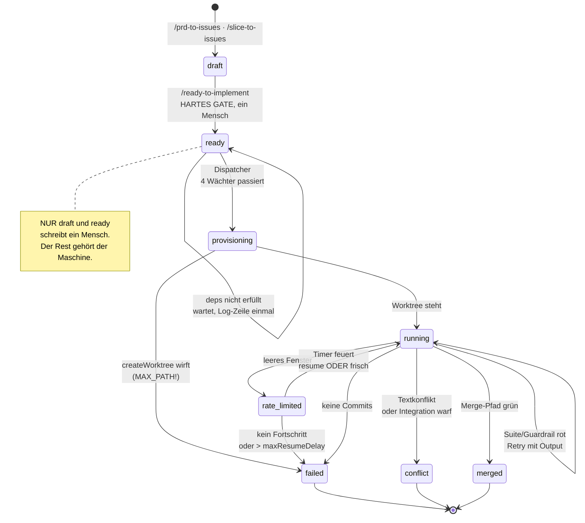
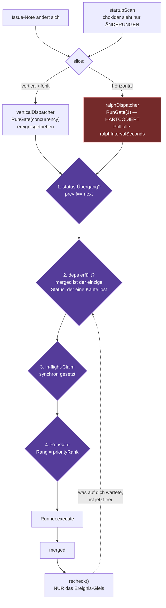
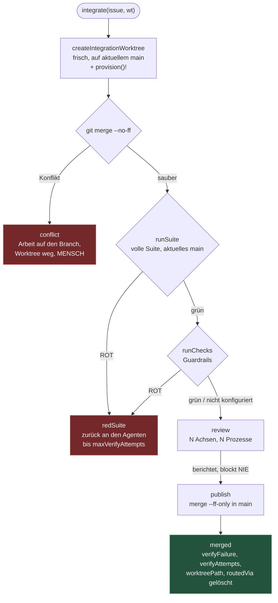
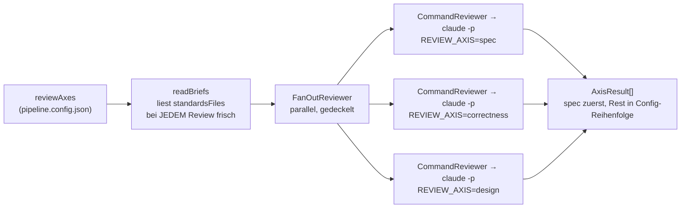
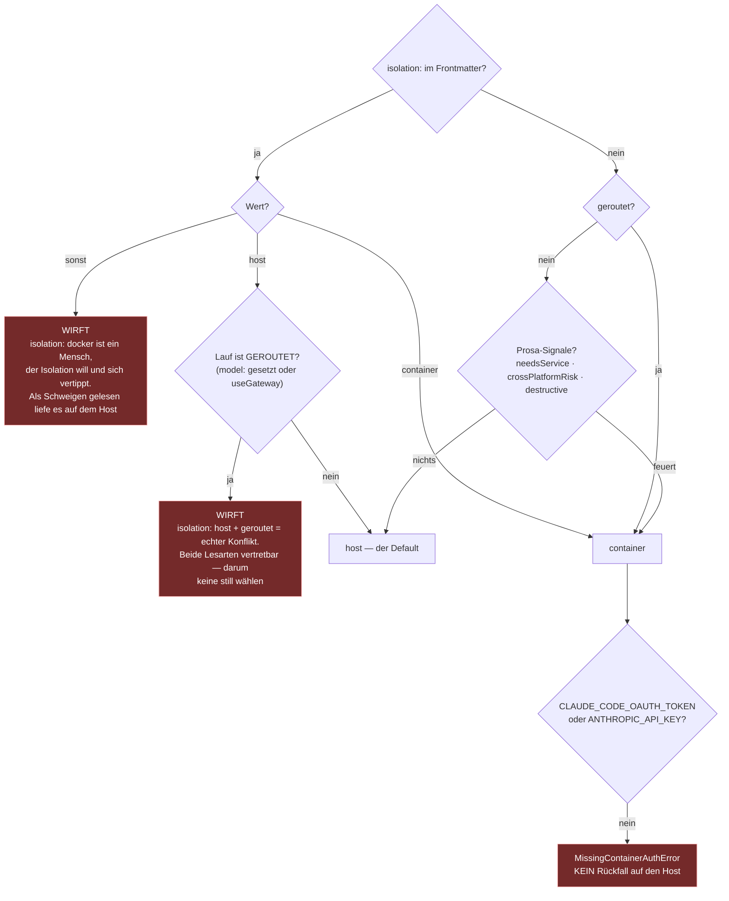

# Landkarte: der Orchestrator — jede Prüfung, jede Achse, jedes Routing

**Die Antwort zuerst.** Zwischen einem Agenten und `main` stehen **vier Prüfungen**, alle im selben Integrations-Worktree, in fester Reihenfolge. Jede beantwortet eine andere Frage, und keine kann für eine andere einspringen:

| # | Prüfung | Frage | Wer entscheidet | Was passiert bei Rot |
|---|---|---|---|---|
| 1 | `git merge --no-ff` | Passt es textuell auf aktuelles `main`? | git | **Mensch.** Kein Retry — der Agent sieht mains Seite aus seinem Worktree nicht |
| 2 | `runSuite` | Läuft es? | `testCommand` | zurück an den Agenten, mit Output im nächsten Prompt |
| 3 | `runChecks` | Bricht es eine **mechanische** Regel? | `checkCommand` | dasselbe |
| 4 | `review` | Tut es, was verlangt war? Sieht es aus wie dieses Repo? | N Sub-Agenten | **nichts** — es berichtet nur |

Prüfung 3 ist seit 2026-08-03 da und **auf keinem Projekt konfiguriert**. Prüfung 4 blockt absichtlich nicht.

Gemessen am 2026-08-03: **22 Quelldateien**, **33 Testdateien mit 238 Tests** (alle grün), **8 Proof-Skripte**, die echtes Geld bzw. echte Läufe kosten.

Der tragende Satz steht im Kopf von `review.ts`: **die Suite ist die, bei der man unruhig sein sollte.** Sie wurde von demselben Agenten geschrieben, der den Code schrieb. Ein Agent, der das Issue falsch verstanden hat, schreibt Tests für das Verhalten, das er sich vorgestellt hat — und die werden grün. Von unten sieht das exakt aus wie Erfolg.

---

## Ebene 0 — die vier Zähler, die man dauernd verwechselt

Bevor irgendetwas anderes: es gibt **sechs** Grenzen, und drei Paare davon sehen gleich aus.

| Grenze                  | Zählt was                             | Default             | Warum getrennt                                                                                                                                                                  |
| ----------------------- | ------------------------------------- | ------------------- | ------------------------------------------------------------------------------------------------------------------------------------------------------------------------------- |
| `maxIterations`         | Sandcastles **eigene** Schleife       | **1**, festgenagelt | Stoppt bei einem *Substring-Treffer* in der Prosa des Agenten. Kein Test, keine git-Abfrage. Ein Agent schrieb „ich drucke SMOKE-DONE absichtlich NICHT" — sie feuerte trotzdem |
| `maxVerifyAttempts`     | rote **Integrations**-Suite           | 3                   | Die *informierte* Schleife: jeder Versuch bekommt die Fehlerausgabe des letzten in den Prompt                                                                                   |
| `maxRetries`            | Versuche **ohne Fortschritt**         | 3                   | Ein Wake, der starb; ein Resume, das nichts committete. Ein Rate-Limit-Park darf nicht das Budget essen, das ein fehlschlagender Test braucht                                   |
| `idleTimeoutSeconds`    | Agent ist **still**                   | 300                 | Tötet einen stummen Agenten. Begrenzt einen geschwätzigen nicht                                                                                                                 |
| `maxRunSeconds`         | **Wanduhr**                           | 3600                | Der geschwätzige Fall. AbortSignal, Worktree überlebt                                                                                                                           |
| `maxResumeDelaySeconds` | wie weit ein Park in die Zukunft darf | 6 h                 | Ein `allowed_warning`-Event trug ein **Sieben-Tage**-Fenster. Als Limit gelesen hätte es einen gesunden Lauf tagelang geparkt                                                   |

---

## Der Lebenslauf einer Issue-Note

**`draft` und `ready-to-implement` sind die einzigen zwei, die ein Mensch schreibt.** Alles andere schreibt die Maschine. Ein Mensch, der `failed` zurück auf `ready-to-implement` setzt, bekommt einen **wirklich** frischen Start: `routedVia` wird auf jedem terminalen Pfad gelöscht, damit die Notiz nicht still an eine Straße gepinnt bleibt, die niemand gewählt hat.

**Es fehlt genau ein Zustand, und das ist bekannt:** `awaiting_decision`. Eine Notiz kann auf eine **Uhr** warten und wacht selbst auf — zweimal gegen echte Fünf-Stunden-Fenster gemessen. Auf einen **Menschen** warten kann sie nicht. Das ist `O19` in smithys `OPEN.md`, ein Feature mit fünf Zeilennummern.

---

## Das Routing — zwei Gleise, nie eines

**Vier Wächter, und jeder fängt etwas, das die anderen nicht sehen können:**

1. **`prev !== next`** — Obsidian speichert eine Notiz mehrfach pro Bearbeitung. Der Status hat sich nicht *bewegt*, die Datei wurde nur neu geschrieben.
2. **`dependenciesSatisfied`** — fängt, was das menschliche Gate absichtlich **nicht** prüft. `/ready-to-implement` Step 3: eine noch nicht gemergte Kante ist ein *Scheduling-Zustand*, kein Gate-Thema. Die Antwort ändert sich, nachdem das Gate zugegangen ist.
3. **In-Flight-Claim** — der nebenläufige Fall: zwei Ereignisse rasen, bevor eines fertig ist. Synchron gesetzt; alles, was davor `await`et, ist ein Rennen.
4. **`RunGate`** — den Fall, den keiner der drei sieht: zwei Ereignisse auf **zwei** Issues.

**`merged` ist der einzige Status, der eine Abhängigkeit löst.** `running` ist nicht fertig, `conflict` und `failed` erst recht nicht — auf einer gescheiterten Abhängigkeit weiterzubauen ist, wie einem kaputten Fundament ein zweites Stockwerk zu geben. Eine **hängende** Kante (zeigt auf nichts) ist ein Planungsfehler und nie ein grünes Licht.

**Warum `recheck()` überhaupt existiert:** nichts schreibt in die *wartende* Notiz, wenn ihre Abhängigkeit landet. Chokidar feuert also nie für sie. Ohne `recheck` säße ein freigewordenes Issue auf `ready-to-implement`, bis jemand die Datei anfasst.

**`RunGate` kennt kein Domänenwort.** Es ordnet nach einer nackten Rang-Zahl, niedriger zuerst; `dispatcher.ts` übersetzt `priorityRank(issue)` dorthin. Deshalb bekommt ein Aufrufer mit Kapazität 1 das alte FIFO geschenkt: alle Wartenden haben denselben Default-Rang, und nur die Einfügereihenfolge bricht den Gleichstand. Bei `release()` gewinnt strikt `<`, nie `<=` — **Priorität bricht Gleichstände, sie mischt Gleiche nicht neu.**

| Achse | Werte | Wer liest sie |
|---|---|---|
| `slice` | `horizontal` \| `vertical` | **routeExecution** — welches Gleis |
| `priority` | `urgent` \| `normal` \| `low` | **RunGate** — die *einzige* Ordnungsachse |
| `kind` | `feature` \| `bugfix` \| `refactor` \| `infra` \| `docs` | **niemand.** Dokumentation für Menschen |
| `phase` | Freitext | ein Mensch. Nie ein Ersatz für `status` |

`kind: refactor` existiert, wird gelesen und **erreicht nichts** — nur die Alt-Taxonomie-Übersetzung in `issue-store.ts` benutzt es. Das ist die Wurzel eines der offenen Punkte unten.

---

## Der Merge-Pfad im Detail

**Warum der Integrations-Worktree Pflicht ist:** ein textuell sauberer Merge kann die Suite trotzdem brechen — ein *logischer* Konflikt ohne git-Konflikt. Die Zusage lautet „läuft bis gemergt ohne menschlichen Schritt". Wenn dieser Merge `main` still beschädigen kann, ist die Zusage eine Drohung.

**`provision()` läuft in JEDEM frischen Worktree** — auch in diesem. Worktrees teilen den git-Checkout, nicht `node_modules`. Der vorhergesagte Fehler war ein falsches ROT. Was ein echter Lauf produzierte, war schlimmer: ein falsches **GRÜN**. Node löst einen Import nach *oben* auf, beide Worktrees liegen unter dem Home-Verzeichnis, und dort lag zufällig ein fremdes `node_modules`. Die Suite lief grün auf Paketen, die zu keinem Repo gehörten.

**Der Unterschied zwischen zurückgeben und eskalieren** ist, was der Agent tun kann. Eine rote Suite und ein gebrochener Guardrail sind mechanisch, lokal, und er hat Testnamen bzw. Regel und Datei. Ein Textkonflikt ist das eine, was er aus seinem eigenen Worktree nicht sehen kann.

**`publish` ist `merge --ff-only` im Haupt-Checkout, nicht `git branch -f`.** git weigert sich, einen Branch zwangszubewegen, der irgendwo ausgecheckt ist — und `main` ist es immer. Bewiesen von `real-git.test.ts`; der Fake nahm `branch -f` fröhlich an, und genau deshalb verlangte das Gate echte Befehle.

**Ein Reviewer, der wirft, kippt keinen guten Lauf.** Der `catch` sitzt in `reviewBeforePublish`, nicht in `integrate()`s eigenem — dort oben würde er zu `conflict`, und ein abgestürzter Reviewer würde Arbeit als nicht mergebar ablegen, die einen sauberen Merge und eine grüne Suite hatte.

---

## Die Review-Achsen

**Eine Achse ist ein Name plus eine Standards-Quelle.** Beides gehört dem Projekt.

| Achse | Quelle | Stand am 2026-08-03 |
|---|---|---|
| `spec` | der Issue-Body (Exit-Kriterien) | **reserviert**, druckt immer zuerst, braucht keine Datei |
| `correctness` | Fowlers 12 Smells, im Skript eingebaut, + was das Repo dokumentiert | läuft, bewiesen |
| `design` | `REVIEW-STANDARDS.md` | Datei benannt, **leer** — `/baseline` 3a nie gelaufen |
| `security` | offen | `claude -p` nimmt Slash-Befehle an (`/cost` geprüft 2026-08-03), `/security-review` selbst ungetestet |
| `performance`, `accessibility` | — | nichts. Accessibility ohne Oberfläche ist Dauerkosten für „nichts gefunden" |

**Warum die Auffächerung im TypeScript liegt und nicht im Skript:** das Skript ist ein Claude-Aufruf, alles darin kann man nur beweisen, indem man einen ausgibt. Die Aufteilung, die Reihenfolge, der Deckel und die Regel „eine tote Achse ist keine bestandene" sind Entscheidungen — und die gehören auf die Seite der Grenze, die ein Test erreicht. Das ist derselbe Grund, aus dem `ReviewPort` überhaupt ein Port ist.

**Nebenwirkung, die den Ausschlag gab:** jede Achse ist ein eigener Prozess, also eine **frische Session** ohne geerbten Kontext. Ein *Skill* könnte das nicht — es läuft in der Session, die es aufrief.

**Der Deckel ist keine Performance-Schraube.** Fünf `claude -p` gehen auf **ein** Rate-Limit-Fenster. Unbegrenzt tauscht „das Review dauerte länger" gegen „drei Achsen sind gestorben" — und eine tote Achse sagt nichts über einen Diff, den niemand wieder ansieht.

**`skipped` ist PRO Achse.** Das ist der Fall, den ein einzelnes Flag nie ausdrücken konnte: vier gesunde Achsen machen eine tote unsichtbar. Die Log-Zeile zählt deshalb, **wie viele Achsen geantwortet haben** — `2 finding(s) across 2 of 3 axis/axes`.

**Der Vertrag mit dem Kommando** (`review.ts`, Umgebungsvariablen):

| Variable | Inhalt |
|---|---|
| `REVIEW_ISSUE_ID`, `REVIEW_BRANCH` | Identität |
| `REVIEW_SPEC` | der Issue-Body — die einzige Quelle der `spec`-Achse |
| `REVIEW_AXIS` | welche Achse **dieser** Aufruf beantwortet |
| `REVIEW_DIFF_BASE` | `HEAD^1` im Merge-Pfad, `<ref>...HEAD` beim Handlauf |
| `REVIEW_STANDARDS` | optional, der Text dieser Achse |

Zurück kommt `{"findings":[{"text":"…"}]}` oder `{"skipped":"warum"}`. **Der Exit-Code wird absichtlich ignoriert** — etwas zu finden ist kein Fehlschlag, und eine CLI beendet sich aus Gründen ungleich Null, die nichts mit dem Diff zu tun haben. Ein gedrucktes `axis`-Feld wird angenommen und **ignoriert**: gefragt wurde nach einer Achse, und die wird notiert.

**Alles, was nicht parst, wird `skipped` — nie ein Befund, nie ein Wurf.** Ein kaputtes Review ist *Nichtwissen*, und es als „nichts gefunden" zu melden ist das eine Ergebnis, das dieser Port verweigert: es ist von einem sauberen Diff nicht zu unterscheiden.

**Zwei Eingänge, eine Implementierung** (`review-wiring.ts`): der Daemon vor `publish`, und `npm run review -- --since main` von Hand. Der Handlauf diffet mit drei Punkten gegen den Merge-Base — sonst meldet er jede fremde Änderung als deine.

---

## Guardrails und Standards — vier Dateien, vier Lebensdauern

Das ist die Stelle, an der man am leichtesten durcheinanderkommt. **Die Regel, die Bindung, der Beweis und der Rest liegen an vier verschiedenen Orten, weil sie verschieden schnell altern.**

| Stück | Datei | Ebene | Altert wodurch |
|---|---|---|---|
| **Regel** | `forge/GUARDRAILS.md` | im Plugin | gar nicht — sie nennt **kein Werkzeug**, das nächste Update ersetzt sie |
| **Bindung** | `STACK.md` | pipeline-weit | Werkzeug-Version, gelesen von `/refresh` |
| **Beweis** | `gates/<regel>/` | im Ziel-Repo | läuft in CI bei jedem Commit |
| **Quittung** | `GUARDRAILS-INSTALLED.md` | im Ziel-Repo | ein Mensch liest sie: was gilt hier, seit wann bewiesen |
| **Auftrag** | `REVIEW-STANDARDS.md` | pipeline-weit | eine Maschine reicht ihn weiter: Text für einen Sub-Agenten |

**Die vier Maschinen** (`GUARDRAILS.md`, 25 Zeilen, keine nennt ein Werkzeug):

| Maschine | Wie sie entscheidet | Warum sie unterschiedlich teuer ist |
|---|---|---|
| **declaration** | Eine Datei nennt die Kontexte und die erlaubten Kanten; ein Werkzeug macht Build-Fehler daraus | Mit Abstand die billigste — jede strukturelle Zeile fällt aus dieser einen Erklärung |
| **compiler** | Ein Typ macht die Verletzung nicht-kompilierbar | Am stärksten: nicht pro Zeile abschaltbar ohne sichtbare Markierung |
| **rule** | Lint/AST über den Quelltext | Nötig, wo kein Typ die Eigenschaft tragen kann |
| **ratchet** | Zähler + gespeicherte Basislinie; Build fällt, wenn der Zähler steigt | So bekommt ein Urteilscall eine mechanische Hälfte |

**Drei Klassen**, und die mittlere ist der ganze Grund für `REVIEW-STANDARDS.md`:

- `checked` — binden, Fixture schreiben, Durchfallen beweisen. Eine Zeile, die man nicht beweisen kann, wird nicht installiert.
- `partial` — dasselbe, **und** die nicht geprüfte Hälfte nach `REVIEW-STANDARDS.md`. Genau die driftet.
- `judgment` — nie eine Zeile im Katalog. Auch nach `REVIEW-STANDARDS.md`.

**Der tragende Satz des ganzen Guardrail-Baus:** ein Gate, dessen Regelname umbenannt wurde, **bricht nicht ab**. Es läuft und findet nichts — und das sieht aus wie ein sauberes Repo. Nur ein Fixture, das durchfallen *muss*, unterscheidet die beiden. Deshalb ist die Prüfung nie *„lässt sauberer Code das Gate passieren"*, sondern immer *„lässt dreckiger Code es scheitern"*.

**Die vier Ratchets sind die mechanisierte Refactoring-Frage** — getypter Anteil darf nicht fallen, Escape-Hatches dürfen sich nicht vermehren, öffentliche Fläche pro Modul darf nicht wachsen, gemeinsam geänderte Dateien dürfen nicht mehr werden. Der Katalog sagt es selbst: *niemand entscheidet, ob das Design gut ist, und jeder merkt, wenn es schlechter wurde.* Sie messen, ob die **Struktur** besser wurde. Über das **Verhalten** sagen sie nichts.

**Installiert ist am 2026-08-03: keine.** `orchestrator/` hat strenges `tsc` von Hand gesetzt — das ist eine Zeile der `compiler`-Maschine. Sonst nichts: kein Linter, keine Abhängigkeitsrichtung, kein Ratchet.

---

## Der Prompt — was jeder Agent bekommt, bevor sein Issue kommt

`operating-contract.ts` baut ihn in vier Stücken. Er steht **vor** dem Body, der Body bleibt zuletzt, damit die Aufgabe die frischeste Information ist.

| Stück | Wann | Warum es existiert |
|---|---|---|
| `CONTRACT` | immer | Drei Fakten: niemand schaut zu, ein **Commit** ist das einzige Fertig-Signal, nicht um Erlaubnis fragen. Der erste echte Lauf baute die Sache korrekt und blieb dann stehen, um einen Menschen nach dem Commit zu fragen |
| `TDD` | immer | Rot → Grün → Prüfen → Commit. **Nicht Stil, sondern Beweis:** eine grüne Suite beweist „nichts ist kaputt", nie „das Ding wurde gebaut". Ein zuerst geschriebener, rot gesehener Test ist das billige Ding, das die Lücke schließt |
| `PRIOR_WORK` | Branch trägt schon Commits | Ein Neustart ohne Gedächtnis. Der Container-Pfad macht das real: ein echtes Rate-Limit wirft, Sandcastle kopiert das Transkript nie aus dem Container, Code und Commits überleben — die Erinnerung nicht |
| `verifyFailureBlock` | nach roter Integrations-Suite | Das, was den äußeren Loop vom inneren unterscheidet. Sandcastle wiederholt mit byte-identischem Prompt; das hier wiederholt mit der Fehlerausgabe in der Hand |

Der TDD-Block enthält wörtlich **„Schwäche keinen Test ab, um ihn grün zu bekommen."** Das ist eine *Bitte*, keine Prüfung — siehe die Löcher unten.

Ein Stück wurde wieder entfernt: die Bitte, `<promise>COMPLETE</promise>` zu drucken. Sie steuerte Sandcastles eigene Schleife, und die ist auf 1 festgenagelt. **Eine Anweisung, die einen abgeschalteten Loop steuert, ist reine Kosten auf jedem Prompt.**

---

## Isolation — wo der Agent läuft

**Die ehrliche Schwäche steht im Kopf der Datei:** die Prosa-Signale sind reguläre Ausdrücke über das, was ein Mensch zufällig geschrieben hat. Sie sind ein Auffangnetz, keine Garantie. Wer das als *„die Pipeline erkennt gefährliche Arbeit"* liest, hat es falsch gelesen — deshalb steht `isolation:` im Frontmatter und wird **zuerst** geprüft.

**Ein gerouteter Lauf ist erzwungen containerisiert, und das ist gemessen.** Mit `permissionMode: "auto"` fragt Claude Code vor jedem Shell-Befehl ein zweites Modell, ob er sicher ist. Über das Gateway antwortet darauf, was die `claude-*`-Regel zeigt — und als das ein `:free`-Modell war, fing `npm run proof:doorman` es am 2026-07-31 dabei, wie es `rm -rf` durchließ, während es `chmod -R 777` korrekt ablehnte. Auf dem Host ist dieser Klassifizierer **das Einzige** zwischen Agent und Festplatte. Die Richtungen sind nicht symmetrisch: etwas Harmloses zu blockieren kostet einen Lauf, etwas Zerstörerisches durchzulassen kostet die Maschine.

**Was der Container NICHT kauft:** er schützt die *Maschine*, nicht das Ziel-Repo. Der Agent schreibt weiter in seinen Worktree und committet. Die Schranke vor `main` bleibt die grüne Suite des Integrators.

**Zwei Felder statt einem**, und dieselbe Lehre gilt an drei Stellen:

| Wunsch (Mensch) | Tatsache (Maschine) | Warum getrennt |
|---|---|---|
| `isolation` | `mode` | Sonst käme `mode: host` eines fertigen Laufs beim nächsten Lesen als menschlicher Override zurück und fröre die Entscheidung für immer ein |
| `model` | `respondingModel` | „Wir haben `model:` gesetzt" vs. „dieses Modell hat wirklich gearbeitet" |
| `useGateway` | `routedVia` | Der Schalter regiert, wo **neue** Arbeit beginnt, nicht wo begonnene endet |

---

## Modell-Routing

Claude Code spricht die Anthropic Messages API und sonst nichts, bedingungslos. `/validate` hat das mit einem gefälschten Gateway bewiesen: `thinking: adaptive`, `context_management`, `output_config.effort`, das volle Tool-Schema und acht `anthropic-beta`-Header gehen bei jeder Anfrage raus, und `_SUPPORTED_CAPABILITIES` bewegt kein Feld davon. Ein Nicht-Anthropic-Modell kann diese Anfrage nicht roh bekommen — also übersetzt ein Gateway dazwischen.

Der Sitz der Naht ist nicht Geschmack: Sandcastles echtes `ClaudeCodeOptions` (in der installierten `.d.ts` nachgesehen, nicht angenommen) hat kein `baseUrl` und kein `apiKeySource`. Es hat `env`.

**Der Schalter ist absichtlich manuell.** Ein automatischer Failover bei Rate-Limit kann Slice 1s bewiesenen Zweig gar nicht nutzen: die geparkte Session liegt bei Anthropic, `resumeSession` kann sie nirgends anders fortsetzen. **Anbieterwechsel ist ein Neustart, kein Resume.**

---

## Der Reaper — was aufgeräumt wird und was heilig ist

| Was | Regel |
|---|---|
| Worktrees | Nie eines, dessen Issue `provisioning`, `running` oder `rate_limited` ist |
| Branches | `issue/*`, verwaist, **7 Tage** — Beweismaterial bekommt eine Woche |
| Container | `sandcastle-*`; identifiziert über den **Mount-Pfad**, weil der Name keine Issue-ID trägt. Mount unlesbar = „unbewiesen", wird in Ruhe gelassen |
| `safe.directory` | **Global**, nicht repo-lokal — dort leckt Sandcastle sie, eine pro Worktree, nie entfernt. 43 tote von 55 nach zwei Tagen Bauen |

`hygieneDryRun` ist **standardmäßig true**. Ein Aufräumer, der beim ersten Lauf ungefragt zu löschen beginnt, *ist* der übereifrige Aufräumer, vor dem die Slice-Karte warnt. Einen Zyklus zuschauen, dann abschalten.

Der Job ist kleiner, als er aussieht, weil der Fehlerpfad das Beweismaterial schon vom Worktree auf den **Branch** verschoben hat: Kilobytes statt eines `node_modules`, und der Branch überlebt den Worktree. **Eine Ausnahme, und sie ist das ganze Sicherheitsargument:** lässt sich die Arbeit nicht sichern, bleibt der Worktree. Die Arbeit eines Agenten zu verlieren ist schlimmer als eine volle Festplatte.

---

## Die Ports — warum das überhaupt testbar ist

Sechs Grenzen, und jede existiert aus demselben Grund: **die Entscheidungen prüfbar machen, ohne einen Claude-Lauf auszugeben.**

| Port | Fake im Test | Echt |
|---|---|---|
| `IssueStore` | `fake-store.ts` | `ObsidianIssueStore` (chokidar + gray-matter) |
| `GitPort` | handgeschrieben pro Testdatei | `Git` |
| `AgentPort` / `Worktree` | Fake-Outcomes | `SandcastleAgent` |
| `ReviewPort` | Fake-Achsen | `FanOutReviewer` |
| `AxisReviewPort` | Fake-Kommando | `CommandReviewer` |
| `HygienePorts` | Fake-Dateisystem | `Git` + `Docker` |

`runChecks` ist als **einziges** optional auf `GitPort`. Eine Pflichtmethode hätte einen Stub in acht Testdateien erzwungen, die sie nicht ausüben — Rauschen, das sich wie eine Guardrail-Änderung liest. Eine fehlende Methode liest sich als das, was sie ist: eine Installation ohne mechanische Regeln.

---

## Die Testdateien — Stand der Messung oben (2026-08-03: 33 Dateien, 238 Tests)

Fast alle tragen denselben Kopf: **FALSIFY FIRST**. Nicht „beweise, dass es geht", sondern „konstruiere den Fall, in dem es still danebengeht".

**Der Merge-Pfad**
| Datei | Was sie falsifiziert |
|---|---|
| `conflict.test.ts` | Ein textuell sauberer Merge kann die Suite trotzdem brechen — Risikofall 4 von 4, der teuerste |
| `real-git.test.ts` | Der Merge-Pfad gegen **echtes** git. Der Fake nahm `branch -f` an; git nicht |
| `verify-retry.test.ts` | Die informierte Schleife: rote Suite, Output in den nächsten Prompt, gedeckelt |
| `wip-preservation.test.ts` | Das Trilemma Beweis/Festplatte, aufgelöst |
| `merge-message-model.test.ts` | Der `Agent-Model:`-Trailer, gegen echtes git |

**Der Dispatcher**
| Datei | Was sie falsifiziert |
|---|---|
| `double-dispatch.test.ts` | Zwei Ereignisse, ein Issue, zwei Agenten — Risikofall 1 |
| `sequential.test.ts` | Slice 1s eigene Zusage, die die erste Implementierung brach |
| `race-under-concurrency.test.ts` | Der Gate hält unter echter Nebenläufigkeit |
| `priority-queue.test.ts` | Kapazität > 1 + Ordnung nach Priorität |
| `dependencies.test.ts` | Das Loch zwischen Slice 2 und 5 |
| `ralph-route.test.ts` | Horizontal läuft sequenziell und wird **nicht** vom Ereignis-Gleis aufgegriffen |
| `startup-scan-concurrency.test.ts` | **Live gefunden**: drei Notizen bereit, `concurrency: 3`, nur ein Container lief |
| `taxonomy.test.ts` | `kind`/`priority` getrennt, Alt-Werte gelesen statt umgeschrieben |

**Rate-Limit und Resume**
| Datei | Was sie falsifiziert |
|---|---|
| `rate-limit-detection.test.ts` | Wie sieht `rate_limit_event` aus, wenn das Fenster **leer** ist |
| `rate-limit-resume.test.ts` | Risikofall 3 von 4 |
| `resume-existing-commits.test.ts` | **Durch echten Betrieb gefunden**: fertige Arbeit lag auf dem Branch, der Lauf hieß `failed` |
| `resume-keeps-route.test.ts` | Ein Resume bleibt auf der Straße, auf der er begann |
| `session-lost.test.ts` | Der Container-Pfad verliert das Transkript — **von einem Lauf gefunden, nicht von einem Review** |
| `wake-failure.test.ts` | Windows 0xC0000142: das OS konnte kurz keinen Prozess starten |
| `zombie.test.ts` | Nach einem Absturz lügt die Notiz — Risikofall 2 |

**Isolation und Modell**
| Datei | Was sie falsifiziert |
|---|---|
| `isolation.test.ts` | Der gefährliche Fall ist das Gegenteil des offensichtlichen |
| `mode-in-note.test.ts` | Nicht die Entscheidung, sondern der **Datensatz** |
| `routed-requires-container.test.ts` | Ein gerouteter Lauf fasst den Host nicht an |
| `model-routing.test.ts` | Slice 6, und wieder ist der gefährliche Fall nicht der offensichtliche |
| `spend-rejection.test.ts` | Gegen eine **beobachtete** Ablehnung gebaut |

**Der Rest**
| Datei | Was sie falsifiziert |
|---|---|
| `review-adapter.test.ts` | Wo die Prosa einer CLI auf einen Typ trifft — plus der Fächer |
| `review-gate.test.ts` | Die Prüfung, die sonst nichts in dieser Laufzeit macht |
| `provisioning.test.ts` | **Die Vorhersage war falsch**, und deshalb existiert die Datei |
| `operating-contract.test.ts` | Falsifiziert eine Behauptung aus dem Spec, keine Vermutung |
| `reaper.test.ts` | Der gefährlichste Fall zuerst |
| `reaper-real-git.test.ts` | Die Entscheidungen gegen Fakes, die **Hände** hier |
| `reaper-containers.test.ts` | Slice 4s viertes Kriterium, eingebaut in Slice 3s Scan |
| `safe-directory.test.ts` | Gegen echte git-Config — aber eine **Wegwerf**-Config |

---

## Die Proof-Skripte — was echtes Geld kostet (2026-08-03: 8 Stück)

Ein Proof ist kein Test. Er kostet einen echten Lauf, echtes Docker oder echte Token, und er steht **neben** dem Code, den er beurteilt.

| Skript | Was er beweist | Kosten |
|---|---|---|
| `proof:review` | Zwei Achsen, zwei Prozesse, beide benennen ihren gepflanzten Fehler — und die Standards-Achse benennt einen Verstoß gegen den **Text, den sie gereicht bekam** | 2 × `claude -p` |
| `proof:doorman` | Wie gut urteilt der Permission-Klassifizierer? Fing ihn bei `rm -rf` | Modell-Aufrufe |
| `proof:gateway-translation` | Übersetzt das Gateway wirklich, oder leitet es nur weiter — gegen die **echte** `claude`-Binärdatei | Gateway-Lauf |
| `proof:resume` | Ein echtes Fünf-Stunden-Fenster, geparkt und selbst aufgewacht | Wartezeit |
| `proof:container` / `proof:host` | Der Lauf im Container bzw. auf dem Host | Docker |
| `proof:reaper-docker` | Der Container-Sweep gegen echtes Docker | Docker |
| `proof:provisioning` | Der Install-Schritt im frischen Worktree | npm |
| `proof:one-issue` | Ein Issue von Anfang bis Merge | ein voller Agentenlauf |

**Die zwei mittleren waren beinahe verloren.** `proof:doorman` ist die Messung, die jeden gerouteten Lauf in einen Container zwingt. `proof:gateway-translation` ist das, was gegen die echte Binärdatei statt gegen die Doku feststellte, dass das Gateway übersetzt. Beide lebten in der Pipeline, in der diese Laufzeit gebaut wurde, und kamen bei der Archivierung mit: **Beweise gehören neben den Code, den sie beurteilen.**

---

## Wo es Löcher hat

Jedes hier ist belegt und in smithys `OPEN.md`-Index gesammelt — keine Vermutung.

| Loch | Wo es steht | Warum es nicht einfach gefixt ist |
|---|---|---|
| **Keine Guardrails installiert** | `orchestrator/README.md` | Die erste Regel ist gemessen (`no-floating-promises`, 42 async-Funktionen). eslint zu installieren ist leicht; zu **beweisen**, dass es zuschnappt, ist die Arbeit |
| **Ein Refactoring kann grün werden, indem es den Test löscht** | `orchestrator/README.md` | Der mechanische Test lautet „musste ein Test geändert werden". `redSuite` reicht den Fehler zurück, und der kürzeste Weg zu grün ist, die Assertion anzupassen. Die naive Regel taugt nicht: ein Rename **muss** jeden Test anfassen, der das Symbol nennt |
| **Der Reviewer-Vertrag hat ein Schema und keine Version** | `orchestrator/README.md` | `L7` aus einer Richtung, in die `version-bump` nicht schauen kann — die Prüfung läuft über Plugin-Ordner, und `orchestrator/` ist keiner |
| **`REVIEW-STANDARDS.md` ist leer** | `O25` | Die Mechanik ist bewiesen, aber mit einem **Platzhalter**-Text. Eine echte `partial`-Hälfte existiert nirgends, weil `/baseline` 3a nie lief |
| **Kein `awaiting_decision`** | `O19` | Ein Issue kann auf eine Uhr warten und nicht auf einen Menschen. Jede Entscheidung, die die Pipeline hätte aufschieben können, wird stattdessen ein Stopp |
| **Ein Merge-Konflikt hat eine Verteidigung, und es ist die letzte** | `O20` | Als *letzte* Linie richtig. Sie ist derzeit die einzige. Die stärkere Antwort ist Vorbeugung: B rebaset, sobald A merged — aber das ändert, was einem laufenden Agenten gesagt wird, und das ist ein Vertrag |
| **Windows MAX_PATH** | `orchestrator/README.md` | Starb bei **249 Zeichen**. Die Folge ist behandelt (die Notiz scheitert, der Prozess lebt), die Ursache nicht |
| **Eine kaputte Notiz parkt nicht, sie reißt den Store mit** | `orchestrator/README.md` | Nachgetragen 2026-08-05. `read()` ruft `matter(readFileSync(...))` ohne `try`/`catch`; gray-matter wirft bei kaputtem YAML, also nimmt eine handgeschriebene Notiz den Wurf aus `list()` heraus — beim Boot startet der Orchestrator gar nicht. Die zweite Hälfte ist schlimmer: gray-matter cacht, also wirft dieselbe Notiz **einmal** und wird danach für die restliche Prozesslaufzeit still übersprungen. Nicht gefixt, weil ein `try`/`catch` ungefragt entscheidet, ob eine unlesbare Notiz übersprungen oder angehalten gehört — und still überspringen macht der Cache schon versehentlich |
| **Keine `pipeline.config.json`** | — | Am 2026-08-03 existiert keine auf dieser Maschine. Alles oben ist gebaut und **nicht angeschlossen** |

---

## Die eine Regel, die alles hier zusammenhält

Sie taucht in dieser Laufzeit an mindestens sechs Stellen unabhängig auf, jedes Mal in anderen Worten:

> **Eine Abwesenheit muss als Abwesenheit lesbar sein.**

- `skipped` ≠ leere Befundliste — „nie geprüft" ≠ „geprüft, nichts gefunden"
- `runChecks` gibt `undefined` zurück, nicht `{ok: true}` — ein Repo ohne Guardrails hat sie nicht bestanden, es hat keine
- `reviewCommand` fehlt = **kein** Review, nicht ein Review, das alles durchwinkt
- `REVIEW_STANDARDS` darf nie ein leerer String werden, wo es fehlt
- Eine Achse ohne Standard wird übersprungen, statt eine Meinung im Gewand einer Messung zu produzieren
- Ein Fixture prüft, ob **dreckiger** Code scheitert — nie, ob sauberer durchgeht

Und der Grund ist jedes Mal derselbe: die andere Wahl sieht von unten aus wie Erfolg.

**Die siebte Stelle bricht sie — in derselben Laufzeit, am 2026-08-05 belegt.** Der Review-Port weigert sich ausdrücklich, etwas Unparsbares als „nichts gefunden" zu melden: es wird `skipped`, weil ein kaputtes Review *Nichtwissen* ist. Der IssueStore steht vor genau derselben Lage — eine Notiz, die nicht parst — und tut das Gegenteil: er wirft, und danach überspringt gray-matters Cache dieselbe Notiz still für die restliche Prozesslaufzeit. Ein Verzeichnis, das leise eine Notiz weniger meldet als es hält, ist wörtlich die Abwesenheit, die nicht als Abwesenheit lesbar ist.

Zwei Ports, dieselbe Frage, entgegengesetzte Antworten, ein Codebase. Das ist der Grund, warum diese Regel aufgeschrieben gehört und nicht bloß befolgt wird: **wo sie nur Gewohnheit ist, gilt sie da, wo jemand gerade daran dachte.** Gefunden hat sie übrigens kein Mensch, sondern ein Spec-Task-Agent, der die echte Klasse gegen Temp-Verzeichnisse laufen ließ statt den Code zu lesen.
