# Landkarte: alle smithy-Skills, ihre typisierten Links und ihr Routing

**Die Antwort zuerst.** Es gibt **41 Skills** in **sechs Plugins** (gemessen 2026-08-08 mit `node tools/smithy-lint/lint.mjs`). Fünf davon sind Frameworks, das sechste (`landscape/`, Plugin-Name `smithy`) ist die Doktrin, die die anderen fünf lesen und keines schreibt.

Du erreichst **nie** einen Skill über einen anderen Framework-Skill. Es gibt genau drei *mechanische* Wege hinein:

1. **Über einen Router** — sechs Stück, einer pro Plugin. Das ist der Normalweg.
2. **Über ein typisiertes Artefakt** — ein Producer schreibt es, ein Consumer liest es. Fünf Stück.
3. **Über eine geteilte Datei** — genau ein schreibendes Framework, benannte Leser. Zehn Stück.

Das ist die Frage *„wie komme ich technisch hin"*. Die andere Frage — **„welchen Weg nehme ich überhaupt"** — steht davor und ist Ebene −1, gleich unten.

Zwei Skills sind Subroutinen und haben keinen echten Einstieg: `/errand` und `/inspect`. Alle anderen 37 tragen `disable-model-invocation: true` — sie feuern nie von selbst, du rufst sie.

Diese Karte zeichnet nach, was `smithy-lint` aus den Skill-Dateien selbst zieht. Sie ist keine zweite Wahrheit: die Rückrichtung jeder Beziehung (`auto_*`) ist generiert, nie von Hand geschrieben. Warum das zählt, steht in [[system-strengths]] A15.

---

## Ebene −1 — welchen Weg nehme ich überhaupt?

Die Entscheidung **vor** jedem Router. Fünf Wege, und der teure ist die Ausnahme, nicht die Eingangstür.

**Die erste Frage ist nicht „wie groß ist das", sondern: betrifft es das Produkt oder die Maschinerie?** Eine Idee für das, was du baust, geht durch Forge/Foundry. Ein Befund über das, *womit* du baust — ein Skill sagt etwas Falsches, das Runtime kam nicht weiter, ein Gate fehlt — geht nie dorthin. Das ist Weg 5, und die meisten verwechseln ihn mit einem Feature-Wunsch.

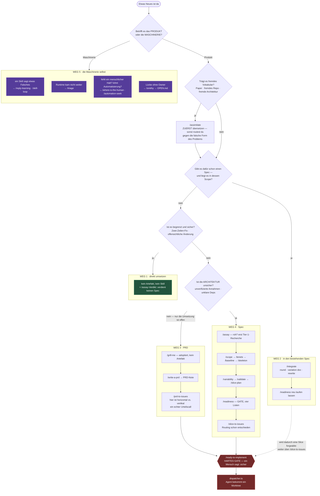

### Die Frage, die jeden Weg entscheidet

| Weg | Wann | Die entscheidende Frage | Kosten, wenn du falsch liegst |
|---|---|---|---|
| **1 · direkt** | Zwei-Zeilen-Fix, offensichtliche Änderung | Ist überhaupt etwas *unsicher*? | Fast keine. Der billige Weg ist der Normalfall |
| **2 · `/integrate`** | Der Spec existiert, die Idee liegt in seinem Scope | Ist das eine Erweiterung von X — oder ein anderes Thema, das gerade reinplatzt? | Bei „anderes Thema": du routest gegen die Invarianten des falschen Specs. Dann frisch `/scope` |
| **3 · PRD** | Frische Idee, Architektur ist klar, nur die Umsetzung ist offen | — | Du überspringst Forge bei echter Architektur-Unsicherheit → `/prd-to-issues` **rät** bei Abhängigkeiten und Blockern, die `/validate` sauber aufgedeckt hätte |
| **4 · Spec** | Architektur wirklich unsicher: unverifizierte Annahmen, unklare Deps | Was weiß ich hier *nicht*, das den Bauplan ändern würde? | Ein voller Forge-Durchlauf auf einem Zwei-Zeilen-Bugfix verhandelt Sicherheit neu, die nie in Frage stand |
| **5 · Maschinerie** | Ein Befund über das Werkzeug, nicht über das Produkt | Sagt ein *Skill* etwas Falsches, oder ist das *Produkt* falsch? | Ein Framework-Befund, der als Feature-Ticket landet, verschwindet — er hat dort keine Warteschlange und keinen Owner |

**Weg 3 vs. Weg 4 ist die einzige echt schwierige Wahl**, und der Korpus formuliert sie als Kosten statt als Regel (`foundry/README.md`): keiner der beiden ist fatal, beide sind Verschwendung in entgegengesetzte Richtungen. Der Test lautet nicht „ist es groß", sondern **„ist die Architektur unsicher"**. Ein großes, aber verstandenes Feature nimmt Weg 3.

**Weg 1 ist ausdrücklich ein Verdikt, kein Weglassen.** `/assay` darf mit *„verdient keinen Spec"* enden — die gesamte Forge-Pipeline wird dann nie betreten. Das ist gebaute Doktrin: die Beweislast liegt auf *„warum brauche ich das Schwere"*, nie umgekehrt.

**`/assimilate` ist kein Weg, sondern ein Vorschritt.** Es steht vor allen anderen, wenn die Idee fremdes Vokabular trägt. `/integrate` Schritt 0 löst es automatisch aus.

**Ein Fall fehlt in dem Bild oben, und er kommt bei mehreren Domänen ständig vor: zwei Specs, die voneinander abzuhängen scheinen.** Weg 2 passt nicht — die Idee liegt nicht im Scope des einen, sondern zwischen beiden. Weg 4 auch nicht — es ist kein neuer Spec, sondern ein Fakt, den beide brauchen. Dafür gibt es seit 2026-08-08 `/gauge`. Der Satz, der die Sache trägt: **eine wechselseitige Abhängigkeit zwischen zwei Specs ist eine Zusage, die noch niemand benannt hat.** Zieht man sie heraus, wird aus A↔B ein A→V←B, und die Frage „welcher Spec zuerst" verschwindet, statt beantwortet zu werden. `/scope` Schritt 3 stellt sie selbst, du musst also nicht daran denken.

Die Begründungen dahinter stehen in [[idea-intake-routing]] (die vier Ausgangslagen einer Idee, `/integrate`s Vorfragen Step −1/0, die Drei-Wege-Entscheidung) und [[lightweight-exits]] (warum der billige Pfad der Normalfall ist, der Vier-Wege-Test, `/errand`s Gewichts-Schwelle). Hier steht das Bild, dort das Warum — keine zweite Kopie.

---

## Legende: die acht Linktypen

Jeder Skill deklariert seine Beziehungen in der Frontmatter. Das **Präfix sagt, wer das Feld geschrieben hat** — das ist selbst eine Regel des Korpus.

| Typ | Präfix-Klasse | Bedeutung | Im Diagramm |
|---|---|---|---|
| `reads:` | authored, **geprüft** | Skill liest diese Datei | durchgezogen `-->` |
| `writes:` | authored, **geprüft** | Skill schreibt diese Datei | dick `==>` |
| `mentions:` | authored, **geprüft** | Skill nennt die Datei in Prosa, liest und schreibt sie aber nicht | gepunktet `-.->` |
| `schema:` | authored, **geprüft** | Skill besitzt das Schema der Datei — migriert es beim ersten Lesen (`L7`) | Marke `§` |
| `produces:` | authored, **geprüft** | Skill erzeugt ein typisiertes Artefakt | Pfeil im Wiring-Diagramm |
| `consumes:` | authored, **geprüft** | Skill verbraucht ein typisiertes Artefakt | Pfeil im Wiring-Diagramm |
| `gates:` | authored, **geprüft** | Skill hostet ein Gate (hart oder weich) | Raute |
| `note_calls:` | authored, **ungeprüft** | Skill ruft einen anderen Skill auf. Das Präfix `note_` **ist** der Disclaimer | gestrichelt |
| `auto_*` | **generiert** | die Rückrichtung — wer liest mich, wer ruft mich, welcher Router erreicht mich | nie von Hand |

**Warum `note_calls` bewusst ungeprüft bleibt:** Skill-zu-Skill-Aufrufe sind in Prosa real. `O12` hat geklärt, was sie *bedeuten*, ohne sie prüfbar zu machen — ein Aufruf nennt entweder einen exempten Skill oder einen Schritt, der es dir sagt und beim Wiedereintritt verifiziert, und nur das Lesen des Schritts sagt dir, welches von beiden. Ein heute geschriebener Check hätte über das Korpus recht und über die Regel unrecht.

---

## Ebene 0 — das Landscape

Sechs Plugins, ein Marketplace. Plus das Runtime, das **kein** Plugin ist.

**Jede Skill-Zahl im Diagramm und in der Tabelle weiter unten stammt aus der einen Messung oben** — 2026-08-05, `node tools/smithy-lint/lint.mjs`. Sie steht bewusst nur an dieser einen Stelle und nicht elfmal daneben: eine Zahl ohne Datum sieht frisch aus, egal wie alt sie ist, und elf Wiederholungen desselben Datums veralten elffach statt einfach. Kommt ein Skill dazu, ist der Anker hier zu erneuern, dann stimmen die Zählungen wieder alle zusammen.

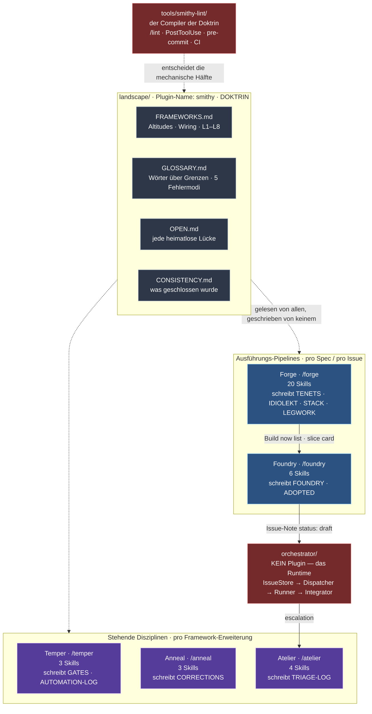

**Die wichtigste Aussage dieses Bildes:** Forge und Foundry sind **Pipelines** — ein Spec oder ein Issue fließt hindurch, eines nach dem anderen. Temper, Anneal und Atelier sind **stehende Disziplinen** — sie werden ausgelöst, wenn ein *Framework* sich ändert oder ein Team wächst, nie von einem einzelnen Spec. Lies die fünf **nicht** als eine lineare Folge. Ein Issue „betritt" Temper nie so, wie es Foundry betritt.

---

## Ebene 1 — Routing pro Framework

Ein Router pro Plugin. Immer der Einstieg, immer `disable-model-invocation: true`, immer mit `argument-hint` — der Frage, die er dir stellt, wenn du ihn ohne Argument rufst.

### Forge · `/forge`

> *„What are you trying to do with your spec?"*

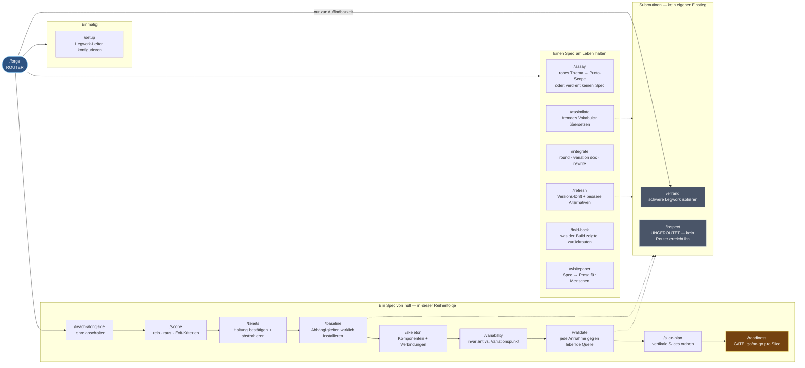

`/inspect` ist der einzige Skill im ganzen Landscape, den **kein** Router erreicht (`unroutedSkills`). Er hat keinen kalten Einstieg — er läuft immer in einem der vier Skills, die ihn rufen. `/errand` ist ebenfalls eine Subroutine, wird aber von `/forge` geroutet, damit man ihn **findet**; das ist nicht dasselbe wie ein Einstiegspunkt.

### Foundry · `/foundry`

> *„What are you trying to get running?"*

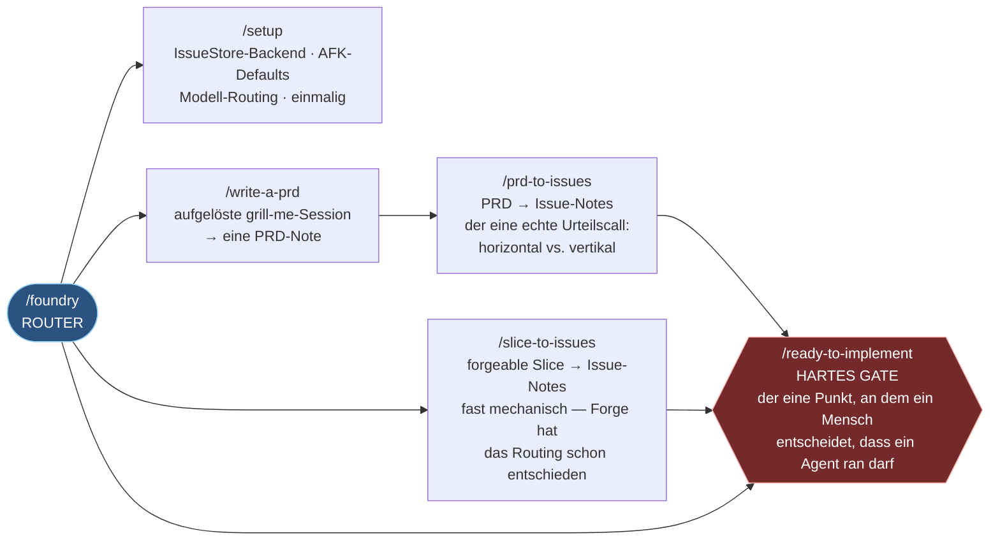

### Temper · `/temper`

> *„What are you deciding — where a gate belongs, or whether automation is worth it?"*

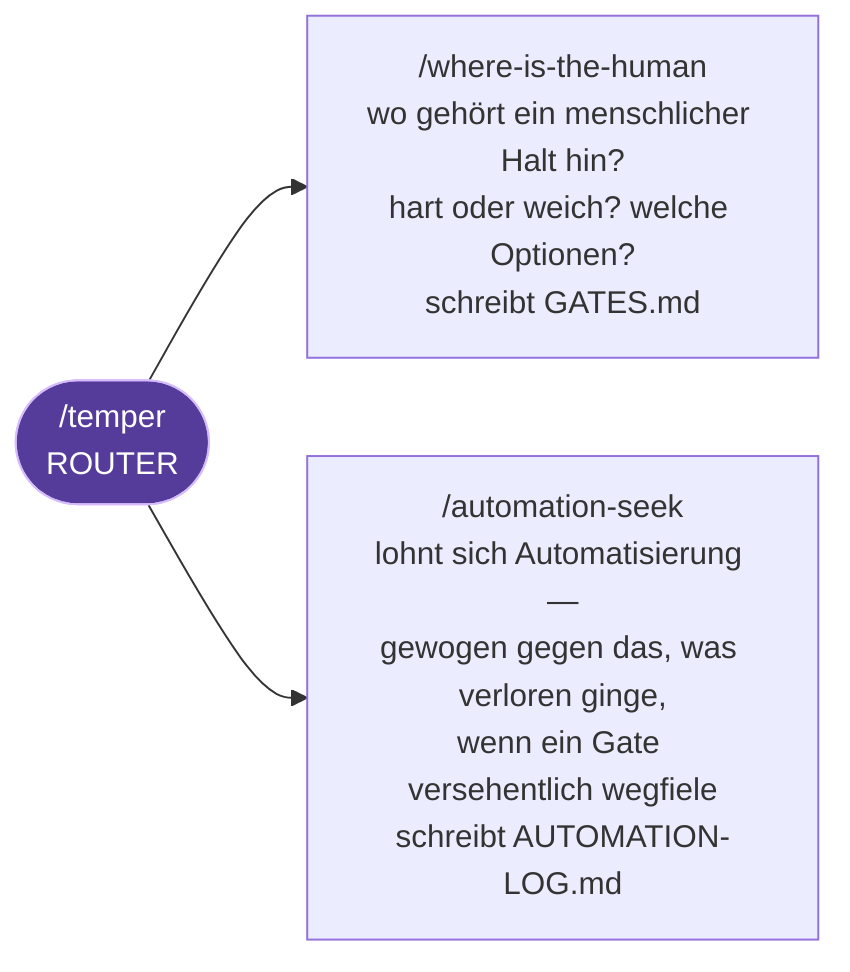

Temper läuft **nie** zur Issue-Zeit — nur, wenn ein Framework gebaut oder erweitert wird. Das Gate, das es platziert, wird von dem Framework ausgeführt, dem der Moment gehört (`L2`).

### Anneal · `/anneal`

> *„Are you reviewing a skill deliberately, or logging something the agent just got corrected on?"*

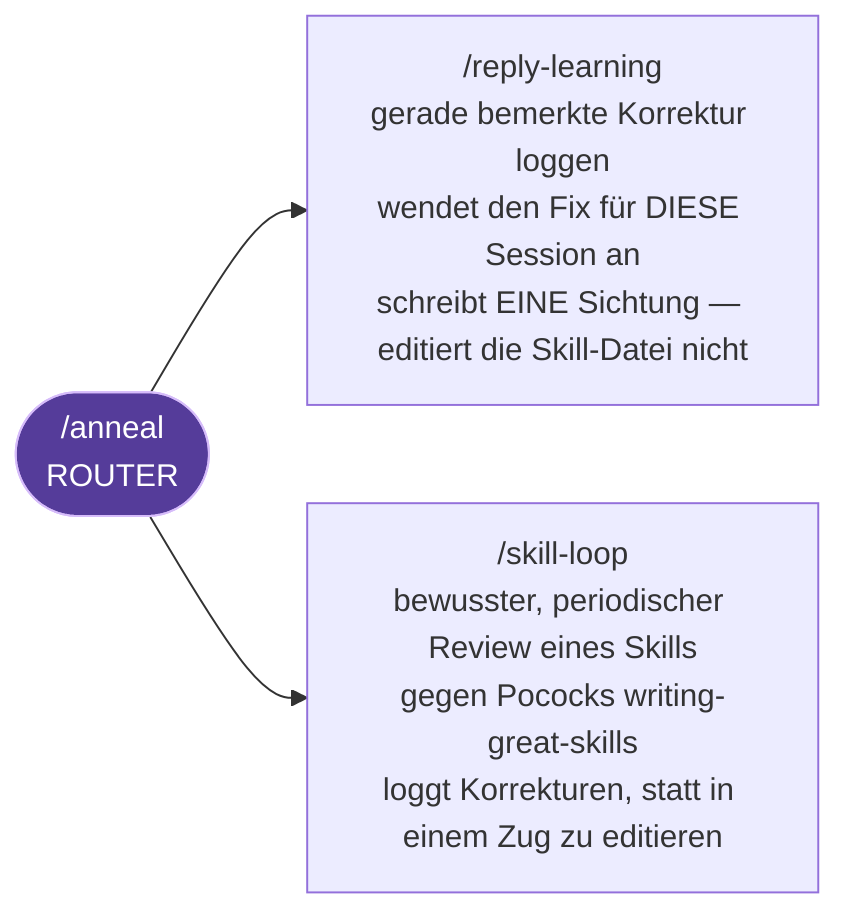

Beide **schreiben nicht die Skill-Datei**. Sie sammeln Sichtungen. Erst die zweite unabhängige Sichtung löst eine echte Änderung aus (Graduation, Forges R3). Der Vault-seitige Ablauf dazu steht in [[skill-loop-corrections-flow]].

### Atelier · `/atelier`

> *„Onboarding someone new, building a learning nugget, or handling an escalation?"*

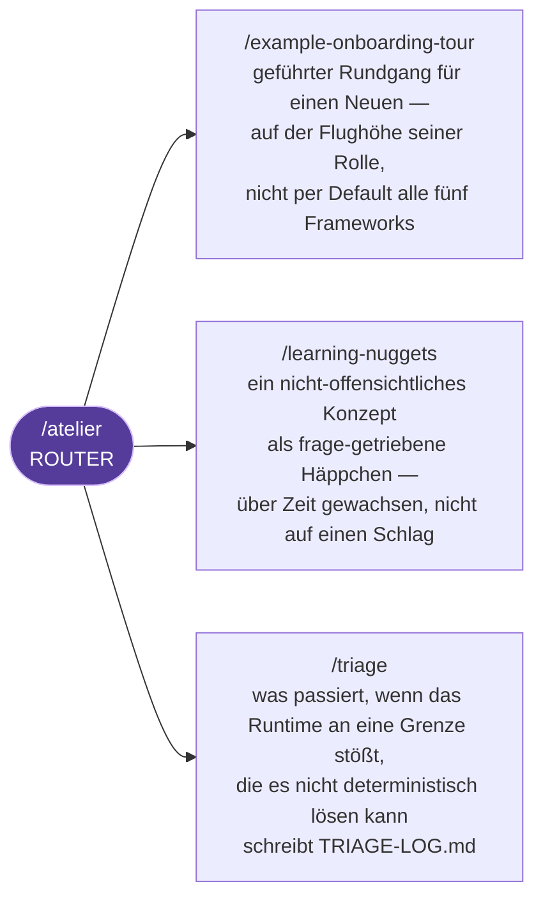

### Landscape · `/smithy`

> *„Which framework does this belong to — or is it a question about the landscape itself?"*

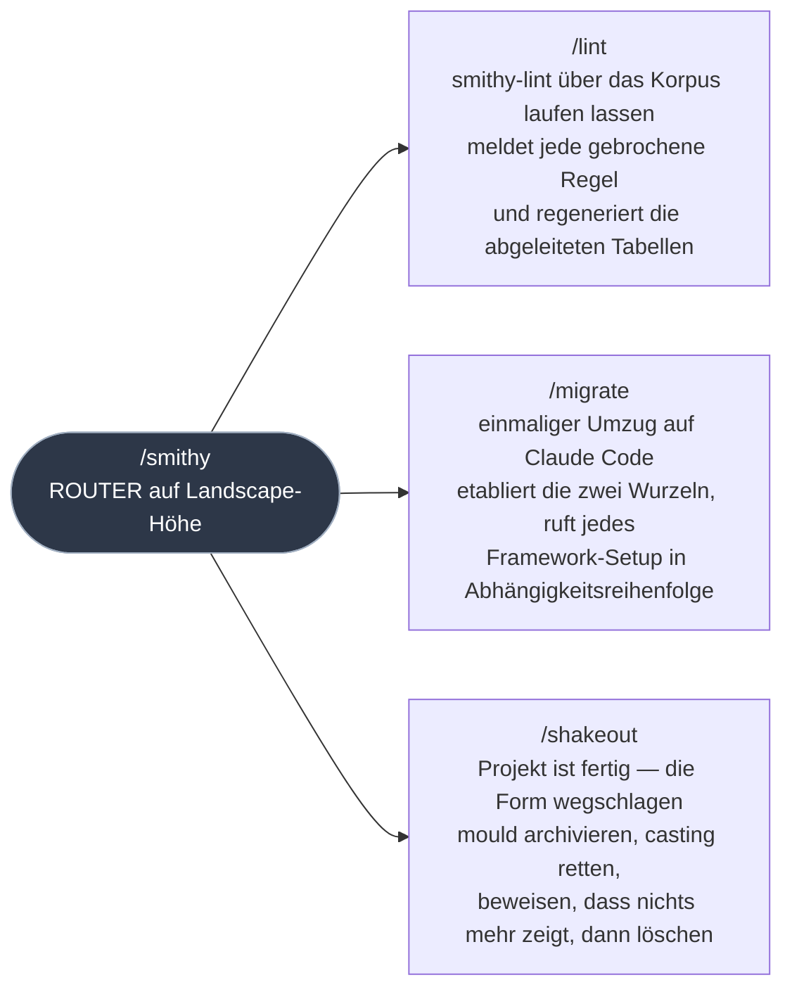

`/migrate` und `/shakeout` sind die zwei Enden desselben Lebenszyklus. `/migrate` schreibt **keine** Datei, die einem anderen Framework gehört — es ruft deren eigene Setups auf. Das Einzige, was es selbst schreibt, ist die **Phasen**-Wirbelsäule, nachgetragen auf Artefakte, die älter sind als sie: der eine Job, den kein Framework besitzt.

---

## Ebene 2 — die typisierten Artefakte (das Wiring)

Fünf Artefakte. Jedes hat benannte Producer und benannte Consumer. **Es gibt keinen anderen Kanal** — kein Framework ruft den Skill eines anderen Frameworks auf.

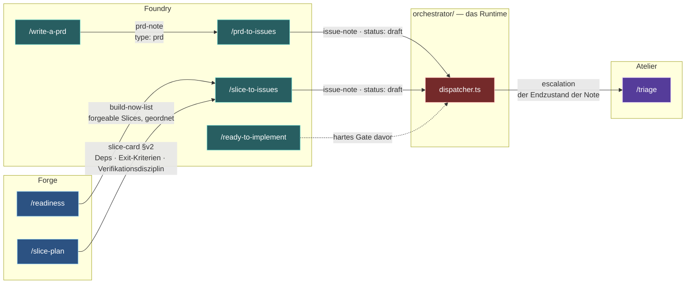

**Die Asymmetrie ist Absicht:** Der Consumer benennt, was er liest. Der Producer weiß nicht, dass er einen hat. Forge soll Foundrys Schema nicht importieren.

**Der Preis davon ist geschlossen:** Eine Änderung an der Ausgabeform eines Producers wäre ein *stiller* Bruch. `producer-reread` lässt einen Commit scheitern, der einen Producer-Schritt ändert, ohne die Datei seines Consumers zu öffnen.

**Die vier Listen von `/readiness`** — nur die ersten drei werden zu Issues:

| Liste | Was sie ist | Wird zu |
|---|---|---|
| **Build now** | forgeable Slices, geordnet | Issue-Note |
| **Build with a gate** | baubar, Gate-Check wandert in den Issue-Body | Issue-Note |
| **Park** | wartet auf einen Fakt, den jemand finden muss — mit benannter Unblock-Bedingung | **nie** eine Issue-Note |
| **Decide first** | *Fragen*, keine Slices — nicht aufschiebbare Gates mit ihren Optionen | **gar nichts** — wird vorher beantwortet |

**Decide first** ist die, die man am ehesten falsch zusammenfaltet. Ein geparkter Slice wartet auf einen Fakt. Ein Gate auf dieser Liste wartet auf eine **Entscheidung, die in dem Moment verfügbar ist, in dem man sie stellt**.

---

## Ebene 3 — die zehn geteilten Dateien

Jede hat **genau ein** schreibendes Framework und benannte Leser. Alle liegen im **pipeline-weiten Root** — dem Verzeichnis, das `TENETS.md` enthält. Keine davon liegt in einem Plugin.

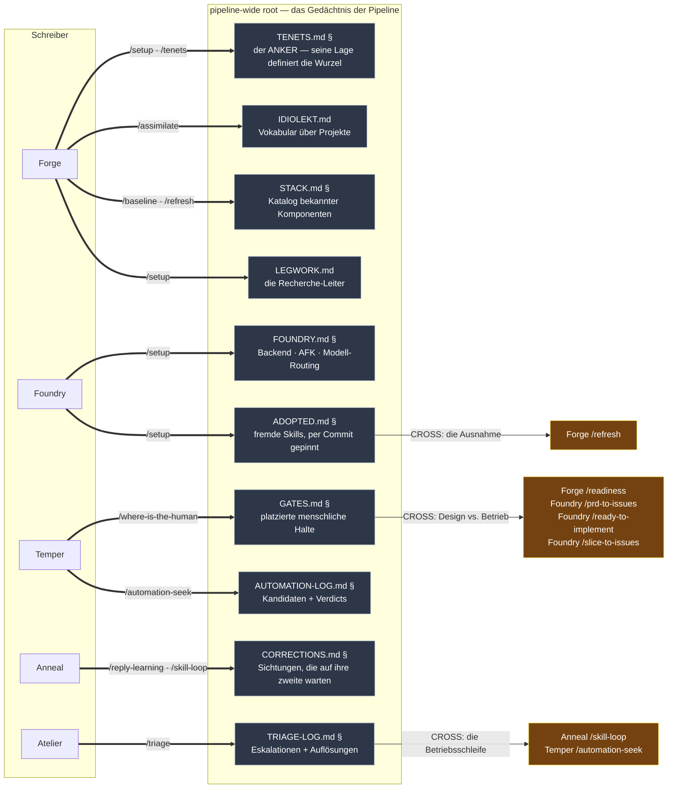

`§` = die Datei trägt eine `**Schema:** vN`-Zeile, und der besitzende Skill migriert sie beim ersten Lesen in place (`L7`).

**Die drei gelben Kanten sind die einzigen Rückkopplungen des Landscapes** — und der einzige Grund, warum es ein Landscape ist statt fünf Plugins in einem Ordner:

- **`GATES.md`** schließt die Trennung von Design und Betrieb. Temper entscheidet, dass ein Gate gehört; das Host-Framework führt es aus. Ohne Leser auf der Host-Seite läge Tempers Verdict in einer Tabelle, die niemand öffnet.
- **`TRIAGE-LOG.md`** schließt die Betriebsschleife. Wiederkehrender Schmerz wird entweder eine Skill-Korrektur (Anneal) oder ein Automatisierungskandidat (Temper) — statt für immer einzeln gelöst.
- **`ADOPTED.md`** schließt die Ausnahme. Sieben fremde Skills waren tragend und nirgends gepinnt; `/refresh` diffed sie jetzt wie jede andere Komponente.

**Vier weitere Tiers gibt es**, und sie stehen nicht in diesem Bild, weil sie nicht geteilt sind: **spec-local** (`TENETS-HOT.md`, `IDIOLEKT-HOT.md`, `readiness.md`, `lessons-learned.md`, `verification/` — liegen neben dem Spec), **doctrine** und **plugin-local** (liegen *in* einem Plugin, weil sie nur gelesen werden).

---

## Ebene 4 — Skill ruft Skill (`note_calls`)

Der einzige ungeprüfte Linktyp. Gestrichelt, weil das Präfix `note_` der Disclaimer ist.

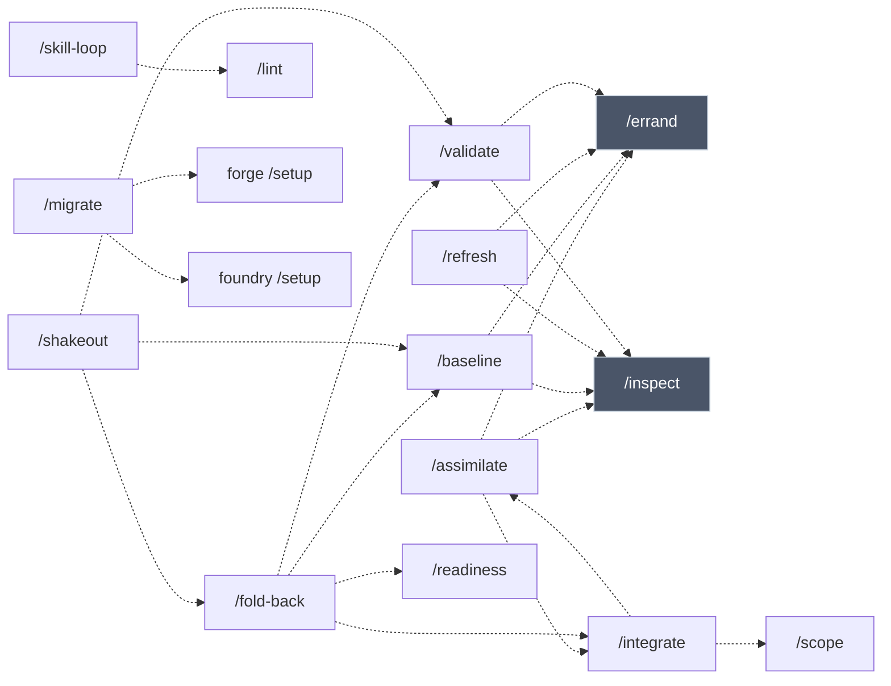

**Was auffällt:** Die vier Legwork-Skills (`/assimilate`, `/baseline`, `/refresh`, `/validate`) rufen **beide** Subroutinen. Das ist kein Zufall — sie sind die vier Skills, die etwas nachschlagen müssen, statt dich zu fragen. `/errand` isoliert eine schwere Aufgabe, `/inspect` diszipliniert das Lesen einer fremden Codebase.

`/fold-back` und `/shakeout` sind die zwei Skills, die andere *orchestrieren* statt selbst zu arbeiten — beide stehen an einem Übergang (Slice fertig · Projekt fertig).

---

## Alle Skills — die Tabelle

Zählung und Aufteilung folgen dem Anker in Ebene 0: 41 Skills, gemessen am 2026-08-08 mit `node tools/smithy-lint/lint.mjs`.

Marken in den Tabellen: **R** = Router (Einstiegspunkt des Plugins) · **MI** = modell-aufrufbar, trägt **kein** `disable-model-invocation` · **◆** = hostet ein Gate · **§** = besitzt das Schema der Datei und migriert sie beim ersten Lesen.

### Forge — 21 Skills · schreibt `TENETS.md` `IDIOLEKT.md` `STACK.md` `GAUGES.md` `LEGWORK.md`

| Skill | Was es tut | liest | schreibt | ruft |
|---|---|---|---|---|
| `/forge` **R** | Router über die anderen. Start hier, wann immer unklar ist, welcher Skill passt | 7 Dateien | — | — |
| `/setup` | Einmalig, vor dem ersten Spec: die Legwork-Leiter konfigurieren (Recherche, Paper, Video, Codebase) | LEGWORK · STACK | TENETS § · LEGWORK | — |
| `/assay` | Rohes Thema mit Tier-1-Recherche anreichern und zu einem Proto-Scope strukturieren — **oder** das Urteil, dass es keinen Spec verdient. Beim mittleren Urteil („verdient einen Spec, aber nicht in einem Zug") wird jede scharf stellbare Frage zur **Spec-Task** | — | exploration.md | spec-tasks |
| `/spec-tasks` | Das Hauptbuch der offenen Fragen, in beide Richtungen: Fragen raus als Notizen, Findings zurück in die Zeile, aus der sie kamen. Einziger Schreiber des Schemas für drei Aufrufer | SPEC-TASK-FORMAT | spec-tasks/ · exploration.md | — |
| `/scope` | Was der Spec abdeckt: Minimalumfang, was ausdrücklich draußen ist, externe Abhängigkeiten, Exit-Kriterium des Specs. Liest zuerst die **Karte** und zoomt in die Findings — ein Scope aus Ein-Zeilen-Gists liest sich zitiert und ist es nicht | exploration.md · spec-tasks/ | — | — |
| `/gauge` | Einen Fakt, an den sich **zwei** Specs halten müssen, benennen und versionieren — Notiz-Schema, Datenformat, Einheit, Reihenfolge. Danach zeigen beide Specs auf den Namen statt aufeinander, und die Reihenfolgefrage zwischen ihnen entfällt. `/scope` Schritt 3 ruft es, wenn ein System zum zweiten Mal auftaucht | GAUGES · GAUGES-HOT · STACK | GAUGES § · GAUGES-HOT § | — |
| `/tenets` | Bestätigen, welche pipeline-weiten Haltungen für diesen Spec gelten; neue **hot tenets** aus seinen Anforderungen abstrahieren | TENETS · TENET-CANDIDATES | TENETS · TENETS-HOT § | — |
| `/baseline` | Die externen Abhängigkeiten in ein echtes Installations-Runbook verwandeln — installieren, Version pinnen, Rauchtest als **proof script** aufheben | STACK · LEGWORK · GUARDRAILS | STACK § · verification/ | errand · inspect |
| `/skeleton` | Das Architektur-Skelett zeichnen — Komponenten und Verbindungen, auf Papier, vor jedem Implementierungsdetail | — | — | — |
| `/variability` | Trennen, was fest ist und was tauschbar: jede Komponente **invariant** oder **Variationspunkt**, mit Kopplung und geplanten Alternativen | TENETS-HOT | — | — |
| `/validate` | Jede Annahme, auf der der Spec steht, sichtbar machen und gegen eine **lebende Quelle** prüfen — nie gegen das Gedächtnis. Ein Blocker, den der Durchgang *nicht* klären konnte, wird zur Spec-Task statt still als geprüft zu gelten | — | verification/ | errand · inspect · spec-tasks |
| `/slice-plan` | Den Build in vertikale Slices ordnen — jeder ende-zu-ende, mit Deps und prüfbaren Exit-Kriterien | — | — | — |
| `/readiness` ◆ | **Gate (weich):** welche Slices sind jetzt sicher baubar? Vier Listen: Build now · Build with a gate · Park · Decide first — letztere wird zu Spec-Tasks, damit die Fragen eine spätere Session erreichen | GATES | readiness.md § | spec-tasks |
| `/whitepaper` | Den Spec in ein Whitepaper übersetzen — dieselben Fakten, anderes Register, für Menschen statt Build-Agenten. Läuft **nach** `/readiness` oder bricht ab | — | — | — |
| `/assimilate` | Den Jargon einer fremden Idee in dein etabliertes Vokabular übersetzen, **bevor** sie in einen Spec kommt. Konflikte sichtbar machen | IDIOLEKT · IDIOLEKT-HOT · LEGWORK | IDIOLEKT · IDIOLEKT-HOT | errand · inspect · integrate |
| `/integrate` | Eine neue Idee in einen bestehenden Spec routen: **round** (begrenzte Änderung, die meisten), **variation document** (spekulativ, daneben) oder **rewrite** (selten — nur wenn eine Invariante fällt) | IDIOLEKT · IDIOLEKT-HOT · TENETS-HOT · STACK | — | assimilate · scope |
| `/refresh` | Haben die Komponenten des Specs neue Versionen, Patches oder bessere Alternativen? Gegen lebende Quellen geprüft, dann durch `/integrate` geroutet | ADOPTED · STACK · LEGWORK · TENETS-HOT · verification/ | STACK | errand · inspect |
| `/fold-back` | Was ein fertiger Build **wirklich gezeigt** hat, zurück in den Spec falten: jeden Befund klassifizieren, an die besitzende Datei routen, Readiness neu laufen lassen | STACK · TENETS-HOT | — | validate · integrate · baseline · readiness |
| `/teach-alongside` | Durchgehende Lehre während der Spec-Arbeit: bei jeder echten Entscheidung eine kurze Lektion, gebunden an die Wahl, die gerade ansteht | — | lessons-learned.md | — |
| `/errand` **MI** | Eine zu schwere Legwork-Aufgabe in eine isolierte Session verlagern (neuer Chat oder Sub-Agent) und **nur den Befund** zurückfalten | LEGWORK · STACK · IDIOLEKT | — | — |
| `/inspect` **MI** | Eine fremde Codebase für **eine** begrenzte Frage erschließen: Struktur vor Detail, öffentliche Oberfläche vor Implementierung, eine zitierte Datei vor „reicht" | LEGWORK | — | — |

### Foundry — 6 Skills · schreibt `FOUNDRY.md` `ADOPTED.md`

| Skill | Was es tut | liest | schreibt | Artefakt |
|---|---|---|---|---|
| `/foundry` **R** | Router. Die Skill-Schicht zwischen einem forgeable Slice (oder einer frischen Idee) und der Pipeline, die es wirklich laufen lässt | FOUNDRY · GATES | — | — |
| `/setup` | Einmalig: IssueStore-Backend, AFK-Sicherheits-Defaults und Modell-Routing wählen — **bevor** die erste PRD- oder Issue-Note existiert | — | FOUNDRY § · ADOPTED § | — |
| `/write-a-prd` | Eine aufgelöste `grill-me`-Session in **eine** PRD-Note mit der Frontmatter dieser Pipeline. Bei jeder großen Änderung **ganz neu geschrieben**, nie inkrementell geflickt | FOUNDRY | — | produces `prd-note` |
| `/prd-to-issues` | PRD-Note → Issue-Notes. Die eine Stelle im Framework mit einem echten Urteilscall: horizontal vs. vertikal — weil nichts stromaufwärts das aufgelöst hat | FOUNDRY · GATES | — | consumes `prd-note` · produces `issue-note` |
| `/slice-to-issues` | Forgeable Slice → Issue-Notes. Weitgehend mechanisch, weil Forges Vertikal-nur-Design den Urteilscall schon getroffen hat | GATES · FOUNDRY · readiness.md | — | consumes `build-now-list` + `slice-card` · produces `issue-note` |
| `/ready-to-implement` ◆ | **Hartes Gate.** Der eine Punkt der Pipeline, an dem ein *Mensch* — nicht die Maschine — entscheidet, dass Arbeit sicher an einen Agenten geht | TENETS · GATES · FOUNDRY · readiness.md | — | consumes `issue-note` |

### Temper — 3 Skills · schreibt `GATES.md` `AUTOMATION-LOG.md`

| Skill | Was es tut | liest | schreibt |
|---|---|---|---|
| `/temper` **R** | Router. Entscheidest du, *wo ein Gate hingehört*, oder *ob Automatisierung sich lohnt*? | GATES · AUTOMATION-LOG | — |
| `/where-is-the-human` | Einen Workflow, Skill oder eine Framework-Erweiterung darauf prüfen, wo ein menschliches Gate hingehört, ob **hart oder weich**, und welche Optionen der Mensch dort sieht | GATES | GATES § |
| `/automation-seek` | Auf einer Kadenz prüfen, ob ein manueller Schritt Automatisierung wert ist — **gewogen gegen das, was verloren ginge**, wenn ein Gate versehentlich wegautomatisiert würde | AUTOMATION-LOG · GATES · TRIAGE-LOG | AUTOMATION-LOG § |

### Anneal — 3 Skills · schreibt `CORRECTIONS.md`

| Skill | Was es tut | liest | schreibt |
|---|---|---|---|
| `/anneal` **R** | Router. Reviewst du bewusst einen Skill, oder loggst du etwas, wofür der Agent gerade korrigiert wurde? | CORRECTIONS | — |
| `/reply-learning` | Eine gerade bemerkte Korrektur loggen — Feedback, das sagt, die *Anweisungen* eines Skills seien falsch. Wendet den Fix für den Rest der Session an und schreibt **eine Sichtung**, ohne die Skill-Datei zu ändern | CORRECTIONS | CORRECTIONS |
| `/skill-loop` | Bewusster, periodischer Review eines Skills gegen Pococks `writing-great-skills`. Loggt Korrekturen, statt in einem Durchgang zu editieren. Ruft `/lint` | CORRECTIONS · TRIAGE-LOG | CORRECTIONS § |

### Atelier — 4 Skills · schreibt `TRIAGE-LOG.md`

| Skill | Was es tut | liest | schreibt |
|---|---|---|---|
| `/atelier` **R** | Router. Onboarding, Learning-Nugget oder Eskalation? | TRIAGE-LOG | — |
| `/example-onboarding-tour` | Einen geführten Rundgang durch die Pipeline für einen Neuen bauen — auf der Flughöhe, die seine **Rolle** braucht, nicht per Default das ganze Fünf-Framework-Bild | — | — |
| `/learning-nuggets` | Ein nicht-offensichtliches Pipeline-Konzept in eine frage-getriebene, mundgerechte Onboarding-Einheit verwandeln — als wachsende Sammlung über Zeit, nicht auf einen Schlag geschrieben | — | — |
| `/triage` | Was passiert, wenn das Runtime an eine Grenze stößt, die es nicht deterministisch lösen kann — Stuck-Worker-Timeout, Merge-Konflikt, rote Suite nach dem Retry-Budget — und an einen Menschen übergibt | TRIAGE-LOG | TRIAGE-LOG § |

### Landscape (Plugin: `smithy`) — 4 Skills · schreibt `OPEN.md` `CONSISTENCY.md` (nur aus einem **source repo**)

| Skill | Was es tut | liest | schreibt |
|---|---|---|---|
| `/smithy` **R** | Router auf Landscape-Höhe: zu welchem der fünf Frameworks gehört eine Frage — die `L`-Regeln anwenden, wenn das Landscape selbst erweitert wird, und einer heimatlosen Lücke einen Owner geben | OPEN · CONSISTENCY | OPEN · CONSISTENCY |
| `/lint` | `smithy-lint` über das Korpus laufen lassen — die mechanische Hälfte der Doktrin, entschieden statt erinnert. Meldet jede gebrochene Regel und regeneriert die abgeleiteten Tabellen | — | — |
| `/migrate` | Einmaliger Umzug einer bestehenden Pipeline auf Claude Code: die zwei Wurzeln etablieren, jedes Framework-Setup in Abhängigkeitsreihenfolge rufen, die **Phasen**-Wirbelsäule nachtragen. Schreibt **nie** eine Datei, die einem anderen Framework gehört | TENETS · ADOPTED | — |
| `/shakeout` | Ein mit smithy gebautes Projekt ist fertig — die **Form** wegschlagen. Routen, was es überlebt, beweisen, dass nichts mehr auf das Zeigt, was gelöscht wird, archivieren, löschen. Das andere Ende des Lebenszyklus, den `/migrate` öffnet | TENETS · CORRECTIONS | — |

---

## Der Skill, den es absichtlich nicht gibt

`/gate-check` **existiert nicht** — und das ist eine Entscheidung, keine Lücke. `registry.json` trägt den Grund:

> *`MIGRATION.md` Schritt 9 und `/migrate` benutzen ihn als Negativtest: eine Session, die gebeten wird, „füge Anneal ein `/gate-check`-Skill hinzu", und das anbietet, hat die Doktrin nicht gelesen. Ihn real zu machen, würde den Test kaputtmachen, für den er existiert.*

Wenn du je einen Vorschlag siehst, `/gate-check` zu bauen — er ist gerade durchgefallen.

---

## Was hier bewusst **nicht** eingezeichnet ist

- **Die adoptierten Skills.** `/tdd`, `/grill-me`, `/code-review`, `/domain-modeling`, `/codebase-design`, `/improve-codebase-architecture`, `research` sind fremde Skills, unverändert installiert und per Commit in `ADOPTED.md` gepinnt. Sie gehören keinem Framework, sie werden *benutzt*. Praxis dazu: [[legwork-dispatch-lanes]] und [[tool-basis-usage]].
- **Der vault-lokale `legwork`-Agent.** Liegt in `.claude/agents/`, ist das Ziel von `/errand` im orchestrierten Modus — smithy kennt ihn nicht. Siehe [[model-effort-split]].
- **Die vier Vault-Hooks.** Sie schlagen Skills *vor*, rufen aber nichts auf. Übersicht: `.claude/hooks/README.md`.
- **Die Reihenfolge innerhalb eines Skills.** Jeder Skill hat Schritte mit Abnahmekriterien; die stehen in der jeweiligen `SKILL.md` und werden hier nicht gespiegelt — das wäre eine zweite Wahrheit, die driftet.

---

## Verwandte Notizen

[[system-strengths]] · [[idea-intake-routing]] · [[lightweight-exits]] · [[legwork-dispatch-lanes]] · [[skill-loop-corrections-flow]] · [[open-gaps-flow]] · [[workspace-levels]]
