# Wo liegt was, und in welchem Ordner starte ich

**Die Antwort zuerst.** Es gibt **zwei Wurzeln**, sie liegen **nebeneinander**, und zwischen ihnen wandert **keine Datei**.

```
C:\Users\nolte\Desktop\
├── C\            ← Vault. DENKEN. Hier startest du /forge und /foundry.
└── zaehlen\      ← Projekte. BAUEN. Hier startest du die Build-Session.
```

`zaehlen\` ist ein **Geschwisterordner** des Vaults, kein Unterordner. Das ist der Grund für fast jede Verwechslung hier, und es ist auch der Grund, warum die Trennung mechanisch erzwungen ist statt nur vereinbart.

## Warum forge nie im Projektordner läuft

Jeder forge- und foundry-Skill liest `TENETS.md`, `LEGWORK.md`, `STACK.md`, `ADOPTED.md`, `FOUNDRY.md`. Die liegen alle direkt im Vault-Root. Und die **pipeline-wide root** ist definiert als *„der Ordner, der `TENETS.md` enthält"* (`/forge:setup` Schritt 0).

Von `zaehlen\<projekt>\` aus führt kein Pfad nach oben zu dieser Datei — es ist ein Nachbar, kein Kind. Ein forge-Skill, dort gestartet, findet **nichts**. Es gibt auch keine Brücke: smithy kennt `CLAUDE_VAULT_PATH` nicht, das ganze Repo enthält den Namen kein einziges Mal (geprüft 2026-08-05).

**Der Beweis liegt auf der Platte.** `zaehlen\wiki_api-retriever\` ist ein fertig gebautes Projekt. Sein vollständiger Inhalt:

```
.claude\  .git\  .gitignore  CLAUDE.md  GUARDRAILS-INSTALLED.md  claude-log\  gates\
```

Kein `exploration.md`, kein `scope.md`, kein `spec-tasks\`, kein `TENETS-HOT.md`, kein `verification\`. Der Spec ist nie dort gewesen.

## Wer wo läuft

| Session startet in | Skills | Was dort entsteht |
|---|---|---|
| `C\` (Vault) | `/forge`, `/foundry`, `/temper`, `/anneal`, `/atelier`, `/smithy` | `specs\<idee>\` mit allem darin |
| `zaehlen\<projekt>\` | `/tdd`, `/code-review`, Gates, Build-Agenten | Code, `gates\`, `GUARDRAILS-INSTALLED.md` |

## Der Ablauf einer Idee — und was nach jedem Schritt auf der Platte liegt

```mermaid
flowchart TB
    subgraph V["C\\ — Vault"]
        direction TB
        A["raw\\<br/>du wirfst rein"]
        B["/assay → exploration.md"]
        C["/scope → scope.md"]
        D["/tenets → TENETS-HOT.md"]
        E["/baseline → STACK.md + verification\\<br/>Step 3a bindet die Guardrails"]
        F["/skeleton · /variability · /validate"]
        G["/slice-plan · /readiness → readiness.md"]
        H["/slice-to-issues → Issue-Notes"]
        R["/fold-back<br/>Funde an ihre Besitzer"]
        A --> B --> C --> D --> E --> F --> G --> H
    end
    subgraph Z["zaehlen\\&lt;projekt&gt;\\ — Projekt"]
        P["Ordner anlegen + init-project.mjs"]
        S["--stack=&lt;name&gt;<br/>erst NACH /baseline"]
        Q["Agenten bauen Code"]
        P --> S --> Q
    end
    E -.->|"ERST HIER wird ein Projekt nötig"| P
    E ==>|"bewiesene Config → .claude\\guardrails\\"| S
    H ==>|"Issue-Notes, keine Dateien"| Q
    Q ==>|"der Build ist die stärkste live source"| R
    R -.->|"/readiness neu"| G

    classDef vault fill:#2c5282,stroke:#90cdf4,color:#fff
    classDef proj fill:#742a2a,stroke:#feb2b2,color:#fff
    class A,B,C,D,E,F,G,H,R vault
    class P,Q,S proj
```



| Nach diesem Schritt | liegt im Vault | Projekt nötig? |
|---|---|---|
| Idee kommt auf | `specs\<idee>\raw\` — von dir gefüllt | nein |
| `/assay` | `+ exploration.md` (ggf. `+ spec-tasks\`) | nein |
| `/scope` | `+ scope.md` | nein |
| `/tenets` | `+ TENETS-HOT.md` | nein |
| **`/baseline`** | `+ verification\`; `STACK.md` und `REVIEW-STANDARDS.md` im Root | **ja — jetzt** |
| `/skeleton` | `+ skeleton.md` | nein |
| `/variability` | `+ variability.md` | nein |
| `/slice-plan` | `+ slice-plan.md` | nein |
| `/validate` | `+ assumptions.md` | nein |
| `/readiness` | `+ readiness.md` | nein |
| `/slice-to-issues` | Issue-Notes | — |
| Agenten bauen | unverändert | ja |
| `/fold-back` | Funde an ihre Besitzer verteilt, `readiness.md` neu | nein |

**Eine Datei pro Schritt, kein wachsendes Sammeldokument — entschieden am 2026-08-24.** Bis dahin stand hier „wächst im Spec", und das beschrieb smithys Voreinstellung: `/skeleton`, `/variability` und `/slice-plan` verlangen wörtlich, ihr Ergebnis stehe *„in the spec file"*. Eine solche Datei hat im Vault nie jemand angelegt. `/scope` und `/validate` tragen einen Rückfall — *„or to `scope.md` if the spec file doesn't exist yet"* —, der beim ersten Lauf griff, und ab da lief alles im Rückfallzweig. `wiki-api-retriever` sieht deshalb so aus, wie die Tabelle es jetzt beschreibt.

**Der Ausschlag gab nicht Geschmack, sondern die Statusleiste.** Sie schließt aus vorhandenen Dateien auf den offenen Schritt. Bei einer wachsenden Datei kann sie das nicht — sie müsste Abschnitte lesen und zeigte deshalb nur die Spanne `/skeleton…/slice-plan`. Bei einer Datei pro Schritt reicht ein `ls`, und seit dem 2026-08-24 nennt sie den Schritt beim Namen. Dasselbe gilt für dich beim Wiedereinstieg ohne Transkript.

**Was offen bleibt und smithy gehört:** `/skeleton` hat als einziger der drei keinen Rückfall. Es liest *„from the spec file or `scope.md`"* und schreibt *„to the spec file"* — ohne Angabe, was bei fehlender Spec-Datei gilt. Im Vault ist die Frage jetzt durch Regel 11 in `CLAUDE.md` beantwortet; stromaufwärts ist sie es nicht.

**`/baseline` ist der einzige Übergang.** Es ist der Schritt, der Abhängigkeiten *wirklich installiert* — davor gibt es nichts zu installieren, also braucht es auch keinen Ordner dafür. Ab da existieren beide Wurzeln parallel, und der Spec bleibt trotzdem im Vault.

**Auch `verification\` bleibt im Vault**, obwohl es lauffähige Skripte sind. Das Glossar sagt es wörtlich: *„evidence for the spec, not part of the build — the proof script itself is never a build deliverable."* `/refresh` lässt sie später erneut laufen, wenn eine Version gewandert ist. Sie gehören dem Spec, nicht dem Code.

## Was die zwei Wurzeln verbindet

**Issue-Notes, keine Dateien.** `/readiness` sagt, welche Slices baubar sind → Foundry macht Issue-Notes daraus → der Orchestrator liest sie und schickt Agenten ins Projekt. Der Spec wird nie kopiert, nie verschoben, nie gespiegelt.

Das ist auch der Grund für die Trennung: ein Spec ist als *„living design document that survives many builds"* definiert. Läge er in Projektordner Nr. 1, fände Build Nr. 2 ihn nicht mehr.

## Der Ablauf, Schritt für Schritt

Die Spalte **cwd** ist die wichtigste: sie sagt, wo die Session laufen muss.

| #   | Was                       | cwd                      | Befehl                                                                     |
| --- | ------------------------- | ------------------------ | -------------------------------------------------------------------------- |
| 1   | Ideen-Ablage anlegen      | `C\`                     | `node .claude/scripts/new-idea.mjs "Name der Idee"`                        |
| 2   | `raw\` füllen             | —                        | von Hand, unsortiert, jedes Format                                         |
| 3   | Lehre anschalten *(opt.)* | **`C\`**                 | `/teach-alongside`                                                         |
| 4   | Erschließen               | **`C\`**                 | `/assay`, dann den Ordner nennen                                           |
| 5   | Carven                    | **`C\`**                 | `/scope` → `/tenets`                                                       |
| 6   | **Projekt anlegen**       | —                        | `mkdir …\zaehlen\<projekt>`                                                |
| 7   | Projekt anschließen       | egal                     | `init-project.mjs …\zaehlen\<projekt>` **[`--orchestrator`]**              |
| 8   | Umgebung + Guardrails     | **`C\`**                 | `/baseline` — Step 3a bindet die Regeln und beweist jede mit einem Fixture |
| 8b  | Bewiesene Config sichern  | —                        | ablegen unter `C\.claude\guardrails\<stack>\`                              |
| 8c  | Guardrails ins Projekt    | egal                     | `init-project.mjs …\zaehlen\<projekt> --stack=<stack>`                     |
| 9   | Entwerfen und prüfen      | **`C\`**                 | `/skeleton` → `/variability` → `/validate`                                 |
| 10  | Schneiden, Go/No-Go       | **`C\`**                 | `/slice-plan` → `/readiness`                                               |
| 11  | Issues                    | **`C\`**                 | `/foundry` → `/slice-to-issues` → `/ready-to-implement`                    |
| 12  | Bauen                     | **`zaehlen\<projekt>\`** | zweite Session, oder unbeaufsichtigt (s. Schritt 7)                        |
| 13  | **Rückweg**               | **`C\`**                 | `/fold-back`, danach `/readiness` erneut                                   |

**Schritt 6–7 gehören zu Schritt 8, nicht an den Anfang.** Vorher gibt es nichts zu installieren. Und der Projektordner muss **vorher existieren** — `init-project.mjs` bricht sonst ab; es macht einen vorhandenen Ordner zum Projekt, es legt keinen an.

**Der Projektordner muss nicht heißen wie die Idee.** Die Idee ist eine Frage, das Projekt ist ein Produkt. Aus einer Idee können zwei Projekte werden, und aus keiner Idee auch mal keins.

### Schritt 5 — was `/scope` beim **zweiten** Spec zusätzlich tut

Ab dem zweiten Spec im selben `specs\` prüft `/scope` Schritt 3 die Abhängigkeitstabelle gegen die anderen Spec-Ordner. Nennt ein anderer Spec dasselbe System, ist das eine zweite Sichtung, und `/scope` ruft `/gauge` — der benennt den geteilten Fakt und schreibt ihn nach `GAUGES.md` in den Vault-Root.

**Das ist die Antwort auf „mein Projekt besteht aus mehreren Domänen, die alle voneinander abhängen".** Beide Specs zeigen danach auf denselben Namen statt aufeinander, und damit gibt es zwischen ihnen keine Reihenfolge mehr. Ein Fakt aus nur einem Spec bleibt lokal als `GAUGES-HOT.md` neben diesem Spec — dieselbe Zwei-Sichtungen-Regel wie bei Haltungen und Vokabular.

Was das Skript findet und was nicht: `node smithy/tools/spec-gauges.mjs candidates` vergleicht **Systemnamen**, weil die Eigennamen sind und nicht umbenannt werden. Zwei Specs, die denselben Fakt teilen, ohne ein gemeinsames System zu nennen, findet es nicht — dafür stellt `/scope` dieselbe Frage noch einmal an dich, und `/fold-back` fängt, was beide übersehen haben.

### Schritt 3 — warum `/teach-alongside` vorne steht oder gar nicht

`forge/README.md` führt es als **Schritt 1** der Kalt-Kette: *„turn teaching on first, so every decision below comes with its why."* Es schreibt `lessons-learned.md`, **während** eine Entscheidung fällt. Später eingeschaltet holt es nichts nach — das Warum von gestern ist dann weg. Optional ja, nachrüstbar nein.

### Schritt 7 — `--orchestrator` ist eine Entscheidung, keine Option für später

`pipeline.config.json` entsteht **nur** mit diesem Flag, und `register-orchestrator-task.ps1` braucht sie als `-Config`. Die Frage *„baue ich von Hand in einer zweiten Session, oder soll das unbeaufsichtigt laufen?"* wird deshalb hier beantwortet, nicht bei Schritt 12. Von Hand bauen geht immer und braucht nichts davon.

### Schritt 8b/8c — die Guardrail-Schleife, und warum `--stack` beim ersten Mal nichts tut

`/baseline` Step 3a entscheidet die Guardrails, aber alles, was es schreibt, landet **im Vault**: das Fixture in `verification\`, die nicht maschinell prüfbare Hälfte in `REVIEW-STANDARDS.md`. `writes: [STACK.md, REVIEW-STANDARDS.md, verification/]` — kein einziger Pfad im Projekt.

Ins Projekt kommen die Regeln erst über `init-project.mjs --stack=<name>`. Ohne das Flag meldet das Script wörtlich *„Guardrail-Vorlage: nichts kopiert"*.

**Und beim ersten Projekt eines Stacks hat `--stack` nichts zu kopieren.** Das ist Absicht, nicht ein Fehler — `init-project.mjs` begründet es in seinem eigenen Kopfkommentar:

> *„Was dieses Script bewusst NICHT tut: eine fertige Linter-Konfiguration erfinden. Ein Regelname ist ein lebender Fakt; er wird in `/baseline` Step 3a gegen die echte Doku geprüft und dann als Vorlage unter `<Vault>/.claude/guardrails/<stack>/` abgelegt. Vorher gibt es für diesen Stack nichts zu kopieren."*

Deshalb ist es eine Schleife: **beweisen → als Vorlage sichern → verteilen.** Die Vorlage entsteht in 8b, und ab dem zweiten Projekt desselben Stacks ist 8c ein Einzeiler. `C\.claude\guardrails\` enthält heute nur eine `README.md` — es gibt noch **keinen** Stack, dein erstes Projekt legt ihn an.

**Warum das Vergessen teuer ist:** `init-project.mjs` schreibt `GUARDRAILS-INSTALLED.md` immer — mit Kopf, Schema und leerer Tabelle. Die Datei erklärt ihre eigene Leere ausdrücklich für in Ordnung:

> *„Leer ist ein korrekter Zustand für ein neues Projekt — nicht ein fehlender."*

Ein Projekt, in dem die Guardrails nie ankamen, sieht also nicht verdächtig aus. Es sieht **fertig** aus. In `zaehlen\wiki_api-retriever\` ist genau das der Stand: `gates\` enthält nur eine `README.md`, im Root liegt keine einzige `*.config.*`.

### Schritt 13 — der Rückweg, ohne den der Spec aus dem Takt läuft

Ein fertiger Slice ist die stärkste **live source**, die das Framework hat: er hat das Ding ausgeführt, statt darüber zu lesen. `/fold-back` klassifiziert jeden Fund und routet ihn an die Datei, der er gehört — und ruft danach `/readiness` neu. Es orchestriert das selbst (`note_calls: [validate, integrate, baseline, readiness]`), du rufst nur einen Skill.

Zeitkritisch: laufen lassen, solange die Funde noch einem Lauf zuzuordnen sind. Eine Woche später überleben die Korrekturen, die Zuordnung nicht.

### Die Fallen in diesem Ablauf

Die ersten vier kosten dich eine Runde. Die letzten zwei merkst du erst viel später — sie erzeugen keine Fehlermeldung.

| Fehlannahme | Was wirklich gilt |
|---|---|
| Session im Ideen-Ordner starten (`specs\<idee>\`) | **Vault-Root `C\`.** Dort liegen `TENETS.md`, `LEGWORK.md`, `STACK.md` — eine Ebene tiefer ist der Ordner mit diesen Dateien nicht mehr das Arbeitsverzeichnis |
| Session im Projektordner starten | Findet gar nichts. `zaehlen\` ist ein **Nachbar** des Vaults; es führt kein Pfad nach oben zu `TENETS.md`, und smithy kennt `CLAUDE_VAULT_PATH` nicht |
| Projekt gleich am Anfang anlegen | Erst bei `/baseline`. Drei Skills davor arbeiten reinen Text |
| smithy muss noch installiert werden | Ist es. **Einmal pro Maschine**, user-scope, seit 2026-07-24 — der Marketplace ist als *Ordnerpfad* auf `C\smithy` registriert, nicht als Repo-Klon |
| `/forge:setup` im Projektordner laufen lassen | Erzeugt dort eine **zweite `TENETS.md`**. Schritt 0 warnt wörtlich: *zwei Anker sind schlimmer als keiner, weil jedes Framework still einen anderen wählt — ohne Fehlermeldung*. Kein Check findet das später |
| `init-project.mjs` einmal laufen lassen und die Guardrails für erledigt halten | Ohne den zweiten Lauf mit `--stack` kommt **keine** Regel im Projekt an. Und es fällt nicht auf: `GUARDRAILS-INSTALLED.md` erklärt seine leere Tabelle selbst für korrekt, `gates\` enthält nur eine README. Ein Projekt ohne Guardrails sieht aus wie ein Projekt, das sie bestanden hat |
| Nach dem Build zum nächsten Slice weitergehen | `/fold-back` erst. Ein Build ist die stärkste **live source** im Framework; ohne den Rückweg läuft der Spec nach dem ersten Bauen aus dem Takt, und die Zuordnung der Funde zu einem Lauf verfällt binnen Tagen |
| `raw\` von Hand anlegen und leer lassen | Git speichert keine leeren Verzeichnisse — nach dem nächsten Klon ist der Ordner spurlos weg. Genau so ist der frühere `pipeline\`-Ordner verschwunden, ohne dass es auffiel. `new-idea.mjs` legt deshalb eine `.gitkeep` mit an |

### Nach einer smithy-Änderung

Der installierte Stand ist eine **Kopie** unter `~\.claude\plugins\cache\`, festgehalten an einem Commit — nicht der Arbeitsbaum. Eine Änderung wirkt erst nach:

```
/plugin marketplace update smithy
/plugin update forge
```

und einer neuen Session. Ein Neustart allein reicht nicht ([[plugin-update-flow]]). Und erst committen: der Installationseintrag merkt sich einen `gitCommitSha`.

Details zu `new-idea.mjs` und warum es `exploration.md` & Co. bewusst **nicht** anlegt: [`.claude\scripts\README.md`](../.claude/scripts/README.md).

## Was diese Notiz **nicht** beantwortet

- **Welchen Weg nehme ich überhaupt** (direkt bauen · PRD · Spec · Maschinerie) → [[skill-map]], Ebene −1.
- **Welcher Skill macht was** → [[skill-map]], die Tabelle.
- **Was zwischen einem Agenten und `main` steht** → [[orchestrator-map]].
- **Wie die Ebenen Nutzer/smithy/Projekt sich abgrenzen** → [[workspace-levels]].

Diese Notiz beantwortet nur: *in welchem Ordner stehe ich, und was liegt dort.*

## Verwandte Notizen

[[skill-map]] · [[workspace-levels]] · [[orchestrator-map]] · [[idea-intake-routing]]
